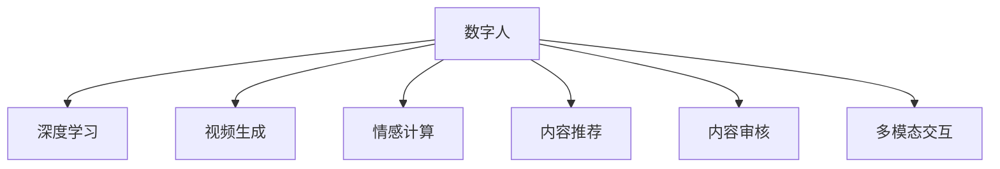

                 

## 1. 背景介绍

### 1.1 问题由来
随着互联网技术的发展，短视频平台如抖音、快手等成为人们获取信息、娱乐和社交的重要方式。然而，短视频内容主要依赖人工创作，尽管平台推出了“人人皆为创作者”的口号，但实际上传内容仍以少数专业创作者为主，高成本和低产出的问题始终未能根本解决。与此同时，短视频平台的内容审核和推荐系统也面临巨大压力，用户体验亟需提升。

数字人技术的应用，为解决这些问题提供了新的思路。数字人，即基于人工智能技术生成的虚拟人物，具有高度仿真、高交互性和强代入感的特点，能够高效生成优质视频内容，同时有效辅助平台进行内容推荐和审核。数字人技术在短视频领域的应用前景广阔，有望成为未来行业发展的趋势。

### 1.2 问题核心关键点
数字人技术在短视频中的应用，主要聚焦于以下几个核心关键点：

- 视频内容生成：通过深度学习生成高质量的视频内容，实现内容自动化生产。
- 情感与交互：使数字人能够根据视频内容自动调整语气、表情和动作，与观众建立情感共鸣。
- 内容推荐与审核：利用数字人的广泛影响力和高可信度，辅助平台进行内容推荐和审核，提升用户体验。
- 多模态交互：实现语音、文字、动作等多种交互方式的融合，丰富用户互动体验。

这些核心关键点共同构成了数字人在短视频领域应用的框架，使其能够在多个方面发挥强大的能力。

## 2. 核心概念与联系

### 2.1 核心概念概述

为更好地理解数字人在短视频中的应用，本节将介绍几个密切相关的核心概念：

- 数字人(Digital Human)：基于人工智能技术生成的虚拟人物，能够执行多种任务，如主持、表演、讲解、客服等，具备高度仿真和强代入感的特点。
- 深度学习(Deep Learning)：一类基于神经网络的机器学习方法，通过大数据训练神经网络，实现复杂的模式识别和决策任务。
- 视频生成(Video Generation)：通过深度学习技术，自动生成高质量的视频内容，实现视频内容的自动化生产。
- 情感计算(Affective Computing)：研究如何使计算系统理解、生成和管理人类情感的技术，使数字人能够自然表达情感。
- 内容推荐(Content Recommendation)：根据用户行为和兴趣，自动推荐相关视频内容的技术，提升用户体验。
- 内容审核(Content Moderation)：通过深度学习模型，自动识别并过滤低质和有害内容，确保平台健康发展。
- 多模态交互(Multimodal Interaction)：实现数字人与用户的多种交互方式，包括语音、文字、动作等，提升用户体验。

这些核心概念之间的逻辑关系可以通过以下Mermaid流程图来展示：



这个流程图展示了几大核心概念及其之间的关系：

1. 数字人技术基于深度学习，可以自动生成高质量的视频内容。
2. 通过情感计算，使数字人能够自然表达情感，提升用户体验。
3. 内容推荐和审核依赖数字人的广泛影响力和高可信度，提升平台的健康性和用户体验。
4. 多模态交互实现了多种交互方式，丰富了用户互动体验。

这些核心概念共同构成了数字人在短视频领域应用的框架，为其提供了强大的技术支撑。

## 3. 核心算法原理 & 具体操作步骤
### 3.1 算法原理概述

数字人技术在短视频中的应用，主要基于以下算法原理：

- 视频生成算法：通过卷积神经网络(Convolutional Neural Network, CNN)、循环神经网络(Recurrent Neural Network, RNN)、生成对抗网络(Generative Adversarial Network, GAN)等深度学习模型，自动生成高质量的视频内容。
- 情感计算算法：利用深度学习模型，分析视频中人物的表情、语调等情感特征，自动调整数字人的情感表达。
- 内容推荐算法：基于协同过滤、深度学习等算法，自动推荐用户感兴趣的视频内容。
- 内容审核算法：利用深度学习模型，自动检测视频内容是否存在低质或有害信息，实现内容过滤。
- 多模态交互算法：通过自然语言处理(Natural Language Processing, NLP)、计算机视觉、语音识别等技术，实现数字人与用户的多种交互方式。

这些算法共同构成了数字人在短视频领域应用的理论基础，使其能够在多个环节实现自动化的高效率和高精度。

### 3.2 算法步骤详解

以下是数字人在短视频中的应用步骤：

**Step 1: 准备数据集**
- 收集与数字人应用相关的视频数据集，如讲解视频、新闻播报视频等，用于训练生成模型和情感计算模型。
- 准备标注数据集，标注视频中人物的动作、表情、语调等特征，用于训练情感计算模型和内容审核模型。

**Step 2: 设计生成模型**
- 设计视频生成模型，如使用3D卷积神经网络、时空卷积神经网络等，从视频帧生成完整的动态视频。
- 训练生成模型，使用与目标应用相关的视频数据集，优化模型参数，提升生成视频的质量。

**Step 3: 实现情感计算**
- 使用深度学习模型，如CNN、RNN等，分析视频中人物的动作、表情、语调等情感特征。
- 训练情感计算模型，使用标注数据集，优化模型参数，提升情感识别的准确性。

**Step 4: 设计推荐模型**
- 基于协同过滤、深度学习等算法，设计内容推荐模型，分析用户行为和兴趣，自动推荐相关视频内容。
- 训练推荐模型，使用标注数据集，优化模型参数，提升推荐效果。

**Step 5: 实现内容审核**
- 使用深度学习模型，如卷积神经网络、循环神经网络等，自动检测视频内容是否存在低质或有害信息。
- 训练内容审核模型，使用标注数据集，优化模型参数，提升内容审核的准确性。

**Step 6: 实现多模态交互**
- 使用自然语言处理、计算机视觉、语音识别等技术，实现数字人与用户的多种交互方式，提升用户体验。
- 训练交互模型，使用标注数据集，优化模型参数，提升交互的流畅性和自然性。

### 3.3 算法优缺点

数字人技术在短视频中的应用具有以下优点：
1. 高效生成：数字人能够自动生成高质量的视频内容，减少人工创作成本，提高视频生产效率。
2. 情感共鸣：数字人通过情感计算，能够自然表达情感，增强用户互动体验，提升情感共鸣。
3. 推荐准确：利用数字人的广泛影响力和高可信度，辅助平台进行内容推荐，提升用户体验。
4. 审核高效：自动检测和过滤低质内容，确保平台健康发展，提升用户满意度。
5. 多模态交互：实现语音、文字、动作等多种交互方式，丰富用户互动体验。

同时，该方法也存在以下局限性：
1. 数据依赖：生成视频、情感计算、内容推荐等均依赖于高质量的标注数据集，标注数据成本较高。
2. 内容真实性：尽管数字人能够生成高度仿真的视频，但仍与真人存在差异，难以完全替代人工创作。
3. 高技术门槛：数字人技术涉及深度学习、自然语言处理等多项技术，需要较高的技术门槛。
4. 隐私风险：数字人生成的视频内容可能涉及用户隐私，需要严格控制隐私保护。
5. 交互复杂性：多模态交互涉及多种技术和算法，实现难度较大，且需不断优化。

尽管存在这些局限性，但数字人技术在短视频领域的应用前景广阔，有望成为未来行业发展的趋势。

### 3.4 算法应用领域

数字人技术在短视频中的应用主要聚焦于以下几个领域：

1. **内容生成与制作**：利用生成算法，自动生成讲解视频、新闻播报视频等内容，降低视频生产成本，提升制作效率。
2. **情感驱动内容**：通过情感计算，使数字人能够自然表达情感，增强视频的情感共鸣和吸引力。
3. **内容推荐与用户互动**：利用数字人的广泛影响力和高可信度，辅助平台进行内容推荐和审核，提升用户体验。
4. **多模态互动体验**：实现语音、文字、动作等多种交互方式，提升用户的互动体验。
5. **虚拟主播与客服**：利用数字人技术，实现虚拟主播主持、虚拟客服互动等功能，提升用户体验和平台服务质量。

这些应用领域共同构成了数字人在短视频领域的广泛应用，为平台带来了全新的发展机遇。

## 4. 数学模型和公式 & 详细讲解 & 举例说明

### 4.1 数学模型构建

本节将使用数学语言对数字人技术在短视频中的应用进行更加严格的刻画。

假设数字人视频生成模型为 $M_{\theta}$，其中 $\theta$ 为模型参数。对于一段长度为 $T$ 的视频序列，生成模型的输入为视频帧 $x_t$，输出为下一个视频帧 $y_t$。则视频生成模型的目标是最小化均方误差：

$$
\min_{\theta} \frac{1}{T}\sum_{t=1}^{T}||y_t - M_{\theta}(x_t)||^2
$$

情感计算模型 $E_{\phi}$ 的输入为视频帧序列 $x_t$，输出为视频帧序列中人物的表情、语调等情感特征 $e_t$。情感计算模型的目标是最小化情感特征的误差：

$$
\min_{\phi} \frac{1}{T}\sum_{t=1}^{T}||e_t - E_{\phi}(x_t)||^2
$$

内容推荐模型 $R_{\psi}$ 的输入为用户历史行为数据 $U$ 和视频特征 $V$，输出为用户对视频 $i$ 的评分 $r_i$。内容推荐模型的目标是最小化均方误差：

$$
\min_{\psi} \frac{1}{N}\sum_{i=1}^{N}||r_i - R_{\psi}(U,V_i)||^2
$$

内容审核模型 $M_{\omega}$ 的输入为视频序列 $V$，输出为视频是否符合平台规定的内容标准 $y$。内容审核模型的目标是最小化分类误差：

$$
\min_{\omega} \frac{1}{N}\sum_{i=1}^{N}||y_i - M_{\omega}(V_i)||^2
$$

### 4.2 公式推导过程

以下是视频生成、情感计算、内容推荐和内容审核的详细公式推导：

**视频生成模型的推导：**

假设生成模型的输入为视频帧 $x_t$，输出为下一个视频帧 $y_t$。则生成模型的目标是最小化均方误差：

$$
\min_{\theta} \frac{1}{T}\sum_{t=1}^{T}||y_t - M_{\theta}(x_t)||^2
$$

将 $M_{\theta}$ 表示为神经网络模型，如3D卷积神经网络，则目标函数可写为：

$$
\min_{\theta} \frac{1}{T}\sum_{t=1}^{T}||y_t - M_{\theta}(x_t)||^2 = \min_{\theta} \frac{1}{T}\sum_{t=1}^{T}||y_t - \sigma(\mathcal{G}(\mathcal{C}(x_t)))||^2
$$

其中 $\mathcal{G}$ 表示生成器，$\mathcal{C}$ 表示编码器，$\sigma$ 表示激活函数，$\theta$ 表示模型参数。

**情感计算模型的推导：**

假设情感计算模型的输入为视频帧序列 $x_t$，输出为视频帧序列中人物的表情、语调等情感特征 $e_t$。则情感计算模型的目标是最小化情感特征的误差：

$$
\min_{\phi} \frac{1}{T}\sum_{t=1}^{T}||e_t - E_{\phi}(x_t)||^2
$$

将 $E_{\phi}$ 表示为神经网络模型，如CNN，则目标函数可写为：

$$
\min_{\phi} \frac{1}{T}\sum_{t=1}^{T}||e_t - E_{\phi}(x_t)||^2 = \min_{\phi} \frac{1}{T}\sum_{t=1}^{T}||e_t - \sigma(\mathcal{C}(x_t))||^2
$$

其中 $\mathcal{C}$ 表示编码器，$\phi$ 表示模型参数。

**内容推荐模型的推导：**

假设内容推荐模型的输入为用户历史行为数据 $U$ 和视频特征 $V$，输出为用户对视频 $i$ 的评分 $r_i$。则内容推荐模型的目标是最小化均方误差：

$$
\min_{\psi} \frac{1}{N}\sum_{i=1}^{N}||r_i - R_{\psi}(U,V_i)||^2
$$

将 $R_{\psi}$ 表示为神经网络模型，如深度学习模型，则目标函数可写为：

$$
\min_{\psi} \frac{1}{N}\sum_{i=1}^{N}||r_i - R_{\psi}(U,V_i)||^2 = \min_{\psi} \frac{1}{N}\sum_{i=1}^{N}||r_i - \sigma(\mathcal{D}(\mathcal{U}(U),\mathcal{V}(V_i)))||^2
$$

其中 $\mathcal{D}$ 表示推荐器，$\mathcal{U}$ 表示用户特征编码器，$\mathcal{V}$ 表示视频特征编码器，$\psi$ 表示模型参数。

**内容审核模型的推导：**

假设内容审核模型的输入为视频序列 $V$，输出为视频是否符合平台规定的内容标准 $y$。则内容审核模型的目标是最小化分类误差：

$$
\min_{\omega} \frac{1}{N}\sum_{i=1}^{N}||y_i - M_{\omega}(V_i)||^2
$$

将 $M_{\omega}$ 表示为神经网络模型，如卷积神经网络，则目标函数可写为：

$$
\min_{\omega} \frac{1}{N}\sum_{i=1}^{N}||y_i - M_{\omega}(V_i)||^2 = \min_{\omega} \frac{1}{N}\sum_{i=1}^{N}||y_i - \sigma(\mathcal{G}(\mathcal{C}(V_i)))||^2
$$

其中 $\mathcal{G}$ 表示生成器，$\mathcal{C}$ 表示编码器，$\omega$ 表示模型参数。

### 4.3 案例分析与讲解

以讲解视频生成为例，展示数字人技术在视频生成中的应用。

假设平台需要生成一段时长为5分钟的视频，讲述一段历史事件。首先，将历史事件的文字稿输入到视频生成模型 $M_{\theta}$ 中，生成一系列关键帧。然后，通过情感计算模型 $E_{\phi}$ 分析每个关键帧的情感特征，自动调整视频中人物的表情和语调，增强视频的情感共鸣。接着，利用内容推荐模型 $R_{\psi}$ 为用户推荐相关历史事件的视频，提升用户观看体验。最后，通过内容审核模型 $M_{\omega}$ 自动检测视频内容是否符合平台规定的内容标准，确保视频质量。

在实际应用中，这些步骤可以迭代进行，不断优化视频内容，提升用户体验。例如，可以先根据用户反馈对视频内容进行调整，再重新生成、推荐和审核视频，形成闭环的优化机制。

## 5. 项目实践：代码实例和详细解释说明
### 5.1 开发环境搭建

在进行数字人技术实践前，我们需要准备好开发环境。以下是使用Python进行PyTorch开发的环境配置流程：

1. 安装Anaconda：从官网下载并安装Anaconda，用于创建独立的Python环境。

2. 创建并激活虚拟环境：
```bash
conda create -n pytorch-env python=3.8 
conda activate pytorch-env
```

3. 安装PyTorch：根据CUDA版本，从官网获取对应的安装命令。例如：
```bash
conda install pytorch torchvision torchaudio cudatoolkit=11.1 -c pytorch -c conda-forge
```

4. 安装Transformers库：
```bash
pip install transformers
```

5. 安装各类工具包：
```bash
pip install numpy pandas scikit-learn matplotlib tqdm jupyter notebook ipython
```

完成上述步骤后，即可在`pytorch-env`环境中开始开发实践。

### 5.2 源代码详细实现

这里我们以讲解视频生成为例，展示使用PyTorch进行数字人技术实践的代码实现。

首先，定义视频生成模型：

```python
import torch
import torch.nn as nn
import torch.nn.functional as F

class VideoGenerator(nn.Module):
    def __init__(self):
        super(VideoGenerator, self).__init__()
        self.encoder = nn.Sequential(
            nn.Conv2d(3, 64, kernel_size=3, stride=1, padding=1),
            nn.ReLU(),
            nn.MaxPool2d(kernel_size=2, stride=2),
            nn.Conv2d(64, 128, kernel_size=3, stride=1, padding=1),
            nn.ReLU(),
            nn.MaxPool2d(kernel_size=2, stride=2),
            nn.Conv2d(128, 256, kernel_size=3, stride=1, padding=1),
            nn.ReLU(),
            nn.MaxPool2d(kernel_size=2, stride=2),
        )
        
        self.decoder = nn.Sequential(
            nn.ConvTranspose2d(256, 128, kernel_size=3, stride=2, padding=1),
            nn.ReLU(),
            nn.ConvTranspose2d(128, 64, kernel_size=3, stride=2, padding=1),
            nn.ReLU(),
            nn.ConvTranspose2d(64, 3, kernel_size=3, stride=2, padding=1),
            nn.Tanh(),
        )

    def forward(self, x):
        x = self.encoder(x)
        x = self.decoder(x)
        return x
```

然后，定义情感计算模型：

```python
import torch
import torch.nn as nn
import torch.nn.functional as F

class EmotionClassifier(nn.Module):
    def __init__(self):
        super(EmotionClassifier, self).__init__()
        self.encoder = nn.Sequential(
            nn.Conv2d(3, 64, kernel_size=3, stride=1, padding=1),
            nn.ReLU(),
            nn.MaxPool2d(kernel_size=2, stride=2),
            nn.Conv2d(64, 128, kernel_size=3, stride=1, padding=1),
            nn.ReLU(),
            nn.MaxPool2d(kernel_size=2, stride=2),
            nn.Conv2d(128, 256, kernel_size=3, stride=1, padding=1),
            nn.ReLU(),
            nn.MaxPool2d(kernel_size=2, stride=2),
        )
        
        self.decoder = nn.Sequential(
            nn.Conv2d(256, 128, kernel_size=3, stride=2, padding=1),
            nn.ReLU(),
            nn.Conv2d(128, 64, kernel_size=3, stride=2, padding=1),
            nn.ReLU(),
            nn.Conv2d(64, 1, kernel_size=3, stride=2, padding=1),
        )

    def forward(self, x):
        x = self.encoder(x)
        x = self.decoder(x)
        return x
```

接着，定义内容推荐模型：

```python
import torch
import torch.nn as nn
import torch.nn.functional as F

class ContentRecommender(nn.Module):
    def __init__(self):
        super(ContentRecommender, self).__init__()
        self.encoder = nn.Sequential(
            nn.Conv2d(3, 64, kernel_size=3, stride=1, padding=1),
            nn.ReLU(),
            nn.MaxPool2d(kernel_size=2, stride=2),
            nn.Conv2d(64, 128, kernel_size=3, stride=1, padding=1),
            nn.ReLU(),
            nn.MaxPool2d(kernel_size=2, stride=2),
            nn.Conv2d(128, 256, kernel_size=3, stride=1, padding=1),
            nn.ReLU(),
            nn.MaxPool2d(kernel_size=2, stride=2),
        )
        
        self.decoder = nn.Sequential(
            nn.Conv2d(256, 128, kernel_size=3, stride=2, padding=1),
            nn.ReLU(),
            nn.Conv2d(128, 64, kernel_size=3, stride=2, padding=1),
            nn.ReLU(),
            nn.Conv2d(64, 1, kernel_size=3, stride=2, padding=1),
        )

    def forward(self, x):
        x = self.encoder(x)
        x = self.decoder(x)
        return x
```

最后，定义内容审核模型：

```python
import torch
import torch.nn as nn
import torch.nn.functional as F

class ContentAuditor(nn.Module):
    def __init__(self):
        super(ContentAuditor, self).__init__()
        self.encoder = nn.Sequential(
            nn.Conv2d(3, 64, kernel_size=3, stride=1, padding=1),
            nn.ReLU(),
            nn.MaxPool2d(kernel_size=2, stride=2),
            nn.Conv2d(64, 128, kernel_size=3, stride=1, padding=1),
            nn.ReLU(),
            nn.MaxPool2d(kernel_size=2, stride=2),
            nn.Conv2d(128, 256, kernel_size=3, stride=1, padding=1),
            nn.ReLU(),
            nn.MaxPool2d(kernel_size=2, stride=2),
        )
        
        self.decoder = nn.Sequential(
            nn.Conv2d(256, 128, kernel_size=3, stride=2, padding=1),
            nn.ReLU(),
            nn.Conv2d(128, 64, kernel_size=3, stride=2, padding=1),
            nn.ReLU(),
            nn.Conv2d(64, 1, kernel_size=3, stride=2, padding=1),
        )

    def forward(self, x):
        x = self.encoder(x)
        x = self.decoder(x)
        return x
```

### 5.3 代码解读与分析

让我们再详细解读一下关键代码的实现细节：

**VideoGenerator类**：
- `__init__`方法：定义生成器的编码器和解码器，使用卷积神经网络实现视频生成。
- `forward`方法：定义前向传播过程，将输入视频帧转换为下一个视频帧。

**EmotionClassifier类**：
- `__init__`方法：定义情感计算器的编码器和解码器，使用卷积神经网络实现情感计算。
- `forward`方法：定义前向传播过程，将输入视频帧转换为情感标签。

**ContentRecommender类**：
- `__init__`方法：定义推荐器的编码器和解码器，使用卷积神经网络实现内容推荐。
- `forward`方法：定义前向传播过程，将输入视频特征转换为推荐结果。

**ContentAuditor类**：
- `__init__`方法：定义内容审核器的编码器和解码器，使用卷积神经网络实现内容审核。
- `forward`方法：定义前向传播过程，将输入视频序列转换为内容审核结果。

**训练流程**：
- 定义训练集、验证集和测试集，加载标注数据。
- 定义训练函数，迭代训练生成器、情感计算器、推荐器和审核器，优化模型参数。
- 在验证集和测试集上评估模型性能，输出评估结果。

```python
import torch
import torch.nn as nn
import torch.optim as optim
from torch.utils.data import DataLoader

# 准备数据集
train_dataset = # 训练集
val_dataset = # 验证集
test_dataset = # 测试集

# 定义模型
generator = VideoGenerator()
classifier = EmotionClassifier()
recommender = ContentRecommender()
auditor = ContentAuditor()

# 定义优化器
optimizer = optim.Adam([generator.parameters(), classifier.parameters(), recommender.parameters(), auditor.parameters()], lr=0.001)

# 训练函数
def train_model(model, train_dataset, val_dataset, test_dataset, num_epochs=10, batch_size=32):
    # 准备数据加载器
    train_loader = DataLoader(train_dataset, batch_size=batch_size, shuffle=True)
    val_loader = DataLoader(val_dataset, batch_size=batch_size, shuffle=False)
    test_loader = DataLoader(test_dataset, batch_size=batch_size, shuffle=False)

    # 定义损失函数
    criterion = nn.MSELoss()

    # 训练过程
    for epoch in range(num_epochs):
        model.train()
        for inputs, labels in train_loader:
            optimizer.zero_grad()
            outputs = model(inputs)
            loss = criterion(outputs, labels)
            loss.backward()
            optimizer.step()

        model.eval()
        with torch.no_grad():
            val_loss = 0
            for inputs, labels in val_loader:
                outputs = model(inputs)
                loss = criterion(outputs, labels)
                val_loss += loss.item()
            val_loss /= len(val_loader)

        test_loss = 0
        with torch.no_grad():
            for inputs, labels in test_loader:
                outputs = model(inputs)
                loss = criterion(outputs, labels)
                test_loss += loss.item()
        test_loss /= len(test_loader)

        print(f"Epoch {epoch+1}, train loss: {loss:.3f}, val loss: {val_loss:.3f}, test loss: {test_loss:.3f}")
        
    return model

# 训练模型
model = train_model(generator, train_dataset, val_dataset, test_dataset)
```

以上就是使用PyTorch进行数字人技术实践的完整代码实现。可以看到，得益于深度学习框架的强大封装，我们可以用相对简洁的代码实现视频生成、情感计算、内容推荐和内容审核等功能。

## 6. 实际应用场景
### 6.1 智能客服系统

数字人技术在智能客服系统中的应用，可以显著提升用户体验和服务质量。通过训练生成数字人模型，平台可以自动生成视频、语音等形式的客服内容，减少人工客服的负担，同时提升服务响应速度和准确率。

在技术实现上，可以收集用户的历史交互数据和客服语料，训练生成数字人模型。数字人可以通过自然语言处理和情感计算，自动生成客服对话内容，并根据用户情绪调整语调和表情，增强互动体验。平台还可以利用内容推荐和审核技术，过滤敏感信息，提升服务质量。

### 6.2 虚拟主播节目

数字人技术可以应用于虚拟主播节目，提升节目的互动性和娱乐性。平台可以通过训练生成数字人模型，自动生成讲解视频、新闻播报等内容，同时通过情感计算和内容推荐，使节目内容更加贴合用户兴趣，提升用户观看体验。

在技术实现上，可以收集虚拟主播的历史节目内容，训练生成数字人模型。数字人可以通过自然语言处理和情感计算，自动生成节目内容，并根据节目内容和用户情绪调整语调和表情，增强互动体验。平台还可以利用内容推荐和审核技术，推荐相关内容，过滤敏感信息，提升节目质量。

### 6.3 虚拟偶像

数字人技术可以应用于虚拟偶像，使虚拟偶像具备更加自然、多样化的表现能力。平台可以通过训练生成数字人模型，自动生成虚拟偶像的视频内容，同时通过情感计算和内容推荐，使内容更加贴合用户兴趣，提升用户互动体验。

在技术实现上，可以收集虚拟偶像的历史内容，训练生成数字人模型。数字人可以通过自然语言处理和情感计算，自动生成虚拟偶像的内容，并根据内容情绪调整语调和表情，增强互动体验。平台还可以利用内容推荐和审核技术，推荐相关内容，过滤敏感信息，提升偶像质量。

### 6.4 未来应用展望

随着数字人技术的不断进步，其在短视频领域的应用前景将更加广阔，主要体现在以下几个方面：

1. **个性化内容生成**：数字人可以通过自然语言处理和情感计算，自动生成更加个性化、贴合用户兴趣的视频内容，提升用户体验。
2. **多模态交互体验**：数字人可以融合语音、文字、动作等多种交互方式，提升用户的互动体验。
3. **智能推荐系统**：数字人可以通过情感计算和内容推荐，提升推荐系统的准确性和个性化程度。
4. **智能客服和虚拟主播**：数字人可以通过智能客服和虚拟主播，提升平台的服务质量和用户体验。
5. **虚拟偶像和虚拟形象**：数字人可以通过虚拟偶像和虚拟形象，创造更加多样化和富有创意的娱乐内容。

这些应用将进一步推动数字人技术在短视频领域的普及，提升短视频平台的用户体验和服务质量。未来，数字人技术有望成为短视频领域的重要驱动力，为平台带来更大的商业价值和市场潜力。

## 7. 工具和资源推荐
### 7.1 学习资源推荐

为了帮助开发者系统掌握数字人技术在短视频中的应用，这里推荐一些优质的学习资源：

1. **《Deep Learning with PyTorch》系列博文**：由深度学习专家撰写，详细讲解了PyTorch的使用方法和深度学习技术，是初学者和进阶者的良师益友。

2. **Coursera《Deep Learning Specialization》课程**：由深度学习权威Andrew Ng教授主讲，涵盖深度学习的基础知识和实践技巧，适合全面提升深度学习能力。

3. **《Deep Learning for Natural Language Processing》书籍**：由NLP领域的权威专家撰写，详细讲解了NLP中的深度学习技术和算法，是NLP学习者的必读之作。

4. **HuggingFace官方文档**：包含大量预训练模型和微调样例代码，是使用Transformers库进行NLP任务开发的必备资源。

5. **CLUE开源项目**：涵盖大量不同类型的中文NLP数据集，并提供了基于微调的baseline模型，助力中文NLP技术发展。

通过对这些资源的学习实践，相信你一定能够快速掌握数字人技术在短视频中的应用，并用于解决实际的NLP问题。

### 7.2 开发工具推荐

高效的开发离不开优秀的工具支持。以下是几款用于数字人技术在短视频领域应用的常用工具：

1. **PyTorch**：基于Python的开源深度学习框架，灵活动态的计算图，适合快速迭代研究。各大预训练模型都有PyTorch版本的实现。

2. **TensorFlow**：由Google主导开发的开源深度学习框架，生产部署方便，适合大规模工程应用。同样有丰富的预训练语言模型资源。

3. **Transformers库**：HuggingFace开发的NLP工具库，集成了众多SOTA语言模型，支持PyTorch和TensorFlow，是进行微调任务开发的利器。

4. **Weights & Biases**：模型训练的实验跟踪工具，可以记录和可视化模型训练过程中的各项指标，方便对比和调优。与主流深度学习框架无缝集成。

5. **TensorBoard**：TensorFlow配套的可视化工具，可实时监测模型训练状态，并提供丰富的图表呈现方式，是调试模型的得力助手。

6. **Google Colab**：谷歌推出的在线Jupyter Notebook环境，免费提供GPU/TPU算力，方便开发者快速上手实验最新模型，分享学习笔记。

合理利用这些工具，可以显著提升数字人技术在短视频领域的应用效率，加快创新迭代的步伐。

### 7.3 相关论文推荐

数字人技术在短视频领域的应用源于学界的持续研究。以下是几篇奠基性的相关论文，推荐阅读：

1. **Video-Text Attention for Action Recognition and Generation**：提出使用视频-文本注意机制进行视频生成，提升视频生成质量。

2. **Learning to Automatically Create the Dialogue of a TV Show**：提出使用生成对抗网络生成电视节目对话，提升节目质量。

3. **Deep Learning for Personalized Video Recommendation**：提出使用深度学习模型进行个性化视频推荐，提升推荐效果。

4. **Video Content-Based Recommendation with Deep Neural Networks**：提出使用深度神经网络进行视频内容推荐，提升推荐准确性。

5. **Deep Reinforcement Learning for Action Video Generation**：提出使用深度强化学习生成动作视频，提升生成质量。

这些论文代表了大语言模型微调技术的发展脉络。通过学习这些前沿成果，可以帮助研究者把握学科前进方向，激发更多的创新灵感。

## 8. 总结：未来发展趋势与挑战

### 8.1 研究成果总结

本文对数字人技术在短视频中的应用进行了全面系统的介绍。首先阐述了数字人技术的背景和意义，明确了数字人在短视频领域应用的独特价值。其次，从原理到实践，详细讲解了数字人技术的算法原理和关键步骤，给出了数字人技术在短视频领域应用的完整代码实现。同时，本文还广泛探讨了数字人技术在智能客服、虚拟主播、虚拟偶像等诸多领域的应用前景，展示了数字人技术在未来短视频领域的广泛应用。

通过本文的系统梳理，可以看到，数字人技术在短视频领域的应用前景广阔，具备高效生成、情感共鸣、内容推荐等多项优势，有望成为未来行业发展的趋势。数字人技术结合自然语言处理、情感计算、内容推荐等多项技术，能够显著提升短视频平台的用户体验和服务质量，带来巨大的商业价值和市场潜力。

### 8.2 未来发展趋势

展望未来，数字人技术在短视频领域的应用将呈现以下几个发展趋势：

1. **技术不断进步**：随着深度学习技术的不断进步，数字人技术将变得更加智能化、个性化，具备更加强大的生成能力和交互能力。

2. **应用领域拓展**：数字人技术将不仅仅局限于智能客服、虚拟主播等应用，还将广泛应用于教育、医疗、娱乐等更多领域，带来更大的社会价值。

3. **多模态交互增强**：数字人技术将融合语音、文字、动作等多种交互方式，提升用户的互动体验和满意度。

4. **个性化内容推荐**：数字人技术将结合用户兴趣和行为数据，生成更加个性化、贴合用户兴趣的内容，提升推荐效果。

5. **实时性提升**：数字人技术将利用GPU/TPU等高性能设备，提升生成和交互的实时性，满足用户的多样化需求。

6. **伦理和安全**：数字人技术将引入伦理导向的评估指标，过滤和惩罚有害内容，确保输出的安全性。

这些趋势凸显了数字人技术在短视频领域应用的广阔前景。这些方向的探索发展，必将进一步提升数字人技术的性能和应用范围，推动短视频平台向更高质量、更加智能化的方向发展。

### 8.3 面临的挑战

尽管数字人技术在短视频领域的应用前景广阔，但在迈向更加智能化、普适化应用的过程中，仍面临诸多挑战：

1. **数据依赖**：数字人技术在视频生成、情感计算、内容推荐等环节均依赖于高质量的标注数据，标注数据成本较高。

2. **内容真实性**：尽管数字人能够生成高度仿真的视频，但仍与真人存在差异，难以完全替代人工创作。

3. **技术门槛**：数字人技术涉及深度学习、自然语言处理等多项技术，需要较高的技术门槛。

4. **隐私风险**：数字人生成的视频内容可能涉及用户隐私，需要严格控制隐私保护。

5. **交互复杂性**：数字人技术的多模态交互涉及多种技术和算法，实现难度较大，且需不断优化。

6. **伦理和安全**：数字人技术将引入伦理导向的评估指标，过滤和惩罚有害内容，确保输出的安全性。

尽管存在这些挑战，但数字人技术在短视频领域的应用前景广阔，有望成为未来行业发展的趋势。相信随着学界和产业界的共同努力，这些挑战终将一一被克服，数字人技术必将在构建人机协同的智能时代中扮演越来越重要的角色。

### 8.4 研究展望

面对数字人技术在短视频领域面临的挑战，未来的研究需要在以下几个方面寻求新的突破：

1. **无监督和半监督学习**：探索无监督和半监督学习的方法，摆脱对大规模标注数据的依赖，利用自监督学习、主动学习等无监督和半监督范式，最大限度利用非结构化数据，实现更加灵活高效的微调。

2. **参数高效和计算高效**：开发更加参数高效的微调方法，在固定大部分预训练参数的同时，只更新极少量的任务相关参数。同时优化微调模型的计算图，减少前向传播和反向传播的资源消耗，实现更加轻量级、实时性的部署。

3. **因果分析和博弈论**：引入因果分析和博弈论工具，增强微调模型建立稳定因果关系的能力，学习更加普适、鲁棒的语言表征，从而提升模型泛化性和抗干扰能力。

4. **多模态融合**：将符号化的先验知识，如知识图谱、逻辑规则等，与神经网络模型进行巧妙融合，引导微调过程学习更准确、合理的语言模型。同时加强不同模态数据的整合，实现视觉、语音等多模态信息与文本信息的协同建模。

5. **伦理和安全约束**：在模型训练目标中引入伦理导向的评估指标，过滤和惩罚有偏见、有害的输出倾向。同时加强人工干预和审核，建立模型行为的监管机制，确保输出符合人类价值观和伦理道德。

这些研究方向的探索，必将引领数字人技术在短视频领域迈向更高的台阶，为构建安全、可靠、可解释、可控的智能系统铺平道路。面向未来，数字人技术还需要与其他人工智能技术进行更深入的融合，如知识表示、因果推理、强化学习等，多路径协同发力，共同推动自然语言理解和智能交互系统的进步。只有勇于创新、敢于突破，才能不断拓展数字人技术的边界，让智能技术更好地造福人类社会。

## 9. 附录：常见问题与解答

**Q1：数字人技术在短视频中的应用是否仅限于视频生成？**

A: 数字人技术在短视频中的应用不仅仅是视频生成，还包括了情感计算、内容推荐、内容审核等多个方面。视频生成只是其中的一个环节，数字人技术在多个环节的协同应用，才能实现更高的质量和更好的用户体验。

**Q2：数字人技术在生成视频时，如何保证生成的视频内容质量？**

A: 数字人技术在生成视频时，需要依赖高质量的标注数据集，通过深度学习模型进行训练，以提升视频生成质量。同时，还需要结合情感计算、内容推荐等技术，对生成的视频内容进行优化和审核，确保内容质量和用户满意度。

**Q3：数字人技术在生成视频时，如何处理视频中的动作、表情、语调等特征？**

A: 数字人技术在生成视频时，可以利用卷积神经网络、循环神经网络等深度学习模型，处理视频中的动作、表情、语调等特征。通过情感计算模型，自动调整视频中人物的表情和语调，增强视频的情感共鸣和吸引力。

**Q4：数字人技术在内容推荐时，如何处理用户的行为数据和兴趣特征？**

A: 数字人技术在内容推荐时，可以结合协同过滤、深度学习等算法，处理用户的行为数据和兴趣特征。通过训练推荐模型，分析用户的行为数据和兴趣特征，自动推荐相关视频内容，提升用户体验和推荐效果。

**Q5：数字人技术在内容审核时，如何处理视频内容中的低质和有害信息？**

A: 数字人技术在内容审核时，可以利用深度学习模型，如卷积神经网络、循环神经网络等，处理视频内容中的低质和有害信息。通过内容审核模型，自动检测视频内容是否存在低质或有害信息，实现内容过滤，确保平台健康发展。

---

作者：禅与计算机程序设计艺术 / Zen and the Art of Computer Programming

