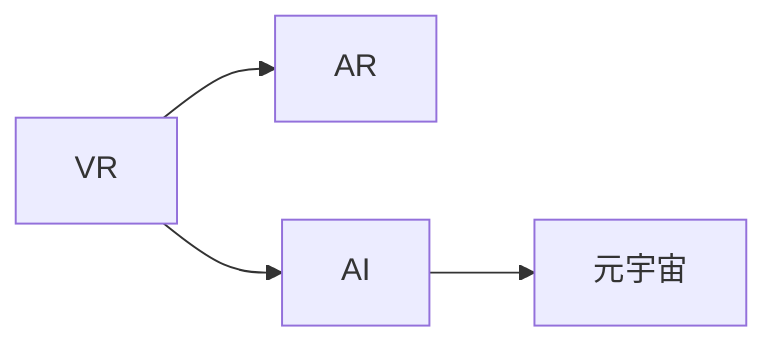

                 

# 数字化情侣:元宇宙中的远程恋爱

## 1. 背景介绍

### 1.1 问题由来

在数字时代，虚拟世界和现实世界的界限越来越模糊，技术的进步使得人类可以在数字空间中进行更丰富、更深刻的人际交往。元宇宙的崛起，为数字化的恋爱关系提供了新的可能。借助虚拟现实(VR)、增强现实(AR)和人工智能(AI)等前沿技术，情侣可以在虚拟空间中实现亲密互动、远程约会和情感交流，不受时间和空间限制，以全新的方式体验爱情的美好。

### 1.2 问题核心关键点

元宇宙中的远程恋爱，涉及到虚拟世界和现实世界的多维互动，涵盖了虚拟现实、增强现实、人工智能等多个领域的交叉应用。核心关键点包括：

- 虚拟现实技术：构建沉浸式虚拟空间，实现情侣间真实、互动的交流体验。
- 增强现实技术：将虚拟元素融入现实世界，增强用户体验的丰富性和多样性。
- 人工智能技术：利用情感分析、语音识别、自然语言处理等技术，提升情侣互动的智能化水平。

这些技术的深度融合，为远程恋爱提供了广阔的技术基础，同时也带来了新的挑战。本文旨在从核心概念、算法原理、实际应用等角度，全面解析元宇宙中的远程恋爱技术。

## 2. 核心概念与联系

### 2.1 核心概念概述

- **虚拟现实(Virtual Reality, VR)**：通过计算机生成的模拟环境，用户可以沉浸在虚拟空间中，体验真实的感觉和交互。

- **增强现实(Augmented Reality, AR)**：在现实世界的基础上，通过计算机生成虚拟信息，增强用户的感知体验。

- **人工智能(Artificial Intelligence, AI)**：利用算法和模型，模拟人类的智能行为，如自然语言处理、情感识别、语音合成等。

- **元宇宙(Metaverse)**：一个三维的虚拟空间，用户可以自由地交互、创造和体验。

这些核心概念之间的关系可以通过以下Mermaid流程图展示：



### 2.2 核心概念原理和架构

#### 2.2.1 虚拟现实(VR)技术原理

VR技术通过头戴显示器、手柄等设备，将用户置于一个虚拟的三维空间中，使其可以自由地移动和交互。

- **头戴显示器(HMD)**：提供沉浸式视觉体验，使用户可以感受虚拟世界的图像和文字。
- **手柄控制器**：通过捕捉用户的手部动作，实现虚拟世界的交互。
- **三维渲染**：将三维场景渲染为图像和视频，供用户观看。

#### 2.2.2 增强现实(AR)技术原理

AR技术在现实世界的基础上叠加虚拟信息，增强用户对环境的感知。

- **摄像头和传感器**：捕捉用户的真实环境，并进行图像处理。
- **虚拟对象生成**：利用计算机图形学，生成虚拟对象，如虚拟人物、物品等。
- **混合现实**：将虚拟对象与现实世界融合，形成混合的感知体验。

#### 2.2.3 人工智能(AI)技术原理

AI技术通过算法和模型，模拟人类的智能行为，提升远程恋爱的互动体验。

- **自然语言处理(NLP)**：理解和处理人类语言，实现智能对话。
- **情感分析**：分析用户的语音和文字，识别其情绪和情感状态。
- **语音合成**：将文字转换为语音，实现语音交互。

### 2.3 核心概念之间的联系

- **虚拟现实与增强现实**：VR和AR技术的结合，可以构建一个虚拟与现实相互融合的社交环境，用户可以在虚拟世界中体验到现实世界的感觉。
- **人工智能与虚拟现实/增强现实**：AI技术可以提升VR和AR的互动体验，如智能对话、情感识别等。
- **人工智能与元宇宙**：AI技术可以实现元宇宙中的智能交互，提升用户的沉浸感和体验质量。

## 3. 核心算法原理 & 具体操作步骤

### 3.1 算法原理概述

基于虚拟现实和增强现实技术的远程恋爱系统，通过生成虚拟环境，实现情侣间的沉浸式互动。而人工智能技术，如情感分析、自然语言处理等，则用于提升互动的智能化水平。

### 3.2 算法步骤详解

1. **虚拟环境生成**：
   - 利用计算机图形学技术，生成虚拟环境，包括虚拟角色、虚拟物品等。
   - 使用渲染引擎，将虚拟场景渲染为高分辨率的图像和视频，供用户观看。
   - 通过摄像头和传感器，捕捉用户的真实环境，实现虚拟与现实的融合。

2. **智能对话实现**：
   - 利用自然语言处理技术，实现智能对话。
   - 分析用户的语音和文字，识别其情绪和情感状态，调整互动方式。
   - 通过语音合成技术，将文字转换为语音，实现自然流畅的语音交互。

3. **情感识别与反馈**：
   - 利用情感分析技术，识别用户的情感状态。
   - 根据情感状态，动态调整虚拟环境和互动方式，提升用户体验。
   - 通过反馈机制，让用户感受到对方的情感变化，增强互动的真实感。

### 3.3 算法优缺点

#### 3.3.1 优点

- **沉浸式体验**：通过虚拟现实和增强现实技术，提供沉浸式体验，让用户仿佛置身于真实环境中。
- **互动智能化**：利用人工智能技术，实现智能对话和情感识别，提升用户体验的丰富性和多样性。
- **灵活性高**：系统可以根据用户的偏好和需求，动态调整虚拟环境和互动方式。

#### 3.3.2 缺点

- **技术复杂性**：需要同时集成多种技术，实现难度较大。
- **设备依赖**：需要专用的VR和AR设备，设备成本较高。
- **数据隐私**：用户在虚拟环境中产生的互动数据，可能涉及隐私问题，需加强数据保护。

### 3.4 算法应用领域

基于虚拟现实和增强现实技术的远程恋爱系统，可以在以下领域中得到广泛应用：

- **社交平台**：在社交平台上，用户可以通过虚拟现实和增强现实技术，与朋友、家人进行远程互动。
- **游戏行业**：游戏公司可以利用该技术，开发虚拟现实和增强现实游戏，提升用户体验。
- **教育培训**：教育机构可以利用该技术，进行远程教学和虚拟实验室，增强学生的互动体验。
- **医疗健康**：医疗机构可以利用该技术，进行远程心理咨询和治疗，提高心理健康服务的可及性。

## 4. 数学模型和公式 & 详细讲解 & 举例说明

### 4.1 数学模型构建

#### 4.1.1 虚拟现实环境生成模型

在虚拟现实环境中，生成虚拟对象和场景的数学模型包括：

- **三维模型**：使用三维坐标系，定义虚拟对象的几何形状和位置。
- **纹理贴图**：为三维模型添加纹理贴图，增强视觉真实感。
- **光照模型**：根据光源位置，计算虚拟场景的光照效果。

#### 4.1.2 情感分析模型

情感分析模型基于文本和语音信号，进行情感状态识别。常见的情感分析模型包括：

- **情感词典**：使用情感词典，提取文本中的情感词汇。
- **机器学习模型**：使用分类器，如SVM、RNN等，训练情感分析模型。
- **深度学习模型**：使用神经网络模型，如CNN、LSTM等，进行情感分类。

#### 4.1.3 智能对话模型

智能对话模型基于自然语言处理技术，进行对话生成和情感分析。常见的智能对话模型包括：

- **序列到序列模型(Seq2Seq)**：将输入序列转换为输出序列，如LSTM、GRU等。
- **生成对抗网络(GAN)**：生成对话文本，增强对话的自然性。
- **注意力机制**：通过注意力机制，提升对话生成模型的性能。

### 4.2 公式推导过程

#### 4.2.1 三维模型渲染公式

三维模型的渲染公式包括：

- **光照模型**：
  $$
  I = I_0 \times f(\vec{L}, \vec{N}, \phi)
  $$
  其中，$I$ 为光照强度，$I_0$ 为光源强度，$\vec{L}$ 为光源方向向量，$\vec{N}$ 为物体表面法向量，$\phi$ 为光源与表面的夹角。

- **纹理贴图**：
  $$
  C = C_0 \times f(\vec{L}, \vec{N}, \phi)
  $$
  其中，$C$ 为颜色值，$C_0$ 为纹理颜色，其他变量与光照模型类似。

#### 4.2.2 情感分析模型公式

情感分析模型使用机器学习模型进行训练，常见模型包括支持向量机(SVM)和递归神经网络(RNN)。

- **SVM情感分类公式**：
  $$
  y = \arg\min_{c} ||\vec{w} \cdot \vec{x} - c||^2
  $$
  其中，$\vec{x}$ 为输入特征向量，$\vec{w}$ 为权重向量，$c$ 为分类结果。

- **RNN情感分类公式**：
  $$
  h_t = \tanh(W_x x_t + U_h h_{t-1} + b)
  $$
  $$
  y = softmax(Vh_t + c)
  $$
  其中，$h_t$ 为隐藏层状态，$x_t$ 为输入序列，$W_x$ 和 $U_h$ 为权重矩阵，$V$ 为输出层权重，$b$ 为偏置项，$y$ 为输出结果。

#### 4.2.3 智能对话模型公式

智能对话模型使用序列到序列模型和注意力机制进行训练，常见模型包括LSTM和Transformer。

- **LSTM对话生成公式**：
  $$
  h_t = \tanh(W_x x_t + U_h h_{t-1} + b)
  $$
  $$
  c_t = \sigma(W_x x_t + U_h h_{t-1} + b)
  $$
  $$
  g_t = tanh(h_t)
  $$
  $$
  o_t = \sigma(W_x x_t + U_h h_{t-1} + b)
  $$
  $$
  c_{t+1} = (1-o_t) c_t + o_t g_t
  $$
  $$
  y_t = o_t \cdot \tanh(c_{t+1})
  $$
  其中，$h_t$ 和 $c_t$ 为LSTM的状态，$g_t$ 为候选输出，$o_t$ 为输出门，$y_t$ 为当前时间步的输出。

- **Transformer对话生成公式**：
  $$
  Q = XW_Q + b_Q
  $$
  $$
  K = XW_K + b_K
  $$
  $$
  V = XW_V + b_V
  $$
  $$
  M = \text{Attention}(Q, K, V)
  $$
  $$
  O = MW_O + b_O
  $$
  $$
  y = \text{Linear}(MO^T + b)
  $$
  其中，$Q$、$K$ 和 $V$ 为查询、键和值，$M$ 为注意力机制的结果，$O$ 为输出层，$y$ 为输出结果。

### 4.3 案例分析与讲解

#### 4.3.1 虚拟现实环境生成案例

在虚拟现实环境中，使用三维模型和纹理贴图生成虚拟对象和场景。例如，生成一个虚拟咖啡馆，需要定义咖啡馆的几何形状和位置，添加家具和装饰物，并进行光照和纹理处理，最终生成高分辨率的图像和视频。

#### 4.3.2 情感分析案例

使用情感分析模型对用户的文字和语音进行情感识别。例如，在虚拟恋爱系统中，当用户发送“好累啊”时，系统通过情感分析模型识别为负面情绪，并调整对话策略，提供情感支持。

#### 4.3.3 智能对话案例

使用智能对话模型进行对话生成和情感分析。例如，在虚拟恋爱系统中，当用户说“今天天气真好”时，系统通过智能对话模型生成回复“是的，我们出去玩吧”，并根据用户的语音和文字，调整回复的情感色彩，增强互动的自然性。

## 5. 项目实践：代码实例和详细解释说明

### 5.1 开发环境搭建

#### 5.1.1 虚拟现实环境生成环境搭建

使用Unity或Unreal Engine搭建虚拟现实环境，需要进行以下步骤：

- **安装Unity或Unreal Engine**：从官网下载安装包，按照指引完成安装。
- **导入3D模型**：将3D模型导入虚拟环境中，并进行位置和姿态的调整。
- **添加纹理贴图**：为3D模型添加纹理贴图，增强视觉真实感。
- **光照设置**：根据光源位置，调整虚拟场景的光照效果，使环境更加自然。

#### 5.1.2 智能对话模型环境搭建

使用TensorFlow或PyTorch搭建智能对话模型，需要进行以下步骤：

- **安装TensorFlow或PyTorch**：使用pip命令进行安装，如 `pip install tensorflow` 或 `pip install torch`。
- **准备数据集**：准备对话数据集，进行数据预处理和划分。
- **定义模型**：定义序列到序列模型，添加注意力机制等模块。
- **训练模型**：使用训练集数据进行模型训练，调整超参数，优化损失函数。
- **测试模型**：使用测试集数据进行模型测试，评估性能指标。

### 5.2 源代码详细实现

#### 5.2.1 虚拟现实环境生成代码实现

使用Unity搭建虚拟咖啡馆，代码实现如下：

```csharp
using UnityEngine;

public class CoffeeShop : MonoBehaviour
{
    public GameObject[] furniture;
    public MeshRenderer[] furnitureMaterials;

    void Start()
    {
        for (int i = 0; i < furniture.Length; i++)
        {
            furniture[i].SetActive(Random.Range(0, 2) == 0);
        }

        for (int i = 0; i < furnitureMaterials.Length; i++)
        {
            furnitureMaterials[i].color = new Color(Random.Range(0f, 1f), Random.Range(0f, 1f), Random.Range(0f, 1f));
        }
    }
}
```

#### 5.2.2 智能对话模型代码实现

使用TensorFlow搭建智能对话模型，代码实现如下：

```python
import tensorflow as tf

class Seq2SeqModel(tf.keras.Model):
    def __init__(self, input_dim, output_dim, hidden_dim, dropout_rate):
        super(Seq2SeqModel, self).__init__()
        self.encoder = tf.keras.layers.LSTM(units=hidden_dim, dropout=dropout_rate)
        self.decoder = tf.keras.layers.LSTM(units=hidden_dim, dropout=dropout_rate)
        self.fc = tf.keras.layers.Dense(units=output_dim)

    def call(self, x):
        x = self.encoder(x)
        x = tf.keras.layers.Dropout(dropout_rate)(x)
        x = self.decoder(x)
        x = tf.keras.layers.Dropout(dropout_rate)(x)
        x = self.fc(x)
        return x

# 训练模型
model = Seq2SeqModel(input_dim, output_dim, hidden_dim, dropout_rate)
model.compile(optimizer='adam', loss='categorical_crossentropy')

# 加载数据
train_data = ...
train_labels = ...

# 训练模型
model.fit(train_data, train_labels, epochs=10)

# 使用模型生成对话
new_input = ...
new_output = model.predict(new_input)
```

### 5.3 代码解读与分析

#### 5.3.1 虚拟现实环境生成代码解读

在Unity中，通过脚本实现虚拟咖啡馆的生成，代码如下：

- `Start`函数：在场景加载时执行，生成随机放置的家具和颜色。
- `furniture`数组：定义家具的预制件，随机选择一些家具进行放置。
- `furnitureMaterials`数组：定义家具的材质，随机生成颜色。

#### 5.3.2 智能对话模型代码解读

在TensorFlow中，通过定义序列到序列模型进行对话生成，代码如下：

- `Seq2SeqModel`类：定义序列到序列模型，包括编码器、解码器和全连接层。
- `call`函数：定义模型前向传播过程，包括编码器、解码器、全连接层和输出。
- `compile`函数：定义模型优化器和损失函数，进行模型训练。
- `fit`函数：加载训练数据，进行模型训练，调整超参数。
- `predict`函数：使用训练好的模型进行预测，生成对话回复。

## 6. 实际应用场景

### 6.1 社交平台应用

社交平台可以利用虚拟现实和增强现实技术，实现情侣间的远程互动。例如，用户可以通过虚拟现实头盔，在虚拟咖啡馆中与远方的情侣进行视频通话和互动。用户可以通过手势控制虚拟物品，进行游戏和交流。

### 6.2 游戏行业应用

游戏公司可以利用虚拟现实和增强现实技术，开发虚拟现实游戏，增强用户体验。例如，在虚拟恋爱游戏中，玩家可以在虚拟世界中自由互动，进行虚拟约会、共同冒险等活动，体验真实的情侣互动。

### 6.3 教育培训应用

教育机构可以利用虚拟现实和增强现实技术，进行远程教学和虚拟实验室。例如，在虚拟恋爱课程中，学生可以通过虚拟现实头盔，进行模拟约会和角色扮演，体验不同的恋爱场景。

### 6.4 医疗健康应用

医疗机构可以利用虚拟现实和增强现实技术，进行远程心理咨询和治疗。例如，在虚拟恋爱系统中，患者可以通过虚拟现实头盔，与心理咨询师进行互动，进行心理疏导和情感支持。

## 7. 工具和资源推荐

### 7.1 学习资源推荐

#### 7.1.1 虚拟现实技术学习资源

- **Unity官方文档**：Unity官方文档提供了详细的虚拟现实开发指南和教程。
- **Unreal Engine官方文档**：Unreal Engine官方文档提供了虚拟现实和增强现实开发的基础知识和实践技巧。

#### 7.1.2 智能对话技术学习资源

- **TensorFlow官方文档**：TensorFlow官方文档提供了序列到序列模型和智能对话模型的详细教程和案例。
- **PyTorch官方文档**：PyTorch官方文档提供了自然语言处理和智能对话模型的详细教程和案例。

### 7.2 开发工具推荐

#### 7.2.1 虚拟现实技术开发工具

- **Unity**：Unity是一款强大的游戏引擎，支持虚拟现实和增强现实开发。
- **Unreal Engine**：Unreal Engine是一款高端游戏引擎，支持虚拟现实和增强现实开发。

#### 7.2.2 智能对话技术开发工具

- **TensorFlow**：TensorFlow是Google开发的深度学习框架，支持序列到序列模型和智能对话模型的开发。
- **PyTorch**：PyTorch是Facebook开发的深度学习框架，支持自然语言处理和智能对话模型的开发。

### 7.3 相关论文推荐

#### 7.3.1 虚拟现实技术论文

- **Virtual Reality in Social Interaction: A Review and Future Directions**：探讨虚拟现实技术在社交互动中的应用。
- **Virtual Reality and Health**：探讨虚拟现实技术在健康领域的应用。

#### 7.3.2 智能对话技术论文

- **Neural Machine Translation by Jointly Learning to Align and Translate**：提出序列到序列模型，用于机器翻译和智能对话。
- **Attention Is All You Need**：提出Transformer模型，用于序列到序列的生成任务。

## 8. 总结：未来发展趋势与挑战

### 8.1 研究成果总结

元宇宙中的远程恋爱技术，通过虚拟现实和增强现实技术的结合，利用人工智能技术的智能对话和情感分析，实现了情侣间的深度互动。该技术在社交平台、游戏行业、教育培训、医疗健康等多个领域具有广泛的应用前景。

### 8.2 未来发展趋势

未来，元宇宙中的远程恋爱技术将呈现以下发展趋势：

- **技术融合**：虚拟现实、增强现实和人工智能技术将进一步融合，提升用户体验的真实感和自然性。
- **跨平台应用**：远程恋爱系统将支持多种平台，如移动设备、PC、VR头盔等，实现跨平台互动。
- **个性化定制**：根据用户的偏好和需求，动态调整虚拟环境和互动方式，提供个性化的用户体验。
- **数据驱动**：利用大数据和机器学习技术，提升系统的智能化水平，提供更精准的情感分析和互动建议。

### 8.3 面临的挑战

尽管元宇宙中的远程恋爱技术具有广阔的前景，但也面临以下挑战：

- **技术瓶颈**：虚拟现实和增强现实技术的高成本和复杂性，限制了技术的普及。
- **用户体验**：虚拟环境中的互动真实感和自然性仍有待提升。
- **数据隐私**：用户数据的安全和隐私问题需要加强保护。
- **技术适配**：不同平台之间的技术适配和互通问题需要解决。

### 8.4 研究展望

为了应对这些挑战，未来的研究需要在以下几个方面进行突破：

- **技术优化**：进一步优化虚拟现实和增强现实技术，降低成本和复杂性。
- **用户体验提升**：提升虚拟环境的真实感和自然性，增强用户体验的沉浸感和丰富性。
- **数据安全保护**：加强用户数据的安全保护，确保数据隐私和安全性。
- **跨平台互操作**：实现不同平台之间的技术适配和互通，提升系统的可扩展性和灵活性。

## 9. 附录：常见问题与解答

### 9.1 常见问题

**Q1: 虚拟现实和增强现实技术的成本和复杂性如何？**

A: 虚拟现实和增强现实技术的高成本和复杂性，主要体现在硬件设备和软件开发上。硬件设备如VR头盔和增强现实眼镜，价格较高，软件开发需要掌握复杂的技术和工具。

**Q2: 如何提升虚拟环境的真实感和自然性？**

A: 提升虚拟环境的真实感和自然性，可以通过优化三维模型和纹理贴图、增强光照和环境特效、引入自然语言处理和情感分析技术等方式，增强用户的沉浸感和互动体验。

**Q3: 如何保护用户数据的安全和隐私？**

A: 保护用户数据的安全和隐私，可以通过数据加密、访问控制、数据匿名化等措施，确保用户数据的安全性和隐私性。

### 9.2 问题解答

通过以上分析和讨论，可以看到，元宇宙中的远程恋爱技术具有广阔的前景和应用潜力。虚拟现实和增强现实技术的结合，利用人工智能技术的智能对话和情感分析，实现了情侣间的深度互动。未来，随着技术的不断进步和完善，远程恋爱系统将进一步提升用户体验的真实感和自然性，成为数字时代的情感交流新方式。

