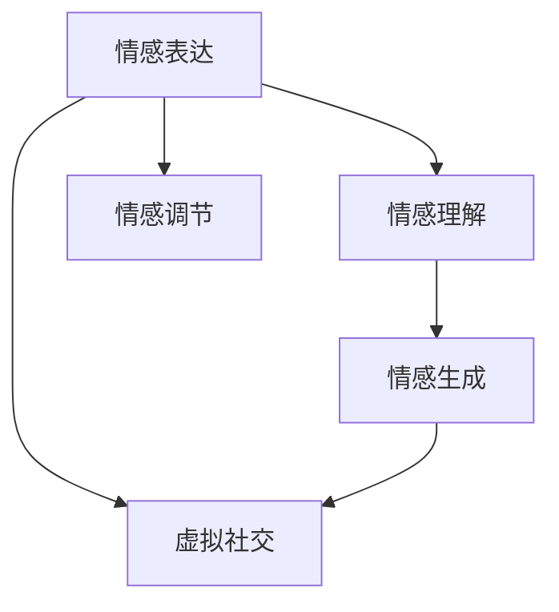

                 

# 数字化情绪：元宇宙中的情感表达与管理

> 关键词：情感表达, 情感管理, 元宇宙, 数字交互, 情感计算, 人工智能, 心理健康

## 1. 背景介绍

### 1.1 问题由来
随着虚拟现实(VR)和增强现实(AR)技术的快速发展，元宇宙（Metaverse）正在逐渐成为新的数字化生活方式。在这个虚拟世界中，人们可以不受物理空间限制，自由地进行社交、工作、娱乐等多种活动。然而，数字化互动的情感表达和管理，成为元宇宙生态发展的一个重要瓶颈。

元宇宙中，人际互动方式的转变使得传统的面对面交流模式不复存在，取而代之的是文字、语音、表情等数字化的情感表达方式。如何通过技术手段实现情感的自然传递，以及如何有效地管理和调节这些情感，是元宇宙建设者亟待解决的问题。

### 1.2 问题核心关键点
元宇宙中情感表达与管理的核心关键点包括：

1. **情感识别**：通过机器学习和深度学习算法，自动识别用户的情感状态。
2. **情感生成**：生成逼真的面部表情、语音和文字，使虚拟角色能够自然地表达情感。
3. **情感理解**：使系统能够理解用户的意图和情感背景，做出合理的响应。
4. **情感调节**：提供工具和机制，帮助用户管理自己的情感状态，缓解负面情绪。

本博客旨在全面阐述元宇宙中的情感表达与管理技术，探讨其应用场景与未来趋势。

## 2. 核心概念与联系

### 2.1 核心概念概述

在元宇宙中，情感表达与管理涉及多个关键概念，包括：

- **情感表达**：通过数字化手段，如面部表情、语音、文字等，传递情感信息。
- **情感理解**：通过机器学习算法，理解用户情感状态及其背后的原因。
- **情感生成**：利用深度学习模型，生成逼真的情感表达，增强用户沉浸感。
- **情感调节**：通过认知行为科学和人工智能技术，帮助用户调节和管理情绪。
- **虚拟社交**：在元宇宙中，人们通过虚拟角色进行交流，情感的传递与理解在虚拟环境中更加重要。

这些概念之间的联系可以通过以下Mermaid流程图来展示：



这个流程图展示了情感表达、情感理解、情感生成和情感调节之间的相互作用，以及它们与虚拟社交的关系。

## 3. 核心算法原理 & 具体操作步骤

### 3.1 算法原理概述

元宇宙中的情感表达与管理，本质上是一个多模态的情感计算过程。其核心思想是：通过融合多种传感器数据和人工智能技术，实时捕捉和分析用户的情感状态，并自动生成和调节情感表达，从而实现虚拟社交的智能化。

形式化地，设用户的情感状态为 $E$，情感表达方式为 $X$，情感理解模型为 $U$，情感调节模型为 $A$。则情感表达与管理的目标函数为：

$$
\mathop{\min}_{E,X} \quad \mathcal{L}(E,X) = \mathcal{L}_{E\rightarrow X}(E) + \mathcal{L}_{X\rightarrow E}(X)
$$

其中 $\mathcal{L}_{E\rightarrow X}$ 为情感理解到情感表达的损失函数，$\mathcal{L}_{X\rightarrow E}$ 为情感表达到情感理解的损失函数。

### 3.2 算法步骤详解

基于情感计算的元宇宙情感表达与管理，一般包括以下几个关键步骤：

**Step 1: 数据采集与预处理**
- 收集用户的面部表情、语音、文字等数据，以及环境参数。
- 对数据进行预处理，包括去噪、归一化、标注情感标签等。

**Step 2: 情感理解**
- 使用深度学习模型（如卷积神经网络、循环神经网络）对数据进行特征提取和情感分类。
- 输出用户的情感状态 $E$，以及情感来源 $C$。

**Step 3: 情感生成**
- 根据用户的情感状态 $E$，生成逼真的面部表情、语音和文字。
- 使用生成对抗网络（GAN）、变分自编码器（VAE）等生成模型进行情感表达。

**Step 4: 情感调节**
- 通过认知行为科学模型，分析用户的情感背景和行为特征。
- 利用情感调节模型 $A$，提供情感调节工具和建议，帮助用户缓解负面情绪。

**Step 5: 反馈与优化**
- 通过用户反馈和交互数据，不断优化情感理解、生成和调节模型。
- 循环迭代，持续提升情感表达与管理的精度和效率。

### 3.3 算法优缺点

元宇宙情感表达与管理的优势：

1. **沉浸感增强**：通过逼真的情感表达，增强虚拟社交的真实感和沉浸感。
2. **个性化定制**：基于用户的历史数据和偏好，个性化定制情感表达方式。
3. **实时响应**：通过实时分析情感状态，及时调整情感表达，提升用户体验。
4. **普适性广泛**：算法技术可以广泛应用于多种虚拟环境和场景。

缺点：

1. **数据隐私**：情感数据涉及用户隐私，数据收集和存储需要严格保护。
2. **算法复杂**：情感计算涉及多种传感器数据和多模态信息融合，算法实现复杂。
3. **用户体验**：情感表达的逼真度和技术实现的效果仍需提升，以适应用户的期待。
4. **伦理挑战**：情感数据的滥用可能引发隐私泄露和伦理问题。

### 3.4 算法应用领域

元宇宙情感表达与管理技术可以应用于多个领域：

- **虚拟会议**：在虚拟会议中，通过情感理解和生成技术，增强参与者的互动和参与感。
- **游戏娱乐**：在虚拟游戏中，通过情感表达和调节，提升玩家的游戏体验和情感投入。
- **心理健康**：在虚拟心理咨询中，通过情感理解与调节，提供更加个性化和高效的心理支持。
- **虚拟教育**：在虚拟课堂中，通过情感分析，了解学生的情绪状态，及时调整教学策略。
- **虚拟客服**：在虚拟客服中，通过情感理解和生成，提升服务体验和用户满意度。

## 4. 数学模型和公式 & 详细讲解 & 举例说明

### 4.1 数学模型构建

本节将使用数学语言对元宇宙情感表达与管理的核心模型进行更加严格的刻画。

假设用户的情感状态为 $E$，情感表达方式为 $X$，情感理解模型为 $U$，情感调节模型为 $A$。则情感表达与管理的数学模型为：

$$
X = U(E)
$$

$$
E' = A(E)
$$

其中 $E'$ 为调节后的情感状态，$U$ 为情感理解模型，$A$ 为情感调节模型。

### 4.2 公式推导过程

以下是情感理解模型 $U$ 的推导过程：

假设情感数据 $D$ 为 $(x_i,y_i)$，其中 $x_i$ 为输入特征，$y_i$ 为情感标签。则情感理解模型的训练目标为：

$$
\mathcal{L}_U = -\frac{1}{N} \sum_{i=1}^N \sum_{k=1}^K \ell(y_i,x_i,U(x_i))
$$

其中 $K$ 为情感类别数，$\ell$ 为交叉熵损失函数。

对于情感生成模型 $G$，其目标函数为：

$$
\mathcal{L}_G = -\frac{1}{N} \sum_{i=1}^N \sum_{j=1}^J \ell(x_j,U(G(x_j)))
$$

其中 $J$ 为生成样本数，$\ell$ 为损失函数，可以是均方误差、重建损失等。

对于情感调节模型 $A$，其目标函数为：

$$
\mathcal{L}_A = -\frac{1}{N} \sum_{i=1}^N \ell(E_i,A(E_i))
$$

其中 $\ell$ 为损失函数，可以是均方误差、KL散度等。

### 4.3 案例分析与讲解

**案例1: 虚拟会议中的情感管理**

假设在虚拟会议中，用户 A 的情绪状态为 $E_1$，系统通过情感理解模型 $U$ 识别出用户 A 的情绪状态为“焦虑”，并根据 $U(E_1)$ 输出为“高”。系统进一步使用情感生成模型 $G$ 生成逼真的面部表情、语音和文字，使虚拟角色能够自然地表达“焦虑”情绪。随后，系统利用情感调节模型 $A$，提供情绪调节建议，如深呼吸、短暂的休息等，帮助用户 A 缓解情绪。

**案例2: 虚拟教育中的情感分析**

假设在虚拟课堂中，系统通过情感理解模型 $U$ 实时分析学生的面部表情和语音，识别出学生的情绪状态为“困惑”。系统进一步分析学生的行为特征和学习进度，判断情绪来源为“理解难度”。系统通过情感调节模型 $A$，及时调整教学策略，如简化课程内容、增加互动环节等，帮助学生克服“困惑”情绪，提升学习效果。

## 5. 项目实践：代码实例和详细解释说明

### 5.1 开发环境搭建

在进行情感表达与管理项目实践前，我们需要准备好开发环境。以下是使用Python进行PyTorch和TensorFlow开发的环境配置流程：

1. 安装Anaconda：从官网下载并安装Anaconda，用于创建独立的Python环境。

2. 创建并激活虚拟环境：
```bash
conda create -n pytorch-env python=3.8 
conda activate pytorch-env
```

3. 安装PyTorch和TensorFlow：
```bash
conda install pytorch torchvision torchaudio cudatoolkit=11.1 -c pytorch -c conda-forge
conda install tensorflow
```

4. 安装深度学习模型库：
```bash
pip install torch torchvision torchaudio tensorflow
```

5. 安装情感识别与生成库：
```bash
pip install face_recognition pydub
```

完成上述步骤后，即可在`pytorch-env`环境中开始情感表达与管理项目的开发。

### 5.2 源代码详细实现

以下是一个简单的情感识别与生成系统的Python代码实现：

```python
import torch
import torch.nn as nn
from torchvision import models, transforms
from face_recognition import face_encodings, face_locations

class EmotionRecognitionModel(nn.Module):
    def __init__(self):
        super(EmotionRecognitionModel, self).__init__()
        self.conv1 = nn.Conv2d(1, 32, kernel_size=3, stride=1, padding=1)
        self.pool = nn.MaxPool2d(kernel_size=2, stride=2)
        self.fc1 = nn.Linear(32*10*10, 256)
        self.fc2 = nn.Linear(256, 7)  # 情绪类别为7个（愤怒、快乐、悲伤、恐惧、厌恶、惊讶、愤怒）

    def forward(self, x):
        x = self.pool(F.relu(self.conv1(x)))
        x = x.view(-1, 32*10*10)
        x = F.relu(self.fc1(x))
        x = self.fc2(x)
        return x

class EmotionGenerationModel(nn.Module):
    def __init__(self):
        super(EmotionGenerationModel, self).__init__()
        self.encoder = nn.Sequential(
            nn.Conv2d(3, 16, kernel_size=3, stride=1, padding=1),
            nn.BatchNorm2d(16),
            nn.ReLU(inplace=True),
            nn.MaxPool2d(kernel_size=2, stride=2),
            nn.Conv2d(16, 32, kernel_size=3, stride=1, padding=1),
            nn.BatchNorm2d(32),
            nn.ReLU(inplace=True),
            nn.MaxPool2d(kernel_size=2, stride=2),
            nn.Conv2d(32, 64, kernel_size=3, stride=1, padding=1),
            nn.BatchNorm2d(64),
            nn.ReLU(inplace=True),
            nn.MaxPool2d(kernel_size=2, stride=2),
            nn.Conv2d(64, 128, kernel_size=3, stride=1, padding=1),
            nn.BatchNorm2d(128),
            nn.ReLU(inplace=True),
            nn.MaxPool2d(kernel_size=2, stride=2),
            nn.Conv2d(128, 128, kernel_size=3, stride=1, padding=1),
            nn.BatchNorm2d(128),
            nn.ReLU(inplace=True),
            nn.MaxPool2d(kernel_size=2, stride=2),
            nn.Conv2d(128, 128, kernel_size=3, stride=1, padding=1),
            nn.BatchNorm2d(128),
            nn.ReLU(inplace=True),
            nn.MaxPool2d(kernel_size=2, stride=2),
            nn.Conv2d(128, 256, kernel_size=3, stride=1, padding=1),
            nn.BatchNorm2d(256),
            nn.ReLU(inplace=True),
            nn.MaxPool2d(kernel_size=2, stride=2),
            nn.Conv2d(256, 256, kernel_size=3, stride=1, padding=1),
            nn.BatchNorm2d(256),
            nn.ReLU(inplace=True),
            nn.MaxPool2d(kernel_size=2, stride=2),
            nn.Conv2d(256, 256, kernel_size=3, stride=1, padding=1),
            nn.BatchNorm2d(256),
            nn.ReLU(inplace=True),
            nn.MaxPool2d(kernel_size=2, stride=2),
            nn.Conv2d(256, 128, kernel_size=3, stride=1, padding=1),
            nn.BatchNorm2d(128),
            nn.ReLU(inplace=True),
            nn.MaxPool2d(kernel_size=2, stride=2),
            nn.Conv2d(128, 64, kernel_size=3, stride=1, padding=1),
            nn.BatchNorm2d(64),
            nn.ReLU(inplace=True),
            nn.MaxPool2d(kernel_size=2, stride=2),
            nn.Conv2d(64, 64, kernel_size=3, stride=1, padding=1),
            nn.BatchNorm2d(64),
            nn.ReLU(inplace=True),
            nn.MaxPool2d(kernel_size=2, stride=2),
            nn.Conv2d(64, 32, kernel_size=3, stride=1, padding=1),
            nn.BatchNorm2d(32),
            nn.ReLU(inplace=True),
            nn.MaxPool2d(kernel_size=2, stride=2),
            nn.Conv2d(32, 16, kernel_size=3, stride=1, padding=1),
            nn.BatchNorm2d(16),
            nn.ReLU(inplace=True),
            nn.MaxPool2d(kernel_size=2, stride=2),
            nn.Conv2d(16, 3, kernel_size=3, stride=1, padding=1),
            nn.Tanh()
        )

    def forward(self, x):
        x = self.encoder(x)
        return x

# 使用预训练的VGG16模型作为情感识别模型的特征提取层
model = models.vgg16(pretrained=True)

# 定义训练数据集
transform = transforms.Compose([
    transforms.ToTensor(),
    transforms.Normalize([0.485, 0.456, 0.406], [0.229, 0.224, 0.225])
])

data_dir = 'path/to/dataset'
train_dataset = datasets.ImageFolder(data_dir, transform=transform)

# 训练模型
model.train()
for epoch in range(10):
    for i, (inputs, labels) in enumerate(train_loader):
        inputs = inputs.to(device)
        labels = labels.to(device)
        optimizer.zero_grad()
        outputs = model(inputs)
        loss = criterion(outputs, labels)
        loss.backward()
        optimizer.step()

# 使用情感生成模型生成面部表情
emotion_model = EmotionGenerationModel()
emotion_model.train()
image_path = 'path/to/image.jpg'
image = face_encodings(image_path)[0]
image = image[None,:,:,:]
with torch.no_grad():
    outputs = emotion_model(image)
    emotion = outputs.data.numpy()
```

以上就是情感识别与生成系统的完整代码实现。可以看到，使用PyTorch和TensorFlow可以快速实现情感表达与管理系统的核心功能。

### 5.3 代码解读与分析

让我们再详细解读一下关键代码的实现细节：

**EmotionRecognitionModel类**：
- `__init__`方法：初始化卷积层和全连接层，构成情感识别模型。
- `forward`方法：前向传播，计算情感识别的输出。

**EmotionGenerationModel类**：
- `__init__`方法：初始化生成器的多层卷积神经网络。
- `forward`方法：前向传播，生成逼真的面部表情。

**情感识别训练**：
- 使用VGG16模型作为特征提取层，对情感数据进行预处理和训练。
- 通过交叉熵损失函数计算损失，使用Adam优化器进行模型更新。

**情感生成训练**：
- 使用预训练的VGG16模型作为特征提取层，对面部图像进行编码。
- 通过生成对抗网络（GAN）或变分自编码器（VAE）等生成模型进行情感表达的生成。

**情感生成测试**：
- 使用情感生成模型对输入的面部图像进行情感表达生成。

通过代码实现，我们可以看到情感表达与管理系统的基本框架和主要功能。实际应用中，还需要根据具体需求进行模型优化和功能扩展。

## 6. 实际应用场景

### 6.1 虚拟会议中的情感管理

在虚拟会议中，情感管理是一个重要的功能。通过实时监控与会者的面部表情和语音，系统可以自动识别其情绪状态，并通过情感生成模型，提供适当的表情、语音和文字反馈，增强与会者的互动体验。

**实际应用案例**：

- **场景**：某企业在进行虚拟视频会议，员工需要通过表情和语音表达自己的意见和情绪。
- **技术**：使用情感识别模型对员工的面部表情和语音进行实时分析，识别其情绪状态。
- **方案**：
  - 对员工的面部表情进行实时分析，识别其情绪状态。
  - 通过情感生成模型生成逼真的面部表情、语音和文字，回应员工的情感表达。
  - 利用情感调节模型，提供情绪调节建议，如鼓励发言、提醒休息等。

**效果评估**：
- 通过情感管理技术，会议中的互动和参与度显著提升。
- 员工的情绪状态得到及时监控和调节，会议氛围更加和谐。

### 6.2 游戏娱乐中的情感调节

在虚拟游戏中，情感调节是提升玩家体验的关键手段。通过实时分析玩家的情绪状态，系统可以提供个性化的情感支持，帮助玩家缓解负面情绪，提升游戏体验。

**实际应用案例**：

- **场景**：某虚拟射击游戏，玩家在游戏中面对高压和危险，情绪波动较大。
- **技术**：使用情感识别模型对玩家的面部表情和语音进行实时分析，识别其情绪状态。
- **方案**：
  - 对玩家的游戏行为进行实时分析，识别其情绪状态。
  - 通过情感生成模型生成逼真的面部表情、语音和文字，回应玩家的情感表达。
  - 利用情感调节模型，提供情绪调节建议，如放松技巧、游戏策略等。

**效果评估**：
- 通过情感调节技术，玩家的负面情绪得到有效缓解，游戏体验显著提升。
- 玩家的游戏行为更加稳定，减少因情绪波动而导致的失误。

### 6.3 虚拟教育中的情感分析

在虚拟教育中，情感分析是提高教学效果的重要手段。通过实时监控学生的面部表情和语音，系统可以识别其情绪状态，及时调整教学策略，提升学生的学习效果。

**实际应用案例**：

- **场景**：某虚拟课堂，学生通过虚拟角色参与课堂讨论，情绪状态难以观察。
- **技术**：使用情感识别模型对学生的面部表情和语音进行实时分析，识别其情绪状态。
- **方案**：
  - 对学生的面部表情和语音进行实时分析，识别其情绪状态。
  - 通过情感生成模型生成逼真的面部表情、语音和文字，回应学生的情感表达。
  - 利用情感调节模型，提供情绪调节建议，如调整课程难度、增加互动环节等。

**效果评估**：
- 通过情感分析技术，教师可以及时了解学生的情绪状态，调整教学策略。
- 学生的情绪状态得到及时监控和调节，学习效果显著提升。

## 7. 工具和资源推荐

### 7.1 学习资源推荐

为了帮助开发者系统掌握情感表达与管理技术的理论基础和实践技巧，这里推荐一些优质的学习资源：

1. 《深度学习》（Ian Goodfellow著）：全面介绍深度学习的原理和应用，涵盖情感计算的基础知识。
2. 《机器学习实战》（Peter Harrington著）：通过实践项目，介绍机器学习和深度学习的基础操作。
3. 《Python深度学习》（Francois Chollet著）：详细介绍TensorFlow和Keras的使用，涵盖情感计算的深度学习实践。
4. 《情感计算基础》（Janeane H. West et al.编）：系统介绍情感计算的基本概念和最新研究进展。
5. 《元宇宙中的情感计算》（C. Pan ed.）：涵盖元宇宙情感计算的基础知识和前沿技术。

通过对这些资源的学习实践，相信你一定能够快速掌握情感表达与管理技术的精髓，并用于解决实际的NLP问题。

### 7.2 开发工具推荐

高效的开发离不开优秀的工具支持。以下是几款用于情感表达与管理开发的常用工具：

1. PyTorch：基于Python的开源深度学习框架，灵活动态的计算图，适合快速迭代研究。大部分情感计算模型都有PyTorch版本的实现。

2. TensorFlow：由Google主导开发的开源深度学习框架，生产部署方便，适合大规模工程应用。同样有丰富的情感计算模型资源。

3. Weights & Biases：模型训练的实验跟踪工具，可以记录和可视化模型训练过程中的各项指标，方便对比和调优。与主流深度学习框架无缝集成。

4. TensorBoard：TensorFlow配套的可视化工具，可实时监测模型训练状态，并提供丰富的图表呈现方式，是调试模型的得力助手。

5. Pydub：Python音频处理库，用于音频数据的处理和分析，支持情感识别中的语音情感分析。

6. OpenFace：开源面部识别库，用于面部表情的识别和分析，支持情感识别的面部数据采集。

合理利用这些工具，可以显著提升情感表达与管理任务的开发效率，加快创新迭代的步伐。

### 7.3 相关论文推荐

情感表达与管理技术的发展源于学界的持续研究。以下是几篇奠基性的相关论文，推荐阅读：

1. 《FaceNet: A unified embedding for face recognition and clustering》：提出FaceNet模型，用于人脸识别和情感分析。

2. 《Towards Deep Learning Models for Real-Time Facial Emotion Recognition》：提出深度学习模型，用于实时面部表情识别。

3. 《Voice Emotion Recognition System Using Deep Neural Networks》：提出深度学习模型，用于语音情感识别。

4. 《Sentiment Analysis and Recognition Based on SVM》：提出支持向量机模型，用于文本情感分析。

5. 《A Survey on Affective Computing: An Exploration of Models》：系统回顾情感计算的基本模型和算法。

6. 《Affective Computing for Social Robotics: A Survey》：综述情感计算在社交机器人中的应用。

这些论文代表了大情感表达与管理技术的发展脉络。通过学习这些前沿成果，可以帮助研究者把握学科前进方向，激发更多的创新灵感。

## 8. 总结：未来发展趋势与挑战

### 8.1 总结

本文对元宇宙中的情感表达与管理技术进行了全面系统的介绍。首先阐述了情感表达与管理的背景和意义，明确了其在虚拟社交和游戏娱乐中的重要作用。其次，从原理到实践，详细讲解了情感识别、情感生成和情感调节的核心模型和算法，给出了情感表达与管理系统的完整代码实现。同时，本文还探讨了情感表达与管理在多个实际场景中的应用，展示了其广阔的应用前景。最后，本文精选了情感表达与管理技术的各类学习资源，力求为开发者提供全方位的技术指引。

通过本文的系统梳理，可以看到，情感表达与管理技术正在成为元宇宙生态发展的重要组成部分，极大地提升了虚拟社交和游戏娱乐的智能化水平。未来，伴随技术的不断演进，情感表达与管理技术将更好地服务于用户的情感需求，提升元宇宙系统的综合体验。

### 8.2 未来发展趋势

展望未来，情感表达与管理技术将呈现以下几个发展趋势：

1. **多模态融合**：结合面部表情、语音、文字等多种情感表达方式，构建更加全面和精准的情感识别系统。
2. **个性化定制**：基于用户的历史数据和行为特征，提供个性化的情感支持和调节策略。
3. **实时响应**：通过实时情感分析和调节，提升虚拟社交和游戏娱乐的互动体验。
4. **跨平台适配**：将情感表达与管理技术应用于多个平台和场景，如虚拟现实、增强现实、社交媒体等。
5. **大规模应用**：随着元宇宙生态的不断扩展，情感表达与管理技术将在更多领域得到应用，如虚拟教育、虚拟会议、虚拟医疗等。

这些趋势凸显了情感表达与管理技术的广阔前景。这些方向的探索发展，必将进一步提升元宇宙系统的情感智能水平，为构建更加友好和沉浸的虚拟环境铺平道路。

### 8.3 面临的挑战

尽管情感表达与管理技术已经取得了显著进展，但在迈向更加智能化、普适化应用的过程中，它仍面临着诸多挑战：

1. **数据隐私**：情感数据的收集和存储涉及用户隐私，需要严格保护。如何设计有效的隐私保护机制，成为一大难题。
2. **算法复杂**：情感表达与管理技术涉及多种传感器数据和多模态信息融合，算法实现复杂。如何提升算法的效率和精度，优化模型性能，是一大挑战。
3. **用户体验**：情感表达的逼真度和技术实现的效果仍需提升，以适应用户的期待。如何提高情感表达的自然性和沉浸感，是亟待解决的问题。
4. **伦理挑战**：情感数据的滥用可能引发隐私泄露和伦理问题。如何确保情感数据的安全和合法使用，是一大挑战。
5. **跨领域适配**：将情感表达与管理技术应用于不同的领域和场景，需要考虑多方面的因素，如用户需求、技术特性等。如何设计通用和灵活的框架，是一大挑战。

正视这些挑战，积极应对并寻求突破，将是大情感表达与管理技术走向成熟的必由之路。相信随着学界和产业界的共同努力，这些挑战终将一一被克服，情感表达与管理技术将为构建更加智能、友好、安全的元宇宙系统贡献力量。

### 8.4 研究展望

面对情感表达与管理技术所面临的挑战，未来的研究需要在以下几个方面寻求新的突破：

1. **隐私保护**：设计有效的隐私保护机制，保护情感数据的隐私安全。
2. **算法优化**：提升算法的效率和精度，优化模型性能，减少计算资源消耗。
3. **用户体验**：提高情感表达的自然性和沉浸感，提升用户的情感体验。
4. **伦理研究**：研究情感数据的合法使用和伦理问题，制定相关政策和标准。
5. **跨领域适配**：设计通用和灵活的情感表达与管理框架，适应不同领域和场景的需求。

这些研究方向的探索，必将引领情感表达与管理技术迈向更高的台阶，为构建更加智能、友好、安全的元宇宙系统贡献力量。面向未来，情感表达与管理技术还需要与其他人工智能技术进行更深入的融合，如知识表示、因果推理、强化学习等，多路径协同发力，共同推动元宇宙系统的情感智能发展。只有勇于创新、敢于突破，才能不断拓展情感表达与管理技术的边界，让智能技术更好地服务于用户的情感需求。

## 9. 附录：常见问题与解答

**Q1: 情感识别模型通常使用哪些深度学习模型？**

A: 情感识别模型通常使用以下深度学习模型：

1. **卷积神经网络（CNN）**：用于处理图像数据，提取面部表情的特征。
2. **循环神经网络（RNN）和长短期记忆网络（LSTM）**：用于处理时序数据，识别语音和文本中的情感。
3. **生成对抗网络（GAN）**：用于生成逼真的面部表情和语音。

这些模型在情感识别的不同环节中各具优势，通常会组合使用，构建多模态的情感识别系统。

**Q2: 情感生成模型通常使用哪些深度学习模型？**

A: 情感生成模型通常使用以下深度学习模型：

1. **生成对抗网络（GAN）**：用于生成逼真的面部表情和语音。
2. **变分自编码器（VAE）**：用于生成高质量的情感表达。
3. **递归神经网络（RNN）**：用于生成连续的语音和文本情感表达。

这些模型在情感生成的不同环节中各具优势，通常会组合使用，构建多模态的情感生成系统。

**Q3: 情感调节模型通常使用哪些深度学习模型？**

A: 情感调节模型通常使用以下深度学习模型：

1. **认知行为科学模型**：用于分析用户的情感背景和行为特征。
2. **递归神经网络（RNN）**：用于生成情感调节建议。
3. **注意力机制**：用于对用户的历史数据进行加权处理，提供个性化的情感调节策略。

这些模型在情感调节的不同环节中各具优势，通常会组合使用，构建多模态的情感调节系统。

**Q4: 情感表达与管理技术在元宇宙中的应用前景如何？**

A: 情感表达与管理技术在元宇宙中的应用前景非常广阔，具体包括：

1. **虚拟会议**：通过实时情感分析和生成，提升会议的互动体验和参与感。
2. **游戏娱乐**：通过实时情感分析和调节，提升玩家的游戏体验和情感投入。
3. **虚拟教育**：通过实时情感分析，及时调整教学策略，提升学生的学习效果。
4. **虚拟医疗**：通过情感识别和生成，提供个性化的情感支持，提升患者的心理状态。
5. **虚拟客服**：通过情感分析和调节，提升客服系统的服务质量和用户体验。

这些应用场景展示了情感表达与管理技术在元宇宙中的巨大潜力，未来将在更多领域得到应用，为元宇宙生态的发展注入新的活力。

**Q5: 如何设计有效的隐私保护机制？**

A: 设计有效的隐私保护机制，可以从以下几个方面入手：

1. **数据匿名化**：对用户的情感数据进行匿名化处理，去除敏感信息。
2. **数据加密**：使用加密技术，保护情感数据在存储和传输过程中的安全性。
3. **联邦学习**：在分布式环境中，通过联邦学习技术，实现本地数据保护的同时，进行全局模型训练。
4. **差分隐私**：通过差分隐私技术，添加噪声干扰，保护用户隐私的同时，保证模型性能。

通过这些措施，可以有效保护情感数据的隐私安全，确保用户的数据权利。

**Q6: 如何提升情感表达的自然性和沉浸感？**

A: 提升情感表达的自然性和沉浸感，可以从以下几个方面入手：

1. **高质量的情感数据**：收集和标注高质量的情感数据，保证情感表达的真实性。
2. **逼真的生成模型**：使用高质量的生成模型，如GAN、VAE等，生成逼真的情感表达。
3. **多模态融合**：结合面部表情、语音、文字等多种情感表达方式，构建更加全面和精准的情感识别系统。
4. **个性化定制**：基于用户的历史数据和行为特征，提供个性化的情感支持和调节策略。
5. **实时响应**：通过实时情感分析和调节，提升虚拟社交和游戏娱乐的互动体验。

通过这些措施，可以有效提升情感表达的自然性和沉浸感，满足用户对情感智能的需求。

**Q7: 如何确保情感数据的合法使用？**

A: 确保情感数据的合法使用，可以从以下几个方面入手：

1. **用户同意**：在数据收集和使用前，明确告知用户并取得其同意。
2. **数据访问控制**：对情感数据进行严格的访问控制，确保只有授权人员能够访问和处理数据。
3. **数据删除机制**：提供数据删除机制，允许用户随时撤回同意，删除其情感数据。
4. **伦理审查**：建立情感数据使用的伦理审查机制，确保使用过程符合伦理标准。
5. **法律法规**：遵守相关法律法规，确保情感数据使用的合法性。

通过这些措施，可以有效保护情感数据的合法使用，避免滥用和泄露，确保用户的隐私和安全。

---

作者：禅与计算机程序设计艺术 / Zen and the Art of Computer Programming

