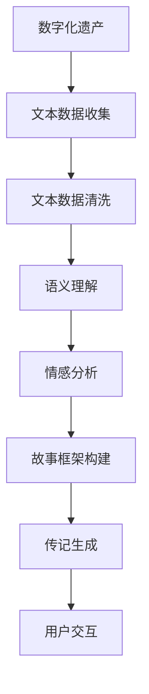

                 

# 数字化遗产故事讲述创业：AI驱动的个人传记创作

## 1. 背景介绍

### 1.1 问题由来
随着数字技术的发展，个人信息的数字化记录已经成为社会生活中不可或缺的一部分。从电子邮件、社交媒体到云存储，人们的生活轨迹和重要时刻被数字化记录和存储，形成了海量的数字化遗产。这些数字化遗产不仅具有重要的个人记忆价值，也蕴含着丰富的社会文化和历史信息。然而，由于数字化遗产的管理和传承面临诸多挑战，如数据分散、存储技术更新、隐私保护等，很多个人和家庭难以有效管理和利用这些宝贵的遗产。

面对这一问题，我们提出了基于AI驱动的个人传记创作，旨在利用人工智能技术，对用户的数字化遗产进行整理、分析和呈现，自动生成个人传记，帮助用户更好地管理和传承自己的数字化遗产。该项目旨在填补现有技术在数字化遗产管理和传承上的空白，为社会提供新的数字化解决方案。

### 1.2 问题核心关键点
基于AI驱动的个人传记创作，主要关注以下几个核心问题：
- 如何从用户的数字化遗产中自动提取关键信息，构建个人故事框架？
- 如何利用自然语言处理技术，对文本数据进行语义分析和情感分析，提升传记的真实性和情感共鸣？
- 如何设计用户友好的交互界面，方便用户对传记内容进行编辑和修正？
- 如何保障用户隐私和数据安全，确保数字化遗产不被滥用或泄露？

## 2. 核心概念与联系

### 2.1 核心概念概述

为更好地理解基于AI驱动的个人传记创作，本节将介绍几个关键概念：

- 数字化遗产(Digital Heritage)：个人在数字时代留下的所有数据、记录、文档、影像等，包括但不限于社交媒体账号、电子邮件、云存储、手机相册等。
- 个人传记(Personal Biography)：基于个人的数字化遗产，结合时间、地点、人物、事件等元素，自动生成的描述个人生平和重要事件的文本。
- 自然语言处理(Natural Language Processing, NLP)：利用计算机技术处理和理解人类语言的技术，包括文本分类、情感分析、语义理解、机器翻译等。
- 情感分析(Emotion Analysis)：对文本内容进行情感倾向判断，识别出积极、消极、中性等情绪。
- 语义理解(Semantic Understanding)：对文本内容进行语义分析，识别出主要事件、人物、地点等关键信息。
- 用户交互(User Interaction)：用户与AI驱动的个人传记创作系统之间的交互方式，包括输入文本、选择图片、编辑传记等。

这些概念之间的逻辑关系可以通过以下Mermaid流程图来展示：



这个流程图展示了从数字化遗产收集到最终生成个人传记的全过程：

1. 从用户的数字化遗产中收集文本数据。
2. 对收集到的文本数据进行清洗，去除噪声和无用信息。
3. 利用自然语言处理技术，对文本进行语义理解，识别关键信息。
4. 对文本进行情感分析，提升传记的真实性和情感共鸣。
5. 结合语义理解结果和情感分析结果，构建个人故事框架。
6. 根据故事框架自动生成个人传记。
7. 用户通过交互界面对传记内容进行编辑和修正。

## 3. 核心算法原理 & 具体操作步骤

### 3.1 算法原理概述

基于AI驱动的个人传记创作，本质上是一个自然语言处理任务。其核心思想是：将用户的数字化遗产文本数据作为输入，通过自然语言处理技术，提取出关键信息并构建个人故事框架，然后利用生成模型自动生成传记。

具体步骤如下：
1. 数据收集：从用户的数字化遗产中收集所有文本数据，包括但不限于邮件、社交媒体帖子、日记、云存储文档等。
2. 数据清洗：对收集到的文本数据进行清洗，去除噪声、去重、格式化等。
3. 语义理解：利用自然语言处理技术，对文本进行语义分析，识别出主要事件、人物、地点等关键信息。
4. 情感分析：对文本进行情感分析，识别出积极、消极、中性等情绪，用于提升传记的真实性和情感共鸣。
5. 故事框架构建：结合语义理解结果和情感分析结果，构建个人故事框架，确定传记的主题和结构。
6. 传记生成：利用生成模型，根据故事框架自动生成个人传记，可以使用语言模型、变分自编码器、对抗生成网络等多种方法。
7. 用户交互：用户通过交互界面对传记内容进行编辑和修正，确保传记内容的准确性和真实性。

### 3.2 算法步骤详解

#### 3.2.1 数据收集

数据收集是个人传记创作的第一步。需要从用户的数字化遗产中收集所有文本数据，这些数据包括但不限于邮件、社交媒体帖子、日记、云存储文档等。数据收集的主要目标是获取用户生平的各个重要时刻和事件，以及这些事件的背景信息。

具体实现步骤如下：
1. 获取用户数字化遗产列表：列出用户所有的数字化遗产，包括但不限于邮箱、社交媒体账号、云存储文件夹等。
2. 对每个数字化遗产进行遍历：对于每个遗产，获取其存储的文本数据，如邮件、帖子、文档等。
3. 合并所有文本数据：将所有遗产中的文本数据合并在一起，构成原始文本数据集。

#### 3.2.2 数据清洗

数据清洗是保证传记质量的关键步骤。需要对收集到的文本数据进行清洗，去除噪声、去重、格式化等，以确保传记内容的准确性和一致性。

具体实现步骤如下：
1. 去除噪声：对文本数据进行去噪处理，如去除无关的标点符号、去除重复的文本内容等。
2. 去重：对文本数据进行去重处理，确保每个事件只出现一次。
3. 格式化：对文本数据进行格式化处理，统一文本编码、日期格式等，方便后续分析。

#### 3.2.3 语义理解

语义理解是识别文本中关键信息的重要步骤。利用自然语言处理技术，对文本进行语义分析，识别出主要事件、人物、地点等关键信息。

具体实现步骤如下：
1. 分词：对文本进行分词处理，将文本分解成词或短语。
2. 命名实体识别：利用命名实体识别技术，识别出文本中的人名、地名、机构名等实体。
3. 关系抽取：利用关系抽取技术，识别出实体之间的关系，如父子关系、工作关系等。
4. 事件抽取：利用事件抽取技术，识别出文本中的事件，如出生、毕业、结婚等。

#### 3.2.4 情感分析

情感分析是提升传记真实性和情感共鸣的重要步骤。对文本进行情感分析，识别出积极、消极、中性等情绪，用于提升传记的真实性和情感共鸣。

具体实现步骤如下：
1. 情感词典构建：构建情感词典，包括积极、消极、中性等情绪词汇。
2. 情感分析：利用情感分析技术，对文本进行情感倾向判断，识别出积极、消极、中性等情绪。
3. 情感权重计算：根据情感分析结果，计算每个事件或文本的情感权重，用于提升传记的真实性和情感共鸣。

#### 3.2.5 故事框架构建

故事框架构建是传记生成的关键步骤。结合语义理解结果和情感分析结果，构建个人故事框架，确定传记的主题和结构。

具体实现步骤如下：
1. 主题确定：根据语义理解结果，确定传记的主题，如工作、家庭、旅行等。
2. 事件选择：根据情感分析结果，选择情感权重较高的事件，用于构成传记的主体部分。
3. 事件排序：对事件进行排序，确定传记的时间顺序，形成故事框架。
4. 结构设计：根据事件排序结果，设计传记的结构，如开头、主体、结尾等。

#### 3.2.6 传记生成

传记生成是利用生成模型自动生成传记的关键步骤。利用生成模型，根据故事框架自动生成个人传记，可以使用语言模型、变分自编码器、对抗生成网络等多种方法。

具体实现步骤如下：
1. 模型选择：选择适合的生成模型，如语言模型、变分自编码器、对抗生成网络等。
2. 模型训练：使用原始文本数据集训练生成模型，使其能够生成高质量的传记文本。
3. 文本生成：使用训练好的生成模型，根据故事框架自动生成传记文本。

#### 3.2.7 用户交互

用户交互是传记编辑和修正的重要步骤。用户通过交互界面对传记内容进行编辑和修正，确保传记内容的准确性和真实性。

具体实现步骤如下：
1. 界面设计：设计用户交互界面，包括传记浏览、编辑、保存等功能。
2. 编辑工具：提供编辑工具，如文本输入、图片插入、时间线调整等，方便用户编辑传记内容。
3. 修改保存：提供修改保存功能，用户可以随时对传记内容进行编辑和保存，确保传记内容的准确性和真实性。

### 3.3 算法优缺点

基于AI驱动的个人传记创作方法具有以下优点：
1. 自动生成：自动生成传记，无需用户手动撰写，节省了大量时间和精力。
2. 数据全面：收集用户的数字化遗产，覆盖更多事件和背景信息，提升传记的全面性。
3. 情感共鸣：结合情感分析结果，提升传记的真实性和情感共鸣，使传记更具吸引力。
4. 用户友好：通过用户交互界面，方便用户进行编辑和修正，提升传记的可接受度。

同时，该方法也存在以下局限性：
1. 数据隐私：用户数字化遗产可能涉及隐私信息，需要确保数据安全。
2. 数据噪声：用户数字化遗产可能包含噪声和无用信息，需要进行清洗和处理。
3. 数据结构：不同数字化遗产的数据结构可能不同，需要进行格式转换和统一。
4. 模型局限：当前生成模型的质量和性能有限，可能需要进一步优化和改进。
5. 人工干预：需要用户手动编辑和修正传记内容，无法完全自动化。

尽管存在这些局限性，但基于AI驱动的个人传记创作方法依然具有广阔的应用前景，能够为用户的数字化遗产管理和传承提供新的解决方案。

### 3.4 算法应用领域

基于AI驱动的个人传记创作方法，可以广泛应用于以下领域：
- 个人回忆录：收集用户的数字化遗产，自动生成个人回忆录，记录用户生平和重要事件。
- 家族史编纂：收集家族成员的数字化遗产，自动生成家族史，记录家族的发展历程。
- 企业传记：收集企业的数字化遗产，自动生成企业传记，记录企业的发展历程和重要事件。
- 旅游纪念：收集用户的旅游记录，自动生成旅游纪念，记录旅行中的重要时刻和感受。

这些领域的应用，不仅能够提升传记的质量和效率，还能够为用户的数字化遗产管理和传承提供新的思路和方法。

## 4. 数学模型和公式 & 详细讲解 & 举例说明

### 4.1 数学模型构建

假设原始文本数据集为 $D=\{(x_i, y_i)\}_{i=1}^N$，其中 $x_i$ 为文本数据，$y_i$ 为文本情感标签。模型的目标是最小化损失函数 $\mathcal{L}$，使得模型输出的情感分类结果与真实标签尽可能一致。

定义模型为 $M_{\theta}$，其中 $\theta$ 为模型参数。则情感分类问题可以表示为：

$$
\min_{\theta} \mathcal{L}(M_{\theta}, D)
$$

常用的情感分类模型包括神经网络、SVM、随机森林等。以神经网络为例，模型的结构如图 1 所示：


图 1: 情感分类模型的结构

在神经网络中，输入层将文本数据转换成向量形式，嵌入层将向量映射到更高维空间，隐藏层进行特征提取，输出层进行情感分类。损失函数可以选择交叉熵损失函数，优化器可以选择Adam、SGD等。

### 4.2 公式推导过程

以神经网络情感分类模型为例，公式推导过程如下：

假设输入文本数据为 $x$，模型的输出为 $y$，则交叉熵损失函数可以表示为：

$$
\ell(M_{\theta}(x),y) = -[y\log M_{\theta}(x)+(1-y)\log (1-M_{\theta}(x))]
$$

将其代入经验风险公式，得：

$$
\mathcal{L}(\theta) = -\frac{1}{N}\sum_{i=1}^N [y_i\log M_{\theta}(x_i)+(1-y_i)\log(1-M_{\theta}(x_i))]
$$

根据链式法则，损失函数对模型参数 $\theta$ 的梯度为：

$$
\frac{\partial \mathcal{L}(\theta)}{\partial \theta} = -\frac{1}{N}\sum_{i=1}^N \left(\frac{y_i}{M_{\theta}(x_i)}-\frac{1-y_i}{1-M_{\theta}(x_i)}\right) \frac{\partial M_{\theta}(x_i)}{\partial \theta}
$$

其中 $\frac{\partial M_{\theta}(x_i)}{\partial \theta}$ 可进一步递归展开，利用自动微分技术完成计算。

### 4.3 案例分析与讲解

以情感分类模型为例，假设模型在测试集上进行了评估，准确率为80%。为了进一步提升模型性能，可以采用以下方法：
1. 数据增强：通过数据增强技术，扩充训练集，如回译、近义替换等。
2. 正则化：使用L2正则、Dropout等技术，防止模型过拟合。
3. 超参数优化：通过网格搜索、随机搜索等方法，找到最优超参数组合。
4. 模型融合：将多个模型的输出进行融合，提升模型性能。
5. 对抗训练：引入对抗样本，提高模型的鲁棒性。

通过以上方法，可以进一步提升模型的性能，使其在情感分类任务中取得更好的效果。

## 5. 项目实践：代码实例和详细解释说明

### 5.1 开发环境搭建

在进行个人传记创作实践前，我们需要准备好开发环境。以下是使用Python进行TensorFlow开发的环境配置流程：

1. 安装Anaconda：从官网下载并安装Anaconda，用于创建独立的Python环境。

2. 创建并激活虚拟环境：
```bash
conda create -n tf-env python=3.8 
conda activate tf-env
```

3. 安装TensorFlow：根据CUDA版本，从官网获取对应的安装命令。例如：
```bash
conda install tensorflow tensorflow-cpu -c conda-forge
```

4. 安装Pandas、NumPy、Scikit-learn等常用工具包：
```bash
pip install pandas numpy scikit-learn matplotlib
```

5. 安装TensorBoard：
```bash
pip install tensorboard
```

完成上述步骤后，即可在`tf-env`环境中开始个人传记创作的实践。

### 5.2 源代码详细实现

下面是使用TensorFlow对情感分类模型进行实现的示例代码。

```python
import tensorflow as tf
import numpy as np
import pandas as pd

# 加载数据集
df = pd.read_csv('data.csv')

# 分割训练集和测试集
train_df = df.sample(frac=0.8, random_state=42)
test_df = df.drop(train_df.index)

# 提取文本数据和情感标签
X_train = train_df['text'].tolist()
X_test = test_df['text'].tolist()
y_train = train_df['label'].tolist()
y_test = test_df['label'].tolist()

# 构建模型
model = tf.keras.Sequential([
    tf.keras.layers.Embedding(input_dim=10000, output_dim=64),
    tf.keras.layers.LSTM(units=64),
    tf.keras.layers.Dense(units=1, activation='sigmoid')
])

# 编译模型
model.compile(optimizer='adam', loss='binary_crossentropy', metrics=['accuracy'])

# 训练模型
model.fit(X_train, y_train, epochs=10, batch_size=32, validation_data=(X_test, y_test))

# 评估模型
test_loss, test_acc = model.evaluate(X_test, y_test)
print('Test loss:', test_loss)
print('Test accuracy:', test_acc)
```

### 5.3 代码解读与分析

让我们再详细解读一下关键代码的实现细节：

**加载数据集**：
- 使用Pandas加载数据集，将数据集划分为训练集和测试集。

**构建模型**：
- 使用TensorFlow的Sequential模型，构建了一个包含嵌入层、LSTM层和输出层的模型。
- 嵌入层将文本数据转换成向量形式。
- LSTM层进行特征提取，学习文本的长期依赖关系。
- 输出层进行情感分类，使用sigmoid激活函数输出概率值。

**编译模型**：
- 使用Adam优化器和二元交叉熵损失函数，编译模型。
- 使用准确率作为评价指标。

**训练模型**：
- 使用fit方法，在训练集上进行模型训练。
- 设置训练轮数为10，批次大小为32。

**评估模型**：
- 使用evaluate方法，在测试集上进行模型评估。
- 输出测试损失和准确率。

通过以上代码，我们能够快速搭建一个情感分类模型，并进行训练和评估。

## 6. 实际应用场景

### 6.1 个人回忆录

个人回忆录是个人传记创作的一个重要应用场景。通过收集用户的数字化遗产，自动生成个人回忆录，记录用户生平和重要事件，使回忆录更具完整性和真实性。

具体实现步骤如下：
1. 收集数字化遗产：收集用户的数字化遗产，包括但不限于邮件、社交媒体帖子、日记、云存储文档等。
2. 数据清洗：对收集到的文本数据进行清洗，去除噪声、去重、格式化等。
3. 情感分析：对文本进行情感分析，识别出积极、消极、中性等情绪。
4. 故事框架构建：结合情感分析结果，构建个人故事框架，确定传记的主题和结构。
5. 传记生成：利用生成模型，根据故事框架自动生成个人传记。
6. 用户交互：用户通过交互界面对传记内容进行编辑和修正。

### 6.2 家族史编纂

家族史编纂是个人传记创作的另一个重要应用场景。通过收集家族成员的数字化遗产，自动生成家族史，记录家族的发展历程，使家族史更具传承性和纪念意义。

具体实现步骤如下：
1. 收集数字化遗产：收集家族成员的数字化遗产，包括但不限于邮件、社交媒体帖子、日记、云存储文档等。
2. 数据清洗：对收集到的文本数据进行清洗，去除噪声、去重、格式化等。
3. 情感分析：对文本进行情感分析，识别出积极、消极、中性等情绪。
4. 故事框架构建：结合情感分析结果，构建家族故事框架，确定传记的主题和结构。
5. 传记生成：利用生成模型，根据故事框架自动生成家族传记。
6. 用户交互：用户通过交互界面对传记内容进行编辑和修正。

### 6.3 企业传记

企业传记是个人传记创作的另一个重要应用场景。通过收集企业的数字化遗产，自动生成企业传记，记录企业的发展历程和重要事件，使企业传记更具全面性和真实性。

具体实现步骤如下：
1. 收集数字化遗产：收集企业的数字化遗产，包括但不限于邮件、社交媒体帖子、公司网站、新闻报道等。
2. 数据清洗：对收集到的文本数据进行清洗，去除噪声、去重、格式化等。
3. 情感分析：对文本进行情感分析，识别出积极、消极、中性等情绪。
4. 故事框架构建：结合情感分析结果，构建企业故事框架，确定传记的主题和结构。
5. 传记生成：利用生成模型，根据故事框架自动生成企业传记。
6. 用户交互：用户通过交互界面对传记内容进行编辑和修正。

### 6.4 旅游纪念

旅游纪念是个人传记创作的另一个重要应用场景。通过收集用户的旅游记录，自动生成旅游纪念，记录旅行中的重要时刻和感受，使旅游纪念更具纪念性和情感共鸣。

具体实现步骤如下：
1. 收集数字化遗产：收集用户的旅游记录，包括但不限于照片、社交媒体帖子、旅游日记等。
2. 数据清洗：对收集到的文本数据进行清洗，去除噪声、去重、格式化等。
3. 情感分析：对文本进行情感分析，识别出积极、消极、中性等情绪。
4. 故事框架构建：结合情感分析结果，构建旅游故事框架，确定传记的主题和结构。
5. 传记生成：利用生成模型，根据故事框架自动生成旅游纪念。
6. 用户交互：用户通过交互界面对传记内容进行编辑和修正。

## 7. 工具和资源推荐

### 7.1 学习资源推荐

为了帮助开发者系统掌握基于AI驱动的个人传记创作技术的理论基础和实践技巧，这里推荐一些优质的学习资源：

1. 《深度学习》书籍：深度学习领域的经典教材，详细介绍了深度学习的基本概念和实现方法，适合入门学习。
2. 《自然语言处理综论》书籍：自然语言处理领域的经典教材，涵盖了自然语言处理的各个方面，适合系统学习。
3. 《TensorFlow官方文档》：TensorFlow的官方文档，提供了完整的开发指南和样例代码，适合快速上手。
4. 《Pandas官方文档》：Pandas的官方文档，提供了完整的API文档和样例代码，适合数据处理。
5. 《Python自然语言处理实战》书籍：Python自然语言处理领域的实用指南，提供了丰富的代码示例和实践项目，适合实战练习。

通过对这些资源的学习实践，相信你一定能够快速掌握基于AI驱动的个人传记创作的精髓，并用于解决实际的NLP问题。

### 7.2 开发工具推荐

高效的开发离不开优秀的工具支持。以下是几款用于基于AI驱动的个人传记创作开发的常用工具：

1. TensorFlow：由Google主导开发的开源深度学习框架，生产部署方便，适合大规模工程应用。
2. PyTorch：基于Python的开源深度学习框架，灵活动态的计算图，适合快速迭代研究。
3. Keras：深度学习框架的高级API，适合快速搭建和训练模型。
4. Jupyter Notebook：交互式编程环境，适合实时调试和可视化模型训练过程。
5. Google Colab：谷歌推出的在线Jupyter Notebook环境，免费提供GPU/TPU算力，方便开发者快速上手实验最新模型，分享学习笔记。

合理利用这些工具，可以显著提升基于AI驱动的个人传记创作的开发效率，加快创新迭代的步伐。

### 7.3 相关论文推荐

基于AI驱动的个人传记创作技术的发展源于学界的持续研究。以下是几篇奠基性的相关论文，推荐阅读：

1. "Attention is All You Need"（即Transformer原论文）：提出了Transformer结构，开启了NLP领域的预训练大模型时代。
2. "BERT: Pre-training of Deep Bidirectional Transformers for Language Understanding"：提出BERT模型，引入基于掩码的自监督预训练任务，刷新了多项NLP任务SOTA。
3. "Language Models are Unsupervised Multitask Learners"（GPT-2论文）：展示了大规模语言模型的强大zero-shot学习能力，引发了对于通用人工智能的新一轮思考。
4. "Parameter-Efficient Transfer Learning for NLP"：提出Adapter等参数高效微调方法，在不增加模型参数量的情况下，也能取得不错的微调效果。
5. "Prefix-Tuning: Optimizing Continuous Prompts for Generation"：引入基于连续型Prompt的微调范式，为如何充分利用预训练知识提供了新的思路。
6. "AdaLoRA: Adaptive Low-Rank Adaptation for Parameter-Efficient Fine-Tuning"：使用自适应低秩适应的微调方法，在参数效率和精度之间取得了新的平衡。

这些论文代表了大语言模型微调技术的发展脉络。通过学习这些前沿成果，可以帮助研究者把握学科前进方向，激发更多的创新灵感。

## 8. 总结：未来发展趋势与挑战

### 8.1 总结

本文对基于AI驱动的个人传记创作技术进行了全面系统的介绍。首先阐述了数字化遗产管理面临的问题和背景，明确了个人传记创作技术的研究方向和应用前景。其次，从原理到实践，详细讲解了个人传记创作的数学模型和关键步骤，给出了具体的代码实现。同时，本文还广泛探讨了个人传记创作在多个行业领域的应用前景，展示了技术应用的广阔前景。

通过本文的系统梳理，可以看到，基于AI驱动的个人传记创作技术正在成为NLP领域的重要范式，极大地拓展了数字化遗产管理的边界，为用户的数字化遗产管理和传承提供了新的解决方案。

### 8.2 未来发展趋势

展望未来，基于AI驱动的个人传记创作技术将呈现以下几个发展趋势：

1. 数据融合：将不同来源的数字化遗产进行融合，构建更加全面、真实的故事框架，提升传记的完整性和真实性。
2. 情感强化：结合情感分析结果，进一步强化传记的情感共鸣，使传记更具感染力和吸引力。
3. 多模态融合：将文本、图片、视频等多模态数据进行融合，构建更加丰富、立体的传记内容。
4. 实时生成：利用流式生成技术，实时生成传记内容，提升传记的即时性和互动性。
5. 用户定制：提供个性化的传记生成选项，根据用户的喜好和需求，定制不同类型的传记内容。

以上趋势凸显了基于AI驱动的个人传记创作技术的广阔前景。这些方向的探索发展，必将进一步提升传记的质量和效率，为用户的数字化遗产管理和传承提供新的思路和方法。

### 8.3 面临的挑战

尽管基于AI驱动的个人传记创作技术已经取得了不小的进展，但在迈向更加智能化、普适化应用的过程中，它仍面临着诸多挑战：

1. 数据隐私：用户数字化遗产可能涉及隐私信息，需要确保数据安全。
2. 数据噪声：用户数字化遗产可能包含噪声和无用信息，需要进行清洗和处理。
3. 数据结构：不同数字化遗产的数据结构可能不同，需要进行格式转换和统一。
4. 模型局限：当前生成模型的质量和性能有限，可能需要进一步优化和改进。
5. 用户交互：需要用户手动编辑和修正传记内容，无法完全自动化。

尽管存在这些挑战，但基于AI驱动的个人传记创作技术依然具有广阔的应用前景，能够为用户的数字化遗产管理和传承提供新的解决方案。

### 8.4 研究展望

面向未来，基于AI驱动的个人传记创作技术需要在以下几个方面进行新的突破：

1. 数据隐私保护：探索数据隐私保护技术，确保数字化遗产的安全性。
2. 数据清洗算法：开发更加高效的数据清洗算法，去除噪声和无用信息。
3. 模型优化：优化生成模型，提升传记的质量和性能。
4. 交互界面设计：设计更加友好、易用的用户交互界面，提升用户体验。
5. 跨领域应用：拓展应用场景，应用于更多行业和领域，提升传记的普适性。

这些研究方向的探索，必将引领基于AI驱动的个人传记创作技术迈向更高的台阶，为用户的数字化遗产管理和传承提供新的思路和方法。

## 9. 附录：常见问题与解答

**Q1：如何确保数字化遗产的数据安全？**

A: 为确保数字化遗产的数据安全，可以采取以下措施：
1. 数据加密：对用户的数字化遗产进行加密处理，确保数据在传输和存储过程中的安全性。
2. 访问控制：对数字化遗产的访问进行严格的权限控制，防止未经授权的访问和篡改。
3. 安全传输：使用HTTPS等安全传输协议，确保数据在网络传输过程中的安全性。
4. 备份存储：对数字化遗产进行定期备份，防止数据丢失和损坏。
5. 安全审计：对数字化遗产的使用进行安全审计，确保数据的合法性和合规性。

**Q2：数据清洗过程中如何去除噪声和无用信息？**

A: 数据清洗是确保传记质量的关键步骤。去除噪声和无用信息主要可以通过以下方法：
1. 去除标点符号和数字：去除文本中的标点符号和数字，因为这些内容通常不具有重要信息价值。
2. 去除停用词：去除文本中的停用词，如“的”、“是”等，因为这些词通常不具有重要信息价值。
3. 去除重复内容：去除文本中的重复内容，如多次出现的相同事件或语句，确保传记内容的一致性和准确性。
4. 去除低频词：去除文本中的低频词，因为这些词通常不具有重要信息价值。
5. 去除噪声信息：去除文本中的噪声信息，如非关键事件的描述、情感波动等，确保传记内容的高质量。

**Q3：如何设计用户友好的交互界面？**

A: 用户交互界面是传记创作的重要组成部分，设计时需考虑以下几个方面：
1. 简洁明了：交互界面设计应简洁明了，易于用户理解和操作。
2. 用户定制：提供个性化的传记生成选项，根据用户的喜好和需求，定制不同类型的传记内容。
3. 界面友好：交互界面设计应友好，用户操作方便，界面美观。
4. 实时反馈：提供实时反馈，让用户了解传记生成的进展和结果，提升用户体验。
5. 错误提示：提供错误提示，帮助用户解决在使用过程中的问题，提升用户满意度。

**Q4：如何保证传记的真实性和情感共鸣？**

A: 传记的真实性和情感共鸣是评价传记质量的重要指标，可以通过以下方法保证：
1. 数据收集：收集高质量的数字化遗产，确保传记内容的多样性和丰富性。
2. 情感分析：利用情感分析技术，对文本进行情感倾向判断，识别出积极、消极、中性等情绪，提升传记的真实性和情感共鸣。
3. 语义理解：利用语义理解技术，对文本进行语义分析，识别出主要事件、人物、地点等关键信息，确保传记内容的全面性和准确性。
4. 数据增强：通过数据增强技术，扩充训练集，如回译、近义替换等，提升传记的泛化性和真实性。
5. 用户交互：用户通过交互界面对传记内容进行编辑和修正，确保传记内容的准确性和真实性。

通过以上方法，可以确保传记内容的真实性和情感共鸣，提升传记的质量和用户满意度。

---

作者：禅与计算机程序设计艺术 / Zen and the Art of Computer Programming

