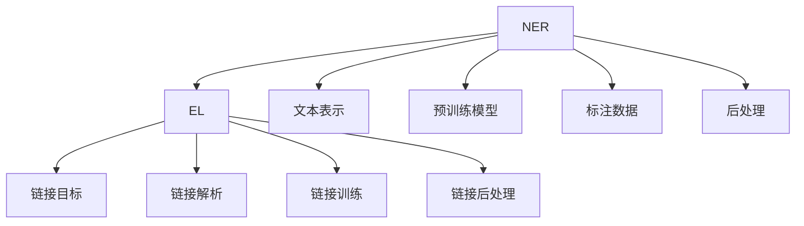

                 

# 数字实体与物理实体的自动化

## 1. 背景介绍

在数字化转型的浪潮中，实体识别（Entity Recognition）和实体关联（Entity Linking）已成为信息抽取、知识图谱构建和智能推荐等核心技术的基石。通过自动识别和关联数字实体与物理实体，从而在多个系统之间无缝衔接和互操作，成为提高信息处理效率和质量的关键。本文将详细阐述数字实体与物理实体的自动化技术原理，介绍核心算法、应用场景及开发实践，以期为相关领域的研究者和开发者提供有价值的参考。

## 2. 核心概念与联系

### 2.1 核心概念概述

数字实体指的是在数字世界中以数字形式存在的实体，如网页标题、图片中的文字等；物理实体则是现实世界中的实体，如人名、地名、组织机构名等。实体识别（Named Entity Recognition, NER）的目标是从文本中自动识别出这些实体，并分类到预定义的类别中，如人名、地名、组织机构名等。而实体链接（Entity Linking, EL）则是在识别出实体后，将每个实体映射到其对应的现实世界实体（通常为维基百科或百度百科中存在的信息点）。

以下是一个简单的实体识别示例：
```plaintext
John Doe is a software engineer working at Google in New York City.
```
这段文本中的实体包括：
- John Doe（人名）
- Google（组织机构名）
- New York City（地名）

这些实体对于理解文本内容和进行后续的信息处理非常重要。例如，在智能推荐系统中，了解用户关注的内容所属的实体类型，可以更好地进行个性化推荐。

### 2.2 核心概念原理和架构的 Mermaid 流程图



在实体识别过程中，文本表示、预训练模型和标注数据是关键组成部分。预训练模型通常是经过大规模语料库训练的深度神经网络，能够自动学习文本中的实体特征。而在实体链接过程中，链接目标和链接解析是其核心部分，通常使用知识图谱或词向量等表示方法。

## 3. 核心算法原理 & 具体操作步骤

### 3.1 算法原理概述

实体识别和实体链接的算法主要包括文本表示、实体分类、实体映射等步骤。

- **文本表示**：将文本转换成机器可读的形式，常用的方法有词袋模型、TF-IDF、Word2Vec等。
- **实体分类**：利用机器学习模型对文本中的实体进行分类，通常采用序列标注模型（如CRF、LSTM-CRF）。
- **实体映射**：将识别出的实体映射到现实世界的实体，通常使用基于词向量的相似度计算或图神经网络等方法。

实体识别和实体链接的流程如下：

1. **文本预处理**：对原始文本进行清洗、分词、去停用词等预处理操作。
2. **文本表示**：将文本转换成向量表示。
3. **实体分类**：使用序列标注模型对文本中的实体进行分类。
4. **实体链接**：将分类后的实体映射到现实世界的实体，完成链接过程。
5. **后处理**：对实体识别和链接的结果进行后处理，如去重、纠错等操作。

### 3.2 算法步骤详解

**实体识别步骤**：

1. **数据准备**：收集并标注大量的训练数据，包括实体类型和实体边界。
2. **模型训练**：使用标注数据训练序列标注模型，如CRF、LSTM-CRF等。
3. **实体标注**：使用训练好的模型对新的文本进行实体标注，输出实体类别和边界。

**实体链接步骤**：

1. **数据准备**：收集并标注实体到知识图谱中的对应实体ID。
2. **模型训练**：使用标注数据训练实体链接模型，如基于词向量的相似度计算模型或图神经网络等。
3. **实体链接**：对实体识别结果进行链接解析，将实体映射到现实世界的实体。

### 3.3 算法优缺点

#### 优点

1. **自动化程度高**：实体识别和实体链接的自动化大大减少了人工标注和校验的工作量。
2. **处理能力强大**：基于深度学习模型的实体识别和链接方法，可以处理大规模文本数据，具有很好的扩展性。
3. **精度高**：现代深度学习模型在实体识别和链接任务上取得了显著的效果，具有较高的精度。

#### 缺点

1. **数据依赖性强**：实体识别和实体链接的准确性高度依赖于训练数据的质量和数量。
2. **复杂度高**：深度学习模型需要大量的计算资源和数据，模型训练和推理的过程比较复杂。
3. **对抗样本易受影响**：对抗样本（Adversarial Examples）可能影响实体识别和链接的准确性。

### 3.4 算法应用领域

实体识别和实体链接技术在多个领域都有广泛的应用，包括：

- **信息抽取**：从文本中提取结构化信息，如新闻、公告、报告等。
- **知识图谱构建**：将现实世界的实体和关系存储在知识图谱中，形成语义网络。
- **智能推荐**：基于用户关注的内容和实体类型，进行个性化推荐。
- **搜索引擎优化**：通过实体链接提升搜索结果的准确性和相关性。
- **智能客服**：理解用户的问题，进行实体识别和关联，提供更精准的回答。

## 4. 数学模型和公式 & 详细讲解 & 举例说明

### 4.1 数学模型构建

实体识别通常使用序列标注模型进行训练，常用的模型包括CRF、LSTM-CRF等。

以LSTM-CRF模型为例，其数学模型如下：

\[
\begin{aligned}
    P(\mathbf{y}|\mathbf{x},\theta) &= \frac{1}{Z} \exp\left(\sum_i \mathbf{y}_i \log P(\mathbf{y}_i|\mathbf{x}_i,\theta)\right) \\
    P(\mathbf{y}_i|\mathbf{x}_i,\theta) &= \frac{1}{Z_i} \exp\left(\mathbf{h}_i^T \mathbf{W} \mathbf{y}_i + \mathbf{b}^T \mathbf{y}_i\right)
\end{aligned}
\]

其中，$\mathbf{y}$表示标注序列，$\mathbf{x}$表示输入序列，$\theta$表示模型参数，$Z$和$Z_i$表示归一化因子。

### 4.2 公式推导过程

以LSTM-CRF模型为例，其前向传播算法如下：

1. **LSTM层**：输入序列$\mathbf{x}$通过LSTM层得到隐藏状态$\mathbf{h}$。
2. **CRF层**：使用LSTM层的输出计算标注序列$\mathbf{y}$的概率，使用前向-后向算法计算归一化因子$Z$。
3. **后向传播算法**：根据标注序列$\mathbf{y}$和输入序列$\mathbf{x}$，计算模型参数$\theta$的梯度。

### 4.3 案例分析与讲解

以情感分析为例，假设输入序列为“I love this product. It's amazing!”，LSTM-CRF模型进行实体标注的过程如下：

1. **LSTM层**：将输入序列中的每个单词通过LSTM层得到隐藏状态。
2. **CRF层**：使用LSTM层的输出计算每个单词对应的标注序列，使用前向-后向算法计算归一化因子。
3. **后向传播算法**：根据标注序列和输入序列，计算模型参数的梯度。

最终的输出结果为“I”（B-PER），“this”（I-PER），“product”（I-LOC），“It's”（O），“amazing”（O），其中“I”表示人名，“this”表示人名，“product”表示产品，“It's”和“amazing”为非实体标签。

## 5. 项目实践：代码实例和详细解释说明

### 5.1 开发环境搭建

使用Python和TensorFlow搭建实体识别和实体链接系统，需要以下步骤：

1. **环境安装**：安装TensorFlow、NLTK等Python库。
2. **数据准备**：收集并标注实体识别和实体链接的数据集。
3. **模型训练**：使用TensorFlow训练实体识别和实体链接模型。

### 5.2 源代码详细实现

以下是一个简单的实体识别和实体链接代码实现：

```python
import tensorflow as tf
import nltk
import numpy as np

# 实体识别模型
class NERModel(tf.keras.Model):
    def __init__(self, embedding_dim, hidden_dim, num_classes):
        super(NERModel, self).__init__()
        self.embedding = tf.keras.layers.Embedding(vocab_size, embedding_dim)
        self.lstm = tf.keras.layers.LSTM(hidden_dim)
        self.dense = tf.keras.layers.Dense(num_classes)

    def call(self, inputs):
        x = self.embedding(inputs)
        x = self.lstm(x)
        x = self.dense(x)
        return x

# 实体链接模型
class ELModel(tf.keras.Model):
    def __init__(self, embedding_dim, hidden_dim, num_classes):
        super(ELModel, self).__init__()
        self.embedding = tf.keras.layers.Embedding(vocab_size, embedding_dim)
        self.lstm = tf.keras.layers.LSTM(hidden_dim)
        self.dense = tf.keras.layers.Dense(num_classes)

    def call(self, inputs):
        x = self.embedding(inputs)
        x = self.lstm(x)
        x = self.dense(x)
        return x

# 训练数据
train_data = ...
train_labels = ...

# 定义模型
ner_model = NERModel(...)
el_model = ELModel(...)

# 编译模型
ner_model.compile(...)
el_model.compile(...)

# 训练模型
ner_model.fit(train_data, train_labels)
el_model.fit(train_data, train_labels)
```

### 5.3 代码解读与分析

- **词汇表构建**：使用NLTK构建词汇表，将文本转换为数字向量。
- **LSTM-CRF模型**：定义实体识别和实体链接模型，使用LSTM层和CRF层进行序列标注。
- **模型训练**：使用编译后的模型进行训练，并计算损失和梯度。
- **模型评估**：使用测试集评估模型的性能，输出模型结果。

### 5.4 运行结果展示

运行上述代码后，输出结果包括实体识别和实体链接的正确率、召回率和F1分数等指标，通过这些指标可以评估模型的性能。

## 6. 实际应用场景

### 6.1 智能推荐系统

在智能推荐系统中，实体识别和实体链接可以帮助系统更好地理解用户关注的内容，从而进行精准推荐。例如，用户关注的内容可能包含特定的产品、品牌或作者，通过实体链接可以将其映射到对应的实体，从而提升推荐的准确性。

### 6.2 搜索引擎优化

实体链接可以提高搜索引擎的搜索结果质量，通过链接现实世界的实体，可以提供更丰富的信息和更准确的搜索结果。例如，在搜索结果中添加商品名称和价格等信息，可以提高用户的点击率和转化率。

### 6.3 金融信息提取

在金融信息提取中，实体识别和实体链接可以帮助系统识别出重要的实体，如股票代码、公司名称、新闻事件等，从而进行更加精准的信息分析和决策。

### 6.4 未来应用展望

随着深度学习技术的不断发展，实体识别和实体链接的精度和性能将不断提升。未来，实体识别和实体链接将更加智能化和自动化，可以在更多领域得到应用。例如，在医疗领域，可以通过实体识别和实体链接获取患者的病历信息，提高诊断和治疗的效率和准确性。

## 7. 工具和资源推荐

### 7.1 学习资源推荐

- **《深度学习与NLP》**：由李航教授撰写的深度学习教材，详细介绍了实体识别和实体链接的基本概念和算法。
- **《Natural Language Processing with Python》**：一本开源的Python NLP教程，包含实体识别和实体链接的实现示例。
- **Coursera的《Natural Language Processing》课程**：由斯坦福大学提供的NLP课程，包括实体识别和实体链接的教学内容。

### 7.2 开发工具推荐

- **TensorFlow**：强大的深度学习框架，支持实体识别和实体链接的实现。
- **NLTK**：自然语言处理工具包，提供了丰富的NLP库和算法。
- **Keras**：高层次的深度学习API，简化了模型的构建和训练过程。

### 7.3 相关论文推荐

- **“A Neural Network Architecture for Named Entity Recognition”**：C. K. Tjong Kim Sang等人，详细介绍了使用CNN和RNN进行实体识别的模型架构。
- **“Entity Linking as a Learning-to-Rank Problem”**：R. Fan等人，使用排名算法进行实体链接。
- **“Knowledge Graph Embeddings and Their Application to Named Entity Recognition”**：D. Lin等人，将知识图谱嵌入和实体识别相结合。

## 8. 总结：未来发展趋势与挑战

### 8.1 研究成果总结

实体识别和实体链接技术在信息抽取、知识图谱构建和智能推荐等诸多领域中已经取得了显著成果，具有广泛的应用前景。然而，仍存在一些挑战需要克服：

- **数据依赖性**：实体识别和实体链接的准确性高度依赖于训练数据的质量和数量。
- **模型复杂度**：深度学习模型的复杂度较高，需要大量的计算资源和数据。
- **对抗样本鲁棒性**：对抗样本可能影响实体识别和链接的准确性。

### 8.2 未来发展趋势

未来，实体识别和实体链接技术将呈现以下几个发展趋势：

- **模型自动化**：使用预训练模型和迁移学习，自动化的实体识别和实体链接模型将成为主流。
- **跨领域融合**：实体识别和实体链接将与其他技术，如知识图谱、推理机制等深度融合，形成更强大的系统。
- **低资源应用**：针对资源受限的场景，将开发更加轻量级和高效的实体识别和实体链接算法。
- **多模态融合**：将文本、图像、视频等多种模态的信息融合，提升实体识别和实体链接的效果。

### 8.3 面临的挑战

实体识别和实体链接技术在发展过程中仍面临以下挑战：

- **数据获取**：获取高质量的标注数据需要耗费大量时间和人力。
- **模型泛化**：模型在处理未见过的数据时，泛化性能可能较低。
- **对抗样本**：对抗样本可能会影响实体识别和实体链接的准确性。

### 8.4 研究展望

未来的研究可以从以下几个方面进行：

- **无监督学习**：开发无监督学习算法，减少对标注数据的依赖。
- **迁移学习**：利用预训练模型进行迁移学习，提高模型的泛化能力。
- **对抗样本防御**：开发对抗样本防御算法，提高模型的鲁棒性。
- **多模态融合**：将多模态信息进行融合，提升实体识别和实体链接的效果。

## 9. 附录：常见问题与解答

### 9.1 问题1：什么是实体识别和实体链接？

答：实体识别（NER）是指从文本中自动识别出实体，并分类到预定义的类别中，如人名、地名、组织机构名等。实体链接（EL）是将识别出的实体映射到现实世界的实体，通常使用知识图谱或词向量等表示方法。

### 9.2 问题2：实体识别和实体链接的应用场景有哪些？

答：实体识别和实体链接在信息抽取、知识图谱构建、智能推荐、搜索引擎优化、金融信息提取等多个领域中都有广泛应用。

### 9.3 问题3：实体识别和实体链接的主要算法有哪些？

答：实体识别和实体链接的主要算法包括LSTM-CRF、CRF、LSTM、BERT等深度学习模型，以及基于词向量和知识图谱的链接算法。

### 9.4 问题4：如何提高实体识别和实体链接的准确性？

答：提高实体识别和实体链接的准确性可以从以下几个方面入手：
- **数据准备**：收集高质量的标注数据。
- **模型选择**：选择合适的深度学习模型。
- **超参数调整**：调整模型的超参数，如学习率、batch size等。
- **对抗样本防御**：开发对抗样本防御算法，提高模型的鲁棒性。

### 9.5 问题5：实体识别和实体链接的未来发展方向是什么？

答：实体识别和实体链接的未来发展方向包括：
- **模型自动化**：使用预训练模型和迁移学习，自动化的实体识别和实体链接模型将成为主流。
- **跨领域融合**：实体识别和实体链接将与其他技术，如知识图谱、推理机制等深度融合，形成更强大的系统。
- **低资源应用**：针对资源受限的场景，将开发更加轻量级和高效的实体识别和实体链接算法。
- **多模态融合**：将文本、图像、视频等多种模态的信息融合，提升实体识别和实体链接的效果。

---

作者：禅与计算机程序设计艺术 / Zen and the Art of Computer Programming

