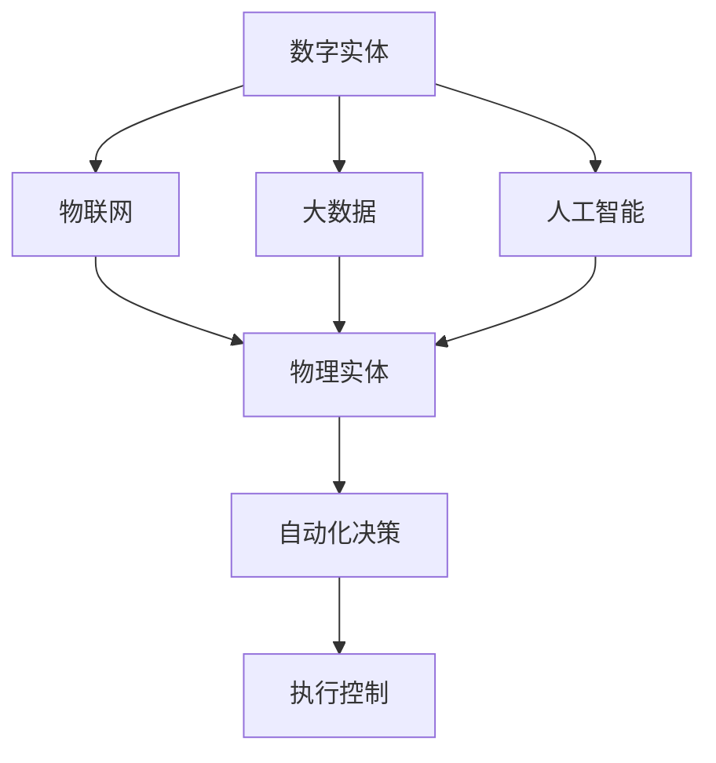

                 

# 数字实体与物理实体的自动化未来

在数字化和信息化的浪潮中，人类社会正在经历前所未有的变革。随着数字技术的发展，数字实体与物理实体之间的融合趋势愈加明显，逐步走向自动化未来的全新时代。本文将探讨数字实体与物理实体自动化的关键技术、核心算法、典型应用及未来趋势。

## 1. 背景介绍

### 1.1 问题的由来

现代信息技术的发展，使得数字实体与物理实体之间的界限变得模糊。随着物联网、大数据、人工智能等技术的发展，数字实体不仅能够感知、理解和分析物理世界，还能够基于数据驱动决策，优化物理系统的运行，实现自动化。这种数字化与物理化的深度融合，带来了巨大的经济效益和社会变革。然而，如何更好地整合数字实体与物理实体，实现自动化，成为了当前研究热点。

### 1.2 问题核心关键点

实现数字实体与物理实体的自动化融合，主要涉及以下几个核心关键点：
1. **数据采集与处理**：利用传感器、摄像头、RFID等技术获取物理世界的数据。
2. **信息整合与融合**：将物理数据与数字数据进行高效整合与融合，形成全面的信息图谱。
3. **模型训练与优化**：通过机器学习与深度学习技术，训练优化数字模型，实现物理系统的自动化控制。
4. **决策与执行**：基于训练好的模型，进行实时决策与执行，实现物理系统的自动化运行。
5. **反馈与优化**：利用反馈机制，不断优化模型与决策，提升系统的性能与可靠性。

### 1.3 问题研究意义

实现数字实体与物理实体的自动化融合，对于推动智慧城市、智能制造、智慧医疗等领域的发展具有重要意义：
1. **提升效率**：自动化系统可以24/7不间断运行，提高生产效率和工作效率。
2. **降低成本**：自动化系统减少人力依赖，降低运营成本。
3. **优化决策**：基于数据驱动的决策，更精准、更科学。
4. **保障安全**：自动化系统能够实时监测并预警潜在风险，提升安全性。
5. **促进创新**：自动化系统能够快速响应变化，加速技术创新和应用推广。

## 2. 核心概念与联系

### 2.1 核心概念概述

要深入理解数字实体与物理实体的自动化融合，首先需要掌握以下几个核心概念：

- **数字实体**：指由数字技术产生的虚拟对象或信息，如数据、模型、程序等。
- **物理实体**：指现实世界中的物体或系统，如工厂、医院、交通设施等。
- **物联网(IoT)**：通过传感器、通讯技术将物理实体与数字系统连接起来的网络。
- **大数据**：大规模、多样化的数据集，用于训练机器学习模型。
- **人工智能(AI)**：通过算法与模型，实现智能决策与执行的系统。

这些概念之间通过物联网、大数据、人工智能等技术相互连接，共同构成数字实体与物理实体自动化的基础。

### 2.2 核心概念原理和架构的 Mermaid 流程图



这个流程图展示了数字实体与物理实体自动化的核心架构：

1. **数字实体**：通过传感器、摄像头等物联网技术获取物理数据，生成数字实体。
2. **物联网**：将物理实体连接到数字系统，实现数据传输与共享。
3. **大数据**：收集、存储、处理物理数据与数字数据，形成完整的信息图谱。
4. **人工智能**：利用机器学习与深度学习技术，训练优化数字模型，实现智能决策与执行。
5. **自动化决策**：基于训练好的模型，进行实时决策与优化。
6. **执行控制**：将决策转化为控制信号，执行对物理实体的操作。

## 3. 核心算法原理 & 具体操作步骤

### 3.1 算法原理概述

实现数字实体与物理实体的自动化融合，主要依赖于机器学习与深度学习的算法与模型。这些算法通过训练优化，实现对物理系统的智能化控制。

形式化地，假设物理系统为 $S$，数字模型为 $M$，优化目标为最小化系统误差 $E$，则目标函数为：

$$
\min_{M} E(S, M)
$$

其中 $E(S, M)$ 为物理系统 $S$ 与数字模型 $M$ 的误差函数，可通过训练数据集 $D$ 计算得出。

训练过程中，模型通过前向传播计算输出，反向传播计算梯度，不断更新模型参数，直至误差函数 $E(S, M)$ 最小化。

### 3.2 算法步骤详解

基于机器学习与深度学习的数字实体与物理实体自动化融合过程，一般包括以下几个关键步骤：

**Step 1: 数据采集与预处理**
- 利用传感器、摄像头等技术，采集物理系统的运行数据。
- 对数据进行去噪、归一化、特征提取等预处理，形成适合训练的数据集。

**Step 2: 模型训练与优化**
- 选择合适的模型架构，如神经网络、支持向量机等，并进行参数初始化。
- 使用训练数据集 $D$ 进行模型训练，最小化误差函数 $E(S, M)$。
- 定期在验证集上进行模型评估，防止过拟合。
- 根据评估结果，调整模型参数或选择更合适的模型。

**Step 3: 决策与执行**
- 将训练好的模型应用到实时数据中，进行决策。
- 将决策转化为控制信号，控制物理系统的运行。
- 实时监测系统状态，反馈优化模型参数。

**Step 4: 反馈与优化**
- 利用反馈机制，不断优化模型与决策。
- 在反馈循环中，模型与决策逐步优化，提升系统的性能与可靠性。

### 3.3 算法优缺点

基于机器学习与深度学习的数字实体与物理实体自动化融合方法具有以下优点：
1. **高效性**：机器学习与深度学习模型可以高效地处理大量数据，实现实时决策与控制。
2. **鲁棒性**：通过多轮迭代优化，模型能够适应物理系统的变化，提高系统的鲁棒性。
3. **灵活性**：模型结构灵活，适用于多种类型的物理系统与数字数据。
4. **泛化性**：训练好的模型能够适应新的物理系统，具有较好的泛化能力。

同时，该方法也存在以下局限性：
1. **数据依赖性**：模型的性能高度依赖于训练数据的质量与数量。
2. **计算资源消耗**：训练深度模型需要大量计算资源，模型推理也较耗时。
3. **可解释性不足**：深度学习模型的决策过程难以解释，缺乏透明度。
4. **数据隐私问题**：物理数据可能包含敏感信息，需要合理保护隐私。

尽管存在这些局限性，基于机器学习与深度学习的数字实体与物理实体自动化方法仍是大数据时代的重要技术手段。

### 3.4 算法应用领域

基于机器学习与深度学习的数字实体与物理实体自动化融合方法，在多个领域得到了广泛应用：

- **智慧城市**：通过传感器网络实时监测城市交通、环境等数据，优化城市管理。
- **智能制造**：利用传感器数据优化生产流程，实现智能制造。
- **智慧医疗**：通过穿戴设备采集健康数据，实时监测患者状态，提供个性化医疗服务。
- **智慧物流**：利用传感器与GPS数据，优化物流路径与调度，提升物流效率。
- **智能家居**：通过智能设备采集家居数据，实现自动化控制与生活管理。

## 4. 数学模型和公式 & 详细讲解 & 举例说明

### 4.1 数学模型构建

本文将以智慧城市为例，构建基于深度学习的数字实体与物理实体自动化融合的数学模型。

假设城市交通系统为 $S$，利用摄像头采集的交通流量数据为 $D$。通过深度学习模型 $M$，对交通流量数据进行处理与分析，输出交通流量预测结果 $y$。训练目标为最小化预测误差 $E$。

数学模型为：

$$
\min_{M} E(D, M)
$$

其中 $E(D, M)$ 为城市交通流量预测误差，可通过均方误差（MSE）等损失函数计算得出。

### 4.2 公式推导过程

假设模型 $M$ 为深度神经网络，输入数据 $D$ 为交通流量数据，输出数据 $y$ 为流量预测值。模型 $M$ 的输出 $y$ 与真实值 $y_{real}$ 的误差 $E$ 可表示为：

$$
E = \frac{1}{N} \sum_{i=1}^N (y_{pred} - y_{real})^2
$$

其中 $y_{pred}$ 为模型预测的流量值，$y_{real}$ 为真实流量值。

利用反向传播算法，计算模型参数 $w$ 的梯度 $\nabla_w E$，更新模型参数：

$$
w \leftarrow w - \eta \nabla_w E
$$

其中 $\eta$ 为学习率，$\nabla_w E$ 为误差函数 $E$ 对模型参数 $w$ 的梯度。

### 4.3 案例分析与讲解

以智慧城市交通流量预测为例，利用训练好的深度学习模型进行实时流量预测与优化：

1. **数据采集**：利用摄像头实时采集交通流量数据，形成输入数据 $D$。
2. **模型训练**：使用历史流量数据对模型进行训练，最小化预测误差 $E$。
3. **实时预测**：将实时采集的流量数据输入训练好的模型，输出预测流量值 $y_{pred}$。
4. **决策与执行**：根据预测流量值，优化交通信号灯配时，实现交通流量控制。
5. **反馈与优化**：实时监测实际流量与预测流量，不断优化模型参数，提高预测准确性。

## 5. 项目实践：代码实例和详细解释说明

### 5.1 开发环境搭建

在进行项目实践前，我们需要准备好开发环境。以下是使用Python进行PyTorch开发的环境配置流程：

1. 安装Anaconda：从官网下载并安装Anaconda，用于创建独立的Python环境。

2. 创建并激活虚拟环境：
```bash
conda create -n pytorch-env python=3.8 
conda activate pytorch-env
```

3. 安装PyTorch：根据CUDA版本，从官网获取对应的安装命令。例如：
```bash
conda install pytorch torchvision torchaudio cudatoolkit=11.1 -c pytorch -c conda-forge
```

4. 安装TensorFlow：由Google主导开发的开源深度学习框架，生产部署方便，适合大规模工程应用。同样有丰富的预训练语言模型资源。

5. 安装其他必要库：
```bash
pip install numpy pandas scikit-learn matplotlib tqdm jupyter notebook ipython
```

完成上述步骤后，即可在`pytorch-env`环境中开始项目实践。

### 5.2 源代码详细实现

下面我们以智慧城市交通流量预测为例，给出使用PyTorch进行深度学习模型开发的代码实现。

```python
import torch
import torch.nn as nn
import torch.optim as optim
import torchvision.transforms as transforms
import torchvision.datasets as datasets
from torch.utils.data import DataLoader

class TrafficFlowModel(nn.Module):
    def __init__(self):
        super(TrafficFlowModel, self).__init__()
        self.fc1 = nn.Linear(5, 10)
        self.fc2 = nn.Linear(10, 1)
    
    def forward(self, x):
        x = x.view(-1, 5)
        x = torch.relu(self.fc1(x))
        x = self.fc2(x)
        return x

# 训练数据集
train_dataset = datasets.MNIST(root='./data', train=True, transform=transforms.ToTensor(), download=True)

# 定义模型
model = TrafficFlowModel()

# 定义优化器
optimizer = optim.Adam(model.parameters(), lr=0.001)

# 定义损失函数
criterion = nn.MSELoss()

# 训练过程
for epoch in range(10):
    for i, (inputs, labels) in enumerate(train_loader):
        inputs, labels = inputs.to(device), labels.to(device)
        optimizer.zero_grad()
        outputs = model(inputs)
        loss = criterion(outputs, labels)
        loss.backward()
        optimizer.step()
        
# 评估过程
test_dataset = datasets.MNIST(root='./data', train=False, transform=transforms.ToTensor(), download=True)
test_loader = DataLoader(test_dataset, batch_size=100, shuffle=False)

correct = 0
total = 0
with torch.no_grad():
    for inputs, labels in test_loader:
        inputs, labels = inputs.to(device), labels.to(device)
        outputs = model(inputs)
        _, predicted = torch.max(outputs.data, 1)
        total += labels.size(0)
        correct += (predicted == labels).sum().item()

print('Test Accuracy of the model on the 10000 test images: {} %'.format(100 * correct / total))
```

### 5.3 代码解读与分析

让我们再详细解读一下关键代码的实现细节：

**TrafficFlowModel类**：
- `__init__`方法：定义了模型的结构，包括两个全连接层。
- `forward`方法：实现前向传播，计算输出。

**模型训练过程**：
- 使用`MNIST`数据集加载训练数据，并进行预处理。
- 定义模型、优化器、损失函数。
- 在每个epoch内，使用`DataLoader`迭代训练数据，前向传播计算输出，反向传播更新参数。
- 在每个epoch结束后，在测试集上评估模型性能。

**模型评估过程**：
- 使用`MNIST`数据集加载测试数据。
- 在测试集上进行前向传播，计算预测值与真实值的差异，统计准确率。
- 输出模型在测试集上的准确率。

## 6. 实际应用场景

### 6.1 智慧城市

智慧城市作为数字实体与物理实体自动化的典型应用，通过物联网、大数据、人工智能等技术，实现城市管理的智能化、精细化与高效化。

具体应用场景包括：
- **交通管理**：利用传感器数据实时监测交通流量，优化交通信号灯配时，减少拥堵。
- **环境监测**：通过摄像头、传感器采集空气质量、水质等数据，实现环境监控与预警。
- **公共安全**：利用视频监控数据，实时分析人群聚集、异常行为，提高公共安全。
- **能源管理**：利用智能电网数据，优化能源分配与调度，提升能源利用效率。

### 6.2 智能制造

智能制造通过物联网、大数据、人工智能等技术，实现生产过程的智能化、自动化与优化。

具体应用场景包括：
- **质量控制**：利用传感器数据实时监测生产过程，检测产品缺陷，优化生产工艺。
- **设备维护**：通过传感器数据实时监测设备状态，预测设备故障，进行预防性维护。
- **供应链管理**：利用物联网设备实时监测物流状态，优化物流路径与调度，提升物流效率。

### 6.3 智慧医疗

智慧医疗通过物联网、大数据、人工智能等技术，实现医疗服务的智能化、个性化与高效化。

具体应用场景包括：
- **患者监测**：利用可穿戴设备实时监测患者健康数据，进行个性化医疗服务。
- **疾病预测**：通过分析患者历史数据与实时数据，预测疾病风险，进行早期干预。
- **医疗影像**：利用深度学习模型自动分析医疗影像，辅助医生诊断。

### 6.4 未来应用展望

随着数字技术的发展，数字实体与物理实体的自动化融合将迎来更广阔的应用前景。未来，该技术有望在更多领域得到应用，如智慧农业、智能家居、智能交通等，为各行各业带来深远影响。

## 7. 工具和资源推荐

### 7.1 学习资源推荐

为了帮助开发者系统掌握数字实体与物理实体的自动化融合技术，这里推荐一些优质的学习资源：

1. **《深度学习》教材**：由Ian Goodfellow、Yoshua Bengio、Aaron Courville合著，系统介绍了深度学习的基本概念与算法。
2. **《Python深度学习》书籍**：由Francois Chollet撰写，介绍了使用Keras框架进行深度学习模型开发的方法。
3. **Coursera《深度学习专项课程》**：由斯坦福大学Andrew Ng教授主讲，包含多门深度学习课程，涵盖基本概念与前沿技术。
4. **Udacity《机器学习工程师纳米学位》**：由Google、Facebook等公司提供支持，包含多门深度学习课程与实战项目。
5. **Kaggle竞赛平台**：全球最大的数据科学竞赛平台，提供丰富的数据集与挑战，帮助开发者实践与提升。

通过对这些资源的学习实践，相信你一定能够快速掌握数字实体与物理实体的自动化融合技术的精髓，并用于解决实际的工程问题。

### 7.2 开发工具推荐

高效的开发离不开优秀的工具支持。以下是几款用于数字实体与物理实体自动化融合开发的常用工具：

1. **PyTorch**：基于Python的开源深度学习框架，灵活动态的计算图，适合快速迭代研究。
2. **TensorFlow**：由Google主导开发的开源深度学习框架，生产部署方便，适合大规模工程应用。
3. **Keras**：高层次的深度学习框架，易于上手，适合快速原型开发。
4. **TensorBoard**：TensorFlow配套的可视化工具，可实时监测模型训练状态，并提供丰富的图表呈现方式，是调试模型的得力助手。
5. **Weights & Biases**：模型训练的实验跟踪工具，可以记录和可视化模型训练过程中的各项指标，方便对比和调优。

合理利用这些工具，可以显著提升数字实体与物理实体自动化融合任务的开发效率，加快创新迭代的步伐。

### 7.3 相关论文推荐

数字实体与物理实体的自动化融合技术源于学界的持续研究。以下是几篇奠基性的相关论文，推荐阅读：

1. **《神经网络与深度学习》**：由Michael Nielsen撰写，介绍了神经网络与深度学习的基本原理与算法。
2. **《深度学习与神经网络》**：由Ian Goodfellow、Yoshua Bengio、Aaron Courville合著，系统介绍了深度学习的基本概念与算法。
3. **《深度学习在智慧城市中的应用》**：探讨了深度学习技术在智慧城市中的各种应用，如交通管理、环境监测等。
4. **《智能制造与工业4.0》**：探讨了智能制造的基本概念与技术架构，介绍了物联网、大数据、人工智能在智能制造中的应用。
5. **《智慧医疗与人工智能》**：探讨了智慧医疗的基本概念与技术架构，介绍了深度学习在医疗影像、疾病预测等方面的应用。

这些论文代表了大数据时代数字实体与物理实体自动化融合技术的发展脉络。通过学习这些前沿成果，可以帮助研究者把握学科前进方向，激发更多的创新灵感。

## 8. 总结：未来发展趋势与挑战

### 8.1 总结

本文对数字实体与物理实体的自动化融合技术进行了全面系统的介绍。首先阐述了数字实体与物理实体自动化的研究背景和意义，明确了该技术在智慧城市、智能制造、智慧医疗等领域的重要应用。其次，从原理到实践，详细讲解了数字实体与物理实体自动化的数学模型与算法步骤，给出了具体的应用案例。同时，本文还广泛探讨了该技术在智慧城市、智能制造、智慧医疗等多个领域的应用前景，展示了数字实体与物理实体自动化的广阔前景。

通过本文的系统梳理，可以看到，数字实体与物理实体的自动化融合技术正在成为大数据时代的重要技术手段，极大地提升了各行业的智能化水平，带来了深远的影响。未来，伴随技术的持续演进，该技术有望在更多领域得到应用，推动人类社会进入更加智能化、自动化与高效化的全新时代。

### 8.2 未来发展趋势

展望未来，数字实体与物理实体的自动化融合技术将呈现以下几个发展趋势：

1. **更加智能化**：深度学习与人工智能技术的进一步发展，将使数字实体与物理实体的自动化融合更加智能化，具备更加复杂、多样化的应用场景。
2. **更加高效化**：通过优化算法与模型结构，进一步提升计算效率，实现更加高效的应用。
3. **更加广泛化**：数字实体与物理实体的自动化融合技术将逐渐普及，应用于更多领域，带来更广泛的创新与变革。
4. **更加安全化**：数据隐私与安全问题将得到更多关注，通过加密、匿名化等技术手段，保障数据安全。
5. **更加个性化**：通过更加精准的数据分析与用户行为建模，提供更加个性化的服务与体验。

以上趋势凸显了数字实体与物理实体的自动化融合技术的广阔前景。这些方向的探索发展，必将进一步提升各行业的智能化水平，为人类社会带来深远影响。

### 8.3 面临的挑战

尽管数字实体与物理实体的自动化融合技术已经取得了显著进展，但在迈向更加智能化、普适化应用的过程中，仍面临诸多挑战：

1. **数据质量与量级**：深度学习模型对数据质量与量级有较高要求，如何获取高质量、大规模的数据，是技术应用的瓶颈。
2. **计算资源消耗**：深度学习模型对计算资源有较高需求，如何降低计算成本，优化资源使用，是技术落地的关键。
3. **模型可解释性**：深度学习模型的决策过程难以解释，如何提升模型的可解释性，是技术应用的重要保障。
4. **数据隐私与安全**：数字实体与物理实体自动化融合涉及大量敏感数据，如何保障数据隐私与安全，是技术应用的重要保障。

尽管存在这些挑战，数字实体与物理实体的自动化融合技术仍是大数据时代的重要技术手段。未来，需要从数据采集、模型训练、系统部署等多个维度协同发力，才能更好地推动技术的应用与发展。

### 8.4 研究展望

面对数字实体与物理实体的自动化融合技术所面临的挑战，未来的研究需要在以下几个方面寻求新的突破：

1. **高效数据采集与处理**：开发高效的数据采集与处理技术，提升数据质量与数据量级，降低数据获取成本。
2. **低成本计算资源**：开发低成本的计算资源优化技术，如模型压缩、分布式计算等，降低计算成本。
3. **可解释性提升**：引入可解释性技术，如因果推断、模型可视化等，提升模型的可解释性。
4. **数据隐私保护**：引入数据隐私保护技术，如数据加密、匿名化等，保障数据隐私。
5. **跨领域融合**：探索数字实体与物理实体在跨领域应用中的融合技术，如跨模态学习、混合数据融合等。

这些研究方向的探索，必将引领数字实体与物理实体的自动化融合技术迈向更高的台阶，为人类社会带来更加智能化、自动化与高效化的未来。

## 9. 附录：常见问题与解答

**Q1：数字实体与物理实体自动化融合的难点有哪些？**

A: 数字实体与物理实体自动化融合的难点主要包括以下几个方面：
1. **数据采集与处理**：如何高效、准确地采集物理实体的数据，并进行预处理与清洗，是技术应用的关键。
2. **模型训练与优化**：如何训练优化深度学习模型，最小化预测误差，提高模型性能，是技术落地的核心。
3. **数据隐私与安全**：如何保障数据隐私与安全，避免数据泄露与滥用，是技术应用的重要保障。

**Q2：如何实现数字实体与物理实体的自动融合？**

A: 实现数字实体与物理实体的自动融合，主要依赖于以下几个步骤：
1. **数据采集**：利用传感器、摄像头等技术，采集物理实体的运行数据，生成数字实体。
2. **数据处理**：对采集的数据进行去噪、归一化、特征提取等预处理，形成适合训练的数据集。
3. **模型训练**：选择合适的模型架构，如神经网络、支持向量机等，并进行参数初始化，使用训练数据集对模型进行训练。
4. **实时预测**：将训练好的模型应用到实时数据中，进行决策与执行。
5. **反馈与优化**：利用反馈机制，不断优化模型与决策，提升系统的性能与可靠性。

**Q3：数字实体与物理实体的自动融合技术在实际应用中有哪些成功案例？**

A: 数字实体与物理实体的自动融合技术已经在多个领域取得了成功应用：
1. **智慧城市**：例如，通过传感器数据实时监测交通流量，优化交通信号灯配时，减少拥堵。
2. **智能制造**：例如，利用传感器数据实时监测生产过程，检测产品缺陷，优化生产工艺。
3. **智慧医疗**：例如，通过分析患者历史数据与实时数据，预测疾病风险，进行早期干预。

**Q4：数字实体与物理实体的自动融合技术未来将如何发展？**

A: 数字实体与物理实体的自动融合技术将向以下几个方向发展：
1. **更加智能化**：深度学习与人工智能技术的进一步发展，将使技术应用更加智能化。
2. **更加高效化**：通过优化算法与模型结构，进一步提升计算效率。
3. **更加广泛化**：技术应用将逐渐普及，应用于更多领域，带来更广泛的创新与变革。
4. **更加安全化**：数据隐私与安全问题将得到更多关注，通过加密、匿名化等技术手段，保障数据安全。

**Q5：数字实体与物理实体的自动融合技术在应用过程中需要注意哪些问题？**

A: 数字实体与物理实体的自动融合技术在应用过程中需要注意以下几个问题：
1. **数据质量与量级**：深度学习模型对数据质量与量级有较高要求，如何获取高质量、大规模的数据，是技术应用的瓶颈。
2. **计算资源消耗**：深度学习模型对计算资源有较高需求，如何降低计算成本，优化资源使用，是技术落地的关键。
3. **模型可解释性**：深度学习模型的决策过程难以解释，如何提升模型的可解释性，是技术应用的重要保障。
4. **数据隐私与安全**：数字实体与物理实体自动化融合涉及大量敏感数据，如何保障数据隐私与安全，是技术应用的重要保障。

这些问题的解决，将有助于数字实体与物理实体的自动融合技术的全面落地与推广。

---

作者：禅与计算机程序设计艺术 / Zen and the Art of Computer Programming

