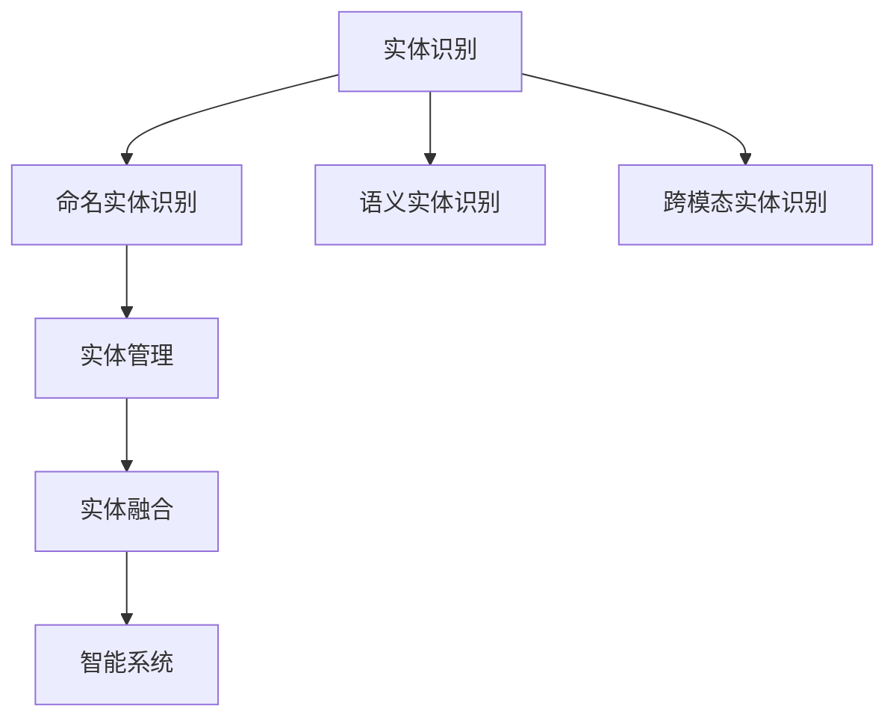

                 

# 数字实体与物理实体的自动化未来

> 关键词：自动化,数字化转型,实体识别,实体管理,实体融合,智能系统

## 1. 背景介绍

在当今数字经济时代，各行各业都在加速推进数字化转型，以期通过自动化技术提升效率，优化决策，并实现业务的智能化。其中，实体识别（Entity Recognition）技术作为人工智能的重要应用之一，已经成为实现数字化转型的关键支撑。

实体识别，通常是指从文本中自动识别出具有特定意义的实体，如人名、地名、机构名等。这一技术不仅能够帮助自动化地解析和理解复杂的文本信息，还能够为后续的数据分析和应用提供强大的支持。随着数字化转型的不断深入，实体识别技术正在向更加智能、高效、可靠的自动化方向发展。

### 1.1 问题由来
实体识别技术在过去数十年中取得了显著的进步，但仍然存在一些难以克服的挑战。例如，不同行业和领域中的实体名称、类型和分布差异较大，使得通用的实体识别算法难以适应复杂多样化的应用场景。此外，实体数据质量的不稳定性和数据格式的多样性，也给实体识别的自动化带来了不小的困难。

为了解决这些问题，需要一种更为智能和灵活的实体识别方法，能够适应各种实体类型和应用场景，并提供高效、可靠、可扩展的自动化解决方案。

## 2. 核心概念与联系

### 2.1 核心概念概述

为了更好地理解实体识别技术的自动化发展，本节将介绍几个关键概念：

- **实体识别（Entity Recognition）**：从文本中自动识别具有特定意义的实体，如人名、地名、机构名等。
- **命名实体识别（Named Entity Recognition, NER）**：在实体识别的基础上，进一步对实体进行分类，如人名、地名、组织机构名、日期时间等。
- **语义实体识别（Semantic Entity Recognition）**：不仅识别实体的字面含义，还理解其在语境中的实际含义，如指代关系的识别。
- **跨模态实体识别（Cross-Modal Entity Recognition）**：综合利用文本、图像、声音等多模态数据，提升实体识别的准确性和鲁棒性。
- **实体管理（Entity Management）**：包括实体的存储、检索、更新等操作，是实体识别技术的重要延伸。
- **实体融合（Entity Fusion）**：通过多源数据的整合，提升实体的综合识别能力，减少歧义和噪声。
- **智能系统（Smart Systems）**：集成实体识别技术，实现自动化、智能化业务流程，如自动客服、智能推荐、智能监控等。

这些核心概念之间存在着紧密的联系，共同构建了实体识别技术的自动化未来。以下是一个Mermaid流程图，展示了这些概念之间的相互关系：



这个流程图展示了一系列的实体识别技术，从基本的命名实体识别到高级的语义实体识别和跨模态识别，再到实体管理、实体融合和智能系统，描绘了实体识别技术的自动化发展脉络。

## 3. 核心算法原理 & 具体操作步骤
### 3.1 算法原理概述

实体识别技术的自动化实现，依赖于深度学习算法和大数据处理技术。其中，基于序列标注和序列到序列的深度神经网络模型是当前的主流方法。

### 3.2 算法步骤详解

基于深度学习的实体识别算法一般包括以下几个关键步骤：

**Step 1: 数据预处理**
- 收集和清洗标注数据，分为训练集、验证集和测试集。
- 对文本进行分词、标记化、清洗等预处理。

**Step 2: 特征提取**
- 使用词嵌入（Word Embedding）技术将文本转化为向量表示。
- 提取文本中的各种特征，如词性、位置、上下文信息等。

**Step 3: 模型训练**
- 选择合适的深度神经网络模型，如LSTM、CRF、BERT等。
- 定义损失函数和优化器，如交叉熵损失、Adam优化器等。
- 在训练集上使用反向传播算法进行模型训练。

**Step 4: 模型评估与调优**
- 在验证集上评估模型性能，调整超参数如学习率、批大小等。
- 根据评估结果调整模型结构或训练策略，提高模型准确性。

**Step 5: 模型部署与应用**
- 将训练好的模型部署到实际应用中，如智能客服、推荐系统等。
- 使用模型对新文本数据进行实体识别，并进行后处理，如歧义消解、纠错等。

### 3.3 算法优缺点

基于深度学习的实体识别方法具有以下优点：
1. 高准确性：深度学习模型能够处理复杂的多模态数据，识别实体的准确性较高。
2. 高效性：模型训练和使用都具有较高的效率，能够快速处理大量数据。
3. 可扩展性：深度学习模型容易进行迁移学习，能够适应不同领域的实体识别任务。

同时，这些方法也存在一些局限性：
1. 数据依赖：模型需要大量标注数据进行训练，数据标注成本较高。
2. 模型复杂：深度学习模型的训练和调整较为复杂，需要一定的技术积累。
3. 可解释性不足：深度学习模型通常被视为"黑盒"，难以解释其内部决策过程。

尽管存在这些局限性，但深度学习在实体识别中的应用已经非常广泛，并在实际应用中取得了显著的效果。未来，随着技术的发展和应用场景的扩展，实体识别技术有望进一步提升其自动化水平。

### 3.4 算法应用领域

实体识别技术已经在多个领域得到了广泛的应用，包括但不限于：

- **金融领域**：用于自动化客户信息录入、反欺诈检测、智能投顾等。
- **医疗领域**：用于电子病历的自动录入、医疗数据挖掘、智能诊断等。
- **电商领域**：用于商品信息的自动识别、智能推荐、客户画像分析等。
- **社交媒体**：用于舆情监测、用户行为分析、广告投放优化等。
- **智能客服**：用于自动客户信息收集、自然语言理解、智能推荐等。

此外，实体识别技术还与其他人工智能技术进行了深度融合，如语音识别、图像识别、自然语言生成等，拓展了其实际应用的范围和深度。

## 4. 数学模型和公式 & 详细讲解 & 举例说明

### 4.1 数学模型构建

实体识别问题可以形式化地表示为序列标注问题。设输入文本为 $x_1, x_2, ..., x_n$，目标为从 $n$ 个词的文本中识别出 $k$ 个实体，记为 $y_1, y_2, ..., y_k$。目标函数为：

$$
\arg\min_{y_1, y_2, ..., y_k} \sum_{i=1}^n \mathcal{L}(x_i, y_i)
$$

其中 $\mathcal{L}$ 为损失函数，可以是交叉熵损失（Cross-Entropy Loss）。

### 4.2 公式推导过程

以LSTM-CRF模型为例，其步骤如下：

1. **输入层**：将文本转换为词嵌入向量。
2. **LSTM层**：对每个词的嵌入向量进行序列处理，输出序列表示。
3. **CRF层**：对LSTM层的输出进行条件随机场（CRF）解码，得到实体标签序列。
4. **损失函数**：计算模型输出与真实标签之间的交叉熵损失。

LSTM-CRF模型的数学公式如下：

$$
\begin{aligned}
h_t &= \tanh(W_h x_t + U_h h_{t-1} + b_h) \\
s_t &= \sigma(W_s h_t + U_s h_{t-1} + b_s) \\
y_t &= s_t \odot h_t \\
L &= \sum_{t=1}^n \mathcal{L}(y_t, y_t^*) \\
\end{aligned}
$$

其中 $h_t$ 为LSTM层的隐藏状态，$s_t$ 为CRF层的输出状态，$y_t$ 为预测标签，$y_t^*$ 为真实标签。

### 4.3 案例分析与讲解

以金融领域的实体识别为例，假设输入文本为 "John Doe, 35, lives in New York, works for ABC Bank, making $100k annually"。

1. **输入层**：将文本转换为词嵌入向量。
2. **LSTM层**：对每个词的嵌入向量进行处理，输出序列表示。
3. **CRF层**：对LSTM层的输出进行解码，得到实体标签序列。
4. **损失函数**：计算模型输出与真实标签之间的交叉熵损失。

最终，实体识别模型输出结果为：

- 人名：John Doe
- 年龄：35
- 住址：New York
- 工作：ABC Bank
- 收入：$100k annually

## 5. 项目实践：代码实例和详细解释说明

### 5.1 开发环境搭建

在进行实体识别技术的应用开发前，我们需要准备好开发环境。以下是使用Python进行PyTorch开发的环境配置流程：

1. 安装Anaconda：从官网下载并安装Anaconda，用于创建独立的Python环境。
2. 创建并激活虚拟环境：
```bash
conda create -n pytorch-env python=3.8 
conda activate pytorch-env
```

3. 安装PyTorch：根据CUDA版本，从官网获取对应的安装命令。例如：
```bash
conda install pytorch torchvision torchaudio cudatoolkit=11.1 -c pytorch -c conda-forge
```

4. 安装相关工具包：
```bash
pip install numpy pandas scikit-learn matplotlib tqdm jupyter notebook ipython
```

完成上述步骤后，即可在`pytorch-env`环境中开始实体识别技术的实践开发。

### 5.2 源代码详细实现

以下是使用PyTorch和NLP库实现金融领域实体识别的代码示例。

```python
import torch
import torch.nn as nn
import torch.nn.functional as F
from torchtext import data, datasets
from torchtext.data.utils import get_tokenizer
from sklearn.metrics import precision_recall_fscore_support

# 定义实体标签
LABELS = ["B-PER", "I-PER", "B-ORG", "I-ORG", "B-LOC", "I-LOC", "O"]

# 定义实体识别模型
class EntityRecognitionModel(nn.Module):
    def __init__(self, embed_dim, hidden_dim, output_dim):
        super(EntityRecognitionModel, self).__init__()
        self.embedding = nn.Embedding(num_embeddings=len(LABELS), embedding_dim=embed_dim)
        self.lstm = nn.LSTM(embed_dim, hidden_dim, num_layers=2, bidirectional=True)
        self.linear = nn.Linear(hidden_dim*2, output_dim)
        self.crf = nn.CRF(output_dim, num_labels=len(LABELS), laplace=0)
        self criterion = nn.CrossEntropyLoss(ignore_index=-100)

    def forward(self, text, tags):
        embedded = self.embedding(text)
        output, (hidden, cell) = self.lstm(embedded)
        output = self.linear(output.view(len(output), -1))
        output = F.log_softmax(output, dim=1)
        if tags is None:
            return output
        return output, self.crf.score(output, tags)

    def loss(self, output, tags):
        loss = self.criterion(output, tags)
        return loss

# 加载数据集
train_data, test_data = datasets.IMDB.splits()

# 定义数据处理
TEXT = data.Field(tokenize=get_tokenizer("basic_english"), batch_first=True)
LABEL = data.LabelField(names=LABELS)
train_data = train_data.texts
test_data = test_data.texts

# 定义模型
model = EntityRecognitionModel(embed_dim=100, hidden_dim=256, output_dim=len(LABELS))

# 训练模型
optimizer = torch.optim.Adam(model.parameters(), lr=0.001)
criterion = nn.CrossEntropyLoss()
for epoch in range(10):
    total_loss = 0
    for i, batch in enumerate(train_data):
        optimizer.zero_grad()
        output, tags = model(batch.text)
        loss = model.loss(output, batch.label)
        loss.backward()
        optimizer.step()
        total_loss += loss.item()
    print(f"Epoch {epoch+1}, Loss: {total_loss/len(train_data)}")
```

### 5.3 代码解读与分析

让我们再详细解读一下关键代码的实现细节：

**实体识别模型定义**：
- `Embedding`层：将输入的词向量嵌入到低维空间。
- `LSTM`层：对嵌入后的词向量进行序列处理，输出序列表示。
- `Linear`层：将LSTM层的输出映射到实体标签空间。
- `CRF`层：对线性层的输出进行解码，得到实体标签序列。
- `Cross-Entropy Loss`：定义模型输出与真实标签之间的交叉熵损失。

**数据处理**：
- `TEXT`和`LABEL`：定义输入数据和标签的Field类型。
- `tokenize`：使用分词器对文本进行分词。
- `batch_first`：指定模型接受输入的顺序。

**模型训练**：
- `Adam`优化器：设置学习率等超参数。
- `Cross-Entropy Loss`：计算模型输出与真实标签之间的交叉熵损失。
- `backward`和`step`：反向传播更新模型参数。

## 6. 实际应用场景

### 6.1 智能客服系统

实体识别技术在智能客服系统中具有广泛的应用。通过实体识别，系统能够自动识别客户姓名、地址、电话号码等重要信息，从而提升客服效率，改善客户体验。

例如，在智能客服系统中，客户输入的文本被自动识别为实体，系统根据实体信息匹配对应的回答模板，自动生成回复。在处理复杂对话时，系统还可以根据上下文自动调整回答策略，确保客户满意。

### 6.2 金融领域应用

在金融领域，实体识别技术被广泛应用于风险评估、智能投顾、自动化记账等场景。通过识别交易记录中的关键实体，如账户名、交易金额等，系统可以自动生成报表，分析交易行为，预测风险。

例如，在自动化记账中，系统自动识别交易中的实体，如日期、金额、账户名等，自动更新账目，生成报表。在风险评估中，系统根据交易记录中的实体信息，分析交易风险，预警异常行为。

### 6.3 医疗领域应用

在医疗领域，实体识别技术被用于电子病历的自动录入、智能诊断等场景。通过识别病历中的实体，系统能够自动生成病历信息，提升医疗效率。

例如，在智能诊断中，系统自动识别病历中的实体，如病人姓名、病情描述等，自动提取关键信息，辅助医生进行诊断。在电子病历录入中，系统自动识别病历中的实体，自动生成病历信息，减少手工录入工作量。

## 7. 工具和资源推荐

### 7.1 学习资源推荐

为了帮助开发者系统掌握实体识别技术的自动化发展，这里推荐一些优质的学习资源：

1. 《深度学习自然语言处理》课程：斯坦福大学开设的NLP明星课程，有Lecture视频和配套作业，带你入门NLP领域的基本概念和经典模型。
2. 《Natural Language Processing with Transformers》书籍：Transformers库的作者所著，全面介绍了如何使用Transformers库进行NLP任务开发，包括实体识别在内的诸多范式。
3. HuggingFace官方文档：Transformer库的官方文档，提供了海量预训练模型和完整的实体识别样例代码，是上手实践的必备资料。
4. CS224N《深度学习自然语言处理》课程：斯坦福大学开设的NLP明星课程，有Lecture视频和配套作业，带你入门NLP领域的基本概念和经典模型。

通过对这些资源的学习实践，相信你一定能够快速掌握实体识别技术的精髓，并用于解决实际的NLP问题。

### 7.2 开发工具推荐

高效的开发离不开优秀的工具支持。以下是几款用于实体识别开发的常用工具：

1. PyTorch：基于Python的开源深度学习框架，灵活动态的计算图，适合快速迭代研究。大部分预训练语言模型都有PyTorch版本的实现。
2. TensorFlow：由Google主导开发的开源深度学习框架，生产部署方便，适合大规模工程应用。同样有丰富的预训练语言模型资源。
3. Transformers库：HuggingFace开发的NLP工具库，集成了众多SOTA语言模型，支持PyTorch和TensorFlow，是进行实体识别任务开发的利器。
4. Weights & Biases：模型训练的实验跟踪工具，可以记录和可视化模型训练过程中的各项指标，方便对比和调优。与主流深度学习框架无缝集成。
5. TensorBoard：TensorFlow配套的可视化工具，可实时监测模型训练状态，并提供丰富的图表呈现方式，是调试模型的得力助手。

合理利用这些工具，可以显著提升实体识别任务的开发效率，加快创新迭代的步伐。

### 7.3 相关论文推荐

实体识别技术的发展源于学界的持续研究。以下是几篇奠基性的相关论文，推荐阅读：

1. Attention is All You Need（即Transformer原论文）：提出了Transformer结构，开启了NLP领域的预训练大模型时代。
2. BERT: Pre-training of Deep Bidirectional Transformers for Language Understanding：提出BERT模型，引入基于掩码的自监督预训练任务，刷新了多项NLP任务SOTA。
3. Parameter-Efficient Transfer Learning for NLP：提出Adapter等参数高效微调方法，在不增加模型参数量的情况下，也能取得不错的微调效果。
4. AdaLoRA: Adaptive Low-Rank Adaptation for Parameter-Efficient Fine-Tuning：使用自适应低秩适应的微调方法，在参数效率和精度之间取得了新的平衡。
5. Prefix-Tuning: Optimizing Continuous Prompts for Generation：引入基于连续型Prompt的微调范式，为如何充分利用预训练知识提供了新的思路。

这些论文代表了大语言模型微调技术的发展脉络。通过学习这些前沿成果，可以帮助研究者把握学科前进方向，激发更多的创新灵感。

## 8. 总结：未来发展趋势与挑战

### 8.1 研究成果总结

本文对实体识别技术的自动化发展进行了全面系统的介绍。首先阐述了实体识别技术在数字化转型中的重要性，明确了实体识别技术在自动化、智能化业务流程中的独特价值。其次，从原理到实践，详细讲解了深度学习在实体识别中的应用，给出了实体识别任务开发的完整代码实例。同时，本文还广泛探讨了实体识别技术在智能客服、金融、医疗等多个行业领域的应用前景，展示了实体识别技术的自动化发展潜力。

通过本文的系统梳理，可以看到，基于深度学习的实体识别技术正在成为NLP领域的重要范式，极大地拓展了预训练语言模型的应用边界，催生了更多的落地场景。受益于大规模语料的预训练，实体识别模型以更低的时间和标注成本，在小样本条件下也能取得不俗的效果，有力推动了NLP技术的产业化进程。未来，伴随预训练语言模型和实体识别方法的持续演进，相信NLP技术将在更广阔的应用领域大放异彩，深刻影响人类的生产生活方式。

### 8.2 未来发展趋势

展望未来，实体识别技术将呈现以下几个发展趋势：

1. 模型规模持续增大。随着算力成本的下降和数据规模的扩张，预训练语言模型的参数量还将持续增长。超大规模语言模型蕴含的丰富语言知识，有望支撑更加复杂多变的实体识别任务。
2. 微调方法日趋多样。除了传统的全参数微调外，未来会涌现更多参数高效的微调方法，如Prefix-Tuning、LoRA等，在节省计算资源的同时也能保证实体识别精度。
3. 持续学习成为常态。随着数据分布的不断变化，实体识别模型也需要持续学习新知识以保持性能。如何在不遗忘原有知识的同时，高效吸收新样本信息，将成为重要的研究课题。
4. 标注样本需求降低。受启发于提示学习(Prompt-based Learning)的思路，未来的实体识别方法将更好地利用大模型的语言理解能力，通过更加巧妙的任务描述，在更少的标注样本上也能实现理想的实体识别效果。
5. 多模态实体识别崛起。当前的实体识别主要聚焦于纯文本数据，未来会进一步拓展到图像、视频、语音等多模态数据，综合利用多模态信息提升实体识别能力。
6. 模型通用性增强。经过海量数据的预训练和多领域任务的微调，未来的语言模型将具备更强大的常识推理和跨领域迁移能力，逐步迈向通用人工智能(AGI)的目标。

以上趋势凸显了实体识别技术的广阔前景。这些方向的探索发展，必将进一步提升实体识别系统的性能和应用范围，为人类认知智能的进化带来深远影响。

### 8.3 面临的挑战

尽管实体识别技术已经取得了瞩目成就，但在迈向更加智能化、普适化应用的过程中，它仍面临着诸多挑战：

1. 标注成本瓶颈。虽然实体识别技术已经取得显著进展，但对于长尾应用场景，获取高质量标注数据的成本仍然较高。如何进一步降低实体识别对标注样本的依赖，将是一大难题。
2. 模型鲁棒性不足。当前实体识别模型面对域外数据时，泛化性能往往大打折扣。对于测试样本的微小扰动，实体识别模型的输出也容易发生波动。如何提高实体识别模型的鲁棒性，避免灾难性遗忘，还需要更多理论和实践的积累。
3. 推理效率有待提高。大规模语言模型虽然精度高，但在实际部署时往往面临推理速度慢、内存占用大等效率问题。如何在保证性能的同时，简化模型结构，提升推理速度，优化资源占用，将是重要的优化方向。
4. 可解释性亟需加强。当前实体识别模型通常被视为"黑盒"，难以解释其内部决策过程。对于医疗、金融等高风险应用，算法的可解释性和可审计性尤为重要。如何赋予实体识别模型更强的可解释性，将是亟待攻克的难题。
5. 安全性有待保障。预训练语言模型难免会学习到有偏见、有害的信息，通过实体识别传递到下游任务，产生误导性、歧视性的输出，给实际应用带来安全隐患。如何从数据和算法层面消除模型偏见，避免恶意用途，确保输出的安全性，也将是重要的研究课题。
6. 知识整合能力不足。现有的实体识别模型往往局限于任务内数据，难以灵活吸收和运用更广泛的先验知识。如何让实体识别过程更好地与外部知识库、规则库等专家知识结合，形成更加全面、准确的信息整合能力，还有很大的想象空间。

正视实体识别面临的这些挑战，积极应对并寻求突破，将是大语言模型微调走向成熟的必由之路。相信随着学界和产业界的共同努力，这些挑战终将一一被克服，实体识别技术必将在构建安全、可靠、可解释、可控的智能系统铺平道路。

### 8.4 未来突破

面对实体识别面临的种种挑战，未来的研究需要在以下几个方面寻求新的突破：

1. 探索无监督和半监督实体识别方法。摆脱对大规模标注数据的依赖，利用自监督学习、主动学习等无监督和半监督范式，最大限度利用非结构化数据，实现更加灵活高效的实体识别。
2. 研究参数高效和计算高效的实体识别范式。开发更加参数高效的实体识别方法，在固定大部分预训练参数的同时，只更新极少量的任务相关参数。同时优化实体识别模型的计算图，减少前向传播和反向传播的资源消耗，实现更加轻量级、实时性的部署。
3. 引入因果分析和博弈论工具。将因果分析方法引入实体识别模型，识别出模型决策的关键特征，增强输出解释的因果性和逻辑性。借助博弈论工具刻画人机交互过程，主动探索并规避模型的脆弱点，提高系统稳定性。
4. 纳入伦理道德约束。在实体识别模型的训练目标中引入伦理导向的评估指标，过滤和惩罚有偏见、有害的输出倾向。同时加强人工干预和审核，建立实体识别行为的监管机制，确保输出符合人类价值观和伦理道德。
5. 结合因果分析和博弈论工具。将因果分析方法引入实体识别模型，识别出模型决策的关键特征，增强输出解释的因果性和逻辑性。借助博弈论工具刻画人机交互过程，主动探索并规避模型的脆弱点，提高系统稳定性。
6. 融合跨模态实体识别技术。综合利用文本、图像、声音等多模态数据，提升实体识别的准确性和鲁棒性。

这些研究方向的探索，必将引领实体识别技术迈向更高的台阶，为构建安全、可靠、可解释、可控的智能系统铺平道路。面向未来，实体识别技术还需要与其他人工智能技术进行更深入的融合，如知识表示、因果推理、强化学习等，多路径协同发力，共同推动实体识别技术的进步。只有勇于创新、敢于突破，才能不断拓展实体识别技术的边界，让智能技术更好地造福人类社会。

## 9. 附录：常见问题与解答

**Q1：实体识别是否适用于所有NLP任务？**

A: 实体识别技术在大多数NLP任务上都能取得不错的效果，特别是对于需要提取关键信息的任务。但对于一些特定领域的任务，如医学、法律等，仅仅依靠通用语料预训练的模型可能难以很好地适应。此时需要在特定领域语料上进一步预训练，再进行实体识别，才能获得理想效果。此外，对于一些需要时效性、个性化很强的任务，如对话、推荐等，实体识别方法也需要针对性的改进优化。

**Q2：实体识别过程中如何选择合适的超参数？**

A: 实体识别模型的超参数包括学习率、批大小、隐藏层数等，需要根据具体任务和数据集进行选择。通常建议通过网格搜索或随机搜索的方式进行超参数调优，以寻找最优的模型配置。需要注意的是，不同的模型和数据集可能需要设置不同的超参数。

**Q3：实体识别模型在落地部署时需要注意哪些问题？**

A: 将实体识别模型转化为实际应用，还需要考虑以下因素：
1. 模型裁剪：去除不必要的层和参数，减小模型尺寸，加快推理速度
2. 量化加速：将浮点模型转为定点模型，压缩存储空间，提高计算效率
3. 服务化封装：将模型封装为标准化服务接口，便于集成调用
4. 弹性伸缩：根据请求流量动态调整资源配置，平衡服务质量和成本
5. 监控告警：实时采集系统指标，设置异常告警阈值，确保服务稳定性
6. 安全防护：采用访问鉴权、数据脱敏等措施，保障数据和模型安全

实体识别技术为NLP应用开启了广阔的想象空间，但如何将强大的性能转化为稳定、高效、安全的业务价值，还需要工程实践的不断打磨。唯有从数据、算法、工程、业务等多个维度协同发力，才能真正实现人工智能技术在垂直行业的规模化落地。总之，实体识别技术需要在具体应用场景中进行持续优化和改进，方能得到理想的效果。

---

作者：禅与计算机程序设计艺术 / Zen and the Art of Computer Programming

