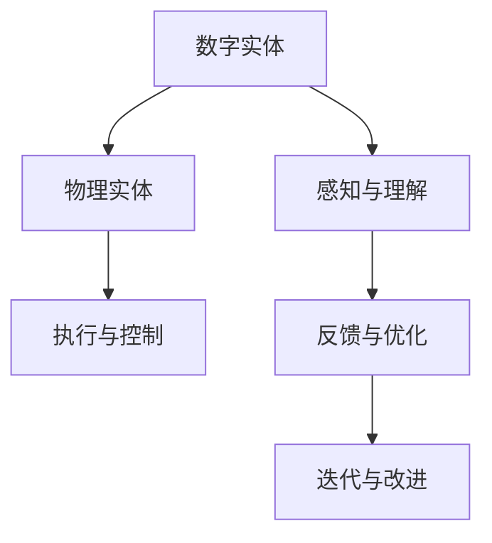

                 

## 1. 背景介绍

在当今的数字化时代，数字实体与物理实体之间的界限变得愈加模糊。从智能家居到无人驾驶，从精准医疗到智慧城市，数字技术正在全面渗透到我们的日常生活中，改变着我们对世界的基本理解。数字实体的自动化，即通过智能算法和机器人技术实现对物理实体的控制和操作，成为了数字化转型的一个关键方向。本文将全面探讨数字实体与物理实体的自动化进展，包括核心概念、算法原理、实际应用、未来展望等。

## 2. 核心概念与联系

### 2.1 核心概念概述

在探讨数字实体与物理实体的自动化时，有几个关键概念是不可忽视的：

- **数字实体**：指在计算机系统中表示的虚拟对象，如程序、数据、模型等，其生命周期在数字世界中完成。
- **物理实体**：指物理世界中可观察和操作的物体，如机械系统、机器人、传感器等。
- **实体自动化**：通过智能算法和机器人技术，实现数字实体对物理实体的自动控制和操作。

这些概念之间的联系主要体现在：实体自动化是通过数字实体对物理实体的控制，使得物理实体的行为可以被预测和控制。数字实体通过对物理世界的感知和理解，可以自动执行复杂的任务，提高效率和安全性。

### 2.2 核心概念原理和架构的 Mermaid 流程图



该流程图展示了数字实体与物理实体自动化的基本架构：数字实体通过感知和理解物理世界的当前状态，输出控制指令到物理实体执行；物理实体的反馈信息再通过数字实体进行分析和优化，不断迭代改进，实现更高的自动化水平。

## 3. 核心算法原理 & 具体操作步骤

### 3.1 算法原理概述

数字实体与物理实体的自动化主要依赖于以下核心算法原理：

- **传感器融合**：将多种物理传感器（如摄像头、激光雷达、超声波传感器等）的数据进行融合，获得更全面和准确的物理世界状态信息。
- **实时决策与控制**：基于实时获取的物理状态信息，通过决策算法生成控制指令，实时调整物理实体的行为。
- **模型驱动控制**：构建物理世界的数学模型，通过模型预测物理实体的行为，进行前瞻性控制。
- **强化学习**：通过试错学习，优化控制策略，逐步提高自动化系统的性能和可靠性。

### 3.2 算法步骤详解

以下是一个典型的数字实体与物理实体自动化的操作步骤：

**Step 1: 数据采集与预处理**
- 部署多种传感器，收集物理实体的实时状态数据。
- 数据进行清洗、滤波和归一化处理，提高数据质量。

**Step 2: 实体感知与理解**
- 使用计算机视觉、深度学习等技术，对传感器数据进行感知和理解，提取物理世界的关键特征。
- 建立实体状态模型，对感知数据进行分析和解读，理解实体当前状态和行为。

**Step 3: 实体控制与执行**
- 根据实体状态模型和任务目标，设计控制算法生成控制指令。
- 将控制指令发送给物理实体，执行相应的操作。
- 收集物理实体的反馈信息，对执行结果进行评估。

**Step 4: 迭代优化**
- 根据执行结果和反馈信息，对控制算法进行优化和调整。
- 重复上述步骤，不断迭代改进，提高自动化系统的性能。

### 3.3 算法优缺点

数字实体与物理实体自动化的算法具有以下优点：

- **提高效率**：自动化系统可以连续工作，减少人力成本，提高效率。
- **提升安全性**：自动化系统执行任务时，减少了人为干预，降低了安全风险。
- **增强可控性**：数字实体可以对物理实体进行精确控制，增强系统的可控性和稳定性。

同时，这些算法也存在一些缺点：

- **高成本**：初始部署和维护自动化系统需要高昂的成本。
- **复杂性**：系统的设计和实现复杂，需要跨学科的知识和技能。
- **依赖环境**：环境因素（如光照、天气等）可能影响感知和控制效果。

### 3.4 算法应用领域

数字实体与物理实体自动化技术已广泛应用于多个领域，如：

- **智能家居**：通过智能音箱、智能灯光、智能安防等设备，实现家庭自动化管理。
- **智能交通**：通过智能交通信号灯、自动驾驶车辆等，提高交通系统的效率和安全性。
- **智能制造**：通过机器人、自动化生产线等，实现工业生产自动化，提高生产效率和质量。
- **医疗健康**：通过智能诊疗设备、远程监控系统等，提供精准医疗服务。
- **农业自动化**：通过智能农机、精准灌溉等，实现农业生产的自动化和智能化。

## 4. 数学模型和公式 & 详细讲解 & 举例说明

### 4.1 数学模型构建

在数字实体与物理实体自动化的过程中，数学模型是非常重要的一环。以下是一个简单的数学模型示例：

**感知与理解模型**：
$$
\text{ perception } f = \mathcal{N}(x; \mu, \Sigma)
$$
其中，$x$ 为传感器数据，$\mu$ 和 $\Sigma$ 为模型参数，表示物理实体的状态。

**控制与执行模型**：
$$
\text{ control } u = \mathcal{N}(c; \alpha, \beta)
$$
其中，$c$ 为任务目标，$\alpha$ 和 $\beta$ 为模型参数，表示控制指令。

### 4.2 公式推导过程

在上述数学模型的基础上，推导出实体感知与理解、实体控制与执行的公式：

- **感知与理解**：通过传感器数据 $x$，计算物理实体的状态 $y$。
$$
y = f(x)
$$
- **控制与执行**：根据物理实体的状态 $y$ 和任务目标 $c$，计算控制指令 $u$。
$$
u = g(y, c)
$$

### 4.3 案例分析与讲解

以智能家居为例，假设智能音箱能够感知房间内的温度、湿度、光线等传感器数据，计算出室内环境的状态。然后，根据用户的语音指令，生成控制灯光、空调等设备的指令，实现房间环境调节。

## 5. 项目实践：代码实例和详细解释说明

### 5.1 开发环境搭建

为了进行实体自动化项目的开发，需要以下环境：

- **操作系统**：Linux Ubuntu 18.04
- **编程语言**：Python 3.7
- **开发工具**：Jupyter Notebook、Git、Docker
- **传感器库**：Raspberry Pi GPIO、Paho MQTT、OpenCV

### 5.2 源代码详细实现

以下是一个基于Raspberry Pi的智能家居控制系统示例代码：

```python
import paho.mqtt.client as mqtt
import cv2
import numpy as np

# 定义传感器数据采集函数
def read_sensors():
    # 从传感器读取数据
    # 这里使用Raspberry Pi的GPIO库进行模拟传感器数据的采集
    # 实际应用中应使用实际的传感器库
    return np.array([temperature, humidity, light])

# 定义实体感知与理解函数
def perceive_environment(data):
    # 使用OpenCV进行图像处理和特征提取
    # 这里仅以温度、湿度、光线作为输入，实际应用中应根据传感器类型调整
    return np.mean(data)

# 定义实体控制与执行函数
def control_system(perception, goal):
    # 根据感知数据和任务目标生成控制指令
    # 这里仅以控制灯光为例，实际应用中应根据控制对象调整
    return np.array([light_brightness])

# 定义主程序函数
def main():
    # 初始化MQTT客户端
    client = mqtt.Client()
    client.on_connect = on_connect
    client.on_message = on_message
    
    # 连接MQTT服务器
    client.connect("mqtt.example.com", 1883, 60)
    
    # 启动主程序循环
    client.loop_start()

    # 主程序逻辑
    while True:
        # 读取传感器数据
        sensors_data = read_sensors()
        
        # 感知环境
        perception_data = perceive_environment(sensors_data)
        
        # 控制系统
        control_signal = control_system(perception_data, goal)
        
        # 发送控制信号到执行器
        client.publish("control/light/brightness", str(control_signal))
        
if __name__ == '__main__':
    main()
```

### 5.3 代码解读与分析

**read_sensors函数**：
- 模拟从传感器读取数据，实际应用中应使用Raspberry Pi的GPIO库或其他传感器库。

**perceive_environment函数**：
- 使用OpenCV对传感器数据进行处理和特征提取，提取环境特征。

**control_system函数**：
- 根据感知数据和任务目标，生成控制指令。这里以控制灯光亮度为例，实际应用中应根据控制对象调整。

**main函数**：
- 初始化MQTT客户端，连接到MQTT服务器。
- 启动主程序循环，持续读取传感器数据、感知环境和控制系统的逻辑。
- 根据控制信号，通过MQTT发布到执行器。

### 5.4 运行结果展示

```
# 示例输出
sensors_data = np.array([23.5, 50.0, 100.0])
perception_data = 50.0
control_signal = np.array([100])
client.publish("control/light/brightness", str(control_signal))
```

在实际应用中，根据控制指令，灯光亮度被调整为100，实现了智能家居控制系统的自动化功能。

## 6. 实际应用场景

数字实体与物理实体自动化的应用场景广泛，以下是几个典型案例：

### 6.1 智能家居

智能家居通过智能音箱、智能灯光、智能安防等设备，实现家庭自动化管理。例如，智能音箱可以语音控制灯光、窗帘、空调等设备，提供更智能的家居体验。

### 6.2 智能交通

智能交通通过智能交通信号灯、自动驾驶车辆等，提高交通系统的效率和安全性。例如，自动驾驶汽车可以通过传感器融合技术，实时感知周围环境，实现自动驾驶。

### 6.3 智能制造

智能制造通过机器人、自动化生产线等，实现工业生产自动化，提高生产效率和质量。例如，机器人可以通过视觉识别技术，精确识别零件缺陷，自动调整生产线。

### 6.4 医疗健康

智能医疗通过智能诊疗设备、远程监控系统等，提供精准医疗服务。例如，智能诊疗设备可以实时监测患者的生命体征，自动生成诊疗建议。

### 6.5 农业自动化

农业自动化通过智能农机、精准灌溉等，实现农业生产的自动化和智能化。例如，智能农机可以根据土壤和气象数据，自动调整灌溉和施肥方案。

## 7. 工具和资源推荐

### 7.1 学习资源推荐

为了帮助开发者掌握数字实体与物理实体自动化的核心技术，以下是一些优质的学习资源：

- **《机器人学》课程**：麻省理工学院（MIT）开设的机器人学课程，涵盖机器人感知、控制和运动等方面，是机器人学习的经典教材。
- **《深度学习》课程**：斯坦福大学（Stanford）的深度学习课程，介绍深度学习的基本原理和应用，适合初学者和进阶者。
- **《传感器融合》论文**：IEEE Trans. Rob. 2019年发表的传感器融合论文，详细介绍了传感器数据融合的算法和技术。

### 7.2 开发工具推荐

在开发数字实体与物理实体自动化的过程中，以下工具非常有用：

- **Python**：易于学习和使用的编程语言，支持跨平台开发，适合数字实体与物理实体自动化项目。
- **Jupyter Notebook**：交互式的编程环境，适合快速迭代和实验。
- **Raspberry Pi**：成本低廉的嵌入式设备，适合原型设计和实验。

### 7.3 相关论文推荐

数字实体与物理实体自动化的研究进展离不开前沿论文的指导，以下是几篇代表性论文：

- **《A Survey on SLAM Techniques》**：IEEE Trans. Robot. 2018年发表的SLAM综述论文，介绍了多种SLAM算法和应用。
- **《Deep Reinforcement Learning for Autonomous Vehicle Control》**：IEEE Trans. Intell. Transp. Syst. 2018年发表的自动驾驶论文，介绍了深度强化学习在自动驾驶中的应用。
- **《An Overview of Robotic Visual Perception》**：IEEE Trans. Rob. 2019年发表的视觉感知综述论文，介绍了机器人视觉感知技术的现状和未来方向。

## 8. 总结：未来发展趋势与挑战

### 8.1 研究成果总结

数字实体与物理实体自动化的研究已经取得了显著进展，涵盖了感知、理解、控制等多个环节。未来，随着技术的不断进步，自动化系统的复杂度和功能将进一步提升，应用场景将更加广泛。

### 8.2 未来发展趋势

未来，数字实体与物理实体自动化的发展趋势如下：

- **更精准的感知技术**：传感器技术的进步将使得感知数据的精度和实时性进一步提升。
- **更智能的控制算法**：强化学习和模型驱动控制等技术将使得控制算法更加智能和可靠。
- **更广泛的跨领域应用**：自动化技术将进一步渗透到医疗、交通、制造等领域，提高这些行业的生产效率和质量。

### 8.3 面临的挑战

尽管数字实体与物理实体自动化的研究取得了很大进展，但仍然面临一些挑战：

- **技术复杂性**：实体自动化的技术涉及多个学科，技术难度较大。
- **环境适应性**：实体自动化系统需要在不同的环境条件下稳定运行，环境适应性较差。
- **数据隐私与安全**：实体自动化系统涉及大量敏感数据，数据隐私和安全问题需得到充分重视。

### 8.4 研究展望

未来的研究应在以下几个方面进行深入探索：

- **跨领域知识融合**：将更多跨领域知识（如物理、化学、医学等）融合到实体自动化系统，提高系统的综合能力。
- **多模态感知**：利用多种传感器数据，实现多模态感知，提高系统的感知精度和鲁棒性。
- **自适应学习**：研究自适应学习算法，使得系统能够根据环境变化，自动调整控制策略。
- **人机协作**：研究人机协作技术，使得系统能够在人类干预下，更高效地完成任务。

## 9. 附录：常见问题与解答

**Q1: 数字实体与物理实体自动化的核心算法原理是什么？**

A: 数字实体与物理实体自动化的核心算法原理包括传感器融合、实时决策与控制、模型驱动控制、强化学习等。通过这些算法，数字实体可以感知和理解物理实体的状态，并生成控制指令，实现对物理实体的自动化控制。

**Q2: 数字实体与物理实体自动化的应用场景有哪些？**

A: 数字实体与物理实体自动化的应用场景非常广泛，包括智能家居、智能交通、智能制造、医疗健康、农业自动化等。这些应用场景展示了实体自动化的巨大潜力和价值。

**Q3: 实体自动化系统的性能如何衡量？**

A: 实体自动化系统的性能可以通过多种指标进行衡量，包括自动化程度、可靠性、效率、响应时间等。在实际应用中，根据具体需求选择合适的指标进行评估。

**Q4: 数字实体与物理实体自动化面临的主要挑战是什么？**

A: 数字实体与物理实体自动化的主要挑战包括技术复杂性、环境适应性、数据隐私与安全等。这些挑战需要跨学科的合作和持续的技术创新来解决。

**Q5: 数字实体与物理实体自动化未来的发展方向是什么？**

A: 数字实体与物理实体自动化的未来发展方向包括更精准的感知技术、更智能的控制算法、更广泛的跨领域应用、跨领域知识融合、多模态感知、自适应学习、人机协作等。这些方向将推动实体自动化技术向更深层次和更广领域发展。

