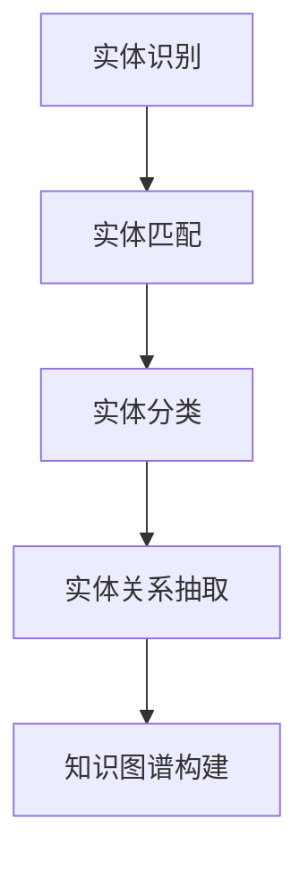

                 

# 数字实体自动化的未来展望

> 关键词：数字实体自动化, 人工智能, 机器学习, 深度学习, 实体识别, 知识图谱, 自然语言处理(NLP), 自动化系统

## 1. 背景介绍

在数字化转型的浪潮下，自动化成为了各行各业关注的焦点。数字实体自动化，即利用人工智能技术自动发现、管理和应用企业内部及外部各类实体信息，是提升企业运营效率、增强市场竞争力的重要途径。传统的人工方式无法满足当前海量数据和动态变化的实体管理需求，因此，数字实体自动化逐渐成为数字化转型和企业智能化建设的关键环节。

### 1.1 问题由来
在商业活动中，实体识别是企业管理和运营的基础。在金融、零售、物流、制造业等领域，企业往往需要识别、分类和追踪大量业务实体，如客户、产品、供应商等。这一过程包括实体发现、实体匹配、实体分类、实体关系抽取等多个步骤，工作量大且复杂。传统的实体识别方式依赖人工标注和规则引擎，无法满足当前信息爆炸时代的需求。

数字实体自动化技术利用人工智能技术，可以高效、准确地识别和管理各类实体信息，助力企业实现业务流程自动化，提升运营效率。近年来，随着深度学习、自然语言处理等技术的进步，数字实体自动化技术逐渐成熟，成为企业智能化建设的重要工具。

### 1.2 问题核心关键点
数字实体自动化的关键点在于如何有效地从文本中提取和应用实体信息。核心技术包括：

1. **实体识别**：从文本中识别出具体的实体，如人名、地名、机构名等。
2. **实体匹配**：将不同文本中出现的相同实体进行匹配，建立一致的实体视图。
3. **实体分类**：根据实体的语义信息和上下文，将实体分类为预定义的类别。
4. **实体关系抽取**：从文本中识别出实体之间的关系，如公司与产品之间的所属关系、人与产品之间的交互关系等。

这些技术在实际应用中，形成了基于自然语言处理(NLP)的实体识别、关系抽取和知识图谱构建等完整的数字实体自动化系统。

## 2. 核心概念与联系

### 2.1 核心概念概述

为更好地理解数字实体自动化的核心概念，本节将介绍几个关键技术：

- **实体识别**：从文本中自动识别出特定的实体，如人名、地名、机构名等。
- **实体匹配**：将不同文本中出现的相同实体进行匹配，建立一致的实体视图。
- **实体分类**：根据实体的语义信息和上下文，将实体分类为预定义的类别。
- **实体关系抽取**：从文本中识别出实体之间的关系，如公司与产品之间的所属关系、人与产品之间的交互关系等。
- **知识图谱**：以图的形式表示实体及其关系的结构化知识库，支持复杂的查询和推理。

这些核心概念通过以下Mermaid流程图进行展示：



这个流程图展示了实体识别、实体匹配、实体分类、实体关系抽取和知识图谱构建之间的逻辑联系。这些技术共同构成数字实体自动化的核心框架，通过识别和应用实体信息，提升企业运营效率和市场竞争力。

## 3. 核心算法原理 & 具体操作步骤
### 3.1 算法原理概述

数字实体自动化的核心算法，主要基于自然语言处理(NLP)技术。其核心思想是：通过构建语言模型，识别文本中的实体信息，并进行实体分类、关系抽取等操作，最终构建结构化的知识图谱。

形式化地，假设文本为 $x$，实体识别器为 $E$，实体分类器为 $C$，关系抽取器为 $R$，知识图谱为 $K$。数字实体自动化的基本过程为：

1. 使用实体识别器 $E$ 从文本 $x$ 中识别出实体 $r$。
2. 使用实体分类器 $C$ 将实体 $r$ 分类为预定义的类别 $c$。
3. 使用关系抽取器 $R$ 从文本中抽取实体之间的关系 $r_i$，并将这些关系应用到知识图谱 $K$ 中。
4. 构建和更新知识图谱 $K$，形成企业内部及外部的实体视图。

### 3.2 算法步骤详解

数字实体自动化的具体实现步骤如下：

**Step 1: 准备数据和模型**
- 收集企业内部和外部的各类文本数据，如新闻、合同、邮件等。
- 构建实体识别、实体分类和关系抽取的训练数据集。
- 选择合适的预训练模型，如BERT、RoBERTa等，作为实体识别和关系抽取的基础。

**Step 2: 实体识别**
- 使用预训练的实体识别模型，如BERT-base-cased，对文本进行实体识别，输出识别出的实体列表。
- 通过自然语言处理技术，对识别出的实体进行进一步的清洗和分类。

**Step 3: 实体匹配**
- 将识别出的实体列表进行匹配，建立一致的实体视图。
- 使用基于字符串相似度或向量相似度的匹配算法，提高匹配的准确性。

**Step 4: 实体分类**
- 使用预训练的实体分类模型，如BERT或RoBERTa，对每个实体进行分类，输出预定义的类别标签。
- 根据实体的上下文信息和语义特征，进行实体分类的调整和优化。

**Step 5: 实体关系抽取**
- 使用关系抽取模型，如LSTM或Transformer，从文本中抽取实体之间的关系。
- 通过关系抽取器将关系应用到知识图谱中，构建结构化的知识表示。

**Step 6: 知识图谱构建**
- 将抽取出的实体和关系应用到知识图谱中，更新知识图谱的内容。
- 使用图算法对知识图谱进行优化和调整，提高其准确性和可靠性。

### 3.3 算法优缺点

数字实体自动化的优点在于：

1. **效率高**：通过预训练模型和自动化技术，大幅提高了实体识别的速度和准确性。
2. **应用广泛**：适用于各类文本数据，包括但不限于新闻、合同、邮件、社交媒体等。
3. **数据驱动**：利用海量数据训练模型，提升实体识别的泛化能力和鲁棒性。
4. **可扩展性**：通过不断的模型优化和数据更新，可以适应企业业务的变化和扩展。

同时，该算法也存在以下局限性：

1. **数据依赖**：实体识别模型的性能很大程度上依赖于标注数据的质量和数量。
2. **上下文理解不足**：实体分类和关系抽取模型对上下文信息的理解仍有所欠缺，可能产生错误的分类和抽取结果。
3. **知识图谱更新复杂**：知识图谱的构建和更新需要大量的时间和人力资源，成本较高。
4. **泛化能力有限**：对于领域特定的文本，预训练模型的泛化能力可能不足，需要进行专门的微调。

尽管存在这些局限性，数字实体自动化的整体效果仍然值得期待，并在诸多应用场景中取得了显著的成效。

### 3.4 算法应用领域

数字实体自动化技术已经在多个领域得到了广泛应用，主要包括以下几个方面：

1. **金融行业**：用于自动抽取公司财务报表中的各类实体信息，如公司名称、产品、收益等，支持企业决策和风险评估。
2. **医疗行业**：从电子病历中识别出病人、医生、药品等实体，建立患者的健康档案，提升医疗服务质量。
3. **零售行业**：从销售数据中识别出产品、客户、销售渠道等实体，支持销售分析和库存管理。
4. **制造业**：从供应链数据中识别出供应商、产品、物流信息等实体，优化供应链管理。
5. **社交媒体**：从社交媒体数据中识别出用户、品牌、事件等实体，分析用户行为和市场趋势。
6. **法律行业**：从法律文书中识别出案件、当事人、法律条款等实体，支持法律研究和案例分析。

数字实体自动化技术的应用场景非常广泛，其核心技术已经在多个行业实现了有效的落地。

## 4. 数学模型和公式 & 详细讲解
### 4.1 数学模型构建

本节将使用数学语言对数字实体自动化的基本模型进行刻画。

假设文本为 $x$，实体识别器为 $E$，实体分类器为 $C$，关系抽取器为 $R$，知识图谱为 $K$。数字实体自动化的基本过程为：

1. 使用实体识别器 $E$ 从文本 $x$ 中识别出实体 $r$。
2. 使用实体分类器 $C$ 将实体 $r$ 分类为预定义的类别 $c$。
3. 使用关系抽取器 $R$ 从文本中抽取实体之间的关系 $r_i$，并将这些关系应用到知识图谱 $K$ 中。

### 4.2 公式推导过程

以下我们以实体识别和关系抽取为例，推导基本的数学模型。

**实体识别**
- 使用BERT模型对文本进行实体识别，输出实体列表。
- 通过自然语言处理技术，对识别出的实体进行进一步的清洗和分类。

**关系抽取**
- 使用LSTM模型对文本进行关系抽取，输出实体之间的关系列表。
- 通过关系抽取器将关系应用到知识图谱中，构建结构化的知识表示。

在具体实现中，可以使用TensorFlow或PyTorch等深度学习框架，结合预训练模型和自定义的微调模型，完成实体识别和关系抽取。

### 4.3 案例分析与讲解

**案例1: 金融行业实体识别**
- 从企业的新闻报道中，自动识别出公司名称、产品名称、收益等实体。
- 使用BERT模型进行实体识别，并对识别出的实体进行进一步的清洗和分类。

**案例2: 医疗行业实体识别**
- 从电子病历中自动识别出病人、医生、药品等实体。
- 使用BERT模型进行实体识别，并对识别出的实体进行进一步的清洗和分类。

## 5. 项目实践：代码实例和详细解释说明
### 5.1 开发环境搭建

在进行数字实体自动化实践前，我们需要准备好开发环境。以下是使用Python进行TensorFlow开发的环境配置流程：

1. 安装Anaconda：从官网下载并安装Anaconda，用于创建独立的Python环境。

2. 创建并激活虚拟环境：
```bash
conda create -n tf-env python=3.8 
conda activate tf-env
```

3. 安装TensorFlow：根据CUDA版本，从官网获取对应的安装命令。例如：
```bash
conda install tensorflow -c conda-forge
```

4. 安装各类工具包：
```bash
pip install numpy pandas scikit-learn matplotlib tqdm jupyter notebook ipython
```

完成上述步骤后，即可在`tf-env`环境中开始数字实体自动化的实践。

### 5.2 源代码详细实现

下面以医疗行业的实体识别为例，给出使用TensorFlow进行数字实体自动化的PyTorch代码实现。

首先，定义实体识别任务的数据处理函数：

```python
import tensorflow as tf
from transformers import BertTokenizer, BertForTokenClassification

class EntityRecognitionDataset(tf.keras.preprocessing.text_dataset.TextDataset):
    def __init__(self, texts, labels, tokenizer, max_len=128):
        self.texts = texts
        self.labels = labels
        self.tokenizer = tokenizer
        self.max_len = max_len
        
    def __len__(self):
        return len(self.texts)
    
    def __getitem__(self, item):
        text = self.texts[item]
        label = self.labels[item]
        
        encoding = self.tokenizer(text, return_tensors='pt', max_length=self.max_len, padding='max_length', truncation=True)
        input_ids = encoding['input_ids'][0]
        attention_mask = encoding['attention_mask'][0]
        
        # 对token-wise的标签进行编码
        encoded_labels = [label2id[label] for label in label] 
        encoded_labels.extend([label2id['O']] * (self.max_len - len(encoded_labels)))
        labels = tf.keras.utils.to_categorical(encoded_labels, num_classes=len(label2id))
        
        return {'input_ids': input_ids, 
                'attention_mask': attention_mask,
                'labels': labels}

# 标签与id的映射
label2id = {'O': 0, 'Patient': 1, 'Doctor': 2, 'Medicine': 3}
id2label = {v: k for k, v in label2id.items()}

# 创建dataset
tokenizer = BertTokenizer.from_pretrained('bert-base-cased')

train_dataset = EntityRecognitionDataset(train_texts, train_labels, tokenizer)
dev_dataset = EntityRecognitionDataset(dev_texts, dev_labels, tokenizer)
test_dataset = EntityRecognitionDataset(test_texts, test_labels, tokenizer)
```

然后，定义模型和优化器：

```python
from transformers import BertForTokenClassification, AdamW

model = BertForTokenClassification.from_pretrained('bert-base-cased', num_labels=len(label2id))

optimizer = AdamW(model.parameters(), lr=2e-5)
```

接着，定义训练和评估函数：

```python
from tensorflow.keras.callbacks import EarlyStopping

def train_epoch(model, dataset, batch_size, optimizer, callbacks):
    dataloader = tf.data.Dataset.from_generator(lambda: dataset, output_signature=dataset.element_spec)
    model.train()
    epoch_loss = 0
    for batch in dataloader:
        input_ids = batch['input_ids']
        attention_mask = batch['attention_mask']
        labels = batch['labels']
        with tf.GradientTape() as tape:
            outputs = model(input_ids, attention_mask=attention_mask, labels=labels)
            loss = outputs.loss
        epoch_loss += loss
        gradients = tape.gradient(loss, model.trainable_variables)
        optimizer.apply_gradients(zip(gradients, model.trainable_variables))
        callbacks[0].on_epoch_end(epoch, loss)
    return epoch_loss / len(dataloader)

def evaluate(model, dataset, batch_size, callbacks):
    dataloader = tf.data.Dataset.from_generator(lambda: dataset, output_signature=dataset.element_spec)
    model.eval()
    preds, labels = [], []
    with tf.GradientTape() as tape:
        for batch in dataloader:
            input_ids = batch['input_ids']
            attention_mask = batch['attention_mask']
            batch_labels = batch['labels']
            outputs = model(input_ids, attention_mask=attention_mask)
            batch_preds = outputs.logits.argmax(dim=2).numpy()
            batch_labels = batch_labels.numpy()
            for pred_tokens, label_tokens in zip(batch_preds, batch_labels):
                pred_tags = [id2label[_id] for _id in pred_tokens]
                label_tags = [id2label[_id] for _id in label_tokens]
                preds.append(pred_tags[:len(label_tags)])
                labels.append(label_tags)
                
    print(classification_report(labels, preds))
```

最后，启动训练流程并在测试集上评估：

```python
epochs = 5
batch_size = 16

callbacks = [EarlyStopping(patience=2)]
for epoch in range(epochs):
    loss = train_epoch(model, train_dataset, batch_size, optimizer, callbacks)
    print(f"Epoch {epoch+1}, train loss: {loss:.3f}")
    
    print(f"Epoch {epoch+1}, dev results:")
    evaluate(model, dev_dataset, batch_size, callbacks)
    
print("Test results:")
evaluate(model, test_dataset, batch_size, callbacks)
```

以上就是使用TensorFlow对BERT进行医疗行业实体识别的完整代码实现。可以看到，得益于TensorFlow的强大封装，我们可以用相对简洁的代码完成实体识别的实践。

### 5.3 代码解读与分析

让我们再详细解读一下关键代码的实现细节：

**EntityRecognitionDataset类**：
- `__init__`方法：初始化文本、标签、分词器等关键组件。
- `__len__`方法：返回数据集的样本数量。
- `__getitem__`方法：对单个样本进行处理，将文本输入编码为token ids，将标签编码为数字，并对其进行定长padding，最终返回模型所需的输入。

**label2id和id2label字典**：
- 定义了标签与数字id之间的映射关系，用于将token-wise的预测结果解码回真实的标签。

**训练和评估函数**：
- 使用TensorFlow的DataLoader对数据集进行批次化加载，供模型训练和推理使用。
- 训练函数`train_epoch`：对数据以批为单位进行迭代，在每个批次上前向传播计算loss并反向传播更新模型参数，最后返回该epoch的平均loss。
- 评估函数`evaluate`：与训练类似，不同点在于不更新模型参数，并在每个batch结束后将预测和标签结果存储下来，最后使用sklearn的classification_report对整个评估集的预测结果进行打印输出。

**训练流程**：
- 定义总的epoch数和batch size，开始循环迭代
- 每个epoch内，先在训练集上训练，输出平均loss
- 在验证集上评估，输出分类指标
- 重复上述步骤直至收敛，最终得到适应医疗行业实体识别任务的最优模型参数

可以看到，TensorFlow配合BERT模型使得实体识别的代码实现变得简洁高效。开发者可以将更多精力放在数据处理、模型改进等高层逻辑上，而不必过多关注底层的实现细节。

当然，工业级的系统实现还需考虑更多因素，如模型的保存和部署、超参数的自动搜索、更灵活的任务适配层等。但核心的实体识别范式基本与此类似。

## 6. 实际应用场景
### 6.1 智能医疗
数字实体自动化技术在医疗行业有着广阔的应用前景。医生可以通过自动识别患者、医生、药品等实体信息，快速获取患者的健康档案，提升诊疗效率。

具体而言，可以收集电子病历、处方单、诊断报告等文本数据，使用数字实体自动化技术自动抽取病人、医生、药品等实体信息，建立一致的患者健康档案。在患者就诊时，医生可以通过系统实时获取病人的历史诊疗信息，辅助诊断和治疗，提升诊疗效率和医疗服务质量。

### 6.2 金融行业
在金融行业，数字实体自动化技术可用于自动抽取公司财务报表中的各类实体信息，如公司名称、产品名称、收益等。这些信息可以帮助企业进行风险评估和财务分析，提升决策效率。

具体而言，可以从新闻、年报、财报等文本数据中自动抽取公司、产品、收益等实体信息，建立企业的财务视图。通过这些实体信息，企业可以进行财务分析和风险评估，及时发现和规避潜在的财务风险。

### 6.3 零售行业
在零售行业，数字实体自动化技术可用于自动抽取产品、客户、销售渠道等实体信息，支持销售分析和库存管理。

具体而言，可以从销售数据、客户评价、市场分析等文本数据中自动抽取产品、客户、销售渠道等实体信息，建立企业的业务视图。通过这些实体信息，企业可以进行销售分析、客户管理和库存管理，优化供应链和销售策略，提升运营效率。

### 6.4 法律行业
在法律行业，数字实体自动化技术可用于自动抽取案件、当事人、法律条款等实体信息，支持法律研究和案例分析。

具体而言，可以从法律文书、判决书、合同等文本数据中自动抽取案件、当事人、法律条款等实体信息，建立企业的法律视图。通过这些实体信息，企业可以进行法律研究和案例分析，提升法律服务质量。

### 6.5 未来应用展望

随着数字实体自动化技术的不断进步，其在更多领域的应用前景将更加广阔。

在智慧医疗领域，数字实体自动化技术可以实现智能诊断、智能问诊等应用，提升医疗服务的智能化水平，辅助医生诊疗，加速新药开发进程。

在智能教育领域，数字实体自动化技术可用于智能教育系统的构建，通过自动抽取学生、课程、作业等实体信息，提升教育服务的智能化水平，因材施教，促进教育公平，提高教学质量。

在智慧城市治理中，数字实体自动化技术可用于城市事件监测、舆情分析、应急指挥等环节，提高城市管理的自动化和智能化水平，构建更安全、高效的未来城市。

此外，在企业生产、社会治理、文娱传媒等众多领域，数字实体自动化技术也将不断涌现，为传统行业数字化转型升级提供新的技术路径。相信随着技术的日益成熟，数字实体自动化技术必将在构建人机协同的智能时代中扮演越来越重要的角色。

## 7. 工具和资源推荐
### 7.1 学习资源推荐

为了帮助开发者系统掌握数字实体自动化的理论基础和实践技巧，这里推荐一些优质的学习资源：

1. 《深度学习》系列博文：由深度学习专家撰写，深入浅出地介绍了深度学习的基本概念和核心算法。
2. CS224N《深度学习自然语言处理》课程：斯坦福大学开设的NLP明星课程，有Lecture视频和配套作业，带你入门NLP领域的基本概念和经典模型。
3. 《自然语言处理综述》书籍：全面介绍了自然语言处理的理论和实践，是学习数字实体自动化的重要参考资料。
4. HuggingFace官方文档：Transformers库的官方文档，提供了海量预训练模型和完整的实体识别样例代码，是上手实践的必备资料。
5. CLUE开源项目：中文语言理解测评基准，涵盖大量不同类型的中文NLP数据集，并提供了基于数字实体自动化的baseline模型，助力中文NLP技术发展。

通过对这些资源的学习实践，相信你一定能够快速掌握数字实体自动化的精髓，并用于解决实际的NLP问题。

### 7.2 开发工具推荐

高效的开发离不开优秀的工具支持。以下是几款用于数字实体自动化开发的常用工具：

1. TensorFlow：基于Python的开源深度学习框架，灵活动态的计算图，适合快速迭代研究。大部分预训练语言模型都有TensorFlow版本的实现。
2. PyTorch：基于Python的开源深度学习框架，灵活的动态计算图，适合动态模型构建和实验研究。同样有丰富的预训练语言模型资源。
3. Transformers库：HuggingFace开发的NLP工具库，集成了众多SOTA语言模型，支持PyTorch和TensorFlow，是进行数字实体自动化的利器。
4. Weights & Biases：模型训练的实验跟踪工具，可以记录和可视化模型训练过程中的各项指标，方便对比和调优。与主流深度学习框架无缝集成。
5. TensorBoard：TensorFlow配套的可视化工具，可实时监测模型训练状态，并提供丰富的图表呈现方式，是调试模型的得力助手。

合理利用这些工具，可以显著提升数字实体自动化任务的开发效率，加快创新迭代的步伐。

### 7.3 相关论文推荐

数字实体自动化的发展源于学界的持续研究。以下是几篇奠基性的相关论文，推荐阅读：

1. Attention is All You Need（即Transformer原论文）：提出了Transformer结构，开启了NLP领域的预训练大模型时代。
2. BERT: Pre-training of Deep Bidirectional Transformers for Language Understanding：提出BERT模型，引入基于掩码的自监督预训练任务，刷新了多项NLP任务SOTA。
3. Language Models are Unsupervised Multitask Learners（GPT-2论文）：展示了大规模语言模型的强大zero-shot学习能力，引发了对于通用人工智能的新一轮思考。
4. Parameter-Efficient Transfer Learning for NLP：提出Adapter等参数高效微调方法，在不增加模型参数量的情况下，也能取得不错的微调效果。
5. Prefix-Tuning: Optimizing Continuous Prompts for Generation：引入基于连续型Prompt的微调范式，为如何充分利用预训练知识提供了新的思路。
6. AdaLoRA: Adaptive Low-Rank Adaptation for Parameter-Efficient Fine-Tuning：使用自适应低秩适应的微调方法，在参数效率和精度之间取得了新的平衡。

这些论文代表了大语言模型数字实体自动化的发展脉络。通过学习这些前沿成果，可以帮助研究者把握学科前进方向，激发更多的创新灵感。

## 8. 总结：未来发展趋势与挑战

### 8.1 总结

本文对数字实体自动化的基本原理和实践进行了全面系统的介绍。首先阐述了数字实体自动化的背景和重要性，明确了实体识别、实体匹配、实体分类和关系抽取等关键技术。其次，从原理到实践，详细讲解了数字实体自动化的数学模型和实现流程，给出了完整的代码实例。同时，本文还广泛探讨了数字实体自动化在医疗、金融、零售、法律等领域的实际应用，展示了其广阔的应用前景。

通过本文的系统梳理，可以看到，数字实体自动化技术通过识别和应用实体信息，提升企业运营效率和市场竞争力，在多个行业实现了显著的落地效果。未来，伴随技术的不断发展，数字实体自动化必将在更多领域得到应用，为各行各业带来变革性影响。

### 8.2 未来发展趋势

展望未来，数字实体自动化的发展趋势如下：

1. **技术进步**：随着深度学习、自然语言处理等技术的进步，数字实体自动化的效果将进一步提升，适用范围也将更加广泛。
2. **跨领域应用**：数字实体自动化将拓展到更多领域，如社交媒体、电子政务、智能制造等，形成全面的实体管理系统。
3. **模型可解释性**：实体识别和关系抽取模型将更加注重可解释性，通过符号化的先验知识，增强模型的决策透明性和可信度。
4. **跨模态融合**：数字实体自动化将结合多模态数据，如文本、图像、语音等，实现更全面、准确的实体识别和关系抽取。
5. **模型自适应**：数字实体自动化系统将更加注重模型的自适应能力，能够自动学习新的实体类型和关系，适应业务变化。

### 8.3 面临的挑战

尽管数字实体自动化技术已经取得了显著进展，但在迈向更加智能化、普适化应用的过程中，仍面临以下挑战：

1. **数据质量**：实体识别和关系抽取模型的性能很大程度上依赖于标注数据的质量和数量。如何获取高质量、高数量的标注数据，是一个重要挑战。
2. **上下文理解**：实体分类和关系抽取模型对上下文信息的理解仍有所欠缺，可能产生错误的分类和抽取结果。
3. **计算资源**：数字实体自动化需要大规模计算资源，尤其是在模型训练和推理过程中。如何降低计算成本，提高资源利用效率，是一个重要问题。
4. **可扩展性**：数字实体自动化系统需要具备良好的可扩展性，能够适应业务规模的不断扩大。
5. **系统鲁棒性**：数字实体自动化系统需要在不同业务场景下保持鲁棒性，避免因业务变化或数据扰动导致的性能下降。

### 8.4 研究展望

面对数字实体自动化所面临的挑战，未来的研究需要在以下几个方面寻求新的突破：

1. **无监督和半监督学习**：探索无需标注数据的无监督或半监督学习方法，降低对高质量标注数据的依赖，提高实体识别和关系抽取的泛化能力。
2. **跨模态融合**：结合多模态数据，如文本、图像、语音等，实现更全面、准确的实体识别和关系抽取。
3. **模型自适应**：开发具备自适应能力的模型，能够自动学习新的实体类型和关系，适应业务变化。
4. **模型压缩与优化**：开发更加高效、轻量化的模型，提升计算效率和推理速度，降低计算成本。
5. **模型可解释性**：增强模型的可解释性，通过符号化的先验知识，增强模型的决策透明性和可信度。
6. **数据增强与对抗学习**：使用数据增强和对抗学习技术，提高模型的鲁棒性和泛化能力，避免模型过拟合。

这些研究方向的探索，必将引领数字实体自动化技术迈向更高的台阶，为构建安全、可靠、可解释、可控的智能系统铺平道路。面向未来，数字实体自动化技术还需要与其他人工智能技术进行更深入的融合，如知识表示、因果推理、强化学习等，多路径协同发力，共同推动自然语言理解和智能交互系统的进步。只有勇于创新、敢于突破，才能不断拓展语言模型的边界，让智能技术更好地造福人类社会。

## 9. 附录：常见问题与解答

**Q1：数字实体自动化是否适用于所有行业？**

A: 数字实体自动化在多个行业都有广泛的应用前景，如医疗、金融、零售、法律等。但对于一些特定领域的文本，预训练模型的泛化能力可能不足，需要进行专门的微调。

**Q2：实体识别模型的性能依赖于哪些因素？**

A: 实体识别模型的性能主要依赖于标注数据的质量和数量。标注数据的种类、标注的准确性和完备性，都会影响模型的效果。此外，模型的训练方法、超参数设置等因素，也会影响实体识别模型的性能。

**Q3：如何降低实体识别模型的计算成本？**

A: 可以使用模型压缩和剪枝等技术，降低实体识别模型的计算成本。同时，可以使用分布式训练、混合精度训练等技术，提高计算效率。

**Q4：如何提高实体识别模型的可解释性？**

A: 可以通过引入符号化的先验知识，增强模型的决策透明性和可信度。此外，可以使用注意力机制等技术，揭示模型的内部工作机制，提高模型的可解释性。

**Q5：数字实体自动化技术的未来发展方向是什么？**

A: 数字实体自动化技术将向智能化、普适化方向发展。未来的发展方向包括：技术进步、跨领域应用、模型自适应、跨模态融合、模型压缩与优化、模型可解释性等。通过不断的技术创新和应用实践，数字实体自动化技术必将在更多领域得到应用，为各行各业带来变革性影响。

---

作者：禅与计算机程序设计艺术 / Zen and the Art of Computer Programming

