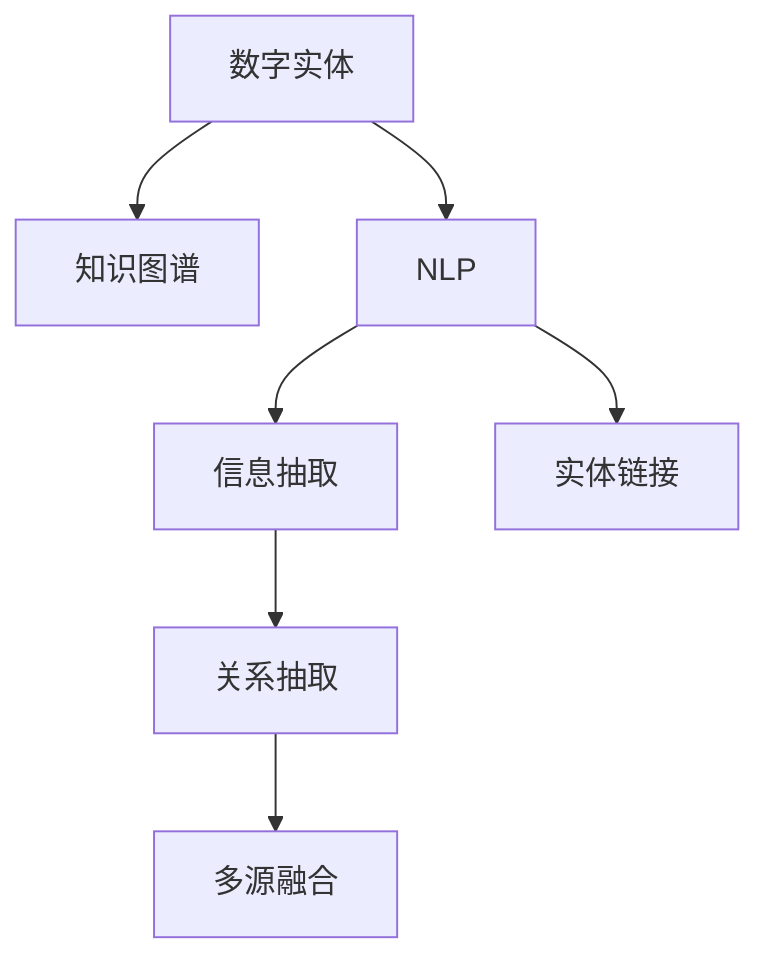

                 

# 数字实体自动化的未来挑战

## 1. 背景介绍

### 1.1 问题由来
数字实体自动化（Digital Entity Automation, DEA）是指利用人工智能技术，自动抓取、识别、抽取、整合各类数字实体（如人名、地名、机构名、日期等），并为其注入语义信息，构建全面、精确、动态的实体知识图谱，以驱动更多智能应用。数字实体自动化是大数据时代的必然产物，涉及知识图谱构建、自然语言处理、图形计算等多个交叉领域，具有广泛的应用前景和巨大的社会价值。

随着互联网和移动互联网的普及，数据总量呈爆炸式增长，海量的文本、图像、语音等数据为数字实体自动化的实现提供了基础条件。然而，庞大的数据规模和复杂的实体语义关系，使得数字实体自动化的实现并非易事。尤其是在数据多样性、标注成本、模型复杂性等方面，存在诸多挑战。本文将深入探讨数字实体自动化的核心概念、关键算法、应用场景以及未来的发展趋势与挑战。

### 1.2 问题核心关键点
- **数字实体识别**：从海量文本、图像、语音等数据中，自动抓取和识别各类数字实体。
- **实体链接**：将识别出的数字实体链接到知识图谱中的已有节点，实现语义对齐。
- **实体抽取**：从原始数据中抽取数字实体的详细信息，构建精准的实体图谱。
- **知识融合**：将不同来源的实体信息进行融合，提升实体知识图谱的全面性和准确性。
- **实时更新**：实体图谱需要定期更新，保持与现实世界的同步。

## 2. 核心概念与联系

### 2.1 核心概念概述

为更好地理解数字实体自动化的工作原理和优化方向，本节将介绍几个密切相关的核心概念：

- **数字实体**：指在数据中出现的具名实体，如人名、地名、机构名、日期等。
- **知识图谱**：由节点（实体）和边（关系）构成，用于表示实体之间的关系网络。
- **自然语言处理（NLP）**：利用计算机技术，自动分析、理解、处理自然语言，抽取和关联实体。
- **信息抽取（Information Extraction, IE）**：从非结构化数据中自动抽取结构化信息，如实体、关系等。
- **实体链接（Entity Linking, EL）**：将文本中提及的实体链接到知识图谱中的相应节点，实现语义对齐。
- **关系抽取（Relation Extraction, RE）**：从文本中自动抽取实体之间的语义关系，如“张三来自上海”。
- **多源融合**：将不同来源的实体信息进行融合，如从新闻、百科、社交媒体等多源数据中提取实体和关系。

这些概念之间的逻辑关系可以通过以下Mermaid流程图来展示：



这个流程图展示了大语言模型的核心概念及其之间的关系：

1. 数字实体被NLP处理后，进行信息抽取，得到初步的实体和关系。
2. 通过实体链接技术，将抽取出的实体链接到知识图谱中的已有节点，实现语义对齐。
3. 从多源数据中提取实体和关系，实现知识的全面性和准确性。
4. 最终形成实体知识图谱，用于驱动更多智能应用。

## 3. 核心算法原理 & 具体操作步骤
### 3.1 算法原理概述

数字实体自动化的核心算法主要包括实体识别、实体链接、关系抽取和多源融合等步骤。这些步骤相互交织，构成了一个完整的实体抽取与知识图谱构建系统。

形式化地，假设输入为原始数据集 $D$，其中包含多种类型的文本、图像、语音等数据。设数字实体识别模型为 $E$，实体链接模型为 $L$，关系抽取模型为 $R$，多源融合模型为 $F$。则数字实体自动化的总流程为：

$$
G = F(R(E(L(D)))))
$$

其中，$E$ 和 $L$ 的输出为待链接的实体，$R$ 的输出为实体之间的语义关系，$F$ 用于多源数据的融合。

### 3.2 算法步骤详解

数字实体自动化的实现过程一般包括以下几个关键步骤：

**Step 1: 准备数据和模型**

- 收集原始数据集 $D$，涵盖文本、图像、语音等多种类型，如新闻、百科、社交媒体等。
- 选择合适的预训练模型，如BERT、GPT等，用于实体识别、关系抽取等任务。
- 设计实体链接和关系抽取的损失函数，如交叉熵损失、NCE损失等。

**Step 2: 实体识别**

- 使用预训练模型对原始数据进行前向传播，得到实体抽取的结果。
- 结合规则、词典、语义分析等方法，进一步清洗和校正抽取结果，去除噪音。
- 将识别出的实体进行聚类、去重，得到初步的实体集合。

**Step 3: 实体链接**

- 构建知识图谱，包含各类实体的节点和它们之间的关系。
- 设计实体链接模型 $L$，如ELMo、D2L等，将抽取出的实体映射到知识图谱中的已有节点。
- 应用双向链接策略，提高链接的正确性。

**Step 4: 关系抽取**

- 设计关系抽取模型 $R$，如基于规则、基于统计、基于深度学习的方法。
- 对已链接的实体对，抽取它们之间的语义关系，如“来自”、“属于”、“发生于”等。
- 使用关系抽取模型对抽取结果进行后处理，如消除歧义、去重等。

**Step 5: 多源融合**

- 收集多源数据集 $D'$，包含不同来源的信息。
- 使用多源融合模型 $F$，如基于图神经网络的方法，将不同来源的实体和关系进行融合。
- 考虑不同数据源的权重和可信度，进行加权融合，提高融合结果的准确性。

**Step 6: 更新和维护**

- 定期收集新数据，更新实体知识图谱。
- 利用增量更新技术，快速迭代和优化实体知识图谱。

### 3.3 算法优缺点

数字实体自动化的算法具有以下优点：

1. **高效性**：利用预训练模型的强大语义理解能力，可以大幅提升实体识别的精度和效率。
2. **可扩展性**：多源融合技术使得系统能够适应更多类型的数据源，增强了系统的可扩展性。
3. **准确性**：通过实体链接和关系抽取，将文本中的实体和关系对齐到知识图谱中，提高了数据的准确性。

同时，该算法也存在一些局限性：

1. **数据依赖性强**：依赖高质量的标注数据和知识图谱，获取和维护成本较高。
2. **复杂性高**：涉及多个步骤和多种技术，算法实现复杂度较高。
3. **模型鲁棒性差**：面对噪声数据和复杂语义，模型的鲁棒性仍有待提升。
4. **计算资源需求大**：实体链接和关系抽取等步骤，计算资源消耗较大，需要高性能硬件支持。

尽管存在这些局限性，但数字实体自动化的算法依然是大数据时代知识图谱构建的重要手段，具有广阔的应用前景。

### 3.4 算法应用领域

数字实体自动化在多个领域具有广泛的应用，例如：

- **智能客服**：自动抓取和识别客户咨询中的数字实体，提供个性化的服务和建议。
- **金融风控**：自动抽取金融报表中的数字实体，进行风险评估和欺诈检测。
- **智能推荐**：从用户行为数据中抽取数字实体，构建用户画像，进行个性化推荐。
- **医疗诊断**：自动抽取病历中的数字实体，辅助医生进行疾病诊断和治疗方案制定。
- **内容审核**：自动抓取和链接新闻、文章中的数字实体，进行内容的合法性和真实性审核。

除了上述这些经典应用外，数字实体自动化还被创新性地应用于更多场景中，如智能物流、智慧城市、知识图谱构建等，为社会各个行业带来了新的突破。

## 4. 数学模型和公式 & 详细讲解  
### 4.1 数学模型构建

本节将使用数学语言对数字实体自动化的算法进行更加严格的刻画。

假设输入为原始数据集 $D=\{x_1, x_2, \ldots, x_N\}$，其中 $x_i$ 为文本、图像、语音等数据。设数字实体识别模型为 $E$，实体链接模型为 $L$，关系抽取模型为 $R$，多源融合模型为 $F$。则数字实体自动化的数学模型可以表示为：

$$
G = F(R(E(L(D))))
$$

其中，$E$ 的输出为初步的实体集合，$L$ 的输出为链接后的实体节点，$R$ 的输出为实体之间的语义关系，$F$ 的输出为最终的实体知识图谱。

### 4.2 公式推导过程

以下我们以信息抽取为例，推导关系抽取的公式。

假设实体抽取结果为 $E(D) = \{e_1, e_2, \ldots, e_M\}$，其中 $e_i$ 为抽取出的实体节点。设关系抽取模型 $R$ 为基于神经网络的模型，其输入为 $(e_i, e_j)$，输出为关系类型 $r$。则关系抽取的损失函数可以表示为：

$$
\mathcal{L}_R(e_i, e_j) = -\log p(r|e_i, e_j)
$$

其中 $p(r|e_i, e_j)$ 为条件概率分布，表示在实体对 $(e_i, e_j)$ 的情况下，关系 $r$ 出现的概率。

在得到关系抽取模型 $R$ 的损失函数后，可以通过反向传播算法更新模型参数，最小化损失函数。

### 4.3 案例分析与讲解

假设我们有一段文本：

```
张三在北京大学担任教职，并获得博士学位。
```

我们希望从这段文本中抽取实体和关系。首先使用实体识别模型 $E$，识别出实体节点：

- 张三
- 北京大学
- 教职
- 博士学位

然后，使用实体链接模型 $L$ 将实体节点映射到知识图谱中的已有节点：

- 张三 -> 张三节点
- 北京大学 -> 北京大学节点
- 教职 -> 教职节点
- 博士学位 -> 博士学位节点

最后，使用关系抽取模型 $R$ 抽取实体之间的关系：

- 张三 -> 北京大学 -> 教职 -> 博士学位

通过数字实体自动化的算法，我们将文本中的信息抽取并链接到知识图谱中，形成了完整的实体知识图谱。

## 5. 项目实践：代码实例和详细解释说明
### 5.1 开发环境搭建

在进行数字实体自动化项目实践前，我们需要准备好开发环境。以下是使用Python进行PyTorch开发的环境配置流程：

1. 安装Anaconda：从官网下载并安装Anaconda，用于创建独立的Python环境。

2. 创建并激活虚拟环境：
```bash
conda create -n pytorch-env python=3.8 
conda activate pytorch-env
```

3. 安装PyTorch：根据CUDA版本，从官网获取对应的安装命令。例如：
```bash
conda install pytorch torchvision torchaudio cudatoolkit=11.1 -c pytorch -c conda-forge
```

4. 安装Transformers库：
```bash
pip install transformers
```

5. 安装各类工具包：
```bash
pip install numpy pandas scikit-learn matplotlib tqdm jupyter notebook ipython
```

完成上述步骤后，即可在`pytorch-env`环境中开始项目实践。

### 5.2 源代码详细实现

下面我们以信息抽取任务为例，给出使用Transformers库对BERT模型进行信息抽取的PyTorch代码实现。

首先，定义信息抽取任务的数据处理函数：

```python
from transformers import BertTokenizer
from torch.utils.data import Dataset
import torch

class IEDataset(Dataset):
    def __init__(self, texts, tags, tokenizer, max_len=128):
        self.texts = texts
        self.tags = tags
        self.tokenizer = tokenizer
        self.max_len = max_len
        
    def __len__(self):
        return len(self.texts)
    
    def __getitem__(self, item):
        text = self.texts[item]
        tags = self.tags[item]
        
        encoding = self.tokenizer(text, return_tensors='pt', max_length=self.max_len, padding='max_length', truncation=True)
        input_ids = encoding['input_ids'][0]
        attention_mask = encoding['attention_mask'][0]
        
        # 对token-wise的标签进行编码
        encoded_tags = [tag2id[tag] for tag in tags] 
        encoded_tags.extend([tag2id['O']] * (self.max_len - len(encoded_tags)))
        labels = torch.tensor(encoded_tags, dtype=torch.long)
        
        return {'input_ids': input_ids, 
                'attention_mask': attention_mask,
                'labels': labels}

# 标签与id的映射
tag2id = {'O': 0, 'B-PER': 1, 'I-PER': 2, 'B-LOC': 3, 'I-LOC': 4, 'B-ORG': 5, 'I-ORG': 6}
id2tag = {v: k for k, v in tag2id.items()}

# 创建dataset
tokenizer = BertTokenizer.from_pretrained('bert-base-cased')

train_dataset = IEDataset(train_texts, train_tags, tokenizer)
dev_dataset = IEDataset(dev_texts, dev_tags, tokenizer)
test_dataset = IEDataset(test_texts, test_tags, tokenizer)
```

然后，定义模型和优化器：

```python
from transformers import BertForTokenClassification, AdamW

model = BertForTokenClassification.from_pretrained('bert-base-cased', num_labels=len(tag2id))

optimizer = AdamW(model.parameters(), lr=2e-5)
```

接着，定义训练和评估函数：

```python
from torch.utils.data import DataLoader
from tqdm import tqdm
from sklearn.metrics import classification_report

device = torch.device('cuda') if torch.cuda.is_available() else torch.device('cpu')
model.to(device)

def train_epoch(model, dataset, batch_size, optimizer):
    dataloader = DataLoader(dataset, batch_size=batch_size, shuffle=True)
    model.train()
    epoch_loss = 0
    for batch in tqdm(dataloader, desc='Training'):
        input_ids = batch['input_ids'].to(device)
        attention_mask = batch['attention_mask'].to(device)
        labels = batch['labels'].to(device)
        model.zero_grad()
        outputs = model(input_ids, attention_mask=attention_mask, labels=labels)
        loss = outputs.loss
        epoch_loss += loss.item()
        loss.backward()
        optimizer.step()
    return epoch_loss / len(dataloader)

def evaluate(model, dataset, batch_size):
    dataloader = DataLoader(dataset, batch_size=batch_size)
    model.eval()
    preds, labels = [], []
    with torch.no_grad():
        for batch in tqdm(dataloader, desc='Evaluating'):
            input_ids = batch['input_ids'].to(device)
            attention_mask = batch['attention_mask'].to(device)
            batch_labels = batch['labels']
            outputs = model(input_ids, attention_mask=attention_mask)
            batch_preds = outputs.logits.argmax(dim=2).to('cpu').tolist()
            batch_labels = batch_labels.to('cpu').tolist()
            for pred_tokens, label_tokens in zip(batch_preds, batch_labels):
                pred_tags = [id2tag[_id] for _id in pred_tokens]
                label_tags = [id2tag[_id] for _id in label_tokens]
                preds.append(pred_tags[:len(label_tags)])
                labels.append(label_tags)
                
    print(classification_report(labels, preds))
```

最后，启动训练流程并在测试集上评估：

```python
epochs = 5
batch_size = 16

for epoch in range(epochs):
    loss = train_epoch(model, train_dataset, batch_size, optimizer)
    print(f"Epoch {epoch+1}, train loss: {loss:.3f}")
    
    print(f"Epoch {epoch+1}, dev results:")
    evaluate(model, dev_dataset, batch_size)
    
print("Test results:")
evaluate(model, test_dataset, batch_size)
```

以上就是使用PyTorch对BERT进行信息抽取任务的完整代码实现。可以看到，得益于Transformers库的强大封装，我们可以用相对简洁的代码完成BERT模型的加载和微调。

### 5.3 代码解读与分析

让我们再详细解读一下关键代码的实现细节：

**IEDataset类**：
- `__init__`方法：初始化文本、标签、分词器等关键组件。
- `__len__`方法：返回数据集的样本数量。
- `__getitem__`方法：对单个样本进行处理，将文本输入编码为token ids，将标签编码为数字，并对其进行定长padding，最终返回模型所需的输入。

**tag2id和id2tag字典**：
- 定义了标签与数字id之间的映射关系，用于将token-wise的预测结果解码回真实的标签。

**训练和评估函数**：
- 使用PyTorch的DataLoader对数据集进行批次化加载，供模型训练和推理使用。
- 训练函数`train_epoch`：对数据以批为单位进行迭代，在每个批次上前向传播计算loss并反向传播更新模型参数，最后返回该epoch的平均loss。
- 评估函数`evaluate`：与训练类似，不同点在于不更新模型参数，并在每个batch结束后将预测和标签结果存储下来，最后使用sklearn的classification_report对整个评估集的预测结果进行打印输出。

**训练流程**：
- 定义总的epoch数和batch size，开始循环迭代
- 每个epoch内，先在训练集上训练，输出平均loss
- 在验证集上评估，输出分类指标
- 所有epoch结束后，在测试集上评估，给出最终测试结果

可以看到，PyTorch配合Transformers库使得BERT的信息抽取代码实现变得简洁高效。开发者可以将更多精力放在数据处理、模型改进等高层逻辑上，而不必过多关注底层的实现细节。

当然，工业级的系统实现还需考虑更多因素，如模型的保存和部署、超参数的自动搜索、更灵活的任务适配层等。但核心的信息抽取范式基本与此类似。

## 6. 实际应用场景
### 6.1 智能客服系统

基于数字实体自动化的对话技术，可以广泛应用于智能客服系统的构建。传统客服往往需要配备大量人力，高峰期响应缓慢，且一致性和专业性难以保证。而使用数字实体自动化的对话模型，可以7x24小时不间断服务，快速响应客户咨询，用自然流畅的语言解答各类常见问题。

在技术实现上，可以收集企业内部的历史客服对话记录，将问题和最佳答复构建成监督数据，在此基础上对预训练对话模型进行微调。微调后的对话模型能够自动理解用户意图，匹配最合适的答案模板进行回复。对于客户提出的新问题，还可以接入检索系统实时搜索相关内容，动态组织生成回答。如此构建的智能客服系统，能大幅提升客户咨询体验和问题解决效率。

### 6.2 金融舆情监测

金融机构需要实时监测市场舆论动向，以便及时应对负面信息传播，规避金融风险。传统的人工监测方式成本高、效率低，难以应对网络时代海量信息爆发的挑战。基于数字实体自动化的文本分类和情感分析技术，为金融舆情监测提供了新的解决方案。

具体而言，可以收集金融领域相关的新闻、报道、评论等文本数据，并对其进行主题标注和情感标注。在此基础上对预训练语言模型进行微调，使其能够自动判断文本属于何种主题，情感倾向是正面、中性还是负面。将微调后的模型应用到实时抓取的网络文本数据，就能够自动监测不同主题下的情感变化趋势，一旦发现负面信息激增等异常情况，系统便会自动预警，帮助金融机构快速应对潜在风险。

### 6.3 个性化推荐系统

当前的推荐系统往往只依赖用户的历史行为数据进行物品推荐，无法深入理解用户的真实兴趣偏好。基于数字实体自动化的个性化推荐系统，可以更好地挖掘用户行为背后的语义信息，从而提供更精准、多样的推荐内容。

在实践中，可以收集用户浏览、点击、评论、分享等行为数据，提取和用户交互的物品标题、描述、标签等文本内容。将文本内容作为模型输入，用户的后续行为（如是否点击、购买等）作为监督信号，在此基础上微调预训练语言模型。微调后的模型能够从文本内容中准确把握用户的兴趣点。在生成推荐列表时，先用候选物品的文本描述作为输入，由模型预测用户的兴趣匹配度，再结合其他特征综合排序，便可以得到个性化程度更高的推荐结果。

### 6.4 未来应用展望

随着数字实体自动化的不断发展，其应用场景将不断拓展，为更多行业带来变革性影响。

在智慧医疗领域，基于数字实体自动化的医疗问答、病历分析、药物研发等应用将提升医疗服务的智能化水平，辅助医生诊疗，加速新药开发进程。

在智能教育领域，数字实体自动化的技术可应用于作业批改、学情分析、知识推荐等方面，因材施教，促进教育公平，提高教学质量。

在智慧城市治理中，数字实体自动化的技术可应用于城市事件监测、舆情分析、应急指挥等环节，提高城市管理的自动化和智能化水平，构建更安全、高效的未来城市。

此外，在企业生产、社会治理、文娱传媒等众多领域，数字实体自动化的技术也将不断涌现，为传统行业数字化转型升级提供新的技术路径。相信随着技术的日益成熟，数字实体自动化必将在构建智能交互系统的过程中扮演越来越重要的角色。

## 7. 工具和资源推荐
### 7.1 学习资源推荐

为了帮助开发者系统掌握数字实体自动化的理论基础和实践技巧，这里推荐一些优质的学习资源：

1. 《Deep Learning for NLP》课程：斯坦福大学开设的NLP明星课程，涵盖了NLP和信息抽取的基本概念和前沿技术。

2. 《Entity Linking: Using Relation Embeddings to Create Knowledge Bases》论文：谷歌发布的实体链接方法，介绍了利用图神经网络进行实体链接的技术。

3. 《Knowledge Graph Creation and Mining》书籍：介绍了知识图谱的构建和挖掘技术，包括实体识别、关系抽取、多源融合等。

4. 《HuggingFace Transformers》书籍：Transformers库的官方文档，提供了丰富的预训练模型和微调样例代码，是上手实践的必备资料。

5. 《Semantic Web and Natural Language Processing》书籍：介绍了语义网和自然语言处理的基础知识和前沿技术，涵盖实体链接、关系抽取、多源融合等内容。

通过对这些资源的学习实践，相信你一定能够快速掌握数字实体自动化的精髓，并用于解决实际的NLP问题。

### 7.2 开发工具推荐

高效的开发离不开优秀的工具支持。以下是几款用于数字实体自动化开发的常用工具：

1. PyTorch：基于Python的开源深度学习框架，灵活动态的计算图，适合快速迭代研究。大部分预训练语言模型都有PyTorch版本的实现。

2. TensorFlow：由Google主导开发的开源深度学习框架，生产部署方便，适合大规模工程应用。同样有丰富的预训练语言模型资源。

3. Transformers库：HuggingFace开发的NLP工具库，集成了众多SOTA语言模型，支持PyTorch和TensorFlow，是进行信息抽取任务开发的利器。

4. Weights & Biases：模型训练的实验跟踪工具，可以记录和可视化模型训练过程中的各项指标，方便对比和调优。与主流深度学习框架无缝集成。

5. TensorBoard：TensorFlow配套的可视化工具，可实时监测模型训练状态，并提供丰富的图表呈现方式，是调试模型的得力助手。

6. Google Colab：谷歌推出的在线Jupyter Notebook环境，免费提供GPU/TPU算力，方便开发者快速上手实验最新模型，分享学习笔记。

合理利用这些工具，可以显著提升数字实体自动化的开发效率，加快创新迭代的步伐。

### 7.3 相关论文推荐

数字实体自动化的发展源于学界的持续研究。以下是几篇奠基性的相关论文，推荐阅读：

1. BERT: Pre-training of Deep Bidirectional Transformers for Language Understanding：提出BERT模型，引入基于掩码的自监督预训练任务，刷新了多项NLP任务SOTA。

2. Linking Entities in News Articles Using BERT Embeddings：介绍利用BERT嵌入进行实体链接的方法，展示了实体链接的最新进展。

3. Adversarial Robustness in Knowledge Graphs：讨论了知识图谱在对抗样本攻击下的鲁棒性问题，提出了对抗训练等方法。

4. Multi-Modal Deep Joint Modeling of Entity and Relation for Knowledge Graphs：介绍了多模态知识图谱的构建方法，结合文本、图像、语音等多源数据进行实体链接和关系抽取。

5. How to Pre-train an Entity Recognition Model from Scraped Web Pages：讨论了从网页中预训练实体识别模型的技术，提出了基于掩码和实体关系标签的预训练方法。

这些论文代表了大语言模型微调技术的发展脉络。通过学习这些前沿成果，可以帮助研究者把握学科前进方向，激发更多的创新灵感。

## 8. 总结：未来发展趋势与挑战

### 8.1 总结

本文对数字实体自动化的核心概念、关键算法、应用场景以及未来的发展趋势与挑战进行了全面系统的介绍。首先阐述了数字实体自动化的背景和意义，明确了其在知识图谱构建、智能应用开发等方面的重要价值。其次，从原理到实践，详细讲解了数字实体自动化的数学模型和关键步骤，给出了信息抽取任务开发的完整代码实例。同时，本文还广泛探讨了数字实体自动化的应用场景，展示了其在智能客服、金融舆情、个性化推荐等多个领域的前景。

通过本文的系统梳理，可以看到，数字实体自动化的算法已经在多个领域展现出强大的应用潜力，其高效、准确、可扩展的特性，使其成为未来智能系统构建的重要手段。未来，伴随预训练模型和算法技术的不断进步，数字实体自动化必将在更多领域得到广泛应用，为各行各业带来新的突破。

### 8.2 未来发展趋势

展望未来，数字实体自动化的发展趋势将呈现以下几个方向：

1. **模型规模继续增大**：随着预训练技术和大数据的发展，数字实体自动化的模型规模将进一步增大，能够处理更加复杂和多样的实体语义关系。

2. **多模态融合技术**：未来的数字实体自动化将结合文本、图像、语音等多源数据，实现更全面的语义理解和实体链接。

3. **知识图谱的动态更新**：数字实体自动化的系统将实现更加灵活和动态的实体知识图谱更新机制，快速适应现实世界变化。

4. **迁移学习和联邦学习**：利用迁移学习和联邦学习技术，提升模型在不同领域和数据集上的泛化能力。

5. **自监督和弱监督学习**：在大规模无标签数据的支持下，数字实体自动化将更多地依赖自监督和弱监督学习，降低对标注数据的依赖。

6. **跨领域应用**：数字实体自动化的技术将更多地应用于跨领域任务，如金融、医疗、教育等，提供更全面、更精准的智能服务。

这些趋势将引领数字实体自动化的技术走向更加智能化和普适化，为社会各个行业带来更多的智能应用和创新突破。

### 8.3 面临的挑战

尽管数字实体自动化已经取得了显著进展，但在实际应用过程中，仍面临诸多挑战：

1. **数据质量与标注成本**：高质量标注数据的获取和维护成本较高，如何高效地从大规模无标签数据中抽取实体和关系，仍然是一个重要问题。

2. **模型复杂性**：数字实体自动化的算法涉及实体识别、实体链接、关系抽取等多个步骤，模型结构复杂，实现难度较大。

3. **模型鲁棒性**：面对噪声数据和复杂语义，数字实体自动化的模型鲁棒性仍有待提升，如何提高模型的泛化能力和对抗能力，是未来的研究方向。

4. **计算资源需求**：大规模实体的抽取和链接，需要高性能硬件支持，如何优化算法和模型结构，降低计算资源消耗，是提升系统效率的关键。

5. **知识图谱的完整性与准确性**：如何构建更加全面、准确的知识图谱，融合多源数据，是数字实体自动化应用的核心挑战。

6. **系统的可扩展性**：数字实体自动化的系统需要在海量数据下保持高效和准确，如何优化系统架构，提高可扩展性和稳定性，是实现大规模应用的必要条件。

这些挑战将推动数字实体自动化技术的持续发展和优化，为构建更加智能和普适的智能系统提供更多技术保障。

### 8.4 研究展望

未来的研究需要在以下几个方面进行深入探索：

1. **自监督学习和弱监督学习**：在大规模无标签数据的基础上，利用自监督学习技术，自动生成监督信号，提升实体识别和关系抽取的效果。

2. **多源数据融合技术**：结合文本、图像、语音等多源数据，提升实体识别和关系抽取的全面性和准确性。

3. **跨领域知识迁移**：利用迁移学习技术，将数字实体自动化的模型应用于不同领域和任务，提升系统的泛化能力。

4. **增量式知识图谱更新**：实时获取新数据，增量式更新知识图谱，保持与现实世界的同步。

5. **对抗训练与鲁棒性提升**：应用对抗训练技术，提高数字实体自动化的模型鲁棒性，应对各种对抗样本和噪声攻击。

6. **可解释性与模型透明性**：研究模型的可解释性和透明性，提供对模型决策的可视化分析和解释，增强系统的可信度。

这些研究方向将推动数字实体自动化的技术走向更加成熟和普适，为构建更加智能、可信、可控的智能系统提供更多技术支撑。相信随着研究者的不断探索和创新，数字实体自动化技术必将迎来更加广阔的应用前景。

## 9. 附录：常见问题与解答

**Q1：数字实体自动化的算法是否适用于所有实体识别任务？**

A: 数字实体自动化的算法在处理常见的实体识别任务上表现优异，如人名、地名、机构名、日期等。但对于一些特定领域的实体识别任务，如医学、法律等，仅仅依靠通用语料预训练的模型可能难以很好地适应。此时需要在特定领域语料上进一步预训练，再进行微调，才能获得理想效果。

**Q2：如何选择合适的实体链接模型？**

A: 选择合适的实体链接模型需要考虑实体链接任务的复杂度和数据分布情况。常用的实体链接模型包括ELMo、D2L、GraphSAGE等。ELMo和D2L适用于处理短文本，GraphSAGE适用于处理长文本和多源数据。对于特定领域的数据，还需要进行模型调参和优化。

**Q3：数字实体自动化在落地部署时需要注意哪些问题？**

A: 将数字实体自动化模型转化为实际应用，还需要考虑以下因素：

1. 模型裁剪：去除不必要的层和参数，减小模型尺寸，加快推理速度。
2. 量化加速：将浮点模型转为定点模型，压缩存储空间，提高计算效率。
3. 服务化封装：将模型封装为标准化服务接口，便于集成调用。
4. 弹性伸缩：根据请求流量动态调整资源配置，平衡服务质量和成本。
5. 监控告警：实时采集系统指标，设置异常告警阈值，确保服务稳定性。

这些措施将帮助数字实体自动化系统更好地适应实际应用环境，提供高效、稳定、可靠的实体抽取和知识图谱服务。

---

作者：禅与计算机程序设计艺术 / Zen and the Art of Computer Programming

