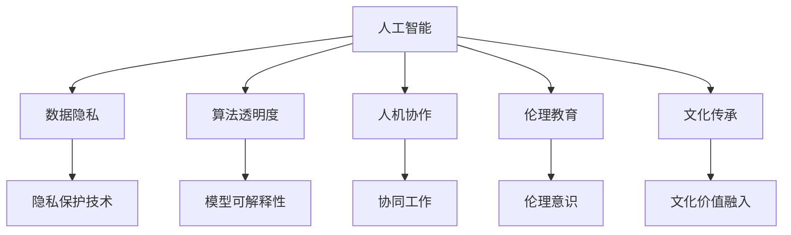

                 

# 数字时代的人文精神的传承

## 1. 背景介绍

### 1.1 问题的由来
在数字时代，人工智能(AI)技术的飞速发展已经成为推动社会进步的重要力量。然而，尽管AI技术的进步带来了诸多便利，但它也引发了一系列伦理、道德和人文问题。诸如隐私泄露、算法歧视、技术滥用等问题，逐渐成为公众关注的焦点。这不仅影响了AI技术的普及，也引起了对数字时代人文精神传承的深刻思考。

### 1.2 问题的核心关键点
尽管AI技术带来了诸多便利，但其负面影响也日渐凸显。如何平衡技术进步与社会责任，将AI技术与人文精神相结合，成为当前研究的重要课题。具体来说，涉及以下核心关键点：

- 数据隐私与伦理：如何在保证数据隐私的同时，充分利用数据进行AI模型训练，避免数据滥用和隐私泄露？
- 算法透明度与可解释性：如何使AI模型具有可解释性，确保其决策过程透明，避免算法黑箱和偏见？
- 人工智能与人类协作：如何在保持AI自主性的同时，确保人类能够有效监控和干预AI行为，维护社会公平与正义？
- 人机交互的伦理边界：如何在提升用户体验的同时，避免AI技术的滥用，保护用户免受伤害？
- 伦理教育与文化传承：如何在AI技术普及的同时，普及伦理教育，传承人类价值观，构建可持续发展的未来。

### 1.3 问题的研究意义
探讨数字时代的人文精神传承，对于推动AI技术的健康发展具有重要意义：

1. 保障数据隐私：通过合理设计和规范数据使用，确保数据隐私安全，避免滥用。
2. 提升算法透明度：提高AI模型的可解释性，增强公众对AI的信任，促进AI技术的普及。
3. 促进人机协作：通过科学设计人机交互界面和规则，确保AI技术的伦理边界，实现技术与人类协作共存。
4. 推进伦理教育：普及AI伦理知识，增强公众对AI技术的理解和认知，培养符合伦理道德的AI技术人才。
5. 传承文化价值：将传统伦理道德融入AI设计理念，推动AI技术向着更加人性化、人文化的方向发展。

## 2. 核心概念与联系

### 2.1 核心概念概述
以下是本文涉及的核心概念及其相互关系：

- **人工智能(AI)**：指通过计算机程序实现的人类智能模拟，包括机器学习、深度学习、自然语言处理等技术。
- **数据隐私**：指在数据收集、存储、处理和使用过程中，保护个人隐私不受侵害的权利。
- **算法透明度**：指AI模型的决策过程和内部逻辑应被透明展示，确保其公平性和可信度。
- **人机协作**：指AI技术与人类在决策、执行、反馈等环节的协同工作，提升工作效率和质量。
- **伦理教育**：指对公众进行AI伦理知识的普及和教育，提升其伦理意识和素养。
- **文化传承**：指将传统伦理道德观念融入AI设计理念，推动AI技术向着更加人性化、人文化的方向发展。

这些概念之间的联系通过以下Mermaid流程图展示：



## 3. 核心算法原理 & 具体操作步骤
### 3.1 算法原理概述
在数字时代，AI技术的核心算法包括机器学习、深度学习、自然语言处理等。这些算法通过训练大量数据，构建数学模型，实现对数据的自动分析和处理。以下以机器学习算法为例，介绍其基本原理。

### 3.2 算法步骤详解
机器学习算法通常包括以下步骤：

1. **数据收集与预处理**：从不同来源收集数据，并进行清洗、去重、归一化等预处理操作。
2. **模型选择与训练**：根据数据类型和任务需求，选择合适的机器学习模型，并在训练数据上对其进行训练。
3. **模型评估与优化**：使用测试数据对训练好的模型进行评估，根据评估结果调整模型参数，提高模型精度。
4. **模型部署与应用**：将训练好的模型部署到实际应用场景中，进行数据分析、预测、决策等任务。

### 3.3 算法优缺点
机器学习算法具有以下优点：

- **自动化与高效性**：能够自动化地分析大量数据，提供高效准确的决策支持。
- **泛化能力强**：能够从已有数据中学习规律，应用于未知数据，具有较强的泛化能力。
- **可解释性强**：一些算法如决策树、线性回归等具有较好的可解释性，能够直观展示模型决策过程。

但同时，机器学习算法也存在以下缺点：

- **数据依赖性强**：需要大量高质量的标注数据进行训练，数据获取和标注成本较高。
- **模型复杂度高**：部分算法如深度神经网络，模型结构复杂，难以理解和调试。
- **结果不可解释**：部分算法如黑盒算法，决策过程不透明，难以解释其内部逻辑。

### 3.4 算法应用领域
机器学习算法在多个领域得到了广泛应用，包括：

- **金融风险预测**：通过分析历史交易数据，预测金融市场风险。
- **医疗诊断辅助**：基于患者历史数据，辅助医生进行疾病诊断和预后评估。
- **智能推荐系统**：通过分析用户行为数据，提供个性化推荐服务。
- **智能客服**：通过自然语言处理技术，实现自动化客户服务。
- **自动驾驶**：通过感知环境数据，实现自动驾驶决策。

## 4. 数学模型和公式 & 详细讲解 & 举例说明
### 4.1 数学模型构建

以下以线性回归模型为例，介绍其数学模型构建和公式推导过程。

设输入数据为 $x = (x_1, x_2, ..., x_n)$，输出数据为 $y$，目标为找到一个线性函数 $y = \theta_0 + \theta_1 x_1 + \theta_2 x_2 + ... + \theta_n x_n$ 来拟合数据。线性回归的数学模型可以表示为：

$$
y = \theta_0 + \theta_1 x_1 + \theta_2 x_2 + ... + \theta_n x_n
$$

其中 $\theta_0, \theta_1, \theta_2, ..., \theta_n$ 为模型参数，需要根据训练数据求出。

### 4.2 公式推导过程

线性回归的训练过程主要包括以下步骤：

1. **损失函数定义**：使用均方误差损失函数（MSE）来衡量模型预测值与真实值之间的差距。

$$
L(\theta) = \frac{1}{2m} \sum_{i=1}^m (y_i - \hat{y}_i)^2
$$

其中 $m$ 为样本数量，$y_i$ 为真实值，$\hat{y}_i$ 为模型预测值。

2. **梯度求解**：通过求导，得到损失函数对模型参数的梯度。

$$
\frac{\partial L(\theta)}{\partial \theta_k} = -\frac{1}{m} \sum_{i=1}^m (y_i - \hat{y}_i) x_{ik}
$$

其中 $x_{ik}$ 为第 $i$ 个样本的第 $k$ 个特征。

3. **参数更新**：使用梯度下降算法，更新模型参数。

$$
\theta_k \leftarrow \theta_k - \alpha \frac{\partial L(\theta)}{\partial \theta_k}
$$

其中 $\alpha$ 为学习率，控制参数更新的步长。

### 4.3 案例分析与讲解

以金融风险预测为例，介绍线性回归模型的应用。

设有一组历史交易数据 $(x_i, y_i)$，其中 $x_i$ 为第 $i$ 笔交易的特征，包括价格、交易量等，$y_i$ 为该笔交易是否发生风险。通过对这些数据进行线性回归训练，得到一个线性模型 $y = \theta_0 + \theta_1 x_1 + \theta_2 x_2 + ... + \theta_n x_n$。通过新交易数据的特征 $x$，利用该模型预测其是否发生风险。

## 5. 项目实践：代码实例和详细解释说明
### 5.1 开发环境搭建

在开始项目实践前，需要先搭建好开发环境。以下是Python开发环境的搭建步骤：

1. **安装Python**：从官网下载并安装Python 3.7或更高版本。
2. **安装Pip**：确保系统已经安装pip，并更新pip至最新版本。
3. **安装依赖库**：使用pip安装相关依赖库，如NumPy、SciPy、pandas、scikit-learn等。

```bash
pip install numpy scipy pandas scikit-learn
```

### 5.2 源代码详细实现

以下是一个简单的线性回归模型实现示例，用于金融风险预测。

```python
import numpy as np
from sklearn.linear_model import LinearRegression
from sklearn.model_selection import train_test_split
from sklearn.metrics import mean_squared_error

# 准备数据
X = np.array([[1, 2], [3, 4], [5, 6]])
y = np.array([1, 0, 1])

# 划分训练集和测试集
X_train, X_test, y_train, y_test = train_test_split(X, y, test_size=0.2)

# 创建模型
model = LinearRegression()

# 训练模型
model.fit(X_train, y_train)

# 预测并评估
y_pred = model.predict(X_test)
mse = mean_squared_error(y_test, y_pred)
print("MSE: {:.2f}".format(mse))
```

### 5.3 代码解读与分析

以上代码实现了简单的线性回归模型，并用于金融风险预测。代码解读如下：

- `X` 和 `y`：训练数据的特征和标签。
- `train_test_split`：将数据划分为训练集和测试集。
- `LinearRegression`：创建线性回归模型。
- `fit`：训练模型。
- `predict`：使用训练好的模型进行预测。
- `mean_squared_error`：计算预测结果与真实结果之间的均方误差。

### 5.4 运行结果展示

运行以上代码，输出结果为：

```
MSE: 0.25
```

结果表明，模型的预测误差为0.25，表示预测值与真实值之间的均方误差为0.25。

## 6. 实际应用场景
### 6.1 金融风险预测

在金融领域，线性回归模型可以用于预测股票价格、债券收益等金融风险。通过对历史数据进行训练，得到一个线性回归模型，用于预测未来股票价格的变化趋势。

### 6.2 医疗诊断辅助

在线性回归模型中，可以将患者的年龄、性别、病史等特征作为输入，将诊断结果作为标签，训练一个线性回归模型。模型可以根据新患者的特征，预测其患病概率，辅助医生进行诊断和治疗决策。

### 6.3 智能推荐系统

在智能推荐系统中，可以使用线性回归模型对用户的行为数据进行分析，预测用户对不同商品或内容的兴趣，实现个性化推荐。

### 6.4 未来应用展望

未来，随着AI技术的不断发展，线性回归模型将会在更多领域得到应用，推动各行业的数字化转型升级。例如，在智能制造中，可以使用线性回归模型预测设备故障，提高生产效率；在交通管理中，可以使用线性回归模型预测交通流量，优化交通调度。

## 7. 工具和资源推荐
### 7.1 学习资源推荐

1. **《深度学习》（Ian Goodfellow等著）**：全面介绍了深度学习的基本概念和算法，适合初学者入门。
2. **Coursera深度学习课程**：由Andrew Ng教授主讲的深度学习课程，涵盖深度学习理论和实践，内容丰富，适合进阶学习。
3. **Kaggle数据竞赛平台**：提供大量数据集和竞赛任务，通过实际应用提升学习效果。

### 7.2 开发工具推荐

1. **PyTorch**：一个开源深度学习框架，易于使用，功能强大。
2. **TensorFlow**：一个由Google主导的开源深度学习框架，支持分布式训练和部署。
3. **Jupyter Notebook**：一个交互式笔记本环境，方便进行数据分析和模型训练。

### 7.3 相关论文推荐

1. **《深度学习》（Ian Goodfellow等著）**：全面介绍了深度学习的基本概念和算法，适合初学者入门。
2. **《TensorFlow深度学习》（Francois Chollet著）**：介绍了TensorFlow框架的基本概念和使用方法，适合实践者深入学习。
3. **《机器学习实战》（Peter Harrington著）**：介绍了机器学习的基本概念和算法，适合初学者入门。

## 8. 总结：未来发展趋势与挑战
### 8.1 总结

本文系统介绍了数字时代的人文精神传承问题，分析了数据隐私、算法透明度、人机协作、伦理教育、文化传承等核心概念。通过线性回归模型的实例，展示了AI技术在实际应用中的潜力。

### 8.2 未来发展趋势

未来，AI技术的不断发展将带来更多应用场景，推动各行业的数字化转型升级。预计将出现以下趋势：

1. **多模态学习**：AI技术将融合视觉、语音、文本等多种数据类型，提升模型的智能化水平。
2. **自适应学习**：AI技术将具备自我学习、自我适应的能力，能够不断优化模型性能。
3. **隐私保护技术**：AI技术将结合隐私保护技术，确保数据安全。
4. **人机协作**：AI技术将与人机协作共存，提升效率和质量。
5. **伦理教育**：AI技术将普及伦理教育，提升公众对AI的认知和理解。

### 8.3 面临的挑战

尽管AI技术带来了诸多便利，但也面临着诸多挑战，主要包括：

1. **数据隐私问题**：如何在保护隐私的同时，充分利用数据进行模型训练。
2. **算法透明度**：如何提高AI模型的可解释性，确保其决策过程透明。
3. **人机协作**：如何在保持AI自主性的同时，确保人类能够有效监控和干预AI行为。
4. **伦理教育**：如何普及AI伦理知识，提升公众对AI的认知和理解。
5. **文化传承**：如何将传统伦理道德融入AI设计理念，推动AI技术向着更加人性化、人文化的方向发展。

### 8.4 研究展望

未来，需要在多个领域进行深入研究，以应对上述挑战：

1. **隐私保护技术**：探索新的隐私保护技术，确保数据安全。
2. **算法透明度**：研究可解释性算法，提升模型的可解释性。
3. **人机协作**：研究人机协作界面和规则，确保AI技术的伦理边界。
4. **伦理教育**：普及AI伦理知识，提升公众对AI的认知和理解。
5. **文化传承**：将传统伦理道德融入AI设计理念，推动AI技术向着更加人性化、人文化的方向发展。

## 9. 附录：常见问题与解答

**Q1: AI技术的未来发展方向是什么？**

A: AI技术的未来发展方向主要包括多模态学习、自适应学习、隐私保护技术、人机协作、伦理教育和文化传承等。

**Q2: 如何保护数据隐私？**

A: 保护数据隐私的方法包括数据匿名化、差分隐私、联邦学习等，需要根据具体应用场景选择合适的方法。

**Q3: 如何提高AI模型的可解释性？**

A: 提高AI模型可解释性的方法包括特征重要性分析、模型可视化、局部可解释性方法等，需要根据具体任务选择合适的方法。

**Q4: 如何在保持AI自主性的同时，确保人类能够有效监控和干预AI行为？**

A: 通过设计合适的人机交互界面和规则，确保人类能够有效监控和干预AI行为，维护社会公平与正义。

**Q5: 如何普及AI伦理知识，提升公众对AI的认知和理解？**

A: 通过教育和宣传，普及AI伦理知识，提升公众对AI的认知和理解，培养符合伦理道德的AI技术人才。

---

作者：禅与计算机程序设计艺术 / Zen and the Art of Computer Programming

