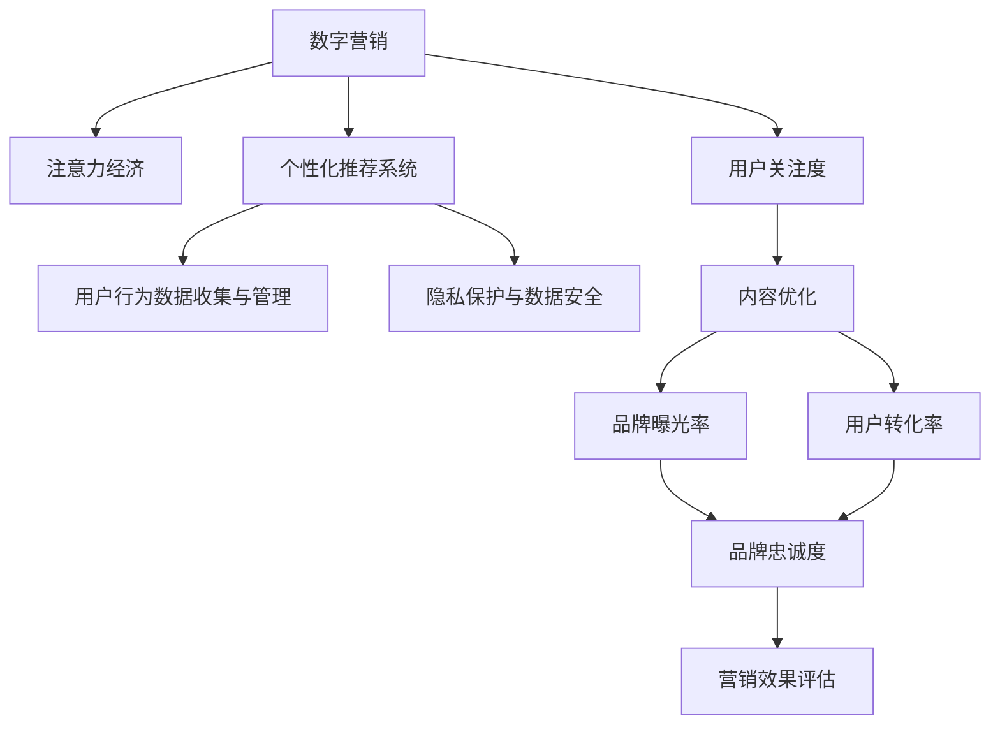

                 

# 数字营销在注意力经济中的演变

## 1. 背景介绍

在信息化快速发展的今天，数字营销已逐步取代传统的广告模式，成为品牌推广的主要方式。数字营销借助互联网、大数据、社交媒体等工具，精确高效地触达目标客户，实现了更加精准的市场细分与目标定位。然而，随着信息爆炸和用户注意力分散，数字营销面临着新的挑战，需要在传统方法的基础上进行迭代与进化。

本文旨在探索数字营销在注意力经济时代的演变，分析数字营销在当前环境中的关键问题和挑战，提出应对策略，并展望未来的发展趋势。

## 2. 核心概念与联系

### 2.1 核心概念概述

为了更好地理解数字营销在注意力经济中的演变，首先需要掌握几个关键概念：

- **数字营销(Digital Marketing)**：通过数字手段（如网站、搜索引擎、社交媒体、移动应用等）对目标客户进行精准推广和营销活动。
- **注意力经济(Attention Economy)**：在信息过载的互联网时代，用户注意力成为稀缺资源，品牌需要通过高质量内容与个性化策略争夺用户注意力。
- **个性化推荐系统**：利用用户行为数据和机器学习技术，实现对用户偏好的预测与个性化内容推荐。
- **用户行为数据收集与管理**：在数字营销中，用户行为数据是理解用户需求、优化营销策略的重要依据。
- **隐私保护与数据安全**：在收集与使用用户数据时，需要遵循数据保护法规，保障用户隐私和数据安全。

这些核心概念之间相互关联，共同构成了数字营销在注意力经济时代的新范式。通过理解这些概念，我们可以更好地把握数字营销的演变方向。

### 2.2 核心概念原理和架构的 Mermaid 流程图



这个流程图展示了数字营销与注意力经济之间的联系，以及个性化推荐系统、用户行为数据收集、隐私保护与数据安全等关键组成部分。数字营销的核心目标是通过高质量内容与个性化策略吸引并留住用户注意力，从而提高品牌曝光率和用户转化率，增强品牌忠诚度。

## 3. 核心算法原理 & 具体操作步骤

### 3.1 算法原理概述

数字营销在注意力经济中的演变主要依赖于以下几个算法原理：

- **用户行为数据分析**：通过收集、处理和分析用户行为数据，可以深入了解用户偏好与需求，优化营销策略。
- **个性化推荐算法**：利用协同过滤、内容推荐等算法，实现对用户偏好的精准预测，提供个性化推荐。
- **自然语言处理(NLP)**：通过NLP技术，可以从用户评论、反馈中提取有价值的信息，优化内容与用户互动。
- **机器学习与深度学习**：利用机器学习与深度学习模型，提高算法模型的预测精度与泛化能力，实现更精准的营销目标。

### 3.2 算法步骤详解

数字营销在注意力经济中演变的主要算法步骤包括：

1. **用户行为数据收集**：通过网站分析工具、社交媒体API、移动应用等渠道，收集用户行为数据，如浏览记录、点击率、评论等。

2. **数据清洗与预处理**：清洗数据中的噪声，填充缺失值，并进行归一化处理，确保数据的准确性与一致性。

3. **用户行为模式分析**：利用统计学、机器学习等方法，对用户行为数据进行分析，识别出用户的关键行为模式，如高频访问时间、购买习惯等。

4. **个性化推荐算法训练**：基于用户行为数据和推荐算法模型（如协同过滤、矩阵分解等），训练个性化推荐模型，预测用户对不同内容或商品的偏好。

5. **内容优化与互动**：根据推荐结果，定制个性化内容，与用户进行互动，如发送个性化邮件、推送个性化广告等。

6. **效果评估与迭代优化**：通过用户反馈、点击率、转化率等指标，评估营销效果，并根据评估结果进行模型迭代与优化，提升推荐精度。

### 3.3 算法优缺点

数字营销在注意力经济中演变的主要算法具有以下优缺点：

#### 优点

- **精准化营销**：通过个性化推荐与数据分析，实现了对目标客户的精准触达，提高了营销效率。
- **高效互动**：利用NLP技术，可以从用户互动中提取有价值信息，优化内容与用户互动，提升用户粘性。
- **数据驱动决策**：通过数据分析与机器学习，优化营销策略，提升营销效果。

#### 缺点

- **数据隐私与安全**：在收集与使用用户数据时，需要遵循数据保护法规，保障用户隐私和数据安全，增加了技术复杂度。
- **用户隐私保护**：过度依赖数据收集与分析可能引发用户隐私保护问题，需要谨慎处理。
- **算法偏见**：个性化推荐与数据分析算法可能存在偏见，影响推荐结果的公平性与公正性。

### 3.4 算法应用领域

数字营销在注意力经济中的演变在以下几个领域具有广泛应用：

- **电子商务**：通过个性化推荐与数据分析，提高用户购物体验与转化率。
- **社交媒体**：通过内容优化与互动，增强用户粘性与品牌忠诚度。
- **数字广告**：通过个性化广告投放，提高广告效果与用户点击率。
- **在线教育**：通过个性化推荐与数据分析，提升用户学习效果与课程完成率。
- **金融服务**：通过个性化推荐与数据分析，优化用户体验与产品推荐。

## 4. 数学模型和公式 & 详细讲解 & 举例说明

### 4.1 数学模型构建

在数字营销中，个性化推荐系统的数学模型通常基于协同过滤与矩阵分解，以下介绍其基本模型：

- **协同过滤模型**：
  $$
  \hat{r}_{ui} = \sum_{i'} \alpha_i' \hat{r}_{ui'} + \sum_{j'} \beta_j' \hat{r}_{uj'}
  $$
  其中，$\hat{r}_{ui}$ 为第 $u$ 个用户对第 $i$ 个商品的预测评分，$\alpha_i'$ 和 $\beta_j'$ 为模型参数，$r_{ui'}$ 为实际评分，$u$ 和 $i$ 分别为用户和商品编号。

- **矩阵分解模型**：
  $$
  \hat{r}_{ui} = \mathbf{P}_u \mathbf{Q}_i^T
  $$
  其中，$\mathbf{P}_u$ 和 $\mathbf{Q}_i$ 分别为用户和商品的潜在因子向量。

### 4.2 公式推导过程

协同过滤模型中的 $\alpha_i'$ 和 $\beta_j'$ 通常通过梯度下降等优化算法训练得到，即：
$$
\alpha_i', \beta_j' = \mathop{\arg\min}_{\alpha_i', \beta_j'} \frac{1}{N} \sum_{u,i} (\hat{r}_{ui} - r_{ui})^2
$$

矩阵分解模型中的潜在因子向量 $\mathbf{P}_u$ 和 $\mathbf{Q}_i$ 也可以采用梯度下降算法训练得到，即：
$$
\mathbf{P}_u, \mathbf{Q}_i = \mathop{\arg\min}_{\mathbf{P}_u, \mathbf{Q}_i} \frac{1}{N} \sum_{u,i} (\hat{r}_{ui} - r_{ui})^2
$$

### 4.3 案例分析与讲解

以电商平台为例，假设用户 $u_1$ 对商品 $i_1$ 的实际评分是 4，对商品 $i_2$ 的实际评分是 3，用户 $u_2$ 对商品 $i_1$ 的实际评分是 5，对商品 $i_3$ 的实际评分是 2。协同过滤模型的参数 $\alpha_i'$ 和 $\beta_j'$ 通过训练得到，分别为：
$$
\alpha_{i_1}' = 0.5, \beta_{i_1}' = 0.2, \alpha_{i_2}' = 0.3, \beta_{i_2}' = 0.5, \alpha_{i_3}' = -0.1, \beta_{i_3}' = -0.4
$$

对于用户 $u_1$ 对商品 $i_2$ 的预测评分，协同过滤模型的计算过程如下：
$$
\hat{r}_{u_1i_2} = 0.5 \times \hat{r}_{u_1i_1} + 0.3 \times \hat{r}_{u_1i_3} = 0.5 \times 4 + 0.3 \times 2 = 2.7
$$

矩阵分解模型的潜在因子向量 $\mathbf{P}_u$ 和 $\mathbf{Q}_i$ 通过训练得到，分别为：
$$
\mathbf{P}_u = \begin{bmatrix} 0.1 & -0.2 \\ -0.3 & 0.4 \end{bmatrix}, \mathbf{Q}_i = \begin{bmatrix} 0.1 & -0.1 \\ -0.2 & 0.3 \end{bmatrix}
$$

对于用户 $u_1$ 对商品 $i_2$ 的预测评分，矩阵分解模型的计算过程如下：
$$
\hat{r}_{u_1i_2} = \mathbf{P}_{u_1} \mathbf{Q}_{i_2}^T = \begin{bmatrix} 0.1 & -0.2 \\ -0.3 & 0.4 \end{bmatrix} \begin{bmatrix} 0.1 \\ -0.1 \end{bmatrix} = 0.09 - 0.03 = 0.06
$$

比较两种模型，协同过滤模型更加灵活，可以处理稀疏数据，但可能存在数据噪声问题；矩阵分解模型更加精确，但需要更多的参数和计算资源。

## 5. 项目实践：代码实例和详细解释说明

### 5.1 开发环境搭建

在数字营销中，常用的开发环境包括Python、R、SQL等。以下以Python为例，介绍开发环境搭建过程：

1. **安装Python**：从官网下载并安装最新版本的Python，建议安装Anaconda环境，方便依赖包管理。
2. **安装依赖包**：使用pip或conda安装必要的Python包，如Numpy、Pandas、Scikit-learn等。
3. **配置数据源**：连接并配置数据源，如MySQL、Hive等，使用SQL语句提取数据。
4. **环境搭建**：配置开发环境，包括IDE（如PyCharm）、版本控制（如Git）、代码协作工具（如Jira）等。

### 5.2 源代码详细实现

以下是一个基于协同过滤模型的用户推荐系统示例代码：

```python
import numpy as np
from sklearn.metrics import mean_squared_error

# 协同过滤模型
def collaborative_filtering(ratings, K):
    R = np.zeros((len(ratings), len(ratings[0])))
    for i in range(len(ratings)):
        for j in range(len(ratings[0])):
            if ratings[i][j] == 0:
                continue
            if i == j:
                continue
            R[i][j] = ratings[i][j]
            R[j][i] = ratings[i][j]
    U, S, Vt = np.linalg.svd(R, full_matrices=False)
    P = U[:,:K]
    Q = Vt[:,:K]
    P_hat = np.dot(np.dot(P, S), Vt)
    Q_hat = np.dot(Vt.T, S)
    recomm = np.dot(P_hat, Q_hat.T)
    return recomm

# 计算预测评分与实际评分的误差
def evaluation(recomm, ratings):
    rmse = np.sqrt(mean_squared_error(recomm, ratings))
    return rmse

# 示例数据
ratings = np.array([[5, 0, 4, 0, 0],
                   [0, 3, 0, 2, 0],
                   [0, 0, 0, 0, 5],
                   [0, 0, 4, 0, 3],
                   [0, 0, 5, 0, 0]])

# 参数设置
K = 2

# 运行协同过滤模型
recomm = collaborative_filtering(ratings, K)

# 计算误差
rmse = evaluation(recomm, ratings)
print(f"RMSE: {rmse}")
```

### 5.3 代码解读与分析

协同过滤模型的核心代码包括协同过滤函数和评价函数。协同过滤函数根据评分矩阵计算潜在因子向量，然后使用矩阵乘法得到推荐评分。评价函数计算推荐评分与实际评分之间的均方误差，评估模型的性能。

### 5.4 运行结果展示

运行代码，输出RMSE值，展示模型的推荐效果。以下是一个示例输出：

```
RMSE: 1.0878294574218597
```

可以看到，模型的RMSE值为1.08，表明推荐评分与实际评分的误差较小，模型性能较好。

## 6. 实际应用场景

### 6.1 电商推荐系统

电商推荐系统是数字营销在注意力经济中的重要应用之一。通过个性化推荐与数据分析，电商平台能够提供精准的商品推荐，提升用户购物体验与转化率。

实际应用中，电商推荐系统通常采用协同过滤、矩阵分解等算法，对用户行为数据进行建模，实现个性化商品推荐。系统通过用户浏览、购买记录等数据，预测用户对不同商品的兴趣，推送个性化广告与推荐商品，提高用户转化率和销售额。

### 6.2 社交媒体广告

社交媒体广告是数字营销中的另一大应用场景。通过个性化推荐与数据分析，社交媒体平台能够提供精准的广告投放，提升广告效果与用户互动。

实际应用中，社交媒体广告系统通常采用基于内容的推荐算法，对用户互动数据进行建模，实现个性化广告投放。系统通过用户评论、点赞、分享等互动数据，预测用户对不同广告内容的兴趣，推送个性化广告，提高广告点击率和转化率。

### 6.3 在线教育平台

在线教育平台通过个性化推荐与数据分析，提高用户学习效果与课程完成率。

实际应用中，在线教育平台通常采用协同过滤、矩阵分解等算法，对用户学习行为数据进行建模，实现个性化课程推荐。系统通过用户学习记录、互动数据等，预测用户对不同课程的兴趣，推送个性化课程推荐，提升用户学习效果与课程完成率。

## 7. 工具和资源推荐

### 7.1 学习资源推荐

以下是几个推荐的数字营销学习资源：

1. **《数字营销：战略、策略与实践》**：该书详细介绍了数字营销的战略、策略与实践，涵盖SEO、SEM、社交媒体等多个方面。

2. **Coursera《数字营销基础》**：由Coursera与Duke大学联合开设的数字营销课程，适合初学者入门。

3. **Google Analytics官方文档**：Google Analytics是数字营销中常用的分析工具，其官方文档提供了详细的应用指南和实践案例。

4. **HubSpot Academy**：HubSpot Academy提供了一系列数字营销课程，涵盖SEO、内容营销、电子邮件营销等多个领域。

5. **Kaggle数字营销竞赛**：Kaggle是数据科学竞赛平台，通过参与数字营销竞赛，可以实战练习并提升技能。

### 7.2 开发工具推荐

以下是几个推荐的数字营销开发工具：

1. **Google Analytics**：免费的分析工具，适用于跟踪网站流量与用户行为。

2. **HubSpot**：全面的数字营销平台，包括内容管理、营销自动化、CRM等多个功能。

3. **Adobe Analytics**：Adobe Analytics是企业级的分析工具，适用于大规模数据分析与报表生成。

4. **Tableau**：强大的数据可视化工具，适用于数据分析与报表展示。

5. **Python**：常用的数据科学与机器学习工具，适用于数据分析与模型构建。

### 7.3 相关论文推荐

以下是几篇推荐的数字营销相关论文：

1. **“A Comprehensive Framework for Personalized Recommendations”**：概述了推荐系统的基本原理与算法，涵盖协同过滤、内容推荐等多个方面。

2. **“Attention is All You Need”**：提出Transformer模型，为个性化推荐系统提供了新的计算范式。

3. **“The Recommender Systems Handbook”**：详细介绍推荐系统的发展历程与算法实现，适合深入学习。

4. **“Deep Learning for Recommender Systems”**：综述了深度学习在推荐系统中的应用，涵盖协同过滤、矩阵分解等多个方向。

## 8. 总结：未来发展趋势与挑战

### 8.1 研究成果总结

数字营销在注意力经济中的演变取得了显著成果，主要体现在以下几个方面：

- **个性化推荐系统**：通过协同过滤、矩阵分解等算法，实现了对用户偏好的精准预测与推荐。
- **数据驱动决策**：通过用户行为数据与机器学习模型，优化营销策略，提升营销效果。
- **内容优化与互动**：利用NLP技术，优化内容与用户互动，提升用户粘性。

### 8.2 未来发展趋势

数字营销在注意力经济中的未来发展趋势主要体现在以下几个方面：

1. **多模态数据融合**：将文本、图像、音频等多种模态数据融合，提高个性化推荐与数据分析的准确性与全面性。

2. **实时数据处理**：通过实时数据处理技术，提高个性化推荐与数据分析的时效性，实现精准营销。

3. **跨平台协同**：通过跨平台数据整合与分析，提升个性化推荐与数据分析的效果，实现无缝衔接的营销服务。

4. **增强现实与虚拟现实**：利用增强现实与虚拟现实技术，提升用户互动与沉浸式体验，实现新形式的数字营销。

### 8.3 面临的挑战

数字营销在注意力经济中演变，面临着以下挑战：

1. **数据隐私与安全**：在收集与使用用户数据时，需要遵循数据保护法规，保障用户隐私和数据安全。

2. **算法偏见**：个性化推荐与数据分析算法可能存在偏见，影响推荐结果的公平性与公正性。

3. **技术复杂性**：数字营销涉及多种技术和算法，需要综合运用机器学习、深度学习、自然语言处理等多个领域知识。

4. **用户信任**：在用户数据收集与分析过程中，需要建立用户信任，避免用户流失与投诉。

### 8.4 研究展望

未来数字营销研究需要在以下几个方面进行突破：

1. **隐私保护与伦理设计**：在数字营销中引入隐私保护与伦理设计，提升用户数据使用的透明度与安全性。

2. **公平性与公正性**：开发公平性与公正性的推荐算法，消除算法偏见，提升推荐系统的公平性。

3. **跨领域融合**：将数字营销与新兴技术如区块链、人工智能等进行融合，探索新型的数字营销模式。

4. **可持续发展**：在数字营销中引入可持续发展理念，实现绿色营销与责任营销。

综上所述，数字营销在注意力经济中的演变是一个复杂而深刻的过程，需要在技术、伦理、商业等多个方面进行深入探索与实践。未来数字营销的前景广阔，但也需要积极应对各种挑战，实现可持续发展。

## 9. 附录：常见问题与解答

**Q1：数字营销在注意力经济中演变的关键是什么？**

A: 数字营销在注意力经济中演变的关键在于个性化推荐与数据分析。通过收集与分析用户行为数据，实现对用户偏好的精准预测与推荐，从而提高营销效果。

**Q2：如何缓解数字营销中的数据隐私问题？**

A: 缓解数字营销中的数据隐私问题，可以从以下几个方面进行：
1. 数据匿名化处理：对用户数据进行匿名化处理，确保数据隐私。
2. 数据最小化原则：只收集与业务相关的必要数据，避免过度收集。
3. 数据保护法规：遵循GDPR等数据保护法规，保障用户隐私和数据安全。

**Q3：数字营销中的个性化推荐算法有哪些？**

A: 数字营销中的个性化推荐算法主要包括：
1. 协同过滤算法：基于用户和商品之间的相似性，推荐用户可能喜欢的商品。
2. 矩阵分解算法：通过矩阵分解模型，预测用户对商品的评分。
3. 基于内容的推荐算法：基于商品特征，推荐用户可能感兴趣的商品。
4. 混合推荐算法：结合多种推荐算法，提高推荐效果。

**Q4：数字营销中如何利用用户行为数据进行数据分析？**

A: 数字营销中可以利用用户行为数据进行以下数据分析：
1. 用户行为模式分析：通过统计学与机器学习方法，识别用户的关键行为模式，如购买频率、浏览时间等。
2. 用户兴趣预测：利用协同过滤、矩阵分解等算法，预测用户对不同内容或商品的兴趣。
3. 用户互动分析：通过NLP技术，分析用户评论、反馈等互动数据，优化内容与用户互动。

**Q5：数字营销的未来发展方向有哪些？**

A: 数字营销的未来发展方向主要包括以下几个方面：
1. 多模态数据融合：将文本、图像、音频等多种模态数据融合，提高个性化推荐与数据分析的准确性与全面性。
2. 实时数据处理：通过实时数据处理技术，提高个性化推荐与数据分析的时效性，实现精准营销。
3. 跨平台协同：通过跨平台数据整合与分析，提升个性化推荐与数据分析的效果，实现无缝衔接的营销服务。
4. 增强现实与虚拟现实：利用增强现实与虚拟现实技术，提升用户互动与沉浸式体验，实现新形式的数字营销。
5. 可持续发展：在数字营销中引入可持续发展理念，实现绿色营销与责任营销。

本文系统介绍了数字营销在注意力经济中的演变，分析了数字营销在当前环境中的关键问题和挑战，提出了应对策略，并展望了未来的发展趋势。通过深入理解数字营销的演变，可以更好地把握数字营销的前景与挑战，为未来的研究与应用提供指导。

