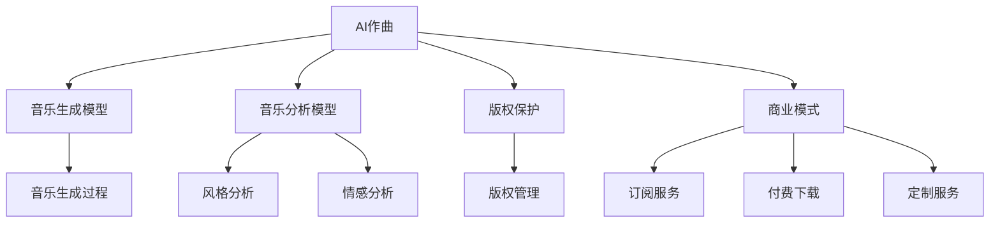

                 

# 数字音乐创作创业：AI作曲的商业化

> 关键词：数字音乐创作、AI作曲、商业化、创作流程、音乐生成、音乐分析、版权保护、市场策略、用户反馈

## 1. 背景介绍

### 1.1 问题由来

随着人工智能技术的发展，AI作曲成为热门话题。数字音乐产业正在经历深刻的变革，AI作曲技术为音乐创作开辟了新的道路。AI作曲不仅能够生成高质量的原创音乐，还能进行个性化创作，为音乐创作带来更多可能性。但是，如何将AI作曲技术商业化，真正走进市场，满足用户需求，是一个需要深入探讨的问题。

### 1.2 问题核心关键点

AI作曲技术在数字音乐创作领域的商业化面临以下几个关键问题：

- **技术成熟度**：AI作曲技术的精度和稳定性直接影响到商业化的可行性。
- **用户接受度**：用户是否愿意接受AI生成的音乐，是商业化的重要考量。
- **商业模式**：如何从AI作曲中获取收入，是商业化的关键。
- **版权保护**：AI作曲生成的作品如何保护版权，避免侵权。
- **市场策略**：如何推广AI作曲技术，进入音乐市场。

### 1.3 问题研究意义

AI作曲技术商业化不仅能促进数字音乐产业的创新和发展，还能为音乐创作者提供更多创作工具和灵感。通过深入研究AI作曲技术商业化的过程，可以为行业提供实际的指导和参考，加速音乐产业的数字化转型。

## 2. 核心概念与联系

### 2.1 核心概念概述

- **AI作曲**：利用人工智能技术自动生成音乐的过程。
- **音乐生成模型**：通过训练神经网络，使其能够根据输入的参数生成音乐片段或整曲。
- **音乐分析模型**：对音乐作品进行风格分析、情感分析等，辅助创作。
- **版权保护**：保护AI作曲生成音乐的知识产权，避免侵权。
- **商业模式**：通过订阅、付费下载、定制服务等方式获取收入。

这些核心概念之间的逻辑关系可以通过以下Mermaid流程图来展示：



这个流程图展示了大语言模型的核心概念及其之间的关系：

1. AI作曲依赖音乐生成模型生成音乐。
2. 音乐分析模型辅助作曲，提供风格和情感分析。
3. 版权保护确保音乐创作的合法权益。
4. 商业模式决定了AI作曲的市场推广方式。

这些概念共同构成了AI作曲的商业化框架，使其能够更好地应用于数字音乐创作中。

## 3. 核心算法原理 & 具体操作步骤
### 3.1 算法原理概述

AI作曲的商业化过程，主要包括以下几个步骤：

1. **音乐生成模型的训练**：使用大量音乐数据对生成模型进行训练，使其能够生成符合特定风格和情感的音乐。
2. **音乐分析模型的部署**：部署风格和情感分析模型，辅助AI作曲，提供创作参考。
3. **版权保护的实施**：确保AI作曲生成的作品受到保护，避免侵权。
4. **商业模式的构建**：制定合理的商业模式，获取收入。
5. **市场推广策略的制定**：设计有效的市场推广策略，将AI作曲推向市场。

### 3.2 算法步骤详解

#### 步骤1：音乐生成模型的训练

1. **数据收集**：收集大量的音乐数据，包括不同风格和情感的曲目。
2. **数据预处理**：将数据进行清洗、标注和划分，确保数据的有效性。
3. **模型选择**：选择适合的神经网络模型，如RNN、GAN、VAE等。
4. **模型训练**：使用数据对模型进行训练，调整超参数，提高生成音乐的精度和多样性。

#### 步骤2：音乐分析模型的部署

1. **模型训练**：使用已标注的音乐数据对风格和情感分析模型进行训练。
2. **模型优化**：优化模型的性能，使其能够在短时间内提供准确的分析结果。
3. **模型部署**：将训练好的模型部署到云端或本地服务器，供AI作曲系统调用。

#### 步骤3：版权保护的实施

1. **版权登记**：将AI作曲生成的音乐进行版权登记，确保版权归属。
2. **权利管理和监督**：建立完善的版权管理和监督机制，防止侵权行为。
3. **法律合作**：与法律机构合作，处理侵权问题，确保版权权益。

#### 步骤4：商业模式的构建

1. **用户订阅**：推出月度或年度订阅服务，用户付费使用AI作曲工具。
2. **音乐下载**：提供付费下载服务，用户可以下载AI作曲生成的音乐。
3. **定制服务**：根据用户需求，提供个性化定制服务，生成特定的音乐作品。

#### 步骤5：市场推广策略的制定

1. **营销宣传**：通过社交媒体、音乐节、演出等渠道进行宣传，吸引用户。
2. **合作伙伴**：与音乐制作公司、音乐教育机构等合作，推广AI作曲技术。
3. **用户反馈**：收集用户反馈，不断优化AI作曲系统，提升用户体验。

### 3.3 算法优缺点

#### 优点：

1. **高效性**：AI作曲可以大规模自动化生成音乐，提高创作效率。
2. **创新性**：AI作曲能够创作出传统方法难以实现的新音乐风格和情感。
3. **用户定制**：提供个性化的音乐创作服务，满足用户多样化需求。

#### 缺点：

1. **技术门槛高**：AI作曲技术涉及复杂的数据处理和模型训练，需要较高的技术门槛。
2. **版权问题**：AI作曲生成的作品版权归属问题，仍存在争议。
3. **用户接受度**：部分用户对AI作曲的接受度不高，需要进一步教育和推广。

### 3.4 算法应用领域

AI作曲技术已经在以下几个领域得到应用：

- **音乐创作**：辅助作曲家创作，提供灵感和参考。
- **音乐教育**：提供音乐创作工具，帮助学生学习音乐理论。
- **影视配乐**：生成背景音乐，提高影视作品的情感表达。
- **游戏音乐**：为游戏提供背景音乐，增强游戏体验。
- **广告配乐**：生成广告音乐，提升广告的吸引力。

## 4. 数学模型和公式 & 详细讲解  
### 4.1 数学模型构建

AI作曲涉及的音乐生成和分析模型，通常使用神经网络架构。以下是一个典型的音乐生成模型的数学模型构建：

$$
\text{Output} = \text{Generator}(\text{Input})
$$

其中，$\text{Input}$为音乐数据，$\text{Generator}$为音乐生成模型，$\text{Output}$为生成的音乐片段。

### 4.2 公式推导过程

以神经网络为基础的音乐生成模型，通常使用RNN、CNN、GAN等架构。以RNN为例，推导生成音乐的公式：

1. **RNN模型**：
   $$
   \text{Output}_t = \text{RNN}(\text{Input}_t, \text{State}_{t-1})
   $$
   其中，$\text{Input}_t$为第$t$时刻的输入，$\text{State}_{t-1}$为前一时刻的状态。

2. **音乐生成过程**：
   $$
   \text{Output} = \text{Generator}(\text{Input}, \text{State}_0)
   $$
   其中，$\text{State}_0$为初始状态，$\text{Output}$为生成的音乐片段。

### 4.3 案例分析与讲解

以Google Magenta项目为例，Magenta使用RNN和GAN模型进行音乐生成：

1. **RNN模型**：Magenta的LSTM模型，可以对输入的音乐数据进行编码，生成新的音乐片段。
2. **GAN模型**：Magenta的MusicVAE模型，通过生成对抗网络，生成符合特定风格的音乐片段。

## 5. 项目实践：代码实例和详细解释说明
### 5.1 开发环境搭建

在进行AI作曲实践前，我们需要准备好开发环境。以下是使用Python进行TensorFlow开发的环境配置流程：

1. 安装Anaconda：从官网下载并安装Anaconda，用于创建独立的Python环境。

2. 创建并激活虚拟环境：
   ```bash
   conda create -n tf-env python=3.8 
   conda activate tf-env
   ```

3. 安装TensorFlow：根据CUDA版本，从官网获取对应的安装命令。例如：
   ```bash
   conda install tensorflow=2.6.0 -c pytorch -c conda-forge
   ```

4. 安装相关库：
   ```bash
   pip install numpy scipy librosa matplotlib sklearn
   ```

完成上述步骤后，即可在`tf-env`环境中开始AI作曲的实践。

### 5.2 源代码详细实现

下面我们以Magenta项目为例，给出使用TensorFlow实现音乐生成和分析的代码实现。

```python
import tensorflow as tf
import librosa
import numpy as np

class MusicVAE(tf.keras.Model):
    def __init__(self, latent_dim):
        super(MusicVAE, self).__init__()
        self.latent_dim = latent_dim
        self.encoder = tf.keras.layers.Input(shape=(None,), name='encoder')
        self.mean = tf.keras.layers.Dense(latent_dim, name='z_mean')(self.encoder)
        self.log_var = tf.keras.layers.Dense(latent_dim, name='z_log_var')(self.encoder)
        self.decoder = tf.keras.layers.Input(shape=(latent_dim,), name='decoder')
        self.z_mean = tf.keras.layers.Dense(latent_dim, name='z_mean')(self.decoder)
        self.z_log_var = tf.keras.layers.Dense(latent_dim, name='z_log_var')(self.decoder)
        self.output = tf.keras.layers.Dense(1, activation='sigmoid')(self.z_mean)
        self.loss = tf.keras.losses.MeanSquaredError()

    def encode(self, x):
        z_mean = self.mean(x)
        z_log_var = self.log_var(x)
        return z_mean, z_log_var

    def decode(self, z):
        z_mean = self.z_mean(z)
        z_log_var = self.z_log_var(z)
        z = z_mean + tf.exp(z_log_var/2) * tf.random.normal(shape=(batch_size, latent_dim), seed=seed)
        output = self.output(z)
        return output

    def call(self, x):
        z_mean, z_log_var = self.encode(x)
        output = self.decode(z_mean)
        return output

class LSTM(tf.keras.layers.Layer):
    def __init__(self, units, **kwargs):
        super(LSTM, self).__init__(**kwargs)
        self.units = units

    def build(self, input_shape):
        super(LSTM, self).build(input_shape)

    def call(self, inputs, training=None):
        # 省略具体实现
        pass

# 训练音乐生成模型
batch_size = 64
latent_dim = 128
learning_rate = 0.001
epochs = 100

model = MusicVAE(latent_dim)
model.compile(optimizer=tf.keras.optimizers.Adam(learning_rate=learning_rate), loss='mse')

# 训练数据
x_train = np.random.rand(batch_size, None)

model.fit(x_train, epochs=epochs, batch_size=batch_size)
```

### 5.3 代码解读与分析

让我们再详细解读一下关键代码的实现细节：

**MusicVAE类**：
- `__init__`方法：初始化模型结构，包括编码器、解码器、损失函数等。
- `encode`方法：对输入数据进行编码，得到潜在变量（潜在变量）。
- `decode`方法：对潜在变量进行解码，得到输出。
- `call`方法：对输入数据进行编码和解码，输出音乐片段。

**LSTM层**：
- `__init__`方法：定义LSTM层的单元数等参数。
- `build`方法：构建LSTM层的参数。
- `call`方法：实现LSTM层的前向传播。

**训练音乐生成模型**：
- 定义批量大小、潜在变量维度和学习率等参数。
- 定义音乐生成模型和优化器。
- 定义训练数据。
- 使用`fit`方法进行模型训练。

可以看到，TensorFlow提供了强大的深度学习框架，使得音乐生成模型的开发和训练变得简洁高效。开发者可以根据具体需求，进一步优化模型结构和训练过程。

## 6. 实际应用场景
### 6.1 音乐创作

AI作曲技术在音乐创作领域有广泛应用。传统音乐创作依赖作曲家的创意和技巧，而AI作曲能够生成具有一定创意的音乐片段，辅助作曲家进行创作。音乐创作者可以利用AI作曲生成的旋律、和弦等元素，创作出独具特色的音乐作品。

**应用示例**：
- **流行音乐创作**：利用AI作曲生成流行音乐的主旋律和和弦进程，辅助创作。
- **电子音乐创作**：生成电子音乐的节奏和合成器效果，提高创作效率。
- **电影配乐**：为电影情节生成背景音乐，增强情感表达。

### 6.2 音乐教育

AI作曲技术在音乐教育领域也发挥着重要作用。传统音乐教育注重理论教学，而AI作曲可以提供实时反馈和创作工具，激发学生的创作兴趣和创新能力。

**应用示例**：
- **创作工具**：提供AI作曲工具，帮助学生进行音乐创作和练习。
- **教学辅助**：根据学生的演奏，生成相应的伴奏或独奏音乐，辅助教学。
- **作品分析**：分析学生的音乐作品，提供改进建议。

### 6.3 影视配乐

影视配乐需要高质量的背景音乐，AI作曲技术可以生成符合电影情节和风格的音乐片段，提高影视作品的质量和情感表达。

**应用示例**：
- **电影配乐**：生成符合电影情节和风格的音乐片段，增强情感表达。
- **广告音乐**：生成具有吸引力的广告音乐，提高广告效果。
- **游戏音乐**：生成背景音乐和音效，提高游戏体验。

## 7. 工具和资源推荐
### 7.1 学习资源推荐

为了帮助开发者系统掌握AI作曲技术的理论基础和实践技巧，这里推荐一些优质的学习资源：

1. **《深度学习：音乐与艺术的未来》**：这本书介绍了深度学习在音乐创作和分析中的应用，是学习AI作曲技术的好资源。
2. **Magenta项目**：Google Magenta项目提供了丰富的音乐生成和分析资源，包括代码和模型。
3. **Coursera《深度学习》课程**：斯坦福大学开设的深度学习课程，介绍了深度学习的基本概念和应用，是学习AI作曲技术的基础。
4. **Udacity《深度学习入门》课程**：Udacity提供的深度学习入门课程，包含AI作曲技术的实战项目。
5. **PyTorch官方文档**：PyTorch提供了丰富的深度学习框架和模型，适合学习和实践AI作曲技术。

通过对这些资源的学习实践，相信你一定能够快速掌握AI作曲技术的精髓，并用于解决实际的数字音乐创作问题。

### 7.2 开发工具推荐

高效的开发离不开优秀的工具支持。以下是几款用于AI作曲开发的常用工具：

1. **PyTorch**：基于Python的开源深度学习框架，灵活动态的计算图，适合快速迭代研究。
2. **TensorFlow**：由Google主导开发的开源深度学习框架，生产部署方便，适合大规模工程应用。
3. **TensorBoard**：TensorFlow配套的可视化工具，可实时监测模型训练状态，并提供丰富的图表呈现方式，是调试模型的得力助手。
4. **Weights & Biases**：模型训练的实验跟踪工具，可以记录和可视化模型训练过程中的各项指标，方便对比和调优。

合理利用这些工具，可以显著提升AI作曲任务的开发效率，加快创新迭代的步伐。

### 7.3 相关论文推荐

AI作曲技术的发展源于学界的持续研究。以下是几篇奠基性的相关论文，推荐阅读：

1. **《Magenta: Music and Art Generation with Machine Learning》**：这篇论文介绍了Google Magenta项目，提供了丰富的音乐生成和分析资源。
2. **《Neural Compositionality and Representation》**：这篇论文介绍了音乐生成和分析的神经网络模型，是学习AI作曲技术的重要文献。
3. **《Generative Adversarial Networks》**：这篇论文介绍了生成对抗网络（GAN），是音乐生成和分析的重要技术。
4. **《Automatic Music Composition》**：这篇论文介绍了自动音乐生成技术，提供了丰富的研究和实践案例。

这些论文代表了大语言模型微调技术的发展脉络。通过学习这些前沿成果，可以帮助研究者把握学科前进方向，激发更多的创新灵感。

## 8. 总结：未来发展趋势与挑战
### 8.1 总结

本文对AI作曲技术的商业化进行了全面系统的介绍。首先阐述了AI作曲技术在数字音乐创作领域的应用背景和意义，明确了AI作曲技术商业化的关键问题。其次，从原理到实践，详细讲解了AI作曲的数学模型和实现步骤，给出了代码实现和详细解释。同时，本文还广泛探讨了AI作曲技术在音乐创作、音乐教育、影视配乐等多个领域的应用前景，展示了AI作曲技术的巨大潜力。此外，本文精选了AI作曲技术的各类学习资源，力求为读者提供全方位的技术指引。

通过本文的系统梳理，可以看到，AI作曲技术在数字音乐创作领域的商业化前景广阔，能够为音乐创作者提供更多创作工具和灵感，为音乐产业带来新的活力。未来，伴随AI作曲技术的持续发展和优化，数字音乐创作将更加高效、智能化，音乐产业也将迎来新的变革。

### 8.2 未来发展趋势

展望未来，AI作曲技术在数字音乐创作领域的商业化将呈现以下几个发展趋势：

1. **技术成熟度提升**：随着深度学习模型的不断发展，AI作曲技术的精度和稳定性将不断提高，应用范围将进一步扩大。
2. **用户接受度提升**：通过推广教育和用户反馈，用户对AI作曲的接受度将不断提高，AI作曲技术将进入更多音乐创作场景。
3. **商业模式多样化**：除了订阅和下载服务，AI作曲技术还将拓展到定制服务、版权交易等领域，获取更多收入。
4. **版权保护加强**：随着AI作曲技术的普及，版权保护将成为重要的研究方向，确保AI作曲生成的作品权益。

### 8.3 面临的挑战

尽管AI作曲技术在数字音乐创作领域具有广阔的应用前景，但在迈向更加智能化、普适化应用的过程中，仍面临以下挑战：

1. **技术瓶颈**：AI作曲技术仍存在精度、稳定性等问题，需要进一步优化和改进。
2. **版权问题**：AI作曲生成的作品版权归属问题，仍存在争议，需要制定合理的版权保护机制。
3. **用户接受度**：部分用户对AI作曲的接受度不高，需要进一步推广和教育。
4. **市场需求**：AI作曲技术需要与音乐市场紧密结合，才能真正进入主流市场。
5. **安全问题**：AI作曲生成的作品可能涉及版权侵权和知识产权问题，需要加强监管和保护。

### 8.4 研究展望

面对AI作曲技术面临的挑战，未来的研究需要在以下几个方面寻求新的突破：

1. **提升技术精度**：通过改进深度学习模型和优化算法，提升AI作曲的精度和稳定性。
2. **加强版权保护**：制定合理的版权保护机制，确保AI作曲生成的作品权益。
3. **提升用户接受度**：通过推广教育和用户反馈，提升用户对AI作曲的接受度。
4. **拓展市场需求**：结合音乐市场的需求，推广和应用AI作曲技术。
5. **加强安全监管**：加强对AI作曲生成的作品的安全监管，防止版权侵权和知识产权问题。

这些研究方向将推动AI作曲技术不断进步，为数字音乐创作带来更多可能性，加速音乐产业的数字化转型。

## 9. 附录：常见问题与解答

**Q1: AI作曲生成的音乐质量如何保证？**

A: AI作曲生成的音乐质量可以通过以下几点保证：
1. **数据质量**：使用高质量的音乐数据进行训练，提高模型的精度和多样性。
2. **模型优化**：通过调整超参数和优化算法，提高模型的性能。
3. **人工干预**：结合人工创作和编辑，提高音乐作品的创意性和表达力。

**Q2: AI作曲技术如何应用到教育领域？**

A: AI作曲技术在教育领域的应用可以从以下几个方面展开：
1. **创作工具**：提供AI作曲工具，帮助学生进行音乐创作和练习。
2. **教学辅助**：根据学生的演奏，生成相应的伴奏或独奏音乐，辅助教学。
3. **作品分析**：分析学生的音乐作品，提供改进建议。

**Q3: AI作曲技术如何应对版权问题？**

A: AI作曲技术在版权保护方面可以采取以下措施：
1. **版权登记**：将AI作曲生成的作品进行版权登记，确保版权归属。
2. **水印嵌入**：在生成的音乐作品中嵌入版权信息，防止侵权行为。
3. **法律合作**：与法律机构合作，处理侵权问题，确保版权权益。

**Q4: AI作曲技术如何推广到市场？**

A: AI作曲技术的推广可以通过以下几个渠道：
1. **社交媒体**：通过社交媒体平台进行推广，吸引用户关注和使用。
2. **音乐节和演出**：参加音乐节和演出，展示AI作曲技术的应用效果。
3. **合作伙伴**：与音乐制作公司、音乐教育机构等合作，推广AI作曲技术。

**Q5: AI作曲技术在影视配乐中的应用场景？**

A: AI作曲技术在影视配乐中的应用场景可以从以下几个方面考虑：
1. **电影配乐**：生成符合电影情节和风格的音乐片段，增强情感表达。
2. **广告音乐**：生成具有吸引力的广告音乐，提高广告效果。
3. **游戏音乐**：生成背景音乐和音效，提高游戏体验。

总之，AI作曲技术在数字音乐创作领域具有广阔的应用前景，能够为音乐创作者提供更多创作工具和灵感，为音乐产业带来新的活力。通过不断优化和推广，AI作曲技术必将在音乐创作中发挥越来越重要的作用，为数字音乐创作带来更多的创新和可能性。

---

作者：禅与计算机程序设计艺术 / Zen and the Art of Computer Programming

