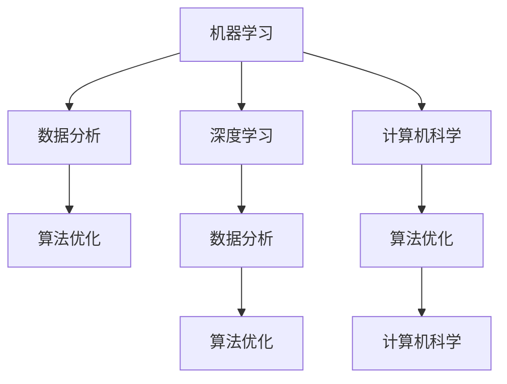

                 

# 数学基础在AI中的重要性

> 关键词：数学基础, 机器学习, 深度学习, 数据分析, 计算机科学, 算法优化

## 1. 背景介绍

### 1.1 问题由来
随着人工智能（AI）技术的发展，数学在其中扮演了至关重要的角色。无论是机器学习、深度学习还是自然语言处理等领域，数学方法都是不可或缺的。然而，尽管数学基础在AI中具有重要地位，但实际应用中常常被忽视或简化。本文将深入探讨数学基础在AI中的重要性，通过具体案例和算法原理阐述其核心作用，并探讨未来的发展趋势和面临的挑战。

## 2. 核心概念与联系

### 2.1 核心概念概述

为更好地理解数学在AI中的重要性，本节将介绍几个关键概念：

- 机器学习(Machine Learning)：通过数据训练模型，使其能够对未知数据进行预测或分类的一种人工智能技术。
- 深度学习(Deep Learning)：机器学习的一种特殊形式，使用多层神经网络对数据进行抽象特征提取和复杂模式学习。
- 数据分析(Statistical Analysis)：对数据进行统计分析，提取有用信息和规律，为模型训练提供数据基础。
- 计算机科学(Computer Science)：研究计算机硬件和软件系统的设计、开发、应用以及维护等内容的学科。
- 算法优化(Algorithm Optimization)：通过优化算法提高模型训练和推理的效率和准确性，是AI系统性能提升的关键环节。

这些核心概念共同构成了AI技术的基本框架，而数学方法在其中扮演了桥梁和工具的角色，推动了AI的不断发展和创新。

### 2.2 核心概念原理和架构的 Mermaid 流程图(Mermaid 流程节点中不要有括号、逗号等特殊字符)



这个流程图展示了大语言模型的核心概念及其之间的联系：

1. 机器学习通过数据训练模型，提取特征。
2. 深度学习使用多层神经网络对数据进行复杂特征提取。
3. 数据分析对数据进行统计分析，提取规律。
4. 计算机科学研究硬件和软件系统，提供计算能力。
5. 算法优化提升模型训练和推理效率。

这些概念相互作用，共同驱动AI技术的发展和应用。

## 3. 核心算法原理 & 具体操作步骤
### 3.1 算法原理概述

数学在AI中的重要性主要体现在以下几个方面：

1. **模型训练**：深度学习模型的训练过程实际上是一种最优化问题。通过数学方法，如梯度下降、牛顿法等，可以求解复杂的非线性优化问题，找到模型参数的最佳值。

2. **数据表示**：数据在机器学习中的表示形式直接影响到模型的性能。数学方法，如向量空间模型、张量分解等，可以有效地将数据表示为更易处理的形式，提高模型的训练效率和效果。

3. **特征提取**：特征提取是机器学习中的关键步骤，数学方法，如主成分分析(PCA)、线性判别分析(LDA)等，可以从数据中提取最有信息量的特征，提升模型的泛化能力。

4. **模型评估**：机器学习模型的评估指标，如准确率、召回率、F1值等，都是基于数学统计方法得到的。这些指标帮助评估模型的性能，指导模型的优化。

5. **算法优化**：深度学习模型的优化过程涉及大量的计算和迭代，数学方法，如优化算法、数值计算等，可以显著提高计算效率和优化效果。

### 3.2 算法步骤详解

以深度学习模型的训练为例，具体说明数学在其中的应用：

1. **数据准备**：将数据转化为模型能够处理的格式，如将文本数据转换为词向量，将图像数据转换为张量。

2. **模型设计**：设计多层神经网络结构，确定网络的输入、隐藏层和输出层的大小，选择合适的激活函数、损失函数等。

3. **模型训练**：通过数学方法，如梯度下降，最小化损失函数，更新模型参数。

4. **模型评估**：通过评估指标，如准确率、召回率，评估模型性能，发现问题并进行优化。

5. **模型优化**：通过数学方法，如剪枝、量化、模型蒸馏等，优化模型结构，提升计算效率和准确性。

### 3.3 算法优缺点

数学在AI中的应用具有以下优点：

1. **高效性**：数学方法可以高效地处理大量数据，提升模型训练和推理的效率。
2. **精确性**：数学方法可以提供精确的模型参数优化，提高模型的准确性。
3. **通用性**：数学方法适用于各种类型的AI任务，包括图像识别、自然语言处理、智能推荐等。

然而，数学方法也存在一些缺点：

1. **复杂性**：数学方法往往涉及复杂的计算和理论推导，对专业性要求较高。
2. **数据依赖性**：模型的性能高度依赖于数据的质量和数量，数据不足时可能无法取得理想效果。
3. **过拟合问题**：数学方法可能过度拟合训练数据，导致模型泛化能力不足。

### 3.4 算法应用领域

数学方法在AI中广泛应用，涵盖了以下几个主要领域：

1. **机器学习**：机器学习模型的训练和优化，如梯度下降、正则化、交叉验证等。
2. **深度学习**：深度学习模型的结构设计和优化，如卷积神经网络(CNN)、循环神经网络(RNN)等。
3. **数据分析**：数据的统计分析和特征提取，如主成分分析(PCA)、线性判别分析(LDA)等。
4. **计算机科学**：计算机硬件和软件系统设计，如分布式计算、数据存储等。
5. **算法优化**：优化算法的开发和应用，如快速排序、K-means聚类等。

## 4. 数学模型和公式 & 详细讲解 & 举例说明

### 4.1 数学模型构建

在AI中，数学模型通常包括以下几个关键组件：

1. **输入层**：表示输入数据的格式和特征，如图像、文本、音频等。
2. **隐藏层**：对输入数据进行特征提取和转换，通常由多个神经元组成。
3. **输出层**：对隐藏层的输出进行解释和预测，如分类、回归等。
4. **损失函数**：衡量模型预测和真实标签之间的差异，如均方误差、交叉熵等。
5. **优化算法**：通过反向传播更新模型参数，如梯度下降、Adam等。

### 4.2 公式推导过程

以线性回归模型为例，展示数学模型的推导过程：

假设数据集为 $(x_i, y_i)$，其中 $x_i \in \mathbb{R}^n$ 为输入特征，$y_i \in \mathbb{R}$ 为标签。线性回归模型形式为：

$$
y_i = \theta^T x_i + \epsilon_i
$$

其中 $\theta \in \mathbb{R}^n$ 为模型参数，$\epsilon_i$ 为误差项。

目标是最小化均方误差损失函数：

$$
L(\theta) = \frac{1}{2N} \sum_{i=1}^N (y_i - \theta^T x_i)^2
$$

通过梯度下降算法，更新参数 $\theta$：

$$
\theta \leftarrow \theta - \alpha \frac{\partial L(\theta)}{\partial \theta}
$$

其中 $\alpha$ 为学习率，$\frac{\partial L(\theta)}{\partial \theta}$ 为损失函数对 $\theta$ 的梯度，可通过链式法则计算。

### 4.3 案例分析与讲解

以图像识别为例，展示数学方法在AI中的应用：

1. **数据预处理**：将图像数据转换为张量形式，如将RGB图像转换为三通道张量。
2. **模型设计**：设计卷积神经网络(CNN)结构，包括卷积层、池化层、全连接层等。
3. **模型训练**：通过反向传播算法更新模型参数，最小化损失函数。
4. **模型评估**：通过准确率和混淆矩阵等指标评估模型性能。
5. **模型优化**：通过剪枝、量化等方法优化模型，提升推理效率。

## 5. 项目实践：代码实例和详细解释说明

### 5.1 开发环境搭建

在进行AI项目开发前，需要先搭建好开发环境。以下是使用Python进行TensorFlow开发的环境配置流程：

1. 安装Anaconda：从官网下载并安装Anaconda，用于创建独立的Python环境。

2. 创建并激活虚拟环境：
```bash
conda create -n tf-env python=3.8 
conda activate tf-env
```

3. 安装TensorFlow：根据CUDA版本，从官网获取对应的安装命令。例如：
```bash
conda install tensorflow tensorflow-gpu
```

4. 安装其他必要的库：
```bash
pip install numpy matplotlib scikit-learn pandas
```

完成上述步骤后，即可在`tf-env`环境中开始AI项目开发。

### 5.2 源代码详细实现

下面我们以图像分类任务为例，展示使用TensorFlow进行卷积神经网络(CNN)的代码实现。

首先，导入必要的库和模块：

```python
import tensorflow as tf
from tensorflow.keras import datasets, layers, models
```

然后，定义CNN模型：

```python
model = models.Sequential([
    layers.Conv2D(32, (3, 3), activation='relu', input_shape=(28, 28, 1)),
    layers.MaxPooling2D((2, 2)),
    layers.Conv2D(64, (3, 3), activation='relu'),
    layers.MaxPooling2D((2, 2)),
    layers.Conv2D(64, (3, 3), activation='relu'),
    layers.Flatten(),
    layers.Dense(64, activation='relu'),
    layers.Dense(10, activation='softmax')
])
```

接着，编译和训练模型：

```python
model.compile(optimizer='adam',
              loss=tf.keras.losses.SparseCategoricalCrossentropy(from_logits=True),
              metrics=['accuracy'])

(train_images, train_labels), (test_images, test_labels) = datasets.mnist.load_data()
train_images = train_images.reshape((60000, 28, 28, 1))
test_images = test_images.reshape((10000, 28, 28, 1))
train_images = train_images / 255.0
test_images = test_images / 255.0

model.fit(train_images, train_labels, epochs=5, 
          validation_data=(test_images, test_labels))
```

最后，评估和保存模型：

```python
test_loss, test_acc = model.evaluate(test_images, test_labels, verbose=2)
model.save('my_cnn_model.h5')

print(f'Test accuracy: {test_acc}')
```

这就是使用TensorFlow进行图像分类任务的完整代码实现。可以看到，TensorFlow提供了一系列的高级API，使得CNN模型的设计和训练变得简单高效。

### 5.3 代码解读与分析

让我们再详细解读一下关键代码的实现细节：

**Sequential模型**：
- 使用Sequential模型创建卷积神经网络，逐层添加卷积层、池化层、全连接层等。
- 卷积层通过指定过滤器大小、数量和激活函数，对输入数据进行卷积操作。
- 池化层通过指定池化大小和步长，对卷积层的输出进行降维。
- 全连接层通过指定节点数量和激活函数，对池化层的输出进行特征提取。

**数据预处理**：
- 使用标准化方法将图像像素值归一化到0到1之间。
- 使用reshape方法调整数据形状，以符合模型输入要求。

**模型编译**：
- 使用Adam优化器进行参数更新。
- 使用交叉熵损失函数计算预测和真实标签之间的差异。
- 使用准确率作为模型评估指标。

**模型训练**：
- 使用fit方法进行模型训练，指定训练数据、标签、轮数和验证集。
- 训练过程中，模型会根据损失函数自动调整参数。

**模型评估和保存**：
- 使用evaluate方法评估模型在测试集上的表现。
- 使用save方法将模型保存为HDF5格式，便于后续使用和部署。

以上代码展示了使用TensorFlow进行图像分类任务的完整流程，涵盖了模型构建、数据预处理、模型训练、模型评估等关键步骤。通过TensorFlow的高级API，开发者可以更加方便快捷地进行模型设计和训练。

## 6. 实际应用场景

### 6.1 智能推荐系统

基于数学的推荐系统通过构建用户-物品关联矩阵，利用矩阵分解和降维技术，对用户和物品进行特征提取和相似度计算，推荐符合用户偏好的物品。

具体而言，推荐系统可以收集用户的历史行为数据，如浏览、点击、购买等，提取物品的特征，如描述、价格、评分等。然后通过数学方法，如奇异值分解(SVD)、非负矩阵分解(NNMF)等，将用户和物品映射到低维空间，计算用户和物品之间的相似度，从而推荐物品。

### 6.2 图像识别

数学方法在图像识别任务中得到了广泛应用，如卷积神经网络(CNN)、深度卷积生成对抗网络(DCGAN)等。

卷积神经网络通过多层卷积和池化操作，提取图像的局部特征，然后通过全连接层进行分类。深度卷积生成对抗网络通过生成器和判别器的对抗训练，生成高质量的图像。

### 6.3 自然语言处理

自然语言处理任务中，数学方法用于文本表示、语言模型和机器翻译等。

文本表示通过数学方法，如词嵌入(Word Embedding)、句嵌入(Sentence Embedding)等，将文本转换为向量形式，方便模型处理。语言模型通过数学方法，如循环神经网络(RNN)、Transformer等，对文本进行序列建模。机器翻译通过数学方法，如序列到序列(Seq2Seq)、注意力机制(Attention)等，将一种语言的文本转换为另一种语言。

### 6.4 未来应用展望

随着数学方法在AI中的不断发展和应用，未来将呈现以下几个发展趋势：

1. **深度学习的发展**：深度学习模型的层数和参数量将持续增加，数学方法将提供更高效的计算和优化手段，提升模型的训练和推理效率。
2. **强化学习的应用**：强化学习模型通过数学方法，如动态规划、蒙特卡罗树搜索等，优化决策过程，实现更智能的决策。
3. **计算机视觉的进步**：计算机视觉领域将利用数学方法，如深度神经网络、图像处理算法等，实现更精准的图像识别和图像生成。
4. **自然语言理解的突破**：自然语言理解领域将利用数学方法，如语义表示、语言模型等，实现更准确的文本理解和生成。
5. **大规模数据处理**：随着数据量的增加，数学方法将提供更高效的算法和工具，支持大规模数据的存储和处理。

## 7. 工具和资源推荐

### 7.1 学习资源推荐

为了帮助开发者系统掌握数学在AI中的重要性，这里推荐一些优质的学习资源：

1. 《深度学习》（Deep Learning）书籍：由Ian Goodfellow等人合著，全面介绍了深度学习的基础理论和应用实践。

2. 《机器学习》（Pattern Recognition and Machine Learning）书籍：由Christopher Bishop合著，深入讲解了机器学习的数学基础和算法原理。

3. Coursera的《机器学习》课程：斯坦福大学开设的机器学习课程，涵盖机器学习的基础理论和算法实现。

4. edX的《Deep Learning》课程：由MIT等高校开设的深度学习课程，介绍了深度学习的基本概念和算法实现。

5. GitHub的深度学习项目：通过阅读优秀的深度学习项目，可以学习实际应用中的数学方法和算法优化。

通过对这些资源的学习实践，相信你一定能够快速掌握数学在AI中的重要性，并用于解决实际的AI问题。

### 7.2 开发工具推荐

高效的开发离不开优秀的工具支持。以下是几款用于AI开发的工具：

1. Python：一种通用的编程语言，广泛应用于数据科学和机器学习领域。

2. TensorFlow：由Google主导开发的开源深度学习框架，支持分布式计算，提供丰富的API。

3. PyTorch：Facebook开发的开源深度学习框架，易于使用，支持动态计算图。

4. Scikit-learn：基于Python的机器学习库，提供多种算法和工具，方便快速实现机器学习模型。

5. Keras：基于TensorFlow和Theano的高层API，提供了简洁的接口，方便快速搭建深度学习模型。

6. Jupyter Notebook：交互式的开发环境，支持代码编写、数据可视化和模型评估等。

合理利用这些工具，可以显著提升AI开发和研究的效率，加快创新迭代的步伐。

### 7.3 相关论文推荐

数学方法在AI中的应用得到了学界的持续研究。以下是几篇奠基性的相关论文，推荐阅读：

1. 《深度学习》（Deep Learning）书籍：Yoshua Bengio等人合著，介绍了深度学习的基本原理和应用实践。

2. 《机器学习》（Pattern Recognition and Machine Learning）书籍：Christopher Bishop合著，深入讲解了机器学习的数学基础和算法原理。

3. 《强化学习》（Reinforcement Learning: An Introduction）书籍：Richard S. Sutton和Andrew G. Barto合著，全面介绍了强化学习的基础理论和应用实践。

4. 《深度卷积生成对抗网络》（Generative Adversarial Networks）论文：Ian Goodfellow等人合著，提出了生成对抗网络的基本框架和算法实现。

5. 《语义表示》（Semantic Representations from Texts and Answers）论文：Tom Needham等人合著，利用深度学习模型进行语义表示和问答系统的研究。

这些论文代表了大语言模型微调技术的发展脉络。通过学习这些前沿成果，可以帮助研究者把握学科前进方向，激发更多的创新灵感。

## 8. 总结：未来发展趋势与挑战

### 8.1 总结

本文对数学在AI中的重要性进行了全面系统的介绍。首先阐述了数学在AI中的核心作用，通过具体案例和算法原理阐述其核心作用，并探讨了未来的发展趋势和面临的挑战。

通过本文的系统梳理，可以看到，数学方法在AI中具有重要的地位，不仅推动了深度学习模型的训练和优化，还提供了高效的数据表示和特征提取手段。未来，伴随数学方法与AI技术的进一步融合，将为AI系统的优化和应用提供更多的可能性。

### 8.2 未来发展趋势

展望未来，数学方法在AI中的应用将呈现以下几个发展趋势：

1. **高效计算的推动**：随着硬件技术的不断进步，如GPU、TPU等加速器的应用，数学方法将提供更高效的计算手段，提升AI系统的性能和效率。
2. **多模态融合的拓展**：未来AI系统将更多地利用多模态数据，如文本、图像、音频等，数学方法将提供更好的数据融合和表示手段。
3. **实时处理的优化**：随着AI系统在实际应用中的普及，实时处理的优化将成为一个重要方向，数学方法将提供更高效的算法和模型结构。
4. **自动化优化**：自动化优化将成为一个新的研究方向，数学方法将提供更智能的优化策略，提升AI系统的自适应能力和鲁棒性。
5. **隐私保护和安全性的保障**：数学方法将提供更好的数据隐私保护和安全保障手段，确保AI系统在实际应用中的可靠性和安全性。

### 8.3 面临的挑战

尽管数学方法在AI中的应用取得了显著进展，但在迈向更加智能化、普适化应用的过程中，它仍面临诸多挑战：

1. **数据质量和数量的挑战**：高质量、大规模数据的获取和处理是AI系统性能提升的前提，但在实际应用中，数据质量和数量的不足往往成为瓶颈。
2. **算法复杂性和可解释性的问题**：AI系统中的算法和模型往往过于复杂，难以解释其内部工作机制和决策逻辑，这给实际应用带来了挑战。
3. **计算资源和算法的局限**：AI系统在实际应用中往往需要大量计算资源，但现有计算资源的局限性制约了AI系统的大规模部署和应用。
4. **伦理和社会责任**：AI系统的广泛应用带来了伦理和社会责任问题，如隐私保护、偏见消除等，需要通过数学方法和政策法规进行规范和保障。
5. **跨领域和跨学科的协作**：AI系统的应用涉及多个领域和学科，需要数学方法与跨学科知识的协作，才能实现更全面和深入的应用。

### 8.4 研究展望

面对AI系统面临的挑战，未来的研究需要在以下几个方面寻求新的突破：

1. **数据生成和数据增强**：开发更加高效的数据生成和增强方法，提高数据的质量和数量。
2. **可解释性和透明性**：开发更好的AI系统解释方法，确保其决策过程透明和可理解。
3. **高效计算和优化**：研究更高效计算和优化算法，提高AI系统的性能和效率。
4. **跨学科合作**：加强跨学科的协作，推动数学方法与AI技术的进一步融合。
5. **伦理和安全性**：制定更加完善的伦理和安全性规范，确保AI系统的可靠性和安全性。

这些研究方向的探索，将推动数学方法在AI中的应用不断深入，为构建智能、可靠、可解释的AI系统提供坚实的理论和技术基础。总之，数学方法在AI中的应用将引领未来AI技术的发展方向，为人类认知智能的进化带来深远影响。

## 9. 附录：常见问题与解答

**Q1：机器学习中的梯度下降算法有何特点？**

A: 梯度下降算法是机器学习中常用的最优化算法之一，通过不断更新模型参数，最小化损失函数。其主要特点包括：

1. **迭代更新**：通过迭代计算，逐步优化模型参数。
2. **自适应学习率**：根据当前梯度的大小，自适应调整学习率，防止过拟合和欠拟合。
3. **局部极小值问题**：在复杂函数上，可能收敛到局部极小值，需要通过随机梯度下降等方法克服。

**Q2：深度学习中的卷积神经网络有何优势？**

A: 卷积神经网络在深度学习中具有以下优势：

1. **局部连接**：卷积层中每个神经元只与局部区域连接，减少了模型参数，提高了计算效率。
2. **参数共享**：同一卷积核在不同位置具有相同的权重，减少了模型的复杂度。
3. **平移不变性**：卷积层对图像的平移、旋转等变换具有不变性，提升了模型的鲁棒性。
4. **多尺度特征提取**：通过不同大小的卷积核，可以提取不同尺度的特征，提高模型的表现能力。

**Q3：自然语言处理中的Transformer模型有何特点？**

A: Transformer模型在自然语言处理中具有以下特点：

1. **自注意力机制**：通过自注意力机制，模型可以同时考虑输入序列中的所有位置，避免了长距离依赖问题。
2. **并行计算**：Transformer模型中，编码器和解码器可以并行计算，提高了计算效率。
3. **高效训练**：Transformer模型使用多任务学习等技术，可以高效地训练大规模语言模型。

**Q4：强化学习中的蒙特卡罗树搜索有何特点？**

A: 蒙特卡罗树搜索在强化学习中具有以下特点：

1. **启发式搜索**：通过搜索状态空间，找到最优策略。
2. **随机性**：在搜索过程中，加入随机性，以防止陷入局部最优。
3. **回溯优化**：通过回溯优化，逐步调整搜索策略，提升搜索效率。
4. **应用广泛**：蒙特卡罗树搜索在围棋、游戏AI等领域得到了广泛应用。

通过这些常见问题的解答，相信读者能够更深入地理解数学方法在AI中的重要性，并应用于实际项目中。

---

作者：禅与计算机程序设计艺术 / Zen and the Art of Computer Programming

