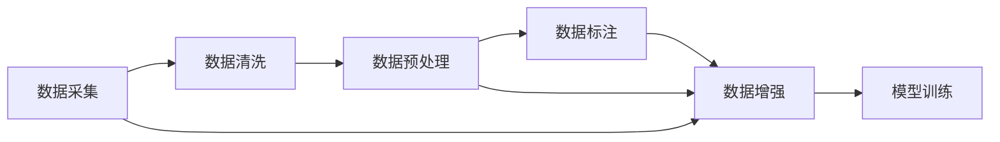

                 

# 数据决定一切：AI训练数据的收集与处理

> 关键词：训练数据, 数据处理, 数据增强, 数据标注, 数据采集, 数据清洗, 数据预处理, 数据集构建, 数据存储, 数据标注工具, 数据集优化

## 1. 背景介绍

随着人工智能(AI)技术的发展，数据在AI模型的训练和优化过程中扮演着至关重要的角色。AI系统的性能很大程度上取决于其所使用的训练数据的质量、数量和多样性。优质的训练数据可以帮助模型更好地学习到数据的内在规律，从而提升模型的泛化能力和预测精度。然而，数据收集、处理和标注是极其耗时且复杂的任务，同时也面临着许多挑战。本文旨在全面阐述AI训练数据的收集与处理过程，并提出一些策略和工具来应对这些挑战。

### 1.1 数据在AI训练中的重要性

数据是AI训练的基石。在深度学习中，模型通过大量数据进行训练，学习数据的内在规律。数据的多样性和丰富性直接影响模型的泛化能力。好的数据集可以帮助模型更好地理解数据的多样性和复杂性，从而提升模型的准确性和稳定性。

在计算机视觉领域，数据的多样性可以帮助模型更好地适应不同场景和环境下的图像变化。在自然语言处理领域，高质量的文本数据可以帮助模型更好地理解语言的语义和结构。在语音识别领域，大量的音频数据可以帮助模型更好地捕捉语音特征。

### 1.2 数据收集与处理的挑战

数据收集和处理是构建高质量AI模型的重要环节。然而，这一过程也面临诸多挑战：

- **数据多样性和覆盖面**：不同领域的数据分布和特征差异较大，需要收集大量样本以覆盖所有情况。
- **数据标注质量**：标注数据需要经过人工审核和标注，错误标注会导致模型性能下降。
- **数据隐私和安全**：大规模数据收集和存储需要严格的数据隐私保护措施，避免数据泄露。
- **数据采集成本**：高质量数据的采集成本较高，需要投入大量人力物力。
- **数据质量控制**：数据中可能存在噪声、缺失值等问题，需要清洗和预处理。

本文将详细介绍AI训练数据的收集与处理流程，以及应对这些挑战的策略和工具。

## 2. 核心概念与联系

### 2.1 核心概念概述

- **训练数据**：用于训练AI模型的数据集，包含大量样本和标签。
- **数据处理**：对原始数据进行清洗、预处理、转换等操作，以提高数据质量和一致性。
- **数据增强**：通过数据变换、合成等方法，增加数据集的多样性和覆盖面，提升模型泛化能力。
- **数据标注**：给数据集中的每个样本添加标签，使其与真实标签对齐。
- **数据采集**：从各种渠道收集数据，如公开数据集、网络爬虫、传感器等。
- **数据清洗**：去除数据中的噪声、重复、缺失等不理想部分，确保数据质量。
- **数据预处理**：对数据进行格式转换、归一化、标准化等操作，为模型训练提供标准输入。

这些概念之间存在紧密联系，数据标注、数据清洗和数据预处理都是数据处理的重要环节。数据增强和数据采集则进一步扩充数据集的规模和多样性。通过合理的数据处理流程，可以构建高质量的数据集，为模型训练提供良好的数据基础。

### 2.2 核心概念原理和架构的 Mermaid 流程图



该流程图展示了数据处理流程的核心步骤。从数据采集到模型训练，数据处理贯穿其中。数据清洗和预处理是基础，数据标注和增强是关键，两者共同确保了数据的质量和多样性。最终，处理好的数据进入模型训练阶段，用于优化模型参数和提升模型性能。

## 3. 核心算法原理 & 具体操作步骤

### 3.1 算法原理概述

AI模型的训练过程本质上是一个优化问题，目标是最小化模型在训练数据上的损失函数。数据处理是这一过程的基础，直接影响到模型的性能。好的数据处理流程可以提高模型泛化能力，减少过拟合，提升模型性能。

### 3.2 算法步骤详解

#### 3.2.1 数据采集

数据采集是AI训练的第一步，涉及从各种渠道收集数据。常用的数据源包括：

- **公开数据集**：如ImageNet、COCO、IMDB等，这些数据集是开源的，可以直接使用。
- **网络爬虫**：使用爬虫技术从网络中抓取数据，如新闻、博客、社交媒体等。
- **传感器数据**：如摄像头、传感器等设备采集的数据。
- **用户数据**：通过用户交互获取的数据，如点击、浏览、购买等行为数据。

数据采集需要考虑数据来源、数据量、数据格式等因素。对于大规模数据采集，需要使用分布式系统和并行处理技术，确保数据采集的效率和质量。

#### 3.2.2 数据清洗

数据清洗是数据处理的第一步，涉及去除数据中的噪声、缺失值等不理想部分。数据清洗可以提升数据质量，减少数据预处理和标注的复杂性。常用的数据清洗方法包括：

- **去重**：去除重复的数据样本，避免数据冗余。
- **填补缺失值**：对缺失值进行填补，确保数据完整性。
- **去除异常值**：去除异常值，避免其对模型训练造成影响。

数据清洗需要结合具体数据源和应用场景进行，不同的数据源和应用场景可能需要不同的清洗策略。

#### 3.2.3 数据预处理

数据预处理是对数据进行格式转换、归一化、标准化等操作，为模型训练提供标准输入。数据预处理可以提升模型性能，减少模型训练的时间和资源消耗。常用的数据预处理方法包括：

- **格式转换**：将数据转换为标准格式，如将图像数据转换为张量，将文本数据转换为向量。
- **归一化**：对数据进行归一化，使得数据值在[0,1]或[-1,1]等标准范围内。
- **标准化**：对数据进行标准化，消除数据中量纲差异。
- **特征提取**：从原始数据中提取特征，为模型训练提供更有意义的数据表示。

数据预处理需要结合具体应用场景进行，不同的数据源和应用场景可能需要不同的预处理策略。

#### 3.2.4 数据标注

数据标注是数据处理的关键步骤，涉及给数据集中的每个样本添加标签，使其与真实标签对齐。数据标注需要大量的人力物力，是数据处理中最耗时的环节。常用的数据标注方法包括：

- **人工标注**：通过人工审核和标注，确保标注数据的准确性。
- **半自动标注**：结合人工智能和人工标注，提高标注效率。
- **众包标注**：通过众包平台获取标注数据，减少标注成本。

数据标注需要结合具体应用场景进行，不同的应用场景可能需要不同的标注策略。

#### 3.2.5 数据增强

数据增强是通过数据变换、合成等方法，增加数据集的多样性和覆盖面，提升模型泛化能力。数据增强可以解决数据集不足的问题，提升模型鲁棒性。常用的数据增强方法包括：

- **图像增强**：对图像进行旋转、缩放、翻转等操作，增加图像多样性。
- **文本增强**：对文本进行回译、替换、插入等操作，增加文本多样性。
- **音频增强**：对音频进行变速、变调、降噪等操作，增加音频多样性。

数据增强需要结合具体应用场景进行，不同的数据源和应用场景可能需要不同的增强策略。

### 3.3 算法优缺点

#### 3.3.1 优点

- **提升模型性能**：通过数据处理和增强，可以提高数据质量和多样性，提升模型泛化能力和预测精度。
- **减少过拟合**：通过数据清洗和预处理，可以减少数据中的噪声和异常值，减少过拟合风险。
- **降低标注成本**：通过数据增强和半自动标注，可以降低人工标注的复杂性和成本。

#### 3.3.2 缺点

- **数据采集成本高**：高质量数据的采集成本较高，需要投入大量人力物力。
- **数据标注质量难以保证**：人工标注存在误差，难以保证标注数据的一致性和准确性。
- **数据隐私和安全问题**：大规模数据采集和存储需要严格的数据隐私保护措施，避免数据泄露。
- **数据处理复杂度高**：数据处理需要大量人工干预和处理，耗时耗力。

### 3.4 算法应用领域

数据处理和增强技术在AI训练过程中有着广泛的应用，适用于各种AI领域，如计算机视觉、自然语言处理、语音识别、推荐系统等。通过合理的数据处理流程，可以提高模型性能，提升应用效果。

- **计算机视觉**：数据增强技术可以提升图像识别模型的鲁棒性，减少过拟合风险。
- **自然语言处理**：数据清洗和预处理可以提升文本分析模型的性能，减少噪音干扰。
- **语音识别**：数据增强技术可以提升语音识别模型的鲁棒性，减少环境噪音影响。
- **推荐系统**：数据标注和增强可以提升推荐系统的推荐精度，满足用户个性化需求。

## 4. 数学模型和公式 & 详细讲解 & 举例说明

### 4.1 数学模型构建

AI训练过程中的数学模型可以表示为：

$$
\theta = \arg\min_{\theta} \frac{1}{N}\sum_{i=1}^N \ell(y_i, M_{\theta}(x_i))
$$

其中，$y_i$ 表示样本的标签，$x_i$ 表示样本的特征，$M_{\theta}$ 表示模型的参数，$\ell$ 表示损失函数，$N$ 表示样本数量。

### 4.2 公式推导过程

在模型训练过程中，数据处理和增强对损失函数的优化具有重要作用。以图像识别任务为例，常用的损失函数包括交叉熵损失和均方误差损失。

交叉熵损失可以表示为：

$$
\ell(y_i, \hat{y}_i) = -y_i \log \hat{y}_i - (1-y_i) \log (1-\hat{y}_i)
$$

其中，$y_i$ 表示样本的真实标签，$\hat{y}_i$ 表示模型的预测结果。

均方误差损失可以表示为：

$$
\ell(y_i, \hat{y}_i) = \frac{1}{2} (y_i - \hat{y}_i)^2
$$

数据增强技术通过生成新的训练样本，增加数据集的多样性，提升模型泛化能力。以图像数据增强为例，常用的数据增强方法包括随机裁剪、随机旋转、随机缩放等。

数据增强可以通过数据变换矩阵表示，例如：

$$
\tilde{x}_i = A x_i + b
$$

其中，$x_i$ 表示原始样本，$\tilde{x}_i$ 表示增强后的样本，$A$ 表示数据变换矩阵，$b$ 表示常数项。

### 4.3 案例分析与讲解

以医学图像识别任务为例，分析数据处理和增强对模型性能的影响。医学图像识别任务需要大量的标注数据和复杂的模型结构。数据处理和增强可以帮助模型更好地学习数据的内在规律，提升模型的性能。

数据采集阶段，可以从医院和诊所收集医学图像数据。数据清洗阶段，需要去除噪声和不清晰的图像，确保数据质量。数据预处理阶段，可以将图像转换为张量格式，进行归一化和标准化。数据增强阶段，可以对图像进行旋转、缩放和翻转等操作，增加数据集的多样性。

最终，通过模型训练，可以使用标注好的医学图像数据训练模型，提升模型在医学图像识别任务上的性能。

## 5. 项目实践：代码实例和详细解释说明

### 5.1 开发环境搭建

在Python环境下，可以使用TensorFlow、PyTorch等深度学习框架进行数据处理和增强。

首先需要安装TensorFlow或PyTorch，并下载相应的数据集。例如，使用TensorFlow进行图像数据增强，需要安装TensorFlow和Keras：

```
pip install tensorflow
pip install keras
```

### 5.2 源代码详细实现

以下是一个简单的TensorFlow代码示例，展示如何使用数据增强技术生成新的训练样本：

```python
import tensorflow as tf
from tensorflow.keras.preprocessing.image import ImageDataGenerator

# 加载数据集
train_dataset = tf.keras.preprocessing.image_dataset_from_directory(
    'path/to/dataset',
    image_size=(224, 224),
    batch_size=32
)

# 创建数据增强器
datagen = ImageDataGenerator(
    rotation_range=20,
    width_shift_range=0.2,
    height_shift_range=0.2,
    shear_range=0.2,
    zoom_range=0.2,
    horizontal_flip=True,
    vertical_flip=True
)

# 应用数据增强器
train_generator = datagen.flow(train_dataset, batch_size=32)

# 定义模型
model = tf.keras.Sequential([
    tf.keras.layers.Conv2D(32, (3, 3), activation='relu', input_shape=(224, 224, 3)),
    tf.keras.layers.MaxPooling2D((2, 2)),
    tf.keras.layers.Conv2D(64, (3, 3), activation='relu'),
    tf.keras.layers.MaxPooling2D((2, 2)),
    tf.keras.layers.Flatten(),
    tf.keras.layers.Dense(64, activation='relu'),
    tf.keras.layers.Dense(10, activation='softmax')
])

# 编译模型
model.compile(
    optimizer=tf.keras.optimizers.Adam(learning_rate=0.001),
    loss='categorical_crossentropy',
    metrics=['accuracy']
)

# 训练模型
model.fit(train_generator, epochs=10)
```

### 5.3 代码解读与分析

上述代码展示了使用TensorFlow进行图像数据增强和模型训练的完整流程。关键步骤如下：

- **数据集加载**：使用`image_dataset_from_directory`方法从指定目录加载图像数据集。
- **数据增强器创建**：使用`ImageDataGenerator`创建数据增强器，对图像进行旋转、缩放、翻转等操作。
- **数据增强器应用**：将数据增强器应用于数据集，生成新的训练样本。
- **模型定义**：定义简单的卷积神经网络模型，用于图像分类任务。
- **模型编译**：编译模型，选择Adam优化器和交叉熵损失函数。
- **模型训练**：使用增强后的训练样本训练模型，并记录训练过程中的准确率和损失值。

## 6. 实际应用场景

### 6.1 医学图像识别

医学图像识别是数据处理和增强技术的典型应用场景。高质量的医学图像数据集可以显著提升医学图像识别模型的性能。通过数据增强技术，可以扩充数据集的多样性，减少过拟合风险，提升模型泛化能力。

例如，在乳腺癌筛查任务中，可以通过数据增强技术生成多种类型的乳腺X光片，增加数据集的多样性，提升模型的鲁棒性和准确性。

### 6.2 自然语言处理

自然语言处理(NLP)领域的数据处理和增强技术可以显著提升模型的性能。数据标注和增强可以帮助模型更好地学习语言的语义和结构，提升模型的泛化能力和预测精度。

例如，在文本分类任务中，可以通过数据增强技术生成多种类型的文本样本，增加数据集的多样性，提升模型的泛化能力和鲁棒性。

### 6.3 语音识别

语音识别领域的数据处理和增强技术可以提升模型的性能。数据增强技术可以通过生成多种语音样本，增加数据集的多样性，提升模型的鲁棒性和准确性。

例如，在语音识别任务中，可以通过数据增强技术生成多种类型的语音样本，增加数据集的多样性，提升模型的鲁棒性和准确性。

### 6.4 未来应用展望

未来，数据处理和增强技术将在更多领域得到应用，为AI技术的发展提供坚实的数据基础。数据处理和增强技术将在以下几个方面取得突破：

- **自动化数据标注**：通过人工智能技术，自动标注大规模数据集，减少人工标注的复杂性和成本。
- **跨领域数据融合**：将不同领域的数据进行融合，构建跨领域数据集，提升模型的泛化能力。
- **数据增强技术创新**：开发新的数据增强技术，提升数据集的多样性和覆盖面，提升模型鲁棒性。
- **数据隐私和安全保护**：开发数据隐私保护技术，确保数据安全，避免数据泄露。
- **高效数据处理技术**：开发高效的数据处理技术，提升数据处理效率，减少资源消耗。

## 7. 工具和资源推荐

### 7.1 学习资源推荐

为了帮助开发者系统掌握AI训练数据的收集与处理技术，这里推荐一些优质的学习资源：

- **《深度学习入门：基于Python的理论与实现》**：全面介绍了深度学习的基本概念和实现方法，包括数据处理和增强技术。
- **《TensorFlow官方文档》**：提供了详细的TensorFlow教程和API文档，帮助开发者快速上手深度学习模型开发。
- **《PyTorch官方文档》**：提供了详细的PyTorch教程和API文档，帮助开发者快速上手深度学习模型开发。
- **《Keras官方文档》**：提供了详细的Keras教程和API文档，帮助开发者快速上手深度学习模型开发。

### 7.2 开发工具推荐

AI训练数据的收集与处理过程中，需要使用各种工具和库，以下是推荐的工具和库：

- **TensorFlow**：Google开发的深度学习框架，支持自动微分、分布式训练等功能，适合大规模深度学习模型开发。
- **PyTorch**：Facebook开发的深度学习框架，支持动态计算图、GPU加速等功能，适合研究型深度学习模型开发。
- **Keras**：Google开发的高级深度学习框架，支持多种后端引擎，适合快速原型开发和模型部署。
- **TensorBoard**：TensorFlow配套的可视化工具，可以实时监测模型训练状态，提供丰富的图表呈现方式。
- **Weights & Biases**：数据和模型的实验跟踪工具，可以记录和可视化模型训练过程中的各项指标，方便对比和调优。

### 7.3 相关论文推荐

AI训练数据的收集与处理技术源于学界的持续研究，以下是几篇奠基性的相关论文，推荐阅读：

- **《ImageNet大规模视觉识别挑战》**：介绍了ImageNet数据集的构建过程和应用效果，是计算机视觉领域的经典论文。
- **《大规模文本数据预处理技术》**：详细介绍了大规模文本数据预处理技术，包括文本清洗、标注等方法。
- **《自监督学习在图像识别中的应用》**：介绍了自监督学习在图像识别中的成功应用，减少了标注数据的需求。
- **《大规模语音数据处理技术》**：详细介绍了大规模语音数据处理技术，包括语音增强、特征提取等方法。

## 8. 总结：未来发展趋势与挑战

### 8.1 研究成果总结

AI训练数据的收集与处理技术在AI模型训练过程中具有重要作用。通过合理的数据处理流程，可以提升模型性能，减少过拟合风险，提升模型泛化能力。然而，数据处理和增强技术也面临诸多挑战，如数据采集成本高、标注质量难以保证、数据隐私和安全问题等。

### 8.2 未来发展趋势

未来，数据处理和增强技术将在更多领域得到应用，为AI技术的发展提供坚实的数据基础。数据处理和增强技术将在以下几个方面取得突破：

- **自动化数据标注**：通过人工智能技术，自动标注大规模数据集，减少人工标注的复杂性和成本。
- **跨领域数据融合**：将不同领域的数据进行融合，构建跨领域数据集，提升模型的泛化能力。
- **数据增强技术创新**：开发新的数据增强技术，提升数据集的多样性和覆盖面，提升模型鲁棒性。
- **数据隐私和安全保护**：开发数据隐私保护技术，确保数据安全，避免数据泄露。
- **高效数据处理技术**：开发高效的数据处理技术，提升数据处理效率，减少资源消耗。

### 8.3 面临的挑战

尽管数据处理和增强技术在AI模型训练中具有重要作用，但在实践中仍面临诸多挑战：

- **数据采集成本高**：高质量数据的采集成本较高，需要投入大量人力物力。
- **数据标注质量难以保证**：人工标注存在误差，难以保证标注数据的一致性和准确性。
- **数据隐私和安全问题**：大规模数据采集和存储需要严格的数据隐私保护措施，避免数据泄露。
- **数据处理复杂度高**：数据处理需要大量人工干预和处理，耗时耗力。

### 8.4 研究展望

未来，数据处理和增强技术需要与其他AI技术进行更深入的融合，如知识表示、因果推理、强化学习等，多路径协同发力，共同推动自然语言理解和智能交互系统的进步。只有勇于创新、敢于突破，才能不断拓展语言模型的边界，让智能技术更好地造福人类社会。

## 9. 附录：常见问题与解答

### 9.1 常见问题

**Q1: 数据标注对模型性能的影响有多大？**

A: 数据标注对模型性能具有重要影响。高质量的数据标注可以提高模型泛化能力和预测精度，减少过拟合风险。数据标注需要大量的人工审核和标注，成本较高，但标注质量越高，模型性能越好。

**Q2: 数据增强对模型性能有哪些影响？**

A: 数据增强可以提升模型性能，增加数据集的多样性和覆盖面，提升模型泛化能力和鲁棒性。数据增强技术可以减少过拟合风险，提升模型在实际应用中的效果。

**Q3: 数据清洗对模型性能有哪些影响？**

A: 数据清洗可以提高数据质量，减少数据中的噪声和异常值，提升模型性能。数据清洗可以减少数据预处理和标注的复杂性，提升模型训练效率。

**Q4: 数据预处理对模型性能有哪些影响？**

A: 数据预处理可以提高模型性能，为模型训练提供标准输入。数据预处理可以减少模型训练的时间和资源消耗，提升模型泛化能力和鲁棒性。

**Q5: 数据集构建有哪些注意事项？**

A: 数据集构建需要注意数据采集、数据清洗、数据标注等多个环节。数据采集需要考虑数据来源、数据量、数据格式等因素。数据清洗需要去除数据中的噪声、重复、缺失等不理想部分。数据标注需要保证标注数据的准确性和一致性。

### 9.2 解答

通过以上分析和讨论，我们可以看出，AI训练数据的收集与处理是构建高质量AI模型的重要环节。通过合理的数据处理流程，可以提升模型性能，减少过拟合风险，提升模型泛化能力。然而，数据处理和增强技术也面临诸多挑战，如数据采集成本高、标注质量难以保证、数据隐私和安全问题等。未来，数据处理和增强技术需要在自动化数据标注、跨领域数据融合、数据增强技术创新、数据隐私和安全保护等方面进行突破，推动AI技术的发展。

---

作者：禅与计算机程序设计艺术 / Zen and the Art of Computer Programming

