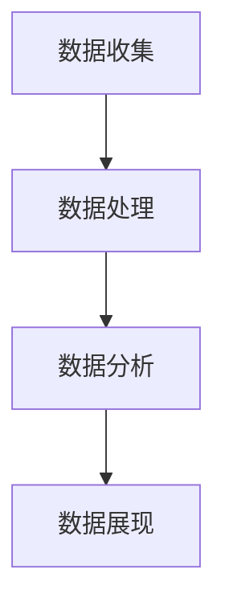

                 

# 数据可视化技术：从数据到洞察

> 关键词：数据可视化, 数据探索, 交互式可视化, 机器学习, 大数据, 商业智能

## 1. 背景介绍

### 1.1 问题由来
在当今数据驱动的世界中，信息量呈爆炸式增长，如何从海量数据中提炼有价值的洞察变得愈发重要。数据可视化作为数据分析的重要手段，通过图形化的呈现方式，帮助用户快速理解数据背后的信息，洞察数据背后的故事。它不仅是数据展现的必要工具，更是推动决策与创新思维的重要桥梁。然而，尽管数据可视化已广泛应用于各行各业，但实际应用中依然存在诸多挑战，如数据表达不直观、交互性差、技术门槛高等问题。本文旨在深入探讨数据可视化技术，从理论到实践，全面解读数据可视化的原理与实现，帮助开发者构建高效、易用的数据可视化系统。

### 1.2 问题核心关键点
本文将围绕以下几个关键点展开讨论：

1. **数据可视化原理**：从基础图形理论与心理学的角度解释数据可视化的工作机制。
2. **可视化设计与实现**：介绍常见的数据可视化设计原则、工具与技术栈。
3. **数据驱动可视化**：结合机器学习与数据挖掘技术，探索自动数据可视化的潜力。
4. **实际应用场景**：展示数据可视化在不同行业中的应用案例，强调其对商业决策的影响。
5. **未来发展趋势**：展望数据可视化的未来，探讨其与新兴技术如增强现实（AR）、虚拟现实（VR）的融合。

### 1.3 问题研究意义
数据可视化技术在推动数据驱动决策和提升数据驱动创新中扮演着关键角色。它不仅能够帮助企业从数据中挖掘出宝贵的洞察，还能支持决策者快速理解复杂的数据集，从而做出更明智的决策。因此，深入研究数据可视化技术，对于提升数据分析效率、促进数据驱动业务创新具有重要意义。

## 2. 核心概念与联系

### 2.1 核心概念概述

数据可视化（Data Visualization）是一种通过图形化的方式展现数据，帮助用户更好地理解和分析数据的技术。它通常包括数据的收集、处理、分析和展现等步骤。

- **收集**：获取原始数据，可以是结构化数据（如数据库中的表）或非结构化数据（如文本、图片等）。
- **处理**：对数据进行清洗、归一化、聚合等操作，确保数据的质量和一致性。
- **分析**：利用统计学、机器学习等方法，从数据中提取有价值的信息和规律。
- **展现**：通过图表、地图、仪表盘等形式，将分析结果可视化呈现给用户。

### 2.2 核心概念原理和架构的 Mermaid 流程图



这个流程图展示了数据可视化的一般流程：数据收集后，经过处理和分析，最终以可视化的形式展现给用户。

### 2.3 核心概念之间的联系

数据可视化技术不仅仅是一种数据展现的形式，更是一个数据驱动决策的桥梁。它连接了数据处理、分析和展现三个环节，确保数据能够以最直观、最有意义的方式传递给决策者，从而促进数据驱动的决策和创新。

## 3. 核心算法原理 & 具体操作步骤

### 3.1 算法原理概述

数据可视化的核心算法原理主要包括以下几个方面：

- **图形表示理论**：研究如何通过图形化的方式有效表示数据，包括但不限于点、线、面等基本图形元素的组合。
- **数据映射技术**：研究如何将数据映射到图形元素上，确保数据的准确性和一致性。
- **交互设计**：研究如何设计交互式界面，使用户能够通过互动探索数据，发现数据中的模式和规律。

### 3.2 算法步骤详解

数据可视化的操作步骤可以概括为以下几个步骤：

1. **数据预处理**：对原始数据进行清洗、转换和聚合，确保数据的质量和一致性。
2. **数据映射**：选择合适的映射函数将数据映射到图形元素上，如点的大小、颜色等。
3. **图形渲染**：将映射后的数据通过图形库（如D3.js、Highcharts等）渲染到画布上。
4. **交互设计**：为可视化的图形添加交互功能，如鼠标悬停提示、点击事件等。
5. **后处理优化**：对渲染后的图形进行后处理，如美化图形、优化性能等。

### 3.3 算法优缺点

数据可视化的优点主要包括：

- **直观性**：图形化的呈现方式能够直观地展示数据之间的关系和规律。
- **易理解性**：通过图形化的方式，复杂的数据能够以更易理解的形式展现给用户。
- **交互性**：用户可以通过交互式界面探索数据，发现数据中的模式和规律。

缺点包括：

- **技术门槛**：数据可视化需要一定的编程和图形设计技能，对初学者有一定挑战。
- **数据质量依赖**：数据可视化的结果依赖于原始数据的质量，数据不完整或不准确会影响可视化结果的可靠性。
- **易过载**：在处理大规模数据集时，图形复杂度增加，用户可能难以从中获得有价值的信息。

### 3.4 算法应用领域

数据可视化技术在多个领域得到了广泛应用，包括但不限于：

- **商业智能**：通过可视化仪表盘，帮助企业快速分析业务数据，支持决策。
- **医疗健康**：将患者数据可视化为图表，帮助医生诊断和治疗。
- **金融分析**：将金融数据可视化，帮助投资者分析市场趋势，制定投资策略。
- **科学研究**：将实验数据可视化，帮助科研人员发现规律，推进科研进展。
- **教育培训**：将学习数据可视化，帮助教师和学生更好地理解知识。

## 4. 数学模型和公式 & 详细讲解 & 举例说明

### 4.1 数学模型构建

数据可视化的数学模型通常包括以下几个方面：

- **图形元素表示**：将数据映射到图形元素上，如点、线、面等。
- **坐标系映射**：将数据映射到二维或三维坐标系上，以便于图形渲染。
- **颜色编码**：使用颜色表示数据的不同属性，如数据大小、数据类型等。

### 4.2 公式推导过程

以散点图为例，推导其数学模型：

设数据集为 $\{(x_i, y_i)\}_{i=1}^n$，其中 $x_i$ 和 $y_i$ 分别表示第 $i$ 个数据点的横坐标和纵坐标。散点图的数学模型可以表示为：

$$
f(x, y) = \begin{cases}
1 & \text{if } (x_i, y_i) \in \{(x_j, y_j)\}_{j=1}^n \\
0 & \text{otherwise}
\end{cases}
$$

其中，$(x_i, y_i)$ 表示第 $i$ 个数据点的坐标，$f(x, y)$ 表示该点在散点图中的值。

### 4.3 案例分析与讲解

以下是一个简单的例子，展示如何将数据映射到散点图上：

假设有一组数据集 $\{(1, 2), (3, 4), (5, 6), (7, 8), (9, 10)\}$，可以将其映射到二维坐标系上，得到以下散点图：

```
  +--------+ 
  | (1, 2)  | 
  |        | 
  +--------+ 
  | (3, 4)  | 
  |        | 
  +--------+ 
  | (5, 6)  | 
  |        | 
  +--------+ 
  | (7, 8)  | 
  |        | 
  +--------+ 
  | (9, 10) | 
  |        | 
  +--------+ 
```

在实际应用中，我们可以使用编程语言（如Python）和图形库（如Matplotlib）来实现上述数据映射过程。

## 5. 项目实践：代码实例和详细解释说明

### 5.1 开发环境搭建

以下是在Python中使用Matplotlib绘制散点图的步骤：

1. 安装Matplotlib库：

```bash
pip install matplotlib
```

2. 导入Matplotlib库：

```python
import matplotlib.pyplot as plt
```

3. 准备数据集：

```python
data = [(1, 2), (3, 4), (5, 6), (7, 8), (9, 10)]
```

### 5.2 源代码详细实现

以下是使用Matplotlib绘制散点图的Python代码：

```python
import matplotlib.pyplot as plt

# 准备数据集
data = [(1, 2), (3, 4), (5, 6), (7, 8), (9, 10)]

# 绘制散点图
plt.scatter(*zip(*data))

# 添加标题和标签
plt.title('Scatter Plot')
plt.xlabel('X')
plt.ylabel('Y')

# 显示图形
plt.show()
```

### 5.3 代码解读与分析

上述代码首先导入Matplotlib库，并准备了一个数据集。接着使用 `scatter` 函数绘制散点图，其中 `*zip(*data)` 将数据集中的坐标解包，使得 `scatter` 函数能够正确地绘制散点图。最后，使用 `title`、`xlabel` 和 `ylabel` 函数添加标题和标签，并使用 `show` 函数显示图形。

### 5.4 运行结果展示

运行上述代码后，会显示以下散点图：

```
  +--------+ 
  | (1, 2)  | 
  |        | 
  +--------+ 
  | (3, 4)  | 
  |        | 
  +--------+ 
  | (5, 6)  | 
  |        | 
  +--------+ 
  | (7, 8)  | 
  |        | 
  +--------+ 
  | (9, 10) | 
  |        | 
  +--------+ 
```

可以看到，数据点被正确地绘制在二维坐标系上，且图形中包含了标题和标签。

## 6. 实际应用场景

### 6.1 商业智能

在商业智能中，数据可视化是支持决策的关键工具。通过可视化的仪表盘和报表，企业可以迅速理解关键业务指标的变化趋势，及时调整经营策略。例如，销售数据分析仪表盘可以帮助企业监控销售额、客户流失率等关键指标，快速识别问题和机会。

### 6.2 医疗健康

在医疗健康领域，数据可视化可以帮助医生诊断和治疗患者。例如，患者病历的图表化呈现，可以帮助医生分析病情，制定治疗方案。同时，可视化图表还可以帮助患者更好地理解自己的健康状况和疾病发展过程。

### 6.3 金融分析

金融分析师经常使用数据可视化工具来分析市场趋势和投资组合。通过可视化图表，分析师可以直观地理解不同资产之间的关联性，预测市场变化，制定投资策略。

### 6.4 科学研究

在科学研究中，数据可视化可以帮助科研人员分析实验数据，发现规律，推进科研进展。例如，天文学家可以使用可视化工具分析天文图像，发现星系运动规律。

### 6.5 教育培训

在教育培训中，数据可视化可以帮助教师和学生更好地理解知识。例如，学习数据分析课程时，教师可以使用可视化图表展示数据分布和趋势，帮助学生理解复杂概念。

## 7. 工具和资源推荐

### 7.1 学习资源推荐

为了帮助开发者系统掌握数据可视化技术，以下是一些优质的学习资源：

1. **《数据可视化实战》**：这本书详细介绍了数据可视化的基本概念、工具和技术栈，适合初学者入门。
2. **Coursera数据可视化课程**：由斯坦福大学开设，包含数据可视化的理论和实践，适合进一步深入学习。
3. **Kaggle数据可视化竞赛**：通过实际数据集和竞赛任务，提升数据可视化的实战能力。

### 7.2 开发工具推荐

以下是在Python中使用Matplotlib和D3.js进行数据可视化的常用工具：

1. **Matplotlib**：Python中最常用的图形库，支持绘制各种类型的图表，如散点图、折线图、柱状图等。
2. **D3.js**：JavaScript中最流行的数据可视化库，支持交互式数据可视化，适用于Web应用程序。
3. **Tableau**：商业智能领域的领先数据可视化工具，支持多种数据源和图表类型，适合企业级应用。

### 7.3 相关论文推荐

数据可视化技术的发展离不开学界的研究。以下是几篇奠基性的相关论文，推荐阅读：

1. **《数据可视化：从概念到实践》**：探讨了数据可视化的基本概念、方法和应用，是数据可视化领域的经典之作。
2. **《交互式可视化：技术和应用》**：介绍了交互式可视化的技术和实现方法，适合深入学习。
3. **《自动数据可视化》**：探讨了机器学习和自动数据可视化的潜力，推动数据可视化技术的发展。

## 8. 总结：未来发展趋势与挑战

### 8.1 研究成果总结

本文从数据可视化的原理、设计与实现、数据驱动可视化、应用场景等方面全面解读了数据可视化技术。通过理论结合实践的深入探讨，帮助读者系统掌握数据可视化技术，提升数据驱动决策的能力。

### 8.2 未来发展趋势

展望未来，数据可视化技术将呈现以下几个发展趋势：

1. **交互性增强**：未来数据可视化将更加注重交互性，支持用户通过交互探索数据，发现数据中的模式和规律。
2. **自动数据可视化**：结合机器学习和数据挖掘技术，自动数据可视化将变得更加智能和高效。
3. **多模态可视化**：数据可视化将融合多模态数据，如文本、图像、音频等，支持更加全面和深入的数据分析。
4. **增强现实和虚拟现实**：AR和VR技术将与数据可视化结合，提供更加沉浸式的数据分析体验。

### 8.3 面临的挑战

尽管数据可视化技术在多个领域得到了广泛应用，但在实际应用中仍面临以下挑战：

1. **数据质量依赖**：数据可视化结果依赖于原始数据的质量，数据不完整或不准确会影响可视化结果的可靠性。
2. **技术门槛高**：数据可视化需要一定的编程和图形设计技能，对初学者有一定挑战。
3. **可视化效果不够直观**：部分数据可视化效果不够直观，难以帮助用户快速理解数据。

### 8.4 研究展望

未来，数据可视化技术需要在以下几个方面寻求新的突破：

1. **提升数据质量**：通过数据清洗、预处理等技术手段，提升原始数据的质量，确保数据可视化的可靠性。
2. **降低技术门槛**：开发易于使用的可视化工具和库，降低数据可视化的技术门槛，提升易用性。
3. **增强可视化效果**：研究和探索更加直观、易理解的数据可视化方法，提升用户对数据的理解能力。

## 9. 附录：常见问题与解答

**Q1：什么是数据可视化？**

A: 数据可视化是一种通过图形化的方式展现数据，帮助用户更好地理解和分析数据的技术。

**Q2：数据可视化有哪些基本类型？**

A: 常见的数据可视化类型包括散点图、折线图、柱状图、饼图等。每种图表都有其适用的场景和特点，需要根据具体的数据类型和分析目的选择。

**Q3：如何选择适合的数据可视化工具？**

A: 选择数据可视化工具时，需要考虑以下几个方面：工具的功能和易用性、数据源的支持、可视化效果的直观性等。常用的工具包括Matplotlib、D3.js、Tableau等。

**Q4：数据可视化在商业智能中的应用有哪些？**

A: 数据可视化在商业智能中的应用包括销售数据分析、客户流失率分析、市场趋势分析等，帮助企业快速理解关键业务指标的变化趋势，及时调整经营策略。

---

作者：禅与计算机程序设计艺术 / Zen and the Art of Computer Programming

