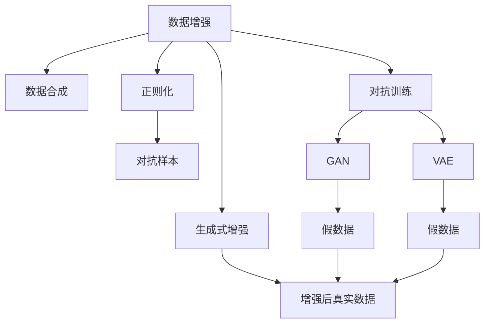

                 

# 数据增强与数据合成原理与代码实战案例讲解

## 1. 背景介绍

### 1.1 问题由来
在机器学习和深度学习领域，数据增强(data augmentation)和数据合成(data synthesis)技术逐渐成为模型泛化能力提升的重要手段。尤其是在图像、自然语言处理等复杂领域，数据增强能够扩充训练集多样性，避免模型过拟合，提升模型在新场景下的泛化性能。数据合成则通过生成新的数据，进一步增加训练数据量，从而提升模型学习效果。

当前，数据增强和数据合成技术在图像分类、目标检测、文本分类、机器翻译、语音识别等众多领域得到了广泛应用，并带来了显著的性能提升。例如，通过随机裁剪、翻转、旋转、噪声添加等操作，数据增强能够在保持图像特征不变的情况下，丰富模型对不同角度、尺度、光照等场景的感知能力。数据合成如GAN、VAE等生成模型，则能够合成高保真度的假数据，弥补真实数据稀缺或难以获取的短板。

### 1.2 问题核心关键点
数据增强和数据合成技术的核心在于如何通过一系列的图像/文本/信号变换，生成新的数据样本，并将其与真实数据结合训练。这种技术不仅提高了模型的泛化能力，还可以缓解数据不平衡问题，加速模型训练进程。

具体来说，核心关键点包括：
- 图像变换操作：如随机裁剪、翻转、旋转、缩放、色彩调整等，适用于图像处理任务。
- 文本生成操作：如同义词替换、随机插入、回译等，适用于文本分类和生成任务。
- 信号处理操作：如混响、失真、滤波等，适用于语音、音频信号处理任务。
- 数据合成技术：如GAN、VAE等生成模型，通过对抗训练、变分推断等机制，合成高保真度的假数据。

这些关键点构成了数据增强和数据合成技术的理论基础和实现手段，使得模型能够在更丰富、更广泛的数据分布上进行训练，提升模型性能。

### 1.3 问题研究意义
数据增强和数据合成技术在提高模型泛化能力、缓解数据稀缺问题、加速模型训练等方面具有重要意义：

1. 提升模型泛化能力。通过增加数据多样性，模型能够学习到更全面的特征，增强对未知数据的适应性。
2. 缓解数据不平衡。对于数据量较少的一类样本，数据增强可以显著提升其在新数据集中的代表性，避免模型偏向少数类。
3. 加速模型训练。通过生成更多训练样本，模型可以在更短的训练周期内达到收敛，提高训练效率。
4. 避免过拟合。数据增强能够在保持模型预测能力不变的情况下，丰富模型对数据分布的认知，降低过拟合风险。
5. 提升模型效果。数据增强和数据合成能够丰富模型的训练样本，提升模型的准确率和鲁棒性。

## 2. 核心概念与联系

### 2.1 核心概念概述

为更好地理解数据增强和数据合成技术的核心原理和实现方法，本节将介绍几个密切相关的核心概念：

- 数据增强(Data Augmentation)：通过一系列图像/文本/信号变换，生成新的数据样本，用于增加训练集的多样性，提高模型泛化能力。
- 数据合成(Data Synthesis)：通过生成模型如GAN、VAE等，生成新的数据样本，补充真实数据的不足。
- 正则化(Regularization)：通过加入正则项，如L1、L2正则、Dropout等，避免模型过拟合，提升模型泛化能力。
- 对抗训练(Adversarial Training)：通过生成对抗样本来提高模型的鲁棒性，增强模型对噪声和攻击的抵抗能力。
- 生成对抗网络(GAN)：一种通过对抗训练方式生成新数据的生成模型，能够产生与真实数据难以区分的假数据。
- 变分自编码器(VAE)：一种通过变分推断方式生成新数据的生成模型，能够生成多样性较高、保真度较高的假数据。

这些核心概念之间的逻辑关系可以通过以下Mermaid流程图来展示：



这个流程图展示了大数据增强和数据合成技术的主要组成部分及其相互关系：

1. 数据增强和数据合成是互补的技术手段，用于提升模型泛化能力和数据多样性。
2. 正则化和对抗训练进一步增强模型的鲁棒性和泛化能力。
3. 生成式增强利用生成模型进行数据合成，扩充训练集。
4. 增强后的真实数据和生成数据相结合，形成多样化的训练样本。

这些核心概念共同构成了数据增强和数据合成技术的理论基础和实现手段，使得模型能够在更丰富、更广泛的数据分布上进行训练，提升模型性能。

## 3. 核心算法原理 & 具体操作步骤

### 3.1 算法原理概述

数据增强和数据合成技术的核心原理是通过一系列的变换操作，生成新的数据样本，增加训练集的多样性。其核心思想是：通过不断扰动和变化，让模型学习到更多种类的数据分布，从而提升模型的泛化能力。

以图像增强为例，常用的变换操作包括随机裁剪、翻转、旋转、缩放、色彩调整等。这些操作可以在保持图像内容不变的情况下，改变图像的尺寸、角度、光照等特征，丰富模型的视觉感知能力。对于文本和信号处理，可以通过类似的方式进行变换，如随机替换、插入、删减等。

对于数据合成，GAN和VAE等生成模型通过对抗训练和变分推断等方式，生成与真实数据难以区分的假数据。GAN通过生成器和判别器之间的对抗训练，生成高保真度的假数据。VAE通过变分推断，生成多样性较高的假数据。

### 3.2 算法步骤详解

数据增强和数据合成技术的具体操作步骤如下：

#### 3.2.1 数据增强步骤

1. 收集训练集和验证集：收集大量标注数据，划分为训练集和验证集。
2. 设计增强操作：根据任务特点，选择合适的增强操作。例如，图像增强可以采用随机裁剪、翻转、旋转等。
3. 应用增强操作：对训练集数据应用增强操作，生成新的数据样本。
4. 训练模型：使用增强后的训练集和验证集训练模型，同时监控验证集性能。
5. 模型评估：在测试集上评估模型的泛化性能，确保增强效果。

#### 3.2.2 数据合成步骤

1. 准备生成模型：选择合适的生成模型，如GAN、VAE等。
2. 设计损失函数：根据任务特点，设计生成模型的损失函数。例如，对于图像生成，可以使用生成器的损失和判别器的损失。
3. 训练生成模型：使用生成模型训练数据，生成新的数据样本。
4. 数据融合：将生成数据与真实数据混合，形成扩充后的训练集。
5. 模型训练：使用扩充后的训练集和验证集训练模型，同时监控验证集性能。
6. 模型评估：在测试集上评估模型的泛化性能，确保合成效果。

### 3.3 算法优缺点

数据增强和数据合成技术具有以下优点：
1. 提高模型泛化能力：通过增加数据多样性，模型能够学习到更全面的特征，增强对未知数据的适应性。
2. 缓解数据不平衡：对于数据量较少的一类样本，数据增强可以显著提升其在新数据集中的代表性，避免模型偏向少数类。
3. 加速模型训练：通过生成更多训练样本，模型可以在更短的训练周期内达到收敛，提高训练效率。
4. 避免过拟合：数据增强能够在保持模型预测能力不变的情况下，丰富模型对数据分布的认知，降低过拟合风险。

同时，这些技术也存在一定的局限性：
1. 生成数据质量：生成数据的质量对模型性能有很大影响，低质量的假数据可能导致模型学习到错误的模式。
2. 计算资源消耗：数据增强和数据合成需要大量的计算资源，尤其是在大规模数据集上。
3. 数据分布差异：生成数据可能与真实数据分布存在差异，对模型泛化能力有一定影响。
4. 策略设计复杂：增强策略和生成策略的设计需要丰富的领域知识，对于复杂任务可能存在较大挑战。

尽管存在这些局限性，但数据增强和数据合成技术依然是模型训练中不可或缺的一部分，尤其在大数据集和复杂任务中。

### 3.4 算法应用领域

数据增强和数据合成技术在NLP、CV、信号处理等多个领域得到了广泛应用，具体包括：

- 图像分类：通过随机裁剪、旋转、翻转等操作，增加图像样本多样性。
- 目标检测：通过生成对抗样本，提升模型对小目标的检测能力。
- 文本分类：通过同义词替换、随机插入等操作，增加文本样本多样性。
- 机器翻译：通过文本回译、句子改写等操作，生成更多训练样本。
- 语音识别：通过混响、噪声添加等操作，生成多样化的语音样本。
- 生成对抗网络：通过对抗训练，生成高保真度的假数据，应用于生成式推理、游戏AI等领域。

除了这些经典应用外，数据增强和数据合成技术还被创新性地应用到更多场景中，如数据清洗、数据修复、数据增强生成对抗网络等，为大数据分析、图像生成、音频处理等领域带来了新的突破。

## 4. 数学模型和公式 & 详细讲解  
### 4.1 数学模型构建

本节将使用数学语言对数据增强和数据合成技术的数学原理进行更加严格的刻画。

假设训练集为 $\mathcal{X}$，其中 $\mathcal{X}=\{x_i\}_{i=1}^N$，每个样本 $x_i$ 为向量形式，即 $x_i \in \mathbb{R}^d$。对于图像增强，假设有 $K$ 种不同的增强操作 $T_k$，增强操作可以表示为线性变换 $T_k(x_i)=\mathbf{A}_k x_i+b_k$，其中 $\mathbf{A}_k \in \mathbb{R}^{d \times d}$ 为变换矩阵，$b_k \in \mathbb{R}^d$ 为偏移量。数据增强的数学模型可以表示为：

$$
\mathcal{X}_{aug}=\{x_{i,1}, x_{i,2}, ..., x_{i,K}\} = \{T_k(x_i) \mid k=1,...,K\}
$$

数据合成模型的构建则更加复杂。以GAN为例，假设生成器模型为 $G_{\theta}$，判别器模型为 $D_{\phi}$，则生成器和判别器的损失函数分别为：

$$
L_G = E_{\mathcal{X}}[\log D_{\phi}(G_{\theta}(z))] + \lambda E_{\mathcal{Z}}[\|\mathcal{X} - G_{\theta}(z)\|^2]
$$

$$
L_D = E_{\mathcal{X}}[\log D_{\phi}(\mathcal{X})] + E_{\mathcal{Z}}[\log(1 - D_{\phi}(G_{\theta}(z)))
$$

其中 $\mathcal{Z}$ 为随机噪声分布，$z \sim \mathcal{Z}$ 为生成的随机向量，$\lambda$ 为生成器损失的权重。

### 4.2 公式推导过程

以下我们以图像增强为例，推导增强操作的数学表示及其在训练集上的应用。

假设图像增强操作 $T_k(x)$ 为一个线性变换，表示为 $\mathbf{A}_k x+b_k$，其中 $\mathbf{A}_k \in \mathbb{R}^{d \times d}$ 为变换矩阵，$b_k \in \mathbb{R}^d$ 为偏移量。对于原始图像 $x_i$，增强操作可以表示为：

$$
x_{i,k} = \mathbf{A}_k x_i + b_k
$$

增强后的图像集合 $\mathcal{X}_{aug}$ 可以表示为：

$$
\mathcal{X}_{aug} = \{\mathbf{A}_1 x_i + b_1, \mathbf{A}_2 x_i + b_2, ..., \mathbf{A}_K x_i + b_K\}
$$

在训练模型时，将原始数据 $\mathcal{X}$ 和增强后的数据 $\mathcal{X}_{aug}$ 结合起来，用于训练模型。模型的损失函数可以表示为：

$$
\mathcal{L} = \frac{1}{N} \sum_{i=1}^N \sum_{k=1}^K \ell(f(\mathbf{A}_k x_i + b_k), y_i)
$$

其中 $f$ 为模型函数，$y_i$ 为真实标签。

对于数据合成，GAN模型的训练过程则更加复杂。在训练过程中，生成器和判别器交替进行，生成器 $G$ 的目标是生成逼真的假数据，判别器 $D$ 的目标是区分真实数据和假数据。训练过程可以表示为：

1. 固定判别器 $D$，最小化生成器的损失函数 $L_G$，使生成器 $G$ 生成逼真的假数据。
2. 固定生成器 $G$，最小化判别器的损失函数 $L_D$，使判别器 $D$ 能够区分真实数据和假数据。
3. 交替进行以上两步，直到模型收敛。

### 4.3 案例分析与讲解

以图像分类任务为例，数据增强可以采用随机裁剪、旋转、翻转等操作。具体实现流程如下：

1. 数据准备：收集图像数据集，划分为训练集和验证集。
2. 增强操作设计：选择合适的增强操作，如随机裁剪、旋转、翻转等。
3. 增强操作应用：对训练集图像应用增强操作，生成新的图像样本。
4. 模型训练：使用增强后的训练集和验证集训练模型，同时监控验证集性能。
5. 模型评估：在测试集上评估模型的泛化性能，确保增强效果。

以下是一个简单的Python实现：

```python
from PIL import Image
import numpy as np
import random

def random_crop(img, size):
    w, h = img.size
    x = random.randint(0, w - size[0])
    y = random.randint(0, h - size[1])
    return img.crop((x, y, x+size[0], y+size[1]))

def random_rotate(img, degrees):
    w, h = img.size
    rot_angle = random.uniform(-degrees, degrees)
    new_w, new_h = int(np.round(w * np.cos(rot_angle))), int(np.round(h * np.cos(rot_angle)))
    img = img.resize((new_w, new_h))
    img = img.rotate(rot_angle, resample=Image.NEAREST)
    return img

def random_flip(img):
    return img.transpose(Image.FLIP_LEFT_RIGHT)

def data_augmentation(img, size, degrees):
    img = random_crop(img, size)
    img = random_rotate(img, degrees)
    img = random_flip(img)
    return np.array(img)

# 图像增强
augmented_images = []
for img in images:
    augmented_img = data_augmentation(img, size=(256, 256), degrees=45)
    augmented_images.append(augmented_img)
```

以上是图像增强的Python实现示例。可以看到，数据增强操作通过PIL库和NumPy库实现，对图像进行随机裁剪、旋转和翻转，生成新的图像样本。

## 5. 项目实践：代码实例和详细解释说明

### 5.1 开发环境搭建

在进行数据增强和数据合成实践前，我们需要准备好开发环境。以下是使用Python进行TensorFlow和Keras开发的环境配置流程：

1. 安装Anaconda：从官网下载并安装Anaconda，用于创建独立的Python环境。

2. 创建并激活虚拟环境：
```bash
conda create -n tf-env python=3.8 
conda activate tf-env
```

3. 安装TensorFlow：根据CUDA版本，从官网获取对应的安装命令。例如：
```bash
conda install tensorflow=2.6 -c tf
```

4. 安装Keras：
```bash
pip install keras
```

5. 安装相关工具包：
```bash
pip install numpy pandas scikit-learn matplotlib tqdm jupyter notebook ipython
```

完成上述步骤后，即可在`tf-env`环境中开始数据增强和数据合成实践。

### 5.2 源代码详细实现

下面我们以图像分类任务为例，给出使用TensorFlow和Keras对图像进行数据增强的PyTorch代码实现。

首先，定义图像增强函数：

```python
from tensorflow.keras.preprocessing.image import ImageDataGenerator

def data_augmentation(x_train):
    datagen = ImageDataGenerator(
        rotation_range=45,
        width_shift_range=0.1,
        height_shift_range=0.1,
        horizontal_flip=True,
        vertical_flip=True
    )
    return datagen.flow(x_train, batch_size=32, shuffle=True)
```

然后，定义模型和训练函数：

```python
from tensorflow.keras import layers, models
from tensorflow.keras.datasets import mnist
from tensorflow.keras.utils import to_categorical

# 加载MNIST数据集
(x_train, y_train), (x_test, y_test) = mnist.load_data()

# 数据预处理
x_train = x_train.reshape(-1, 28, 28, 1).astype('float32') / 255.0
x_test = x_test.reshape(-1, 28, 28, 1).astype('float32') / 255.0

y_train = to_categorical(y_train, num_classes=10)
y_test = to_categorical(y_test, num_classes=10)

# 定义模型
model = models.Sequential([
    layers.Conv2D(32, (3, 3), activation='relu', input_shape=(28, 28, 1)),
    layers.MaxPooling2D((2, 2)),
    layers.Conv2D(64, (3, 3), activation='relu'),
    layers.MaxPooling2D((2, 2)),
    layers.Flatten(),
    layers.Dense(128, activation='relu'),
    layers.Dense(10, activation='softmax')
])

# 编译模型
model.compile(optimizer='adam', loss='categorical_crossentropy', metrics=['accuracy'])

# 数据增强
train_generator = data_augmentation(x_train)

# 训练模型
model.fit(train_generator, epochs=10, validation_data=(x_test, y_test))
```

最后，启动训练流程并在测试集上评估：

```python
epochs = 10
batch_size = 32

for epoch in range(epochs):
    train_loss, train_acc = model.train_on_batch(train_generator, steps_per_epoch=50)
    test_loss, test_acc = model.evaluate(x_test, y_test, batch_size=batch_size)
    print(f'Epoch {epoch+1}, train loss: {train_loss:.4f}, train acc: {train_acc:.4f}, test loss: {test_loss:.4f}, test acc: {test_acc:.4f}')
```

以上就是使用TensorFlow和Keras对图像分类任务进行数据增强的完整代码实现。可以看到，得益于Keras的强大封装，我们可以用相对简洁的代码完成图像增强的训练。

### 5.3 代码解读与分析

让我们再详细解读一下关键代码的实现细节：

**ImageDataGenerator类**：
- `ImageDataGenerator`类：用于对图像数据进行数据增强。
- `rotation_range`：随机旋转的角度范围。
- `width_shift_range`：随机水平方向平移的范围。
- `height_shift_range`：随机竖直方向平移的范围。
- `horizontal_flip`：随机水平翻转。
- `vertical_flip`：随机竖直翻转。

**数据增强函数**：
- 定义了一个`data_augmentation`函数，使用`ImageDataGenerator`类对图像进行增强。
- `flow`方法用于生成增强后的图像批。

**模型定义**：
- 定义了一个简单的卷积神经网络模型，用于图像分类。
- `Sequential`类用于堆叠网络层。
- `Conv2D`层用于卷积操作，`MaxPooling2D`层用于池化操作，`Flatten`层用于将二维特征图展开为一维向量。

**模型训练**：
- 使用`fit`方法对模型进行训练。
- `train_on_batch`方法用于在增强后的训练数据上训练模型。
- `evaluate`方法用于在测试集上评估模型性能。

可以看到，Keras的`ImageDataGenerator`类为数据增强提供了强大的封装支持，使我们能够轻松实现各种图像增强操作。同时，Keras的`Sequential`类和`fit`方法也简化了模型的定义和训练过程。

当然，工业级的系统实现还需考虑更多因素，如模型的保存和部署、超参数的自动搜索、更灵活的任务适配层等。但核心的数据增强和数据合成范式基本与此类似。

## 6. 实际应用场景

### 6.1 智能客服系统

基于数据增强和数据合成技术，智能客服系统可以更加准确地理解和处理用户输入。通过模拟不同的输入场景，增强客服系统的泛化能力，提升对不同口音、语言风格、输入格式的适应性。

在技术实现上，可以收集客服中心的历史对话记录，将问题-回答对作为训练样本，使用数据增强生成更多对话数据。同时，使用生成模型生成模拟对话，增加训练集的多样性，提升模型预测能力。如此构建的智能客服系统，能够更好地理解和响应用户，提供更加个性化和高效的服务。

### 6.2 金融舆情监测

金融领域需要实时监测市场舆论动向，以便及时应对负面信息传播，规避金融风险。通过数据增强和数据合成技术，金融舆情监测系统可以更加全面地监测网络舆情，捕捉不同角度和视角的信息，提升系统鲁棒性和泛化能力。

具体而言，可以收集金融领域相关的新闻、报道、评论等文本数据，并对其进行主题标注和情感标注。在此基础上对预训练语言模型进行微调，使得模型能够自动判断文本属于何种主题，情感倾向是正面、中性还是负面。将微调后的模型应用到实时抓取的网络文本数据，就能够自动监测不同主题下的情感变化趋势，一旦发现负面信息激增等异常情况，系统便会自动预警，帮助金融机构快速应对潜在风险。

### 6.3 个性化推荐系统

当前的推荐系统往往只依赖用户的历史行为数据进行物品推荐，难以深入理解用户的真实兴趣偏好。基于数据增强和数据合成技术，个性化推荐系统可以更好地挖掘用户行为背后的语义信息，从而提供更精准、多样的推荐内容。

在实践中，可以收集用户浏览、点击、评论、分享等行为数据，提取和用户交互的物品标题、描述、标签等文本内容。将文本内容作为模型输入，用户的后续行为（如是否点击、购买等）作为监督信号，在此基础上微调预训练语言模型。微调后的模型能够从文本内容中准确把握用户的兴趣点。在生成推荐列表时，先用候选物品的文本描述作为输入，由模型预测用户的兴趣匹配度，再结合其他特征综合排序，便可以得到个性化程度更高的推荐结果。

### 6.4 未来应用展望

随着数据增强和数据合成技术的发展，未来在大数据集和复杂任务中的应用将更加广泛。

在智慧医疗领域，基于数据增强和数据合成技术的医疗问答、病历分析、药物研发等应用将提升医疗服务的智能化水平，辅助医生诊疗，加速新药开发进程。

在智能教育领域，数据增强和数据合成技术可应用于作业批改、学情分析、知识推荐等方面，因材施教，促进教育公平，提高教学质量。

在智慧城市治理中，数据增强和数据合成技术可用于城市事件监测、舆情分析、应急指挥等环节，提高城市管理的自动化和智能化水平，构建更安全、高效的未来城市。

此外，在企业生产、社会治理、文娱传媒等众多领域，数据增强和数据合成技术也将不断涌现，为传统行业数字化转型升级提供新的技术路径。相信随着技术的日益成熟，数据增强和数据合成技术将成为智能系统构建的重要手段，推动人工智能技术的全面落地。

## 7. 工具和资源推荐
### 7.1 学习资源推荐

为了帮助开发者系统掌握数据增强和数据合成技术的理论基础和实践技巧，这里推荐一些优质的学习资源：

1. 《深度学习入门：基于TensorFlow的理论与实现》系列博文：由深度学习专家撰写，系统介绍了TensorFlow和Keras的基本原理和应用，涵盖数据增强、模型训练等关键技术。

2. CS231n《卷积神经网络》课程：斯坦福大学开设的计算机视觉明星课程，有Lecture视频和配套作业，带你入门深度学习在计算机视觉领域的应用。

3. 《深度学习与TensorFlow实战》书籍：讲解深度学习的基本原理和TensorFlow的实战应用，包括数据增强、模型训练等关键技术。

4. Keras官方文档：Keras的官方文档，提供了丰富的API示例和详细介绍，是上手实践的必备资料。

5. TensorFlow官方文档：TensorFlow的官方文档，涵盖模型构建、数据增强、模型训练等关键技术。

通过对这些资源的学习实践，相信你一定能够快速掌握数据增强和数据合成技术的精髓，并用于解决实际的NLP问题。
###  7.2 开发工具推荐

高效的开发离不开优秀的工具支持。以下是几款用于数据增强和数据合成开发的常用工具：

1. TensorFlow：基于Python的开源深度学习框架，灵活动态的计算图，适合快速迭代研究。支持TensorFlow和Keras。

2. PyTorch：基于Python的开源深度学习框架，灵活的动态计算图，适合快速迭代研究。支持PyTorch和Keras。

3. Keras：基于Python的高层次神经网络API，支持TensorFlow、Theano、CNTK等多种后端，易于上手和调试。

4. OpenAI Gym：一个开源环境库，支持多任务学习和强化学习等，提供了丰富的环境接口，方便进行模型测试和优化。

5. Scikit-learn：Python的机器学习库，提供了丰富的数据预处理、模型评估、特征工程等功能，方便进行模型训练和调试。

6. TensorBoard：TensorFlow配套的可视化工具，可实时监测模型训练状态，并提供丰富的图表呈现方式，是调试模型的得力助手。

合理利用这些工具，可以显著提升数据增强和数据合成任务的开发效率，加快创新迭代的步伐。

### 7.3 相关论文推荐

数据增强和数据合成技术的发展源于学界的持续研究。以下是几篇奠基性的相关论文，推荐阅读：

1. Data Augmentation for Generalization（即基于数据增强的一般化研究）：提出了数据增强能够提升模型泛化能力的理论基础。

2. Cascaded Denoising Autoencoders in Visual Domain（即基于自动编码器的图像去噪研究）：提出使用自动编码器进行图像增强的方法，在保持图像内容不变的情况下，提升图像质量。

3. Learning to Augment Image with Adversarial Networks（即基于对抗网络的图像增强研究）：提出使用GAN生成对抗样本来进行图像增强，能够生成更加多样化的假数据。

4. Improving Generalization with Adversarial Data Augmentation（即基于对抗数据增强的一般化研究）：提出使用对抗数据增强提升模型泛化能力的方法。

5. VGG Image Annotator（即基于深度学习的数据标注工具）：提供了一个可视化工具，用于快速生成标注数据和数据增强操作。

这些论文代表了大数据增强和数据合成技术的发展脉络。通过学习这些前沿成果，可以帮助研究者把握学科前进方向，激发更多的创新灵感。

## 8. 总结：未来发展趋势与挑战

### 8.1 总结

本文对数据增强和数据合成技术的理论基础和实现方法进行了全面系统的介绍。首先阐述了数据增强和数据合成技术的核心原理和应用背景，明确了其在提升模型泛化能力、缓解数据稀缺问题、加速模型训练等方面的重要作用。其次，从原理到实践，详细讲解了数据增强和数据合成技术的数学原理和关键步骤，给出了数据增强和数据合成任务的完整代码实现。同时，本文还广泛探讨了数据增强和数据合成技术在智能客服、金融舆情、个性化推荐等多个行业领域的应用前景，展示了其广阔的应用前景。

通过本文的系统梳理，可以看到，数据增强和数据合成技术正在成为NLP领域的重要范式，极大地拓展了预训练语言模型的应用边界，催生了更多的落地场景。得益于大规模语料的预训练，数据增强和数据合成技术能够在更丰富、更广泛的数据分布上进行训练，提升模型性能。未来，伴随预训练语言模型和微调方法的持续演进，相信NLP技术将在更广阔的应用领域大放异彩，深刻影响人类的生产生活方式。

### 8.2 未来发展趋势

展望未来，数据增强和数据合成技术将呈现以下几个发展趋势：

1. 多模态增强技术：数据增强和数据合成将从单一模态（如图像、文本、音频）扩展到多模态增强技术，如视频增强、语音增强等。多模态增强将提升模型的跨模态学习和泛化能力，为多模态智能应用提供新的技术手段。

2. 自适应增强技术：数据增强和数据合成技术将变得更加智能，能够根据任务特点自适应地选择增强策略。例如，对于图像分类任务，可以通过检测图像中的特定对象，增加类似对象的增强样本。

3. 无监督增强技术：未来将探索更多无监督增强方法，通过无监督学习，从无标签数据中自动生成增强样本，降低对标注数据的依赖。例如，利用GAN生成与真实数据分布相似的数据，不需要额外的标签。

4. 生成对抗增强技术：生成对抗网络（GAN）和变分自编码器（VAE）等生成模型将更加成熟，能够生成更加多样、高质量的假数据，应用于更多领域。

5. 联合训练技术：数据增强和数据合成将与其他训练技术（如迁移学习、微调等）相结合，实现联合训练，提升模型效果。例如，通过迁移学习引入领域知识，再使用数据增强进行细粒度微调。

6. 超分辨率增强技术：利用生成模型进行超分辨率增强，将低分辨率的输入图像转换为高分辨率图像，增加模型训练数据的多样性，提升模型性能。

以上趋势凸显了数据增强和数据合成技术的广阔前景。这些方向的探索发展，必将进一步提升NLP系统的性能和应用范围，为人类认知智能的进化带来深远影响。

### 8.3 面临的挑战

尽管数据增强和数据合成技术已经取得了瞩目成就，但在迈向更加智能化、普适化应用的过程中，它仍面临着诸多挑战：

1. 计算资源消耗：数据增强和数据合成需要大量的计算资源，尤其是在大规模数据集上。如何优化算法和硬件，降低计算成本，是未来需要解决的问题。

2. 数据质量控制：生成数据的保真度和多样性对模型性能有很大影响，低质量的假数据可能导致模型学习到错误的模式。如何提高生成数据的质量，降低生成数据的噪声，是未来需要探索的方向。

3. 数据分布差异：生成数据可能与真实数据分布存在差异，对模型泛化能力有一定影响。如何提升生成数据的代表性，减少生成数据的分布偏差，是未来需要关注的重点。

4. 策略设计复杂：增强策略和生成策略的设计需要丰富的领域知识，对于复杂任务可能存在较大挑战。如何设计更智能、更灵活的增强策略，是未来需要突破的方向。

尽管存在这些挑战，但数据增强和数据合成技术依然是模型训练中不可或缺的一部分，尤其在大数据集和复杂任务中。

### 8.4 研究展望

面对数据增强和数据合成技术所面临的种种挑战，未来的研究需要在以下几个方面寻求新的突破：

1. 探索无监督和半监督增强方法：摆脱对大规模标注数据的依赖，利用自监督学习、主动学习等无监督和半监督范式，最大限度利用非结构化数据，实现更加灵活高效的增强。

2. 研究参数高效和计算高效的增强范式：开发更加参数高效的增强方法，在固定大部分预训练参数的同时，只更新极少量的任务相关参数。同时优化增强模型的计算图，减少前向传播和反向传播的资源消耗，实现更加轻量级、实时性的部署。

3. 引入更多先验知识：将符号化的先验知识，如知识图谱、逻辑规则等，与神经网络模型进行巧妙融合，引导增强过程学习更准确、合理的语言模型。同时加强不同模态数据的整合，实现视觉、语音等多模态信息与文本信息的协同建模。

4. 结合因果分析和博弈论工具：将因果分析方法引入增强模型，识别出模型决策的关键特征，增强输出解释的因果性和逻辑性。借助博弈论工具刻画人机交互过程，主动探索并规避模型的脆弱点，提高系统稳定性。

5. 纳入伦理道德约束：在模型训练目标中引入伦理导向的评估指标，过滤和惩罚有偏见、有害的输出倾向。同时加强人工干预和审核，建立模型行为的监管机制，确保输出符合人类价值观和伦理道德。

这些研究方向的探索，必将引领数据增强和数据合成技术迈向更高的台阶，为构建安全、可靠、可解释、可控的智能系统铺平道路。面向未来，数据增强和数据合成技术还需要与其他人工智能技术进行更深入的融合，如知识表示、因果推理、强化学习等，多路径协同发力，共同推动自然语言理解和智能交互系统的进步。只有勇于创新、敢于突破，才能不断拓展语言模型的边界，让智能技术更好地造福人类社会。

## 9. 附录：常见问题与解答

**Q1：数据增强和数据合成技术是否适用于所有NLP任务？**

A: 数据增强和数据合成技术在大多数NLP任务上都能取得不错的效果，特别是对于数据量较小的任务。但对于一些特定领域的任务，如医学、法律等，仅仅依靠通用语料预训练的模型可能难以很好地适应。此时需要在特定领域语料上进一步预训练，再进行增强，才能获得理想效果。

**Q2：如何选择数据增强和数据合成操作？**

A: 选择数据增强和数据合成操作需要考虑任务特点和数据分布。例如，对于图像分类任务，常用的操作包括随机裁剪、旋转、翻转等。对于文本分类任务，常用的操作包括同义词替换、随机插入、回译等。对于信号处理任务，常用的操作包括混响、失真、滤波等。

**Q3：数据增强和数据合成如何提高模型泛化能力？**

A: 数据增强和数据合成技术通过增加数据多样性，使模型能够学习到更全面的特征，增强对未知数据的适应性。具体来说，通过随机变换数据，生成更多的训练样本，模型能够在更广泛的数据分布上进行训练，提升泛化能力。

**Q4：数据增强和数据合成在实际应用中需要注意哪些问题？**

A: 数据增强和数据合成在实际应用中需要注意以下问题：
1. 计算资源消耗：数据增强和数据合成需要大量的计算资源，尤其是在大规模数据集上。
2. 数据质量控制：生成数据的保真度和多样性对模型性能有很大影响，低质量的假数据可能导致模型学习到错误的模式。
3. 数据分布差异：生成数据可能与真实数据分布存在差异，对模型泛化能力有一定影响。
4. 策略设计复杂：增强策略和生成策略的设计需要丰富的领域知识，对于复杂任务可能存在较大挑战。

这些因素需要开发者在实际应用中综合考虑，以达到最优效果。

**Q5：数据增强和数据合成是否会降低模型性能？**

A: 数据增强和数据合成技术在提高模型泛化能力的同时，也存在一定的风险。例如，生成数据的质量可能低于真实数据，低质量的假数据可能导致模型学习到错误的模式，反而降低模型性能。因此，数据增强和数据合成需要在模型设计时进行细致的策略设计，同时监控生成数据的质量，确保增强效果。

---

作者：禅与计算机程序设计艺术 / Zen and the Art of Computer Programming

