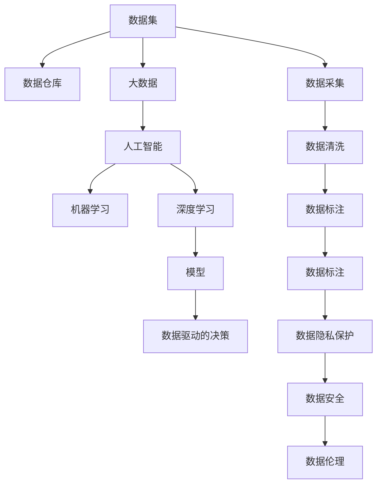

                 

## 1. 背景介绍

### 1.1 问题由来

数据，已经成为当今信息时代最宝贵的资源之一。无论是在科学研究、商业决策、医疗健康、交通运输还是教育培训等领域，数据都扮演着至关重要的角色。随着数字化转型进程的加速，数据对于塑造我们的生活和工作方式的影响日益加深。

数据驱动的决策和自动化，正逐渐渗透到社会的各个层面，改变着人们的行为习惯和思维模式。但是，数据也带来了诸多挑战，如隐私保护、数据质量、数据安全等问题。如何更好地利用数据，规避其风险，成为了我们必须面对的问题。

### 1.2 问题核心关键点

1. **数据重要性**：数据是支撑决策和创新的基础，数据的获取、处理和应用能力，决定了组织和个人在信息化时代的竞争优势。
2. **数据质量**：高质量的数据是数据驱动决策的基石，数据的准确性、完整性、一致性和及时性直接影响分析结果的可靠性。
3. **数据隐私**：数据在带来便利的同时，也引发了隐私保护问题，如何在利用数据的同时保护个人隐私，是数据管理中的重要课题。
4. **数据安全**：随着数据量的增长，数据泄露和滥用的风险也在增加，数据安全措施的完善是保障数据资源不被滥用的必要手段。
5. **数据伦理**：数据的使用涉及伦理问题，如数据偏见、数据滥用等，如何在技术上和伦理上处理这些问题，是数据管理和应用中需要深入探讨的课题。

### 1.3 问题研究意义

研究数据未来发展的趋势和影响，对于理解数据在社会中的应用、挑战以及如何更好地利用数据，具有重要意义：

1. **提升决策质量**：高质量的数据分析能够为决策提供有力支持，优化资源配置，提升决策的科学性和准确性。
2. **促进创新发展**：数据驱动的创新模式能够加速新产品的开发和技术的突破，推动社会各领域的进步。
3. **改善民生服务**：数据在医疗健康、教育培训、城市管理等领域的应用，能够提升公共服务水平，改善人民生活质量。
4. **维护社会公平**：数据的应用应避免加剧社会不公，通过公平的数据处理和算法设计，促进社会公平正义。
5. **增强信息安全**：提升数据安全防护能力，保障数据资源不被滥用，保护社会稳定和国家安全。

## 2. 核心概念与联系

### 2.1 核心概念概述

为更好地理解数据的未来发展及其在生活中的作用，我们首先需掌握以下几个核心概念：

- **数据集（Dataset）**：一系列数据的集合，用于机器学习和统计分析。
- **数据仓库（Data Warehouse）**：集中管理大量历史数据的数据存储设施，用于数据存储、检索和分析。
- **大数据（Big Data）**：指无法在传统数据处理工具和软件上有效处理的大规模数据集。
- **人工智能（AI）**：通过算法和模型，使机器能够自主学习和决策。
- **机器学习（Machine Learning）**：一种让机器通过数据分析和模型训练进行自主学习的方法。
- **深度学习（Deep Learning）**：一种基于多层神经网络的机器学习技术，具有强大的处理复杂数据的能力。

这些核心概念之间的关系可以通过以下Mermaid流程图来展示：



这个流程图展示了大数据在数据处理和应用中的流转过程，以及数据与人工智能、机器学习、深度学习等技术的关系。

## 3. 核心算法原理 & 具体操作步骤

### 3.1 算法原理概述

数据未来发展的基础是数据处理和分析技术的不断进步。数据处理和分析的过程主要包括数据采集、数据清洗、数据标注、模型训练和预测等步骤。基于这些步骤，我们可以构建数据驱动的决策和自动化系统，从而改变我们的生活和工作方式。

数据处理和分析的核心算法包括：

- **数据清洗（Data Cleaning）**：去除或修正数据中的错误、重复和不完整信息，确保数据质量。
- **特征工程（Feature Engineering）**：选择、转换和组合数据特征，提升模型的预测能力。
- **模型训练（Model Training）**：使用训练数据集对模型进行训练，学习数据特征和模式。
- **模型预测（Model Prediction）**：使用训练好的模型对新数据进行预测，生成分析结果。

### 3.2 算法步骤详解

数据未来发展的技术流程主要分为以下几个步骤：

**Step 1: 数据采集**
- 使用传感器、监控设备、社交媒体、公开数据库等手段获取原始数据。
- 确保数据来源的可靠性和数据采集的及时性。

**Step 2: 数据清洗**
- 去除重复、错误和无关数据。
- 处理缺失值、异常值和噪声数据。
- 进行数据转换，如归一化、标准化等。

**Step 3: 数据标注**
- 对数据进行标注，赋予每个数据样本标签或特征。
- 标注过程可以是人工完成，也可以借助自动化工具。

**Step 4: 特征工程**
- 选择有意义的特征，构建特征组合。
- 通过降维、编码等技术优化特征空间。
- 使用领域知识指导特征设计，提升模型性能。

**Step 5: 模型训练**
- 选择合适的模型和算法，如决策树、神经网络、支持向量机等。
- 使用训练数据集对模型进行迭代训练，优化模型参数。
- 使用交叉验证等技术评估模型性能。

**Step 6: 模型预测**
- 使用训练好的模型对新数据进行预测。
- 对预测结果进行后处理，如阈值调整、修正等。
- 对预测结果进行评估，如准确率、召回率等。

### 3.3 算法优缺点

数据处理和分析的核心算法具有以下优点：

1. **高效性**：算法能够高效处理大规模数据集，提升决策速度。
2. **可解释性**：部分算法具备较强的可解释性，能够揭示数据中的模式和趋势。
3. **适应性强**：算法适用于各种类型的应用场景，能够灵活调整和优化。
4. **自动化**：自动化的数据处理和分析工具能够降低人力成本，提高数据处理效率。

同时，这些算法也存在一些缺点：

1. **数据依赖**：算法的效果依赖于数据的质量和数量，数据不足或质量不高会导致分析结果不准确。
2. **计算复杂性**：部分算法如深度学习，计算复杂度高，需要高性能计算资源。
3. **模型复杂性**：复杂模型可能导致过拟合，降低模型的泛化能力。
4. **隐私风险**：在数据处理过程中，隐私保护和数据安全问题需要引起重视。

### 3.4 算法应用领域

数据处理和分析的核心算法在多个领域都有广泛应用，例如：

- **金融领域**：用于风险评估、信用评分、欺诈检测等。
- **医疗健康**：用于疾病诊断、治疗方案推荐、健康预测等。
- **零售行业**：用于消费者行为分析、库存管理、销售预测等。
- **交通运输**：用于交通流量预测、路况分析、车辆调度等。
- **智能制造**：用于设备故障预测、生产调度优化、质量控制等。

这些领域的成功应用，展示了数据处理和分析技术在推动社会进步中的重要作用。

## 4. 数学模型和公式 & 详细讲解 & 举例说明

### 4.1 数学模型构建

数据处理和分析的核心算法涉及多种数学模型和公式。以下以线性回归为例，介绍其数学模型的构建过程。

假设有一组数据集 $(x_i, y_i)$，其中 $x_i$ 为自变量，$y_i$ 为因变量。目标是找到一条直线 $y = \hat{y} = \theta_0 + \theta_1 x$，使得模型能够最好地拟合数据集。构建线性回归模型的数学模型如下：

$$
\min_{\theta_0, \theta_1} \sum_{i=1}^n (y_i - \hat{y}_i)^2
$$

其中，$\hat{y}_i = \theta_0 + \theta_1 x_i$ 为模型预测值，$(y_i - \hat{y}_i)^2$ 为误差平方和。

### 4.2 公式推导过程

根据最小二乘法，求解上述最小化问题的最优解，可以得到：

$$
\theta_0 = \frac{1}{n} \sum_{i=1}^n y_i - \frac{1}{n} \sum_{i=1}^n x_i \sum_{i=1}^n \frac{y_i}{x_i}
$$

$$
\theta_1 = \frac{1}{n} \sum_{i=1}^n \frac{x_i y_i}{x_i} - \frac{1}{n} \sum_{i=1}^n x_i \sum_{i=1}^n \frac{y_i}{x_i}
$$

### 4.3 案例分析与讲解

以金融领域为例，银行可以使用数据处理和分析技术构建信用评分模型，用于评估客户的信用风险。该模型基于客户的收入、信用记录、资产状况等数据，通过线性回归等算法进行训练，预测客户的违约概率。

假设有一组客户数据 $(x_i, y_i)$，其中 $x_i$ 包含客户的收入、信用记录、资产状况等信息，$y_i$ 为1或0，表示客户是否违约。模型训练的目标是找到最优的线性回归参数 $\theta_0, \theta_1$，使得模型的预测值 $\hat{y}_i$ 与真实标签 $y_i$ 的误差最小化。训练完成后，银行可以根据新客户的数据，使用模型进行违约预测，从而做出贷款审批决策。

## 5. 项目实践：代码实例和详细解释说明

### 5.1 开发环境搭建

进行数据处理和分析的项目实践，需要一个合适的开发环境。以下是Python环境下开发环境的搭建步骤：

1. 安装Python：从官网下载并安装Python，建议使用最新版本。
2. 安装依赖库：安装必要的Python库，如NumPy、Pandas、Scikit-Learn等，用于数据处理和分析。
3. 设置工作目录：定义项目的根目录，并创建必要的子目录，如data、code、docs等。
4. 配置开发环境：根据需要，安装Python调试工具、版本控制系统（如Git）等。

### 5.2 源代码详细实现

以下是一个简单的Python代码示例，用于处理和分析数据集，并使用线性回归模型进行预测：

```python
import numpy as np
from sklearn.linear_model import LinearRegression

# 加载数据集
X = np.loadtxt('data/X.csv', delimiter=',')
y = np.loadtxt('data/y.csv', delimiter=',')

# 构建线性回归模型
model = LinearRegression()

# 训练模型
model.fit(X, y)

# 预测新数据
X_new = np.loadtxt('data/X_new.csv', delimiter=',')
y_pred = model.predict(X_new)
```

### 5.3 代码解读与分析

上述代码展示了数据处理和分析的基本流程：

1. 数据加载：使用NumPy库加载数据集X和y，并转换成NumPy数组。
2. 模型构建：使用Scikit-Learn库的LinearRegression类构建线性回归模型。
3. 模型训练：使用训练数据集X和y，调用模型的fit方法进行训练。
4. 模型预测：使用训练好的模型对新数据集X_new进行预测，生成预测结果y_pred。

### 5.4 运行结果展示

运行上述代码后，会得到新数据集的预测结果。例如，如果X_new为[1, 2, 3, 4]，则y_pred可能为[0.5, 1.0, 1.5, 2.0]，表示模型预测的结果。

## 6. 实际应用场景

### 6.1 智能交通系统

智能交通系统通过收集和分析交通流量数据，可以优化交通信号控制、车辆调度等，提高道路通行效率，减少交通拥堵。例如，使用机器学习算法对历史交通数据进行建模，可以预测未来的交通流量，指导交通信号灯的调整，实现智能交通管理。

### 6.2 医疗健康监测

健康监测系统通过收集和分析个人健康数据，可以预测疾病风险、监控病情变化等。例如，使用深度学习算法对电子病历数据进行分析，可以发现潜在的疾病风险因素，提供个性化的健康建议，提升医疗服务的水平。

### 6.3 零售行业优化

零售行业通过收集和分析销售数据、消费者行为数据等，可以优化库存管理、个性化推荐、营销策略等。例如，使用机器学习算法对历史销售数据进行分析，可以预测未来的销售趋势，指导库存调整，减少库存积压和缺货风险。

### 6.4 未来应用展望

未来，数据处理和分析技术将在更多领域得到应用，进一步改变我们的生活和工作方式。例如：

- **智慧城市**：通过收集和分析城市运行数据，可以优化城市管理，提升公共服务水平，构建智能城市。
- **环境保护**：通过收集和分析环境数据，可以监测环境污染、预测气候变化等，推动绿色可持续发展。
- **教育培训**：通过收集和分析学生学习数据，可以个性化推荐学习内容，提高教育质量。

## 7. 工具和资源推荐

### 7.1 学习资源推荐

为了帮助开发者系统掌握数据处理和分析的技术，这里推荐一些优质的学习资源：

1. **《Python数据科学手册》**：全面介绍了Python在数据科学中的应用，包括数据处理、数据可视化、机器学习等。
2. **《机器学习实战》**：介绍了多种机器学习算法及其应用，适合初学者和进阶者阅读。
3. **《深度学习》**：由Ian Goodfellow等人编写的经典教材，详细讲解了深度学习的理论和实践。
4. **Kaggle竞赛**：通过参与Kaggle数据科学竞赛，可以实践数据处理和分析技能，并与其他数据科学家交流学习。
5. **Coursera课程**：提供了丰富的在线课程，涵盖数据科学、机器学习、深度学习等领域的知识。

### 7.2 开发工具推荐

进行数据处理和分析的项目开发，可以使用以下工具：

1. **Jupyter Notebook**：支持Python代码的交互式执行，便于数据处理和分析。
2. **Jupyter Lab**：支持多语言的开发环境，适合复杂的数据分析和机器学习项目。
3. **RStudio**：支持R语言的数据分析和可视化，具有强大的统计分析功能。
4. **TensorFlow**：Google开发的深度学习框架，支持分布式计算和GPU加速。
5. **PyTorch**：Facebook开发的深度学习框架，适合研究和实验性开发。

### 7.3 相关论文推荐

数据处理和分析领域的论文众多，以下是一些经典的论文，推荐阅读：

1. **On the Shoulder of Giants**：Ian Goodfellow等人的深度学习综述，介绍了深度学习的理论基础和最新进展。
2. **Machine Learning Yearning**：Andrew Ng编写的机器学习实战指南，提供了实践建议和案例分析。
3. **Data Science for Business**：Foster Provost和Tom Fawcett编写的数据科学应用指南，涵盖数据采集、数据清洗、数据分析等环节。
4. **Towards Data Science**：Kelleher等人的数据科学博客，提供了丰富的数据科学实践案例和资源。

## 8. 总结：未来发展趋势与挑战

### 8.1 研究成果总结

数据处理和分析技术在推动社会进步中发挥了重要作用。数据驱动的决策和自动化，正在改变我们的生活和工作方式。然而，数据质量、数据隐私和数据安全等问题，仍需要进一步解决。

### 8.2 未来发展趋势

未来，数据处理和分析技术将呈现以下发展趋势：

1. **自动化和智能化**：自动化的数据处理和分析工具将更加普及，智能化的数据管理系统将提高数据处理效率。
2. **大数据和云计算**：大数据和云计算技术的结合，将使数据处理和分析过程更加高效和灵活。
3. **多模态数据融合**：通过融合多源数据，构建更加全面和准确的数据模型，提升数据处理能力。
4. **数据隐私保护**：数据隐私保护技术将更加完善，确保数据在处理和分析过程中不被滥用。
5. **跨领域应用**：数据处理和分析技术将在更多领域得到应用，推动社会各行业的进步。

### 8.3 面临的挑战

尽管数据处理和分析技术不断进步，但仍面临一些挑战：

1. **数据质量和可用性**：高质量、完整的原始数据获取和处理，仍然是数据处理的瓶颈。
2. **计算资源需求**：复杂的数据处理和分析算法，需要高性能的计算资源支持。
3. **数据隐私和安全**：数据处理和分析过程中，隐私保护和数据安全问题需要引起重视。
4. **数据伦理问题**：数据的使用涉及伦理问题，如何在技术上和伦理上处理这些问题，需要深入探讨。

### 8.4 研究展望

未来的研究应重点解决以下问题：

1. **数据采集自动化**：开发自动化的数据采集工具，提升数据获取的效率和质量。
2. **数据处理优化**：研究高效的数据处理算法，降低计算资源需求。
3. **数据隐私保护**：研究和应用数据隐私保护技术，确保数据的安全和合规。
4. **数据伦理管理**：制定数据伦理规范，避免数据滥用和偏见。
5. **跨领域应用**：推动数据处理和分析技术在更多领域的应用，促进社会进步。

## 9. 附录：常见问题与解答

**Q1: 数据处理和分析的核心算法有哪些？**

A: 数据处理和分析的核心算法包括数据清洗、特征工程、模型训练和预测等。

**Q2: 数据处理和分析的核心算法有哪些优点和缺点？**

A: 优点包括高效性、可解释性、适应性和自动化等。缺点包括数据依赖、计算复杂性、模型复杂性和隐私风险等。

**Q3: 数据处理和分析的核心算法在哪些领域有应用？**

A: 数据处理和分析的核心算法在金融、医疗、零售、交通、智能制造等多个领域有广泛应用。

**Q4: 数据处理和分析的未来趋势有哪些？**

A: 未来趋势包括自动化和智能化、大数据和云计算、多模态数据融合、数据隐私保护和跨领域应用等。

**Q5: 数据处理和分析面临哪些挑战？**

A: 挑战包括数据质量和可用性、计算资源需求、数据隐私和安全、数据伦理问题等。

---

作者：禅与计算机程序设计艺术 / Zen and the Art of Computer Programming

