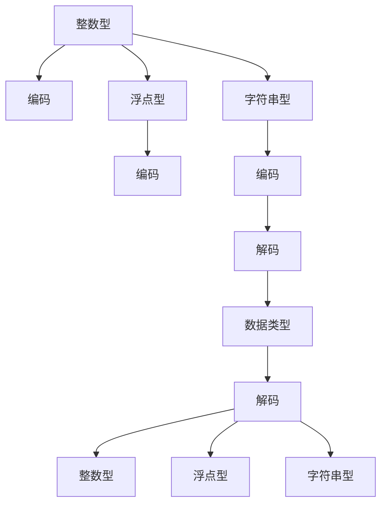

                 

## 1. 背景介绍

在计算机科学中，数据类型是描述存储和操作数据的基本单位。在现代计算机系统中，数据类型通常分为两类：原数据类型和复合数据类型。原数据类型主要包括整数、浮点数和字符串，复合数据类型则包括数组、结构体、枚举等。本文将重点解析这三种原数据类型的编码原理，帮助读者理解其在计算机系统中的存储和处理方式。

### 1.1 数据类型的重要性

数据类型对于计算机系统来说至关重要，它不仅决定了数据的存储方式和运算规则，还直接影响着程序的效率和安全性。对于程序员而言，理解数据类型的编码原理和行为特性，能够更好地设计算法、编写代码，并优化程序的性能。

### 1.2 数据类型的分类

原数据类型通常分为整数型(integers)、浮点型(floats)和字符串型(strings)，它们在计算机中的表示方式和运算规则各不相同。复合数据类型则是通过组合原数据类型，实现更复杂的数据结构。本文将主要探讨整数、浮点数和字符串类型的编码原理。

## 2. 核心概念与联系

### 2.1 核心概念概述

为了更好地理解整数、浮点数和字符串类型的编码原理，我们首先需要介绍一些核心概念：

- 数据类型：表示数据存储和操作的基本单位，分为原数据类型和复合数据类型。
- 整数型：用于表示整数值，通常存储为固定长度的二进制数。
- 浮点型：用于表示实数值，通常存储为带符号的二进制数，分为单精度和双精度两种格式。
- 字符串型：用于表示文本字符串，通常存储为连续的字符序列。
- 编码：将数据类型转换为二进制数的过程，不同的数据类型有各自的编码规则。
- 解码：将二进制数转换为数据类型的原值，解码器需要遵循编码规则进行解析。

### 2.2 核心概念原理和架构的 Mermaid 流程图



这个流程图展示了整数、浮点数和字符串类型在计算机系统中的存储和处理过程。数据类型首先进行编码，生成二进制数，然后解码器解析二进制数，生成原数据类型，最后转换为应用程序需要的数据。

## 3. 核心算法原理 & 具体操作步骤

### 3.1 算法原理概述

整数、浮点数和字符串类型的编码和解码过程，本质上是将数据类型转换为二进制数，再根据二进制数的编码规则解析出数据类型的原值。以下将详细介绍这三种数据类型的编码和解码原理。

### 3.2 算法步骤详解

#### 3.2.1 整数型的编码和解码

整数型的编码和解码过程如下：

- 编码：将整数转换为二进制数。例如，整数9转换为二进制数为`0b1001`。
- 解码：将二进制数解析为整数。例如，二进制数`0b1001`解析为整数9。

整数型的编码和解码过程可以使用Python代码实现，具体如下：

```python
# 编码整数为二进制
def int_to_bin(num):
    return bin(num)[2:]

# 解码二进制为整数
def bin_to_int(bin_str):
    return int(bin_str, 2)
```

#### 3.2.2 浮点型的编码和解码

浮点型的编码和解码过程如下：

- 编码：将浮点数转换为二进制数。浮点数通常存储为单精度(float)或双精度(double)格式。
- 解码：将二进制数解析为浮点数。

单精度浮点数通常使用IEEE 754标准编码，其编码格式如下：

- 符号位(s): 1 bit
- 指数位(e): 8 bits
- 尾数(m): 23 bits

例如，浮点数3.1416的编码为`010000000100100011001100110011001100110011001100110011001100110011001100110011001100110011001100110011001100110011001100110011001100110011001100110011001100110011001100110011001100110011001100110011001100110011001100110011001100110011001100110011001100110011001100110011001100110011001100110011001100110011001100110011001100110011001100110011001100110011001100110011001100110011001100110011001100110011001100110011001100110011001100110011001100110011001100110011001100110011001100110011001100110011001100110011001100110011001100110011001100110011001100110011001100110011001100110011001100110011001100110011001100110011001100110011001100110011001100110011001100110011001100110011001100110011001100110011001100110011001100110011001100110011001100110011001100110011001100110011001100110011001100110011001100110011001100110011001100110011001100110011001100110011001100110011001100110011001100110011001100110011001100110011001100110011001100110011001100110011001100110011001100110011001100110011001100110011001100110011001100110011001100110011001100110011001100110011001100110011001100110011001100110011001100110011001100110011001100110011001100110011001100110011001100110011001100110011001100110011001100110011001100110011001100110011001100110011001100110011001100110011001100110011001100110011001100110011001100110011001100110011001100110011001100110011001100110011001100110011001100110011001100110011001100110011001100110011001100110011001100110011001100110011001100110011001100110011001100110011001100110011001100110011001100110011001100110011001100110011001100110011001100110011001100110011001100110011001100110011001100110011001100110011001100110011001100110011001100110011001100110011001100110011001100110011001100110011001100110011001100110011001100110011001100110011001100110011001100110011001100110011001100110011001100110011001100110011001100110011001100110011001100110011001100110011001100110011001100110011001100110011001100110011001100110011001100110011001100110011001100110011001100110011001100110011001100110011001100110011001100110011001100110011001100110011001100110011001100110011001100110011001100110011001100110011001100110011001100110011001100110011001100110011001100110011001100110011001100110011001100110011001100110011001100110011001100110011001100110011001100110011001100110011001100110011001100110011001100110011001100110011001100110011001100110011001100110011001100110011001100110011001100110011001100110011001100110011001100110011001100110011001100110011001100110011001100110011001100110011001100110011001100110011001100110011001100110011001100110011001100110011001100110011001100110011001100110011001100110011001100110011001100110011001100110011001100110011001100110011001100110011001100110011001100110011001100110011001100110011001100110011001100110011001100110011001100110011001100110011001100110011001100110011001100110011001100110011001100110011001100110011001100110011001100110011001100110011001100110011001100110011001100110011001100110011001100110011001100110011001100110011001100110011001100110011001100110011001100110011001100110011001100110011001100110011001100110011001100110011001100110011001100110011001100110011001100110011001100110011001100110011001100110011001100110011001100110011001100110011001100110011001100110011001100110011001100110011001100110011001100110011001100110011001100110011001100110011001100110011001100110011001100110011001100110011001100110011001100110011001100110011001100110011001100110011001100110011001100110011001100110011001100110011001100110011001100110011001100110011001100110011001100110011001100110011001100110011001100110011001100110011001100110011001100110011001100110011001100110011001100110011001100110011001100110011001100110011001100110011001100110011001100110011001100110011001100110011001100110011001100110011001100110011001100110011001100110011001100110011001100110011001100110011001100110011001100110011001100110011001100110011001100110011001100110011001100110011001100110011001100110011001100110011001100110011001100110011001100110011001100110011001100110011001100110011001100110011001100110011001100110011001100110011001100110011001100110011001100110011001100110011001100110011001100110011001100110011001100110011001100110011001100110011001100110011001100110011001100110011001100110011001100110011001100110011001100110011001100110011001100110011001100110011001100110011001100110011001100110011001100110011001100110011001100110011001100110011001100110011001100110011001100110011001100110011001100110011001100110011001100110011001100110011001100110011001100110011001100110011001100110011001100110011001100110011001100110011001100110011001100110011001100110011001100110011001100110011001100110011001100110011001100110011001100110011001100110011001100110011001100110011001100110011001100110011001100110011001100110011001100110011001100110011001100110011001100110011001100110011001100110011001100110011001100110011001100110011001100110011001100110011001100110011001100110011001100110011001100110011001100110011001100110011001100110011001100110011001100110011001100110011001100110011001100110011001100110011001100110011001100110011001100110011001100110011001100110011001100110011001100110011001100110011001100110011001100110011001100110011001100110011001100110011001100110011001100110011001100110011001100110011001100110011001100110011001100110011001100110011001100110011001100110011001100110011001100110011001100110011001100110011001100110011001100110011001100110011001100110011001100110011001100110011001100110011001100110011001100110011001100110011001100110011001100110011001100110011001100110011001100110011001100110011001100110011001100110011001100110011001100110011001100110011001100110011001100110011001100110011001100110011001100110011001100110011001100110011001100110011001100110011001100110011001100110011001100110011001100110011001100110011001100110011001100110011001100110011001100110011001100110011001100110011001100110011001100110011001100110011001100110011001100110011001100110011001100110011001100110011001100110011001100110011001100110011001100110011001100110011001100110011001100110011001100110011001100110011001100110011001100110011001100110011001100110011001100110011001100110011001100110011001100110011001100110011001100110011001100110011001100110011001100110011001100110011001100110011001100110011001100110011001100110011001100110011001100110011001100110011001100110011001100110011001100110011001100110011001100110011001100110011001100110011001100110011001100110011001100110011001100110011001100110011001100110011001100110011001100110011001100110011001100110011001100110011001100110011001100110011001100110011001100110011001100110011001100110011001100110011001100110011001100110011001100110011001100110011001100110011001100110011001100110011001100110011001100110011001100110011001100110011001100110011001100110011001100110011001100110011001100110011001100110011001100110011001100110011001100110011001100110011001100110011001100110011001100110011001100110011001100110011001100110011001100110011001100110011001100110011001100110011001100110011001100110011001100110011001100110011001100110011001100110011001100110011001100110011001100110011001100110011001100110011001100110011001100110011001100110011001100110011001100110011001100110011001100110011001100110011001100110011001100110011001100110011001100110011001100110011001100110011001100110011001100110011001100110011001100110011001100110011001100110011001100110011001100110011001100110011001100110011001100110011001100110011001100110011001100110011001100110011001100110011001100110011001100110011001100110011001100110011001100110011001100110011001100110011001100110011001100110011001100110011001100110011001100110011001100110011001100110011001100110011001100110011001100110011001100110011001100110011001100110011001100110011001100110011001100110011001100110011001100110011001100110011001100110011001100110011001100110011001100110011001100110011001100110011001100110011001100110011001100110011001100110011001100110011001100110011001100110011001100110011001100110011001100110011001100110011001100110011001100110011001100110011001100110011001100110011001100110011001100110011001100110011001100110011001100110011001100110011001100110011001100110011001100110011001100110011001100110011001100110011001100110011001100110011001100110011001100110011001100110011001100110011001100110011001100110011001100110011001100110011001100110011001100110011001100110011001100110011001100110011001100110011001100110011001100110011001100110011001100110011001100110011001100110011001100110011001100110011001100110011001100110011001100110011001100110011001100110011001100110011001100110011001100110011001100110011001100110011001100110011001100110011001100110011001100110011001100110011001100110011001100110011001100110011001100110011001100110011001100110011001100110011001100110011001100110011001100110011001100110011001100110011001100110011001100110011001100110011001100110011001100110011001100110011001100110011001100110011001100110011001100110011001100110011001100110011001100110011001100110011001100110011001100110011001100110011001100110011001100110011001100110011001100110011001100110011001100110011001100110011001100110011001100110011001100110011001100110011001100110011001100110011001100110011001100110011001100110011001100110011001100110011001100110011001100110011001100110011001100110011001100110011001100110011001100110011001100110011001100110011001100110011001100110011001100110011001100110011001100110011001100110011001100110011001100110011001100110011001100110011001100110011001100110011001100110011001100110011001100110011001100110011001100110011001100110011001100110011001100110011001100110011001100110011001100110011001100110011001100110011001100110011001100110011001100110011001100110011001100110011001100110011001100110011001100110011001100110011001100110011001100110011001100110011001100110011001100110011001100110011001100110011001100110011001100110011001100110011001100110011001100110011001100110011001100110011001100110011001100110011001100110011001100110011001100110011001100110011001100110011001100110011001100110011001100110011001100110011001100110011001100110011001100110011001100110011001100110011001100110011001100110011001100110011001100110011001100110011001100110011001100110011001100110011001100110011001100110011001100110011001100110011001100110011001100110011001100110011001100110011001100110011001100110011001100110011001100110011001100110011001100110011001100110011001100110011001100110011001100110011001100110011001100110011001100110011001100110011001100110011001100110011001100110011001100110011001100110011001100110011001100110011001100110011001100110011001100110011001100110011001100110011001100110011001100110011001100110011001100110011001100110011001100110011001100110011001100110011001100110011001100110011001100110011001100110011001100110011001100110011001100110011001100110011001100110011001100110011001100110011001100110011001100110011001100110011001100110011001100110011001100110011001100110011001100110011001100110011001100110011001100110011001100110011001100110011001100110011001100110011001100110011001100110011001100110011001100110011001100110011001100110011001100110011001100110011001100110011001100110011001100110011001100110011001100110011001100110011001100110011001100110011001100110011001100110011001100110011001100110011001100110011001100110011001100110011001100110011001100110011001100110011001100110011001100110011001100110011001100110011001100110011001100110011001100110011001100110011001100110011001100110011001100110011001100110011001100110011001100110011001100110011001100110011001100110011001100110011001100110011001100110011001100110011001100110011001100110011001100110011001100110011001100110011001100110011001100110011001100110011001100110011001100110011001100110011001100110011001100110011001100110011001100110011001100110011001100110011001100110011001100110011001100110011001100110011001100110011001100110011001100110011001100110011001100110011001100110011001100110011001100110011001100110011001100110011001100110011001100110011001100110011001100110011001100110011001100110011001100110011001100110011001100110011001100110011001100110011001100110011001100110011001100110011001100110011001100110011001100110011001100110011001100110011001100110011001100110011001100110011001100110011001100110011001100110011001100110011001100110011001100110011001100110011001100110011001100110011001100110011001100110011001100110011001100110011001100110011001100110011001100110011001100110011001100110011001100110011001100110011001100110011001100110011001100110011001100110011001100110011001100110011001100110011001100110011001100110011001100110011001100110011001100110011001100110011001100110011001100110011001100110011001100110011001100110011001100110011001100110011001100110011001100110011001100110011001100110011001100110011001100110011001100110011001100110011001100110011001100110011001100110011001100110011001100110011001100110011001100110011001100110011001100110011001100110011001100110011001100110011001100110011001100110011001100110011001100110011001100110011001100110011001100110011001100110011001100110011001100110011001100110011001100110011001100110011001100110011001100110011001100110011001100110011001100110011001100110011001100110011001100110011001100110011001100110011001100110011001100110011001100110011001100110011001100110011001100110011001100110011001100110011001100110011001100110011001100110011001100110011001100110011001100110011001100110011001100110011001100110011001100110011001100110011001100110011001100110011001100110011001100110011001100110011001100110011001100110011001100110011001100110011001100110011001100110011001100110011001100110011001100110011001100110011001100110011001100110011001100110011001100110011001100110011001100110011001100110011001100110011001100110011001100110011001100110011001100110011001100110011001100110011001100110011001100110011001100110011001100110011001100110011001100110011001100110011001100110011001100110011001100110011001100110011001100110011001100110011001100110011001100110011001100110011001100110011001100110011001100110011001100110011001100110011001100110011001100110011001100110011001100110011001100110011001100110011001100110011001100110011001100110011001100110011001100110011001100110011001100110011001100110011001100110011001100110011001100110011001100110011001100110011001100110011001100110011001100110011001100110011001100110011001100110011001100110011001100110011001100110011001100110011001100110011001100110011001100110011001100110011001100110011001100110011001100110011001100110011001100110011001100110011001100110011001100110011001100110011001100110011001100110011001100110011001100110011001100110011001100110011001100110011001100110011001100110011001100110011001100110011001100110011001100110011001100110011001100110011001100110011001100110011001100110011001100110011001100110011001100110011001100110011001100110011001100110011001100110011001100110011001100110011001100110011001100110011001100110011001100110011001100110011001100110011001100110011001100110011001100110011001100110011001100110011001100110011001100110011001100110011001100110011001100110011001100110011001100110011001100110011001100110011001100110011001100110011001100110011001100110011001100110011001100110011001100110011001100110011001100110011001100110011001100110011001100110011001100110011001100110011001100110011001100110011001100110011001100110011001100110011001100110011001100110011001100110011001100110011001100110011001100110011001100110011001100110011001100110011001100110011001100110011001100110011001100110011001100110011001100110011001100110011001100110011001100110011001100110011001100110011001100110011001100110011001100110011001100110011001100110011001100110011001100110011001100110011001100110011001100110011001100110011001100110011001100110011001100110011001100110011001100110011001100110011001100110011001100110011001100110011001100110011001100110011001100110011001100110011001100110011001100110011001100110011001100110011001100110011001100110011001100110011001100110011001100110011001100110011001100110011001100110011001100110011001100110011001100110011001100110011001100110011001100110011001100110011001100110011001100110011001100110011001100110011001100110011001100110011001100110011001100110011001100110011001100110011001100110011001100110011001100110011001100110011001100110011001100110011001100110011001100110011001100110011001100110011001100110011001100110011001100110011001100110011001100110011001100110011001100110011001100110011001100110011001100110011001100110011001100110011001100110011001100110011001100110011001100110011001100110011001100110011001100110011001100110011001100110011001100110011001100110011001100110011001100110011001100110011001100110011001100110011001100110011

