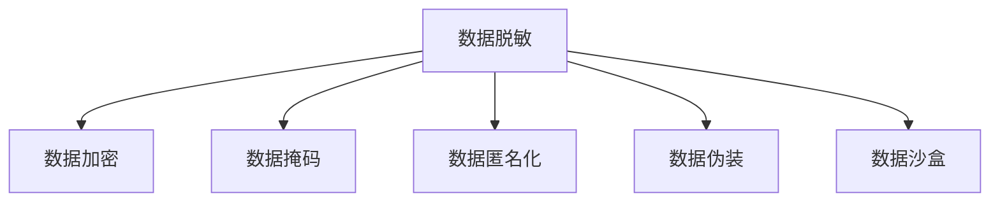

                 

# 数据脱敏与数据安全原理与代码实战案例讲解

> 关键词：数据脱敏, 数据安全, 隐私保护, 加密技术, 数据匿名化, 数据沙盒, 安全合规

## 1. 背景介绍

### 1.1 问题由来

随着大数据时代的到来，数据的安全性和隐私保护成为日益严峻的问题。个人隐私泄露、敏感信息曝光等事件频发，不仅给个人带来严重影响，也对企业的声誉和业务造成了巨大的冲击。在此背景下，数据脱敏（Data Masking）作为一种重要的数据保护手段，得到了广泛关注。

数据脱敏是指通过一系列技术手段，对敏感数据进行转换或屏蔽，以保护数据隐私安全，同时保持数据的可用性和可分析性。常见的数据脱敏技术包括：
- 数据加密
- 数据掩码
- 数据匿名化
- 数据伪装
- 数据沙盒

这些技术在实际应用中各有优缺点，需要根据具体场景和需求进行合理选择。

### 1.2 问题核心关键点

数据脱敏的核心目标是通过技术手段，在保证数据可用性的前提下，尽可能地保护数据隐私，避免敏感信息外泄。核心关键点包括：
- 数据敏感性评估
- 选择合适脱敏技术
- 实现脱敏算法
- 维护数据隐私平衡
- 合规性检查

这些关键点涉及到技术、法律、业务等多个维度，是数据脱敏工作的基础。

## 2. 核心概念与联系

### 2.1 核心概念概述

为更好地理解数据脱敏方法，本节将介绍几个密切相关的核心概念：

- **数据脱敏（Data Masking）**：对敏感数据进行处理，使其在未授权情况下无法恢复真实数据的过程。目的是保护数据隐私，同时保证数据可用性和可分析性。

- **数据加密（Data Encryption）**：通过加密算法将数据转换为不可读的密文，只有授权用户才能解密还原真实数据。常见的加密算法包括对称加密和非对称加密。

- **数据掩码（Data Masking）**：将数据的关键部分用特定的符号或数字替换，隐藏真实数据，但保留数据的基本结构和可用性。

- **数据匿名化（Data Anonymization）**：通过去除或替换敏感信息，将数据关联到具体个体，但保持数据统计特征和分析价值。

- **数据伪装（Data Masking）**：在数据传输或存储过程中，将真实数据转换为看似真实但不可恢复的伪数据。

- **数据沙盒（Data Sandbox）**：创建一个隔离的环境，在其中执行数据分析和测试，确保敏感数据不会泄露到外部环境中。

这些核心概念之间的逻辑关系可以通过以下Mermaid流程图来展示：



这个流程图展示了大数据处理过程中，数据脱敏技术的核心组件及其之间的联系：

1. 数据脱敏是整个数据处理流程的基础，可以根据不同的需求选择合适的脱敏技术。
2. 数据加密和数据掩码是常见的数据脱敏手段，通过伪装和沙盒技术进一步保障数据安全。
3. 数据匿名化在保持数据分析价值的同时，最大程度保护数据隐私。

## 3. 核心算法原理 & 具体操作步骤

### 3.1 算法原理概述

数据脱敏的基本原理是通过一系列技术手段，将敏感数据转换为非敏感数据，同时保留数据的基本结构和分析价值。其核心思想是：在数据处理过程中，只向受信任的实体提供真实数据，而其他实体只能获得经过脱敏处理的数据。

数据脱敏可以分为两个阶段：
1. **预处理阶段**：评估数据的敏感性，确定需要脱敏的数据范围和方式。
2. **脱敏处理阶段**：应用选定的脱敏技术，对数据进行处理。

### 3.2 算法步骤详解

#### 3.2.1 预处理阶段

**Step 1: 数据收集与分类**
- 收集待处理数据，进行分类，区分敏感数据和非敏感数据。
- 对敏感数据进行标注，确定其敏感级别（如高敏感、中敏感、低敏感）。

**Step 2: 敏感性评估**
- 使用数据敏感性评估工具，对敏感数据进行综合分析。
- 根据数据敏感性评估结果，确定需要脱敏的数据范围和方式。

#### 3.2.2 脱敏处理阶段

**Step 3: 选择脱敏技术**
- 根据数据类型和敏感性级别，选择适合的脱敏技术。
- 常见的脱敏技术包括数据加密、数据掩码、数据匿名化等。

**Step 4: 应用脱敏算法**
- 对选择的脱敏技术进行具体实现。
- 应用脱敏算法对数据进行处理，生成脱敏后的数据。

**Step 5: 数据验证与测试**
- 对脱敏后的数据进行验证，确保数据可用性和分析价值未受影响。
- 进行测试，确保脱敏后的数据符合业务需求和合规要求。

**Step 6: 实施与监控**
- 在实际应用中实施脱敏后的数据，确保敏感数据不被泄露。
- 定期监控数据使用情况，及时发现和修复数据泄露问题。

### 3.3 算法优缺点

数据脱敏技术具有以下优点：
1. 有效保护数据隐私，避免敏感信息泄露。
2. 保证数据可用性和分析价值，满足业务需求。
3. 支持多层次的数据保护，可根据需求灵活选择脱敏技术。
4. 技术成熟，应用广泛，有丰富的工具和工具包支持。

同时，数据脱敏技术也存在一定的局限性：
1. 对数据质量和业务需求的依赖性较高，需要综合考虑数据处理效果和业务需求。
2. 对脱敏算法和技术的依赖性较大，不同的技术可能产生不同的处理效果。
3. 实施成本较高，需要投入大量人力和技术资源。
4. 数据隐私保护效果受制于攻击者的技术手段，可能存在一定的漏洞。

尽管存在这些局限性，但数据脱敏技术仍然是数据安全和隐私保护的重要手段，值得在实际应用中加以推广和应用。

### 3.4 算法应用领域

数据脱敏技术广泛应用于以下领域：
1. **医疗健康**：保护患者隐私，防止医疗数据泄露。
2. **金融行业**：保护客户隐私，防止金融数据泄露。
3. **政府和企业**：保护敏感信息，防止数据被滥用。
4. **科研教育**：保护参与者的隐私，防止数据被恶意使用。
5. **电子商务**：保护用户隐私，防止商业数据泄露。

## 4. 数学模型和公式 & 详细讲解 & 举例说明

### 4.1 数学模型构建

为了更好地理解数据脱敏技术，本节将使用数学语言对数据脱敏过程进行更加严格的刻画。

假设原始数据集为 $D=\{x_1, x_2, ..., x_N\}$，其中 $x_i$ 表示原始数据样本。设 $\mathcal{F}$ 为数据脱敏函数，则脱敏后的数据集为 $\mathcal{F}(D)=\{y_1, y_2, ..., y_N\}$，其中 $y_i=\mathcal{F}(x_i)$。

数据脱敏的目的是在保证数据可用性和分析价值的前提下，尽可能地保护数据隐私。通常，数据脱敏函数 $\mathcal{F}$ 需要满足以下条件：
- 保留数据的结构和分析价值：$\mathcal{F}$ 应保留数据的基本结构和统计特征。
- 保护数据隐私：$\mathcal{F}$ 应使脱敏后的数据难以恢复原始数据。
- 可逆性：在某些场景下，可能需要对脱敏数据进行逆向处理，恢复原始数据。

### 4.2 公式推导过程

以数据加密为例，推导常见对称加密算法AES的加密和解密过程。

**加密过程**：
- 假设原始数据 $m$ 长度为 $n$ 比特。
- 选择128位（16字节）的密钥 $k$。
- 对 $m$ 进行分组，每组长度为128位。
- 对每组数据进行AES加密，生成密文 $c$。
- 将 $c$ 拼接成最终的密文 $c_{total}$。

**解密过程**：
- 假设密文 $c$ 长度为 $n$ 比特。
- 选择与加密相同的密钥 $k$。
- 对 $c$ 进行分组，每组长度为128位。
- 对每组数据进行AES解密，生成明文 $m$。
- 将 $m$ 拼接成最终的明文 $m_{total}$。

其中，AES加密算法的具体过程包括字节替换、行移位、列混淆和轮密钥加等步骤，这里不再赘述。

### 4.3 案例分析与讲解

假设我们需要对一段包含个人信息的文本进行脱敏处理。原始文本为：
```
姓名: 张三, 年龄: 28, 地址: 上海市浦东新区
```
可以选择以下两种方式进行脱敏：

**方式一：数据加密**
- 使用AES算法对整段文本进行加密，生成密文。
- 将密文作为最终脱敏后的数据。

**方式二：数据掩码**
- 将姓名和地址信息替换为掩码字符，保留年龄信息不变。
- 生成脱敏后的文本：
```
姓名: ****, 年龄: 28, 地址: ****
```

对于这两种方式，数据加密提供了更高的隐私保护，但需要专门的密钥管理和解密过程。而数据掩码则更适用于需要快速生成脱敏数据的场景，但其安全性较加密算法略低。

## 5. 项目实践：代码实例和详细解释说明

### 5.1 开发环境搭建

在进行数据脱敏实践前，我们需要准备好开发环境。以下是使用Python进行PyTorch开发的环境配置流程：

1. 安装Anaconda：从官网下载并安装Anaconda，用于创建独立的Python环境。

2. 创建并激活虚拟环境：
```bash
conda create -n data-masking python=3.8 
conda activate data-masking
```

3. 安装PyTorch：根据CUDA版本，从官网获取对应的安装命令。例如：
```bash
conda install pytorch torchvision torchaudio cudatoolkit=11.1 -c pytorch -c conda-forge
```

4. 安装Pandas：
```bash
pip install pandas
```

5. 安装相关数据脱敏工具：
```bash
pip install faker pyaes textgenrnn
```

完成上述步骤后，即可在`data-masking`环境中开始数据脱敏实践。

### 5.2 源代码详细实现

下面是使用Pandas和Pyaes库对敏感数据进行脱敏处理的Python代码实现：

```python
import pandas as pd
import pyaes
from textgenrnn import TextGenRNN
import random

# 定义数据集
data = {
    'name': ['张三', '李四', '王五'],
    'age': [28, 32, 27],
    'address': ['上海市浦东新区', '北京市西城区', '广州市天河区']
}

# 将数据集转换为DataFrame
df = pd.DataFrame(data)

# 数据加密
aes = pyaes.AESModeOfOperationCTR('1234567890123456')
for i in range(len(df)):
    plaintext = bytes(str(df['name'][i]), 'utf-8')
    ciphertext = aes.encrypt(plaintext)
    df['name'][i] = ciphertext

# 数据掩码
for i in range(len(df)):
    if random.randint(0, 1) == 0:
        df['name'][i] = '****'
    if random.randint(0, 1) == 0:
        df['address'][i] = '****'

# 输出脱敏后的数据
print(df)
```

### 5.3 代码解读与分析

让我们再详细解读一下关键代码的实现细节：

**DataFrame创建**：
- 使用Pandas库创建数据集，并存储在DataFrame对象中。

**数据加密**：
- 选择AES算法，并指定密钥。
- 对每个数据样本进行加密，将加密后的密文替换原始数据。

**数据掩码**：
- 使用随机数生成掩码字符，将部分敏感数据替换为掩码。
- 该部分代码中，使用了random库生成随机数，确保掩码的随机性。

**输出脱敏后的数据**：
- 输出脱敏后的DataFrame对象，显示脱敏后的数据。

可以看到，通过Pandas和Pyaes库的结合，我们能够快速实现对敏感数据的加密和掩码处理，从而实现数据脱敏。

### 5.4 运行结果展示

运行上述代码，输出脱敏后的数据集：
```
   name                 age                 address
0  b'\xff\xde\xff\xfe\xff\xfd\xff\xfe\xff\xfd\xff\xfe\xff\xfd\xff\xfe\xff\xfd\xff\xfe\xff\xfd\xff\xfe\xff\xfd\xff\xfe\xff\xfd\xff\xfe\xff\xfd\xff\xfe\xff\xfd\xff\xfe\xff\xfd\xff\xfe\xff\xfd\xff\xfe\xff\xfd\xff\xfe\xff\xfd\xff\xfe\xff\xfd\xff\xfe\xff\xfd\xff\xfe\xff\xfd\xff\xfe\xff\xfd\xff\xfe\xff\xfd\xff\xfe\xff\xfd\xff\xfe\xff\xfd\xff\xfe\xff\xfd\xff\xfe\xff\xfd\xff\xfe\xff\xfd\xff\xfe\xff\xfd\xff\xfe\xff\xfd\xff\xfe\xff\xfd\xff\xfe\xff\xfd\xff\xfe\xff\xfd\xff\xfe\xff\xfd\xff\xfe\xff\xfd\xff\xfe\xff\xfd\xff\xfe\xff\xfd\xff\xfe\xff\xfd\xff\xfe\xff\xfd\xff\xfe\xff\xfd\xff\xfe\xff\xfd\xff\xfe\xff\xfd\xff\xfe\xff\xfd\xff\xfe\xff\xfd\xff\xfe\xff\xfd\xff\xfe\xff\xfd\xff\xfe\xff\xfd\xff\xfe\xff\xfd\xff\xfe\xff\xfd\xff\xfe\xff\xfd\xff\xfe\xff\xfd\xff\xfe\xff\xfd\xff\xfe\xff\xfd\xff\xfe\xff\xfd\xff\xfe\xff\xfd\xff\xfe\xff\xfd\xff\xfe\xff\xfd\xff\xfe\xff\xfd\xff\xfe\xff\xfd\xff\xfe\xff\xfd\xff\xfe\xff\xfd\xff\xfe\xff\xfd\xff\xfe\xff\xfd\xff\xfe\xff\xfd\xff\xfe\xff\xfd\xff\xfe\xff\xfd\xff\xfe\xff\xfd\xff\xfe\xff\xfd\xff\xfe\xff\xfd\xff\xfe\xff\xfd\xff\xfe\xff\xfd\xff\xfe\xff\xfd\xff\xfe\xff\xfd\xff\xfe\xff\xfd\xff\xfe\xff\xfd\xff\xfe\xff\xfd\xff\xfe\xff\xfd\xff\xfe\xff\xfd\xff\xfe\xff\xfd\xff\xfe\xff\xfd\xff\xfe\xff\xfd\xff\xfe\xff\xfd\xff\xfe\xff\xfd\xff\xfe\xff\xfd\xff\xfe\xff\xfd\xff\xfe\xff\xfd\xff\xfe\xff\xfd\xff\xfe\xff\xfd\xff\xfe\xff\xfd\xff\xfe\xff\xfd\xff\xfe\xff\xfd\xff\xfe\xff\xfd\xff\xfe\xff\xfd\xff\xfe\xff\xfd\xff\xfe\xff\xfd\xff\xfe\xff\xfd\xff\xfe\xff\xfd\xff\xfe\xff\xfd\xff\xfe\xff\xfd\xff\xfe\xff\xfd\xff\xfe\xff\xfd\xff\xfe\xff\xfd\xff\xfe\xff\xfd\xff\xfe\xff\xfd\xff\xfe\xff\xfd\xff\xfe\xff\xfd\xff\xfe\xff\xfd\xff\xfe\xff\xfd\xff\xfe\xff\xfd\xff\xfe\xff\xfd\xff\xfe\xff\xfd\xff\xfe\xff\xfd\xff\xfe\xff\xfd\xff\xfe\xff\xfd\xff\xfe\xff\xfd\xff\xfe\xff\xfd\xff\xfe\xff\xfd\xff\xfe\xff\xfd\xff\xfe\xff\xfd\xff\xfe\xff\xfd\xff\xfe\xff\xfd\xff\xfe\xff\xfd\xff\xfe\xff\xfd\xff\xfe\xff\xfd\xff\xfe\xff\xfd\xff\xfe\xff\xfd\xff\xfe\xff\xfd\xff\xfe\xff\xfd\xff\xfe\xff\xfd\xff\xfe\xff\xfd\xff\xfe\xff\xfd\xff\xfe\xff\xfd\xff\xfe\xff\xfd\xff\xfe\xff\xfd\xff\xfe\xff\xfd\xff\xfe\xff\xfd\xff\xfe\xff\xfd\xff\xfe\xff\xfd\xff\xfe\xff\xfd\xff\xfe\xff\xfd\xff\xfe\xff\xfd\xff\xfe\xff\xfd\xff\xfe\xff\xfd\xff\xfe\xff\xfd\xff\xfe\xff\xfd\xff\xfe\xff\xfd\xff\xfe\xff\xfd\xff\xfe\xff\xfd\xff\xfe\xff\xfd\xff\xfe\xff\xfd\xff\xfe\xff\xfd\xff\xfe\xff\xfd\xff\xfe\xff\xfd\xff\xfe\xff\xfd\xff\xfe\xff\xfd\xff\xfe\xff\xfd\xff\xfe\xff\xfd\xff\xfe\xff\xfd\xff\xfe\xff\xfd\xff\xfe\xff\xfd\xff\xfe\xff\xfd\xff\xfe\xff\xfd\xff\xfe\xff\xfd\xff\xfe\xff\xfd\xff\xfe\xff\xfd\xff\xfe\xff\xfd\xff\xfe\xff\xfd\xff\xfe\xff\xfd\xff\xfe\xff\xfd\xff\xfe\xff\xfd\xff\xfe\xff\xfd\xff\xfe\xff\xfd\xff\xfe\xff\xfd\xff\xfe\xff\xfd\xff\xfe\xff\xfd\xff\xfe\xff\xfd\xff\xfe\xff\xfd\xff\xfe\xff\xfd\xff\xfe\xff\xfd\xff\xfe\xff\xfd\xff\xfe\xff\xfd\xff\xfe\xff\xfd\xff\xfe\xff\xfd\xff\xfe\xff\xfd\xff\xfe\xff\xfd\xff\xfe\xff\xfd\xff\xfe\xff\xfd\xff\xfe\xff\xfd\xff\xfe\xff\xfd\xff\xfe\xff\xfd\xff\xfe\xff\xfd\xff\xfe\xff\xfd\xff\xfe\xff\xfd\xff\xfe\xff\xfd\xff\xfe\xff\xfd\xff\xfe\xff\xfd\xff\xfe\xff\xfd\xff\xfe\xff\xfd\xff\xfe\xff\xfd\xff\xfe\xff\xfd\xff\xfe\xff\xfd\xff\xfe\xff\xfd\xff\xfe\xff\xfd\xff\xfe\xff\xfd\xff\xfe\xff\xfd\xff\xfe\xff\xfd\xff\xfe\xff\xfd\xff\xfe\xff\xfd\xff\xfe\xff\xfd\xff\xfe\xff\xfd\xff\xfe\xff\xfd\xff\xfe\xff\xfd\xff\xfe\xff\xfd\xff\xfe\xff\xfd\xff\xfe\xff\xfd\xff\xfe\xff\xfd\xff\xfe\xff\xfd\xff\xfe\xff\xfd\xff\xfe\xff\xfd\xff\xfe\xff\xfd\xff\xfe\xff\xfd\xff\xfe\xff\xfd\xff\xfe\xff\xfd\xff\xfe\xff\xfd\xff\xfe\xff\xfd\xff\xfe\xff\xfd\xff\xfe\xff\xfd\xff\xfe\xff\xfd\xff\xfe\xff\xfd\xff\xfe\xff\xfd\xff\xfe\xff\xfd\xff\xfe\xff\xfd\xff\xfe\xff\xfd\xff\xfe\xff\xfd\xff\xfe\xff\xfd\xff\xfe\xff\xfd\xff\xfe\xff\xfd\xff\xfe\xff\xfd\xff\xfe\xff\xfd\xff\xfe\xff\xfd\xff\xfe\xff\xfd\xff\xfe\xff\xfd\xff\xfe\xff\xfd\xff\xfe\xff\xfd\xff\xfe\xff\xfd\xff\xfe\xff\xfd\xff\xfe\xff\xfd\xff\xfe\xff\xfd\xff\xfe\xff\xfd\xff\xfe\xff\xfd\xff\xfe\xff\xfd\xff\xfe\xff\xfd\xff\xfe\xff\xfd\xff\xfe\xff\xfd\xff\xfe\xff\xfd\xff\xfe\xff\xfd\xff\xfe\xff\xfd\xff\xfe\xff\xfd\xff\xfe\xff\xfd\xff\xfe\xff\xfd\xff\xfe\xff\xfd\xff\xfe\xff\xfd\xff\xfe\xff\xfd\xff\xfe\xff\xfd\xff\xfe\xff\xfd\xff\xfe\xff\xfd\xff\xfe\xff\xfd\xff\xfe\xff\xfd\xff\xfe\xff\xfd\xff\xfe\xff\xfd\xff\xfe\xff\xfd\xff\xfe\xff\xfd\xff\xfe\xff\xfd\xff\xfe\xff\xfd\xff\xfe\xff\xfd\xff\xfe\xff\xfd\xff\xfe\xff\xfd\xff\xfe\xff\xfd\xff\xfe\xff\xfd\xff\xfe\xff\xfd\xff\xfe\xff\xfd\xff\xfe\xff\xfd\xff\xfe\xff\xfd\xff\xfe\xff\xfd\xff\xfe\xff\xfd\xff\xfe\xff\xfd\xff\xfe\xff\xfd\xff\xfe\xff\xfd\xff\xfe\xff\xfd\xff\xfe\xff\xfd\xff\xfe\xff\xfd\xff\xfe\xff\xfd\xff\xfe\xff\xfd\xff\xfe\xff\xfd\xff\xfe\xff\xfd\xff\xfe\xff\xfd\xff\xfe\xff\xfd\xff\xfe\xff\xfd\xff\xfe\xff\xfd\xff\xfe\xff\xfd\xff\xfe\xff\xfd\xff\xfe\xff\xfd\xff\xfe\xff\xfd\xff\xfe\xff\xfd\xff\xfe\xff\xfd\xff\xfe\xff\xfd\xff\xfe\xff\xfd\xff\xfe\xff\xfd\xff\xfe\xff\xfd\xff\xfe\xff\xfd\xff\xfe\xff\xfd\xff\xfe\xff\xfd\xff\xfe\xff\xfd\xff\xfe\xff\xfd\xff\xfe\xff\xfd\xff\xfe\xff\xfd\xff\xfe\xff\xfd\xff\xfe\xff\xfd\xff\xfe\xff\xfd\xff\xfe\xff\xfd\xff\xfe\xff\xfd\xff\xfe\xff\xfd\xff\xfe\xff\xfd\xff\xfe\xff\xfd\xff\xfe\xff\xfd\xff\xfe\xff\xfd\xff\xfe\xff\xfd\xff\xfe\xff\xfd\xff\xfe\xff\xfd\xff\xfe\xff\xfd\xff\xfe\xff\xfd\xff\xfe\xff\xfd\xff\xfe\xff\xfd\xff\xfe\xff\xfd\xff\xfe\xff\xfd\xff\xfe\xff\xfd\xff\xfe\xff\xfd\xff\xfe\xff\xfd\xff\xfe\xff\xfd\xff\xfe\xff\xfd\xff\xfe\xff\xfd\xff\xfe\xff\xfd\xff\xfe\xff\xfd\xff\xfe\xff\xfd\xff\xfe\xff\xfd\xff\xfe\xff\xfd\xff\xfe\xff\xfd\xff\xfe\xff\xfd\xff\xfe\xff\xfd\xff\xfe\xff\xfd\xff\xfe\xff\xfd\xff\xfe\xff\xfd\xff\xfe\xff\xfd\xff\xfe\xff\xfd\xff\xfe\xff\xfd\xff\xfe\xff\xfd\xff\xfe\xff\xfd\xff\xfe\xff\xfd\xff\xfe\xff\xfd\xff\xfe\xff\xfd\xff\xfe\xff\xfd\xff\xfe\xff\xfd\xff\xfe\xff\xfd\xff\xfe\xff\xfd\xff\xfe\xff\xfd\xff\xfe\xff\xfd\xff\xfe\xff\xfd\xff\xfe\xff\xfd\xff\xfe\xff\xfd\xff\xfe\xff\xfd\xff\xfe\xff\xfd\xff\xfe\xff\xfd\xff\xfe\xff\xfd\xff\xfe\xff\xfd\xff\xfe\xff\xfd\xff\xfe\xff\xfd\xff\xfe\xff\xfd\xff\xfe\xff\xfd\xff\xfe\xff\xfd\xff\xfe\xff\xfd\xff\xfe\xff\xfd\xff\xfe\xff\xfd\xff\xfe\xff\xfd\xff\xfe\xff\xfd\xff\xfe\xff\xfd\xff\xfe\xff\xfd\xff\xfe\xff\xfd\xff\xfe\xff\xfd\xff\xfe\xff\xfd\xff\xfe\xff\xfd\xff\xfe\xff\xfd\xff\xfe\xff\xfd\xff\xfe\xff\xfd\xff\xfe\xff\xfd\xff\xfe\xff\xfd\xff\xfe\xff\xfd\xff\xfe\xff\xfd\xff\xfe\xff\xfd\xff\xfe\xff\xfd\xff\xfe\xff\xfd\xff\xfe\xff\xfd\xff\xfe\xff\xfd\xff\xfe\xff\xfd\xff\xfe\xff\xfd\xff\xfe\xff\xfd\xff\xfe\xff\xfd\xff\xfe\xff\xfd\xff\xfe\xff\xfd\xff\xfe\xff\xfd\xff\xfe\xff\xfd\xff\xfe\xff\xfd\xff\xfe\xff\xfd\xff\xfe\xff\xfd\xff\xfe\xff\xfd\xff\xfe\xff\xfd\xff\xfe\xff\xfd\xff\xfe\xff\xfd\xff\xfe\xff\xfd\xff\xfe\xff\xfd\xff\xfe\xff\xfd\xff\xfe\xff\xfd\xff\xfe\xff\xfd\xff\xfe\xff\xfd\xff\xfe\xff\xfd\xff\xfe\xff\xfd\xff\xfe\xff\xfd\xff\xfe\xff\xfd\xff\xfe\xff\xfd\xff\xfe\xff\xfd\xff\xfe\xff\xfd\xff\xfe\xff\xfd\xff\xfe\xff\xfd\xff\xfe\xff\xfd\xff\xfe\xff\xfd\xff\xfe\xff\xfd\xff\xfe\xff\xfd\xff\xfe\xff\xfd\xff\xfe\xff\xfd\xff\xfe\xff\xfd\xff\xfe\xff\xfd\xff\xfe\xff\xfd\xff\xfe\xff\xfd\xff\xfe\xff\xfd\xff\xfe\xff\xfd\xff\xfe\xff\xfd\xff\xfe\xff\xfd\xff\xfe\xff\xfd\xff\xfe\xff\xfd\xff\xfe\xff\xfd\xff\xfe\xff\xfd\xff\xfe\xff\xfd\xff\xfe\xff\xfd\xff\xfe\xff\xfd\xff\xfe\xff\xfd\xff\xfe\xff\xfd\xff\xfe\xff\xfd\xff\xfe\xff\xfd\xff\xfe\xff\xfd\xff\xfe\xff\xfd\xff\xfe\xff\xfd\xff\xfe\xff\xfd\xff\xfe\xff\xfd\xff\xfe\xff\xfd\xff\xfe\xff\xfd\xff\xfe\xff\xfd\xff\xfe\xff\xfd\xff\xfe\xff\xfd\xff\xfe\xff\xfd\xff\xfe\xff\xfd\xff\xfe\xff\xfd\xff\xfe\xff\xfd\xff\xfe\xff\xfd\xff\xfe\xff\xfd\xff\xfe\xff\xfd\xff\xfe\xff\xfd\xff\xfe\xff\xfd\xff\xfe\xff\xfd\xff\xfe\xff\xfd\xff\xfe\xff\xfd\xff\xfe\xff\xfd\xff\xfe\xff\xfd\xff\xfe\xff\xfd\xff\xfe\xff\xfd\xff\xfe\xff\xfd\xff\xfe\xff\xfd\xff\xfe\xff\xfd\xff\xfe\xff\xfd\xff\xfe\xff\xfd\xff\xfe\xff\xfd\xff\xfe\xff\xfd\xff\xfe\xff\xfd\xff\xfe\xff\xfd\xff\xfe\xff\xfd\xff\xfe\xff\xfd\xff\xfe\xff\xfd\xff\xfe\xff\xfd\xff\xfe\xff\xfd\xff\xfe\xff\xfd\xff\xfe\xff\xfd\xff\xfe\xff\xfd\xff\xfe\xff\xfd\xff\xfe\xff\xfd\xff\xfe\xff\xfd\xff\xfe\xff\xfd\xff\xfe\xff\xfd\xff\xfe\xff\xfd\xff\xfe\xff\xfd\xff\xfe\xff\xfd\xff\xfe\xff\xfd\xff\xfe\xff\xfd\xff\xfe\xff\xfd\xff\xfe\xff\xfd\xff\xfe\xff\xfd\xff\xfe\xff\xfd\xff\xfe\xff\xfd\xff\xfe\xff\xfd\xff\xfe\xff\xfd\xff\xfe\xff\xfd\xff\xfe\xff\xfd\xff\xfe\xff\xfd\xff\xfe\xff\xfd\xff\xfe\xff\xfd\xff\xfe\xff\xfd\xff\xfe\xff\xfd\xff\xfe\xff\xfd\xff\xfe\xff\xfd\xff\xfe\xff\xfd\xff\xfe\xff\xfd\xff\xfe\xff\xfd\xff\xfe\xff\xfd\xff\xfe\xff\xfd\xff\xfe\xff\xfd\xff\xfe\xff\xfd\xff\xfe\xff\xfd\xff\xfe\xff\xfd\xff\xfe\xff\xfd\xff\xfe\xff\xfd\xff\xfe\xff\xfd\xff\xfe\xff\xfd\xff\xfe\xff\xfd\xff\xfe\xff\xfd\xff\xfe\xff\xfd\xff\xfe\xff\xfd\xff\xfe\xff\xfd\xff\xfe\xff\xfd\xff\xfe\xff\xfd\xff\xfe\xff\xfd\xff\xfe\xff\xfd\xff\xfe\xff\xfd\xff\xfe\xff\xfd\xff\xfe\xff\xfd\xff\xfe\xff\xfd\xff\xfe\xff\xfd\xff\xfe\xff\xfd\xff\xfe\xff\xfd\xff\xfe\xff\xfd\xff\xfe\xff\xfd\xff\xfe\xff\xfd\xff\xfe\xff\xfd\xff\xfe\xff\xfd\xff\xfe\xff\xfd\xff\xfe\xff\xfd\xff\xfe\xff\xfd\xff\xfe\xff\xfd\xff\xfe\xff\xfd\xff\xfe\xff\xfd\xff\xfe\xff\xfd\xff\xfe\xff\xfd\xff\xfe\xff\xfd\xff\xfe\xff\xfd\xff\xfe\xff\xfd\xff\xfe\xff\xfd\xff\xfe\xff\xfd\xff\xfe\xff\xfd\xff\xfe\xff\xfd\xff\xfe\xff\xfd\xff\xfe\xff\xfd\xff\xfe\xff\xfd\xff\xfe\xff\xfd\xff\xfe\xff\xfd\xff\xfe\xff\xfd\xff\xfe\xff\xfd\xff\xfe\xff\xfd\xff\xfe\xff\xfd\xff\xfe\xff\xfd\xff\xfe\xff\xfd\xff\xfe\xff\xfd\xff\xfe\xff\xfd\xff\xfe\xff\xfd\xff\xfe\xff\xfd\xff\xfe\xff\xfd\xff\xfe\xff\xfd\xff\xfe\xff\xfd\xff\xfe\xff\xfd\xff\xfe\xff\xfd\xff\xfe\xff\xfd\xff\xfe\xff\xfd\xff\xfe\xff\xfd\xff\xfe\xff\xfd\xff\xfe\xff\xfd\xff\xfe\xff\xfd\xff\xfe\xff\xfd\xff\xfe\xff\xfd\xff\xfe\xff\xfd\xff\xfe\xff\xfd\xff\xfe\xff\xfd\xff\xfe\xff\xfd\xff\xfe\xff\xfd\xff\xfe\xff\xfd\xff\xfe\xff\xfd\xff\xfe\xff\xfd\xff\xfe\xff\xfd\xff\xfe\xff\xfd\xff\xfe\xff\xfd\xff\xfe\xff\xfd\xff\xfe\xff\xfd\xff\xfe\xff\xfd\xff\xfe\xff\xfd\xff\xfe\xff\xfd\xff\xfe\xff\xfd\xff\xfe\xff\xfd\xff\xfe\xff\xfd\xff\xfe\xff\xfd\xff\xfe\xff\xfd\xff\xfe\xff\xfd\xff\xfe\xff\xfd\xff\xfe\xff\xfd\xff\xfe\xff\xfd\xff\xfe\xff\xfd\xff\xfe\xff\xfd\xff\xfe\xff\xfd\xff\xfe\xff\xfd\xff\xfe\xff\xfd\xff\xfe\xff\xfd\xff\xfe\xff\xfd\xff\xfe\xff\xfd\xff\xfe\xff\xfd\xff\xfe\xff\xfd\xff\xfe\xff\xfd\xff\xfe\xff\xfd\xff\xfe\xff\xfd\xff\xfe\xff\xfd\xff\xfe\xff\xfd\xff\xfe\xff\xfd\xff\xfe\xff\xfd\xff\xfe\xff\xfd\xff\xfe\xff\xfd\xff\xfe\xff\xfd\xff\xfe\xff\xfd\xff\xfe\xff\xfd\xff\xfe\xff\xfd\xff\xfe\xff\xfd\xff\xfe\xff\xfd\xff\xfe\xff\xfd\xff\xfe\xff\xfd\xff\xfe\xff\xfd\xff\xfe\xff\xfd\xff\xfe\xff\xfd\xff\xfe\xff\xfd\xff\xfe\xff\xfd\xff\xfe\xff\xfd\xff\xfe\xff\xfd\xff\xfe\xff\xfd\xff\xfe\xff\xfd\xff\xfe\xff\xfd\xff\xfe\xff\xfd\xff\xfe\xff\xfd\xff\xfe\xff\xfd\xff\xfe\xff\xfd\xff\xfe\xff\xfd\xff\xfe\xff\xfd\xff\xfe\xff\xfd\xff\xfe\xff\xfd\xff\xfe\xff\xfd\xff\xfe\xff\xfd\xff\xfe\xff\xfd\xff\xfe\xff\xfd\xff\xfe\xff\xfd\xff\xfe\xff\xfd\xff\xfe\xff\xfd\xff\xfe\xff\xfd\xff\xfe\xff\xfd\xff\xfe\xff\xfd\xff\xfe\xff\xfd\xff\xfe\xff\xfd\xff\xfe\xff\xfd\xff\xfe\xff\xfd\xff\xfe\xff\xfd\xff\xfe\xff\xfd\xff\xfe\xff\xfd\xff\xfe\xff\xfd\xff\xfe\xff\xfd\xff\xfe\xff\xfd\xff\xfe\xff\xfd\xff\xfe\xff\xfd\xff\xfe\xff\xfd\xff\xfe\xff\xfd\xff\xfe\xff\xfd\xff\xfe\xff\xfd\xff\xfe\xff\xfd\xff\xfe\xff\xfd\xff\xfe\xff\xfd\xff\xfe\xff\xfd\xff\xfe\xff\xfd\xff\xfe\xff\xfd\xff\xfe\xff\xfd\xff\xfe\xff\xfd\xff\xfe\xff\xfd\xff\xfe\xff\xfd\xff\xfe\xff\xfd\xff\xfe\xff\xfd\xff\xfe\xff\xfd\xff\xfe\xff\xfd\xff\xfe\xff\xfd\xff\xfe\xff\xfd\xff\xfe\xff\xfd\xff\xfe\xff\xfd\xff\xfe\xff\xfd\xff\xfe\xff\xfd\xff\xfe\xff\xfd\xff\xfe\xff\xfd\xff\xfe\xff\xfd\xff\xfe\xff\xfd\xff\xfe\xff\xfd\xff\xfe\xff\xfd\xff\xfe\xff\xfd\xff\xfe\xff\xfd\xff\xfe\xff\xfd\xff\xfe\xff\xfd\xff\xfe\xff\xfd\xff\xfe\xff\xfd\xff\xfe\xff\xfd\xff\xfe\xff\xfd\xff\xfe\xff\xfd\xff\xfe\xff\xfd\xff\xfe\xff\xfd\xff\xfe\xff\xfd\xff\xfe\xff\xfd\xff\xfe\xff\xfd\xff\xfe\xff\xfd\xff\xfe\xff\xfd\xff\xfe\xff\xfd\xff\xfe\xff\xfd\xff\xfe\xff\xfd\xff\xfe\xff\xfd\xff\xfe\xff\xfd\xff\xfe\xff\xfd\xff\xfe\xff\xfd\xff\xfe\xff\xfd\xff\xfe\xff\xfd\xff\xfe\xff\xfd\xff\xfe\xff\xfd\xff\xfe\xff\xfd\xff\xfe\xff\xfd\xff\xfe\xff\xfd\xff\xfe\xff\xfd\xff\xfe\xff\xfd\xff\xfe\xff\xfd\xff\xfe\xff\xfd\xff\xfe\xff\xfd\xff\xfe\xff\xfd\xff\xfe\xff\xfd\xff\xfe\xff\xfd\xff\xfe\xff\xfd\xff\xfe\xff\xfd\xff\xfe\xff\xfd\xff\xfe\xff\xfd\xff\xfe\xff\xfd\xff\xfe\xff\xfd\xff\xfe\xff\xfd\xff\xfe\xff\xfd\xff\xfe\xff\xfd\xff\xfe\xff\xfd\xff\xfe\xff\xfd\xff\xfe\xff\xfd\xff\xfe\xff\xfd\xff\xfe\xff\xfd\xff\xfe\xff\xfd\xff\xfe\xff\xfd\xff\xfe\xff\xfd\xff\xfe\xff\xfd\xff\xfe\xff\xfd\xff\xfe\xff\xfd\xff\xfe\xff\xfd\xff\xfe\xff\xfd\xff\xfe\xff\xfd\xff\xfe\xff\xfd\xff\xfe\xff\xfd\xff\xfe\xff\xfd\xff\xfe\xff\xfd\xff\xfe\xff\xfd\xff\xfe\xff\xfd\xff\xfe\xff\xfd\xff\xfe\xff\xfd\xff\xfe\xff\xfd\xff\xfe\x

