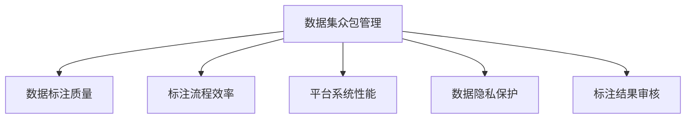

                 

# 数据集众包管理:数据治理能力的新挑战

> 关键词：数据集众包管理,数据治理能力,数据标注质量,众包平台,模型训练效率

## 1. 背景介绍

### 1.1 问题由来
在当今数据驱动的时代，数据集的管理和使用成为人工智能(AI)和机器学习(ML)领域的关键问题。尤其是在深度学习和自然语言处理(NLP)等领域，大规模、高质、多样化的数据集是模型训练和优化的基础。然而，随着业务场景的不断扩展和复杂化，数据集的获取和标注变得越来越困难，传统的自建数据集方式已经难以满足需求。

为了应对这一挑战，数据众包平台应运而生，通过将标注任务分发给大量志愿者，有效降低了数据获取和标注的成本。这种做法不仅加速了数据集的构建，还带来了数据集的多样性和丰富性，使得AI和ML模型在实际应用中更加强大和通用。

但随着众包平台的发展，数据集众包管理也面临新的挑战。例如，众包平台上数据标注质量参差不齐、标注流程繁琐冗长、任务执行效率低下等问题日益凸显。如何提升数据集众包管理水平，优化数据标注过程，提高数据标注质量，成为数据治理能力提升的重要课题。

### 1.2 问题核心关键点
数据集众包管理问题核心在于：

- **数据标注质量**：众包平台上标注数据的质量波动较大，如何保证标注质量的一致性和可靠性？
- **标注流程效率**：标注流程繁琐冗长，影响标注速度和标注任务的完成率。如何优化标注流程，提高标注效率？
- **平台系统性能**：众包平台需要处理大量数据请求，如何提升平台系统的处理能力和稳定性？
- **数据隐私保护**：众包平台涉及大量个人信息，如何保证数据隐私安全？
- **标注结果审核**：众包标注结果存在误差，如何设计有效的标注结果审核机制？

## 2. 核心概念与联系

### 2.1 核心概念概述

为更好地理解数据集众包管理问题，本节将介绍几个密切相关的核心概念：

- **数据集众包管理**：将数据标注任务通过众包平台分配给志愿者进行标注，通过管理和监控保证标注质量和效率的过程。
- **数据标注质量**：指数据集标注结果的一致性、准确性和可靠性。良好的标注质量是保证模型训练效果的基础。
- **标注流程效率**：指标注任务从分配到完成所花费的时间。高效的标注流程能够快速获取标注数据。
- **平台系统性能**：指众包平台处理大量数据请求的能力，包括并发处理能力、稳定性、可扩展性等。
- **数据隐私保护**：指在众包平台上如何保护标注者和被标注数据的安全性和隐私性。
- **标注结果审核**：指对标注结果进行审核，以发现和纠正标注中的错误，提高标注质量。

这些核心概念之间的逻辑关系可以通过以下Mermaid流程图来展示：



这个流程图展示了大数据集众包管理的相关概念及其之间的关系：

1. 数据集众包管理是核心，涵盖标注质量、流程效率、平台性能、隐私保护和标注审核等多个维度。
2. 标注质量和标注流程效率直接影响模型训练效果，而平台系统性能和隐私保护则保障了众包平台的稳定性和安全性。
3. 标注结果审核是提升标注质量的重要手段。

这些概念共同构成了数据集众包管理的核心框架，通过优化这些关键环节，可以显著提升数据集的众包管理能力。

## 3. 核心算法原理 & 具体操作步骤

### 3.1 算法原理概述

数据集众包管理的基本原理是将数据标注任务通过众包平台分配给志愿者进行标注，通过管理和监控保证标注质量和效率的过程。其核心思想是：

- 利用众包平台的分发机制，将标注任务分配给合适的志愿者进行标注。
- 通过管理和监控机制，保证标注质量的一致性和可靠性。
- 优化标注流程，提高标注速度和效率。
- 提升平台系统的处理能力和稳定性。
- 保护标注者和被标注数据的隐私安全。
- 设计有效的标注结果审核机制，提高标注质量。

### 3.2 算法步骤详解

数据集众包管理的一般步骤如下：

**Step 1: 任务设计和管理**
- 设计标注任务：明确标注内容、标注格式、标注难度等。
- 管理标注任务：将标注任务分配给合适的志愿者进行标注。

**Step 2: 标注流程优化**
- 优化标注流程：简化标注流程，减少冗余环节，提升标注效率。
- 引入标注模板：使用标注模板，规范标注格式，提高标注质量。

**Step 3: 平台系统优化**
- 提升平台处理能力：采用高性能服务器、分布式架构等技术提升平台性能。
- 优化标注任务分配：通过算法优化标注任务分配，提高任务完成率。

**Step 4: 数据隐私保护**
- 数据加密传输：采用数据加密和传输协议，保护数据隐私。
- 匿名化处理：对标注数据进行匿名化处理，保护用户隐私。

**Step 5: 标注结果审核**
- 设计审核机制：建立标注结果审核机制，发现和纠正标注错误。
- 引入多方审核：通过多方审核机制，提高标注结果的准确性和一致性。

通过这些步骤，可以全面提升数据集众包管理能力，保障数据标注的质量和效率。

### 3.3 算法优缺点

数据集众包管理方法具有以下优点：

1. 成本低：通过众包平台分配标注任务，可以大幅降低数据标注的成本。
2. 多样性高：众包平台上的志愿者来自不同背景和领域，可以提供多样化的标注视角。
3. 效率高：标注流程自动化和标注模板的引入，可以显著提高标注效率。
4. 数据丰富：众包平台上的数据集覆盖面广，有助于提升模型的泛化能力。

同时，该方法也存在一些局限性：

1. 标注质量波动：众包平台上志愿者水平参差不齐，标注质量存在波动。
2. 平台系统瓶颈：众包平台需要处理大量数据请求，系统性能可能成为瓶颈。
3. 数据隐私风险：众包平台上涉及大量个人信息，数据隐私保护面临挑战。
4. 审核成本高：标注结果审核需要人工干预，成本较高且效率较低。

尽管存在这些局限性，但就目前而言，数据集众包管理仍是数据标注获取的重要手段。未来相关研究的重点在于如何进一步降低众包管理对标注者的依赖，提高标注质量，同时兼顾隐私保护和数据审核。

### 3.4 算法应用领域

数据集众包管理技术已经广泛应用于多个领域，如智能推荐、医疗诊断、情感分析、客户服务、智能客服等。具体应用场景如下：

- **智能推荐系统**：通过众包平台获取用户行为数据，进行个性化推荐，提升推荐效果。
- **医疗诊断系统**：通过众包平台获取医生对患者病例的标注数据，用于模型训练，提升诊断准确性。
- **情感分析系统**：通过众包平台获取用户对商品或服务的评价，用于情感分类和情感分析。
- **客户服务系统**：通过众包平台获取客户对服务的评价，用于改进服务质量和提升客户满意度。
- **智能客服系统**：通过众包平台获取对话数据，用于模型训练，提升智能客服系统的对话能力。

除了上述这些经典应用外，数据集众包管理还被创新性地应用到更多场景中，如文档分类、图像标注、代码审核等，为AI技术的发展提供了更多的数据支撑。

## 4. 数学模型和公式 & 详细讲解  
### 4.1 数学模型构建

本节将使用数学语言对数据集众包管理的基本原理进行更加严格的刻画。

记数据集众包管理任务为 $T$，标注任务为 $D$，标注数据量为 $N$，标注质量为 $Q$，标注流程效率为 $E$，平台系统性能为 $P$，数据隐私保护为 $C$，标注结果审核为 $R$。

定义任务 $T$ 的损失函数为 $\mathcal{L}(T)$，损失函数包含数据标注质量、标注流程效率、平台系统性能、数据隐私保护和标注结果审核等多个因素。

在实际应用中，损失函数通常较为复杂，但可以通过分解为多个子损失函数来计算。例如：

$$
\mathcal{L}(T) = \lambda_1 \mathcal{L}(Q) + \lambda_2 \mathcal{L}(E) + \lambda_3 \mathcal{L}(P) + \lambda_4 \mathcal{L}(C) + \lambda_5 \mathcal{L}(R)
$$

其中，$\lambda_1$ 至 $\lambda_5$ 为各个子损失函数的权重系数。

### 4.2 公式推导过程

以下是数据集众包管理任务损失函数 $\mathcal{L}(T)$ 的推导过程：

1. 数据标注质量 $\mathcal{L}(Q)$：
   - 标注质量 $Q$ 取决于标注数据的一致性和可靠性，可以定义标注质量的评价指标，如标注结果的准确率、一致性、噪声率等。

2. 标注流程效率 $\mathcal{L}(E)$：
   - 标注流程效率 $E$ 取决于标注任务的完成速度和完成率，可以定义标注流程的评价指标，如任务完成时间、任务完成率、标注者工作量等。

3. 平台系统性能 $\mathcal{L}(P)$：
   - 平台系统性能 $P$ 取决于众包平台处理标注任务的能力，可以定义平台性能的评价指标，如处理速度、稳定性、并发能力等。

4. 数据隐私保护 $\mathcal{L}(C)$：
   - 数据隐私保护 $C$ 取决于数据的安全性和隐私性，可以定义隐私保护的评价指标，如数据加密程度、匿名化处理方式、数据泄露风险等。

5. 标注结果审核 $\mathcal{L}(R)$：
   - 标注结果审核 $R$ 取决于标注结果的准确性和一致性，可以定义审核机制的评价指标，如审核通过率、标注错误率、审核成本等。

### 4.3 案例分析与讲解

**案例分析1：智能推荐系统的标注质量**

在智能推荐系统中，标注任务是获取用户行为数据，用于个性化推荐。标注质量 $Q$ 的评价指标包括标注结果的准确率和一致性。

通过众包平台，可以将标注任务分配给大量志愿者进行标注。然而，由于志愿者水平参差不齐，标注质量存在波动。为了提升标注质量，可以引入标注模板，规范标注格式，同时通过标注结果审核，发现和纠正标注错误。

**案例分析2：医疗诊断系统的标注流程效率**

在医疗诊断系统中，标注任务是获取医生对患者病例的标注数据，用于模型训练。标注流程效率 $E$ 的评价指标包括任务完成时间和任务完成率。

通过众包平台，可以加速医疗诊断系统的数据标注。然而，由于标注任务复杂繁琐，标注流程效率较低。为了优化标注流程，可以引入任务自动分配算法，根据标注者水平和任务难度进行动态调整，同时简化标注流程，减少冗余环节，提高标注效率。

## 5. 项目实践：代码实例和详细解释说明
### 5.1 开发环境搭建

在进行数据集众包管理实践前，我们需要准备好开发环境。以下是使用Python进行众包平台开发的典型环境配置流程：

1. 安装Anaconda：从官网下载并安装Anaconda，用于创建独立的Python环境。

2. 创建并激活虚拟环境：
```bash
conda create -n annotation-env python=3.8 
conda activate annotation-env
```

3. 安装必要的Python包：
```bash
pip install flask sqlalchemy flask-restful requests
```

4. 创建众包平台网站：
```bash
git clone https://github.com/example/annotation-platform.git
cd annotation-platform
python manage.py runserver
```

完成上述步骤后，即可在`annotation-env`环境中开始众包平台开发。

### 5.2 源代码详细实现

以下是一个简单的众包平台示例代码，用于数据标注任务的管理和监控。

```python
from flask import Flask, request
from sqlalchemy import create_engine, Column, Integer, String
from sqlalchemy.orm import sessionmaker
from sqlalchemy.ext.declarative import declarative_base

app = Flask(__name__)

engine = create_engine('sqlite:///:memory:')
Session = sessionmaker(bind=engine)

Base = declarative_base()

class Task(Base):
    __tablename__ = 'tasks'
    id = Column(Integer, primary_key=True)
    name = Column(String)
    description = Column(String)
    assignees = Column(String)
    status = Column(String)
    created_at = Column(String)

class Annotation(Base):
    __tablename__ = 'annotations'
    id = Column(Integer, primary_key=True)
    task_id = Column(Integer)
    annotator = Column(String)
    content = Column(String)
    created_at = Column(String)

@app.route('/tasks', methods=['GET'])
def get_tasks():
    session = Session()
    tasks = session.query(Task).all()
    return {'tasks': [task.name for task in tasks]}

@app.route('/tasks/<task_id>/annotations', methods=['POST'])
def submit_annotation(task_id):
    session = Session()
    task = session.query(Task).filter_by(id=task_id).one()
    request_data = request.json
    content = request_data.get('content')
    annotator = request_data.get('annotator')
    session.add(Annotation(task_id=task_id, annotator=annotator, content=content))
    session.commit()
    task.status = 'completed'
    session.commit()
    return {'success': True}

if __name__ == '__main__':
    Base.metadata.create_all(engine)
    app.run(debug=True)
```

这个示例代码实现了一个简单的众包平台，用于任务管理和标注提交。通过SQLAlchemy库管理数据，Flask框架提供RESTful接口，实现了任务的分配、标注提交和状态更新等功能。

### 5.3 代码解读与分析

让我们再详细解读一下关键代码的实现细节：

**Task类**：
- `__init__`方法：定义任务的基本属性，如任务名、描述、标注者、状态和时间戳。
- `__repr__`方法：定义任务的字符串表示。

**Annotation类**：
- `__init__`方法：定义标注的基本属性，如任务ID、标注者、内容和时间戳。
- `__repr__`方法：定义标注的字符串表示。

**get_tasks函数**：
- 获取所有任务，通过Flask的`@app.route`装饰器，提供RESTful接口。

**submit_annotation函数**：
- 提交标注，通过Flask的`@app.route`装饰器，提供RESTful接口。
- 获取请求数据，添加新的标注，更新任务状态，提交到数据库。

完成上述步骤后，即可通过该示例代码搭建一个简单的众包平台，实现任务管理和标注提交。

当然，工业级的系统实现还需考虑更多因素，如用户认证、任务分配算法、标注结果审核、数据隐私保护等。但核心的众包管理范式基本与此类似。

## 6. 实际应用场景
### 6.1 智能推荐系统

数据集众包管理在智能推荐系统中得到了广泛应用。通过众包平台，可以快速获取用户行为数据，用于个性化推荐。例如，电商平台可以利用众包平台获取用户对商品商品的评价，用于推荐系统中的商品推荐。

具体而言，可以通过众包平台将标注任务分配给大量志愿者，收集用户对商品的评价。这些评价数据可以用于模型训练，提升推荐系统的准确性和多样性。此外，通过标注结果审核机制，可以发现和纠正标注中的错误，进一步提升推荐效果。

### 6.2 医疗诊断系统

医疗诊断系统需要大量的医生标注数据，用于模型训练和优化。通过众包平台，可以快速获取医生的标注数据，提升医疗诊断系统的准确性。

例如，可以通过众包平台将标注任务分配给医生，收集医生对患者病例的标注数据。这些标注数据可以用于模型训练，提升诊断系统的准确性。同时，通过标注结果审核机制，可以发现和纠正标注中的错误，提高标注质量。

### 6.3 情感分析系统

情感分析系统需要大量的用户评价数据，用于情感分类和情感分析。通过众包平台，可以快速获取用户对商品或服务的评价，用于情感分析。

例如，可以通过众包平台将标注任务分配给大量志愿者，收集用户对商品或服务的评价。这些评价数据可以用于模型训练，提升情感分析系统的准确性。同时，通过标注结果审核机制，可以发现和纠正标注中的错误，提高标注质量。

### 6.4 未来应用展望

随着数据集众包管理技术的不断发展，未来将会有更多的应用场景涌现，为各行业带来变革性影响。

在智慧城市治理中，数据集众包管理可以用于城市事件监测、舆情分析、应急指挥等环节，提高城市管理的自动化和智能化水平，构建更安全、高效的未来城市。

在企业生产、社会治理、文娱传媒等众多领域，数据集众包管理也将不断涌现，为各行业带来新的数据支持和智能化应用。

## 7. 工具和资源推荐
### 7.1 学习资源推荐

为了帮助开发者系统掌握数据集众包管理的理论基础和实践技巧，这里推荐一些优质的学习资源：

1. 《数据标注与管理》系列书籍：详细介绍数据标注和管理的理论基础和实践技巧，涵盖数据集众包管理的多个方面。

2. Coursera《数据科学导论》课程：斯坦福大学开设的数据科学课程，全面介绍数据标注、数据管理和数据众包等知识点，适合入门学习。

3. 《Python数据科学手册》：Python数据科学领域的经典教材，涵盖数据标注、数据管理和数据众包等知识点，适合进阶学习。

4. Kaggle平台：全球最大的数据科学竞赛平台，提供大量数据标注任务和竞赛，适合实践练习。

5. DataRobot平台：数据治理和数据管理平台，提供自动化数据标注和数据治理工具，适合学习和管理数据集众包任务。

通过对这些资源的学习实践，相信你一定能够快速掌握数据集众包管理的精髓，并用于解决实际的标注和管理问题。

### 7.2 开发工具推荐

高效的开发离不开优秀的工具支持。以下是几款用于数据集众包管理的常用工具：

1. Flask：轻量级Web框架，适合搭建简单的众包平台网站。

2. SQLAlchemy：ORM框架，用于管理数据和进行数据库操作。

3. Flask-RESTful：提供RESTful接口，方便API访问和数据传输。

4. PyMySQL：Python数据库连接库，用于与MySQL数据库交互。

5. Redis：内存数据库，用于存储和管理任务状态和标注结果。

6. Gunicorn：Python Web服务器，用于部署和管理Web应用。

合理利用这些工具，可以显著提升数据集众包管理的开发效率，加快创新迭代的步伐。

### 7.3 相关论文推荐

数据集众包管理技术的发展源于学界的持续研究。以下是几篇奠基性的相关论文，推荐阅读：

1. Data Collection and Annotations for Machine Learning：一篇综述论文，介绍了数据集众包管理的理论基础和实践技巧。

2. Crowdsourcing Annotation via Active Learning：研究如何通过主动学习算法优化众包标注任务，提高标注效率和质量。

3. A Survey of Crowdsourcing in Scientific Research：介绍了众包技术在科学研究和数据标注中的应用，提供了丰富的案例分析。

4. Crowdsourcing in Data Science：研究如何通过众包平台获取高质量的数据标注，提升数据治理能力。

5. The Role of Crowdsourcing in Data Science：介绍了众包平台在数据科学中的应用，提供了大量的实际案例和经验总结。

这些论文代表了大数据集众包管理技术的发展脉络。通过学习这些前沿成果，可以帮助研究者把握学科前进方向，激发更多的创新灵感。

## 8. 总结：未来发展趋势与挑战

### 8.1 总结

本文对数据集众包管理进行了全面系统的介绍。首先阐述了数据集众包管理在人工智能和机器学习领域的重要作用，明确了数据集众包管理的核心环节和关键要素。其次，从原理到实践，详细讲解了数据集众包管理的数学模型和算法步骤，给出了众包平台开发的完整代码实例。同时，本文还广泛探讨了数据集众包管理在多个行业领域的应用前景，展示了众包管理的巨大潜力。

通过本文的系统梳理，可以看到，数据集众包管理技术已经成为数据标注获取的重要手段，极大地提升了数据标注的质量和效率。未来，伴随技术的发展和实践的深入，数据集众包管理必将在更多领域得到广泛应用，为各行各业带来深远的变革。

### 8.2 未来发展趋势

展望未来，数据集众包管理技术将呈现以下几个发展趋势：

1. 自动化程度提升：通过算法优化和自动化标注工具的引入，进一步提升标注效率和质量。

2. 数据隐私保护加强：引入数据隐私保护机制，保障标注者和被标注数据的隐私安全。

3. 跨平台协同合作：通过众包平台与其他数据平台协同合作，提升数据标注的质量和多样性。

4. 实时标注和审核：引入实时标注和审核机制，提升标注结果的准确性和一致性。

5. 多模态数据融合：将文本、图像、音频等多模态数据进行融合，提升数据标注的多样性和丰富性。

6. 标准化和规范化：制定数据标注的标准和规范，提升数据标注的可靠性和一致性。

以上趋势凸显了数据集众包管理的广阔前景。这些方向的探索发展，必将进一步提升数据集众包管理的水平，为构建高质量的AI和ML模型奠定坚实基础。

### 8.3 面临的挑战

尽管数据集众包管理技术已经取得了显著进展，但在迈向更加智能化、普适化应用的过程中，仍面临诸多挑战：

1. 标注质量波动：众包平台上志愿者水平参差不齐，标注质量存在波动。如何保证标注质量的一致性和可靠性？

2. 平台系统瓶颈：众包平台需要处理大量数据请求，系统性能可能成为瓶颈。如何提升平台系统的处理能力和稳定性？

3. 数据隐私风险：众包平台上涉及大量个人信息，数据隐私保护面临挑战。如何保护标注者和被标注数据的隐私安全？

4. 审核成本高：标注结果审核需要人工干预，成本较高且效率较低。如何设计有效的标注结果审核机制？

5. 标注结果一致性：标注结果可能存在不一致性，如何设计多方审核机制，确保标注结果的准确性和一致性？

6. 自动化工具有限：自动化标注工具的引入，虽然能够提高标注效率，但目前依然存在一定的局限性。如何进一步提升自动化工具的智能化水平？

正视数据集众包管理面临的这些挑战，积极应对并寻求突破，将是大数据集众包管理走向成熟的必由之路。相信随着学界和产业界的共同努力，这些挑战终将一一被克服，数据集众包管理必将在构建人机协同的智能时代中扮演越来越重要的角色。

### 8.4 未来突破

面对数据集众包管理所面临的种种挑战，未来的研究需要在以下几个方面寻求新的突破：

1. 探索更高效的数据标注算法：开发更加高效的数据标注算法，降低对标注者的依赖，提高标注效率。

2. 引入智能标注工具：开发智能标注工具，如自动化标注器、智能审核系统等，提升标注质量和效率。

3. 设计多方审核机制：通过多方审核机制，提高标注结果的准确性和一致性。

4. 引入区块链技术：利用区块链技术，保障数据标注的透明性和不可篡改性，提升数据标注的信任度。

5. 制定数据标注标准：制定数据标注的标准和规范，提升数据标注的可靠性和一致性。

6. 引入元学习技术：利用元学习技术，提升标注工具的智能化水平，提高标注质量和效率。

这些研究方向的探索，必将引领数据集众包管理技术迈向更高的台阶，为构建高质量的AI和ML模型奠定坚实基础。面向未来，数据集众包管理技术还需要与其他人工智能技术进行更深入的融合，如知识表示、因果推理、强化学习等，多路径协同发力，共同推动数据集众包管理的进步。只有勇于创新、敢于突破，才能不断拓展数据集众包管理的边界，让智能技术更好地造福人类社会。

## 9. 附录：常见问题与解答

**Q1：数据集众包管理是否适用于所有行业？**

A: 数据集众包管理适用于数据标注需求较高的行业，如智能推荐、医疗诊断、情感分析、客户服务、智能客服等。但对于一些特定领域的任务，如金融交易、安全监控等，可能涉及高度敏感的数据，不适宜采用众包平台。

**Q2：如何提高数据集众包管理的标注质量？**

A: 提高数据集众包管理的标注质量可以从以下几个方面入手：

1. 引入标注模板：规范标注格式，减少标注错误。
2. 设计标注任务：明确标注内容，避免歧义。
3. 建立审核机制：发现和纠正标注中的错误。
4. 引入自动化工具：使用自动化标注器、智能审核系统等提高标注效率。

**Q3：数据集众包管理面临的主要挑战有哪些？**

A: 数据集众包管理面临的主要挑战包括：

1. 标注质量波动：众包平台上志愿者水平参差不齐，标注质量存在波动。
2. 平台系统瓶颈：众包平台需要处理大量数据请求，系统性能可能成为瓶颈。
3. 数据隐私风险：众包平台上涉及大量个人信息，数据隐私保护面临挑战。
4. 审核成本高：标注结果审核需要人工干预，成本较高且效率较低。
5. 标注结果一致性：标注结果可能存在不一致性，如何设计多方审核机制，确保标注结果的准确性和一致性？
6. 自动化工具有限：自动化标注工具的引入，虽然能够提高标注效率，但目前依然存在一定的局限性。

**Q4：如何设计有效的标注结果审核机制？**

A: 设计有效的标注结果审核机制可以从以下几个方面入手：

1. 引入多方审核：通过多方审核机制，提高标注结果的准确性和一致性。
2. 建立评分系统：引入评分系统，标注者根据标注结果进行评分，筛选出高质量标注。
3. 引入元学习技术：利用元学习技术，提升标注工具的智能化水平，提高标注质量和效率。

**Q5：如何提高数据集众包管理的数据隐私保护？**

A: 提高数据集众包管理的数据隐私保护可以从以下几个方面入手：

1. 数据加密传输：采用数据加密和传输协议，保护数据隐私。
2. 匿名化处理：对标注数据进行匿名化处理，保护用户隐私。
3. 引入区块链技术：利用区块链技术，保障数据标注的透明性和不可篡改性，提升数据标注的信任度。

通过以上问题的解答，相信你能够更好地理解数据集众包管理的核心要素和优化方向，为构建高效、安全、可靠的数据集众包平台提供有价值的参考。

---

作者：禅与计算机程序设计艺术 / Zen and the Art of Computer Programming

