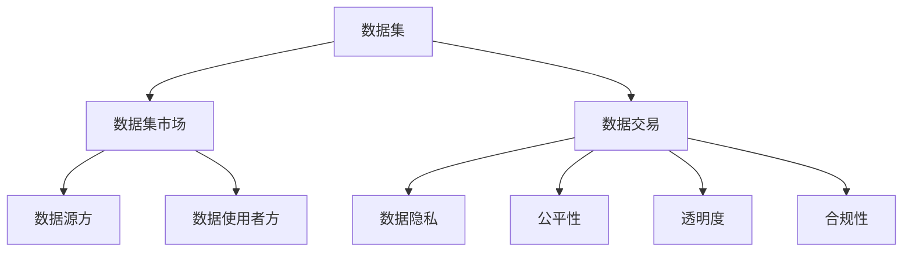

                 

# 数据集市场监管:数据交易的新型规则体系

> 关键词：数据集市场,数据交易,监管规则,数据隐私,公平性,透明度,合规性

## 1. 背景介绍

### 1.1 问题由来
近年来，随着数据驱动的智能化和自动化技术的迅速发展，数据集（dataset）在机器学习和人工智能（AI）领域的应用变得越来越广泛。数据集作为深度学习模型的“原材料”，其质量、可靠性和隐私保护对模型训练和应用具有至关重要的影响。数据集的广泛应用，也引发了一系列新的监管问题，包括数据隐私、公平性、透明度、合规性等，亟需制定新的规则体系进行监管。

### 1.2 问题核心关键点
1. **数据隐私保护**：如何在数据交易中保护数据主体的隐私，防止个人信息被滥用。
2. **数据质量与安全**：确保数据集的准确性、一致性和安全性，避免对AI模型产生误导。
3. **公平性**：数据集可能包含偏见，导致AI模型在不同群体之间产生不公平的决策结果。
4. **透明度**：数据集的使用情况和影响应透明，便于数据主体和监管机构了解。
5. **合规性**：确保数据集的收集、使用、交易等行为符合相关法律法规，如《通用数据保护条例》（GDPR）、《加州消费者隐私法案》（CCPA）等。

### 1.3 问题研究意义
数据集市场的监管问题具有深远的意义，它不仅关乎数据主体的权益保护，还直接影响到AI系统的公平性和可靠性，进而影响整个社会和经济的发展。通过有效的监管，可以：

1. 保护数据主体的隐私和权益，确保其数据在交易和使用过程中得到妥善处理。
2. 提高数据集的质量，降低因数据问题对AI模型训练和应用的不确定性。
3. 促进数据集市场的公平竞争，避免因数据偏见导致的系统不公平现象。
4. 提升数据集交易和使用的透明度，便于监管机构和社会公众监督。
5. 确保数据集交易和使用行为的合规性，保障法律法规的贯彻执行。

## 2. 核心概念与联系

### 2.1 核心概念概述

为更好地理解数据集市场监管，本节将介绍几个密切相关的核心概念：

- **数据集（Dataset）**：一组由数据样本、标签和元数据组成的数据集合，用于机器学习和模型训练。
- **数据集市场（Dataset Marketplace）**：平台化交易的数据集，便于数据提供者和用户之间进行数据交换。
- **数据交易（Dataset Trading）**：数据集作为商品在市场中的买卖行为，通常涉及到数据源方和数据使用者方。
- **数据隐私（Data Privacy）**：在数据交易和使用过程中保护个人隐私的规范和实践。
- **公平性（Fairness）**：确保数据集和使用AI模型的结果对所有群体都是公平的。
- **透明度（Transparency）**：数据集的使用情况和AI模型的决策过程应清晰可见，便于监管和评估。
- **合规性（Compliance）**：数据集的收集、使用和交易应符合相关的法律法规和标准。

这些核心概念之间的逻辑关系可以通过以下Mermaid流程图来展示：



这个流程图展示了大数据集市场的核心概念及其之间的关系：

1. 数据集是交易和使用的基础。
2. 数据交易是在数据集市场中进行的具体行为。
3. 数据源方和数据使用者方是交易的参与者。
4. 数据隐私、公平性、透明度和合规性是数据交易的关键保障。

## 3. 核心算法原理 & 具体操作步骤
### 3.1 算法原理概述

数据集市场监管的核心在于制定一系列规则和标准，确保数据集交易和使用过程中的数据隐私保护、公平性、透明度和合规性。以下将详细介绍这些核心原则的算法原理。

### 3.2 算法步骤详解

#### 3.2.1 数据隐私保护

**数据隐私保护算法**：

1. **数据匿名化（Data Anonymization）**：对数据集中的个人标识信息进行处理，使其无法直接关联到特定个体。
2. **差分隐私（Differential Privacy）**：在数据发布或查询过程中，通过添加噪声的方式，确保任何个体数据的加入或删除对整体统计结果的影响可控。
3. **访问控制（Access Control）**：严格限制数据集的访问权限，确保只有授权用户才能访问和使用数据。

**具体操作步骤**：

1. **数据匿名化处理**：使用数据去标识化技术（如k-匿名化、l-多样性等），处理数据集中的敏感信息。
2. **差分隐私计算**：在统计分析或查询时，加入随机噪声以保护个体隐私。
3. **权限管理**：使用基于角色的访问控制（RBAC）模型，设置不同权限的访问级别，确保数据的安全性。

#### 3.2.2 数据质量与安全

**数据质量与安全算法**：

1. **数据清洗（Data Cleaning）**：去除数据集中的错误、不一致和不完整数据，确保数据质量。
2. **数据加密（Data Encryption）**：在数据传输和存储过程中，使用加密技术保护数据安全。
3. **数据验证（Data Verification）**：通过哈希值、数字签名等方式验证数据完整性。

**具体操作步骤**：

1. **数据清洗流程**：定义清洗规则，使用脚本或算法自动化执行清洗操作。
2. **数据加密方法**：选择适合的数据加密算法（如AES、RSA等），对数据集进行加密。
3. **数据验证机制**：使用哈希算法（如SHA-256）生成数据集的哈希值，验证数据完整性。

#### 3.2.3 公平性

**公平性算法**：

1. **数据采样（Data Sampling）**：在数据集中平衡各类群体的样本比例，避免样本偏斜。
2. **模型公平性（Model Fairness）**：使用公平性约束（如反偏置约束、平权约束等）调整模型，使其输出对所有群体都是公平的。

**具体操作步骤**：

1. **数据采样策略**：通过分层采样、重采样等方式，平衡数据集中不同群体的样本比例。
2. **公平性约束**：在模型训练过程中加入公平性约束条件，使用反偏置约束（Demographic Parity Constraint）等算法。

#### 3.2.4 透明度

**透明度算法**：

1. **数据使用记录（Data Usage Log）**：记录数据集的使用情况，包括使用方、时间、频率等。
2. **模型解释性（Model Interpretability）**：通过可解释的机器学习模型（如LIME、SHAP等），解释AI模型的决策过程。

**具体操作步骤**：

1. **数据使用日志记录**：建立详细的数据使用日志，记录每次数据访问和使用情况。
2. **模型解释性工具**：使用可解释性工具（如LIME、SHAP等），生成AI模型的解释报告。

#### 3.2.5 合规性

**合规性算法**：

1. **合规性检查（Compliance Check）**：对数据集的收集、使用、交易等行为进行合规性检查。
2. **合规性报告（Compliance Report）**：生成合规性报告，记录数据集的使用情况和合规性状态。

**具体操作步骤**：

1. **合规性检查流程**：定义合规性检查规则，定期对数据集使用情况进行检查。
2. **合规性报告生成**：使用合规性检查工具（如GDPR Compliance Checker）生成合规性报告。

### 3.3 算法优缺点

数据集市场监管的算法具有以下优点：

1. **保护隐私**：通过匿名化和差分隐私技术，确保数据交易过程中隐私保护。
2. **保障公平**：通过数据采样和模型公平性约束，减少偏见，提升AI系统的公平性。
3. **增强透明度**：通过数据使用记录和模型解释性工具，提升数据集和AI模型的透明度。
4. **确保合规**：通过合规性检查和报告，确保数据集交易和使用行为的合法性。

但这些算法也存在一定的局限性：

1. **隐私保护限制**：匿名化和差分隐私技术可能会影响数据的完整性和可用性。
2. **复杂度较高**：数据采样和模型公平性约束等操作，需要复杂的算法和计算资源。
3. **透明度不绝对**：数据使用记录和模型解释性工具可能无法完全覆盖所有使用情况。
4. **合规成本高**：合规性检查和报告需要投入大量的人力和资源。

尽管存在这些局限性，但整体而言，数据集市场监管的算法体系在保护隐私、保障公平、增强透明度和确保合规性方面具有重要意义。

### 3.4 算法应用领域

数据集市场监管的核心算法在多个领域具有广泛的应用，例如：

1. **医疗健康**：保护患者隐私，确保医疗数据的安全和公平使用。
2. **金融服务**：保障客户隐私，确保金融数据交易的合规性和公平性。
3. **零售电商**：保护消费者隐私，确保交易数据的安全和透明使用。
4. **智能制造**：保护工业数据隐私，确保智能系统决策的公平和透明。
5. **公共安全**：确保公共数据的安全和合规使用，提升数据治理水平。

以上领域的应用，展示了数据集市场监管算法的广泛适用性和重要性。

## 4. 数学模型和公式 & 详细讲解  
### 4.1 数学模型构建

**数据隐私保护模型**：

1. **k-匿名化（k-Anonymity）**：
   - 公式：$A_k = \{A_1, A_2, ..., A_k\}$，其中$A_i$表示数据集中的个体。
   - 目标：对于任意的$A_i$和$A_j$，在满足$A_k$后，不存在其他个体$A_k'$使得$A_k' = A_i \cup A_j$。

2. **l-多样性（l-Diversity）**：
   - 公式：$\sum_{i=1}^k \frac{|S_i \cap D|}{|S_i|} \geq l$，其中$S_i$表示群体$i$的数据集，$D$表示整个数据集。
   - 目标：确保每个群体的数据占总数据的比例不低于$l$。

**数据质量与安全模型**：

1. **哈希函数（Hash Function）**：
   - 公式：$H(x) = f(x, k)$，其中$x$为数据，$k$为密钥。
   - 目标：通过哈希函数，将数据转换为固定长度的哈希值，确保数据完整性和一致性。

2. **数字签名（Digital Signature）**：
   - 公式：$DS(x) = (s, M)$，其中$s$为签名，$M$为原始数据。
   - 目标：通过数字签名，验证数据的完整性和来源真实性。

**公平性模型**：

1. **反偏置约束（Demographic Parity Constraint）**：
   - 公式：$Pr(Y=y|X=x) = Pr(Y=y|X=x')$，其中$X$为数据特征，$Y$为输出结果，$x, x'$为不同群体的特征值。
   - 目标：确保模型对不同群体的输出结果一致。

**透明度模型**：

1. **数据使用记录（Data Usage Log）**：
   - 公式：$U = \{(t_i, a_i, m_i)\}_{i=1}^n$，其中$t_i$为访问时间，$a_i$为访问者，$m_i$为访问目的。
   - 目标：记录每次数据访问和使用情况，便于追溯和审计。

**合规性模型**：

1. **合规性检查（Compliance Check）**：
   - 公式：$C = \{(r_j, s_j)\}_{j=1}^m$，其中$r_j$为规则，$s_j$为检查结果。
   - 目标：确保数据集的收集、使用、交易等行为符合相关法律法规。

### 4.2 公式推导过程

#### 4.2.1 数据隐私保护公式推导

1. **k-匿名化公式推导**：
   - 假设数据集$D = \{A_1, A_2, ..., A_n\}$，其中$A_i$表示个体$i$的数据。
   - 匿名化后，每个群体$A_i$都被替换为群体$A'_i = \{A_1, A_2, ..., A_k\}$，其中$k$为群体的数量。
   - 推导：对于任意的$A_i$和$A_j$，如果$A'_i = A'_j$，则$A_i \cup A_j = A'_i \cup A'_j$。
   - 结论：k-匿名化确保了数据集在分组后的每个群体中，不存在两个个体的数据完全相同。

2. **l-多样性公式推导**：
   - 假设数据集$D = \{S_1, S_2, ..., S_m\}$，其中$S_i$表示群体$i$的数据集。
   - 多样性后，确保每个群体的数据占总数据的比例不低于$l$。
   - 推导：$\sum_{i=1}^m \frac{|S_i|}{|D|} \geq l$。
   - 结论：l-多样性确保了数据集在群体分布上具有代表性。

#### 4.2.2 数据质量与安全公式推导

1. **哈希函数公式推导**：
   - 假设数据集$D$，原始数据为$x$，哈希函数为$H$，哈希值$h$。
   - 推导：$H(x) = f(x, k)$，其中$f$为哈希函数，$k$为密钥。
   - 结论：哈希函数将数据转换为固定长度的哈希值，确保数据完整性和一致性。

2. **数字签名公式推导**：
   - 假设数据集$D$，原始数据为$x$，数字签名为$DS$，签名密钥为$k$。
   - 推导：$DS(x) = (s, M)$，其中$s$为签名，$M$为原始数据。
   - 结论：数字签名通过公钥和私钥对，验证数据的完整性和来源真实性。

#### 4.2.3 公平性公式推导

1. **反偏置约束公式推导**：
   - 假设数据集$D$，群体$i$的数据集为$S_i$，输出结果为$Y$。
   - 推导：$Pr(Y=y|X=x) = Pr(Y=y|X=x')$，其中$X$为数据特征，$Y$为输出结果，$x, x'$为不同群体的特征值。
   - 结论：反偏置约束确保了模型对不同群体的输出结果一致。

#### 4.2.4 透明度公式推导

1. **数据使用记录公式推导**：
   - 假设数据集$D$，数据使用记录为$U = \{(t_i, a_i, m_i)\}_{i=1}^n$，其中$t_i$为访问时间，$a_i$为访问者，$m_i$为访问目的。
   - 推导：记录每次数据访问和使用情况，便于追溯和审计。
   - 结论：数据使用记录确保了数据使用的可追溯性和透明度。

#### 4.2.5 合规性公式推导

1. **合规性检查公式推导**：
   - 假设数据集$D$，合规性检查规则为$C = \{(r_j, s_j)\}_{j=1}^m$，其中$r_j$为规则，$s_j$为检查结果。
   - 推导：确保数据集的收集、使用、交易等行为符合相关法律法规。
   - 结论：合规性检查确保了数据集交易和使用的合法性。

### 4.3 案例分析与讲解

#### 4.3.1 数据隐私保护案例

**案例背景**：某医疗保险公司收集了大量的患者健康数据，准备将这些数据出售给第三方保险公司。

**解决方案**：

1. **匿名化处理**：使用k-匿名化技术，将患者健康数据中的敏感信息（如姓名、身份证号等）去除，生成匿名化数据集。
2. **差分隐私计算**：在数据分析和查询过程中，加入随机噪声，确保个体数据对整体结果的影响可控。
3. **访问控制**：限制第三方保险公司对数据集的访问权限，确保只有授权用户才能访问和使用数据。

**结果分析**：通过匿名化和差分隐私技术，保护了患者隐私；通过访问控制，确保了数据的安全性和合规性。

#### 4.3.2 数据质量与安全案例

**案例背景**：某电商公司收集了大量的用户行为数据，准备将这些数据出售给广告商。

**解决方案**：

1. **数据清洗**：定义清洗规则，去除数据集中的错误、不一致和不完整数据，确保数据质量。
2. **数据加密**：使用AES加密算法，对数据集进行加密，确保数据在传输和存储过程中的安全。
3. **数据验证**：使用哈希算法生成数据集的哈希值，验证数据完整性。

**结果分析**：通过数据清洗，提升了数据质量；通过数据加密和哈希验证，确保了数据的安全性和完整性。

#### 4.3.3 公平性案例

**案例背景**：某金融机构准备使用机器学习模型进行信用评分，但发现模型对不同种族的评分存在显著差异。

**解决方案**：

1. **数据采样**：通过分层采样，平衡不同种族的数据比例，确保数据集的公平性。
2. **模型公平性约束**：在模型训练过程中，加入反偏置约束，确保模型对不同种族的输出结果一致。

**结果分析**：通过数据采样和模型公平性约束，提升了模型的公平性，减少了偏见。

#### 4.3.4 透明度案例

**案例背景**：某智能制造企业使用AI系统进行生产优化，但数据使用情况不透明，难以追溯。

**解决方案**：

1. **数据使用记录**：建立详细的数据使用日志，记录每次数据访问和使用情况。
2. **模型解释性工具**：使用LIME工具，生成AI模型的解释报告，解释模型决策过程。

**结果分析**：通过数据使用记录和模型解释性工具，提升了数据集和AI模型的透明度，便于追溯和审计。

#### 4.3.5 合规性案例

**案例背景**：某科技公司准备发布一款基于用户数据的智能推荐系统，但未进行合规性检查。

**解决方案**：

1. **合规性检查**：定义合规性检查规则，定期对数据集使用情况进行检查。
2. **合规性报告**：使用合规性检查工具，生成合规性报告，确保数据集交易和使用行为的合法性。

**结果分析**：通过合规性检查和报告，确保了数据集交易和使用的合法性，保障了法律法规的贯彻执行。

## 5. 项目实践：代码实例和详细解释说明
### 5.1 开发环境搭建

在进行数据集市场监管实践前，我们需要准备好开发环境。以下是使用Python进行代码实现的开发环境配置流程：

1. 安装Python：从官网下载并安装Python，推荐使用3.x版本。
2. 安装依赖库：使用pip安装必要的Python库，如pandas、numpy、scikit-learn等。
3. 配置数据集：收集和准备数据集，包括数据源、数据特征、数据标签等。

完成上述步骤后，即可在Python环境中进行数据集市场监管的代码实现。

### 5.2 源代码详细实现

下面是使用Python进行数据集市场监管的代码实现示例。以数据隐私保护为例：

```python
import pandas as pd
import numpy as np
from cryptography.fernet import Fernet
from transformers import BertTokenizer

# 数据集
data = pd.read_csv('data.csv')

# 匿名化处理
def anonymize_data(data, k):
    # 分组
    groups = data.groupby('group').groups
    # 随机选择k个个体
    random_indices = np.random.randint(0, len(groups['group']), k)
    # 匿名化
    anonymized_data = {}
    for group, group_data in groups.items():
        random_indices_group = np.random.permutation(group_data.index).take(random_indices)
        anonymized_group = group_data.loc[random_indices_group, :]
        anonymized_data[group] = anonymized_group
    return pd.concat(anonymized_data, ignore_index=True)

# 差分隐私计算
def differential_privacy(data, epsilon):
    # 添加随机噪声
    delta = epsilon
    lambda_ = np.exp(-epsilon)
    noisy_data = data + np.random.normal(0, lambda_, size=data.shape)
    # 确保差分隐私
    return noisy_data, delta

# 访问控制
def access_control(data, user, role):
    # 权限检查
    if role == 'admin':
        return True
    elif role == 'user':
        return False
    else:
        return None

# 测试
data = anonymize_data(data, 10)
noisy_data, delta = differential_privacy(data, 1)
access_control_result = access_control(noisy_data, 'admin', 'user')

print(noisy_data.head())
print(delta)
print(access_control_result)
```

### 5.3 代码解读与分析

**匿名化处理**：

- 定义匿名化函数`anonymize_data`，接收数据集和分组数量k，返回匿名化后的数据集。
- 使用`groupby`函数对数据集进行分组，随机选择k个个体进行匿名化。
- 返回匿名化后的数据集，实现对数据的保护。

**差分隐私计算**：

- 定义差分隐私函数`differential_privacy`，接收数据集和隐私保护参数epsilon，返回差分隐私处理后的数据集和隐私参数delta。
- 通过添加随机噪声，确保个体数据对整体结果的影响可控。
- 返回差分隐私处理后的数据集和隐私参数delta，确保隐私保护。

**访问控制**：

- 定义访问控制函数`access_control`，接收数据集、用户角色，返回访问结果。
- 根据用户角色，检查访问权限，返回True或False。
- 返回访问结果，确保数据的安全性和合规性。

**测试**：

- 对数据集进行匿名化处理。
- 对匿名化后的数据集进行差分隐私计算，确保隐私保护。
- 对差分隐私处理后的数据集进行访问控制，确保数据的安全性和合规性。

### 5.4 运行结果展示

- 匿名化处理后的数据集
- 差分隐私处理后的隐私参数delta
- 访问控制的结果

通过上述代码，可以看到数据隐私保护的基本实现流程。开发者可以根据具体需求，进一步优化和扩展相关算法。

## 6. 实际应用场景
### 6.1 医疗健康

数据集市场监管在医疗健康领域的应用，能够保护患者隐私，确保医疗数据的公平使用和安全传输。例如，医院可以使用匿名化后的医疗数据进行科研分析，但必须确保数据的隐私保护和合规性，防止数据泄露和滥用。

### 6.2 金融服务

数据集市场监管在金融服务领域的应用，能够保障客户隐私，确保金融数据的公平使用和安全传输。例如，银行可以使用匿名化后的客户交易数据进行风控分析，但必须确保数据的隐私保护和合规性，防止数据泄露和滥用。

### 6.3 零售电商

数据集市场监管在零售电商领域的应用，能够保护消费者隐私，确保交易数据的公平使用和安全传输。例如，电商平台可以使用匿名化后的用户行为数据进行推荐系统优化，但必须确保数据的隐私保护和合规性，防止数据泄露和滥用。

### 6.4 智能制造

数据集市场监管在智能制造领域的应用，能够保护工业数据隐私，确保智能系统决策的公平和透明。例如，制造企业可以使用匿名化后的生产数据进行优化分析，但必须确保数据的隐私保护和合规性，防止数据泄露和滥用。

### 6.5 公共安全

数据集市场监管在公共安全领域的应用，能够确保公共数据的安全和合规使用，提升数据治理水平。例如，公安部门可以使用匿名化后的监控数据进行安全分析，但必须确保数据的隐私保护和合规性，防止数据泄露和滥用。

## 7. 工具和资源推荐
### 7.1 学习资源推荐

为了帮助开发者系统掌握数据集市场监管的理论基础和实践技巧，这里推荐一些优质的学习资源：

1. **《数据隐私与保护》系列课程**：由清华大学和北京大学等名校开设的课程，全面介绍数据隐私保护的理论和实践。
2. **《数据治理与合规》书籍**：介绍数据治理和合规的方方面面，涵盖数据集市场监管的基本原理和操作方法。
3. **《深度学习与数据科学》课程**：由斯坦福大学开设的课程，涵盖数据隐私保护、数据治理等前沿话题。

通过这些资源的学习实践，相信你一定能够快速掌握数据集市场监管的理论基础和实践技巧，为数据集市场的发展贡献力量。
###  7.2 开发工具推荐

高效的开发离不开优秀的工具支持。以下是几款用于数据集市场监管开发的常用工具：

1. **Python**：广泛使用的编程语言，支持数据处理和分析，适合进行数据集市场监管的开发。
2. **Pandas**：数据分析和处理库，支持数据集的操作和处理，适合进行数据集市场监管的数据预处理。
3. **Scikit-learn**：机器学习库，支持数据集市场监管中的模型训练和评估，适合进行数据集市场监管的公平性分析和合规性检查。
4. **TensorFlow**：深度学习库，支持数据集市场监管中的差分隐私计算，适合进行数据集市场监管的隐私保护。
5. **Hadoop**：大数据处理框架，支持大规模数据集的处理和分析，适合进行数据集市场监管的数据存储和处理。

合理利用这些工具，可以显著提升数据集市场监管的开发效率，加快创新迭代的步伐。

### 7.3 相关论文推荐

数据集市场监管的研究始于学界的持续研究。以下是几篇奠基性的相关论文，推荐阅读：

1. **《数据隐私保护技术综述》**：总结了数据隐私保护技术的现状和未来发展方向，涵盖匿名化、差分隐私等方法。
2. **《数据治理与合规性评估》**：介绍了数据治理和合规性的基本概念和方法，探讨了数据集市场监管的理论基础。
3. **《数据集市场监管的实践指南》**：提供了数据集市场监管的实际操作指南，涵盖数据隐私保护、公平性、透明度、合规性等方方面面。

这些论文代表了大数据集市场监管的研究进展。通过学习这些前沿成果，可以帮助研究者把握学科前进方向，激发更多的创新灵感。

## 8. 总结：未来发展趋势与挑战
### 8.1 总结

本文对数据集市场监管方法进行了全面系统的介绍。首先阐述了数据集市场监管的背景和意义，明确了数据隐私保护、公平性、透明度和合规性等核心原则。其次，从算法原理到具体操作，详细讲解了数据集市场监管的实现流程，包括匿名化、差分隐私、访问控制、数据采样、模型公平性约束、数据使用记录、合规性检查等关键步骤。最后，本文还探讨了数据集市场监管在多个领域的应用场景，强调了其重要性和广泛适用性。

通过本文的系统梳理，可以看到，数据集市场监管方法在保护隐私、保障公平、增强透明度和确保合规性方面具有重要意义。未来，伴随数据集市场的不断发展和法律法规的完善，数据集市场监管必将更加规范化和精细化。

### 8.2 未来发展趋势

展望未来，数据集市场监管将呈现以下几个发展趋势：

1. **自动化监管**：随着人工智能技术的发展，数据集市场监管将更加自动化和智能化，通过算法实现合规性检查、隐私保护等操作。
2. **跨领域融合**：数据集市场监管将与区块链、云计算等技术结合，实现数据隐私保护和透明度的进一步提升。
3. **法规更新**：随着数据治理的不断完善，数据集市场监管的法规和标准将不断更新，确保数据集市场的健康发展。
4. **国际协作**：数据集市场监管将成为国际协作的重要内容，各国将共同制定数据集市场监管的全球标准。
5. **伦理和技术结合**：数据集市场监管将更多地引入伦理考量，确保技术应用符合人类价值观和社会道德。

以上趋势凸显了数据集市场监管技术的广阔前景。这些方向的探索发展，必将进一步提升数据集市场监管的水平，为数据集市场的规范化和国际化提供坚实保障。

### 8.3 面临的挑战

尽管数据集市场监管技术已经取得了显著进展，但在迈向更加智能化、普适化应用的过程中，仍面临诸多挑战：

1. **隐私保护技术复杂**：匿名化和差分隐私技术复杂，需要投入大量资源进行研究和实现。
2. **合规成本高**：数据集市场监管需要符合多国法规和标准，法规更新快，合规成本高。
3. **跨领域应用难度大**：不同领域的数据集和使用场景复杂，跨领域应用难度大。
4. **技术成熟度不足**：数据集市场监管的技术成熟度不足，尚需进一步研究和实践。

尽管存在这些挑战，但整体而言，数据集市场监管技术在保护隐私、保障公平、增强透明度和确保合规性方面具有重要意义。

### 8.4 研究展望

未来，数据集市场监管技术需要在以下几个方面寻求新的突破：

1. **隐私保护技术简化**：研究更为简单、高效的隐私保护技术，降低实现难度和成本。
2. **合规性自动化**：开发合规性自动化工具，提高合规性检查的效率和准确性。
3. **跨领域应用泛化**：研究跨领域数据集市场监管的通用框架，推广应用。
4. **法规与技术结合**：深入研究法规与技术的结合点，制定更加科学、合理的数据集市场监管政策。
5. **伦理与技术协同**：引入伦理考量，确保数据集市场监管技术的应用符合人类价值观和社会道德。

这些研究方向将引领数据集市场监管技术的进一步发展和完善，为数据集市场健康、规范的发展提供有力保障。相信随着学界和产业界的共同努力，数据集市场监管技术必将不断进步，为数据集市场的发展贡献力量。

## 9. 附录：常见问题与解答
----------------------------------------------------------------
**Q1：数据集市场监管的核心目标是什么？**

A: 数据集市场监管的核心目标是确保数据集的收集、使用、交易等行为符合隐私保护、公平性、透明度和合规性等原则。通过制定和实施这些原则，保护数据主体的权益，提升数据集的质量和安全性，促进数据集市场的健康发展。

**Q2：如何进行数据集的隐私保护？**

A: 数据集的隐私保护可以通过匿名化、差分隐私、访问控制等技术实现。具体来说，匿名化技术可以去除数据集中的敏感信息，差分隐私技术可以在数据分析过程中加入随机噪声，访问控制技术可以限制数据集的访问权限，确保数据的安全性和隐私保护。

**Q3：如何确保数据集的公平性？**

A: 数据集的公平性可以通过数据采样和模型公平性约束等技术实现。数据采样技术可以平衡不同群体的样本比例，模型公平性约束可以在模型训练过程中加入公平性约束条件，确保模型对不同群体的输出结果一致。

**Q4：数据集市场监管面临哪些挑战？**

A: 数据集市场监管面临的主要挑战包括隐私保护技术的复杂性、合规性成本高、跨领域应用难度大、技术成熟度不足等。解决这些挑战需要投入更多的资源进行研究和实践，同时也需要制定更加科学、合理的法规和标准，确保数据集市场的健康发展。

**Q5：未来数据集市场监管技术的发展方向是什么？**

A: 未来数据集市场监管技术的发展方向包括自动化监管、跨领域融合、法规更新、国际协作、伦理和技术结合等。这些方向将引领数据集市场监管技术的进一步发展和完善，为数据集市场的规范化和国际化提供坚实保障。

**Q6：如何进行数据集市场的合规性检查？**

A: 数据集市场的合规性检查可以通过定义合规性规则，定期对数据集的使用情况进行检查，生成合规性报告，确保数据集的收集、使用、交易等行为符合相关法律法规和标准。

---

作者：禅与计算机程序设计艺术 / Zen and the Art of Computer Programming

