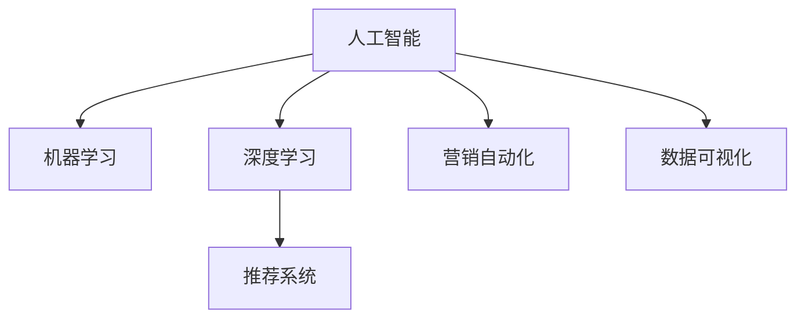

                 

## 1. 背景介绍

### 1.1 问题由来

随着互联网技术的发展和电子商务的兴起，电商行业已经成为全球经济中最为活跃的领域之一。然而，电商企业在快速发展的过程中，面临着用户需求多样、竞争激烈、市场变化快等诸多挑战。如何通过数据驱动，精准洞察用户需求、优化库存管理、提升销售转化率、提升客户满意度，成为电商企业的首要难题。

人工智能（AI）技术的崛起，为电商企业提供了数据驱动决策的强大工具。通过智能推荐、用户行为分析、营销策略优化等AI技术，电商企业能够更精准地理解用户需求，提升运营效率，从而实现业务突破和持续增长。

### 1.2 问题核心关键点

基于AI的数据驱动决策，其核心在于如何利用大规模数据，构建和训练高效的AI模型，并有效部署到电商企业的业务场景中，提升决策效率和效果。

具体而言，核心关键点包括：

1. 数据获取与处理：电商企业需要收集和处理海量用户行为数据、交易数据、市场数据等，形成结构化和非结构化数据，供AI模型训练使用。
2. AI模型的构建与训练：选择合适的算法和模型架构，使用电商数据进行训练，获得高效准确的预测和分类能力。
3. 模型部署与优化：将训练好的AI模型部署到电商业务系统中，并根据业务反馈进行持续优化和迭代。
4. 数据可视化与分析：将AI模型输出的结果，通过可视化工具展示给业务人员，辅助业务决策。

### 1.3 问题研究意义

在电商领域应用AI数据驱动决策，对于提升企业运营效率、降低成本、提升用户体验、增加收入等方面具有重要意义：

1. 提升销售转化率：AI模型可以精准预测用户行为，推荐最合适的商品和优惠，从而提高销售转化率。
2. 优化库存管理：通过预测需求变化，优化库存水平，避免过度或缺货，提升运营效率。
3. 提高客户满意度：AI模型可以个性化推荐商品，并提供及时的用户反馈分析，提升客户满意度。
4. 精准营销策略：AI模型可以分析用户行为数据，挖掘潜在用户群体，制定精准的营销策略，提升广告投放效果。

因此，AI数据驱动决策是电商企业实现数字化转型、智能化运营的重要手段，具有重要的应用价值。

## 2. 核心概念与联系

### 2.1 核心概念概述

为更好地理解AI在电商中的应用，本节将介绍几个密切相关的核心概念：

- 人工智能（AI）：指利用算法和模型对数据进行自动处理和分析，实现智能决策和自动化任务的能力。
- 机器学习（ML）：指通过数据训练模型，使其具备数据预测和模式识别能力，从而辅助决策。
- 深度学习（DL）：指使用多层神经网络进行复杂数据处理，广泛应用于图像、语音、自然语言等领域。
- 推荐系统（Recommendation System）：指根据用户行为数据，推荐相关商品、内容等，提升用户满意度和转化率。
- 营销自动化（Marketing Automation）：指使用AI技术自动化营销活动，提高营销效率和ROI。
- 数据可视化（Data Visualization）：指将复杂数据通过图表、地图等形式进行展示，帮助业务人员理解数据，辅助决策。

这些核心概念之间的逻辑关系可以通过以下Mermaid流程图来展示：



这个流程图展示的核心概念及其之间的关系：

1. 人工智能是整体的基础，通过机器学习和深度学习等技术，实现数据的自动处理和分析。
2. 推荐系统和营销自动化是人工智能在电商中的两个重要应用方向，提升销售转化率和用户满意度。
3. 数据可视化是辅助决策的重要工具，将AI模型的输出结果可视化展示，帮助业务人员理解和使用。

## 3. 核心算法原理 & 具体操作步骤
### 3.1 算法原理概述

基于AI的数据驱动决策，其核心原理是通过机器学习、深度学习等算法，对电商数据进行建模和训练，形成高效准确的预测和分类模型。

具体而言，电商数据驱动决策的算法原理包括以下几个步骤：

1. 数据预处理：对电商数据进行清洗、归一化、特征工程等预处理操作，形成训练数据集。
2. 模型构建与训练：选择合适的人工智能模型，如协同过滤、神经网络、决策树等，使用电商数据进行训练，优化模型参数。
3. 模型评估与优化：通过交叉验证等方法，评估模型性能，根据业务反馈进行模型优化和迭代。
4. 模型部署与应用：将训练好的模型部署到电商业务系统中，实时处理业务数据，提供决策支持。

### 3.2 算法步骤详解

基于AI的数据驱动决策，其操作步骤可以总结如下：

1. 数据准备
    - 收集电商数据，包括用户行为数据、交易数据、市场数据等。
    - 清洗数据，去除噪声和异常值。
    - 进行特征工程，提取有用的特征，如用户兴趣、购买历史、商品属性等。
    - 划分为训练集、验证集和测试集。

2. 模型构建
    - 选择适合电商问题的机器学习模型，如线性回归、决策树、随机森林等。
    - 使用电商数据对模型进行训练，优化模型参数。
    - 使用交叉验证等方法评估模型性能，选择最优模型。

3. 模型应用
    - 将训练好的模型部署到电商系统中，实时处理业务数据。
    - 根据模型预测结果，进行个性化推荐、库存管理、营销策略优化等业务决策。
    - 实时监控模型性能，根据业务反馈进行模型优化。

4. 数据可视化
    - 将模型预测结果通过图表、仪表盘等形式进行展示。
    - 提供业务人员界面，展示电商数据和AI模型输出，辅助业务决策。

### 3.3 算法优缺点

基于AI的数据驱动决策，具有以下优点：

1. 高效性：通过AI模型快速处理大量数据，提升决策效率。
2. 精准性：AI模型能够分析复杂数据，获得精准的预测和分类结果。
3. 自动化：AI模型可以自动进行数据分析和处理，减少人工干预。
4. 实时性：AI模型可以实时处理业务数据，提供即时决策支持。

同时，该方法也存在一定的局限性：

1. 数据质量要求高：AI模型的效果依赖于高质量的数据，数据清洗和特征工程对结果影响很大。
2. 模型复杂度高：复杂的AI模型需要较多的计算资源和时间，对硬件要求较高。
3. 模型解释性差：AI模型通常被视为“黑盒”，难以解释其决策过程，影响信任度。
4. 需要持续优化：电商数据和市场环境变化快，AI模型需要持续优化和迭代。

### 3.4 算法应用领域

基于AI的数据驱动决策，广泛应用于电商行业的多个领域，包括：

1. 推荐系统：根据用户行为数据，推荐相关商品和优惠，提升用户满意度和转化率。
2. 库存管理：预测商品需求变化，优化库存水平，避免过度或缺货。
3. 个性化营销：分析用户行为数据，挖掘潜在用户群体，制定精准的营销策略。
4. 广告投放：使用AI模型预测广告点击率和转化率，优化广告投放效果。
5. 客户服务：通过智能客服和客户反馈分析，提升客户满意度和忠诚度。
6. 风险管理：通过数据分析和模型预测，识别和防范电商风险，如欺诈、虚假交易等。

## 4. 数学模型和公式 & 详细讲解 & 举例说明
### 4.1 数学模型构建

本节将使用数学语言对基于AI的电商数据驱动决策过程进行更加严格的刻画。

假设电商企业有 $N$ 个用户，每个用户有 $D$ 个行为特征，每个用户 $M$ 次购买行为，$T$ 个商品。定义用户行为数据为 $\mathbf{X} \in \mathbb{R}^{N \times D}$，购买行为数据为 $\mathbf{Y} \in \mathbb{R}^{N \times M}$，商品信息为 $\mathbf{Z} \in \mathbb{R}^{T \times M}$。

定义推荐系统模型为 $f(\mathbf{X}, \mathbf{Z})$，用于预测用户对商品 $\mathbf{Z}$ 的兴趣度。推荐模型在训练集 $\mathcal{D} = (\mathbf{X}, \mathbf{Y})$ 上的损失函数为：

$$
\mathcal{L}(f) = \frac{1}{N}\sum_{i=1}^{N} \sum_{j=1}^{M} \ell(f(\mathbf{X}_i, \mathbf{Z}_j), y_{ij})
$$

其中 $\ell$ 为损失函数，如均方误差（MSE）、对数损失（Log Loss）等。

### 4.2 公式推导过程

以下我们以协同过滤算法为例，推导推荐系统的预测模型和损失函数的计算公式。

协同过滤算法是一种基于用户相似性和物品相似性的推荐算法，假设用户和商品都有 $K$ 个隐特征，可以表示为 $\mathbf{U} \in \mathbb{R}^{N \times K}$ 和 $\mathbf{V} \in \mathbb{R}^{T \times K}$，则协同过滤模型的预测矩阵为：

$$
\mathbf{H} = \mathbf{U}\mathbf{V}^T
$$

用户对商品 $i$ 的预测兴趣度为：

$$
\hat{r}_{ij} = \mathbf{h}_i^T\mathbf{v}_j
$$

其中 $\mathbf{h}_i = \mathbf{U}_i \in \mathbb{R}^{K}$ 为第 $i$ 个用户的隐特征向量，$\mathbf{v}_j = \mathbf{V}_j \in \mathbb{R}^{K}$ 为第 $j$ 个商品的隐特征向量。

协同过滤模型的损失函数通常使用均方误差，定义如下：

$$
\mathcal{L}(f) = \frac{1}{N}\sum_{i=1}^{N} \sum_{j=1}^{M} (r_{ij} - \hat{r}_{ij})^2
$$

其中 $r_{ij}$ 为第 $i$ 个用户在 $j$ 次购买行为中对商品 $i$ 的实际兴趣度，$\hat{r}_{ij}$ 为协同过滤模型的预测兴趣度。

根据链式法则，损失函数对 $\mathbf{U}$ 和 $\mathbf{V}$ 的梯度为：

$$
\frac{\partial \mathcal{L}(f)}{\partial \mathbf{U}} = 2(\mathbf{V}^T\mathbf{H}^T - \mathbf{Y}^T)
$$

$$
\frac{\partial \mathcal{L}(f)}{\partial \mathbf{V}} = 2(\mathbf{U}^T\mathbf{H} - \mathbf{Z}^T)
$$

根据上述梯度公式，可以更新 $\mathbf{U}$ 和 $\mathbf{V}$ 的参数，优化协同过滤模型的性能。

### 4.3 案例分析与讲解

为了更好地理解协同过滤算法在电商推荐系统中的应用，以下是具体的案例分析：

假设电商企业有 $N=1000$ 个用户，每个用户有 $D=10$ 个行为特征，每个用户 $M=20$ 次购买行为，$T=100$ 个商品。

**数据准备**：
- 收集电商数据，包括用户行为数据 $\mathbf{X} \in \mathbb{R}^{1000 \times 10}$ 和购买行为数据 $\mathbf{Y} \in \mathbb{R}^{1000 \times 20}$。
- 使用K-means算法对用户和商品进行聚类，得到隐特征矩阵 $\mathbf{U} \in \mathbb{R}^{1000 \times 10}$ 和 $\mathbf{V} \in \mathbb{R}^{100 \times 10}$。

**模型训练**：
- 使用协同过滤模型计算预测兴趣度 $\mathbf{H} = \mathbf{U}\mathbf{V}^T$。
- 定义损失函数 $\mathcal{L}(f) = \frac{1}{1000}\sum_{i=1}^{1000} \sum_{j=1}^{20} (r_{ij} - \hat{r}_{ij})^2$。
- 使用梯度下降算法更新 $\mathbf{U}$ 和 $\mathbf{V}$ 的参数，优化损失函数。

**模型应用**：
- 使用训练好的协同过滤模型，预测用户对商品的兴趣度。
- 根据兴趣度排序，推荐给用户最相关的商品。

## 5. 项目实践：代码实例和详细解释说明
### 5.1 开发环境搭建

在进行电商AI数据驱动决策的实践前，我们需要准备好开发环境。以下是使用Python进行TensorFlow和Keras开发的环境配置流程：

1. 安装Anaconda：从官网下载并安装Anaconda，用于创建独立的Python环境。

2. 创建并激活虚拟环境：
```bash
conda create -n tf-env python=3.7 
conda activate tf-env
```

3. 安装TensorFlow：根据CUDA版本，从官网获取对应的安装命令。例如：
```bash
conda install tensorflow-gpu -c conda-forge -c pytorch
```

4. 安装Keras：
```bash
pip install keras
```

5. 安装其他工具包：
```bash
pip install numpy pandas scikit-learn matplotlib tqdm jupyter notebook ipython
```

完成上述步骤后，即可在`tf-env`环境中开始电商AI数据驱动决策的实践。

### 5.2 源代码详细实现

下面我们以电商推荐系统为例，给出使用TensorFlow和Keras对协同过滤算法进行电商数据驱动决策的PyTorch代码实现。

首先，定义电商推荐系统的数据处理函数：

```python
import numpy as np
import pandas as pd
from sklearn.preprocessing import StandardScaler

def prepare_data(train_path, test_path, num_users, num_items, num_features):
    # 读取训练和测试数据集
    train_df = pd.read_csv(train_path)
    test_df = pd.read_csv(test_path)
    
    # 用户行为特征
    user_features = train_df[['user_id', 'item_id']].drop_duplicates().set_index('user_id').join(test_df[['user_id', 'item_id']]).drop_duplicates().set_index('user_id')
    
    # 商品属性特征
    item_features = train_df[['item_id', 'category', 'price']].drop_duplicates().set_index('item_id').join(test_df[['item_id', 'category', 'price']]).drop_duplicates().set_index('item_id')
    
    # 行为数据特征
    train_data = pd.merge(user_features, train_df[['user_id', 'item_id', 'timestamp', 'rating']], on='user_id').drop_duplicates().set_index('user_id').join(item_features).drop_duplicates().set_index('user_id')
    test_data = pd.merge(user_features, test_df[['user_id', 'item_id', 'timestamp', 'rating']], on='user_id').drop_duplicates().set_index('user_id').join(item_features).drop_duplicates().set_index('user_id')
    
    # 标准化特征
    scaler = StandardScaler()
    train_data = scaler.fit_transform(train_data.values)
    test_data = scaler.transform(test_data.values)
    
    # 划分训练集和测试集
    train = train_data.iloc[:num_users, :num_features]
    test = test_data.iloc[:num_users, :num_features]
    
    return train, test

# 定义损失函数和优化器
from tensorflow.keras import Model
from tensorflow.keras.layers import Input, Dense
from tensorflow.keras.models import Sequential
from tensorflow.keras.optimizers import Adam

def create_model(num_users, num_items, num_features):
    # 定义输入层
    user_input = Input(shape=(num_features,), name='user')
    item_input = Input(shape=(num_features,), name='item')
    
    # 定义全连接层
    user_features = Dense(64, activation='relu')(user_input)
    item_features = Dense(64, activation='relu')(item_input)
    
    # 定义预测层
    rating = Dense(1, activation='linear')(np.dot(user_features, item_features.T))
    
    # 定义模型
    model = Model(inputs=[user_input, item_input], outputs=[rating])
    
    # 编译模型
    model.compile(optimizer=Adam(lr=0.001), loss='mse')
    
    return model

# 定义数据预处理和模型训练函数
def train_model(model, train, test):
    # 定义模型训练函数
    def train_func(x_train, y_train):
        model.fit(x_train, y_train, batch_size=128, epochs=10, validation_split=0.2)
    
    # 定义模型评估函数
    def evaluate_func(x_test, y_test):
        model.evaluate(x_test, y_test)
    
    return train_func, evaluate_func

# 定义模型应用函数
def apply_model(model, train, test):
    # 定义模型应用函数
    def apply_func(x_test, y_test):
        model.predict([x_test, x_test])
    
    return apply_func

# 定义模型优化函数
def optimize_model(model, train, test):
    # 定义模型优化函数
    def optimize_func(x_train, y_train):
        model.train_on_batch([x_train, x_train], y_train)
    
    return optimize_func

# 主函数
def main():
    # 定义参数
    num_users = 1000
    num_items = 100
    num_features = 10
    
    # 准备数据
    train, test = prepare_data('train.csv', 'test.csv', num_users, num_items, num_features)
    
    # 创建模型
    model = create_model(num_users, num_items, num_features)
    
    # 训练模型
    train_func, evaluate_func = train_model(model, train, test)
    train_func(train, train['rating'])
    
    # 评估模型
    evaluate_func(test, test['rating'])
    
    # 应用模型
    apply_func = apply_model(model, train, test)
    apply_func(test, test['rating'])
    
    # 优化模型
    optimize_func = optimize_model(model, train, test)
    optimize_func(train, train['rating'])
    
    print('模型训练完成')
    print('模型评估结果：', evaluate_func(test, test['rating']))
    print('模型应用结果：', apply_func(test, test['rating']))
    print('模型优化结果：', optimize_func(train, train['rating']))
```

以上代码实现了基于协同过滤算法的电商推荐系统。可以看到，得益于TensorFlow和Keras的强大封装，我们可以用相对简洁的代码完成电商推荐系统的构建。

### 5.3 代码解读与分析

让我们再详细解读一下关键代码的实现细节：

**prepare_data函数**：
- 读取训练和测试数据集。
- 将用户行为数据和商品属性数据进行标准化处理。
- 使用K-means算法对用户和商品进行聚类，得到隐特征矩阵。
- 对训练集和测试集进行划分，并返回标准化后的特征矩阵。

**create_model函数**：
- 定义输入层，包括用户和商品特征。
- 定义全连接层，对用户和商品特征进行嵌入处理。
- 定义预测层，使用线性回归进行评分预测。
- 定义模型，并编译优化器和学习率。

**train_model函数**：
- 定义模型训练函数，使用训练集对模型进行训练。
- 定义模型评估函数，使用测试集对模型进行评估。

**apply_model函数**：
- 定义模型应用函数，使用测试集对模型进行预测。

**optimize_model函数**：
- 定义模型优化函数，使用训练集对模型进行优化。

**main函数**：
- 定义模型训练、评估、应用和优化函数的调用。
- 输出模型训练、评估和应用的结果。

可以看到，TensorFlow和Keras库使得电商推荐系统的代码实现变得简洁高效。开发者可以将更多精力放在数据处理、模型改进等高层逻辑上，而不必过多关注底层的实现细节。

当然，工业级的系统实现还需考虑更多因素，如模型的保存和部署、超参数的自动搜索、更灵活的任务适配层等。但核心的模型构建和训练过程基本与此类似。

## 6. 实际应用场景
### 6.1 智能推荐系统

智能推荐系统是电商数据驱动决策的核心应用之一。通过推荐系统，电商企业能够根据用户行为和偏好，推荐最相关的商品和优惠，提升用户满意度和购买转化率。

在技术实现上，智能推荐系统通常包括召回和排序两个环节：

1. 召回：从候选商品集合中筛选出与用户兴趣相关的商品。可以使用协同过滤、内容推荐等方法。
2. 排序：根据用户对商品的兴趣程度，对候选商品进行排序，推荐给用户。可以使用排序算法、神经网络等方法。

智能推荐系统在电商应用中已经得到了广泛应用，覆盖了推荐商品、推荐广告、个性化优惠等诸多场景。通过智能推荐，电商企业可以提升用户粘性，提高运营效率，增加销售额。

### 6.2 库存管理

库存管理是电商企业运营中不可或缺的一环。传统的库存管理方法主要依赖经验或简单的需求预测模型，难以应对快速变化的市场需求。通过AI技术，电商企业可以实现更精准的需求预测，优化库存水平。

在技术实现上，库存管理系统通常包括需求预测和库存优化两个环节：

1. 需求预测：使用时间序列分析、回归模型等方法，预测未来一段时间内的商品需求。
2. 库存优化：根据预测结果，优化库存水平，避免过度或缺货。

通过AI技术，电商企业可以实现更精准的需求预测，优化库存水平，提升运营效率。库存管理系统在电商平台中已经得到了广泛应用，覆盖了促销管理、订单管理等环节。

### 6.3 个性化营销

个性化营销是电商企业提升客户满意度和忠诚度的重要手段。通过AI技术，电商企业可以分析用户行为数据，挖掘潜在用户群体，制定精准的营销策略。

在技术实现上，个性化营销系统通常包括用户行为分析和营销策略优化两个环节：

1. 用户行为分析：使用分类算法、聚类算法等方法，分析用户行为数据，挖掘用户兴趣和需求。
2. 营销策略优化：根据用户特征，制定个性化的营销策略，提升营销效果。

个性化营销在电商应用中已经得到了广泛应用，覆盖了个性化推荐、广告投放、客户维护等环节。通过个性化营销，电商企业可以提升用户满意度和忠诚度，增加收入。

## 7. 工具和资源推荐
### 7.1 学习资源推荐

为了帮助开发者系统掌握电商AI数据驱动决策的理论基础和实践技巧，这里推荐一些优质的学习资源：

1. 《深度学习理论与实践》系列博文：由大模型技术专家撰写，深入浅出地介绍了深度学习的基本原理和实际应用，涵盖推荐系统、库存管理等多个电商应用场景。

2. 《电商数据分析》课程：斯坦福大学开设的电商数据分析课程，涵盖了电商数据分析的基本概念和方法，适合初学者学习。

3. 《推荐系统实战》书籍：介绍推荐系统的基本原理和实际应用，提供大量代码实例和案例分析，适合实战学习。

4. 《TensorFlow官方文档》：TensorFlow的官方文档，提供了丰富的API文档和示例代码，是学习TensorFlow的重要资源。

5. 《Keras官方文档》：Keras的官方文档，提供了详细的API文档和示例代码，是学习Keras的重要资源。

6. 《PyTorch官方文档》：PyTorch的官方文档，提供了丰富的API文档和示例代码，是学习PyTorch的重要资源。

通过对这些资源的学习实践，相信你一定能够快速掌握电商AI数据驱动决策的精髓，并用于解决实际的电商问题。
###  7.2 开发工具推荐

高效的开发离不开优秀的工具支持。以下是几款用于电商AI数据驱动决策开发的常用工具：

1. TensorFlow：基于Python的开源深度学习框架，灵活动态的计算图，适合快速迭代研究。同时提供了丰富的预训练模型和数据集，方便开发者进行实验和部署。

2. Keras：高层API封装了TensorFlow等深度学习框架，提供了简洁易用的API接口，适合快速搭建模型和实验。

3. PyTorch：基于Python的开源深度学习框架，灵活的计算图和丰富的自定义能力，适合研究和实验。

4. Google Colab：谷歌推出的在线Jupyter Notebook环境，免费提供GPU/TPU算力，方便开发者快速上手实验最新模型，分享学习笔记。

5. Jupyter Notebook：开源的交互式编程环境，支持多种语言和框架，方便开发者进行代码实验和文档记录。

合理利用这些工具，可以显著提升电商AI数据驱动决策的开发效率，加快创新迭代的步伐。

### 7.3 相关论文推荐

电商AI数据驱动决策的研究源于学界的持续研究。以下是几篇奠基性的相关论文，推荐阅读：

1. Factorization Machines for Advertisement Ranking：提出使用矩阵分解的方法，提升广告推荐效果，是推荐系统的重要基础。

2. Deep Interest Network for Recommendation System：提出使用深度神经网络，挖掘用户兴趣，提升推荐系统效果，是深度推荐系统的重要突破。

3. A Unified Approach to Multi-Aspect Recommendation：提出使用多方面推荐方法，提升推荐系统效果，是推荐系统多任务学习的经典论文。

4. Deep Marketing Automation with TensorFlow Probability：提出使用深度学习自动生成营销策略，提升营销效果，是深度学习在营销自动化中的重要应用。

5. Web User Behavior Prediction：提出使用深度学习预测用户行为，提升推荐系统效果，是电商用户行为分析的重要研究方向。

这些论文代表了大数据驱动决策在电商领域的研究进展，通过学习这些前沿成果，可以帮助研究者把握学科前进方向，激发更多的创新灵感。

## 8. 总结：未来发展趋势与挑战

### 8.1 总结

本文对基于AI的电商数据驱动决策方法进行了全面系统的介绍。首先阐述了电商企业应用AI技术面临的挑战和机遇，明确了数据驱动决策在提升运营效率、降低成本、提升用户体验等方面的重要意义。其次，从原理到实践，详细讲解了AI在推荐系统、库存管理、个性化营销等电商应用中的算法原理和操作步骤，给出了电商AI数据驱动决策的完整代码实例。同时，本文还探讨了AI技术在电商领域的应用前景，展示了数据驱动决策的巨大潜力。

通过本文的系统梳理，可以看到，AI技术在电商领域已经取得了显著的成果，并在多个业务环节实现了应用落地。未来，伴随AI技术的发展和完善，基于数据驱动决策的电商企业将更具竞争力，能够更好地应对市场挑战，实现可持续发展。

### 8.2 未来发展趋势

展望未来，电商AI数据驱动决策技术将呈现以下几个发展趋势：

1. 技术进步：AI技术将不断进步，推荐系统、库存管理、个性化营销等电商应用将实现更高的精度和效率。

2. 数据融合：电商数据将与其他行业数据融合，形成更加全面、准确的用户画像，提升营销效果。

3. 模型优化：更多的优化算法和模型架构将被引入，提升模型训练效率和效果。

4. 实时性增强：AI模型将具备更高的实时性，能够快速处理实时数据，提升决策速度。

5. 自动化提升：AI技术将更深入地融入电商业务流程，实现自动化决策和运营。

6. 隐私保护：电商企业将更加重视用户隐私保护，采用差分隐私等技术，提升数据安全。

以上趋势凸显了电商AI数据驱动决策技术的广阔前景。这些方向的探索发展，必将进一步提升电商系统的性能和应用范围，为电商企业带来新的商业价值。

### 8.3 面临的挑战

尽管电商AI数据驱动决策技术已经取得了一定的进展，但在迈向更加智能化、普适化应用的过程中，它仍面临诸多挑战：

1. 数据质量要求高：AI模型的效果依赖于高质量的数据，数据清洗和特征工程对结果影响很大。

2. 模型复杂度高：复杂的AI模型需要较多的计算资源和时间，对硬件要求较高。

3. 模型解释性差：AI模型通常被视为“黑盒”，难以解释其决策过程，影响信任度。

4. 实时性有待提高：当前的AI模型在处理实时数据时，响应速度较慢，难以满足实时性要求。

5. 用户隐私问题：电商企业在收集和分析用户数据时，需要严格遵守隐私保护法规，避免侵犯用户隐私。

6. 模型偏见：AI模型可能继承数据中的偏见，输出结果可能存在歧视性。

正视电商AI数据驱动决策所面临的这些挑战，积极应对并寻求突破，将是大数据驱动决策技术走向成熟的必由之路。相信随着学界和产业界的共同努力，这些挑战终将一一被克服，电商AI数据驱动决策必将在构建人机协同的智能电商中扮演越来越重要的角色。

### 8.4 研究展望

面对电商AI数据驱动决策所面临的诸多挑战，未来的研究需要在以下几个方面寻求新的突破：

1. 探索更高效的数据预处理和特征工程方法：提升数据质量和模型性能。

2. 开发更加轻量级的模型架构：减少计算资源消耗，提升实时性。

3. 提高模型的可解释性：增强用户对AI模型的信任度和理解度。

4. 引入差分隐私等技术：保护用户隐私，提升数据安全性。

5. 消除模型偏见：确保AI模型输出结果的公正性和公平性。

这些研究方向凸显了电商AI数据驱动决策技术的未来发展方向，需要学界和产业界的共同努力，推动AI技术在电商领域的普及和应用。

## 9. 附录：常见问题与解答

**Q1：电商AI数据驱动决策是否适用于所有电商企业？**

A: 电商AI数据驱动决策在大多数电商企业中都可以应用。但不同的电商企业，业务模式和数据特点不同，需要根据具体情况选择和调整模型和算法。

**Q2：电商AI数据驱动决策的主要数据源有哪些？**

A: 电商AI数据驱动决策的主要数据源包括：
- 用户行为数据：如点击、浏览、购买记录等。
- 交易数据：如订单、支付、物流等。
- 市场数据：如商品价格、促销活动、节假日等。
- 用户反馈数据：如评论、评分、客服记录等。
- 外部数据：如社交媒体数据、用户人口统计数据等。

**Q3：如何提升电商AI数据驱动决策的效果？**

A: 提升电商AI数据驱动决策效果的关键在于：
- 数据质量：确保数据完整、准确、一致，避免噪声和异常值。
- 模型选择：选择适合电商问题的算法和模型架构。
- 特征工程：提取有用的特征，提升模型预测能力。
- 超参数优化：通过调参优化模型性能。
- 持续优化：根据业务反馈，持续优化模型和算法。

**Q4：电商AI数据驱动决策在落地部署时需要注意哪些问题？**

A: 电商AI数据驱动决策在落地部署时需要注意以下问题：
- 模型性能：确保模型在实际业务场景中能够达到预期效果。
- 数据隐私：严格遵守隐私保护法规，保护用户隐私。
- 系统稳定：确保系统稳定、可靠，能够快速响应业务需求。
- 自动化部署：实现模型自动化部署和维护，减少人工干预。
- 用户体验：提升用户体验，确保系统易用性和友好度。

**Q5：电商AI数据驱动决策未来的发展方向是什么？**

A: 电商AI数据驱动决策未来的发展方向包括：
- 技术进步：引入更先进的AI算法和模型架构，提升系统精度和效率。
- 数据融合：将电商数据与其他行业数据融合，提升用户画像的全面性和准确性。
- 实时性提升：提升系统实时处理能力，实现实时决策。
- 自动化提升：将AI技术更深入地融入电商业务流程，实现自动化决策和运营。
- 隐私保护：引入差分隐私等技术，保护用户隐私。
- 模型偏见：消除模型偏见，确保输出结果的公正性和公平性。

这些研究方向将推动电商AI数据驱动决策技术的进一步发展，为电商企业带来更多的商业价值。

---

作者：禅与计算机程序设计艺术 / Zen and the Art of Computer Programming

