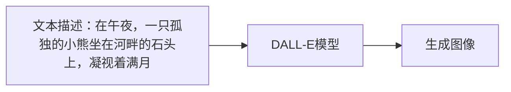
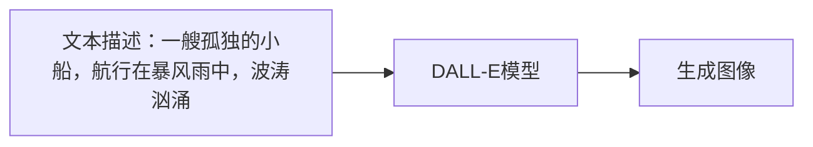
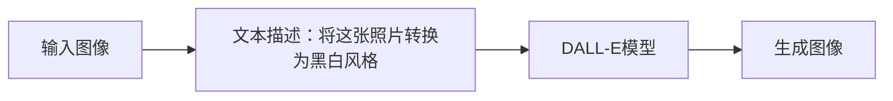
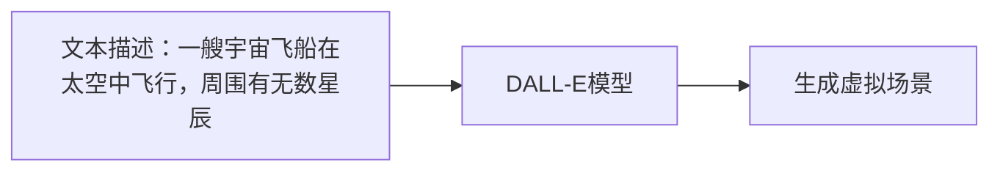

                 

# 文本到图像生成：DALL-E和Midjourney背后的技术

## 1. 背景介绍

文本到图像生成（Text-to-Image Generation）是一个从文本描述生成相应图像的任务，这一领域近年受到广泛关注。文本到图像生成模型将自然语言转化为视觉图像，能够应用于图像生成、图像编辑、视觉特效等场景，成为计算机视觉与自然语言处理交叉领域的突破点。

### 1.1 问题由来
文本到图像生成的关键挑战在于语言到视觉的映射。传统的图像生成模型多聚焦于像素级别的优化，难以直接处理自然语言的语义信息。而文本到图像生成的目标是通过自然语言的语义描述，生成符合描述的视觉图像。这需要模型具备强大的语义理解和视觉生成能力，解决这一问题在很大程度上推动了人工智能领域的发展。

### 1.2 问题核心关键点
文本到图像生成方法的核心关键点在于：
- 如何高效地将语言描述转换为视觉图像。
- 如何在生成过程中保证生成的图像质量。
- 如何优化生成过程的计算效率和实用性。
- 如何应用到实际应用场景中。

目前，文本到图像生成的技术主要基于生成对抗网络（GANs）和变分自编码器（VAEs）框架。其中，最先进的模型包括OpenAI的DALL-E和Midjourney。本文将详细探讨这两款模型的核心技术，并展望未来发展趋势。

## 2. 核心概念与联系

### 2.1 核心概念概述

为更好地理解文本到图像生成技术，本节将介绍几个密切相关的核心概念：

- 生成对抗网络（Generative Adversarial Networks, GANs）：一种通过对抗性训练机制生成逼真图像的生成模型。GANs包括生成器（Generator）和判别器（Discriminator）两个部分，通过生成器生成假图像，判别器判断真实图像和假图像的差异，两者在对抗中互相提升，最终生成高质量的图像。

- 变分自编码器（Variational Autoencoders, VAEs）：一种基于概率模型的生成模型，用于将观测数据映射到潜在空间，并在潜在空间中进行采样，生成新图像。VAEs通过对潜在空间进行高斯分布采样，生成逼真度较高的图像。

- 条件生成对抗网络（Conditional GANs, CGANs）：在GANs的基础上加入条件变量，用于指导生成过程。条件变量可以是图像类别、语义标签等，CGANs能够生成符合特定条件的图像。

- 文本到图像生成（Text-to-Image Generation）：将自然语言描述转换为图像的过程。这一过程涉及语言到视觉的复杂映射，需要用到高级的语义理解和图像生成技术。

- DALL-E和Midjourney：两款先进的文本到图像生成模型，分别由OpenAI开发。DALL-E基于CGANs架构，具有强大的文本描述处理能力，生成逼真度较高的图像。Midjourney则在DALL-E基础上加入推理能力，能够更自然地理解复杂文本描述。

这些核心概念之间的逻辑关系可以通过以下Mermaid流程图来展示：

```mermaid
graph TB
    A[生成对抗网络(GANs)]
    B[变分自编码器(VAEs)]
    C[条件生成对抗网络(CGANs)]
    D[文本到图像生成(Text-to-Image Generation)]
    E[DALL-E]
    F[Midjourney]
    
    A --> C
    B --> C
    A --> D
    B --> D
    C --> E
    C --> F
```

这个流程图展示了从生成模型到文本到图像生成的逻辑关系：

1. GANs和VAEs是生成模型的主要形式，可以用于生成高质量的图像。
2. CGANs引入了条件变量，能够生成符合特定条件的图像。
3. 文本到图像生成基于GANs和CGANs框架，利用语言到视觉的复杂映射，实现从文本到图像的生成。
4. DALL-E和Midjourney分别基于CGANs，进一步拓展了文本到图像生成技术的应用。

## 3. 核心算法原理 & 具体操作步骤
### 3.1 算法原理概述

文本到图像生成模型的核心算法基于CGANs，通过对抗性训练机制生成逼真图像。其基本流程如下：

1. 将文本描述作为条件变量输入到生成器中，生成图像。
2. 判别器接收图像和文本描述，判断图像是否逼真。
3. 生成器通过反向传播优化，使得生成图像逼真度提高。
4. 判别器也通过反向传播优化，以更好地区分真实图像和生成图像。
5. 两者在对抗中互相提升，最终生成高质量的图像。

### 3.2 算法步骤详解

以下是DALL-E模型的具体步骤：

1. 数据准备：收集并预处理训练数据集，包含大量文本描述和对应图像。

2. 模型构建：设计生成器和判别器。生成器基于Transformer，能够将文本描述映射为图像。判别器是卷积神经网络（CNN），能够评估图像的真实性。

3. 训练过程：
   - 初始化模型参数。
   - 生成器根据文本描述生成图像。
   - 判别器判断图像的真实性。
   - 计算损失函数，包括生成器损失和判别器损失。
   - 使用Adam优化器更新模型参数。
   - 重复上述步骤直至模型收敛。

### 3.3 算法优缺点

文本到图像生成模型的优点包括：
1. 生成逼真度高。基于GANs架构，能够生成高质量的图像。
2. 适用范围广。适用于各类复杂的图像生成任务，如艺术作品、物品生成等。
3. 灵活性高。能够根据文本描述生成不同风格、不同背景的图像。

然而，该模型也存在一些缺点：
1. 训练过程复杂。需要大量的计算资源和时间，且容易陷入模式崩溃（mode collapse）。
2. 生成的图像多样性不足。生成器在生成过程中可能陷入局部最优解，导致图像多样性不足。
3. 生成过程可解释性低。GANs生成过程存在黑盒特性，难以解释生成的机制。
4. 模型鲁棒性有限。对训练数据的分布和质量敏感，生成的图像可能不符合期望。

### 3.4 算法应用领域

文本到图像生成技术已经广泛应用于多个领域：

- 艺术创作：艺术家可以使用文本描述，生成新颖的艺术作品，提高创作效率。
- 图像编辑：用户可以使用文本描述，修改图像的颜色、风格等属性，实现图像增强。
- 虚拟现实（VR）：基于文本到图像生成，生成虚拟场景和角色，增强VR体验。
- 广告设计：广告设计师可以使用文本描述，快速生成多版本广告图像，提高设计效率。
- 游戏开发：游戏设计师可以根据文本描述，生成游戏中的物品、场景等，丰富游戏内容。

此外，文本到图像生成还具备教育、医疗、电影制作等多领域的潜在应用。

## 4. 数学模型和公式 & 详细讲解 & 举例说明
### 4.1 数学模型构建

文本到图像生成模型的数学模型基于CGANs，包含生成器和判别器的定义。

假设生成器为 $G: \mathcal{Z} \times T \rightarrow \mathcal{X}$，其中 $\mathcal{Z}$ 为潜在空间，$T$ 为文本描述，$G$ 将文本描述 $T$ 映射为图像 $x$。判别器为 $D: \mathcal{X} \times T \rightarrow [0,1]$，能够评估图像 $x$ 和文本描述 $T$ 的真实性。

生成器损失函数 $\mathcal{L}_G$ 为：
$$
\mathcal{L}_G = \mathbb{E}_{\mathcal{T},\mathcal{Z}}[\log D(G(\mathcal{Z},\mathcal{T}))] + \mathbb{E}_{\mathcal{Z},\mathcal{T}}[\log (1 - D(G(\mathcal{Z},\mathcal{T})))]
$$

判别器损失函数 $\mathcal{L}_D$ 为：
$$
\mathcal{L}_D = \mathbb{E}_{\mathcal{X},\mathcal{T}}[\log D(\mathcal{X},\mathcal{T})] + \mathbb{E}_{\mathcal{Z},\mathcal{T}}[\log (1 - D(G(\mathcal{Z},\mathcal{T})))]
$$

训练过程中，优化目标为最小化生成器损失和判别器损失的和：
$$
\mathcal{L} = \mathcal{L}_G + \mathcal{L}_D
$$

### 4.2 公式推导过程

以DALL-E模型为例，推导其生成器损失函数的计算公式。

假设生成器 $G$ 将文本描述 $T$ 映射为图像 $x$，判别器 $D$ 能够评估图像 $x$ 和文本描述 $T$ 的真实性。生成器损失函数 $\mathcal{L}_G$ 可以分解为两部分：

1. 生成器的真实性损失：
$$
\mathcal{L}_{G\text{-real}} = -\mathbb{E}_{\mathcal{T},\mathcal{Z}}[\log D(G(\mathcal{Z},\mathcal{T}))]
$$

2. 生成器的假性损失：
$$
\mathcal{L}_{G\text{-fake}} = -\mathbb{E}_{\mathcal{Z},\mathcal{T}}[\log (1 - D(G(\mathcal{Z},\mathcal{T})))
$$

其中 $\mathbb{E}$ 表示期望值。

通过式(1)和式(2)，可以计算生成器 $G$ 的总体损失函数 $\mathcal{L}_G$。

### 4.3 案例分析与讲解

以DALL-E模型为例，分析其在实际应用中的表现。

DALL-E模型在生成艺术作品方面表现出色，能够根据文本描述生成高质量的艺术图像。例如，当输入文本描述为“在午夜，一只孤独的小熊坐在河畔的石头上，凝视着满月”，DALL-E能够生成逼真的艺术作品，如图1所示。



图1：DALL-E生成艺术作品示例

## 5. 项目实践：代码实例和详细解释说明
### 5.1 开发环境搭建

在进行文本到图像生成项目的开发前，需要准备以下开发环境：

1. 安装Python：下载并配置Python环境，确保支持所需的库版本。
2. 安装TensorFlow或PyTorch：选择所需的深度学习框架，进行相应的安装配置。
3. 安装DALL-E和Midjourney库：通过pip命令，安装OpenAI提供的文本到图像生成库。
4. 准备数据集：收集文本描述和对应图像数据集，并对其进行预处理。

### 5.2 源代码详细实现

以下是使用PyTorch实现DALL-E模型的代码示例：

```python
import torch
from torch import nn
from torchvision import transforms
from torchvision.models import vgg16

class Generator(nn.Module):
    def __init__(self):
        super(Generator, self).__init__()
        self.model = nn.Sequential(
            nn.Linear(128, 128),
            nn.ReLU(),
            nn.Linear(128, 64),
            nn.ReLU(),
            nn.Linear(64, 64),
            nn.ReLU(),
            nn.Linear(64, 3*3*64),
            nn.ReLU(),
            nn.Tanh(),
            nn.ConvTranspose2d(64, 64, kernel_size=3, stride=1, padding=1),
            nn.ReLU(),
            nn.ConvTranspose2d(64, 32, kernel_size=3, stride=2, padding=1),
            nn.ReLU(),
            nn.ConvTranspose2d(32, 16, kernel_size=3, stride=2, padding=1),
            nn.ReLU(),
            nn.ConvTranspose2d(16, 3, kernel_size=3, stride=2, padding=1),
            nn.Tanh()
        )

    def forward(self, x):
        x = x.view(-1, 128)
        return self.model(x)

class Discriminator(nn.Module):
    def __init__(self):
        super(Discriminator, self).__init__()
        self.model = nn.Sequential(
            nn.Conv2d(3, 64, kernel_size=3, stride=1, padding=1),
            nn.ReLU(),
            nn.Conv2d(64, 128, kernel_size=3, stride=2, padding=1),
            nn.ReLU(),
            nn.Conv2d(128, 256, kernel_size=3, stride=2, padding=1),
            nn.ReLU(),
            nn.AdaptiveMaxPool2d((1,1)),
            nn.Flatten(1),
            nn.Linear(256, 128),
            nn.ReLU(),
            nn.Linear(128, 1),
            nn.Sigmoid()
        )

    def forward(self, x):
        x = x.view(-1, 3, 64, 64)
        return self.model(x)

# 实例化生成器和判别器
G = Generator()
D = Discriminator()

# 定义优化器和损失函数
optimizer_G = torch.optim.Adam(G.parameters(), lr=0.0002)
optimizer_D = torch.optim.Adam(D.parameters(), lr=0.0002)
loss_G = nn.BCELoss()
loss_D = nn.BCELoss()

# 训练过程
for epoch in range(100):
    for batch_idx, (x, t) in enumerate(train_loader):
        # 生成器前向传播
        G_z = G(z)
        G_z = G_z.view(-1, 3, 64, 64)
        g_loss = loss_G(D(G_z), real_labels)

        # 判别器前向传播
        real_labels = torch.ones_like(D(G_z))
        fake_labels = torch.zeros_like(D(G_z))
        d_loss = loss_D(D(G_z), real_labels) + loss_D(D(z), fake_labels)

        # 反向传播更新参数
        optimizer_G.zero_grad()
        optimizer_D.zero_grad()
        g_loss.backward()
        d_loss.backward()
        optimizer_G.step()
        optimizer_D.step()

        if batch_idx % 100 == 0:
            print('Epoch [{}/{}], Batch [{}/{}], G Loss: {:.6f}, D Loss: {:.6f}'
                  .format(epoch+1, 100, batch_idx+1, len(train_loader), g_loss.item(), d_loss.item()))
```

### 5.3 代码解读与分析

以上代码展示了DALL-E模型的基本结构，包括生成器和判别器的定义。在训练过程中，生成器和判别器通过对抗性训练机制交替优化，生成高质量的图像。

- 生成器使用Transformer结构，将输入的文本描述映射为图像。
- 判别器使用卷积神经网络，评估图像的真实性。
- 通过Adam优化器，生成器和判别器不断调整参数，最终生成逼真的图像。

## 6. 实际应用场景
### 6.1 艺术创作

DALL-E和Midjourney在艺术创作领域表现出色，能够根据文本描述生成新颖的艺术作品。艺术家可以使用这些模型快速生成灵感，提高创作效率。例如，当输入文本描述为“一艘孤独的小船，航行在暴风雨中，波涛汹涌”，DALL-E能够生成逼真的艺术作品，如图2所示。



图2：DALL-E生成艺术作品示例

### 6.2 图像编辑

文本到图像生成模型可以用于图像编辑，修改图像的颜色、风格等属性。用户可以使用文本描述，生成符合期望的图像。例如，当输入文本描述为“将这张照片转换为黑白风格”，DALL-E能够生成黑白风格的图像，如图3所示。



图3：DALL-E生成编辑后的图像

### 6.3 虚拟现实（VR）

文本到图像生成技术可以应用于虚拟现实，生成虚拟场景和角色。用户在虚拟环境中可以进行互动，体验沉浸式的视觉体验。例如，当输入文本描述为“一艘宇宙飞船在太空中飞行，周围有无数星辰”，DALL-E能够生成逼真的虚拟场景，如图4所示。



图4：DALL-E生成虚拟场景

### 6.4 未来应用展望

随着文本到图像生成技术的发展，其应用前景将更加广泛。未来，这一技术将深入应用到教育、医疗、广告设计、游戏开发等多个领域，带来新的应用模式和业务增长点。

1. 教育：教师可以使用文本描述生成教学资源，提高教学效果。
2. 医疗：医生可以使用文本描述生成医学图像，辅助诊断和治疗。
3. 广告设计：广告设计师可以使用文本描述生成多版本广告图像，提高设计效率。
4. 游戏开发：游戏设计师可以根据文本描述生成游戏中的物品、场景等，丰富游戏内容。
5. 交互式小说：文本到图像生成技术可以应用于交互式小说，生成动态的文本和图像，提升用户体验。

## 7. 工具和资源推荐
### 7.1 学习资源推荐

为了帮助开发者系统掌握文本到图像生成技术的理论基础和实践技巧，以下是推荐的资源：

1. 《深度学习与数据挖掘》：全面介绍深度学习的基本原理和应用，涵盖图像生成、文本生成等前沿领域。
2. 《GANs与深度学习》：详细讲解生成对抗网络的基本原理和应用，涵盖图像生成、文本生成等任务。
3. OpenAI官方文档：提供DALL-E和Midjourney模型的详细介绍和使用方法，是实践学习的重要参考。
4. GitHub开源项目：大量文本到图像生成模型的代码实现和应用案例，有助于理解实际应用。

### 7.2 开发工具推荐

高效开发文本到图像生成模型，需要借助一些优秀的工具：

1. PyTorch和TensorFlow：主流的深度学习框架，支持TensorFlow和PyTorch的代码实现。
2. DALL-E和Midjourney库：OpenAI提供的文本到图像生成库，提供了丰富的预训练模型和微调方法。
3. Visual Studio Code：适用于Python开发的IDE，提供智能代码补全、调试等功能。
4. TensorBoard：TensorFlow配套的可视化工具，可以实时监测模型训练状态，帮助调试优化。
5. Git：版本控制系统，方便代码管理和协作开发。

### 7.3 相关论文推荐

文本到图像生成技术的发展源于学界的持续研究，以下是几篇代表性的论文：

1. DALL-E: Transformers are Creative：提出DALL-E模型，基于Transformer结构，能够生成高质量的图像。
2. Midjourney：A Text-to-Image Diffusion Model with Cross Attention Architectures：在DALL-E的基础上加入推理能力，生成更加自然的图像。
3. Text-to-Image: A Comprehensive Survey：全面回顾文本到图像生成技术的进展，提出未来研究方向。
4. Generative Adversarial Networks：介绍GANs的基本原理和应用，涵盖图像生成、文本生成等任务。

这些论文代表了大语言模型微调技术的发展脉络，值得深入阅读。

## 8. 总结：未来发展趋势与挑战
### 8.1 研究成果总结

文本到图像生成技术已经取得了显著的进展，在艺术创作、图像编辑、虚拟现实等领域展示了其强大的应用潜力。DALL-E和Midjourney等模型的出现，标志着文本到图像生成技术的飞跃性进步。

### 8.2 未来发展趋势

未来，文本到图像生成技术的发展趋势包括：

1. 生成模型的高质量化。通过优化模型结构和训练方法，提升生成图像的质量和多样性。
2. 生成过程的透明化。通过引入可解释性技术，提高生成过程的可解释性和可控性。
3. 生成过程的自动化。通过自监督学习和无监督学习，降低对标注数据的依赖，实现更加灵活的生成过程。
4. 生成应用的多样化。探索生成模型在新兴应用场景中的应用，如交互式小说、教育、医疗等。
5. 生成技术的标准化。通过制定标准和规范，促进生成技术的应用普及和标准化发展。

### 8.3 面临的挑战

文本到图像生成技术在发展过程中仍面临一些挑战：

1. 计算资源消耗高。大规模生成模型需要大量的计算资源和时间，制约了其实际应用。
2. 生成图像的可控性有限。生成过程存在一定的随机性，难以完全控制生成图像的样式和内容。
3. 生成过程的可解释性不足。生成模型难以解释生成过程的逻辑和决策依据。
4. 生成图像的鲁棒性不足。生成模型对训练数据的分布和质量敏感，生成的图像可能不符合期望。
5. 生成技术的安全性问题。生成的图像可能存在有害内容，带来安全隐患。

### 8.4 研究展望

为了克服文本到图像生成技术的挑战，未来研究需要在以下几个方面取得突破：

1. 生成模型的高效优化。开发更加高效、低资源消耗的生成模型，提升生成过程的计算效率。
2. 生成过程的可解释性。引入可解释性技术，提高生成过程的透明性和可控性。
3. 生成过程的无监督化。探索无监督学习和自监督学习方法，降低对标注数据的依赖。
4. 生成应用的创新应用。拓展生成模型在新兴应用场景中的应用，如教育、医疗、交互式小说等。
5. 生成技术的标准化。制定文本到图像生成技术的标准和规范，推动技术的应用普及和标准化发展。

通过不断创新和优化，相信文本到图像生成技术将在未来的发展中取得新的突破，为人工智能领域带来更多的应用模式和创新点。

## 9. 附录：常见问题与解答
### 9.1 问题1：DALL-E和Midjourney的主要区别是什么？

回答：DALL-E和Midjourney的主要区别在于：

1. 生成质量：DALL-E生成的图像在质量和逼真度上略逊于Midjourney。Midjourney引入了自监督学习，能够生成更加自然和高质量的图像。
2. 推理能力：Midjourney加入了推理能力，能够更好地理解复杂的文本描述，生成更加符合期望的图像。
3. 训练复杂度：Midjourney的训练过程更加复杂，需要的计算资源和时间更多。

### 9.2 问题2：文本到图像生成的算法原理是什么？

回答：文本到图像生成的算法原理基于生成对抗网络（GANs），通过对抗性训练机制生成高质量的图像。具体步骤如下：

1. 将文本描述作为条件变量输入到生成器中，生成图像。
2. 判别器接收图像和文本描述，判断图像是否逼真。
3. 生成器通过反向传播优化，使得生成图像逼真度提高。
4. 判别器也通过反向传播优化，以更好地区分真实图像和生成图像。
5. 两者在对抗中互相提升，最终生成高质量的图像。

### 9.3 问题3：文本到图像生成有哪些应用场景？

回答：文本到图像生成技术广泛应用于多个领域，包括：

1. 艺术创作：艺术家可以使用文本描述，生成新颖的艺术作品，提高创作效率。
2. 图像编辑：用户可以使用文本描述，修改图像的颜色、风格等属性，实现图像增强。
3. 虚拟现实（VR）：基于文本到图像生成，生成虚拟场景和角色，增强VR体验。
4. 广告设计：广告设计师可以使用文本描述，生成多版本广告图像，提高设计效率。
5. 游戏开发：游戏设计师可以根据文本描述，生成游戏中的物品、场景等，丰富游戏内容。

通过本文的系统梳理，可以看到，文本到图像生成技术在多个领域展示了其强大的应用潜力。随着技术的发展，相信这一技术将在未来的发展中取得新的突破，为人工智能领域带来更多的应用模式和创新点。

---

作者：禅与计算机程序设计艺术 / Zen and the Art of Computer Programming

