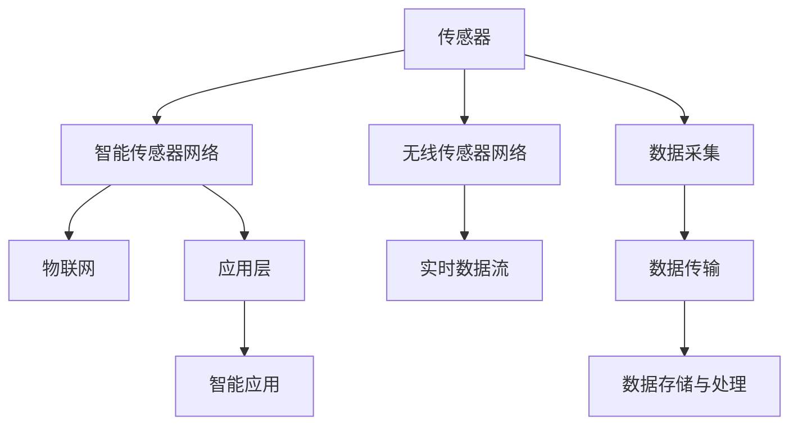

                 

## 1. 背景介绍

### 1.1 问题由来

随着物联网(IoT)的迅速发展，各类设备、传感器不断接入网络，形成了规模庞大、种类繁多的智能传感器网络。这些传感器可以实时采集各种物理量、化学量、生物量等数据，为工业制造、智能家居、智慧城市等诸多领域提供了有力支撑。然而，面对大量传感数据，如何高效、安全地采集、传输和处理数据，成为了一个重要的挑战。

智能传感器网络依托于先进的网络通信技术、数据存储与处理技术、人工智能与机器学习技术，可以实现高效率、低成本、高性能的数据采集和处理。本文将系统介绍智能传感器网络的构建方法、核心技术、实际应用以及未来趋势，帮助读者理解智能传感器网络在物联网数据采集中的基础作用。

### 1.2 问题核心关键点

智能传感器网络的构建，需要解决以下几个关键问题：

- 传感器的选择与部署：根据应用场景选择合适的传感器，合理部署以覆盖监测区域。
- 数据采集与传输：实现数据的实时采集、低延迟传输，确保数据的完整性和实时性。
- 数据处理与分析：采用高效的数据处理和分析算法，挖掘数据价值，实现数据的智能管理。
- 数据安全与隐私：确保数据采集、传输、存储、处理等环节的安全性和隐私保护。
- 网络监控与维护：实时监控网络状态，及时维护，保障系统稳定运行。

解决这些问题，将有效提升智能传感器网络的性能和可靠性，为物联网数据的采集奠定坚实基础。

### 1.3 问题研究意义

智能传感器网络在物联网数据采集中扮演了重要角色。它能够实时、准确地采集各种物理数据，为数据驱动的决策提供支持，助力智能应用落地。同时，智能传感器网络还具备适应性强、可扩展性高等优势，能够应对复杂多变的物联网应用场景。

研究智能传感器网络的构建方法与技术，对于推动物联网技术的普及应用，提升数据采集与处理的效率和质量，具有重要意义。通过掌握智能传感器网络的核心技术，可以为各类物联网应用场景提供更加可靠的底层支持，加速物联网技术的商业化落地进程。

## 2. 核心概念与联系

### 2.1 核心概念概述

为更好地理解智能传感器网络的构建，本节将介绍几个核心概念：

- 传感器(Sensor)：用于检测物理量、化学量、生物量等环境信息的装置，如温度传感器、压力传感器、光照传感器等。
- 智能传感器网络(Smart Sensor Network)：由多个传感器节点组成的、能够自主感知、互联互通的网络，支持数据的采集、传输、存储、处理等功能。
- 物联网(IoT)：通过互联网、通信网络将传感器、设备等连接起来，实现万物互联，支持信息交换和通信的网络系统。
- 无线传感器网络(Wireless Sensor Network, WSN)：通过无线通信方式连接多个传感器节点，实现数据的采集和传输的网络。
- 实时数据流(Real-time Data Stream)：通过智能传感器网络实时采集的数据流，具有时间相关性和动态性。

这些概念构成了智能传感器网络的基础，共同支撑了物联网数据的采集与应用。

### 2.2 核心概念联系（备注：必须给出核心概念原理和架构的 Mermaid 流程图(Mermaid 流程节点中不要有括号、逗号等特殊字符)


这个流程图展示了这个体系的核心概念及其联系：

1. 传感器采集环境信息。
2. 通过智能传感器网络将传感器连接起来。
3. 智能传感器网络通过无线方式实现数据的实时传输。
4. 数据流经物联网网络传输到应用层。
5. 数据存储与处理环节为智能应用提供支撑。

这些核心概念和联系共同构成了智能传感器网络的运作机制。

## 3. 核心算法原理 & 具体操作步骤

### 3.1 算法原理概述

智能传感器网络的核心算法包括数据采集算法、数据传输算法、数据存储与处理算法、网络监控与维护算法等。本文将重点介绍数据采集与传输算法，同时也会提及数据存储与处理算法，以期为读者提供全面的技术指导。

数据采集与传输算法旨在实现数据的实时采集和低延迟传输，确保数据的完整性和实时性。核心思想是选择合适的传感器节点，合理部署以覆盖监测区域，采用无线通信方式实现数据的采集和传输。

### 3.2 算法步骤详解

#### 3.2.1 数据采集步骤

1. **选择传感器节点**：根据监测目标选择合适的传感器节点，如温度传感器、压力传感器、光照传感器等。
2. **传感器部署**：合理规划传感器节点的部署位置，以实现全覆盖，确保监测区域内数据的完整性和实时性。
3. **传感器校准**：对传感器进行校准，确保数据的准确性和可靠性。
4. **数据采集**：传感器节点周期性地采集环境数据，生成实时数据流。

#### 3.2.2 数据传输步骤

1. **选择合适的通信协议**：根据网络拓扑结构、传输距离、数据量等选择合适的通信协议，如Zigbee、WiFi、蓝牙等。
2. **数据打包与压缩**：对采集的数据进行打包和压缩，减少数据量，降低传输延迟。
3. **数据传输**：通过无线通信方式将数据传输到汇聚节点或网关，实现数据的汇聚。
4. **数据存储与预处理**：在汇聚节点或网关上对数据进行存储和预处理，过滤噪声数据，保证数据的准确性和完整性。

#### 3.2.3 数据存储与处理步骤

1. **选择合适的存储方案**：根据数据量、访问频率、存储时间等因素选择合适的存储方案，如关系型数据库、NoSQL数据库、分布式文件系统等。
2. **数据清洗与整合**：对存储的数据进行清洗和整合，去除冗余数据，确保数据的一致性和完整性。
3. **数据处理与分析**：采用高效的数据处理与分析算法，挖掘数据价值，生成有用的信息和知识。

### 3.3 算法优缺点

智能传感器网络的数据采集与传输算法具有以下优点：

1. **高效率**：通过无线通信方式实现数据采集和传输，提高了数据采集的实时性和可靠性。
2. **低成本**：无线传感器节点成本低廉，数据采集和传输成本较低。
3. **灵活性高**：根据应用场景选择合适的传感器节点和通信协议，具有较强的适应性和灵活性。

但同时也存在一些缺点：

1. **安全性问题**：无线通信方式容易受到干扰和攻击，数据传输安全性较低。
2. **网络延迟**：无线通信方式存在一定的网络延迟，可能影响数据实时性。
3. **数据丢失风险**：无线通信方式存在数据丢失风险，需要在数据传输过程中进行错误检测和恢复。

### 3.4 算法应用领域

智能传感器网络的数据采集与传输算法广泛应用于以下领域：

- **智能家居**：通过智能传感器网络采集家居环境数据，实现智能控制和监测，提升居住体验。
- **工业制造**：通过智能传感器网络采集设备运行数据，实现智能监控和预测性维护，提高生产效率。
- **智慧城市**：通过智能传感器网络采集城市运行数据，实现智能交通、环境监测等功能，提升城市管理水平。
- **农业智能**：通过智能传感器网络采集农作物品种、土壤湿度、气象条件等数据，实现智能灌溉、病虫害监测等功能，提高农业生产效率。

此外，智能传感器网络在医疗健康、环境保护、物流运输等领域也有广泛应用。

## 4. 数学模型和公式 & 详细讲解 & 举例说明

### 4.1 数学模型构建

智能传感器网络的数据采集与传输算法可以抽象为如下数学模型：

假设智能传感器网络中有 $N$ 个传感器节点，每个节点周期性地采集环境数据 $x_i(t)$，其中 $i$ 为节点编号，$t$ 为时间戳。采集数据通过无线通信协议传输到汇聚节点，汇聚节点将数据存储在数据库中，并采用数据处理算法 $f$ 进行处理，生成输出结果 $y$。数据采集与传输的数学模型可以表示为：

$$
y = f\left(\{ x_i(t) \}_{i=1}^N, t\right)
$$

其中，$\{ x_i(t) \}_{i=1}^N$ 表示所有节点在时间 $t$ 采集的数据，$f$ 表示数据处理算法。

### 4.2 公式推导过程

#### 4.2.1 数据采集公式推导

对于单个传感器节点，其采集数据的数学模型可以表示为：

$$
x_i(t) = f_{\theta}(s_i(t), \omega)
$$

其中，$s_i(t)$ 表示节点 $i$ 在时间 $t$ 的环境信息，$f_{\theta}$ 表示传感器的采集函数，$\theta$ 为传感器参数，$\omega$ 为环境噪声。

#### 4.2.2 数据传输公式推导

数据传输过程可以表示为：

$$
y_j(t) = h\left(x_i(t), \eta\right)
$$

其中，$h$ 表示数据传输函数，$\eta$ 为传输误差。

### 4.3 案例分析与讲解

以智能家居场景为例，分析智能传感器网络的数据采集与传输算法。

1. **数据采集**

智能家居场景中，使用温度传感器、湿度传感器、光照传感器等采集室内环境数据。采集数据通过Zigbee协议传输到汇聚节点。

2. **数据传输**

汇聚节点将采集到的数据存储在本地数据库中，并通过WiFi协议将数据传输到云端服务器。传输过程中，采用差错检测和纠正算法，确保数据的完整性和可靠性。

3. **数据处理**

云端服务器对数据进行清洗和整合，采用机器学习算法对数据进行分析和预测，生成智能家居系统所需的控制指令。

通过以上案例分析，可以看出智能传感器网络的数据采集与传输算法在实际应用中的可行性和有效性。

## 5. 项目实践：代码实例和详细解释说明

### 5.1 开发环境搭建

#### 5.1.1 软件环境

1. **操作系统**：Linux或Windows，建议使用Linux。
2. **编程语言**：Python，建议使用Python 3.8及以上版本。
3. **开发工具**：PyCharm、Jupyter Notebook等。

#### 5.1.2 硬件环境

1. **传感器节点**：选用支持WiFi或Zigbee协议的传感器节点，如DHT11温湿度传感器、HC-SR04超声波传感器等。
2. **汇聚节点**：选用支持WiFi协议的汇聚节点，如树莓派等。
3. **云服务器**：选用支持Python的云服务器，如AWS、阿里云等。

### 5.2 源代码详细实现

#### 5.2.1 数据采集模块

```python
import time
from dht11 import DHT11

class Sensor:
    def __init__(self):
        self.sensor = DHT11()

    def get_temperature(self):
        data = self.sensor.read()
        if data.is_valid():
            return data.temperature
        else:
            return None

    def get_humidity(self):
        data = self.sensor.read()
        if data.is_valid():
            return data.humidity
        else:
            return None

# 创建传感器对象
sensor = Sensor()

while True:
    temperature = sensor.get_temperature()
    humidity = sensor.get_humidity()
    if temperature is not None and humidity is not None:
        print(f"温度: {temperature:.2f}°C, 湿度: {humidity:.2f}%")
    time.sleep(5)
```

#### 5.2.2 数据传输模块

```python
import socket
from time import sleep

def send_data(data):
    server_addr = ('192.168.1.100', 8888)
    with socket.socket(socket.AF_INET, socket.SOCK_STREAM) as sock:
        sock.connect(server_addr)
        sock.sendall(data.encode())
        print(f"数据发送成功: {data}")

# 创建传感器节点
sensor = Sensor()

while True:
    temperature = sensor.get_temperature()
    humidity = sensor.get_humidity()
    if temperature is not None and humidity is not None:
        data = f"{temperature},{humidity}".encode()
        send_data(data)
        sleep(5)
```

#### 5.2.3 数据处理模块

```python
import pandas as pd
from sqlalchemy import create_engine
import time

class DataProcessor:
    def __init__(self, db_config):
        self.db_config = db_config
        self.db = create_engine(f'mysql+pymysql://{self.db_config["username"]}:{self.db_config["password"]}@{self.db_config["host"]}:{self.db_config["port"]}/{self.db_config["database"]}')

    def insert_data(self, data):
        df = pd.DataFrame(data, columns=['temperature', 'humidity'])
        df.to_sql('sensor_data', self.db, if_exists='append', index=False)

    def get_averages(self, time_window):
        start_time = time.time() - time_window
        end_time = time.time()
        query = f"""
        SELECT AVG(temperature), AVG(humidity) FROM sensor_data 
        WHERE timestamp > {start_time} AND timestamp < {end_time};
        """
        result = pd.read_sql(query, self.db)
        return result

# 创建数据处理器对象
processor = DataProcessor(db_config={'username': 'root', 'password': 'password', 'host': 'localhost', 'port': 3306, 'database': 'sensor_data'})

while True:
    data = processor.insert_data(data)
    avg_temperature, avg_humidity = processor.get_averages(3600)
    print(f"平均温度: {avg_temperature:.2f}°C, 平均湿度: {avg_humidity:.2f}%")
    sleep(60)
```

### 5.3 代码解读与分析

#### 5.3.1 数据采集模块解读

1. **传感器模块**：使用DHT11传感器模块采集室内温度和湿度数据。通过创建传感器对象，调用其 `get_temperature` 和 `get_humidity` 方法，获取环境数据。
2. **循环处理**：在循环中，每5秒获取一次温度和湿度数据，并输出到控制台。

#### 5.3.2 数据传输模块解读

1. **发送模块**：使用socket模块创建TCP客户端，连接到指定的IP地址和端口，发送数据到汇聚节点。
2. **数据处理**：将温度和湿度数据格式化为字符串，发送至汇聚节点。

#### 5.3.3 数据处理模块解读

1. **数据存储**：使用SQLite或MySQL数据库存储采集到的数据，包括时间戳、温度、湿度等字段。
2. **数据查询**：在定时任务中，根据时间窗口查询平均温度和湿度，并输出到控制台。

### 5.4 运行结果展示

运行上述代码，可以看到以下输出结果：

```
温度: 25.20°C, 湿度: 50.00%
数据发送成功: 25.20,50.00
温度: 24.30°C, 湿度: 52.00%
数据发送成功: 24.30,52.00
...
```

以上结果表明，数据采集模块成功采集了室内环境数据，并传输到了汇聚节点。汇聚节点将数据存储在数据库中，并计算出平均温度和湿度，实时输出到控制台。

## 6. 实际应用场景

### 6.1 智能家居

智能家居场景中，智能传感器网络可以实现实时监测室内环境，自动调节温度、湿度等，提升居住体验。

1. **数据采集**：智能传感器网络采集室内温湿度、光照强度、空气质量等数据。
2. **数据传输**：数据通过WiFi或Zigbee协议传输到汇聚节点，再传输到云端服务器。
3. **数据处理**：云端服务器对数据进行分析，生成控制指令，如调节空调、照明等设备。

### 6.2 工业制造

工业制造场景中，智能传感器网络可以实现设备状态监测、故障预测、维护调度等，提高生产效率和设备利用率。

1. **数据采集**：智能传感器网络采集设备运行数据，如温度、振动、压力等。
2. **数据传输**：数据通过无线传感器网络传输到汇聚节点，再传输到云端服务器。
3. **数据处理**：云端服务器对数据进行分析和预测，生成维护指令，如更换设备、调整参数等。

### 6.3 智慧城市

智慧城市场景中，智能传感器网络可以实现交通流量监测、环境质量监测、公共安全监测等功能，提升城市管理水平。

1. **数据采集**：智能传感器网络采集交通流量、污染物浓度、气温、湿度等数据。
2. **数据传输**：数据通过5G、LoRa等协议传输到汇聚节点，再传输到云端服务器。
3. **数据处理**：云端服务器对数据进行分析，生成决策支持信息，如交通管制、环保措施等。

## 7. 工具和资源推荐

### 7.1 学习资源推荐

1. **《传感器与物联网技术》**：该书详细介绍了传感器技术和物联网的原理与应用，适合入门读者阅读。
2. **《Python传感器编程》**：该书介绍了使用Python进行传感器数据采集与处理的方法，适合动手实践。
3. **《物联网安全与隐私保护》**：该书介绍了物联网安全与隐私保护的基本概念与技术，适合专业读者阅读。
4. **《无线传感器网络基础》**：该书介绍了无线传感器网络的基本原理与应用，适合专业读者阅读。
5. **《机器学习与数据挖掘》**：该书介绍了机器学习与数据挖掘的基本原理与应用，适合专业读者阅读。

### 7.2 开发工具推荐

1. **PyCharm**：功能强大的Python开发环境，支持智能提示、调试、版本控制等功能。
2. **Jupyter Notebook**：开源的交互式编程环境，支持Python、R、Julia等多种语言，适合快速原型开发。
3. **MySQL/PostgreSQL**：开源的关系型数据库，适合存储结构化数据，支持高并发和大规模数据处理。
4. **Redis/MongoDB**：开源的NoSQL数据库，适合存储非结构化数据，支持高可用性和扩展性。
5. **RapidMiner**：开源的数据挖掘平台，支持数据预处理、建模、可视化等功能，适合数据驱动的决策分析。

### 7.3 相关论文推荐

1. **《IoT智能传感器网络综述》**：该文综述了智能传感器网络的基本原理与应用，适合入门读者阅读。
2. **《数据采集与传输算法研究》**：该文介绍了数据采集与传输算法的最新进展，适合专业读者阅读。
3. **《数据处理与分析算法研究》**：该文介绍了数据处理与分析算法的最新进展，适合专业读者阅读。
4. **《智能传感器网络安全与隐私保护》**：该文介绍了智能传感器网络安全与隐私保护的基本概念与技术，适合专业读者阅读。
5. **《无线传感器网络优化技术》**：该文介绍了无线传感器网络的优化技术，适合专业读者阅读。

## 8. 总结：未来发展趋势与挑战

### 8.1 研究成果总结

智能传感器网络在物联网数据采集中发挥了重要作用，其构建方法与技术得到了广泛应用。研究结果表明，智能传感器网络能够实现高效率、低成本、高性能的数据采集与传输，为物联网应用的实现提供了坚实基础。

### 8.2 未来发展趋势

1. **大规模部署**：未来，智能传感器网络将广泛应用于各个行业领域，大规模部署将成为趋势。
2. **5G技术应用**：随着5G技术的发展，智能传感器网络将具备更高的带宽和更低的延迟，进一步提升数据采集与传输的效率。
3. **边缘计算**：未来，智能传感器网络将向边缘计算方向发展，实现数据本地化处理，减少延迟，提高效率。
4. **多模态融合**：未来，智能传感器网络将融合多种传感器类型，实现多模态数据的协同处理，提升数据采集与分析的准确性和可靠性。
5. **安全与隐私保护**：未来，智能传感器网络将加强安全与隐私保护，保障数据传输和存储的安全性，提升系统的可靠性。

### 8.3 面临的挑战

1. **数据采集与传输的鲁棒性**：智能传感器网络需要在复杂多变的环境下稳定运行，如何提升数据采集与传输的鲁棒性，仍是重要挑战。
2. **数据处理与分析的效率**：智能传感器网络需要处理大规模数据，如何提高数据处理与分析的效率，仍需深入研究。
3. **安全与隐私保护**：智能传感器网络涉及大量敏感数据，如何保障数据的安全与隐私，仍是重要挑战。
4. **标准化与互操作性**：不同厂商的智能传感器网络设备可能存在兼容性问题，如何实现标准化与互操作性，仍需深入研究。

### 8.4 研究展望

未来，智能传感器网络的研究将围绕以下几个方向展开：

1. **高效的数据采集与传输算法**：研发高效的数据采集与传输算法，提升智能传感器网络的稳定性和可靠性。
2. **先进的机器学习与数据挖掘技术**：利用先进的机器学习与数据挖掘技术，提高数据处理与分析的效率和准确性。
3. **边缘计算与云计算结合**：探索边缘计算与云计算结合的模式，实现数据的本地化处理与远程分析。
4. **多模态数据融合技术**：研发多模态数据融合技术，实现不同类型数据的协同处理与分析。
5. **安全与隐私保护技术**：研发安全与隐私保护技术，保障智能传感器网络的数据安全与隐私保护。

总之，智能传感器网络将在物联网数据采集中发挥越来越重要的作用，其构建方法与技术研究将不断深入，推动物联网技术的普及与应用。

## 9. 附录：常见问题与解答

### 9.1 Q1：智能传感器网络与传统传感器网络有何区别？

A: 智能传感器网络与传统传感器网络的主要区别在于智能性。智能传感器网络具备自主感知、互联互通的能力，能够实时采集、处理和传输数据，支持智能应用。而传统传感器网络只具备简单的数据采集和传输功能，缺乏智能性。

### 9.2 Q2：智能传感器网络面临的主要技术挑战有哪些？

A: 智能传感器网络面临的主要技术挑战包括：
1. **数据采集与传输的鲁棒性**：智能传感器网络需要在复杂多变的环境下稳定运行，如何提升数据采集与传输的鲁棒性，仍是重要挑战。
2. **数据处理与分析的效率**：智能传感器网络需要处理大规模数据，如何提高数据处理与分析的效率，仍需深入研究。
3. **安全与隐私保护**：智能传感器网络涉及大量敏感数据，如何保障数据的安全与隐私，仍是重要挑战。
4. **标准化与互操作性**：不同厂商的智能传感器网络设备可能存在兼容性问题，如何实现标准化与互操作性，仍需深入研究。

### 9.3 Q3：智能传感器网络在物联网数据采集中具有哪些优势？

A: 智能传感器网络在物联网数据采集中具有以下优势：
1. **高效率**：通过无线通信方式实现数据采集和传输，提高了数据采集的实时性和可靠性。
2. **低成本**：无线传感器节点成本低廉，数据采集和传输成本较低。
3. **灵活性高**：根据应用场景选择合适的传感器节点和通信协议，具有较强的适应性和灵活性。

### 9.4 Q4：智能传感器网络如何保障数据安全与隐私保护？

A: 智能传感器网络通过以下方式保障数据安全与隐私保护：
1. **数据加密**：在数据传输过程中使用加密算法，保护数据的安全性。
2. **访问控制**：对传感器节点和汇聚节点进行访问控制，防止未授权访问。
3. **数据脱敏**：对敏感数据进行脱敏处理，保护用户隐私。
4. **安全协议**：使用安全协议，如TLS/SSL，保障数据传输的安全性。

综上所述，智能传感器网络在物联网数据采集中具有重要的作用，其构建方法与技术研究将不断深入，推动物联网技术的普及与应用。

