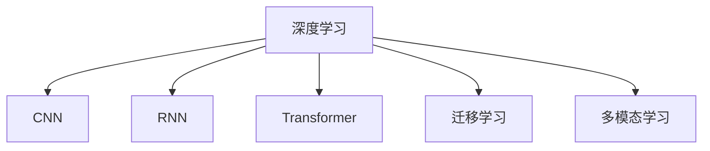

                 

# 智能医疗诊断创业：AI辅助的精准医疗

## 1. 背景介绍

### 1.1 问题由来

医疗诊断一直以来是困扰人们的重大难题。医疗资源有限、误诊率高等问题，使得医疗质量难以得到保证。而随着人工智能技术的发展，AI辅助的精准医疗逐渐成为行业的新趋势。借助AI算法，可以有效提升医疗诊断的准确率和效率，为患者提供更好的医疗体验和预后管理。

然而，精准医疗技术的发展也面临诸多挑战。一方面，现有的AI医疗模型往往依赖大量标注数据，获取高质量标注数据成本高昂。另一方面，医疗领域数据隐私保护和伦理问题复杂，对模型开发和应用提出严苛要求。因此，探索AI医疗诊断技术的商业模式和运营策略，成为业内关注的焦点。

### 1.2 问题核心关键点

AI辅助精准医疗的核心在于如何利用机器学习技术，尤其是深度学习模型，提升医疗诊断的准确性和效率。其关键点包括以下几个方面：

- **数据获取与标注**：高质量的标注数据是AI医疗模型性能的基础。如何高效、低成本地获取并标注医疗数据，成为技术攻关的关键。
- **模型设计与训练**：选择合适的深度学习模型，如卷积神经网络、循环神经网络、Transformer等，在医学影像、病历文本等多模态数据上进行训练，提升诊断能力。
- **临床验证与部署**：将训练好的模型应用于临床实践，验证其准确性和鲁棒性，并部署到实际医疗系统中，提供辅助诊断服务。
- **隐私保护与伦理问题**：在AI医疗模型开发和使用中，必须严格遵守数据隐私保护法规和伦理要求，确保患者信息安全。

## 2. 核心概念与联系

### 2.1 核心概念概述

要深入理解AI辅助精准医疗，首先需要了解其中的关键技术概念：

- **深度学习(DL)**：一种基于神经网络模型，通过多层非线性变换进行特征提取和预测的机器学习技术。在医疗领域，深度学习模型广泛应用于医学影像分析、病历文本处理等任务。
- **卷积神经网络(CNN)**：一种特殊类型的深度神经网络，通过卷积层进行特征提取，常用于图像识别、分类等任务。
- **循环神经网络(RNN)**：一种序列模型，通过循环结构处理时序数据，常用于自然语言处理、时间序列预测等任务。
- **Transformer模型**：近年来兴起的一种基于自注意力机制的神经网络结构，在自然语言处理领域表现优异，如BERT、GPT等。
- **迁移学习**：通过在一个领域预训练模型，将其迁移到另一个领域进行微调，以提升模型在新领域上的性能。
- **多模态学习**：结合不同模态（如医学影像、病历文本等）的信息，提升模型的综合分析和诊断能力。

这些概念之间的逻辑关系可以通过以下Mermaid流程图来展示：



这个流程图展示了深度学习与相关模型的关联，以及迁移学习和多模态学习在提升医疗诊断能力中的作用。

## 3. 核心算法原理 & 具体操作步骤

### 3.1 算法原理概述

AI辅助精准医疗的核心算法原理是利用深度学习模型，结合医学领域的多模态数据，进行精准的疾病诊断和预测。其基本流程包括：

1. **数据预处理**：从电子健康记录、医学影像、基因数据等来源获取医疗数据，并进行清洗和标准化。
2. **特征提取**：使用卷积神经网络(CNN)、循环神经网络(RNN)或Transformer等模型，提取医学影像、病历文本等数据中的关键特征。
3. **模型训练**：在标注好的医疗数据上训练深度学习模型，学习疾病与特征之间的关系。
4. **模型评估与优化**：在验证集上评估模型的性能，根据评估结果调整模型参数，提升诊断准确性。
5. **临床应用**：将训练好的模型应用于实际临床场景，提供辅助诊断服务。

### 3.2 算法步骤详解

以下是AI辅助精准医疗的详细算法步骤：

**Step 1: 数据准备**
- 收集医疗数据，包括电子健康记录、医学影像、基因数据等，确保数据质量。
- 对数据进行清洗和标准化，去除噪声和异常值，确保数据一致性。

**Step 2: 特征提取**
- 使用卷积神经网络(CNN)提取医学影像的特征，如病变区域、病灶大小等。
- 使用循环神经网络(RNN)或Transformer模型，处理病历文本，提取疾病相关的文本特征。
- 将不同模态的数据进行融合，形成多模态特征表示。

**Step 3: 模型训练**
- 选择合适的深度学习模型，如卷积神经网络(CNN)、循环神经网络(RNN)或Transformer等。
- 使用标注好的医疗数据，训练模型学习疾病与特征之间的关系。
- 在验证集上评估模型的性能，根据评估结果调整模型参数，提升诊断准确性。

**Step 4: 模型部署**
- 将训练好的模型部署到实际医疗系统中，提供辅助诊断服务。
- 在临床实践中，不断收集反馈数据，优化模型参数，提升诊断效果。

**Step 5: 持续优化**
- 收集新的临床数据，持续训练和优化模型，提升诊断能力。
- 定期进行模型评估和验证，确保模型性能稳定。

### 3.3 算法优缺点

AI辅助精准医疗的算法具有以下优点：

- **提升诊断准确性**：深度学习模型能够从多模态数据中提取关键特征，提升诊断准确性。
- **降低误诊率**：通过模型融合和多重验证，降低误诊和漏诊风险。
- **提高诊断效率**：自动化处理大量医疗数据，减少人工劳动，提高诊断效率。

同时，该算法也存在以下缺点：

- **依赖高质量标注数据**：模型的性能很大程度上依赖标注数据的质量，标注成本较高。
- **模型复杂度较高**：深度学习模型的复杂度较高，需要大量的计算资源和时间。
- **解释性不足**：深度学习模型往往是"黑盒"模型，难以解释其内部决策过程。

尽管存在这些局限性，但AI辅助精准医疗仍然是医疗诊断技术的重要发展方向，具有广阔的应用前景。

### 3.4 算法应用领域

AI辅助精准医疗在医疗诊断领域具有广泛的应用前景，主要包括以下几个方面：

- **医学影像诊断**：利用深度学习模型处理医学影像，如X光片、CT扫描、MRI等，识别病变区域，辅助医生进行诊断。
- **病历文本分析**：通过循环神经网络或Transformer模型处理病历文本，提取疾病相关信息，辅助医生进行病情分析。
- **基因组分析**：使用深度学习模型分析基因数据，识别基因突变与疾病之间的关联，为个性化医疗提供依据。
- **药物发现**：结合多模态数据，使用深度学习模型预测新药的疗效和副作用，加速新药研发进程。
- **健康监测**：通过可穿戴设备收集生理数据，使用深度学习模型进行健康监测和疾病预警。

## 4. 数学模型和公式 & 详细讲解 & 举例说明

### 4.1 数学模型构建

基于AI辅助精准医疗的算法模型，可以采用深度学习模型进行构建。这里以医学影像分类任务为例，构建卷积神经网络模型进行讲解。

设输入为医学影像$x \in \mathbb{R}^{H \times W \times C}$，其中$H$、$W$、$C$分别为影像的高度、宽度和通道数。输出为二分类结果$y \in \{0,1\}$，表示是否存在病变。

模型包含多个卷积层、池化层和全连接层，其中卷积层用于提取影像特征，池化层用于降维，全连接层用于分类。模型的目标是最小化损失函数$\mathcal{L}$，即：

$$
\mathcal{L} = -\frac{1}{N}\sum_{i=1}^N(y_i\log\hat{y_i} + (1-y_i)\log(1-\hat{y_i}))
$$

其中$N$为样本数量，$y_i$为第$i$个样本的真实标签，$\hat{y_i}$为模型对第$i$个样本的预测概率。

### 4.2 公式推导过程

下面对卷积神经网络模型的公式进行详细推导。

设卷积层的核大小为$k \times k$，步长为$s$，输入特征图大小为$H \times W \times C$，输出特征图大小为$O \times O \times M$，其中$M$为卷积核的个数。卷积操作的公式为：

$$
\text{conv}(\text{input}, \text{kernel}) = \sum_{i=0}^{k-1}\sum_{j=0}^{k-1}\text{kernel}(i,j) * \text{input}(\text{s} \times i + \text{p}_x, \text{s} \times j + \text{p}_y) + \text{bias}
$$

其中$\text{kernel}(i,j)$为卷积核的第$(i,j)$个元素，$\text{input}(\text{s} \times i + \text{p}_x, \text{s} \times j + \text{p}_y)$为输入特征图中的对应元素，$\text{bias}$为偏置项。

通过多个卷积层和池化层的操作，将特征图逐步提取和降维，最终进入全连接层进行分类：

$$
\text{class} = \text{softmax}(\text{fc}(\text{pool}))
$$

其中$\text{fc}$为全连接层，$\text{softmax}$为softmax函数，将输出映射到$[0,1]$之间，表示每个类别的概率。

### 4.3 案例分析与讲解

这里以乳腺癌诊断为例，说明如何使用卷积神经网络模型进行医学影像分类。

1. **数据准备**：收集乳腺癌的医学影像数据集，将其标准化和归一化。
2. **模型设计**：设计包含多个卷积层、池化层和全连接层的卷积神经网络模型，如VGG、ResNet等。
3. **模型训练**：在标注好的医学影像数据集上，使用交叉熵损失函数训练模型。
4. **模型评估**：在验证集上评估模型的性能，如准确率、召回率等指标。
5. **模型部署**：将训练好的模型部署到实际医疗系统中，辅助医生进行乳腺癌的诊断。

## 5. 项目实践：代码实例和详细解释说明

### 5.1 开发环境搭建

在进行AI辅助精准医疗的项目实践前，需要准备开发环境。以下是使用Python进行TensorFlow开发的环境配置流程：

1. 安装Anaconda：从官网下载并安装Anaconda，用于创建独立的Python环境。
2. 创建并激活虚拟环境：
```bash
conda create -n tf-env python=3.7 
conda activate tf-env
```
3. 安装TensorFlow：根据CUDA版本，从官网获取对应的安装命令。例如：
```bash
conda install tensorflow tensorflow-gpu -c conda-forge -c pytorch
```
4. 安装Pandas、Numpy、Matplotlib等工具包：
```bash
pip install pandas numpy matplotlib scikit-learn tqdm jupyter notebook ipython
```
完成上述步骤后，即可在`tf-env`环境中开始AI辅助精准医疗的项目实践。

### 5.2 源代码详细实现

以下是使用TensorFlow对医学影像分类任务进行卷积神经网络模型微调的PyTorch代码实现。

```python
import tensorflow as tf
from tensorflow.keras import layers, models

# 定义卷积神经网络模型
model = models.Sequential()
model.add(layers.Conv2D(32, (3, 3), activation='relu', input_shape=(256, 256, 3)))
model.add(layers.MaxPooling2D((2, 2)))
model.add(layers.Conv2D(64, (3, 3), activation='relu'))
model.add(layers.MaxPooling2D((2, 2)))
model.add(layers.Conv2D(128, (3, 3), activation='relu'))
model.add(layers.MaxPooling2D((2, 2)))
model.add(layers.Flatten())
model.add(layers.Dense(128, activation='relu'))
model.add(layers.Dense(1, activation='sigmoid'))

# 编译模型
model.compile(optimizer=tf.keras.optimizers.Adam(0.001), loss='binary_crossentropy', metrics=['accuracy'])

# 加载数据
train_data = tf.keras.preprocessing.image.ImageDataGenerator(rescale=1./255).flow_from_directory(
    'train',
    target_size=(256, 256),
    batch_size=32,
    class_mode='binary')
val_data = tf.keras.preprocessing.image.ImageDataGenerator(rescale=1./255).flow_from_directory(
    'val',
    target_size=(256, 256),
    batch_size=32,
    class_mode='binary')

# 训练模型
model.fit(
    train_data,
    validation_data=val_data,
    epochs=10,
    verbose=1)
```

### 5.3 代码解读与分析

让我们再详细解读一下关键代码的实现细节：

1. **卷积神经网络模型定义**：使用`Sequential`模型定义包含多个卷积层、池化层和全连接层的卷积神经网络。每个卷积层和池化层的参数可以根据具体任务进行调整。
2. **模型编译**：使用`compile`方法设置模型的优化器、损失函数和评估指标。
3. **数据加载**：使用`ImageDataGenerator`对医学影像进行数据增强和标准化处理，并使用`flow_from_directory`方法加载数据集。
4. **模型训练**：使用`fit`方法训练模型，并在验证集上评估性能。

## 6. 实际应用场景

### 6.1 智能医疗诊断

AI辅助精准医疗在智能医疗诊断中具有广泛的应用场景。智能医疗诊断系统可以通过对大量医学影像、病历文本等多模态数据进行深度学习，提升诊断的准确性和效率。

具体而言，智能医疗诊断系统可以实现以下功能：

- **医学影像分类**：利用深度学习模型对医学影像进行分类，如识别肿瘤、病变区域等。
- **病历文本分析**：通过自然语言处理技术，提取病历文本中的关键信息，辅助医生进行病情分析。
- **健康监测**：通过可穿戴设备收集生理数据，使用深度学习模型进行健康监测和疾病预警。

### 6.2 个性化医疗

AI辅助精准医疗还可以应用于个性化医疗，为患者提供量身定制的医疗方案。通过深度学习模型，可以综合分析患者的基因、病历、生理数据等，提供更加精准的诊断和治疗方案。

具体而言，个性化医疗可以实现以下功能：

- **基因组分析**：利用深度学习模型分析基因数据，识别基因突变与疾病之间的关联，为个性化医疗提供依据。
- **药物推荐**：结合患者的基因、病历、生理数据等，使用深度学习模型预测新药的疗效和副作用，提供个性化的药物推荐。
- **治疗方案优化**：通过深度学习模型分析患者的病情和治疗历史，提供个性化的治疗方案。

### 6.3 医疗资源优化

AI辅助精准医疗还可以应用于医疗资源的优化配置。通过深度学习模型，可以对医疗资源进行合理分配，提高医疗效率和服务质量。

具体而言，医疗资源优化可以实现以下功能：

- **排班优化**：通过深度学习模型分析患者的病情和数量，优化医疗资源的排班安排。
- **手术室管理**：通过深度学习模型预测手术时间和难度，优化手术室的资源分配和管理。
- **急诊管理**：通过深度学习模型预测急诊患者的需求和流量，优化急诊室的资源配置和管理。

### 6.4 未来应用展望

未来，AI辅助精准医疗技术将在以下几个方面得到广泛应用：

1. **医疗影像处理**：深度学习模型将广泛应用于医学影像的分类、分割、重建等任务，提升影像处理的自动化和智能化水平。
2. **自然语言处理**：自然语言处理技术将应用于病历文本的自动摘要、自动翻译、自动问答等任务，提高医生的工作效率。
3. **基因组学**：深度学习模型将应用于基因组数据的分析，识别基因突变与疾病之间的关系，推动个性化医疗的发展。
4. **远程医疗**：AI辅助精准医疗技术将应用于远程医疗，通过深度学习模型辅助医生进行诊断和治疗。
5. **健康管理**：深度学习模型将应用于健康管理，如健康监测、疾病预警、个性化运动计划等，提升公众的健康水平。

## 7. 工具和资源推荐

### 7.1 学习资源推荐

为了帮助开发者系统掌握AI辅助精准医疗的理论基础和实践技巧，这里推荐一些优质的学习资源：

1. 《深度学习与医疗影像分析》系列博文：由医疗影像领域的专家撰写，深入浅出地介绍了深度学习在医疗影像分析中的应用。
2. 《医疗数据分析与深度学习》课程：由著名机器学习专家开设的课程，涵盖深度学习在医疗数据分析中的应用。
3. 《精准医疗与深度学习》书籍：全面介绍了深度学习在精准医疗中的应用，包括医学影像、病历文本、基因组分析等多个方面。
4. Arxiv论文库：收集了大量深度学习在医疗领域的最新研究成果，可供研究者学习和参考。

通过对这些资源的学习实践，相信你一定能够快速掌握AI辅助精准医疗的精髓，并用于解决实际的医疗问题。

### 7.2 开发工具推荐

高效的开发离不开优秀的工具支持。以下是几款用于AI辅助精准医疗开发的常用工具：

1. TensorFlow：由Google主导开发的深度学习框架，生产部署方便，适合大规模工程应用。
2. PyTorch：基于Python的开源深度学习框架，灵活动态的计算图，适合快速迭代研究。
3. Keras：高层深度学习API，使用简单易懂，适合快速构建和训练深度学习模型。
4. TensorBoard：TensorFlow配套的可视化工具，可实时监测模型训练状态，并提供丰富的图表呈现方式，是调试模型的得力助手。
5. Weights & Biases：模型训练的实验跟踪工具，可以记录和可视化模型训练过程中的各项指标，方便对比和调优。

合理利用这些工具，可以显著提升AI辅助精准医疗开发的效率，加快创新迭代的步伐。

### 7.3 相关论文推荐

AI辅助精准医疗的研究源于学界的持续研究。以下是几篇奠基性的相关论文，推荐阅读：

1. "Medical Imaging Analysis with Deep Learning"：介绍深度学习在医学影像分析中的应用，如X光片、CT扫描、MRI等。
2. "Deep Learning for Health Care"：全面介绍深度学习在医疗领域的应用，包括医学影像、病历文本、基因组分析等多个方面。
3. "Deep Learning for Personalized Medicine"：介绍深度学习在个性化医疗中的应用，如基因组分析、药物推荐、治疗方案优化等。
4. "Health Monitoring with Deep Learning"：介绍深度学习在健康监测中的应用，如健康监测、疾病预警、个性化运动计划等。

这些论文代表了大语言模型微调技术的发展脉络。通过学习这些前沿成果，可以帮助研究者把握学科前进方向，激发更多的创新灵感。

## 8. 总结：未来发展趋势与挑战

### 8.1 总结

本文对AI辅助精准医疗进行了全面系统的介绍。首先阐述了AI辅助精准医疗的研究背景和意义，明确了深度学习技术在医疗诊断中的独特价值。其次，从原理到实践，详细讲解了深度学习模型的构建和训练过程，给出了AI辅助精准医疗的代码实现。同时，本文还广泛探讨了AI辅助精准医疗在智能医疗诊断、个性化医疗、医疗资源优化等多个行业领域的应用前景，展示了深度学习技术的广阔前景。

通过本文的系统梳理，可以看到，AI辅助精准医疗技术正在成为医疗诊断技术的重要发展方向，极大地提升医疗诊断的准确性和效率，为患者提供更好的医疗体验和预后管理。未来，伴随深度学习模型的不断演进和应用实践的不断深化，AI辅助精准医疗必将为医疗行业带来深远变革，为人类健康事业贡献更多力量。

### 8.2 未来发展趋势

展望未来，AI辅助精准医疗技术将呈现以下几个发展趋势：

1. **模型性能提升**：深度学习模型的复杂度不断提升，模型性能也将不断提升，能够处理更复杂的医疗诊断任务。
2. **跨模态学习**：深度学习模型将广泛应用于多模态数据的融合和处理，提升医疗诊断的全面性和准确性。
3. **模型可解释性**：深度学习模型的可解释性将不断增强，能够提供更加透明和可信的医疗诊断结果。
4. **边缘计算**：深度学习模型将在边缘计算设备上进行推理和部署，提升医疗服务的实时性和效率。
5. **隐私保护**：深度学习模型将更加注重数据隐私保护，确保医疗数据的安全性。

### 8.3 面临的挑战

尽管AI辅助精准医疗技术已经取得了瞩目成就，但在迈向更加智能化、普适化应用的过程中，仍面临诸多挑战：

1. **数据隐私保护**：医疗数据包含大量敏感信息，如何保护数据隐私，确保数据安全，是技术发展的关键。
2. **模型泛化能力**：深度学习模型往往存在过拟合风险，如何提高模型的泛化能力，提升模型在新数据上的表现，是技术发展的难点。
3. **可解释性不足**：深度学习模型往往是"黑盒"模型，难以解释其内部决策过程，如何提高模型的可解释性，是技术发展的挑战。
4. **计算资源需求高**：深度学习模型需要大量的计算资源进行训练和推理，如何降低计算成本，提高模型效率，是技术发展的瓶颈。
5. **法律与伦理问题**：深度学习模型在医疗应用中面临诸多法律与伦理问题，如何确保模型应用的安全性和公平性，是技术发展的挑战。

### 8.4 研究展望

面对AI辅助精准医疗所面临的种种挑战，未来的研究需要在以下几个方面寻求新的突破：

1. **数据隐私保护**：开发更加安全可靠的数据加密和传输技术，确保医疗数据的安全性和隐私性。
2. **模型泛化能力**：研究数据增强、迁移学习、对抗训练等技术，提升模型的泛化能力和鲁棒性。
3. **模型可解释性**：研究可解释性模型和可视化技术，提高深度学习模型的可解释性和透明度。
4. **计算资源优化**：开发模型压缩、模型并行等技术，降低计算资源消耗，提高模型效率。
5. **法律与伦理问题**：制定和完善深度学习模型在医疗应用中的法律和伦理规范，确保模型应用的安全性和公平性。

这些研究方向的探索，必将引领AI辅助精准医疗技术迈向更高的台阶，为构建安全、可靠、可解释、可控的智能系统铺平道路。面向未来，AI辅助精准医疗技术还需要与其他人工智能技术进行更深入的融合，如知识表示、因果推理、强化学习等，多路径协同发力，共同推动自然语言理解和智能交互系统的进步。只有勇于创新、敢于突破，才能不断拓展深度学习模型的边界，让智能技术更好地造福人类社会。

## 9. 附录：常见问题与解答

**Q1：AI辅助精准医疗是否适用于所有医疗场景？**

A: AI辅助精准医疗在大多数医疗场景中都能取得不错的效果，但对于一些特定的场景，如手术、诊断等，可能仍需要医生的直接参与和审核。因此，AI辅助精准医疗更多的是作为一个辅助工具，提升医疗诊断的效率和准确性。

**Q2：AI辅助精准医疗是否会取代医生？**

A: AI辅助精准医疗不会完全取代医生，而是作为一个辅助工具，帮助医生更好地进行诊断和治疗。AI模型可以处理大量数据，提供快速、准确的诊断结果，但最终的决策权仍在于医生。

**Q3：AI辅助精准医疗是否存在误诊风险？**

A: 目前AI辅助精准医疗技术还不够成熟，可能存在误诊风险。因此，在使用AI模型时，需要医生对诊断结果进行审核和确认，以确保诊断的准确性和可靠性。

**Q4：AI辅助精准医疗在数据隐私保护方面有哪些措施？**

A: AI辅助精准医疗在数据隐私保护方面，可以采取以下措施：
1. 数据匿名化处理：将患者数据进行匿名化处理，去除敏感信息。
2. 数据加密传输：在数据传输过程中，采用加密技术保护数据隐私。
3. 访问控制：严格控制数据的访问权限，确保只有授权人员才能访问数据。
4. 审计与监控：对数据使用情况进行审计和监控，确保数据的安全性和合规性。

通过这些措施，可以最大限度地保护患者数据隐私，确保数据安全。

**Q5：AI辅助精准医疗在实际应用中需要考虑哪些问题？**

A: AI辅助精准医疗在实际应用中需要考虑以下问题：
1. 数据获取与标注：获取高质量的数据和标注，确保模型训练的准确性。
2. 模型选择与优化：选择合适的深度学习模型，并对其进行优化，提高模型的性能。
3. 临床验证与部署：在实际临床场景中验证模型的效果，并进行部署，确保模型的稳定性和可靠性。
4. 持续优化与更新：不断收集反馈数据，持续优化和更新模型，提升模型的诊断能力。
5. 法律与伦理问题：确保模型应用的合法性和伦理性，保护患者权益。

只有全面考虑这些问题，才能确保AI辅助精准医疗在实际应用中取得良好的效果。

---

作者：禅与计算机程序设计艺术 / Zen and the Art of Computer Programming

