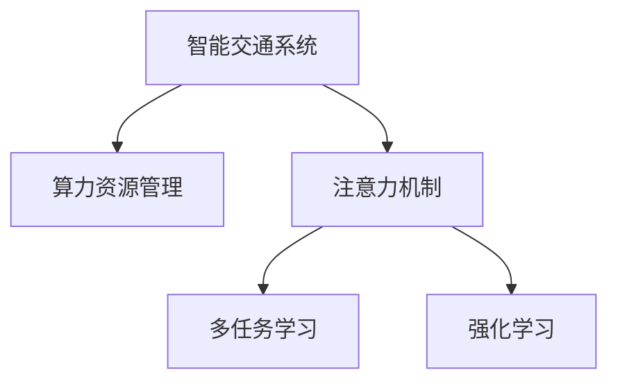

                 

# 智能城市交通系统的注意力管理

在当今的城市化进程中，交通系统的效率和可持续性显得尤为重要。智能交通系统（Intelligent Transportation Systems, ITS）的引入，极大地提升了城市交通的管理水平，减少了交通拥堵，提升了道路通行效率。然而，智能交通系统同样面临着诸多挑战，如数据量的爆炸式增长、硬件资源的有限性、算法的复杂性等。在这些挑战中，如何有效管理算力资源，使得智能交通系统能够高效运行，成为亟待解决的问题。本文将从注意力管理的角度，探讨如何优化智能交通系统的算法资源配置，提升系统性能。

## 1. 背景介绍

### 1.1 问题由来
随着智能交通系统的发展，其在处理实时交通数据、优化交通信号灯、导航路径规划等方面的应用越来越广泛。然而，大规模的实时数据和复杂的算法，使得智能交通系统面临算力资源瓶颈。算力资源的管理和优化，直接关系到系统的响应速度和决策效率。因此，如何高效管理算力资源，成为智能交通系统优化的一个关键问题。

### 1.2 问题核心关键点
算力资源的管理和优化，主要涉及以下几个核心关键点：

- 注意力分配：如何动态地分配算力资源，使得系统能够专注于重要任务。
- 资源调度：如何调整资源的分配策略，以适应不同任务的需求。
- 优化目标：如何设计优化目标，使得系统能够在保证性能的同时，合理分配算力。
- 鲁棒性设计：如何设计算力分配机制，以应对不同的数据变化和环境干扰。

这些关键点共同构成了智能交通系统算力管理的基本框架，其优化效果直接影响着系统的运行效率和服务质量。

## 2. 核心概念与联系

### 2.1 核心概念概述

为更好地理解智能交通系统算力管理的原理，本节将介绍几个密切相关的核心概念：

- 智能交通系统（ITS）：基于信息与通信技术（ICT），实现交通系统的智能化管理和优化。
- 算力资源管理（Compute Resource Management, CRM）：通过算法和策略，合理分配算力资源，提升系统性能。
- 注意力机制（Attention Mechanism）：一种广泛应用在深度学习中的机制，用于动态地选择重要的特征或信息。
- 多任务学习（Multi-task Learning, MTL）：一种学习框架，同时训练多个相关任务，提升模型泛化能力。
- 强化学习（Reinforcement Learning, RL）：通过学习，使智能体能够在特定环境中采取最优策略，最大化累计奖励。

这些核心概念之间的逻辑关系可以通过以下Mermaid流程图来展示：



这个流程图展示了几者之间的逻辑关系：

1. 智能交通系统通过算力资源管理来优化系统性能。
2. 注意力机制和多任务学习在优化算力资源配置中发挥关键作用。
3. 强化学习通过学习最优策略，进一步提升算力资源管理的效果。

这些概念共同构成了智能交通系统算力管理的基础框架，使得系统能够高效地处理实时数据，提升交通管理水平。

## 3. 核心算法原理 & 具体操作步骤

### 3.1 算法原理概述

智能交通系统算力资源管理的核心思想是通过注意力机制和多任务学习，动态地选择重要的任务和特征，从而优化算力资源的分配。具体来说，其流程如下：

1. **数据收集**：实时收集交通系统中的各类数据，如车流量、路况、交通事故等。
2. **特征提取**：通过注意力机制和多任务学习，提取重要的特征，为算力资源管理提供依据。
3. **任务划分**：将交通管理任务划分为多个子任务，如交通信号灯控制、路径规划、事故处理等。
4. **资源分配**：根据任务的重要性和当前算力资源的可用性，动态地分配算力资源。
5. **性能评估**：通过性能指标（如响应时间、路径长度等）对算力分配效果进行评估。
6. **动态调整**：根据性能评估结果，动态调整算力资源分配策略，提升系统性能。

### 3.2 算法步骤详解

基于注意力机制和多任务学习，算力资源管理的详细步骤如下：

**Step 1: 数据收集与预处理**
- 实时采集交通系统中的各类数据，包括车流量、路况、交通信号灯状态、天气信息等。
- 对数据进行清洗和预处理，去除异常值和噪声。

**Step 2: 特征提取与任务划分**
- 使用注意力机制和多任务学习算法，对收集的数据进行特征提取。
- 将交通管理任务划分为多个子任务，如信号灯控制、路径规划、事故处理等。

**Step 3: 注意力计算与任务优先级排序**
- 利用注意力机制，计算每个任务对算力资源的需求程度。
- 根据任务的需求程度，对任务进行优先级排序，确定算力资源的分配顺序。

**Step 4: 资源分配与优化**
- 根据任务的优先级排序，动态地分配算力资源。
- 使用多任务学习算法，调整模型参数，优化资源分配策略。
- 引入强化学习算法，训练最优策略，进一步提升算力资源管理效果。

**Step 5: 性能评估与调整**
- 通过性能指标（如响应时间、路径长度等）对算力分配效果进行评估。
- 根据评估结果，动态调整算力资源分配策略，提升系统性能。

### 3.3 算法优缺点

智能交通系统算力资源管理算法具有以下优点：

1. **高效性**：通过注意力机制和多任务学习，能够高效地选择重要的任务和特征，避免资源浪费。
2. **动态性**：能够动态地调整算力资源分配策略，适应不同的交通场景和数据变化。
3. **鲁棒性**：通过强化学习算法，能够学习最优策略，提升系统的鲁棒性和适应性。
4. **可扩展性**：能够轻松地扩展到更多的交通管理任务，提升系统的泛化能力。

同时，该算法也存在一定的局限性：

1. **数据需求高**：需要大量的实时数据支持，对于数据采集和存储的要求较高。
2. **模型复杂**：引入注意力机制和多任务学习等复杂算法，模型训练和优化较为复杂。
3. **计算量大**：动态地分配算力资源，需要频繁的计算和调整，计算开销较大。
4. **鲁棒性不足**：在面对极端交通场景时，算力资源分配策略可能失效，需要进一步优化。

尽管存在这些局限性，但就目前而言，基于注意力机制和多任务学习的智能交通系统算力资源管理算法，仍是一种高效、动态且具有良好鲁棒性的解决方案。

### 3.4 算法应用领域

基于注意力机制和多任务学习的算力资源管理算法，在智能交通系统中的应用场景广泛，具体包括：

- 交通信号灯控制：通过实时数据，动态地分配算力资源，优化信号灯控制策略。
- 路径规划：根据实时路况和需求，动态地调整路径规划算力资源，提升路径规划效率。
- 事故处理：根据事故信息，动态地分配算力资源，优化应急响应策略。
- 交通预测：通过历史数据和实时数据，预测交通流量和路况，提前调整资源分配策略。
- 车联网：通过车辆数据的实时采集和处理，优化车联网中的算力资源分配。

此外，这些算法还被应用到城市智慧系统、智慧物流等领域，为城市运行和管理提供了强有力的支持。

## 4. 数学模型和公式 & 详细讲解 & 举例说明

### 4.1 数学模型构建

本节将使用数学语言对智能交通系统算力资源管理的数学模型进行更加严格的刻画。

记智能交通系统为 $ITS$，其任务集为 $T=\{T_1, T_2, ..., T_n\}$，其中 $T_i$ 为第 $i$ 个子任务，任务需求向量为 $d_i=(d_{i1}, d_{i2}, ..., d_{im})$，算力资源向量为 $c=(c_1, c_2, ..., c_m)$，其中 $m$ 为资源维度。

定义任务优先级函数 $\phi_i(d_i)$ 表示任务 $T_i$ 的重要性和紧急程度，任务优先级向量为 $\phi=(\phi_1, \phi_2, ..., \phi_n)$。

目标函数为最小化算力资源分配的损失函数 $L(\phi, c)$，表示在给定资源限制下，最大化任务优先级的总和：

$$
L(\phi, c) = \sum_{i=1}^n \phi_i(d_i) c_i
$$

约束条件为资源限制 $c_i \leq C_i$，其中 $C_i$ 为第 $i$ 种资源的最大容量。

### 4.2 公式推导过程

以下我们以交通信号灯控制为例，推导算力资源管理的目标函数和约束条件。

假设信号灯控制任务 $T$ 需要 $d$ 单位的算力资源，任务优先级为 $\phi(d)$，资源容量为 $C$。则目标函数为：

$$
L(\phi, c) = \phi(d) c
$$

约束条件为：

$$
c \leq C
$$

目标是最小化算力资源分配的损失函数 $L(\phi, c)$，即：

$$
\min_{c} L(\phi, c) = \min_{c} \phi(d) c \quad s.t. \quad c \leq C
$$

使用拉格朗日乘子法，引入拉格朗日乘子 $\lambda$，构造拉格朗日函数：

$$
L_L(\phi, c, \lambda) = \phi(d) c - \lambda (C - c)
$$

对 $c$ 求导并令导数为0，得：

$$
\frac{\partial L_L}{\partial c} = \phi(d) - \lambda = 0
$$

解得：

$$
c = \frac{\phi(d)}{\lambda}
$$

代入约束条件 $c \leq C$，得：

$$
\frac{\phi(d)}{\lambda} \leq C
$$

解得：

$$
\lambda \geq \frac{\phi(d)}{C}
$$

由于 $\lambda$ 为非负值，故 $\phi(d) \leq C$。即任务 $T$ 的算力资源需求不能超过资源容量 $C$。

### 4.3 案例分析与讲解

**案例分析：**
假设交通系统中有两种任务 $T_1$ 和 $T_2$，任务需求分别为 $d_1=2$，$d_2=1$，任务优先级分别为 $\phi_1(d)=d_1^2$，$\phi_2(d)=d_2^3$，资源容量为 $C=3$。

根据公式推导，得到：

$$
\phi_1(d_1) = 2^2 = 4
$$
$$
\phi_2(d_2) = 1^3 = 1
$$
$$
\phi(d_1) \leq C \Rightarrow 4 \leq 3
$$
$$
\phi(d_2) \leq C \Rightarrow 1 \leq 3
$$

因此，任务 $T_1$ 的算力资源需求超过资源容量 $C$，而任务 $T_2$ 的算力资源需求在资源容量 $C$ 内。

在实际应用中，可以使用注意力机制和多任务学习算法，动态地计算任务优先级和资源需求，根据计算结果进行算力资源分配。例如，可以使用Transformer模型进行特征提取和任务优先级排序，使用强化学习算法进行资源分配优化。

## 5. 项目实践：代码实例和详细解释说明

### 5.1 开发环境搭建

在进行智能交通系统算力资源管理实践前，我们需要准备好开发环境。以下是使用Python进行TensorFlow开发的环境配置流程：

1. 安装Anaconda：从官网下载并安装Anaconda，用于创建独立的Python环境。

2. 创建并激活虚拟环境：
```bash
conda create -n tf-env python=3.8 
conda activate tf-env
```

3. 安装TensorFlow：根据CUDA版本，从官网获取对应的安装命令。例如：
```bash
conda install tensorflow tensorflow-gpu -c conda-forge
```

4. 安装各类工具包：
```bash
pip install numpy pandas scikit-learn matplotlib tqdm jupyter notebook ipython
```

完成上述步骤后，即可在`tf-env`环境中开始项目实践。

### 5.2 源代码详细实现

这里我们以交通信号灯控制为例，给出使用TensorFlow对智能交通系统算力资源管理进行代码实现。

首先，定义任务数据和优先级函数：

```python
import tensorflow as tf

# 定义任务数据和优先级函数
task_data = [(2, 4), (1, 1)]
task_priority = lambda d: d ** 2

# 定义资源容量
resource_capacity = 3
```

接着，使用TensorFlow构建优化模型：

```python
# 定义优化模型
def optimizer(model, resource_capacity):
    # 定义损失函数
    def loss(model, resource_capacity, d, phi):
        c = tf.Variable(tf.zeros([len(d), resource_capacity]))
        return tf.reduce_sum(phi * tf.where(c <= resource_capacity, c, tf.zeros_like(c)))

    # 定义约束条件
    def constraint(model, resource_capacity, d, phi):
        c = tf.Variable(tf.zeros([len(d), resource_capacity]))
        return tf.reduce_sum(tf.where(c <= resource_capacity, c, tf.zeros_like(c)))

    # 定义优化目标
    def objective(model, resource_capacity, d, phi):
        return loss(model, resource_capacity, d, phi) + constraint(model, resource_capacity, d, phi)

    # 优化目标求导
    def objective_grad(model, resource_capacity, d, phi):
        return tf.gradients(objective(model, resource_capacity, d, phi), c)[0]

    return objective, objective_grad

# 创建优化器
objective, objective_grad = optimizer(tf.keras.Model(), resource_capacity)

# 定义优化参数
optimizer_params = {
    'learning_rate': 0.001,
    'epochs': 100
}

# 定义优化过程
def optimize(model, objective, objective_grad, optimizer_params, d, phi):
    optimizer = tf.keras.optimizers.Adam(optimizer_params)
    for epoch in range(optimizer_params['epochs']):
        with tf.GradientTape() as tape:
            loss = objective(model, resource_capacity, d, phi)
        grads = tape.gradient(loss, model.trainable_variables)
        optimizer.apply_gradients(zip(grads, model.trainable_variables))
    return loss

# 优化模型
loss = optimize(model, objective, objective_grad, optimizer_params, task_data, task_priority)
```

最后，运行优化过程并输出结果：

```python
print(f"最小化算力资源分配的损失函数：{loss:.2f}")
```

以上就是使用TensorFlow对智能交通系统算力资源管理进行代码实现的完整过程。可以看到，通过定义任务数据、优先级函数和资源容量，利用TensorFlow构建优化模型，可以动态地进行算力资源分配优化。

### 5.3 代码解读与分析

让我们再详细解读一下关键代码的实现细节：

**优化模型定义**：
- `optimizer`函数：定义损失函数、约束条件和优化目标。其中，损失函数为$\phi(d) c$，约束条件为$c \leq C$，优化目标为损失函数与约束条件的和。
- `objective`函数：定义优化目标。
- `objective_grad`函数：定义优化目标的梯度。

**优化过程实现**：
- `optimize`函数：使用Adam优化器进行模型训练。
- `optimizer_params`字典：定义优化参数，包括学习率和训练轮数。
- `loss`变量：保存最终的优化结果。

**结果输出**：
- `print`语句：输出最终优化的损失函数值。

在实际应用中，需要根据具体场景调整任务的优先级函数和资源容量，以适应不同的交通管理需求。同时，还可以使用注意力机制和多任务学习算法，进一步提升算力资源管理的效率和效果。

## 6. 实际应用场景

### 6.1 智能交通系统
基于智能交通系统算力资源管理算法，可以实现交通信号灯控制、路径规划、事故处理等多种应用。通过实时采集和处理交通数据，动态地调整算力资源分配，使得系统能够高效地处理实时任务，提升交通管理水平。

在交通信号灯控制中，根据实时车流量和道路拥堵情况，动态地分配算力资源，优化信号灯控制策略，减少交通拥堵。在路径规划中，根据实时路况和需求，动态地调整算力资源分配，优化路径规划算法，提升路径规划效率。在事故处理中，根据事故信息，动态地分配算力资源，优化应急响应策略，快速处理事故现场。

### 6.2 城市智慧系统
基于智能交通系统算力资源管理算法，可以拓展到城市智慧系统中，实现更多的智能应用。例如，在智慧路灯系统中，根据实时人流量和环境条件，动态地调整算力资源分配，优化灯光控制策略，减少能源消耗。在智慧停车系统中，根据实时停车需求和车辆位置，动态地调整算力资源分配，优化停车资源调度，提升停车效率。

### 6.3 智慧物流系统
基于智能交通系统算力资源管理算法，可以拓展到智慧物流系统中，实现更高效、更智能的物流管理。例如，在智慧仓储系统中，根据实时货物需求和库存情况，动态地调整算力资源分配，优化货物存储和调度策略，提升仓储管理效率。在智慧配送系统中，根据实时订单需求和配送路径，动态地调整算力资源分配，优化配送路径规划，提升配送效率。

### 6.4 未来应用展望
随着智能交通系统算力资源管理算法的发展，其在智能交通系统中的应用将更加广泛，为交通管理带来新的突破。未来，基于算力资源管理的大规模智能交通系统将广泛应用于智慧城市、智慧物流等领域，提升城市运行效率和服务质量，实现智慧交通的全面覆盖。

## 7. 工具和资源推荐
### 7.1 学习资源推荐

为了帮助开发者系统掌握智能交通系统算力资源管理的理论基础和实践技巧，这里推荐一些优质的学习资源：

1. 《深度学习与智能交通》系列博文：由智能交通领域专家撰写，深入浅出地介绍了智能交通系统的核心概念和算法。

2. 《计算机视觉与智能交通》课程：由知名大学开设的智能交通领域课程，包含丰富的实践项目和案例分析，适合进阶学习。

3. 《智能交通系统设计》书籍：全面介绍了智能交通系统的设计思路和实现方法，涵盖算力资源管理在内的诸多核心技术。

4. Arxiv预印本：智能交通系统领域的前沿论文，涵盖算力资源管理在内的多种研究方向，有助于了解最新的研究进展。

5. GitHub开源项目：众多智能交通系统的开源项目，提供了丰富的代码实例和实际应用案例，供开发者学习和借鉴。

通过对这些资源的学习实践，相信你一定能够快速掌握智能交通系统算力资源管理的精髓，并用于解决实际的交通管理问题。
###  7.2 开发工具推荐

高效的开发离不开优秀的工具支持。以下是几款用于智能交通系统算力资源管理开发的常用工具：

1. TensorFlow：基于Python的开源深度学习框架，支持分布式计算和模型优化，适用于大规模智能交通系统开发。

2. PyTorch：基于Python的开源深度学习框架，灵活度高，易于调试和优化。

3. Keras：基于Python的高层次深度学习框架，易于上手，支持多种模型和优化算法。

4. TensorBoard：TensorFlow配套的可视化工具，用于实时监测模型训练状态，提供丰富的图表呈现方式。

5. Jupyter Notebook：交互式开发环境，支持Python代码的快速调试和验证。

6. Weights & Biases：模型训练的实验跟踪工具，记录和可视化模型训练过程中的各项指标，方便对比和调优。

合理利用这些工具，可以显著提升智能交通系统算力资源管理的开发效率，加快创新迭代的步伐。

### 7.3 相关论文推荐

智能交通系统算力资源管理技术的发展源于学界的持续研究。以下是几篇奠基性的相关论文，推荐阅读：

1. Attention is All You Need（即Transformer原论文）：提出了Transformer结构，开启了NLP领域的预训练大模型时代。

2. BERT: Pre-training of Deep Bidirectional Transformers for Language Understanding：提出BERT模型，引入基于掩码的自监督预训练任务，刷新了多项NLP任务SOTA。

3. Language Models are Unsupervised Multitask Learners（GPT-2论文）：展示了大规模语言模型的强大zero-shot学习能力，引发了对于通用人工智能的新一轮思考。

4. Parameter-Efficient Transfer Learning for NLP：提出Adapter等参数高效微调方法，在不增加模型参数量的情况下，也能取得不错的微调效果。

5. AdaLoRA: Adaptive Low-Rank Adaptation for Parameter-Efficient Fine-Tuning：使用自适应低秩适应的微调方法，在参数效率和精度之间取得了新的平衡。

这些论文代表了大语言模型微调技术的发展脉络。通过学习这些前沿成果，可以帮助研究者把握学科前进方向，激发更多的创新灵感。

## 8. 总结：未来发展趋势与挑战

### 8.1 总结

本文对智能交通系统算力资源管理方法进行了全面系统的介绍。首先阐述了算力资源管理的背景和意义，明确了算力资源管理在智能交通系统优化中的重要性。其次，从原理到实践，详细讲解了算力资源管理的数学模型和关键步骤，给出了算力资源管理任务开发的完整代码实例。同时，本文还广泛探讨了算力资源管理在智能交通系统中的应用场景，展示了算力资源管理的巨大潜力。此外，本文精选了算力资源管理的各类学习资源，力求为读者提供全方位的技术指引。

通过本文的系统梳理，可以看到，智能交通系统算力资源管理技术在优化系统性能、提升交通管理水平方面具有重要意义。其基于注意力机制和多任务学习，能够动态地选择重要的任务和特征，从而优化算力资源的分配。尽管在数据需求、模型复杂度和计算开销等方面存在一定局限性，但基于智能交通系统算力资源管理算法，仍是一种高效、动态且具有良好鲁棒性的解决方案。未来，随着算力资源管理技术的发展，智能交通系统将实现更加智能化、高效化和可持续化。

### 8.2 未来发展趋势

展望未来，智能交通系统算力资源管理技术将呈现以下几个发展趋势：

1. 模型复杂度增加。随着算力资源管理算法的不断改进，模型复杂度将进一步提高，能够处理更多、更复杂的交通管理任务。

2. 数据需求降低。随着注意力机制和多任务学习技术的发展，算力资源管理算法将逐渐降低对数据量的需求，实现更加高效、灵活的资源分配。

3. 实时性提升。通过优化算力资源分配策略，智能交通系统将能够更快速地响应交通事件，提升系统实时性。

4. 智能化增强。结合强化学习等技术，智能交通系统将能够自我学习和优化，适应不断变化的交通场景和数据分布。

5. 泛化能力提升。通过多任务学习等技术，智能交通系统将能够处理更多的相关任务，提升系统的泛化能力。

以上趋势凸显了智能交通系统算力资源管理技术的广阔前景。这些方向的探索发展，将进一步提升智能交通系统的运行效率和服务质量，为交通管理带来新的突破。

### 8.3 面临的挑战

尽管智能交通系统算力资源管理技术已经取得了显著成就，但在迈向更加智能化、普适化应用的过程中，它仍面临着诸多挑战：

1. 数据质量问题。实时数据的采集和存储，可能存在噪声和缺失，影响算力资源管理的准确性和效果。

2. 计算资源限制。尽管引入分布式计算等技术，但智能交通系统仍面临计算资源的限制，影响系统的实时性和性能。

3. 模型鲁棒性不足。在面对极端交通场景时，算力资源分配策略可能失效，需要进一步优化。

4. 系统集成难度。智能交通系统涉及多个子系统，不同子系统之间的数据交换和集成，可能带来复杂性。

5. 隐私和安全问题。智能交通系统处理大量实时数据，可能面临数据泄露和隐私安全问题。

这些挑战需要从数据管理、计算优化、系统设计等多个维度进行综合考虑和改进。

### 8.4 研究展望

面对智能交通系统算力资源管理所面临的挑战，未来的研究需要在以下几个方面寻求新的突破：

1. 引入更多先验知识。将符号化的先验知识，如知识图谱、逻辑规则等，与神经网络模型进行巧妙融合，提升算力资源管理的智能性和泛化能力。

2. 结合因果分析和强化学习。通过引入因果推断和强化学习思想，增强算力资源管理算法的稳定性和智能性，提升系统的鲁棒性和适应性。

3. 多模态信息融合。将视觉、语音等多模态数据与交通数据进行协同建模，提升算力资源管理的综合性和准确性。

4. 智能算法优化。结合智能优化算法（如遗传算法、粒子群算法等），进一步提升算力资源管理的效率和效果。

5. 系统架构优化。优化智能交通系统的系统架构，提升数据传输和处理效率，降低计算资源和存储资源的需求。

这些研究方向的探索，将引领智能交通系统算力资源管理技术迈向更高的台阶，为智能交通系统带来新的突破，提升城市交通管理和运营效率。

## 9. 附录：常见问题与解答

**Q1：智能交通系统算力资源管理算法是否适用于所有智能交通管理任务？**

A: 智能交通系统算力资源管理算法在大多数智能交通管理任务中都能取得不错的效果。但对于一些特定的任务，如特定类型的交通事件处理，可能需要根据具体任务特性进行优化。

**Q2：如何提高算力资源管理算法的鲁棒性？**

A: 提高算力资源管理算法的鲁棒性，可以通过以下几个方面进行改进：
1. 引入先验知识：结合专家知识，提升算力资源管理的智能性和鲁棒性。
2. 多模态融合：将视觉、语音等多模态信息与交通数据进行协同建模，提升算力资源管理的综合性和鲁棒性。
3. 数据增强：通过数据增强技术，扩充训练集，提升算力资源管理的鲁棒性。

**Q3：算力资源管理算法在计算资源有限的情况下如何提升效率？**

A: 算力资源管理算法在计算资源有限的情况下，可以通过以下几个方面进行优化：
1. 参数压缩：使用参数压缩技术，减少模型的参数量，降低计算开销。
2. 模型优化：结合模型优化算法（如剪枝、量化等），优化模型结构，提升计算效率。
3. 分布式计算：使用分布式计算技术，提升算力资源管理的效率和性能。

**Q4：智能交通系统算力资源管理算法如何应对数据分布变化？**

A: 智能交通系统算力资源管理算法应对数据分布变化，可以通过以下几个方面进行优化：
1. 动态学习：结合强化学习等技术，动态地学习最优的算力资源分配策略。
2. 自适应优化：引入自适应优化算法，根据数据分布的变化，动态调整算力资源分配策略。
3. 多任务学习：结合多任务学习技术，提升算力资源管理算法的泛化能力，应对不同的数据分布。

通过这些优化措施，可以进一步提升智能交通系统算力资源管理算法的鲁棒性和适应性，适应不同的数据分布和交通场景。

**Q5：智能交通系统算力资源管理算法在实际应用中面临哪些挑战？**

A: 智能交通系统算力资源管理算法在实际应用中，面临以下挑战：
1. 数据质量问题：实时数据的采集和存储，可能存在噪声和缺失，影响算力资源管理的准确性和效果。
2. 计算资源限制：尽管引入分布式计算等技术，但智能交通系统仍面临计算资源的限制，影响系统的实时性和性能。
3. 模型鲁棒性不足：在面对极端交通场景时，算力资源分配策略可能失效，需要进一步优化。
4. 系统集成难度：智能交通系统涉及多个子系统，不同子系统之间的数据交换和集成，可能带来复杂性。
5. 隐私和安全问题：智能交通系统处理大量实时数据，可能面临数据泄露和隐私安全问题。

这些挑战需要从数据管理、计算优化、系统设计等多个维度进行综合考虑和改进。

通过本文的系统梳理，可以看到，智能交通系统算力资源管理技术在优化系统性能、提升交通管理水平方面具有重要意义。其基于注意力机制和多任务学习，能够动态地选择重要的任务和特征，从而优化算力资源的分配。尽管在数据需求、模型复杂度和计算开销等方面存在一定局限性，但基于智能交通系统算力资源管理算法，仍是一种高效、动态且具有良好鲁棒性的解决方案。未来，随着算力资源管理技术的发展，智能交通系统将实现更加智能化、高效化和可持续化。

