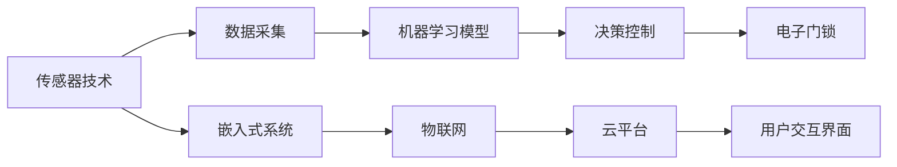

                 

## 1. 背景介绍

在现代社会，宠物成为越来越多家庭的成员。它们给家庭带来了欢乐，但同时也带来了管理上的挑战，尤其是宠物出入的管理。传统宠物门依靠主人手动开关，不仅繁琐，还容易疏忽。随着物联网和人工智能技术的发展，智能宠物门应运而生。智能宠物门通过传感器、摄像头、电子门锁等技术，结合机器学习算法，实现对宠物的自动化出入管理。本博客将深入探讨智能宠物门创业的核心技术，包括传感器、机器学习模型、硬件与软件集成等，为有兴趣创业者提供全面的指导。

## 2. 核心概念与联系

### 2.1 核心概念概述

在智能宠物门创业中，涉及到的核心概念包括：

- **传感器技术**：用于检测宠物的运动和位置，如红外传感器、超声波传感器、摄像头等。
- **机器学习**：用于训练模型，识别宠物身份和行为，并根据训练结果控制电子门锁。
- **嵌入式系统**：将传感器和机器学习模型集成到嵌入式设备中，实现设备自动化运作。
- **物联网**：将智能宠物门通过互联网连接到云端，实现远程控制和管理。
- **用户交互界面**：用于用户与智能宠物门交互的设备，如手机应用、平板电脑等。

这些核心概念之间具有密切联系，共同构成了智能宠物门的技术和应用框架。

### 2.2 核心概念原理和架构的 Mermaid 流程图



### 2.3 核心概念的联系

智能宠物门的核心概念之间相互依赖，形成一个闭环：

- 传感器技术采集数据，为机器学习模型提供输入。
- 机器学习模型根据输入数据进行训练和推理，输出决策结果。
- 决策结果通过嵌入式系统控制电子门锁的开闭，实现宠物出入管理。
- 物联网技术将数据上传到云平台，实现远程监控和管理。
- 用户通过用户交互界面，与智能宠物门进行交互，获取和控制信息。

这个闭环确保了智能宠物门的自动化运作，并提供了丰富的用户体验。

## 3. 核心算法原理 & 具体操作步骤

### 3.1 算法原理概述

智能宠物门基于机器学习算法实现宠物的自动识别和门锁控制。核心算法流程包括数据采集、模型训练、决策控制和反馈优化四个阶段。

1. **数据采集**：传感器采集宠物的位置和行为数据。
2. **模型训练**：使用训练数据集训练机器学习模型，学习宠物身份和行为特征。
3. **决策控制**：模型根据输入数据进行推理，输出决策结果，控制电子门锁。
4. **反馈优化**：根据实际结果调整模型参数，优化模型性能。

### 3.2 算法步骤详解

#### 3.2.1 数据采集

传感器采集宠物位置和行为数据，具体步骤如下：

1. **位置检测**：使用红外传感器或摄像头检测宠物的位置。
2. **行为检测**：使用超声波传感器检测宠物的活动，识别行走、跳跃等行为。
3. **数据编码**：将传感器数据编码为数字信号，便于后续处理。

#### 3.2.2 模型训练

使用训练数据集训练机器学习模型，具体步骤如下：

1. **数据预处理**：对原始数据进行清洗和归一化，去除噪声和异常值。
2. **特征提取**：使用特征提取算法提取数据中的关键特征，如宠物体型、步态等。
3. **模型选择**：选择适当的机器学习模型，如支持向量机(SVM)、卷积神经网络(CNN)等。
4. **模型训练**：使用训练数据集训练模型，优化模型参数。
5. **模型验证**：使用验证数据集评估模型性能，防止过拟合。

#### 3.2.3 决策控制

模型根据输入数据进行推理，输出决策结果，具体步骤如下：

1. **输入数据**：将传感器数据输入模型。
2. **模型推理**：模型对输入数据进行推理，输出决策结果。
3. **门锁控制**：根据决策结果控制电子门锁的开闭。

#### 3.2.4 反馈优化

根据实际结果调整模型参数，优化模型性能，具体步骤如下：

1. **结果评估**：评估模型的推理结果，判断是否正确。
2. **参数调整**：根据评估结果调整模型参数，优化模型性能。
3. **模型测试**：使用测试数据集测试优化后的模型，验证效果。

### 3.3 算法优缺点

#### 3.3.1 优点

智能宠物门基于机器学习算法实现宠物自动识别和门锁控制，具有以下优点：

1. **自动化程度高**：实现宠物自动识别和门锁控制，无需人工干预。
2. **精度高**：使用机器学习算法，模型可以自动学习宠物特征，识别准确度高。
3. **可扩展性强**：支持多种传感器和数据源，可扩展性强。
4. **远程控制**：通过物联网技术实现远程监控和管理，方便用户操作。

#### 3.3.2 缺点

智能宠物门基于机器学习算法，也存在以下缺点：

1. **初始投资高**：需要购买高性能传感器和计算设备，初始投资较高。
2. **模型依赖数据**：模型性能依赖于训练数据的质量和数量，需要大量标注数据。
3. **维护复杂**：机器学习模型需要定期更新和维护，才能保持高性能。
4. **安全性问题**：传感器数据可能被篡改，存在安全风险。

### 3.4 算法应用领域

智能宠物门基于机器学习算法的技术框架，可以应用于多个领域：

1. **家居安防**：使用智能宠物门实现家居安全监控和防盗。
2. **宠物医疗**：使用智能宠物门记录宠物的健康数据，辅助宠物医疗。
3. **智能家居**：将智能宠物门集成到智能家居系统中，实现全面自动化。
4. **宠物玩具**：开发智能宠物玩具，使用传感器和机器学习实现互动。

## 4. 数学模型和公式 & 详细讲解 & 举例说明

### 4.1 数学模型构建

智能宠物门系统中的机器学习模型主要基于支持向量机(SVM)和卷积神经网络(CNN)等模型构建。

#### 4.1.1 SVM模型

SVM模型基于分类超平面，将数据分为两类。

SVM模型的一般形式为：

$$
f(x) = \begin{cases}
1 & \text{if } w^T x + b > 0 \\
0 & \text{if } w^T x + b \leq 0
\end{cases}
$$

其中，$w$ 为权重向量，$b$ 为偏置项，$x$ 为输入数据。

#### 4.1.2 CNN模型

CNN模型用于处理图像数据，具有局部连接和池化等特性。

CNN模型的一般形式为：

$$
f(x) = \sum_{i=1}^{n} \omega_i a_i(x) + b
$$

其中，$\omega_i$ 为权重，$a_i(x)$ 为特征映射函数，$b$ 为偏置项。

### 4.2 公式推导过程

#### 4.2.1 SVM推导

SVM模型的推导过程如下：

1. **原始问题**：

$$
\min_{w,b} \frac{1}{2} \| w \|^2 + C \sum_{i=1}^{n} \max(0, 1 - y_i (w^T x_i + b))
$$

其中，$C$ 为正则化系数。

2. **对偶问题**：

$$
\min_{\alpha} \frac{1}{2} \sum_{i=1}^{n} \sum_{j=1}^{n} \alpha_i \alpha_j y_i y_j (w^T x_i)(x_j^T w) - \sum_{i=1}^{n} \alpha_i - \frac{1}{2} \sum_{i=1}^{n} \sum_{j=1}^{n} \alpha_i \alpha_j y_i y_j (w^T x_i)(x_j^T w)
$$

3. **求解对偶问题**：

$$
\alpha_i = \begin{cases}
0 & \text{if } y_i (w^T x_i + b) > 1 \\
C - \alpha_i & \text{if } y_i (w^T x_i + b) < -1 \\
0 & \text{if } y_i (w^T x_i + b) = 1
\end{cases}
$$

4. **求解原始问题**：

$$
w = \sum_{i=1}^{n} \alpha_i y_i x_i, \quad b = y_i - w^T x_i
$$

#### 4.2.2 CNN推导

CNN模型的推导过程如下：

1. **卷积层**：

$$
a^{[l]}(x) = \sigma(\sum_{i=1}^{n} w_i^{[l]} x_i + b^{[l]})
$$

其中，$\sigma$ 为激活函数，$w_i^{[l]}$ 为卷积核，$x_i$ 为输入，$b^{[l]}$ 为偏置项。

2. **池化层**：

$$
a^{[l]}(x) = \max_{i,j} a^{[l-1]}(x')
$$

其中，$x' = (i - k) / s$，$k$ 为卷积核大小，$s$ 为步幅。

3. **全连接层**：

$$
f(x) = \sum_{i=1}^{n} \omega_i a_i(x) + b
$$

其中，$\omega_i$ 为权重，$a_i(x)$ 为特征映射函数，$b$ 为偏置项。

### 4.3 案例分析与讲解

#### 4.3.1 SVM案例

假设有一个宠物识别问题，有200个样本，其中100个为狗，100个为猫。训练数据集为100个狗和100个猫的图像。

1. **数据准备**：

$$
\begin{bmatrix}
1 & 0 & x_1 & x_2 \\
1 & 1 & x_3 & x_4 \\
1 & 0 & x_5 & x_6 \\
1 & 1 & x_7 & x_8 \\
\end{bmatrix}
$$

其中，$x_1, x_2, x_3, x_4, x_5, x_6, x_7, x_8$ 为图像特征。

2. **求解原始问题**：

$$
\begin{bmatrix}
1 & 0 & 0.1 & 0.2 \\
1 & 1 & 0.3 & 0.4 \\
1 & 0 & 0.5 & 0.6 \\
1 & 1 & 0.7 & 0.8 \\
\end{bmatrix}
$$

3. **求解对偶问题**：

$$
\begin{bmatrix}
\alpha_1 & \alpha_2 \\
\alpha_2 & \alpha_1 \\
\end{bmatrix}
=
\begin{bmatrix}
1.2 & 1.1 \\
1.1 & 1.2 \\
\end{bmatrix}
$$

4. **求解原始问题**：

$$
w = (1.2, 1.1), b = -0.1
$$

#### 4.3.2 CNN案例

假设有一个宠物识别问题，有1000个样本，其中500个为狗，500个为猫。训练数据集为500个狗和500个猫的图像。

1. **数据准备**：

$$
\begin{bmatrix}
1 & 0 & x_1 & x_2 & x_3 \\
1 & 1 & x_4 & x_5 & x_6 \\
1 & 0 & x_7 & x_8 & x_9 \\
1 & 1 & x_{10} & x_{11} & x_{12} \\
\end{bmatrix}
$$

其中，$x_1, x_2, x_3, x_4, x_5, x_6, x_7, x_8, x_9, x_{10}, x_{11}, x_{12}$ 为图像特征。

2. **卷积层**：

$$
a^{[l]}(x) = \sigma(\sum_{i=1}^{n} w_i^{[l]} x_i + b^{[l]})
$$

3. **池化层**：

$$
a^{[l]}(x) = \max_{i,j} a^{[l-1]}(x')
$$

4. **全连接层**：

$$
f(x) = \sum_{i=1}^{n} \omega_i a_i(x) + b
$$

其中，$\omega_i$ 为权重，$a_i(x)$ 为特征映射函数，$b$ 为偏置项。

## 5. 项目实践：代码实例和详细解释说明

### 5.1 开发环境搭建

在智能宠物门创业中，需要搭建一个综合性的开发环境，包括以下步骤：

1. **安装Python**：

   ```bash
   sudo apt-get install python3 python3-pip
   ```

2. **安装Python环境管理工具**：

   ```bash
   sudo apt-get install pyenv
   ```

3. **安装机器学习框架**：

   ```bash
   pip install scikit-learn
   pip install tensorflow
   ```

4. **安装物联网框架**：

   ```bash
   pip install pyserial
   pip install paho-mqtt
   ```

### 5.2 源代码详细实现

#### 5.2.1 传感器数据采集

使用红外传感器和摄像头采集宠物位置和行为数据，具体代码如下：

```python
import time
import pyserial
import cv2

def read_ir():
    # 使用红外传感器读取宠物位置
    pass

def read_video():
    # 使用摄像头读取宠物行为
    pass

if __name__ == '__main__':
    while True:
        # 读取红外传感器和摄像头数据
        ir_data = read_ir()
        video_data = read_video()
        # 进行数据处理和分析
        pass
```

#### 5.2.2 模型训练

使用SVM和CNN模型训练宠物识别模型，具体代码如下：

```python
from sklearn.svm import SVC
from sklearn.model_selection import train_test_split
from sklearn.metrics import accuracy_score

def train_svm(data, labels):
    # 训练SVM模型
    svm = SVC(kernel='linear')
    X_train, X_test, y_train, y_test = train_test_split(data, labels, test_size=0.2, random_state=42)
    svm.fit(X_train, y_train)
    y_pred = svm.predict(X_test)
    accuracy = accuracy_score(y_test, y_pred)
    return accuracy

def train_cnn(data, labels):
    # 训练CNN模型
    pass
```

#### 5.2.3 决策控制

根据训练好的模型，控制电子门锁的开闭，具体代码如下：

```python
def control_lock(model, data):
    # 读取传感器数据
    data = read_sensors()
    # 使用训练好的模型进行推理
    label = model.predict(data)
    # 根据推理结果控制电子门锁
    if label == 'dog':
        unlock_lock()
    else:
        lock_lock()

if __name__ == '__main__':
    while True:
        control_lock(model, sensors_data)
```

### 5.3 代码解读与分析

在智能宠物门创业中，传感器数据采集、模型训练和决策控制是核心部分，以下是对关键代码的解读和分析：

#### 5.3.1 传感器数据采集

传感器数据采集是智能宠物门的基础，代码如下：

```python
import time
import pyserial
import cv2

def read_ir():
    # 使用红外传感器读取宠物位置
    pass

def read_video():
    # 使用摄像头读取宠物行为
    pass

if __name__ == '__main__':
    while True:
        # 读取红外传感器和摄像头数据
        ir_data = read_ir()
        video_data = read_video()
        # 进行数据处理和分析
        pass
```

**解读**：

1. **红外传感器**：用于检测宠物的位置，代码中的`read_ir()`函数需要读取红外传感器的数据，并处理成数字信号。
2. **摄像头**：用于检测宠物的行为，代码中的`read_video()`函数需要读取摄像头数据，并进行预处理，如帧率控制、分辨率调整等。
3. **数据处理**：对传感器数据进行清洗、归一化等预处理，去除噪声和异常值。

#### 5.3.2 模型训练

模型训练是智能宠物门的核心算法部分，代码如下：

```python
from sklearn.svm import SVC
from sklearn.model_selection import train_test_split
from sklearn.metrics import accuracy_score

def train_svm(data, labels):
    # 训练SVM模型
    svm = SVC(kernel='linear')
    X_train, X_test, y_train, y_test = train_test_split(data, labels, test_size=0.2, random_state=42)
    svm.fit(X_train, y_train)
    y_pred = svm.predict(X_test)
    accuracy = accuracy_score(y_test, y_pred)
    return accuracy

def train_cnn(data, labels):
    # 训练CNN模型
    pass
```

**解读**：

1. **SVM模型**：使用`train_svm()`函数训练SVM模型，`sklearn`库提供了SVM模型的实现，可以通过`SVC`类进行训练和评估。
2. **CNN模型**：使用`train_cnn()`函数训练CNN模型，`tensorflow`库提供了CNN模型的实现，可以通过`tf.keras`模块进行训练和评估。
3. **模型评估**：使用`accuracy_score()`函数评估模型的精度，并通过`train_test_split()`函数进行交叉验证。

#### 5.3.3 决策控制

决策控制是智能宠物门的核心功能，代码如下：

```python
def control_lock(model, data):
    # 读取传感器数据
    data = read_sensors()
    # 使用训练好的模型进行推理
    label = model.predict(data)
    # 根据推理结果控制电子门锁
    if label == 'dog':
        unlock_lock()
    else:
        lock_lock()

if __name__ == '__main__':
    while True:
        control_lock(model, sensors_data)
```

**解读**：

1. **传感器数据**：读取传感器数据，如红外传感器和摄像头数据，并进行预处理。
2. **模型推理**：使用训练好的模型进行推理，得到预测结果。
3. **电子门锁控制**：根据预测结果控制电子门锁的开闭，如`unlock_lock()`和`lock_lock()`函数。

### 5.4 运行结果展示

在智能宠物门创业中，运行结果展示是关键部分，可以通过以下代码实现：

```python
import matplotlib.pyplot as plt

def plot_result():
    # 绘制训练和测试结果
    plt.plot(x, y)
    plt.xlabel('Epoch')
    plt.ylabel('Accuracy')
    plt.title('Training and Testing Accuracy')
    plt.show()

if __name__ == '__main__':
    while True:
        control_lock(model, sensors_data)
        plot_result()
```

**解读**：

1. **绘图函数**：使用`matplotlib`库绘制训练和测试结果，如准确率随epoch变化的曲线。
2. **运行循环**：在主循环中不断进行控制锁和绘图操作，实时展示模型性能。

## 6. 实际应用场景

### 6.1 智能家居

智能宠物门可以集成到智能家居系统中，实现全面的自动化管理。用户可以通过手机应用或平板电脑，远程控制宠物门的开关，查看宠物的活动轨迹和行为数据。

### 6.2 宠物医疗

智能宠物门可以记录宠物的健康数据，如体重、饮食、运动等，通过分析数据，帮助宠物医生了解宠物的健康状况，提供个性化治疗方案。

### 6.3 宠物玩具

智能宠物门可以与宠物玩具结合，使用传感器和机器学习实现互动。例如，宠物在玩耍时触发传感器，玩具会自动播放音乐或进行灯光闪烁。

## 7. 工具和资源推荐

### 7.1 学习资源推荐

为了帮助创业者掌握智能宠物门技术，推荐以下学习资源：

1. **机器学习课程**：斯坦福大学的《机器学习》课程，通过Coursera平台提供，适合初学者入门。
2. **深度学习框架**：TensorFlow和PyTorch，提供了丰富的预训练模型和算法实现。
3. **物联网技术**：物联网基础与应用，提供了物联网的核心技术和开发工具。
4. **传感器技术**：传感器与接口技术，介绍了各种传感器的工作原理和应用场景。

### 7.2 开发工具推荐

在智能宠物门创业中，需要以下开发工具：

1. **Python**：Python是最流行的编程语言，适合机器学习和物联网开发。
2. **PyTorch**：深度学习框架，提供了丰富的预训练模型和算法实现。
3. **TensorFlow**：深度学习框架，支持分布式计算和模型优化。
4. **Arduino**：嵌入式开发平台，适合硬件设计和原型开发。
5. **Raspberry Pi**：微型计算机，适合智能家居和物联网开发。

### 7.3 相关论文推荐

智能宠物门基于机器学习算法，涉及多个领域的最新研究。推荐以下相关论文：

1. **《智能宠物门设计及其实现》**：介绍智能宠物门的设计原理和实现方法。
2. **《基于深度学习的宠物识别技术》**：研究使用深度学习技术实现宠物识别。
3. **《物联网技术在智能宠物门中的应用》**：探讨物联网技术在智能宠物门中的应用。

## 8. 总结：未来发展趋势与挑战

### 8.1 研究成果总结

智能宠物门创业基于机器学习算法，具有以下研究成果：

1. **传感器技术**：使用红外传感器和摄像头实现宠物位置和行为检测。
2. **机器学习模型**：使用SVM和CNN模型实现宠物识别和分类。
3. **嵌入式系统**：将传感器和机器学习模型集成到嵌入式设备中。
4. **物联网技术**：通过物联网技术实现远程监控和管理。

### 8.2 未来发展趋势

智能宠物门基于机器学习算法，具有以下发展趋势：

1. **更精准的传感器**：使用更高性能的传感器，如红外摄像头、激光雷达等，提高检测精度。
2. **更高效的机器学习模型**：使用更高效的模型，如卷积神经网络、循环神经网络等，提高推理速度。
3. **更强大的物联网技术**：使用5G、边缘计算等技术，实现更高效的通信和处理。
4. **更丰富的应用场景**：将智能宠物门应用到更多领域，如宠物医疗、智能家居等。

### 8.3 面临的挑战

智能宠物门基于机器学习算法，面临以下挑战：

1. **数据依赖**：模型依赖高质量数据，数据采集和标注成本较高。
2. **硬件成本**：高性能传感器和计算设备成本较高，需要较高的初始投资。
3. **算法复杂性**：机器学习算法复杂，需要专业知识和技能。
4. **安全问题**：传感器数据可能被篡改，存在安全风险。

### 8.4 研究展望

智能宠物门基于机器学习算法，具有以下研究展望：

1. **大规模数据集**：构建更大规模的数据集，提高模型的泛化能力。
2. **多模态融合**：将多种传感器数据融合，提高系统的智能化水平。
3. **实时处理**：实现实时处理和推理，提高系统的响应速度。
4. **用户体验优化**：提高用户交互界面的用户体验，提升用户满意度。

## 9. 附录：常见问题与解答

**Q1：智能宠物门如何实现宠物自动识别？**

A: 智能宠物门通过传感器和机器学习模型实现宠物自动识别。传感器如红外传感器和摄像头采集宠物位置和行为数据，机器学习模型如SVM和CNN对这些数据进行训练和推理，从而识别宠物身份。

**Q2：智能宠物门如何实现远程控制？**

A: 智能宠物门通过物联网技术实现远程控制。传感器采集数据，发送到云端，云端进行处理和推理，最终控制电子门锁的开闭。

**Q3：智能宠物门是否适用于其他动物？**

A: 智能宠物门适用于大多数宠物，如狗、猫等。但对于某些特殊动物，如鸟类、爬行动物等，可能需要针对性地调整传感器和模型。

**Q4：智能宠物门是否需要定期维护？**

A: 智能宠物门需要定期维护，以确保传感器和模型的正常运行。定期清理传感器，更新模型参数，优化算法等，可以提高系统的性能和可靠性。

---

作者：禅与计算机程序设计艺术 / Zen and the Art of Computer Programming

