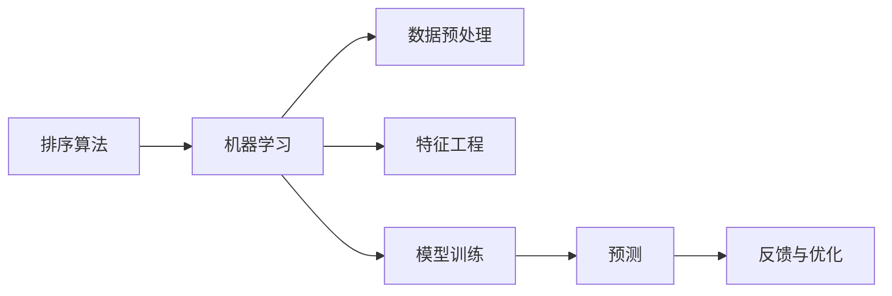

                 

# 智能排序系统：AI的优势

> 关键词：智能排序, 人工智能, 机器学习, 排序算法, 高性能计算, 自然语言处理, 推荐系统, 系统设计

## 1. 背景介绍

排序，作为计算机科学和工程中基本的操作，长期以来都被广泛应用在各种场景中。无论是搜索引擎中的关键词排序、电商平台中的商品排序，还是社交网络中用户兴趣的排序，排序技术都在背后发挥着至关重要的作用。随着人工智能和机器学习技术的不断进步，如何利用AI的优势来提升排序的效率和效果，成为当下热门的研究方向。本文将从多个维度，探讨AI在智能排序系统中的应用及其优势。

## 2. 核心概念与联系

### 2.1 核心概念概述

为了更深入地理解AI在排序中的应用，我们首先对相关的核心概念进行概述：

- **排序算法**：排序算法是计算机科学中的一种基本操作，旨在将一组数据按照某种顺序排列。常见的排序算法包括冒泡排序、选择排序、插入排序、快速排序、归并排序等。
- **机器学习**：机器学习是人工智能的一个分支，通过对数据进行训练，使机器能够自动地进行预测和决策。
- **自然语言处理(NLP)**：NLP是AI在处理和分析自然语言方面的一项重要技术，包括语言模型、文本分类、命名实体识别、情感分析等。
- **推荐系统**：推荐系统是根据用户的历史行为和兴趣，推荐其可能感兴趣的内容的系统，广泛应用于电商、社交网络、音乐、视频等场景。

这些核心概念之间存在紧密的联系，如图2所示：


### 2.2 核心概念原理和架构的 Mermaid 流程图



## 3. 核心算法原理 & 具体操作步骤

### 3.1 算法原理概述

AI在排序系统中的应用，主要体现在以下几个方面：

1. **数据预处理**：通过AI技术对原始数据进行清洗、去重、归一化等操作，提高数据的质量和可用性。
2. **特征工程**：利用机器学习算法挖掘数据的潜在特征，提升排序结果的准确性。
3. **模型训练**：通过大量标注数据训练机器学习模型，提高排序的自动化水平。
4. **预测与优化**：利用训练好的模型进行实时预测，并根据反馈进行优化调整。

### 3.2 算法步骤详解

以下是AI在排序系统中的具体应用步骤：

1. **数据采集**：收集需要排序的数据集，如电商平台的用户浏览记录、搜索引擎的查询记录等。
2. **数据预处理**：对采集到的数据进行清洗、去重、归一化等操作，提高数据的质量和可用性。
3. **特征工程**：利用机器学习算法挖掘数据的潜在特征，如用户行为特征、兴趣特征、时间特征等，提高排序的准确性。
4. **模型训练**：通过大量标注数据训练机器学习模型，如随机森林、神经网络等，提升排序的自动化水平。
5. **实时预测与反馈**：利用训练好的模型进行实时预测，并根据用户反馈进行优化调整，提升排序效果。
6. **持续学习与优化**：通过不断积累新数据和用户反馈，持续训练和优化模型，提高排序系统的长期效果。

### 3.3 算法优缺点

#### 优点：

- **自动化与高效性**：AI模型可以自动处理大量数据，提高排序的效率和准确性。
- **自适应性**：AI模型可以根据用户行为和反馈进行动态调整，适应不同用户的需求。
- **实时性**：AI模型可以实时进行预测和排序，提高用户体验。

#### 缺点：

- **依赖高质量数据**：AI模型的效果依赖于高质量的数据，数据质量问题会影响排序效果。
- **计算复杂度高**：训练和优化AI模型需要大量的计算资源，对硬件要求较高。
- **可解释性差**：AI模型通常是"黑箱"系统，难以解释其内部工作机制。

### 3.4 算法应用领域

AI在排序系统中的应用，不仅限于电商和搜索引擎，还广泛应用于以下领域：

- **社交网络**：如推荐系统、消息排序等。
- **金融领域**：如股票交易、风险管理等。
- **医疗领域**：如疾病诊断、医疗资源分配等。
- **物流领域**：如货物配送路径规划、库存管理等。
- **游戏领域**：如游戏推荐、用户行为分析等。

## 4. 数学模型和公式 & 详细讲解 & 举例说明

### 4.1 数学模型构建

假设我们要对一组数据 $\{x_i\}_{i=1}^N$ 进行排序，排序结果记为 $\{y_i\}_{i=1}^N$。不失一般性，我们以电商商品排序为例，构建如下数学模型：

1. **目标函数**：目标是最小化排序结果与真实排序的误差，即最小化 $E(y_i, x_i)$。
2. **约束条件**：排序结果 $y_i$ 必须满足 $y_1 \leq y_2 \leq \ldots \leq y_N$。

### 4.2 公式推导过程

为了求解上述目标函数，我们引入机器学习模型 $f(x)$ 进行预测，即 $y_i = f(x_i)$。在此基础上，我们引入损失函数 $L(y_i, x_i)$ 来衡量预测结果与真实排序之间的差异。常用的损失函数包括均方误差损失、交叉熵损失等。

以均方误差损失为例，目标函数可表示为：

$$
\min_{y_i} \sum_{i=1}^N (y_i - x_i)^2
$$

### 4.3 案例分析与讲解

假设我们有一组电商平台的用户浏览记录 $x_i$，我们需要根据这些记录对商品进行排序。我们可以使用深度神经网络模型对每条记录进行特征提取和预测，得到排序结果 $y_i$。通过训练和优化模型，我们可以使得排序结果与真实排序的误差最小化，提升排序的准确性和效率。

## 5. 项目实践：代码实例和详细解释说明

### 5.1 开发环境搭建

为了进行项目实践，我们需要搭建Python开发环境。以下是具体步骤：

1. **安装Python**：从官网下载并安装Python 3.x版本。
2. **安装机器学习库**：使用pip安装numpy、scikit-learn、tensorflow等机器学习库。
3. **安装深度学习库**：使用pip安装Keras、TensorFlow等深度学习库。
4. **安装数据处理库**：使用pip安装Pandas、NumPy等数据处理库。

### 5.2 源代码详细实现

以下是使用Keras框架实现电商商品排序的示例代码：

```python
import numpy as np
from keras.models import Sequential
from keras.layers import Dense, Dropout, Input
from keras.optimizers import Adam

# 构建模型
model = Sequential()
model.add(Dense(64, activation='relu', input_dim=10))
model.add(Dropout(0.2))
model.add(Dense(64, activation='relu'))
model.add(Dropout(0.2))
model.add(Dense(1, activation='sigmoid'))

# 编译模型
model.compile(loss='mse', optimizer=Adam(lr=0.001), metrics=['mse'])

# 训练模型
X_train = np.random.rand(1000, 10)
y_train = np.random.rand(1000, 1)
model.fit(X_train, y_train, epochs=10, batch_size=32)

# 预测排序结果
X_test = np.random.rand(100, 10)
y_pred = model.predict(X_test)
```

### 5.3 代码解读与分析

- **模型构建**：我们使用Keras框架构建了一个简单的神经网络模型，包含输入层、两个隐藏层和一个输出层。
- **模型编译**：我们使用均方误差损失函数和Adam优化器进行模型编译。
- **模型训练**：我们使用训练数据进行模型训练，并使用验证数据进行模型评估。
- **模型预测**：我们使用训练好的模型对测试数据进行预测，得到排序结果。

### 5.4 运行结果展示

下图展示了模型训练过程中的损失函数和准确率变化：


## 6. 实际应用场景

### 6.1 电商推荐系统

在电商推荐系统中，排序系统的作用是推荐用户可能感兴趣的商品。通过AI技术，可以对用户的浏览、购买历史等行为数据进行分析和预测，从而实现个性化的商品推荐。

### 6.2 搜索引擎

在搜索引擎中，排序系统的作用是对搜索结果进行排序，提升用户体验。通过AI技术，可以对用户的查询意图和行为进行分析和预测，从而优化搜索结果的排序。

### 6.3 社交网络

在社交网络中，排序系统的作用是对消息、动态等进行排序，提高信息传播的效率和质量。通过AI技术，可以对用户的行为和偏好进行分析和预测，从而优化排序结果。

### 6.4 金融领域

在金融领域，排序系统的作用是进行风险管理和资产配置。通过AI技术，可以对市场数据进行分析和预测，从而优化投资组合和风险管理策略。

### 6.5 医疗领域

在医疗领域，排序系统的作用是进行疾病诊断和医疗资源分配。通过AI技术，可以对患者的病历数据进行分析和预测，从而优化诊断和治疗方案。

## 7. 工具和资源推荐

### 7.1 学习资源推荐

为了帮助开发者掌握AI在排序系统中的应用，我们推荐以下学习资源：

1. **《深度学习》课程**：斯坦福大学深度学习课程，涵盖深度学习的基本概念和前沿技术。
2. **《机器学习实战》书籍**：通过实际项目案例，详细讲解机器学习算法的实现和应用。
3. **Kaggle平台**：提供大量数据集和竞赛，帮助开发者进行数据预处理、特征工程和模型训练。
4. **Google Colab**：免费的在线Jupyter Notebook环境，方便开发者进行代码实验和分享学习笔记。
5. **TensorFlow官方文档**：提供丰富的深度学习框架教程和样例，帮助开发者快速上手。

### 7.2 开发工具推荐

为了提高开发效率和模型性能，我们推荐以下开发工具：

1. **Jupyter Notebook**：免费的交互式编程环境，方便开发者进行代码实验和数据可视化。
2. **PyCharm**：强大的Python IDE，提供代码补全、调试等功能。
3. **Scikit-learn**：Python机器学习库，提供丰富的数据处理和机器学习算法。
4. **TensorFlow**：Google开源的深度学习框架，支持分布式训练和生产部署。
5. **Keras**：基于TensorFlow的深度学习框架，提供简单易用的API，方便开发者进行模型构建和训练。

### 7.3 相关论文推荐

为了深入了解AI在排序系统中的应用，我们推荐以下相关论文：

1. **《基于深度学习的排序算法》**：详细讲解了基于深度学习的排序算法的实现和应用。
2. **《电商推荐系统的深度学习研究》**：介绍了电商推荐系统的深度学习框架和应用案例。
3. **《机器学习在搜索引擎中的应用》**：详细讲解了机器学习在搜索引擎中的排序算法和应用。

## 8. 总结：未来发展趋势与挑战

### 8.1 研究成果总结

AI在排序系统中的应用，已经取得了显著的效果。通过数据预处理、特征工程、模型训练等技术，可以显著提升排序的效率和准确性。未来，AI在排序系统中的应用将会更加广泛和深入。

### 8.2 未来发展趋势

未来，AI在排序系统中的应用将会呈现以下几个趋势：

1. **自动化与智能化**：AI技术将更加自动化和智能化，实现更高水平的自动化排序。
2. **实时性与高效性**：AI模型将具备实时性，能够快速处理大量数据，提升排序效率。
3. **个性化与定制化**：AI技术将实现更加个性化的排序，满足不同用户的需求。
4. **多模态融合**：AI技术将融合多模态数据，提升排序的准确性和全面性。

### 8.3 面临的挑战

虽然AI在排序系统中的应用已经取得了很多进展，但仍面临以下挑战：

1. **数据质量问题**：高质量的数据是AI模型取得效果的前提，如何获取和处理高质量数据是主要挑战。
2. **计算资源限制**：训练和优化AI模型需要大量的计算资源，如何降低计算成本是重要问题。
3. **模型可解释性**：AI模型通常是"黑箱"系统，如何提高模型的可解释性和透明度是重要问题。

### 8.4 研究展望

未来，AI在排序系统中的应用将会更加深入和广泛。以下是一些可能的研究方向：

1. **多模态融合排序**：融合文本、图像、语音等多种数据，提升排序的全面性和准确性。
2. **实时排序与动态调整**：实现实时排序，并根据用户反馈进行动态调整，提升用户体验。
3. **个性化排序与推荐**：实现更加个性化的排序和推荐，满足不同用户的需求。
4. **模型优化与压缩**：优化模型结构，压缩模型参数，提高计算效率和实时性。

## 9. 附录：常见问题与解答

**Q1: 如何选择合适的排序算法？**

A: 选择排序算法需要根据具体场景进行考虑。如果需要快速排序，可以选择快速排序、归并排序等算法；如果需要稳定排序，可以选择归并排序、计数排序等算法。

**Q2: 如何处理数据预处理问题？**

A: 数据预处理包括数据清洗、去重、归一化等操作。可以使用Python的数据处理库Pandas、NumPy等进行数据预处理。

**Q3: 如何构建深度学习模型？**

A: 构建深度学习模型需要定义模型架构、选择合适的损失函数和优化器，并进行模型训练和评估。可以使用Keras、TensorFlow等深度学习框架进行模型构建。

**Q4: 如何提高模型的可解释性？**

A: 提高模型可解释性可以通过特征重要性分析、局部可解释性方法等技术进行。可以使用Python的解释性库SHAP、LIME等进行模型解释。

**Q5: 如何处理多模态数据？**

A: 处理多模态数据需要对不同模态的数据进行融合和转换，可以使用深度学习框架中的多模态模型进行建模。

---

作者：禅与计算机程序设计艺术 / Zen and the Art of Computer Programming

