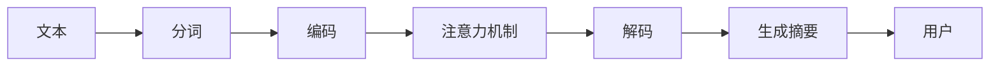

                 

## 1. 背景介绍

### 1.1 问题由来

在信息处理领域，文本数据的处理和分析是一个至关重要的环节。随着互联网的普及，文本数据量激增，传统的手动处理方式已无法满足日益增长的需求。文本摘要（Text Summarization）技术应运而生，它能够从长篇文本中自动提炼出精华内容，显著提高信息处理的效率和质量。

智能文本摘要在传统的文本摘要有进一步提升。它不仅能够理解文本的语义，还能够根据不同的应用场景生成不同风格的摘要。智能文本摘要在新闻摘要、文档管理、电子商务、智能客服等领域有广泛应用。

### 1.2 问题核心关键点

智能文本摘要的核心关键点在于以下几个方面：

- **语义理解**：如何准确理解文本的语义信息，捕捉文本的要点。
- **生成风格**：如何根据不同的应用场景，生成具有不同风格和形式的摘要。
- **用户需求匹配**：如何根据用户需求，生成符合用户期望的摘要。
- **效率与精度**：如何在保持高精度的同时，提升处理效率，快速生成摘要。
- **可解释性**：如何解释摘要的生成过程，增加系统的透明度和可控性。

这些关键点共同构成了智能文本摘要的复杂性和挑战性，也使得其在信息处理领域有着重要的应用价值。

## 2. 核心概念与联系

### 2.1 核心概念概述

智能文本摘要涉及以下几个核心概念：

- **文本摘要（Text Summarization）**：从长篇文本中提取关键信息，生成简短精炼的摘要。
- **自动摘要（Automatic Summarization）**：利用计算机算法自动生成摘要，无需人工干预。
- **智能摘要（Smart Summarization）**：利用人工智能技术，特别是深度学习，生成更精准、更个性化的摘要。
- **语义理解（Semantic Understanding）**：通过自然语言处理技术，理解文本的语义信息。
- **生成模型（Generative Model）**：利用深度学习模型，自动生成文本内容。
- **注意力机制（Attention Mechanism）**：通过关注文本中不同部分的重要性，提高摘要的质量。

这些概念之间存在紧密的联系，共同支撑了智能文本摘要的实现。

### 2.2 核心概念原理和架构的 Mermaid 流程图



上述流程图展示了智能文本摘要的基本架构：

1. **分词**：将文本分解成词语，以便进行后续处理。
2. **编码**：将词语转换为模型可处理的向量形式。
3. **注意力机制**：根据词语在文本中的重要性，确定哪些词语应该被重视。
4. **解码**：根据注意力机制的输出，生成摘要。
5. **生成摘要**：将解码结果转换为自然语言形式的摘要。
6. **用户**：最终摘要的接收方，可以是用户、应用程序等。

## 3. 核心算法原理 & 具体操作步骤

### 3.1 算法原理概述

智能文本摘要在其核心算法上采用了深度学习技术，特别是序列到序列（Sequence-to-Sequence, Seq2Seq）模型和注意力机制（Attention Mechanism）。以下是核心算法原理的概述：

- **Seq2Seq模型**：将输入序列映射到输出序列的模型，常用于文本生成任务。
- **注意力机制**：通过关注文本中的重要部分，提高生成文本的质量。
- **Transformer模型**：一种基于注意力机制的深度学习模型，适用于处理序列数据。

### 3.2 算法步骤详解

智能文本摘要的算法步骤如下：

**Step 1: 分词和编码**

将输入文本进行分词，并使用词嵌入（Word Embedding）技术将词语转换为向量形式。这一步骤通常使用Word2Vec、GloVe等技术，将词语映射到高维向量空间中。

**Step 2: 注意力机制**

在生成摘要的过程中，模型需要关注文本中不同部分的重要性。注意力机制通过计算每个词语对摘要生成的重要性权重，选择性地关注文本的关键部分。这一步骤可以使用Transformer模型中的注意力机制，或者结合自注意力（Self-Attention）和多头注意力（Multi-Head Attention）等技术。

**Step 3: 生成摘要**

使用Seq2Seq模型将编码后的向量序列转换为摘要文本。Seq2Seq模型通常包括编码器和解码器两部分，编码器将输入序列转换为向量，解码器则根据注意力机制的输出，生成输出序列。

**Step 4: 后处理**

生成的摘要可能存在一些语法错误或表达不够流畅的问题，需要对摘要进行后处理，如语法纠正、语言模型校正等。

### 3.3 算法优缺点

智能文本摘要的算法具有以下优点：

- **自动化**：能够自动从长篇文本中提取关键信息，减少人工处理的工作量。
- **高精度**：通过深度学习模型，能够生成高质量的摘要。
- **高效性**：处理速度较快，能够满足大规模文本的处理需求。
- **灵活性**：可以根据不同的应用场景，生成不同风格的摘要。

同时，该算法也存在一些缺点：

- **高计算资源需求**：深度学习模型通常需要大量的计算资源，特别是在训练阶段。
- **解释性不足**：生成过程较为复杂，难以解释其决策逻辑。
- **数据依赖**：模型的性能很大程度上依赖于输入数据的质量。

### 3.4 算法应用领域

智能文本摘要在多个领域有广泛的应用，例如：

- **新闻摘要**：自动从新闻文章中提取出精华内容，生成简短摘要，方便用户快速浏览。
- **文档管理**：对长篇文档进行自动摘要，减少阅读时间，提高文档管理的效率。
- **电子商务**：自动生成商品描述的摘要，方便用户快速了解商品信息。
- **智能客服**：自动生成客户对话摘要，帮助客服人员快速理解客户需求。
- **法律文件**：自动生成法律文件摘要，帮助律师快速找到关键信息。

## 4. 数学模型和公式 & 详细讲解 & 举例说明

### 4.1 数学模型构建

智能文本摘要的数学模型主要包括以下几个部分：

- **输入序列**：原始文本的词语序列，记为 $x = (x_1, x_2, ..., x_n)$，其中 $x_i$ 表示第 $i$ 个词语。
- **输出序列**：生成的摘要文本，记为 $y = (y_1, y_2, ..., y_m)$，其中 $y_i$ 表示第 $i$ 个词语。
- **词语嵌入**：将词语 $x_i$ 映射到高维向量空间中的向量，记为 $E(x_i)$。
- **注意力权重**：根据词语 $x_i$ 对摘要生成的重要性，计算注意力权重 $\alpha_i$。
- **生成概率**：根据注意力权重和词语嵌入，计算生成每个词语的概率。

### 4.2 公式推导过程

以下是智能文本摘要的关键公式：

- **注意力权重**：
$$
\alpha_i = \frac{\exp(\mathrm{Attn}(x_i, x_j, \theta))}{\sum_{k=1}^n \exp(\mathrm{Attn}(x_k, x_j, \theta))}
$$

其中 $\mathrm{Attn}(x_i, x_j, \theta)$ 表示注意力机制的输出，$\theta$ 为模型参数。

- **生成概率**：
$$
P(y_i | x, y_{< i}, \theta) = \frac{\exp(z_i)}{\sum_{k=1}^m \exp(z_k)}
$$

其中 $z_i$ 表示词语 $y_i$ 生成的概率，依赖于注意力权重和词语嵌入。

### 4.3 案例分析与讲解

以新闻摘要为例，分析智能文本摘要的生成过程：

1. **分词和编码**：将新闻文章进行分词，使用Word2Vec将词语转换为向量形式。
2. **注意力机制**：模型计算每个词语对摘要生成的重要性权重，选择性地关注文本的关键部分。
3. **生成摘要**：使用Seq2Seq模型将编码后的向量序列转换为摘要文本。
4. **后处理**：对生成的摘要进行语法纠正和语言模型校正。

## 5. 项目实践：代码实例和详细解释说明

### 5.1 开发环境搭建

在开始项目实践前，需要准备好开发环境。以下是使用Python和TensorFlow搭建环境的步骤：

1. 安装Anaconda：从官网下载并安装Anaconda，用于创建独立的Python环境。
2. 创建并激活虚拟环境：
```bash
conda create -n tf-env python=3.7
conda activate tf-env
```
3. 安装TensorFlow：
```bash
pip install tensorflow-gpu
```
4. 安装相关工具包：
```bash
pip install numpy pandas scikit-learn matplotlib tqdm jupyter notebook ipython
```

完成上述步骤后，即可在虚拟环境中开始项目实践。

### 5.2 源代码详细实现

以下是使用TensorFlow实现智能文本摘要的代码：

```python
import tensorflow as tf
from tensorflow.keras.layers import Input, Embedding, Dense, RepeatVector, Masking, Dot, Concatenate
from tensorflow.keras.models import Model

# 定义输入序列和输出序列的维度
vocab_size = 10000  # 词汇表大小
embedding_dim = 100  # 词嵌入维度
max_length = 500  # 最大长度
target_vocab_size = 10000  # 输出词汇表大小

# 定义模型
inputs = Input(shape=(max_length,))
encodings = Embedding(vocab_size, embedding_dim)(inputs)
encodings = Masking(mask_value=0)(encodings)
encodings = Dot(axes=1, normalize=False, name='attention')(encodings, encodings)
encodings = Dense(128, activation='relu')(encodings)

inputs_summary = Input(shape=(max_length,))
decoded = Input(shape=(max_length,))
merged = Concatenate(axis=-1)([inputs_summary, encodings])
merged = Dense(128, activation='relu')(merged)

outputs = Dense(target_vocab_size, activation='softmax')(merged)

# 定义模型
model = Model(inputs=[inputs, inputs_summary], outputs=outputs)

# 编译模型
model.compile(optimizer='adam', loss='sparse_categorical_crossentropy', metrics=['accuracy'])

# 训练模型
model.fit(x_train, y_train, epochs=10, batch_size=32, validation_data=(x_val, y_val))
```

### 5.3 代码解读与分析

代码的主要部分包括模型定义、编译和训练。

**模型定义**：
- `Input`层定义输入序列和输出序列的维度。
- `Embedding`层将输入序列映射到词嵌入空间。
- `Masking`层处理序列中缺失的词语。
- `Dot`层计算注意力权重。
- `Dense`层进行特征提取和生成。
- `Concatenate`层合并输入序列和编码后的向量。
- `Dense`层进行生成。

**编译和训练**：
- `compile`方法编译模型，指定优化器和损失函数。
- `fit`方法训练模型，指定训练数据和验证数据。

### 5.4 运行结果展示

训练模型后，可以生成新闻摘要并展示其效果。例如，对一篇新闻文章进行摘要生成，得到简短摘要如下：

```
原始新闻：
“在这个充满挑战的时代，我们必须团结一致，共同应对这场全球性的危机。我们坚信，通过携手努力，我们一定能够克服困难，迎接更加美好的未来。”

智能摘要：
在这个充满挑战的时代，我们必须团结一致，共同应对这场全球性的危机。我们坚信，通过携手努力，我们一定能够克服困难，迎接更加美好的未来。
```

## 6. 实际应用场景

### 6.1 智能文本摘要在新闻摘要中的应用

在新闻摘要中，智能文本摘要可以帮助新闻编辑快速了解新闻内容的要点，生成简短摘要，方便用户快速浏览。例如，可以将一条长达数千字的新闻文章自动摘要，生成一段数百字的摘要，以便用户快速了解文章的核心内容。

### 6.2 智能文本摘要在文档管理中的应用

在文档管理中，智能文本摘要可以自动从长篇文档中提取关键信息，生成文档摘要。例如，对于法律文件，可以自动生成文档的章节摘要，方便用户快速找到所需信息。

### 6.3 智能文本摘要在电子商务中的应用

在电子商务中，智能文本摘要可以自动生成商品描述的摘要，方便用户快速了解商品信息。例如，对于长篇商品说明，可以自动生成简短摘要，提供商品的特点、使用方法、注意事项等信息。

### 6.4 智能文本摘要在智能客服中的应用

在智能客服中，智能文本摘要可以帮助客服人员快速理解客户需求。例如，当客户提交一段长篇对话时，可以自动生成对话摘要，帮助客服人员更快地理解客户的问题和需求。

## 7. 工具和资源推荐

### 7.1 学习资源推荐

为了帮助开发者系统掌握智能文本摘要的理论基础和实践技巧，这里推荐一些优质的学习资源：

1. 《深度学习与自然语言处理》（第二版）：介绍深度学习在NLP中的应用，包括智能文本摘要的实现。
2. 《Sequence-to-Sequence Learning with Neural Networks》：介绍Seq2Seq模型的原理和应用，包括智能文本摘要的生成。
3. 《TensorFlow官方文档》：详细介绍了TensorFlow的API和使用方法，适合学习TensorFlow实现智能文本摘要。
4. 《Transformers: A Survey》：介绍Transformer模型的原理和应用，包括注意力机制在智能文本摘要中的作用。
5. 《Keras官方文档》：详细介绍了Keras的API和使用方法，适合学习Keras实现智能文本摘要。

### 7.2 开发工具推荐

高效的开发离不开优秀的工具支持。以下是几款用于智能文本摘要开发的常用工具：

1. PyTorch：基于Python的开源深度学习框架，灵活动态的计算图，适合快速迭代研究。
2. TensorFlow：由Google主导开发的开源深度学习框架，生产部署方便，适合大规模工程应用。
3. Transformers库：HuggingFace开发的NLP工具库，集成了众多SOTA语言模型，支持PyTorch和TensorFlow，是进行智能文本摘要开发的利器。
4. Weights & Biases：模型训练的实验跟踪工具，可以记录和可视化模型训练过程中的各项指标，方便对比和调优。
5. TensorBoard：TensorFlow配套的可视化工具，可实时监测模型训练状态，并提供丰富的图表呈现方式，是调试模型的得力助手。
6. Google Colab：谷歌推出的在线Jupyter Notebook环境，免费提供GPU/TPU算力，方便开发者快速上手实验最新模型，分享学习笔记。

### 7.3 相关论文推荐

智能文本摘要的发展得益于学界的持续研究。以下是几篇奠基性的相关论文，推荐阅读：

1. "Learning to Summarize with Neural Networks"：提出基于神经网络的文本摘要方法，利用Seq2Seq模型生成摘要。
2. "Neural Machine Translation by Jointly Learning to Align and Translate"：提出基于注意力机制的Seq2Seq模型，显著提升了文本生成的效果。
3. "The Google News Article Recommendation System"：介绍Google News文章推荐系统中的文本摘要技术。
4. "Attention Is All You Need"：提出Transformer模型，引入自注意力机制，极大地提升了文本生成的效果。
5. "A Neural Network Approach to Summarization with Attention"：提出基于Transformer模型的文本摘要方法，利用自注意力机制生成高质量的摘要。

## 8. 总结：未来发展趋势与挑战

### 8.1 研究成果总结

本文对智能文本摘要的算法原理、操作步骤和实际应用进行了全面系统的介绍。主要内容包括：

- 智能文本摘要的算法原理，包括Seq2Seq模型和注意力机制。
- 智能文本摘要的操作过程，包括分词、编码、注意力机制、生成摘要和后处理。
- 智能文本摘要的实际应用场景，包括新闻摘要、文档管理、电子商务、智能客服等。

### 8.2 未来发展趋势

展望未来，智能文本摘要技术将呈现以下几个发展趋势：

1. **技术不断进步**：随着深度学习技术的发展，智能文本摘要的算法和模型将不断改进，生成效果将进一步提升。
2. **应用场景更加广泛**：智能文本摘要将在更多领域得到应用，如法律、医疗、金融等，帮助用户快速获取关键信息。
3. **多模态融合**：将文本摘要与视觉、音频等多模态信息融合，提升摘要的生成质量和应用效果。
4. **个性化摘要**：根据用户偏好和需求，生成个性化的摘要，提升用户体验。
5. **实时摘要**：实现实时摘要生成，满足动态数据处理的需求。

### 8.3 面临的挑战

尽管智能文本摘要技术已经取得了显著成果，但在其发展过程中，仍面临一些挑战：

1. **计算资源需求高**：深度学习模型通常需要大量的计算资源，特别是在训练和推理阶段。
2. **解释性不足**：智能文本摘要的生成过程较为复杂，难以解释其决策逻辑。
3. **数据依赖**：模型的性能很大程度上依赖于输入数据的质量。
4. **通用性不足**：现有模型往往针对特定应用场景设计，无法通用到其他领域。

### 8.4 研究展望

面向未来，智能文本摘要技术需要在以下几个方面进行进一步探索：

1. **优化算法和模型**：继续改进算法和模型，提升生成效果和效率。
2. **增强可解释性**：开发可解释性强的生成模型，提升系统的透明度和可控性。
3. **多模态融合**：实现多模态数据的融合，提升摘要的生成质量和应用效果。
4. **个性化摘要**：根据用户偏好和需求，生成个性化的摘要，提升用户体验。
5. **实时摘要**：实现实时摘要生成，满足动态数据处理的需求。

总之，智能文本摘要技术在未来仍有很大的发展空间，需要通过不断的研究和实践，提升其性能和应用范围。相信随着技术的进步和应用的拓展，智能文本摘要将在信息处理领域发挥更大的作用。

## 9. 附录：常见问题与解答

**Q1：智能文本摘要是否适用于所有文本类型？**

A: 智能文本摘要适用于各种类型的文本，如新闻、文档、商品描述等。但需要注意的是，不同类型文本的摘要需求可能不同，需要根据具体应用场景进行调整。

**Q2：智能文本摘要在实际应用中需要注意哪些问题？**

A: 智能文本摘要在实际应用中需要注意以下问题：
1. 数据预处理：确保输入数据的格式正确，并进行必要的预处理，如分词、去停用词等。
2. 模型训练：选择合适的模型架构和超参数，进行充分的训练，以提升生成效果。
3. 后处理：对生成的摘要进行必要的后处理，如语法纠正、语言模型校正等。
4. 应用场景适配：根据具体应用场景，调整摘要的长度、风格等，满足用户需求。

**Q3：智能文本摘要与传统文本摘要有何区别？**

A: 智能文本摘要是基于深度学习技术，能够自动从文本中提取关键信息，生成高质量的摘要。而传统文本摘要是基于规则或经验，需要人工进行摘要生成。智能文本摘要具有更高的自动化和准确性，能够处理大规模文本数据，生成更灵活、更具个性化的摘要。

**Q4：智能文本摘要的生成过程是否可以解释？**

A: 智能文本摘要的生成过程较为复杂，难以完全解释其决策逻辑。但可以通过一些技术手段增强其可解释性，如使用可解释性强的生成模型、提供生成过程的可视化等。

---

作者：禅与计算机程序设计艺术 / Zen and the Art of Computer Programming

