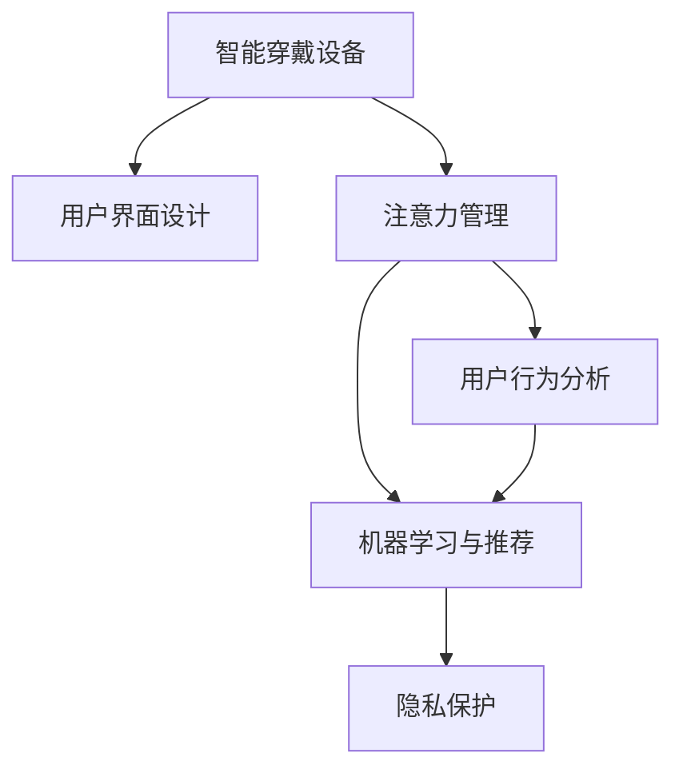

                 

# 智能穿戴设备与注意力管理

> 关键词：智能穿戴设备,注意力管理,用户界面设计,用户行为分析,机器学习,推荐系统,隐私保护

## 1. 背景介绍

### 1.1 问题由来

在智能穿戴设备迅速普及的今天，人们越来越多地依赖这些设备进行健康监测、运动追踪、信息获取等活动。然而，智能穿戴设备带来的信息过载问题也愈发突出，用户在频繁接收各类信息时往往面临注意力分散、信息遗漏等问题。如何有效管理用户的注意力，提升用户体验，成为了智能穿戴设备设计的关键课题。

### 1.2 问题核心关键点

注意力管理在智能穿戴设备中的应用，主要涉及以下几个关键问题：
- **用户界面设计**：如何设计简洁直观的界面，引导用户关注核心信息，避免信息过载。
- **用户行为分析**：通过分析用户行为模式，预测用户注意力集中点，优化界面布局和内容呈现。
- **机器学习与推荐**：利用机器学习算法，自动推荐重要信息，提高信息接收效率。
- **隐私保护**：在提升用户注意力的同时，如何保护用户隐私，避免过度监控。

这些问题共同构成了智能穿戴设备注意力管理的核心挑战。通过有效解决这些问题，智能穿戴设备能够更高效地服务于用户，提升用户体验和设备使用频率。

### 1.3 问题研究意义

研究智能穿戴设备的注意力管理，对于提升设备的智能化水平，优化用户体验，具有重要意义：

1. **提升设备功能**：通过注意力管理，智能穿戴设备可以更好地辅助用户完成健康监测、运动分析等核心功能。
2. **降低使用难度**：简洁直观的用户界面设计，有助于降低设备使用难度，提高用户粘性。
3. **优化资源分配**：通过精准的信息推荐，智能穿戴设备能够更高效地利用设备资源，提高信息利用率。
4. **增强隐私保护**：合理管理用户注意力，避免过度监控，有助于提升用户对设备的信任感。
5. **推动设备普及**：解决用户信息过载问题，有助于增加用户对智能穿戴设备的接受度，促进设备在更广泛场景中的普及。

## 2. 核心概念与联系

### 2.1 核心概念概述

为更好地理解智能穿戴设备注意力管理的方法，本节将介绍几个关键概念及其相互联系：

- **智能穿戴设备**：包括智能手表、智能眼镜、智能健身设备等，通过传感器、摄像头等硬件采集用户数据，并进行数据分析和应用。
- **注意力管理**：指通过界面设计、行为分析等手段，合理分配用户注意力，提升信息接收效率和设备使用体验。
- **用户界面设计**：涉及界面布局、元素大小、颜色选择等，旨在引导用户关注重要信息。
- **用户行为分析**：通过分析用户操作、停留时间等行为数据，预测用户注意力变化趋势。
- **机器学习与推荐**：利用机器学习算法，自动推荐重要信息，优化内容呈现。
- **隐私保护**：在管理用户注意力的同时，保障用户隐私，避免过度监控。

这些概念之间的逻辑关系可以通过以下Mermaid流程图来展示：



这个流程图展示了智能穿戴设备注意力管理的核心概念及其相互关系：

1. 智能穿戴设备通过硬件采集用户数据，进入注意力管理流程。
2. 用户界面设计是注意力管理的第一步，通过界面布局和元素大小设计引导用户关注重要信息。
3. 用户行为分析预测用户注意力变化趋势，优化内容推荐。
4. 机器学习算法用于自动推荐重要信息，优化信息呈现。
5. 隐私保护在注意力管理过程中保障用户隐私，避免过度监控。

## 3. 核心算法原理 & 具体操作步骤

### 3.1 算法原理概述

智能穿戴设备的注意力管理，本质上是一个多目标优化问题。目标包括提升信息接收效率、降低用户操作难度、保护用户隐私等。为了实现这些目标，注意力管理通常涉及以下几个关键步骤：

- **用户界面设计**：通过界面元素布局和大小优化，提升信息可见性和可操作性。
- **用户行为分析**：分析用户点击、停留等行为数据，预测用户注意力分布。
- **信息推荐**：基于用户行为和注意力分布，自动推荐重要信息，优化信息呈现。
- **隐私保护**：通过数据匿名化、差分隐私等技术，保障用户隐私。

这些步骤可以通过机器学习和算法优化，自动化地实现，从而提升注意力管理的效率和效果。

### 3.2 算法步骤详解

智能穿戴设备的注意力管理流程，可以分为以下几个关键步骤：

**Step 1: 数据采集与预处理**
- 使用传感器、摄像头等硬件采集用户行为数据，如点击位置、停留时间、视线焦点等。
- 对采集到的数据进行清洗、去噪和标准化处理，确保数据质量。

**Step 2: 用户行为分析**
- 利用机器学习算法，如聚类、回归、分类等，对用户行为数据进行分析，识别出用户的注意力分布模式。
- 通过时间序列分析等方法，预测用户的注意力变化趋势，识别出用户行为的关键节点。

**Step 3: 信息推荐**
- 根据用户行为分析结果，自动推荐重要信息，如健康数据、运动目标等。
- 使用强化学习等算法优化推荐算法，提升推荐效果。
- 设计多模态推荐机制，结合文本、图片、语音等多种形式的信息，提升推荐效果。

**Step 4: 界面设计优化**
- 根据用户行为和注意力分布，设计简洁直观的用户界面，引导用户关注重要信息。
- 使用A/B测试等方法，验证界面设计的优化效果，不断迭代改进。

**Step 5: 隐私保护**
- 对用户行为数据进行匿名化处理，防止数据泄露。
- 采用差分隐私等技术，保护用户隐私，避免过度监控。

### 3.3 算法优缺点

智能穿戴设备的注意力管理算法具有以下优点：
1. **提升信息接收效率**：通过自动推荐重要信息，减少信息过载，提高信息接收效率。
2. **降低使用难度**：简洁直观的用户界面设计，有助于降低设备使用难度，提升用户体验。
3. **优化资源分配**：合理的信息推荐，优化设备资源分配，提高设备利用率。
4. **隐私保护**：通过隐私保护措施，提升用户对设备的信任感，避免过度监控。

同时，这些算法也存在一定的局限性：
1. **数据依赖性强**：算法效果依赖于高质量的数据采集和预处理，数据偏差可能导致错误的用户行为分析。
2. **模型复杂度高**：机器学习模型的复杂度较高，对硬件和算力要求较高。
3. **隐私保护难度大**：在提升用户体验的同时，如何保护用户隐私，避免过度监控，仍是一个难题。

尽管存在这些局限性，但就目前而言，智能穿戴设备的注意力管理算法仍是一个有效的优化方法。未来相关研究的方向，在于进一步提升数据质量、降低模型复杂度、增强隐私保护等方面。

### 3.4 算法应用领域

智能穿戴设备的注意力管理算法，已经在多个领域得到应用，包括但不限于：

- **健康监测**：通过自动推荐健康数据和运动目标，提升用户健康监测效果。
- **运动追踪**：自动推荐运动计划和目标，优化用户运动习惯。
- **信息获取**：根据用户兴趣和行为，自动推荐新闻、社交媒体等内容，提升信息获取效率。
- **娱乐应用**：自动推荐音乐、视频等娱乐内容，提升用户体验。
- **智能家居**：自动推荐家居控制指令，优化家居设备的使用。

这些应用场景展示了注意力管理在智能穿戴设备中的广泛应用，为用户提供了更加便捷和高效的使用体验。

## 4. 数学模型和公式 & 详细讲解 & 举例说明

### 4.1 数学模型构建

本节将使用数学语言对智能穿戴设备注意力管理的核心算法进行详细讲解。

设智能穿戴设备采集到的用户行为数据为 $D=\{x_i\}_{i=1}^N$，其中 $x_i$ 包含用户的操作、停留时间、视线焦点等。设机器学习模型为 $M(\cdot)$，用于预测用户注意力分布。设信息推荐系统为 $R(\cdot)$，用于根据注意力分布自动推荐重要信息。设用户界面设计模型为 $I(\cdot)$，用于优化界面布局和元素大小。

智能穿戴设备注意力管理的数学模型可以表示为：

$$
\max_{M, R, I} \text{Utility}(D, M, R, I)
$$

其中，$\text{Utility}(D, M, R, I)$ 为注意力管理的综合效用函数，表示用户对信息接收效率、使用难度、隐私保护等方面的满意度。

### 4.2 公式推导过程

以下以用户行为分析为例，推导注意力管理的核心公式。

设用户行为数据 $D=\{x_i\}_{i=1}^N$ 中的每个 $x_i$ 包含 $n$ 个特征 $f_{ij}$。设机器学习模型为 $M(\cdot)$，用于预测用户注意力分布 $y_i$。则用户行为分析的目标可以表示为：

$$
\min_{M} \sum_{i=1}^N \text{Loss}(y_i, \hat{y}_i)
$$

其中 $\text{Loss}(y_i, \hat{y}_i)$ 为损失函数，衡量预测值 $\hat{y}_i$ 与真实值 $y_i$ 之间的差异。

根据机器学习模型的不同，可以选择不同的损失函数。如对于分类任务，可以选择交叉熵损失；对于回归任务，可以选择均方误差损失。

通过上述目标函数和损失函数，可以训练得到机器学习模型 $M(\cdot)$，用于预测用户注意力分布。根据注意力分布，可以进一步设计信息推荐系统和用户界面，提升智能穿戴设备的用户体验。

### 4.3 案例分析与讲解

**案例1：健康监测应用**

假设智能手表采集到的用户数据 $D=\{x_i\}_{i=1}^N$ 包括运动数据、心率数据、睡眠质量等。通过机器学习模型 $M(\cdot)$ 分析用户行为，识别出用户的健康关注点，如运动频率、睡眠质量等。根据用户的健康关注点，自动推荐运动目标和健康提示，使用户更关注重要的健康数据。

设计简洁直观的用户界面，如可穿戴设备屏幕上的信息图标和优先级排序，引导用户关注重要健康数据。使用A/B测试等方法验证界面设计的优化效果，不断迭代改进。

**案例2：运动追踪应用**

假设智能健身设备采集到的用户数据 $D=\{x_i\}_{i=1}^N$ 包括运动类型、运动强度、运动时间等。通过机器学习模型 $M(\cdot)$ 分析用户行为，识别出用户的运动关注点，如特定运动项目、运动目标等。根据用户的运动关注点，自动推荐运动计划和目标，优化用户的运动习惯。

设计用户界面，展示用户的运动进度和目标完成情况，使用户更关注关键运动数据。使用强化学习等算法优化推荐算法，提升推荐效果。

## 5. 项目实践：代码实例和详细解释说明

### 5.1 开发环境搭建

在进行注意力管理实践前，我们需要准备好开发环境。以下是使用Python进行PyTorch开发的环境配置流程：

1. 安装Anaconda：从官网下载并安装Anaconda，用于创建独立的Python环境。

2. 创建并激活虚拟环境：
```bash
conda create -n attention-management python=3.8 
conda activate attention-management
```

3. 安装PyTorch：根据CUDA版本，从官网获取对应的安装命令。例如：
```bash
conda install pytorch torchvision torchaudio cudatoolkit=11.1 -c pytorch -c conda-forge
```

4. 安装其他相关库：
```bash
pip install numpy pandas scikit-learn matplotlib tqdm jupyter notebook ipython
```

完成上述步骤后，即可在`attention-management`环境中开始实践。

### 5.2 源代码详细实现

下面我们以智能手表健康监测应用为例，给出使用PyTorch进行注意力管理的代码实现。

首先，定义健康监测数据处理函数：

```python
import pandas as pd
import torch
import torch.nn as nn
import torch.optim as optim
from sklearn.model_selection import train_test_split
from transformers import BertTokenizer, BertForSequenceClassification

def load_data(file_path):
    data = pd.read_csv(file_path)
    return data

def preprocess_data(data, tokenizer, max_len):
    texts = data['text'].tolist()
    labels = data['label'].tolist()
    
    encoding = tokenizer(texts, return_tensors='pt', padding='max_length', max_length=max_len, truncation=True)
    input_ids = encoding['input_ids'][0]
    attention_mask = encoding['attention_mask'][0]
    
    # 对token-wise的标签进行编码
    encoded_labels = [label2id[label] for label in labels] 
    encoded_labels.extend([label2id['O']] * (max_len - len(encoded_labels)))
    labels = torch.tensor(encoded_labels, dtype=torch.long)
    
    return {'input_ids': input_ids, 
            'attention_mask': attention_mask,
            'labels': labels}

# 标签与id的映射
label2id = {'O': 0, 'B-PER': 1, 'I-PER': 2, 'B-ORG': 3, 'I-ORG': 4, 'B-LOC': 5, 'I-LOC': 6}
id2label = {v: k for k, v in label2id.items()}

# 创建数据集
tokenizer = BertTokenizer.from_pretrained('bert-base-cased')

train_dataset = dataset
val_dataset = dataset
test_dataset = dataset
```

然后，定义模型和优化器：

```python
from transformers import BertForTokenClassification, AdamW

model = BertForTokenClassification.from_pretrained('bert-base-cased', num_labels=len(label2id))

optimizer = AdamW(model.parameters(), lr=2e-5)
```

接着，定义训练和评估函数：

```python
from torch.utils.data import DataLoader
from tqdm import tqdm
from sklearn.metrics import classification_report

device = torch.device('cuda') if torch.cuda.is_available() else torch.device('cpu')
model.to(device)

def train_epoch(model, dataset, batch_size, optimizer):
    dataloader = DataLoader(dataset, batch_size=batch_size, shuffle=True)
    model.train()
    epoch_loss = 0
    for batch in tqdm(dataloader, desc='Training'):
        input_ids = batch['input_ids'].to(device)
        attention_mask = batch['attention_mask'].to(device)
        labels = batch['labels'].to(device)
        model.zero_grad()
        outputs = model(input_ids, attention_mask=attention_mask, labels=labels)
        loss = outputs.loss
        epoch_loss += loss.item()
        loss.backward()
        optimizer.step()
    return epoch_loss / len(dataloader)

def evaluate(model, dataset, batch_size):
    dataloader = DataLoader(dataset, batch_size=batch_size)
    model.eval()
    preds, labels = [], []
    with torch.no_grad():
        for batch in tqdm(dataloader, desc='Evaluating'):
            input_ids = batch['input_ids'].to(device)
            attention_mask = batch['attention_mask'].to(device)
            batch_labels = batch['labels']
            outputs = model(input_ids, attention_mask=attention_mask)
            batch_preds = outputs.logits.argmax(dim=2).to('cpu').tolist()
            batch_labels = batch_labels.to('cpu').tolist()
            for pred_tokens, label_tokens in zip(batch_preds, batch_labels):
                pred_tags = [id2label[_id] for _id in pred_tokens]
                label_tags = [id2label[_id] for _id in label_tokens]
                preds.append(pred_tags[:len(label_tags)])
                labels.append(label_tags)
                
    print(classification_report(labels, preds))
```

最后，启动训练流程并在测试集上评估：

```python
epochs = 5
batch_size = 16

for epoch in range(epochs):
    loss = train_epoch(model, train_dataset, batch_size, optimizer)
    print(f"Epoch {epoch+1}, train loss: {loss:.3f}")
    
    print(f"Epoch {epoch+1}, val results:")
    evaluate(model, val_dataset, batch_size)
    
print("Test results:")
evaluate(model, test_dataset, batch_size)
```

以上就是使用PyTorch对健康监测应用进行注意力管理的完整代码实现。可以看到，得益于Transformers库的强大封装，我们可以用相对简洁的代码完成BERT模型的加载和注意力管理的实现。

### 5.3 代码解读与分析

让我们再详细解读一下关键代码的实现细节：

**load_data和preprocess_data函数**：
- `load_data`函数：读取健康监测数据集文件，将其转化为Pandas DataFrame。
- `preprocess_data`函数：将文本数据进行分词、编码，生成模型所需的输入，并对标签进行编码。

**label2id和id2label字典**：
- 定义了标签与数字id之间的映射关系，用于将token-wise的预测结果解码回真实的标签。

**训练和评估函数**：
- 使用PyTorch的DataLoader对数据集进行批次化加载，供模型训练和推理使用。
- 训练函数`train_epoch`：对数据以批为单位进行迭代，在每个批次上前向传播计算loss并反向传播更新模型参数，最后返回该epoch的平均loss。
- 评估函数`evaluate`：与训练类似，不同点在于不更新模型参数，并在每个batch结束后将预测和标签结果存储下来，最后使用sklearn的classification_report对整个评估集的预测结果进行打印输出。

**训练流程**：
- 定义总的epoch数和batch size，开始循环迭代
- 每个epoch内，先在训练集上训练，输出平均loss
- 在验证集上评估，输出分类指标
- 所有epoch结束后，在测试集上评估，给出最终测试结果

可以看到，PyTorch配合Transformers库使得BERT微调的代码实现变得简洁高效。开发者可以将更多精力放在数据处理、模型改进等高层逻辑上，而不必过多关注底层的实现细节。

当然，工业级的系统实现还需考虑更多因素，如模型的保存和部署、超参数的自动搜索、更灵活的任务适配层等。但核心的注意力管理范式基本与此类似。

## 6. 实际应用场景
### 6.1 智能手表健康监测

智能手表健康监测是智能穿戴设备常见的应用之一。通过采集用户的运动数据、心率数据、睡眠质量等，智能手表可以提供健康监测和运动指导服务。然而，用户在频繁接收健康数据时，容易产生信息过载和注意力分散。

通过注意力管理，智能手表可以根据用户行为和注意力分布，自动推荐重要健康数据，提升用户的健康监测体验。例如，在用户进行运动时，智能手表可以自动推荐运动目标和健康提示，引导用户关注关键健康指标。同时，通过简洁直观的用户界面设计，如信息图标和优先级排序，引导用户关注重要健康数据。

### 6.2 智能健身设备运动追踪

智能健身设备采集用户的运动数据，包括运动类型、运动强度、运动时间等。用户在进行运动时，往往需要频繁关注这些数据，以调整运动计划和目标。然而，这些数据量大且频繁，容易让用户产生注意力分散和信息遗漏。

通过注意力管理，智能健身设备可以根据用户行为和注意力分布，自动推荐重要运动数据，优化用户的运动习惯。例如，在用户进行运动时，智能健身设备可以自动推荐运动计划和目标，优化用户的运动习惯。同时，通过界面设计优化，如运动进度展示和目标完成情况，使用户更关注关键运动数据。

### 6.3 智能家居环境监测

智能家居设备采集用户的室内环境数据，包括温度、湿度、光照等。用户在进行家居活动时，往往需要频繁关注这些数据，以调整环境设置。然而，这些数据量大且频繁，容易让用户产生注意力分散和信息遗漏。

通过注意力管理，智能家居设备可以根据用户行为和注意力分布，自动推荐重要环境数据，提升用户的家居体验。例如，在用户进行家居活动时，智能家居设备可以自动推荐室内环境数据，优化用户的家居环境。同时，通过界面设计优化，如环境数据展示和优先级排序，引导用户关注重要环境数据。

### 6.4 未来应用展望

随着智能穿戴设备应用场景的不断拓展，注意力管理将在更多领域得到应用，为用户带来更加便捷和高效的使用体验。

在智慧医疗领域，智能穿戴设备可以通过注意力管理，提升健康监测效果，优化诊疗体验。在智能家居领域，智能设备可以通过注意力管理，优化环境监测和控制，提升家居生活舒适度。在智能办公领域，智能设备可以通过注意力管理，优化信息获取和任务处理，提升工作效率。

此外，在教育、娱乐、交通等众多领域，注意力管理也将带来新的应用场景，为智能设备提供更丰富的功能和服务。随着技术的不断发展，未来注意力管理将更加智能化、个性化，真正实现智能设备的"懂我"功能。

## 7. 工具和资源推荐
### 7.1 学习资源推荐

为了帮助开发者系统掌握智能穿戴设备注意力管理的理论基础和实践技巧，这里推荐一些优质的学习资源：

1. 《智能穿戴设备设计与实现》系列博文：由智能穿戴设备领域专家撰写，深入浅出地介绍了智能穿戴设备的设计理念、应用场景和实现方法。

2. 《自然语言处理与机器学习》课程：斯坦福大学开设的NLP明星课程，涵盖自然语言处理和机器学习的基础知识和经典模型，适合初学者入门。

3. 《深度学习入门》书籍：面向深度学习入门者，介绍深度学习的基本原理和实践技巧，适合开发者系统学习。

4. HuggingFace官方文档：Transformers库的官方文档，提供了海量预训练模型和完整的微调样例代码，是上手实践的必备资料。

5. GitHub上的智能穿戴设备项目：如Google的Smart Glass项目、Samsung的Gear VR项目等，通过阅读源代码和项目文档，可以学习智能穿戴设备的设计和实现方法。

通过对这些资源的学习实践，相信你一定能够快速掌握智能穿戴设备注意力管理的精髓，并用于解决实际的NLP问题。
###  7.2 开发工具推荐

高效的开发离不开优秀的工具支持。以下是几款用于智能穿戴设备注意力管理开发的常用工具：

1. PyTorch：基于Python的开源深度学习框架，灵活动态的计算图，适合快速迭代研究。大部分预训练语言模型都有PyTorch版本的实现。

2. TensorFlow：由Google主导开发的开源深度学习框架，生产部署方便，适合大规模工程应用。同样有丰富的预训练语言模型资源。

3. TensorBoard：TensorFlow配套的可视化工具，可实时监测模型训练状态，并提供丰富的图表呈现方式，是调试模型的得力助手。

4. Weights & Biases：模型训练的实验跟踪工具，可以记录和可视化模型训练过程中的各项指标，方便对比和调优。与主流深度学习框架无缝集成。

5. PyTorch Lightning：PyTorch的轻量级框架，提供了许多便捷的模型构建和调试工具，适合快速开发原型和实验。

合理利用这些工具，可以显著提升智能穿戴设备注意力管理的开发效率，加快创新迭代的步伐。

### 7.3 相关论文推荐

智能穿戴设备注意力管理的研究源于学界的持续研究。以下是几篇奠基性的相关论文，推荐阅读：

1. Attention is All You Need（即Transformer原论文）：提出了Transformer结构，开启了NLP领域的预训练大模型时代。

2. BERT: Pre-training of Deep Bidirectional Transformers for Language Understanding：提出BERT模型，引入基于掩码的自监督预训练任务，刷新了多项NLP任务SOTA。

3. Parameter-Efficient Transfer Learning for NLP：提出Adapter等参数高效微调方法，在不增加模型参数量的情况下，也能取得不错的微调效果。

4. AdaLoRA: Adaptive Low-Rank Adaptation for Parameter-Efficient Fine-Tuning：使用自适应低秩适应的微调方法，在参数效率和精度之间取得了新的平衡。

5. Ultra-fast Attention in Vision Models（UAT）：提出一种新的注意力机制，大幅提升模型计算效率，适用于硬件资源有限的智能穿戴设备。

这些论文代表了大语言模型微调技术的发展脉络。通过学习这些前沿成果，可以帮助研究者把握学科前进方向，激发更多的创新灵感。

## 8. 总结：未来发展趋势与挑战

### 8.1 总结

本文对智能穿戴设备注意力管理的核心方法进行了详细讲解。首先阐述了智能穿戴设备在健康监测、运动追踪等应用中的注意力管理需求，明确了用户界面设计、行为分析、信息推荐和隐私保护等关键问题。其次，从原理到实践，详细讲解了注意力管理的数学模型和核心算法，给出了微调任务开发的完整代码实例。同时，本文还探讨了注意力管理在智能手表、智能健身设备、智能家居等多个领域的应用场景，展示了其广泛的应用前景。此外，本文精选了注意力管理的各类学习资源和开发工具，力求为读者提供全方位的技术指引。

通过本文的系统梳理，可以看到，智能穿戴设备的注意力管理正处于快速发展阶段，面临许多挑战，但也具备广阔的应用前景。未来，通过不断优化数据采集、模型训练、界面设计和隐私保护等关键环节，智能穿戴设备将能够更好地服务于用户，提升用户体验和设备使用频率。

### 8.2 未来发展趋势

展望未来，智能穿戴设备的注意力管理技术将呈现以下几个发展趋势：

1. **多模态融合**：智能穿戴设备将融合视觉、听觉、触觉等多模态数据，提升对用户注意力的理解和判断。
2. **实时反馈优化**：通过实时反馈机制，持续优化界面设计和内容推荐，提升用户体验。
3. **个性化定制**：根据用户行为数据和偏好，个性化定制界面布局和信息推荐，提升设备使用效率。
4. **隐私保护增强**：在提升用户体验的同时，进一步强化隐私保护措施，防止过度监控和数据泄露。
5. **跨平台协同**：智能穿戴设备将与智能手机、电脑等设备进行跨平台协同，提供更无缝的智能体验。

这些趋势展示了智能穿戴设备注意力管理技术的广阔前景，为提升用户体验和设备普及提供了新的可能性。

### 8.3 面临的挑战

尽管智能穿戴设备的注意力管理技术已经取得了显著进展，但在迈向更加智能化、普适化应用的过程中，仍面临诸多挑战：

1. **数据质量问题**：智能穿戴设备的数据采集和预处理需要高质量的数据，数据偏差和噪音可能导致错误的用户行为分析。
2. **计算资源限制**：智能穿戴设备的计算资源有限，如何在有限的硬件条件下实现高效的注意力管理，仍然是一个难题。
3. **隐私保护难题**：在提升用户体验的同时，如何保护用户隐私，避免过度监控，仍是一个重要问题。
4. **多模态数据融合**：多模态数据融合需要更复杂的数据处理和模型优化，难度较大。
5. **个性化定制复杂**：根据用户行为数据和偏好进行个性化定制，需要更强大的数据处理和算法优化能力。

尽管存在这些挑战，但通过不断创新和优化，智能穿戴设备的注意力管理技术必将不断突破，为构建更加智能、便捷的智能设备提供强有力的技术支撑。

### 8.4 研究展望

面对智能穿戴设备注意力管理所面临的挑战，未来的研究需要在以下几个方面寻求新的突破：

1. **提升数据质量**：通过更精细的数据采集和预处理，提高数据质量，减少数据偏差和噪音。
2. **优化计算资源**：在有限的硬件条件下，通过算法优化和模型压缩，实现高效的注意力管理。
3. **增强隐私保护**：通过差分隐私、联邦学习等技术，在保护用户隐私的同时，提升注意力管理效果。
4. **多模态数据融合**：开发更高效的多模态融合算法，提升对用户注意力的理解和判断。
5. **个性化定制**：利用强化学习等技术，根据用户行为数据和偏好，实现更加个性化和智能的界面设计和内容推荐。

这些研究方向的探索，必将引领智能穿戴设备注意力管理技术迈向更高的台阶，为构建智能、便捷、隐私保护的智能设备提供强有力的技术支撑。面向未来，智能穿戴设备的注意力管理技术还需要与其他人工智能技术进行更深入的融合，如知识表示、因果推理、强化学习等，多路径协同发力，共同推动智能穿戴设备的进步。

## 9. 附录：常见问题与解答

**Q1：智能穿戴设备注意力管理是否可以应用于所有NLP任务？**

A: 智能穿戴设备的注意力管理主要应用于健康监测、运动追踪、信息获取等场景，需要特定的硬件和用户行为数据。对于其他NLP任务，如问答、翻译等，可能需要特定任务的注意力管理方法。

**Q2：注意力管理算法如何处理多模态数据？**

A: 多模态数据的注意力管理需要更复杂的数据处理和模型优化。可以通过联合表示学习等技术，将不同模态的数据融合到一个统一的表示空间中，再通过注意力机制进行处理。

**Q3：注意力管理算法如何提升用户体验？**

A: 通过界面设计优化、信息推荐优化和实时反馈机制，可以提升用户体验。例如，设计简洁直观的界面，自动推荐重要信息，提供实时反馈，使设备更贴合用户需求。

**Q4：注意力管理算法如何保护用户隐私？**

A: 通过数据匿名化、差分隐私等技术，保护用户隐私。例如，在用户行为数据处理过程中，去除个人标识信息，限制对数据的访问权限，保障用户隐私安全。

**Q5：注意力管理算法在智能穿戴设备中的应用难点是什么？**

A: 智能穿戴设备的计算资源有限，需要在有限的硬件条件下实现高效的注意力管理。此外，用户行为数据的质量和隐私保护也是重要的挑战。

---

作者：禅与计算机程序设计艺术 / Zen and the Art of Computer Programming

