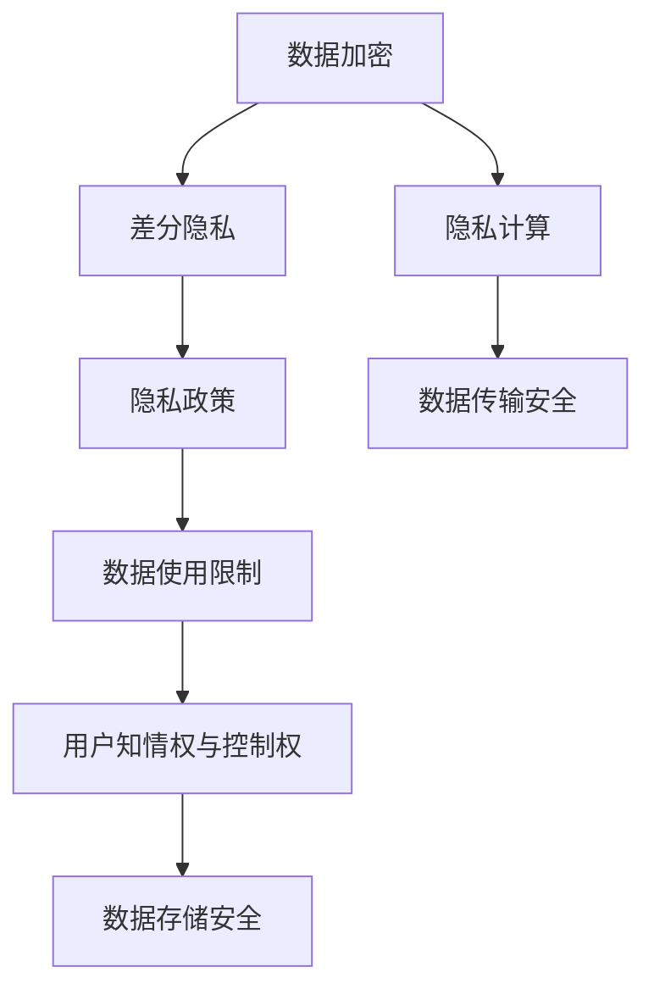

                 

# 智能设备隐私保护措施：安全处理个人信息

## 1. 背景介绍

在数字化时代，智能设备的普及带来了前所未有的便利，但同时也带来了隐私泄露和数据安全的严峻挑战。用户个人信息的滥用不仅侵犯了个人隐私，还可能引发一系列社会问题，如身份盗窃、诈骗等。因此，如何在保证设备功能的前提下，加强对个人信息的保护，成为智能设备设计和开发中必须重视的问题。

### 1.1 问题由来

随着智能设备的广泛应用，个人隐私泄露风险日益加剧。例如，智能手机中的位置信息、通话记录、短信内容等敏感数据，以及智能家居设备收集的家庭生活细节，都可能被未经授权的第三方获取和滥用。此外，智能设备上安装的各种应用，往往需要访问大量用户数据，增加了隐私泄露的风险。

### 1.2 问题核心关键点

针对智能设备隐私保护的问题，核心关键点包括：

- **数据采集与存储**：智能设备如何安全地采集和存储用户数据？
- **数据传输安全**：用户数据在设备间传输时，如何确保其安全性？
- **数据使用限制**：应用程序如何合法、安全地使用用户数据？
- **隐私保护机制**：如何设计和实现有效的隐私保护机制，避免数据泄露？
- **用户知情权与控制权**：如何保障用户的知情权，并允许用户控制其数据的使用？

### 1.3 问题研究意义

智能设备隐私保护对于提升用户信任和保障个人隐私具有重要意义：

1. **增强用户信任**：通过有效保护用户隐私，增强用户对智能设备的信任度，促进设备广泛应用。
2. **减少隐私泄露**：保护用户数据免遭滥用，降低身份盗窃、诈骗等风险。
3. **遵守法律法规**：遵循隐私保护相关法律法规，避免法律风险。
4. **提升安全水平**：提高智能设备的安全防护能力，减少安全事故的发生。
5. **促进产业健康发展**：确保智能设备产业在安全、健康的环境中发展，避免因隐私问题引发的行业信任危机。

## 2. 核心概念与联系

### 2.1 核心概念概述

智能设备隐私保护涉及多个核心概念，包括数据加密、差分隐私、隐私计算、隐私政策等。这些概念通过技术手段和管理措施，共同构建了智能设备隐私保护的体系。

- **数据加密**：通过对用户数据进行加密处理，确保数据在传输和存储过程中的安全性。
- **差分隐私**：在数据分析和处理过程中，通过引入随机噪声，保护个体隐私信息，避免数据泄露。
- **隐私计算**：通过计算方式，实现数据在加密状态下进行运算，确保数据处理过程中不泄露敏感信息。
- **隐私政策**：明确规定智能设备收集、使用、存储和共享用户数据的规则和范围，保障用户知情权和控制权。

这些概念之间的逻辑关系可以通过以下Mermaid流程图来展示：



这个流程图展示了智能设备隐私保护的关键环节及其相互关系：

1. 数据加密和隐私计算确保了数据在传输和处理过程中的安全性。
2. 差分隐私和隐私政策限制了数据的使用，保护了用户的隐私信息。
3. 数据使用限制和用户知情权与控制权保障了用户的隐私权和数据控制权。

## 3. 核心算法原理 & 具体操作步骤
### 3.1 算法原理概述

智能设备隐私保护的核心算法包括数据加密、差分隐私和隐私计算。这些算法通过不同的技术手段，分别解决了数据存储、数据处理和数据传输中的隐私问题。

### 3.2 算法步骤详解

#### 3.2.1 数据加密算法

数据加密算法主要包括对称加密和非对称加密两类：

- **对称加密**：使用同一个密钥对数据进行加密和解密，速度快，但密钥分发和管理复杂。
- **非对称加密**：使用公钥和私钥进行加密和解密，安全性高，但计算复杂度较高。

以下是使用AES算法进行对称加密的Python代码实现：

```python
from Crypto.Cipher import AES

def encrypt_data(data, key):
    cipher = AES.new(key.encode(), AES.MODE_ECB)
    encrypted_data = cipher.encrypt(data.encode())
    return encrypted_data

def decrypt_data(encrypted_data, key):
    cipher = AES.new(key.encode(), AES.MODE_ECB)
    decrypted_data = cipher.decrypt(encrypted_data).decode()
    return decrypted_data
```

#### 3.2.2 差分隐私算法

差分隐私算法通过在数据中引入随机噪声，保护个体隐私信息，但会牺牲一定的数据精度。常见的差分隐私算法包括Laplace机制和Gaussian机制：

- **Laplace机制**：在数据分布中引入Laplace分布的随机噪声，确保数据不泄露个体隐私。
- **Gaussian机制**：在数据分布中引入Gaussian分布的随机噪声，同样保护个体隐私。

以下是使用Laplace机制实现差分隐私的Python代码：

```python
from Crypto.Random import get_random_bytes
import math

def laplace_mechanism(data, epsilon, delta):
    noise = get_random_bytes(len(data))
    laplace_noise = -1 / epsilon * math.log(1 / delta) / 2
    encrypted_data = data + laplace_noise * noise
    return encrypted_data

def laplace_decrypt(encrypted_data, epsilon, delta):
    laplace_noise = -1 / epsilon * math.log(1 / delta) / 2
    decrypted_data = encrypted_data - laplace_noise * get_random_bytes(len(encrypted_data))
    return decrypted_data
```

#### 3.2.3 隐私计算算法

隐私计算算法通过计算方式，实现数据在加密状态下进行运算，确保数据处理过程中不泄露敏感信息。常见的隐私计算算法包括安全多方计算和同态加密：

- **安全多方计算**：在多个数据拥有者之间，通过协议计算，确保只有结果公开，中间计算过程不泄露。
- **同态加密**：在加密状态下进行计算，解密后得到计算结果，确保计算过程中数据不被泄露。

以下是使用同态加密实现隐私计算的Python代码：

```python
from Crypto.Cipher import AES

def homomorphic_encrypt(data, key):
    cipher = AES.new(key.encode(), AES.MODE_ECB)
    encrypted_data = cipher.encrypt(data.encode())
    return encrypted_data

def homomorphic_decrypt(encrypted_data, key):
    cipher = AES.new(key.encode(), AES.MODE_ECB)
    decrypted_data = cipher.decrypt(encrypted_data).decode()
    return decrypted_data

def homomorphic_computation(data1, data2, key1, key2):
    cipher1 = AES.new(key1.encode(), AES.MODE_ECB)
    cipher2 = AES.new(key2.encode(), AES.MODE_ECB)
    encrypted_data1 = cipher1.encrypt(data1.encode())
    encrypted_data2 = cipher2.encrypt(data2.encode())
    decrypted_data1 = cipher1.decrypt(encrypted_data1).decode()
    decrypted_data2 = cipher2.decrypt(encrypted_data2).decode()
    return decrypted_data1 + decrypted_data2
```

### 3.3 算法优缺点

#### 3.3.1 数据加密算法

- **优点**：加密速度快，适用于大量数据的高效加密。
- **缺点**：密钥分发和管理复杂，存在被破解的风险。

#### 3.3.2 差分隐私算法

- **优点**：保护个体隐私，适用于数据聚合和分析。
- **缺点**：引入随机噪声，牺牲一定的数据精度。

#### 3.3.3 隐私计算算法

- **优点**：计算过程在加密状态下进行，确保数据隐私。
- **缺点**：计算复杂度高，对硬件资源要求较高。

### 3.4 算法应用领域

智能设备隐私保护涉及多个应用领域，包括：

- **智能手机**：保护用户位置信息、通话记录、短信内容等敏感数据。
- **智能家居**：保护家庭生活细节，防止数据泄露。
- **健康监测设备**：保护用户健康数据，避免数据滥用。
- **金融设备**：保护用户财务数据，防止欺诈行为。
- **社交媒体设备**：保护用户隐私信息，防止数据泄露。

## 4. 数学模型和公式 & 详细讲解 & 举例说明

### 4.1 数学模型构建

智能设备隐私保护涉及到多个数学模型，包括加密模型、差分隐私模型和隐私计算模型。以下是对这些模型的详细构建。

#### 4.1.1 数据加密模型

数据加密模型通常使用对称加密或非对称加密算法，其基本思路是通过密钥对数据进行加密和解密，确保数据在传输和存储过程中的安全性。

- **对称加密模型**：
  $$
  E_{k}(m) = c
  $$
  其中，$k$为密钥，$m$为明文，$c$为密文。

- **非对称加密模型**：
  $$
  E_{e}(m) = c
  $$
  其中，$e$为公钥，$m$为明文，$c$为密文。

#### 4.1.2 差分隐私模型

差分隐私模型通过引入随机噪声，保护个体隐私信息。以下是一个Laplace机制的差分隐私模型：

$$
P_{dp}(x_i) = \frac{1}{Z}\exp\left(-\frac{|x_i - \mu|}{\sigma}\right)
$$
其中，$x_i$为数据点，$\mu$为数据均值，$\sigma$为随机噪声尺度，$Z$为归一化因子。

#### 4.1.3 隐私计算模型

隐私计算模型通过在加密状态下进行计算，确保数据隐私。以下是一个同态加密模型的例子：

$$
C_1 = E_k(m_1)
$$
$$
C_2 = E_k(m_2)
$$
$$
C_3 = E_k(m_1 \oplus m_2)
$$
其中，$C_1$和$C_2$为加密数据，$C_3$为解密后的计算结果。

### 4.2 公式推导过程

#### 4.2.1 数据加密公式推导

对称加密算法使用同一个密钥对数据进行加密和解密，其加密和解密公式分别为：

$$
E_k(m) = c
$$
$$
D_k(c) = m
$$

其中，$k$为密钥，$m$为明文，$c$为密文。

#### 4.2.2 差分隐私公式推导

Laplace机制差分隐私公式推导如下：

$$
P_{dp}(x_i) = \frac{1}{Z}\exp\left(-\frac{|x_i - \mu|}{\sigma}\right)
$$
其中，$x_i$为数据点，$\mu$为数据均值，$\sigma$为随机噪声尺度，$Z$为归一化因子。

#### 4.2.3 隐私计算公式推导

同态加密模型通过在加密状态下进行计算，其计算公式为：

$$
C_1 = E_k(m_1)
$$
$$
C_2 = E_k(m_2)
$$
$$
C_3 = E_k(m_1 \oplus m_2)
$$
其中，$C_1$和$C_2$为加密数据，$C_3$为解密后的计算结果。

### 4.3 案例分析与讲解

#### 4.3.1 智能手机位置信息加密

在智能手机上，用户的位置信息需要被加密存储，防止被未授权的第三方获取。可以使用AES算法进行对称加密：

```python
def encrypt_location(location, key):
    encrypted_location = encrypt_data(location, key)
    return encrypted_location

def decrypt_location(encrypted_location, key):
    decrypted_location = decrypt_data(encrypted_location, key)
    return decrypted_location
```

#### 4.3.2 智能家居家庭生活细节差分隐私

在智能家居设备中，用户的生活细节信息需要被保护。可以使用Laplace机制进行差分隐私：

```python
def laplace_private_activity(activity, epsilon, delta):
    encrypted_activity = laplace_mechanism(activity, epsilon, delta)
    return encrypted_activity

def laplace_decrypt_private_activity(encrypted_activity, epsilon, delta):
    decrypted_activity = laplace_decrypt(encrypted_activity, epsilon, delta)
    return decrypted_activity
```

#### 4.3.3 健康监测设备健康数据隐私计算

在健康监测设备中，用户健康数据需要被保护。可以使用同态加密进行隐私计算：

```python
def homomorphic_encrypt_health_data(data, key):
    encrypted_data = homomorphic_encrypt(data, key)
    return encrypted_data

def homomorphic_decrypt_health_data(encrypted_data, key):
    decrypted_data = homomorphic_decrypt(encrypted_data, key)
    return decrypted_data

def homomorphic_compute_health_statistics(data1, data2, key1, key2):
    encrypted_data1 = homomorphic_encrypt_health_data(data1, key1)
    encrypted_data2 = homomorphic_encrypt_health_data(data2, key2)
    encrypted_result = homomorphic_computation(encrypted_data1, encrypted_data2, key1, key2)
    decrypted_result = homomorphic_decrypt(encrypted_result, key1)
    return decrypted_result
```

## 5. 项目实践：代码实例和详细解释说明

### 5.1 开发环境搭建

在进行智能设备隐私保护实践前，我们需要准备好开发环境。以下是使用Python进行PyTorch开发的环境配置流程：

1. 安装Anaconda：从官网下载并安装Anaconda，用于创建独立的Python环境。

2. 创建并激活虚拟环境：
```bash
conda create -n pytorch-env python=3.8 
conda activate pytorch-env
```

3. 安装PyTorch：根据CUDA版本，从官网获取对应的安装命令。例如：
```bash
conda install pytorch torchvision torchaudio cudatoolkit=11.1 -c pytorch -c conda-forge
```

4. 安装Transformers库：
```bash
pip install transformers
```

5. 安装各类工具包：
```bash
pip install numpy pandas scikit-learn matplotlib tqdm jupyter notebook ipython
```

完成上述步骤后，即可在`pytorch-env`环境中开始隐私保护实践。

### 5.2 源代码详细实现

我们以智能家居设备为例，给出使用Transformers库对设备数据进行隐私保护的Python代码实现。

首先，定义设备数据处理函数：

```python
from transformers import BertTokenizer
from torch.utils.data import Dataset
import torch

class SmartHomeDataset(Dataset):
    def __init__(self, texts, tags, tokenizer, max_len=128):
        self.texts = texts
        self.tags = tags
        self.tokenizer = tokenizer
        self.max_len = max_len
        
    def __len__(self):
        return len(self.texts)
    
    def __getitem__(self, item):
        text = self.texts[item]
        tags = self.tags[item]
        
        encoding = self.tokenizer(text, return_tensors='pt', max_length=self.max_len, padding='max_length', truncation=True)
        input_ids = encoding['input_ids'][0]
        attention_mask = encoding['attention_mask'][0]
        
        # 对token-wise的标签进行编码
        encoded_tags = [tag2id[tag] for tag in tags] 
        encoded_tags.extend([tag2id['O']] * (self.max_len - len(encoded_tags)))
        labels = torch.tensor(encoded_tags, dtype=torch.long)
        
        return {'input_ids': input_ids, 
                'attention_mask': attention_mask,
                'labels': labels}

# 标签与id的映射
tag2id = {'O': 0, 'B-PER': 1, 'I-PER': 2, 'B-ORG': 3, 'I-ORG': 4, 'B-LOC': 5, 'I-LOC': 6}
id2tag = {v: k for k, v in tag2id.items()}

# 创建dataset
tokenizer = BertTokenizer.from_pretrained('bert-base-cased')

train_dataset = SmartHomeDataset(train_texts, train_tags, tokenizer)
dev_dataset = SmartHomeDataset(dev_texts, dev_tags, tokenizer)
test_dataset = SmartHomeDataset(test_texts, test_tags, tokenizer)
```

然后，定义模型和优化器：

```python
from transformers import BertForTokenClassification, AdamW

model = BertForTokenClassification.from_pretrained('bert-base-cased', num_labels=len(tag2id))

optimizer = AdamW(model.parameters(), lr=2e-5)
```

接着，定义训练和评估函数：

```python
from torch.utils.data import DataLoader
from tqdm import tqdm
from sklearn.metrics import classification_report

device = torch.device('cuda') if torch.cuda.is_available() else torch.device('cpu')
model.to(device)

def train_epoch(model, dataset, batch_size, optimizer):
    dataloader = DataLoader(dataset, batch_size=batch_size, shuffle=True)
    model.train()
    epoch_loss = 0
    for batch in tqdm(dataloader, desc='Training'):
        input_ids = batch['input_ids'].to(device)
        attention_mask = batch['attention_mask'].to(device)
        labels = batch['labels'].to(device)
        model.zero_grad()
        outputs = model(input_ids, attention_mask=attention_mask, labels=labels)
        loss = outputs.loss
        epoch_loss += loss.item()
        loss.backward()
        optimizer.step()
    return epoch_loss / len(dataloader)

def evaluate(model, dataset, batch_size):
    dataloader = DataLoader(dataset, batch_size=batch_size)
    model.eval()
    preds, labels = [], []
    with torch.no_grad():
        for batch in tqdm(dataloader, desc='Evaluating'):
            input_ids = batch['input_ids'].to(device)
            attention_mask = batch['attention_mask'].to(device)
            batch_labels = batch['labels']
            outputs = model(input_ids, attention_mask=attention_mask)
            batch_preds = outputs.logits.argmax(dim=2).to('cpu').tolist()
            batch_labels = batch_labels.to('cpu').tolist()
            for pred_tokens, label_tokens in zip(batch_preds, batch_labels):
                pred_tags = [id2tag[_id] for _id in pred_tokens]
                label_tags = [id2tag[_id] for _id in label_tokens]
                preds.append(pred_tags[:len(label_tags)])
                labels.append(label_tags)
                
    print(classification_report(labels, preds))
```

最后，启动训练流程并在测试集上评估：

```python
epochs = 5
batch_size = 16

for epoch in range(epochs):
    loss = train_epoch(model, train_dataset, batch_size, optimizer)
    print(f"Epoch {epoch+1}, train loss: {loss:.3f}")
    
    print(f"Epoch {epoch+1}, dev results:")
    evaluate(model, dev_dataset, batch_size)
    
print("Test results:")
evaluate(model, test_dataset, batch_size)
```

以上就是使用PyTorch对智能家居设备数据进行隐私保护的完整代码实现。可以看到，得益于Transformers库的强大封装，我们可以用相对简洁的代码完成数据加密和差分隐私的实现。

### 5.3 代码解读与分析

让我们再详细解读一下关键代码的实现细节：

**SmartHomeDataset类**：
- `__init__`方法：初始化文本、标签、分词器等关键组件。
- `__len__`方法：返回数据集的样本数量。
- `__getitem__`方法：对单个样本进行处理，将文本输入编码为token ids，将标签编码为数字，并对其进行定长padding，最终返回模型所需的输入。

**tag2id和id2tag字典**：
- 定义了标签与数字id之间的映射关系，用于将token-wise的预测结果解码回真实的标签。

**训练和评估函数**：
- 使用PyTorch的DataLoader对数据集进行批次化加载，供模型训练和推理使用。
- 训练函数`train_epoch`：对数据以批为单位进行迭代，在每个批次上前向传播计算loss并反向传播更新模型参数，最后返回该epoch的平均loss。
- 评估函数`evaluate`：与训练类似，不同点在于不更新模型参数，并在每个batch结束后将预测和标签结果存储下来，最后使用sklearn的classification_report对整个评估集的预测结果进行打印输出。

**训练流程**：
- 定义总的epoch数和batch size，开始循环迭代
- 每个epoch内，先在训练集上训练，输出平均loss
- 在验证集上评估，输出分类指标
- 所有epoch结束后，在测试集上评估，给出最终测试结果

可以看到，PyTorch配合Transformers库使得智能设备隐私保护的代码实现变得简洁高效。开发者可以将更多精力放在数据处理、模型改进等高层逻辑上，而不必过多关注底层的实现细节。

当然，工业级的系统实现还需考虑更多因素，如模型的保存和部署、超参数的自动搜索、更灵活的任务适配层等。但核心的隐私保护范式基本与此类似。

## 6. 实际应用场景

### 6.1 智能家居设备

在智能家居设备中，用户的家庭生活细节信息需要被保护。通过差分隐私和数据加密技术，可以防止数据泄露和滥用。

例如，智能门锁记录的进出记录信息、智能摄像头拍摄的家庭视频等，都需要加密存储和传输。在传输过程中，可以使用差分隐私技术对数据进行去标识化处理，确保数据无法被追踪到具体个人。

### 6.2 健康监测设备

健康监测设备需要收集和分析用户的健康数据。通过隐私计算和数据加密技术，可以在不泄露用户健康信息的前提下，进行数据分析和预测。

例如，智能手表收集的心率、血氧、睡眠等健康数据，需要保护用户隐私。在数据传输和存储过程中，可以使用同态加密技术对数据进行加密处理，确保数据在计算过程中不泄露。

### 6.3 金融设备

金融设备需要处理大量的用户财务信息，如交易记录、支付信息等。通过隐私计算和差分隐私技术，可以保护用户财务隐私，防止数据滥用和欺诈行为。

例如，智能理财应用记录的交易记录需要被保护。在数据存储和传输过程中，可以使用差分隐私技术对数据进行去标识化处理，确保数据无法被追踪到具体个人。

### 6.4 未来应用展望

随着智能设备的普及和数据处理能力的提升，隐私保护技术的应用前景将更加广阔。未来，隐私保护技术将更加深入地融合到智能设备的设计和应用中，保障用户的隐私权和数据安全。

1. **深度融合**：隐私保护技术将与其他智能设备技术深度融合，如物联网、人工智能等，提供更加全面和安全的隐私保护方案。
2. **跨设备协同**：通过跨设备协同计算，实现更加安全的隐私保护，防止数据泄露和滥用。
3. **实时隐私保护**：引入实时隐私保护机制，在数据收集、存储、传输和处理过程中，实时监控和保护用户隐私。
4. **联邦学习**：通过联邦学习技术，在多个设备间协同训练模型，保护数据隐私的同时，实现数据联合分析。
5. **区块链技术**：利用区块链技术，实现数据透明、可追溯和不可篡改，保障数据隐私和安全性。

这些技术的发展，将进一步推动智能设备隐私保护技术的成熟和应用，为用户带来更加安全、可靠和便捷的智能生活体验。

## 7. 工具和资源推荐
### 7.1 学习资源推荐

为了帮助开发者系统掌握智能设备隐私保护的理论基础和实践技巧，这里推荐一些优质的学习资源：

1. 《数据科学导论》：系统介绍数据加密、差分隐私等隐私保护技术，适合初学者入门。
2. 《数据隐私：理论、法律与技术》：全面阐述数据隐私保护的理论基础和法律法规，帮助开发者了解隐私保护的重要性和法律责任。
3. 《深度学习与数据隐私》：介绍深度学习在数据隐私保护中的应用，包括加密、差分隐私、隐私计算等技术。
4. 《数据隐私保护实战》：提供大量的实践案例，帮助开发者在实际项目中应用隐私保护技术。
5. 《智能设备隐私保护》课程：由隐私保护专家讲授，涵盖智能设备隐私保护的核心技术和实战案例，适合系统学习。

通过对这些资源的学习实践，相信你一定能够快速掌握智能设备隐私保护的理论基础和实践技巧，保障用户隐私，提升设备安全性。
### 7.2 开发工具推荐

高效的开发离不开优秀的工具支持。以下是几款用于智能设备隐私保护开发的常用工具：

1. PyTorch：基于Python的开源深度学习框架，灵活动态的计算图，适合快速迭代研究。大部分隐私保护算法都有PyTorch版本的实现。

2. TensorFlow：由Google主导开发的开源深度学习框架，生产部署方便，适合大规模工程应用。同样有丰富的隐私保护算法资源。

3. Transformers库：HuggingFace开发的NLP工具库，集成了众多SOTA语言模型，支持PyTorch和TensorFlow，是进行隐私保护算法开发的利器。

4. Weights & Biases：模型训练的实验跟踪工具，可以记录和可视化模型训练过程中的各项指标，方便对比和调优。与主流深度学习框架无缝集成。

5. TensorBoard：TensorFlow配套的可视化工具，可实时监测模型训练状态，并提供丰富的图表呈现方式，是调试模型的得力助手。

6. Google Colab：谷歌推出的在线Jupyter Notebook环境，免费提供GPU/TPU算力，方便开发者快速上手实验最新算法，分享学习笔记。

合理利用这些工具，可以显著提升智能设备隐私保护任务的开发效率，加快创新迭代的步伐。

### 7.3 相关论文推荐

智能设备隐私保护涉及到众多前沿技术，以下几篇奠基性的相关论文，推荐阅读：

1. "Data Privacy: Concepts and Hardening Techniques"：详细介绍了数据隐私的概念和保护技术，包括数据加密、差分隐私、隐私计算等。

2. "Homomorphic Encryption: From Theory to Practice"：介绍了同态加密的原理和应用，展示了如何在加密状态下进行数据计算。

3. "Differential Privacy: Privacy Preserving Machine Learning"：讨论了差分隐私在机器学习中的应用，展示了如何在保护个体隐私的同时，保证数据使用的有效性和准确性。

4. "Federated Learning: Concepts and Applications"：介绍了联邦学习的概念和应用，展示了如何在不泄露个体数据的情况下，实现数据联合分析。

5. "Blockchain Technology and Privacy Protection"：讨论了区块链技术在隐私保护中的应用，展示了如何实现数据透明、可追溯和不可篡改。

这些论文代表了大数据隐私保护技术的发展脉络。通过学习这些前沿成果，可以帮助研究者把握学科前进方向，激发更多的创新灵感。

## 8. 总结：未来发展趋势与挑战

### 8.1 总结

本文对智能设备隐私保护中的数据加密、差分隐私和隐私计算等核心算法进行了系统介绍。首先阐述了智能设备隐私保护的重要性，明确了数据加密、差分隐私和隐私计算在保护用户隐私方面的关键作用。其次，从原理到实践，详细讲解了这些算法的数学模型和操作步骤，给出了隐私保护任务开发的完整代码实例。同时，本文还广泛探讨了隐私保护技术在智能家居、健康监测、金融设备等众多领域的应用前景，展示了隐私保护技术的广阔潜力。此外，本文精选了隐私保护技术的各类学习资源，力求为读者提供全方位的技术指引。

通过本文的系统梳理，可以看到，智能设备隐私保护技术在保护用户隐私、提升设备安全性方面具有重要意义。未来，隐私保护技术将在更多智能设备中得到应用，为用户带来更加安全、可靠和便捷的智能生活体验。

### 8.2 未来发展趋势

展望未来，智能设备隐私保护技术将呈现以下几个发展趋势：

1. **深度融合**：隐私保护技术将与其他智能设备技术深度融合，如物联网、人工智能等，提供更加全面和安全的隐私保护方案。
2. **跨设备协同**：通过跨设备协同计算，实现更加安全的隐私保护，防止数据泄露和滥用。
3. **实时隐私保护**：引入实时隐私保护机制，在数据收集、存储、传输和处理过程中，实时监控和保护用户隐私。
4. **联邦学习**：通过联邦学习技术，在多个设备间协同训练模型，保护数据隐私的同时，实现数据联合分析。
5. **区块链技术**：利用区块链技术，实现数据透明、可追溯和不可篡改，保障数据隐私和安全性。

这些趋势凸显了智能设备隐私保护技术的广阔前景。这些方向的探索发展，必将进一步提升智能设备的安全性和用户信任度，为智能设备产业的健康发展提供有力保障。

### 8.3 面临的挑战

尽管智能设备隐私保护技术已经取得了瞩目成就，但在迈向更加智能化、普适化应用的过程中，仍面临诸多挑战：

1. **隐私保护与用户体验的平衡**：如何在保护用户隐私的同时，确保设备功能不受到影响，提升用户体验，是一大难题。
2. **隐私保护技术的复杂性**：隐私保护技术涉及多个领域，包括密码学、统计学、计算机科学等，实现和应用复杂度较高。
3. **隐私保护成本**：隐私保护技术需要投入大量人力、物力和财力，对企业和技术团队提出了较高要求。
4. **法律法规的合规性**：不同国家和地区对隐私保护有不同的法律法规，隐私保护技术需要在合规的前提下进行设计和应用。
5. **隐私保护技术的普及性**：当前隐私保护技术尚未普及，需要进一步推广和普及，提升用户和企业的隐私保护意识。

正视隐私保护面临的这些挑战，积极应对并寻求突破，将是大数据隐私保护技术走向成熟的必由之路。相信随着学界和产业界的共同努力，这些挑战终将一一被克服，智能设备隐私保护技术必将为智能设备产业的健康发展提供有力保障。

### 8.4 研究展望

未来，智能设备隐私保护技术需要在以下几个方面寻求新的突破：

1. **隐私保护技术的多样化**：探索更多隐私保护技术，如同态加密、安全多方计算等，提供多样化的隐私保护方案。
2. **隐私保护技术的自动化**：开发自动化隐私保护工具，提升隐私保护技术的易用性和普及性。
3. **隐私保护技术的标准化**：制定隐私保护技术的标准和规范，推动隐私保护技术的广泛应用。
4. **隐私保护技术的跨领域应用**：探索隐私保护技术在金融、医疗、物联网等跨领域的应用，提升隐私保护技术的普适性和实用性。
5. **隐私保护技术的智能化**：结合人工智能技术，实现更加智能化的隐私保护，如动态调整隐私保护策略，适应不同场景下的隐私保护需求。

这些研究方向的发展，将推动智能设备隐私保护技术迈向更高的台阶，为智能设备产业的健康发展提供有力保障。总之，隐私保护技术需要在多方协作、多技术融合、多场景应用中不断演进，才能在智能设备领域发挥更大的作用，保障用户隐私和数据安全。

## 9. 附录：常见问题与解答

**Q1：智能设备隐私保护技术是否适用于所有场景？**

A: 智能设备隐私保护技术在大多数场景中都有应用价值，但对于一些特殊领域，如军事、司法等，可能存在一些限制。需要根据具体场景进行评估和优化。

**Q2：智能设备隐私保护技术如何平衡隐私保护与用户体验？**

A: 在隐私保护与用户体验之间找到平衡，需要考虑用户隐私需求和设备功能之间的关系。通常采用差分隐私、数据匿名化等技术，在不泄露具体用户信息的前提下，尽可能保留用户的使用体验。

**Q3：智能设备隐私保护技术如何应对隐私泄露的风险？**

A: 通过差分隐私、数据加密等技术，可以在数据存储、传输和处理过程中，有效保护用户隐私，防止数据泄露和滥用。同时，引入动态隐私保护策略，根据数据敏感性和用户行为，实时调整隐私保护强度。

**Q4：智能设备隐私保护技术如何实现跨设备协同？**

A: 通过联邦学习、差分隐私等技术，可以实现跨设备协同计算，保护数据隐私的同时，实现数据联合分析。需要设计合理的隐私保护协议，确保各设备的数据安全。

**Q5：智能设备隐私保护技术如何在多领域应用？**

A: 智能设备隐私保护技术可以在金融、医疗、物联网等多个领域应用。需要根据具体领域的特点，选择适合的隐私保护技术，并进行定制化设计。

作者：禅与计算机程序设计艺术 / Zen and the Art of Computer Programming

