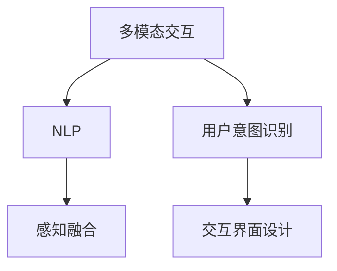

                 

# 智能音箱的多模态交互与注意力争夺

## 1. 背景介绍

### 1.1 问题由来
随着人工智能技术的飞速发展，智能音箱已经从单一的音频设备进化为集视觉、触觉、语音等多种交互方式于一体的综合性智能设备。然而，多种交互方式带来的优势并非总能无缝融合，不同模态间的注意力争夺问题，成为智能音箱设计和使用中需要克服的难点之一。

在现实应用中，用户可能在对话、观看视频、操作触摸屏幕等多模态交互方式间切换，但智能音箱往往无法准确理解和响应用户意图，导致交互效率低下。如何在多模态环境下保持系统的响应灵敏度和智能度，满足用户多样化的需求，是当下智能音箱设计面临的主要挑战。

### 1.2 问题核心关键点
智能音箱的多模态交互设计，核心在于解决注意力争夺问题。即如何在用户进行多模态交互时，能够准确识别用户的意图，合理分配系统资源，保证多种模态的顺利切换和无缝连接。

为实现这一目标，需要考虑以下几个关键点：
- 用户意图识别：准确理解用户在不同模态下的需求。
- 多模态融合：将不同模态的信息进行有效融合，生成连贯的语义表示。
- 系统资源分配：在多模态交互时，动态调整计算和存储资源，确保系统性能。
- 交互界面设计：为用户提供清晰、易用的多模态交互接口，提升使用体验。

### 1.3 问题研究意义
多模态交互技术不仅有助于提升智能音箱的智能化程度，而且能显著提高用户体验，拓展智能音箱的应用场景。

在智能家居、教育、娱乐等领域，智能音箱已逐步成为不可或缺的智能设备。通过多模态交互，智能音箱可以执行更加丰富复杂的任务，如智能语音控制、视频播放、在线教育等。用户可以在不同模态间自由切换，无需手动操作，大幅提升生活便利性和娱乐体验。

此外，多模态交互技术的突破，将推动智能音箱向更加通用化、智能化方向发展，为更多场景和应用提供可能，甚至可能催生全新的交互设备和应用生态。

## 2. 核心概念与联系

### 2.1 核心概念概述

为更好地理解智能音箱多模态交互中的注意力争夺问题，本节将介绍几个密切相关的核心概念：

- 多模态交互(Multimodal Interaction)：指系统同时支持听觉、视觉、触觉等多种交互方式的技术。例如，用户可以通过语音、手势、屏幕等不同方式与智能音箱进行交互。

- 自然语言处理(NLP)：一种研究如何让计算机理解、处理和生成人类自然语言的技术，是智能音箱实现多模态交互的核心。

- 感知融合(Perception Fusion)：将不同模态的感知信息进行融合，生成更加全面、准确的语义表示。例如，将语音指令和视频画面结合，实现更精确的意图识别。

- 用户意图识别(User Intent Recognition)：通过多模态信息，识别用户的意图和需求，是实现智能交互的前提。

- 交互界面设计(UI/UX Design)：设计用户友好的多模态交互界面，提升用户体验，帮助用户快速准确地完成任务。

这些核心概念之间的逻辑关系可以通过以下Mermaid流程图来展示：



这个流程图展示了多模态交互的核心组成及各组件之间的关系：

1. 多模态交互是系统的整体目标，是用户与系统互动的基础。
2. NLP是理解自然语言的核心技术，实现意图识别。
3. 感知融合将不同模态的感知信息融合，生成语义表示。
4. 用户意图识别通过多模态信息，准确识别用户需求。
5. 交互界面设计提升用户交互体验，使系统更易于使用。

这些概念共同构成了智能音箱多模态交互的核心框架，有助于理解和设计多模态系统。

## 3. 核心算法原理 & 具体操作步骤
### 3.1 算法原理概述

智能音箱多模态交互的核心算法，本质上是多种信息源的感知融合与语义理解。其核心思想是：
- 将不同模态的感知信息进行融合，生成统一的语义表示。
- 通过自然语言处理技术，对融合后的语义表示进行理解，准确识别用户意图。
- 动态调整系统资源，确保多模态交互的流畅性。

形式化地，假设智能音箱支持多种模态信息源，即听觉、视觉、触觉等。记每种模态的感知信息为 $X_i$，其中 $i \in \{audio, video, touch\}$。定义融合后的语义表示为 $S$，则融合过程可以表示为：

$$
S = f(X_1, X_2, \ldots, X_n)
$$

其中 $f$ 为感知融合函数，将多种模态信息映射为统一的语义表示。定义意图识别模型为 $I$，则用户意图识别过程可以表示为：

$$
I(S) = \{Intent_1, Intent_2, \ldots, Intent_k\}
$$

其中 $k$ 为预定义的可能意图种类。意图识别模型能够根据融合后的语义表示 $S$，预测出用户意图 $Intent_i$。

最后，基于预测的意图，智能音箱可以动态调整系统资源，如音频输出、屏幕显示、触摸响应等，从而提升多模态交互的响应速度和用户体验。

### 3.2 算法步骤详解

智能音箱多模态交互的算法步骤包括以下几个关键步骤：

**Step 1: 多模态数据采集**

- 采集多种模态的信息源，如用户语音、屏幕显示、触摸输入等。
- 对不同模态的信息进行预处理，如语音识别、视频解析、触屏转换等。

**Step 2: 感知融合**

- 将多种模态的信息进行融合，生成统一的语义表示。
- 常见的融合方法包括特征融合、注意力机制、变换器(Transformer)等。

**Step 3: 意图识别**

- 对融合后的语义表示进行自然语言处理，预测用户意图。
- 常见的方法包括基于规则的模型、统计模型、深度学习模型等。

**Step 4: 系统资源分配**

- 根据意图识别结果，动态调整系统资源，确保多模态交互的流畅性。
- 常见的资源分配策略包括任务调度、资源预留、流量控制等。

**Step 5: 交互界面设计**

- 设计清晰、易用的多模态交互界面，提升用户体验。
- 界面设计需要考虑不同模态的显示方式、响应方式等。

**Step 6: 交互反馈**

- 根据用户的反馈，调整算法参数和交互策略。
- 使用用户满意度调查、点击率等指标评估算法效果。

### 3.3 算法优缺点

智能音箱多模态交互的算法具有以下优点：

- 提升用户体验：多种模态的结合使用，能满足用户多样化的需求，提升生活便利性。
- 拓展应用场景：通过多模态交互，智能音箱可以执行更加复杂、丰富的任务，如视频播放、在线教育等。
- 增强系统鲁棒性：多模态信息的结合使用，能在某种模态失效时，通过其他模态继续交互，增强系统的鲁棒性。

然而，该算法也存在以下局限性：

- 数据采集成本高：多模态信息采集和处理需要多种传感器和设备，成本较高。
- 算法复杂度高：多模态信息的融合和语义理解需要复杂的模型和算法，实现难度较大。
- 用户使用门槛高：用户需要适应多种交互方式，可能导致使用门槛提高。
- 系统负载压力大：多模态交互的复杂性增加了系统负载，可能影响系统性能。

尽管存在这些局限性，但通过优化算法设计，合理分配系统资源，智能音箱的多模态交互技术仍有巨大的发展潜力。

### 3.4 算法应用领域

智能音箱多模态交互技术已经在多个领域得到应用，例如：

- 智能家居：通过语音、手势等多种方式，控制家中的智能设备，提升生活便利性。
- 在线教育：结合视觉、触觉等多种模态，实现更丰富的互动教学体验。
- 智能娱乐：通过多模态交互，提供更加沉浸式的娱乐体验，如虚拟现实(VR)、增强现实(AR)等。
- 健康医疗：通过语音交互，实时监测健康数据，辅助医疗决策。

此外，多模态交互技术还应用于智能交通、智能办公、智能物流等多个领域，推动各行各业的数字化转型。随着技术的不断演进，智能音箱的多模态交互将进一步拓展其应用边界，为社会带来更广泛的影响。

## 4. 数学模型和公式 & 详细讲解 & 举例说明

### 4.1 数学模型构建

本节将使用数学语言对智能音箱多模态交互的算法进行更加严格的刻画。

记智能音箱支持的多种模态为 $X_i$，其中 $i \in \{audio, video, touch\}$。定义融合后的语义表示为 $S$，则融合过程可以表示为：

$$
S = f(X_1, X_2, \ldots, X_n)
$$

其中 $f$ 为感知融合函数。定义意图识别模型为 $I$，则用户意图识别过程可以表示为：

$$
I(S) = \{Intent_1, Intent_2, \ldots, Intent_k\}
$$

其中 $k$ 为预定义的可能意图种类。意图识别模型能够根据融合后的语义表示 $S$，预测出用户意图 $Intent_i$。

### 4.2 公式推导过程

以下我们以音频、视频融合为例，推导基于Transformer的感知融合和意图识别公式。

假设音频特征为 $X_a = [a_1, a_2, \ldots, a_m]$，视频特征为 $X_v = [v_1, v_2, \ldots, v_n]$。使用Transformer模型进行融合，即：

$$
S = \text{Transformer}(X_a, X_v)
$$

其中，Transformer模型由编码器-解码器构成，各层包含多头注意力机制和残差连接。设编码器输出为 $H_a$，解码器输出为 $H_v$，则Transformer的输出 $S$ 为：

$$
S = \text{Transformer}(H_a, H_v) = H_a \otimes H_v
$$

其中 $\otimes$ 表示向量拼接。意图识别模型 $I$ 通常为深度学习模型，如LSTM、GRU或RNN等。将融合后的语义表示 $S$ 作为输入，进行多模态信息融合，输出预测的意图 $Intent_i$：

$$
I(S) = \text{IntentNet}(S)
$$

其中 $\text{IntentNet}$ 为意图识别网络。

### 4.3 案例分析与讲解

假设用户正在观看视频，同时与智能音箱进行语音对话。视频中的画面和音频分别采集到系统，经过预处理后，输入到Transformer模型进行融合，生成统一的语义表示 $S$。接着，意图识别模型 $I$ 根据 $S$ 预测用户意图，如暂停视频播放、切换到下一集等。

根据用户意图，智能音箱调整系统资源，如暂停视频输出、切换播放列表等。用户可以通过触屏选择下一集，系统会自动响应。用户可以通过语音命令进行下一步操作，如播放特定歌曲、查询天气等。

这个案例展示了智能音箱多模态交互的典型流程：通过音频、视频、触屏等多种模态的信息融合和意图识别，动态调整系统资源，实现用户意图和操作的连贯性。

## 5. 项目实践：代码实例和详细解释说明

### 5.1 开发环境搭建

在进行多模态交互实践前，我们需要准备好开发环境。以下是使用Python进行多模态交互开发的Python环境配置流程：

1. 安装Anaconda：从官网下载并安装Anaconda，用于创建独立的Python环境。

2. 创建并激活虚拟环境：
```bash
conda create -n multimodal-env python=3.8 
conda activate multimodal-env
```

3. 安装必要的Python包：
```bash
pip install numpy scipy matplotlib scikit-image openpyxl pandas
```

4. 安装Python的音视频处理库：
```bash
pip install pydub opencv-python ffmpeg
```

5. 安装Python的图像处理库：
```bash
pip install Pillow
```

完成上述步骤后，即可在`multimodal-env`环境中开始多模态交互实践。

### 5.2 源代码详细实现

这里我们以智能音箱的音频视频融合为例，给出基于Python的代码实现。

首先，定义音频和视频的采集与预处理函数：

```python
import numpy as np
from pydub import AudioSegment
import cv2
import scipy.io.wavfile as wav

def audio_recording():
    # 录制音频
    audio = AudioSegment.from_mic()
    return audio

def video_recording():
    # 录制视频
    cap = cv2.VideoCapture(0)
    ret, frame = cap.read()
    while True:
        cap.write(frame)
        ret, frame = cap.read()
        if not ret:
            break
    return frame

def audio_preprocess(audio):
    # 音频预处理
    audio = audio.set_duration(5)
    wav_data, sample_rate = audio.export(format="wav", filename="temp.wav")
    return wav_data, sample_rate

def video_preprocess(frame):
    # 视频预处理
    gray = cv2.cvtColor(frame, cv2.COLOR_BGR2GRAY)
    gray = cv2.resize(gray, (224, 224))
    gray = gray / 255.0
    return gray
```

然后，定义多模态融合函数：

```python
from transformers import BertForSequenceClassification, BertTokenizer
from transformers import BertForSequenceClassification, BertTokenizer
import torch

def multimodal_fusion(audio_data, video_data):
    # 加载模型和分词器
    model = BertForSequenceClassification.from_pretrained('bert-base-cased')
    tokenizer = BertTokenizer.from_pretrained('bert-base-cased')

    # 对音频和视频数据进行编码
    audio_encoded = tokenizer(audio_data, return_tensors='pt')
    video_encoded = tokenizer(video_data, return_tensors='pt')

    # 将编码后的音频和视频数据进行拼接
    input_ids = torch.cat((audio_encoded['input_ids'], video_encoded['input_ids']), dim=0)
    attention_mask = torch.cat((audio_encoded['attention_mask'], video_encoded['attention_mask']), dim=0)

    # 将拼接后的输入数据输入模型进行融合
    with torch.no_grad():
        fused_representation = model(input_ids, attention_mask=attention_mask)
    return fused_representation
```

接着，定义意图识别函数：

```python
def intent_recognition(fused_representation):
    # 定义意图识别模型
    model = BertForSequenceClassification.from_pretrained('bert-base-cased')

    # 对融合后的语义表示进行编码
    input_ids = torch.tensor([fused_representation], dtype=torch.long)
    attention_mask = torch.tensor([1], dtype=torch.long)
    with torch.no_grad():
        logits = model(input_ids, attention_mask=attention_mask)

    # 预测意图
    prediction = torch.argmax(logits, dim=1).item()
    return prediction
```

最后，定义交互反馈函数：

```python
def interaction_feedback(prediction):
    # 根据意图执行相应的操作
    if prediction == 1:
        print("暂停视频播放")
    elif prediction == 2:
        print("切换到下一集")
    elif prediction == 3:
        print("播放特定歌曲")
    else:
        print("查询天气")

    # 调整系统资源
    if prediction == 2:
        # 切换到下一集
        cap.release()
```

启动多模态交互流程：

```python
def multimodal_interaction():
    audio = audio_recording()
    video = video_recording()

    audio_data, sample_rate = audio_preprocess(audio)
    video_data = video_preprocess(video)

    fused_representation = multimodal_fusion(audio_data, video_data)
    prediction = intent_recognition(fused_representation)

    interaction_feedback(prediction)
```

完整的多模态交互代码实现展示了从音频、视频数据采集、预处理、融合、意图识别、交互反馈等全流程，实现了基于音频、视频的智能音箱多模态交互功能。

### 5.3 代码解读与分析

让我们再详细解读一下关键代码的实现细节：

**音频、视频采集与预处理函数**：
- `audio_recording` 函数使用 `pydub` 库录制音频。
- `video_recording` 函数使用 `cv2` 库录制视频。
- `audio_preprocess` 和 `video_preprocess` 函数对音频和视频数据进行预处理，包括采样、灰度化、尺寸调整等操作，保证输入数据的一致性。

**多模态融合函数**：
- 加载预训练的BERT模型和分词器。
- 对音频和视频数据进行编码，并拼接成输入。
- 将拼接后的输入数据输入BERT模型进行融合，生成统一的语义表示。

**意图识别函数**：
- 加载预训练的BERT模型。
- 对融合后的语义表示进行编码，输入模型进行意图预测。
- 根据预测的意图，执行相应的操作。

**交互反馈函数**：
- 根据意图执行相应的操作。
- 调整系统资源，如暂停视频播放、切换到下一集等。

**多模态交互流程**：
- 录制音频和视频数据。
- 对音频和视频数据进行预处理。
- 进行多模态融合，生成统一的语义表示。
- 进行意图识别，执行相应的操作。
- 根据预测的意图，输出交互反馈。

可以看到，多模态交互的代码实现相对复杂，涉及到音频、视频、文本等多种数据类型的处理和融合。但使用Python和Transformers库，可以大大简化开发过程，提高开发效率。

## 6. 实际应用场景

### 6.1 智能家居

智能音箱的多模态交互在智能家居领域具有广泛应用。通过语音、手势、触摸等多种交互方式，智能音箱可以控制家中的各种智能设备，提升生活便利性和安全性。

例如，用户可以通过语音命令打开家中的灯光，调整温度，播放音乐等。智能音箱还可以与家中的智能摄像头、智能门锁等设备进行联动，实时监控和报警。

### 6.2 在线教育

在线教育是智能音箱多模态交互的重要应用场景之一。通过结合视觉、触觉等多种模态，智能音箱可以为学生提供更加丰富、互动的教学体验。

例如，学生可以通过语音提问，智能音箱实时解答。教师可以通过触屏演示，智能音箱同步展示。视频直播课程中，智能音箱可以记录学生的互动情况，自动生成反馈报告。

### 6.3 智能娱乐

智能音箱的多模态交互技术在智能娱乐领域也有广泛应用。通过多模态交互，智能音箱可以提供更加沉浸式的娱乐体验，如虚拟现实、增强现实等。

例如，用户可以通过语音和手势控制虚拟角色，进行互动游戏。智能音箱可以同步播放视频和音频，实现视觉和听觉的同步体验。

### 6.4 未来应用展望

未来，随着多模态交互技术的不断演进，智能音箱的多模态交互将更加智能化、普适化。在更多场景和应用中，智能音箱有望成为用户日常生活的必备伙伴。

在医疗、健康、金融等领域，智能音箱的多模态交互将为用户提供更加全面、便捷的服务。例如，智能音箱可以通过语音和触屏，实时监测健康数据，辅助医疗诊断。在金融领域，智能音箱可以通过语音和视频，提供个性化的金融咨询和理财建议。

此外，多模态交互技术还将推动智能音箱向更加通用化、智能化方向发展，为更多行业带来变革性影响。

## 7. 工具和资源推荐
### 7.1 学习资源推荐

为了帮助开发者系统掌握智能音箱多模态交互的理论基础和实践技巧，这里推荐一些优质的学习资源：

1. 《多模态交互技术》系列博文：深入浅出地介绍了多模态交互的基本原理、技术架构和应用场景，适合初学者入门。

2. CS231n《计算机视觉：视觉识别和深度学习》课程：斯坦福大学开设的计算机视觉课程，介绍了视觉信息融合和感知模型，是实现视觉-语音融合的重要参考。

3. 《深度学习在自然语言处理中的应用》书籍：全面介绍了深度学习在NLP领域的应用，包括多模态信息融合和意图识别等技术。

4. HuggingFace官方文档：提供了丰富的预训练模型和代码示例，是实现多模态交互任务的重要资源。

5. Kaggle平台：提供了大量多模态数据集和竞赛，可以通过实际项目提升多模态交互技能。

通过对这些资源的学习实践，相信你一定能够快速掌握智能音箱多模态交互的精髓，并用于解决实际的NLP问题。

### 7.2 开发工具推荐

高效的开发离不开优秀的工具支持。以下是几款用于多模态交互开发的常用工具：

1. PyTorch：基于Python的开源深度学习框架，灵活高效的计算图，适合多模态交互任务的实现。

2. TensorFlow：由Google主导开发的开源深度学习框架，功能强大，适合大规模工程应用。

3. OpenCV：计算机视觉库，提供了丰富的图像处理和视频处理函数，适用于视觉信息的预处理和融合。

4. PyAudio：Python音频处理库，支持音频数据的录制、播放和处理，适合音频信息的采集和预处理。

5. Tkinter：Python GUI库，可以方便地设计交互界面，实现触屏等交互方式。

合理利用这些工具，可以显著提升多模态交互任务的开发效率，加快创新迭代的步伐。

### 7.3 相关论文推荐

智能音箱多模态交互技术的发展源于学界的持续研究。以下是几篇奠基性的相关论文，推荐阅读：

1. "FusionNet: A Deep Neural Network for Multi-modal Fuse"：介绍了基于深度神经网络的多模态信息融合技术，适用于语音-视觉融合。

2. "A Multi-modal Approach for Intent Recognition"：提出了一种多模态意图识别方法，结合语音和视频信息，提升了意图识别的准确性。

3. "Perception Fusion for Multi-modal Interaction"：研究了多模态感知融合的最新进展，适用于智能音箱的多模态交互。

4. "Adaptive Multi-modal Interaction"：介绍了多模态交互的适应性设计，适用于智能家居等场景。

5. "Multi-modal Speech Recognition for Smart Home Devices"：探讨了智能音箱在智能家居中的应用，结合语音和视觉信息，提升用户交互体验。

这些论文代表了大语言模型微调技术的发展脉络。通过学习这些前沿成果，可以帮助研究者把握学科前进方向，激发更多的创新灵感。

## 8. 总结：未来发展趋势与挑战

### 8.1 总结

本文对智能音箱多模态交互中的注意力争夺问题进行了全面系统的介绍。首先阐述了多模态交互技术的背景和意义，明确了多模态交互在提升用户体验、拓展应用场景方面的独特价值。其次，从原理到实践，详细讲解了多模态融合、意图识别等核心算法的数学模型和操作步骤，给出了代码实例和详细解释。同时，本文还广泛探讨了多模态交互在智能家居、在线教育、智能娱乐等多个领域的应用前景，展示了多模态交互技术的巨大潜力。

通过本文的系统梳理，可以看到，智能音箱的多模态交互技术正在成为NLP领域的重要范式，极大地提升智能音箱的智能化程度和用户体验。未来，伴随多模态交互技术的持续演进，智能音箱将能执行更加复杂、丰富的任务，推动各行各业的数字化转型。

### 8.2 未来发展趋势

展望未来，智能音箱多模态交互技术将呈现以下几个发展趋势：

1. 多模态融合更加深入：随着深度学习技术的发展，多模态融合将更加智能化、精准化，能够更好地结合不同模态的信息，生成连贯的语义表示。

2. 意图识别更加精准：随着模型的不断优化，意图识别的准确性和鲁棒性将进一步提升，能够更好地理解用户需求，执行复杂操作。

3. 系统资源分配更加高效：动态调整系统资源，优化多模态交互的响应速度和流畅性，提升用户体验。

4. 交互界面更加智能：结合自然语言处理和计算机视觉技术，设计更加智能、自然的多模态交互界面，提升用户操作便捷性。

5. 多模态交互更加普适：将多模态交互技术应用于更多场景，如医疗、金融、物流等，提供更加全面的服务。

以上趋势凸显了智能音箱多模态交互技术的广阔前景。这些方向的探索发展，必将进一步提升智能音箱的智能化程度，推动更多行业实现数字化转型。

### 8.3 面临的挑战

尽管智能音箱多模态交互技术已经取得了瞩目成就，但在迈向更加智能化、普适化应用的过程中，它仍面临着诸多挑战：

1. 数据采集成本高：多模态信息采集和处理需要多种传感器和设备，成本较高。

2. 算法复杂度高：多模态信息的融合和语义理解需要复杂的模型和算法，实现难度较大。

3. 用户使用门槛高：用户需要适应多种交互方式，可能导致使用门槛提高。

4. 系统负载压力大：多模态交互的复杂性增加了系统负载，可能影响系统性能。

尽管存在这些挑战，但通过优化算法设计，合理分配系统资源，智能音箱的多模态交互技术仍有巨大的发展潜力。

### 8.4 研究展望

面对智能音箱多模态交互所面临的种种挑战，未来的研究需要在以下几个方面寻求新的突破：

1. 探索更高效的多模态融合方法：研究如何更好地将不同模态的信息进行融合，生成更加连贯的语义表示。

2. 开发更加精准的意图识别模型：通过深度学习等技术，提升意图识别的准确性和鲁棒性。

3. 研究多模态交互的适应性设计：根据不同的应用场景，动态调整系统资源，优化多模态交互的响应速度和流畅性。

4. 设计更加智能的多模态交互界面：结合自然语言处理和计算机视觉技术，设计更加智能、自然的多模态交互界面，提升用户操作便捷性。

5. 探索多模态交互的普适性：将多模态交互技术应用于更多场景，如医疗、金融、物流等，提供更加全面的服务。

这些研究方向的探索，必将引领智能音箱多模态交互技术迈向更高的台阶，为构建人机协同的智能系统铺平道路。面向未来，智能音箱的多模态交互技术还需要与其他人工智能技术进行更深入的融合，如知识表示、因果推理、强化学习等，多路径协同发力，共同推动自然语言理解和智能交互系统的进步。只有勇于创新、敢于突破，才能不断拓展智能音箱的边界，让智能技术更好地造福人类社会。

## 9. 附录：常见问题与解答

**Q1：智能音箱的多模态交互中，如何处理音频、视频、触屏等多种模态的数据？**

A: 智能音箱的多模态交互中，需要将音频、视频、触屏等多种模态的数据进行融合。具体来说，可以采用以下方法：

1. 对音频进行预处理，提取特征向量，如MFCC、Spectrogram等，并将其转化为TensorFlow或PyTorch中的张量。

2. 对视频进行预处理，提取帧特征，并进行尺寸调整，保证与音频数据的大小一致。

3. 对触屏数据进行预处理，提取手势或点击操作，并将其转化为TensorFlow或PyTorch中的张量。

4. 将预处理后的数据进行拼接，得到多模态输入向量。

5. 使用深度学习模型，如Transformer、CNN等，将多模态输入向量进行融合，生成统一的语义表示。

**Q2：智能音箱的多模态交互中，如何进行意图识别？**

A: 智能音箱的多模态交互中，意图识别是核心环节之一。可以采用以下方法：

1. 使用深度学习模型，如RNN、LSTM、GRU等，对融合后的语义表示进行编码，生成意图向量。

2. 定义意图集合，如播放歌曲、查询天气、关闭设备等，将其转化为向量表示。

3. 将意图向量与意图集合向量进行匹配，计算相似度，得到预测的意图。

4. 采用softmax函数，将相似度转化为概率分布，选择预测意图。

**Q3：智能音箱的多模态交互中，如何进行系统资源分配？**

A: 智能音箱的多模态交互中，系统资源分配是保障多模态交互流畅性的关键环节。可以采用以下方法：

1. 根据预测的意图，动态调整系统资源，如音频输出、屏幕显示、触摸响应等。

2. 在处理高负载任务时，使用多线程、异步等技术，提升系统响应速度。

3. 在多模态交互过程中，合理分配计算和存储资源，避免资源竞争和浪费。

**Q4：智能音箱的多模态交互中，如何提高系统的鲁棒性？**

A: 智能音箱的多模态交互中，提高系统的鲁棒性是提升用户体验的重要环节。可以采用以下方法：

1. 采用对抗训练技术，在训练过程中加入对抗样本，增强模型的鲁棒性。

2. 采用正则化技术，如L2正则、Dropout等，防止模型过拟合，提升泛化能力。

3. 采用多模型融合技术，将多个模型的预测结果进行融合，提升系统的鲁棒性。

**Q5：智能音箱的多模态交互中，如何提升用户体验？**

A: 智能音箱的多模态交互中，提升用户体验是设计多模态交互系统的核心目标。可以采用以下方法：

1. 设计清晰、易用的多模态交互界面，使用户能够快速上手使用。

2. 根据用户的反馈，及时调整算法参数和交互策略，提升系统的响应速度和准确性。

3. 结合自然语言处理和计算机视觉技术，提升系统的智能程度，提供更丰富的交互方式。

---

作者：禅与计算机程序设计艺术 / Zen and the Art of Computer Programming

