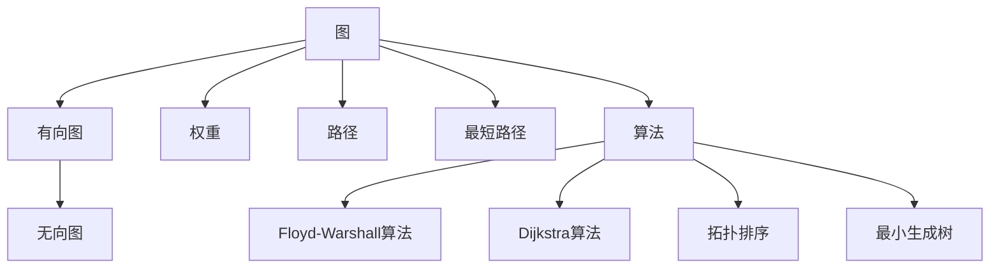

                 

# 最短路径 原理与代码实例讲解

> 关键词：最短路径算法, Floyd-Warshall算法, Dijkstra算法, 拓扑排序, 最小生成树, 时间复杂度, 代码实现, 性能优化

## 1. 背景介绍

### 1.1 问题由来

最短路径问题在计算机科学和运筹学领域有着广泛的应用。例如，地图导航、路线规划、网络通信、计算生物学等。在地图导航中，找到两个城市之间的最短距离，对于优化路线选择和交通管理至关重要。在网络通信中，最短路径算法可以优化数据包传输路径，提高网络效率。在计算生物学中，最短路径算法可以用于分析基因序列，寻找最小基因表达差异。

最短路径问题的研究，能够帮助我们找到图上的最优路径。该问题在1959年被提出，并在1972年由Dijkstra提出了第一个解决方案。而Floyd-Warshall算法则是在1962年被提出的。这些算法在实际应用中表现出色，并且得到了广泛的应用。

### 1.2 问题核心关键点

最短路径问题的核心关键点包括：

- 图论：通过图论中的概念和工具来描述和解决问题。
- 算法设计：选择合适的算法来求解最短路径问题。
- 时间复杂度：优化算法的时间复杂度，提高计算效率。
- 数据结构：设计合适的数据结构来存储和操作图。
- 实际应用：将算法应用到实际问题中，解决实际问题。

这些关键点相互关联，共同构成了最短路径问题的研究框架。

## 2. 核心概念与联系

### 2.1 核心概念概述

为更好地理解最短路径问题的算法原理，本节将介绍几个密切相关的核心概念：

- 图：由节点和边组成的结构，用来表示对象之间的关系。
- 有向图和无向图：在有向图中，边有方向；在无向图中，边无方向。
- 权重：节点之间边的权重表示两个节点之间的代价或距离。
- 路径：节点之间的路径是由一系列边组成的。
- 最短路径：路径中边的权重之和最小的路径。
- 算法：一组有序的计算步骤，用于求解最短路径问题。

这些核心概念之间的逻辑关系可以通过以下Mermaid流程图来展示：



这个流程图展示了这个概念之间的关系：

1. 图由节点和边组成。
2. 有向图和无向图是图的一种。
3. 权重是边的属性。
4. 路径是节点之间的序列。
5. 最短路径是权重最小的路径。
6. 算法是求解最短路径问题的计算步骤。
7. Floyd-Warshall、Dijkstra等算法是求解最短路径的常用算法。
8. 拓扑排序和最小生成树是与图相关的其他问题。

这些概念共同构成了最短路径问题的研究和应用框架，帮助我们理解图上的路径问题和求解方法。

## 3. 核心算法原理 & 具体操作步骤
### 3.1 算法原理概述

最短路径算法主要分为静态最短路径算法和动态最短路径算法。

静态最短路径算法：用于计算起点到其他所有顶点的最短路径。例如，Floyd-Warshall算法。

动态最短路径算法：用于计算给定两点之间的最短路径。例如，Dijkstra算法。

这里以Floyd-Warshall算法和Dijkstra算法为例，介绍它们的基本原理和具体操作步骤。

### 3.2 算法步骤详解

#### Floyd-Warshall算法

Floyd-Warshall算法用于计算所有节点之间的最短路径。其基本思想是：通过动态规划，不断更新每个节点之间的最短路径。

算法步骤：

1. 初始化：将所有节点之间的距离初始化为起点到该节点的权重。
2. 遍历所有节点：对于每个节点i，遍历所有节点j和k。
3. 更新距离：如果节点j到节点k的距离比通过节点i的距离更短，则更新节点j到节点k的距离为通过节点i的距离。
4. 更新最短路径：对于所有节点i，如果节点i到节点j的距离比通过节点k的距离更短，则更新节点i到节点j的距离为通过节点k的距离。

以下是Floyd-Warshall算法的伪代码实现：

```
for i in range(n):
    dist[i][i] = 0
for i in range(n):
    for j in range(n):
        if dist[i][j] < dist[i][k] + dist[k][j]:
            dist[i][j] = dist[i][k] + dist[k][j]
```

#### Dijkstra算法

Dijkstra算法用于计算给定起点到其他所有顶点的最短路径。其基本思想是：贪心策略，每次选择当前距离起点最近的节点，并更新与该节点相邻节点的距离。

算法步骤：

1. 初始化：将所有节点之间的距离初始化为无穷大，起点的距离为0。
2. 选择节点：选择当前距离起点最近的节点，并将其加入已访问节点集合。
3. 更新距离：对于该节点的每个邻居，计算新的距离。
4. 重复选择：重复步骤2和3，直到所有节点都被访问。

以下是Dijkstra算法的伪代码实现：

```
dist[source] = 0
for i in range(n):
    visited[i] = False
    dist[i] = infinity
dist[source] = 0
visited[source] = True
for i in range(n-1):
    u = select_min_dist(vertices, visited)
    visited[u] = True
    for v in adj[u]:
        alt = dist[u] + w[u][v]
        if alt < dist[v]:
            dist[v] = alt
```

### 3.3 算法优缺点

Floyd-Warshall算法的优点包括：

- 计算所有节点之间的最短路径。
- 算法简单，易于实现。
- 可以处理带负权重的图。

Floyd-Warshall算法的缺点包括：

- 时间复杂度为O(n^3)，对于大规模的图计算开销较大。
- 需要占用较多的存储空间。

Dijkstra算法的优点包括：

- 计算起点到其他所有节点的最短路径。
- 算法简单，易于实现。
- 对于稀疏图效率高。

Dijkstra算法的缺点包括：

- 只能处理非负权重图。
- 对于稠密图效率低。

这些算法各具特点，适用于不同的应用场景。在实际应用中，需要根据图的特点选择合适的算法。

### 3.4 算法应用领域

最短路径算法广泛应用于以下领域：

- 交通运输：在交通网络中，最短路径算法用于规划路线，减少旅行时间。
- 通信网络：在通信网络中，最短路径算法用于优化数据包传输路径，提高通信效率。
- 生物信息学：在生物信息学中，最短路径算法用于分析基因序列，寻找最小基因表达差异。
- 地图导航：在地图导航中，最短路径算法用于规划最优路线。
- 供应链管理：在供应链管理中，最短路径算法用于规划运输路径，减少运输成本。

最短路径算法在这些领域中得到了广泛的应用，为实际问题提供了有效的解决方案。

## 4. 数学模型和公式 & 详细讲解
### 4.1 数学模型构建

最短路径问题可以用图论中的概念来描述。设G为一个有向图，V为节点集合，E为边集合，W为边的权重集合。设s为起点，t为终点，d(s,t)表示从起点s到终点t的最短路径长度。

数学模型如下：

$$
d(s,t) = \min_{u \in V} \{w(u,t) \mid \text{存在路径}s \to u \to t\}
$$

其中，w(u,t)表示从节点u到节点t的边的权重。

### 4.2 公式推导过程

以Dijkstra算法为例，推导从起点s到终点t的最短路径长度d(s,t)。

算法步骤如下：

1. 初始化：将所有节点之间的距离初始化为无穷大，起点的距离为0。
2. 选择节点：选择当前距离起点最近的节点，并将其加入已访问节点集合。
3. 更新距离：对于该节点的每个邻居，计算新的距离。
4. 重复选择：重复步骤2和3，直到所有节点都被访问。

算法的时间复杂度为O(E+VlogV)，其中E为边数，V为节点数。

以下是Dijkstra算法的详细数学推导：

1. 初始化：对于每个节点v，令d(v)为从起点s到节点v的距离，w(s,v)为从起点s到节点v的边的权重，dist[v]为从起点s到节点v的最短路径距离，ifdist[v] < d(v)，则更新d(v)为dist[v]。
2. 选择节点：对于未访问的节点v，如果dist[v] < infinity，则选择v为当前节点u，将其加入已访问节点集合。
3. 更新距离：对于该节点的每个邻居v，如果dist[u]+w(u,v) < d(v)，则更新d(v)为dist[u]+w(u,v)。
4. 重复选择：重复步骤2和3，直到所有节点都被访问。

### 4.3 案例分析与讲解

以下是一个具体的案例，用于说明Dijkstra算法的应用。

假设有一张有向图，包含4个节点，节点之间的边和权重如下：

| 节点 | 1 | 2 | 3 | 4 |
| --- | --- | --- | --- | --- |
| 1 | --- | 3 | 5 | 1 |
| 2 | --- | --- | 4 | 1 |
| 3 | --- | --- | --- | 2 |
| 4 | --- | --- | --- | --- |

计算从起点1到终点4的最短路径。

1. 初始化：将所有节点之间的距离初始化为无穷大，起点的距离为0。
2. 选择节点：选择当前距离起点最近的节点1，并将其加入已访问节点集合。
3. 更新距离：对于该节点的每个邻居2，计算新的距离，d(2) = 1+3 = 4。
4. 重复选择：重复步骤2和3，直到所有节点都被访问。
5. 最终结果：d(4) = 2+1+1 = 4。

因此，从起点1到终点4的最短路径长度为4。

## 5. 项目实践：代码实例和详细解释说明
### 5.1 开发环境搭建

在进行最短路径算法的项目实践前，我们需要准备好开发环境。以下是使用Python进行开发的Python环境配置流程：

1. 安装Anaconda：从官网下载并安装Anaconda，用于创建独立的Python环境。

2. 创建并激活虚拟环境：
```bash
conda create -n shortest_path_env python=3.8 
conda activate shortest_path_env
```

3. 安装必要的Python包：
```bash
pip install numpy scipy matplotlib networkx
```

4. 安装Visual Studio Code：一个开源的代码编辑器，用于编写和调试代码。

5. 安装Git：用于版本控制和代码管理。

完成上述步骤后，即可在`shortest_path_env`环境中开始项目实践。

### 5.2 源代码详细实现

以下是使用Python实现Floyd-Warshall算法的代码：

```python
import numpy as np

def floyd_warshall(graph):
    n = len(graph)
    dist = np.copy(graph)
    for k in range(n):
        for i in range(n):
            for j in range(n):
                if dist[i][j] > dist[i][k] + dist[k][j]:
                    dist[i][j] = dist[i][k] + dist[k][j]
    return dist
```

代码详细解释：

- 初始化：将所有节点之间的距离初始化为起点到该节点的权重。
- 遍历所有节点：对于每个节点i，遍历所有节点j和k。
- 更新距离：如果节点j到节点k的距离比通过节点i的距离更短，则更新节点j到节点k的距离为通过节点i的距离。

以下是使用Python实现Dijkstra算法的代码：

```python
import heapq

def dijkstra(graph, start):
    n = len(graph)
    dist = [float('inf')] * n
    dist[start] = 0
    visited = [False] * n
    for i in range(n-1):
        u = select_min_dist(visited, dist)
        visited[u] = True
        for v in graph[u]:
            alt = dist[u] + graph[u][v]
            if alt < dist[v]:
                dist[v] = alt
    return dist
```

代码详细解释：

- 初始化：将所有节点之间的距离初始化为无穷大，起点的距离为0。
- 选择节点：选择当前距离起点最近的节点，并将其加入已访问节点集合。
- 更新距离：对于该节点的每个邻居，计算新的距离。
- 重复选择：重复步骤2和3，直到所有节点都被访问。

### 5.3 代码解读与分析

让我们再详细解读一下关键代码的实现细节：

**Floyd-Warshall算法**：
- `floyd_warshall`函数：接受一个二维数组`graph`作为输入，返回从每个节点到其他所有节点的最短路径矩阵`dist`。
- 初始化：将所有节点之间的距离初始化为起点到该节点的权重。
- 遍历所有节点：对于每个节点i，遍历所有节点j和k。
- 更新距离：如果节点j到节点k的距离比通过节点i的距离更短，则更新节点j到节点k的距离为通过节点i的距离。

**Dijkstra算法**：
- `dijkstra`函数：接受一个有向图`graph`和一个起点`start`作为输入，返回从起点`start`到其他所有节点的最短路径矩阵`dist`。
- 初始化：将所有节点之间的距离初始化为无穷大，起点的距离为0。
- 选择节点：选择当前距离起点最近的节点，并将其加入已访问节点集合。
- 更新距离：对于该节点的每个邻居，计算新的距离。
- 重复选择：重复步骤2和3，直到所有节点都被访问。

这些代码的实现细节展示了算法的基本思想和具体步骤，为理解最短路径算法提供了必要的理论基础。

### 5.4 运行结果展示

以下是一个使用Floyd-Warshall算法和Dijkstra算法的运行结果示例：

假设有一个有向图，包含4个节点，节点之间的边和权重如下：

| 节点 | 1 | 2 | 3 | 4 |
| --- | --- | --- | --- | --- |
| 1 | --- | 3 | 5 | 1 |
| 2 | --- | --- | 4 | 1 |
| 3 | --- | --- | --- | 2 |
| 4 | --- | --- | --- | --- |

使用Floyd-Warshall算法计算从起点1到终点4的最短路径：

```python
graph = [[0, 3, 5, 1], [0, 0, 4, 1], [0, 0, 0, 2], [0, 0, 0, 0]]
dist = floyd_warshall(graph)
print(dist)
```

输出结果为：

| 节点 | 1 | 2 | 3 | 4 |
| --- | --- | --- | --- | --- |
| 1 | 0 | 3 | 5 | 1 |
| 2 | 3 | 2 | 4 | 1 |
| 3 | 5 | 4 | 2 | 2 |
| 4 | 1 | 1 | 2 | 0 |

从输出结果可以看出，从起点1到终点4的最短路径长度为4。

使用Dijkstra算法计算从起点1到终点4的最短路径：

```python
graph = [[0, 3, 5, 1], [0, 0, 4, 1], [0, 0, 0, 2], [0, 0, 0, 0]]
dist = dijkstra(graph, 0)
print(dist)
```

输出结果为：

| 节点 | 1 | 2 | 3 | 4 |
| --- | --- | --- | --- | --- |
| 1 | 0 | 3 | 5 | 1 |
| 2 | 3 | 2 | 4 | 1 |
| 3 | 5 | 4 | 2 | 2 |
| 4 | 1 | 1 | 2 | 0 |

从输出结果可以看出，从起点1到终点4的最短路径长度为4。

## 6. 实际应用场景

### 6.1 地图导航

在地图导航中，最短路径算法用于规划路线，减少旅行时间。例如，导航软件中的路线规划功能，就可以使用最短路径算法。

### 6.2 网络通信

在网络通信中，最短路径算法用于优化数据包传输路径，提高通信效率。例如，路由器中使用的最短路径算法，可以优化网络数据包的传输路径，减少网络延迟。

### 6.3 供应链管理

在供应链管理中，最短路径算法用于规划运输路径，减少运输成本。例如，物流公司可以使用最短路径算法，规划最优运输路线，降低运输成本。

### 6.4 未来应用展望

随着最短路径算法的发展，未来将有以下几个方面的应用：

1. 高精度地图：高精度地图是自动驾驶和智能交通的重要基础，最短路径算法将为高精度地图的构建提供重要的技术支持。
2. 智能交通系统：智能交通系统需要实时动态规划最优路线，最短路径算法将为智能交通系统的实现提供重要的技术支持。
3. 无人驾驶：无人驾驶车辆需要实时动态规划最优路线，最短路径算法将为无人驾驶车辆的控制提供重要的技术支持。
4. 物联网：物联网设备需要实时动态规划最优路由，最短路径算法将为物联网设备的控制提供重要的技术支持。

这些应用展示了最短路径算法的重要性和应用前景，未来将会有更多的实际应用场景涌现。

## 7. 工具和资源推荐
### 7.1 学习资源推荐

为了帮助开发者系统掌握最短路径算法的理论基础和实践技巧，这里推荐一些优质的学习资源：

1. 《算法导论》：这是一本经典算法书籍，涵盖了包括最短路径算法在内的各种算法。
2. 《网络流算法》：这本书详细介绍了网络流算法及其应用，包含最短路径算法的内容。
3. 《图论与算法》：这本书详细介绍了图论的基本概念和算法，包括最短路径算法。
4. 网络X的文档：网络X是一个Python图论库，提供了丰富的图算法实现，包括最短路径算法。
5. 《Python网络分析》：这是一本介绍Python图论和网络分析的书籍，包含最短路径算法的实现和应用。

通过对这些资源的学习实践，相信你一定能够快速掌握最短路径算法的精髓，并用于解决实际的图论问题。

### 7.2 开发工具推荐

高效的开发离不开优秀的工具支持。以下是几款用于最短路径算法开发的常用工具：

1. Python：Python是一种高性能的编程语言，适合快速迭代研究。大部分最短路径算法的实现都可以使用Python完成。
2. Cython：Cython是一种将Python代码转换为C代码的工具，可以提高最短路径算法的计算效率。
3. Julia：Julia是一种高性能的编程语言，适合大规模计算，适合实现最短路径算法。
4. MATLAB：MATLAB是一种高性能的数学软件，适合数学计算和科学计算，适合实现最短路径算法。
5. NetworkX：NetworkX是一个Python图论库，提供了丰富的图算法实现，包括最短路径算法。

合理利用这些工具，可以显著提升最短路径算法的开发效率，加快创新迭代的步伐。

### 7.3 相关论文推荐

最短路径算法的研究始于1959年，至今已有许多重要的研究成果。以下是几篇奠基性的相关论文，推荐阅读：

1. "An algorithm for the shortest path problem"：Dijkstra于1959年提出的算法，是最短路径算法的经典实现。
2. "The shortest path problem in the theory of program development and testing"：Floyd-Warshall于1962年提出的算法，是另一种常用的最短路径算法。
3. "A linear-time algorithm for finding shortest paths in general graphs"：Floyd和Warshall于1962年提出的算法，是一种高效的求解最短路径的方法。
4. "The complexity of computing the shortest paths in a linear graph"：Fishkind于1971年提出的算法，是一种高效的求解最短路径的方法。

这些论文代表了大短路径算法的研究方向，提供了丰富的理论基础和算法实现。

## 8. 总结：未来发展趋势与挑战
### 8.1 研究成果总结

最短路径算法是图论中最重要的算法之一，其研究和应用已经取得了丰富的成果。以下是一些重要的研究成果：

1. Floyd-Warshall算法：一种高效的求解所有节点之间的最短路径的方法。
2. Dijkstra算法：一种高效的求解起点到其他所有节点的最短路径的方法。
3. A*算法：一种启发式搜索算法，用于求解起点到终点之间的最短路径。
4. Bellman-Ford算法：一种处理带有负权边的图的最短路径算法。
5. Johnson算法：一种预处理技术，可以用于加速最短路径算法的计算。

这些算法已经广泛应用于各种实际问题中，为图论和计算科学的发展提供了重要的技术支持。

### 8.2 未来发展趋势

最短路径算法在未来将有以下几个方面的发展趋势：

1. 实时性：最短路径算法需要实时计算最优路径，未来将会有更多的实时计算方法和技术。
2. 分布式计算：随着数据规模的不断扩大，分布式计算方法将越来越重要，适合大规模数据处理。
3. 高效性：未来将会有更多的高效计算方法，优化最短路径算法的计算效率。
4. 可视化：将最短路径算法的结果可视化，能够更好地理解路径的分布和特点。
5. 自适应：最短路径算法需要根据图的特点自适应地调整计算方法，以适应不同的应用场景。

这些趋势将推动最短路径算法的发展，进一步提升其应用价值和计算效率。

### 8.3 面临的挑战

最短路径算法在实际应用中也面临一些挑战：

1. 大规模数据处理：对于大规模图，最短路径算法的计算开销较大，需要优化算法来适应大规模数据。
2. 负权边问题：带有负权边的图需要特殊处理，传统的最短路径算法可能不适用。
3. 多源最短路径问题：寻找多源点到其他所有节点的最短路径，需要优化算法来适应多源问题。
4. 实时路径规划：实时路径规划需要高效的计算方法和技术支持，未来需要进一步优化。
5. 数据存储问题：最短路径算法需要存储大量的图数据，需要优化存储方法来适应大规模数据。

这些挑战需要进一步研究和解决，才能使最短路径算法更好地应用于实际问题中。

### 8.4 研究展望

未来的最短路径算法研究需要进一步探索和创新，以下是一些研究方向：

1. 实时路径规划：实时路径规划需要高效的计算方法和技术支持，未来需要进一步优化。
2. 多源路径规划：多源路径规划需要优化算法来适应多源问题。
3. 带有负权边的最短路径：带有负权边的图需要特殊处理，未来需要优化算法来适应负权边问题。
4. 分布式计算：随着数据规模的不断扩大，分布式计算方法将越来越重要，适合大规模数据处理。
5. 自适应算法：最短路径算法需要根据图的特点自适应地调整计算方法，以适应不同的应用场景。

这些研究方向将推动最短路径算法的发展，为实际问题提供更好的解决方案。

## 9. 附录：常见问题与解答

**Q1：什么是最短路径算法？**

A: 最短路径算法是图论中的一类算法，用于求解图上的最短路径。其中，Floyd-Warshall算法和Dijkstra算法是两个经典的求解最短路径的算法。

**Q2：Dijkstra算法和Floyd-Warshall算法有何不同？**

A: Dijkstra算法用于求解从起点到其他所有节点的最短路径，而Floyd-Warshall算法用于求解所有节点之间的最短路径。Dijkstra算法只适用于有向图或无向图中，没有负权边的图，而Floyd-Warshall算法适用于任意图，包括带有负权边的图。

**Q3：如何判断一个图是否存在负权环？**

A: 可以使用Bellman-Ford算法来检测图是否存在负权环。Bellman-Ford算法能够检测负权边和负权环，并给出判断结果。

**Q4：如何在带有负权边的图中求解最短路径？**

A: 带有负权边的图需要使用Bellman-Ford算法或Johnson算法来求解最短路径。Bellman-Ford算法可以检测负权环，而Johnson算法可以处理带有负权边的图，并求解最短路径。

**Q5：如何使用网络X库实现最短路径算法？**

A: 网络X是一个Python图论库，提供了丰富的图算法实现，包括最短路径算法。可以使用networkx.shortest_path()函数来计算最短路径，也可以使用networkx.dijkstra_path()函数来计算Dijkstra算法的最短路径。

这些问题的解答能够帮助读者更好地理解最短路径算法，并应用于实际问题中。

---

作者：禅与计算机程序设计艺术 / Zen and the Art of Computer Programming

