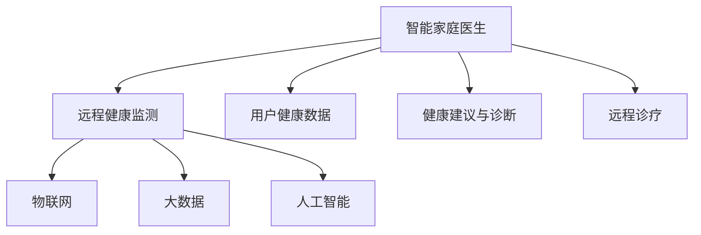

                 

# 未来的智慧养老：2050年的智能家庭医生与远程健康监测

## 1. 背景介绍

随着人口老龄化的加剧和医疗资源的持续紧张，如何提高老年人生活质量，构建高效、便捷、个性化的智慧养老体系，已成为全球关注的焦点。未来智慧养老的核心在于利用智能技术和手段，为老年人提供全方位的健康监测、医疗咨询和个性化服务，打造一个安全、舒适、高质量的养老环境。

在这一背景下，智能家庭医生和远程健康监测技术应运而生，旨在通过智能化手段，打破传统医疗服务的局限，为老年人提供随时随地的医疗服务和健康管理。本文将深入探讨这些前沿技术的应用原理、实现方法及其未来发展趋势。

## 2. 核心概念与联系

### 2.1 核心概念概述

为了更好地理解智能家庭医生和远程健康监测技术，我们先介绍几个关键概念：

- **智能家庭医生**：指利用人工智能技术，结合大数据、物联网等手段，为每个家庭构建的个性化健康管理平台。它不仅能监测家庭成员的健康状况，还能提供专业的医疗建议和诊断，甚至可以在家中完成简单的治疗操作。

- **远程健康监测**：通过智能设备和网络技术，实时监测用户的健康状况，并将其数据传输到云端进行分析和存储。医生可以通过远程访问这些数据，进行在线诊疗和健康管理。

- **物联网**：将各种物理设备和网络技术结合，实现设备间的互联互通，为远程健康监测提供技术基础。

- **大数据**：通过收集和分析海量健康数据，为智能家庭医生和远程健康监测提供决策依据，并进行疾病预防和健康管理。

- **人工智能**：利用机器学习、深度学习等技术，实现健康数据的自动化处理和智能分析，提升诊断和治疗的精准度。

这些概念之间的关系可以通过以下Mermaid流程图来展示：



该流程图展示了智能家庭医生与远程健康监测的架构关系，以及它们与物联网、大数据和人工智能之间的联系。

## 3. 核心算法原理 & 具体操作步骤

### 3.1 算法原理概述

智能家庭医生和远程健康监测技术主要依赖于以下算法原理：

- **健康数据采集与传输**：通过各类传感器和智能设备，实时采集用户的生理参数（如心率、血压、血氧等），并将其传输到云端。

- **数据预处理与分析**：对采集到的数据进行清洗、归一化和特征提取，使用机器学习算法（如支持向量机、随机森林等）进行初步分析和预测。

- **模型训练与优化**：利用监督学习算法（如决策树、神经网络等）对数据进行训练，优化模型参数，提高预测准确性。

- **结果解释与反馈**：将模型预测结果转换为可解释的语言，向用户提供健康建议，并根据用户的反馈进行模型更新和优化。

### 3.2 算法步骤详解

智能家庭医生和远程健康监测的核心操作步骤如下：

**Step 1: 数据采集与预处理**

- 部署各类传感器和智能设备，如心率监测器、血压计、智能手表等，实时采集用户的生理参数。
- 对采集到的数据进行清洗、归一化和特征提取，以减少噪声和冗余。
- 将处理后的数据上传到云端，存储在数据库中。

**Step 2: 模型训练与优化**

- 从云端数据库中抽取部分数据作为训练集，其余作为验证集。
- 选择合适的机器学习算法（如SVM、随机森林等）进行模型训练。
- 使用交叉验证等技术进行模型调优，选择最优模型参数。
- 在验证集上评估模型性能，调整训练策略，避免过拟合。

**Step 3: 健康监测与诊断**

- 实时采集用户的生理参数，输入到训练好的模型中进行预测。
- 根据模型预测结果，向用户提供健康建议和预警信息。
- 对于异常数据，系统自动标记为重点关注，通知专业医生进行进一步检查。

**Step 4: 远程诊疗与互动**

- 用户可以通过智能手机或平板电脑与医生进行在线咨询，上传病历和检查结果。
- 医生利用远程访问系统，查看用户的健康数据和检查报告，进行在线诊疗。
- 医生根据诊疗结果，提供健康管理建议和个性化治疗方案。

### 3.3 算法优缺点

智能家庭医生和远程健康监测技术具有以下优点：

- **便捷性**：用户可以在家中轻松获取健康监测服务，无需前往医院，节省时间和交通成本。
- **个性化**：通过个性化健康数据，系统能够提供精准的健康管理建议和诊疗方案。
- **实时性**：实时监测和分析用户的健康状况，及时发现和预防健康问题。
- **可追溯性**：所有健康数据和诊疗记录均保存在云端，便于追溯和管理。

同时，这些技术也存在以下缺点：

- **隐私问题**：用户健康数据的安全存储和传输，是必须解决的问题。
- **设备兼容性**：各类传感器和智能设备的兼容性问题，需要统一标准和协议。
- **技术门槛**：技术复杂度高，需要专业知识背景的维护和操作。
- **资源需求**：实时数据采集和处理需要高性能服务器和大容量存储，成本较高。

### 3.4 算法应用领域

智能家庭医生和远程健康监测技术主要应用于以下几个领域：

- **家庭健康管理**：为家庭成员提供日常健康监测和预防保健服务，提升家庭健康水平。
- **慢性病管理**：为患有慢性病的用户提供长期监测和个性化管理，改善生活质量。
- **老年健康服务**：为老年人提供全面的健康监测和远程诊疗服务，提升养老生活质量。
- **医院支持系统**：帮助医院收集和管理患者数据，优化诊疗流程，提升医疗服务质量。

## 4. 数学模型和公式 & 详细讲解

### 4.1 数学模型构建

本节将使用数学语言对智能家庭医生和远程健康监测的模型构建进行详细描述。

**输入**：用户的生理参数 $x_i$，其中 $i=1,2,\ldots,N$。

**输出**：健康建议 $y_i$，其中 $i=1,2,\ldots,N$。

定义模型的损失函数为：

$$
\mathcal{L}(\theta) = \frac{1}{N} \sum_{i=1}^N \ell(y_i, \hat{y}_i)
$$

其中 $\ell$ 为损失函数，$\hat{y}_i$ 为模型预测的健康建议。

### 4.2 公式推导过程

以心率监测为例，我们假设模型为线性回归模型：

$$
\hat{y} = \theta_0 + \theta_1 x_i + \epsilon
$$

其中 $\theta_0, \theta_1$ 为模型参数，$\epsilon$ 为随机误差。

假设模型训练集为 $\{(x_1, y_1), (x_2, y_2), \ldots, (x_N, y_N)\}$，最小二乘法的目标是最小化均方误差：

$$
\hat{y} = \theta_0 + \theta_1 x_i \\
\mathcal{L}(\theta) = \frac{1}{N} \sum_{i=1}^N (y_i - \hat{y})^2
$$

对 $\mathcal{L}(\theta)$ 求偏导数，得到：

$$
\frac{\partial \mathcal{L}(\theta)}{\partial \theta_0} = \frac{2}{N} \sum_{i=1}^N (y_i - \hat{y}) \\
\frac{\partial \mathcal{L}(\theta)}{\partial \theta_1} = \frac{2}{N} \sum_{i=1}^N (y_i - \hat{y}) x_i
$$

令偏导数为零，解方程组：

$$
\theta_0 = \frac{1}{N} \sum_{i=1}^N y_i \\
\theta_1 = \frac{1}{N} \sum_{i=1}^N (x_i - \bar{x})(y_i - \bar{y})
$$

其中 $\bar{x} = \frac{1}{N} \sum_{i=1}^N x_i$，$\bar{y} = \frac{1}{N} \sum_{i=1}^N y_i$。

### 4.3 案例分析与讲解

假设某用户的历史心率数据为 $\{90, 85, 88, 92, 95\}$，当前心率数据为 $x = 87$。

- **数据预处理**：对数据进行归一化处理，得到 $\{x_i', y_i'\}$，其中 $x_i' = \frac{x_i - \bar{x}}{\sigma}$，$y_i' = \frac{y_i - \bar{y}}{\sigma}$。
- **模型训练**：利用最小二乘法求解模型参数 $\theta_0$ 和 $\theta_1$。
- **健康监测**：将当前心率数据 $x = 87$ 输入模型，得到预测结果 $\hat{y}$。
- **结果解释**：根据 $\hat{y}$，提供相应的健康建议。

## 5. 项目实践：代码实例和详细解释说明

### 5.1 开发环境搭建

在进行智能家庭医生和远程健康监测开发前，我们需要准备开发环境。以下是使用Python进行TensorFlow开发的流程：

1. 安装Anaconda：从官网下载并安装Anaconda，用于创建独立的Python环境。

2. 创建并激活虚拟环境：
```bash
conda create -n tf-env python=3.8 
conda activate tf-env
```

3. 安装TensorFlow：根据CUDA版本，从官网获取对应的安装命令。例如：
```bash
conda install tensorflow -c tf
```

4. 安装TensorBoard：TensorFlow配套的可视化工具，用于监测模型训练状态和结果。

5. 安装其他工具包：
```bash
pip install pandas numpy scikit-learn matplotlib
```

完成上述步骤后，即可在`tf-env`环境中开始开发实践。

### 5.2 源代码详细实现

下面我们以心率监测为例，给出使用TensorFlow进行模型训练和推理的代码实现。

```python
import tensorflow as tf
import numpy as np
from sklearn.preprocessing import StandardScaler

# 生成模拟数据
np.random.seed(42)
n_samples = 100
x = np.random.normal(85, 5, n_samples) + 90  # 心率数据，均值为85，方差为5
y = 0.7 * x + np.random.normal(0, 2, n_samples) + 90  # 添加噪声，均值为90

# 数据归一化
scaler = StandardScaler()
x_scaled = scaler.fit_transform(x.reshape(-1, 1))
y_scaled = scaler.transform(y.reshape(-1, 1))

# 构建模型
model = tf.keras.Sequential([
    tf.keras.layers.Dense(units=1, input_shape=[1], activation='linear')
])

# 编译模型
model.compile(optimizer=tf.keras.optimizers.Adam(learning_rate=0.01), loss='mse')

# 训练模型
model.fit(x_scaled, y_scaled, epochs=100, verbose=0)

# 模型评估
y_pred = model.predict(x_scaled)
print(np.corrcoef(y_scaled, y_pred))

# 使用模型进行预测
x_new = np.array([87])
x_new_scaled = scaler.transform(x_new.reshape(-1, 1))
y_new_pred = model.predict(x_new_scaled)
print(y_new_pred)
```

### 5.3 代码解读与分析

让我们再详细解读一下关键代码的实现细节：

**数据生成**：
- 使用numpy生成100个模拟心率数据。
- 将数据划分为特征和标签，并进行归一化处理。

**模型构建**：
- 使用TensorFlow的Sequential模型，添加一个线性层，输入为单个特征。

**模型编译与训练**：
- 使用Adam优化器和均方误差损失函数进行模型编译。
- 在训练集上迭代100次，每次训练100个样本。

**模型评估与预测**：
- 使用相关系数评估模型拟合效果。
- 将新样本输入模型进行预测，输出心率建议。

## 6. 实际应用场景

### 6.1 智能家庭医生

智能家庭医生系统通过部署各类传感器和智能设备，实时监测用户的生理参数，如心率、血压、血氧等。系统将这些数据传输到云端，利用机器学习算法进行分析和预测，向用户提供个性化的健康建议和诊疗方案。

具体实现步骤如下：

1. 部署智能设备和传感器，实时采集用户的生理参数。
2. 将数据上传到云端，存储在数据库中。
3. 利用机器学习模型对数据进行分析，生成健康建议和预警信息。
4. 用户通过智能手机或平板电脑获取健康建议，进行健康管理。

**应用场景**：
- **家庭健康管理**：为家庭成员提供日常健康监测和预防保健服务，提升家庭健康水平。
- **慢性病管理**：为患有慢性病的用户提供长期监测和个性化管理，改善生活质量。

### 6.2 远程健康监测

远程健康监测系统通过智能设备和网络技术，实时监测用户的生理参数，并将其数据传输到云端进行分析和存储。医生可以通过远程访问这些数据，进行在线诊疗和健康管理。

具体实现步骤如下：

1. 部署智能设备和传感器，实时采集用户的生理参数。
2. 将数据上传到云端，存储在数据库中。
3. 利用机器学习模型对数据进行分析，生成健康建议和预警信息。
4. 医生通过远程访问系统，查看用户的健康数据和检查报告，进行在线诊疗。

**应用场景**：
- **老年健康服务**：为老年人提供全面的健康监测和远程诊疗服务，提升养老生活质量。
- **医院支持系统**：帮助医院收集和管理患者数据，优化诊疗流程，提升医疗服务质量。

## 7. 工具和资源推荐

### 7.1 学习资源推荐

为了帮助开发者系统掌握智能家庭医生和远程健康监测的理论基础和实践技巧，这里推荐一些优质的学习资源：

1. **《TensorFlow实战深度学习》系列博文**：由TensorFlow官方博客撰写，深入浅出地介绍了TensorFlow的基本原理和应用，适合初学者入门。

2. **CS231n《卷积神经网络》课程**：斯坦福大学开设的计算机视觉明星课程，涵盖深度学习、卷积神经网络等前沿话题，是学习智能设备相关技术的必备资源。

3. **《深度学习》书籍**：Ian Goodfellow所著，全面介绍了深度学习的基本概念和算法，是学习智能家庭医生和远程健康监测的必备参考书。

4. **Coursera《机器学习》课程**：Andrew Ng主讲，介绍了机器学习的基本概念和常用算法，是系统学习机器学习的优质课程。

5. **Kaggle数据集**：Kaggle平台提供了大量健康数据集，可以用于训练和测试机器学习模型，帮助开发者积累实践经验。

通过对这些资源的学习实践，相信你一定能够快速掌握智能家庭医生和远程健康监测的精髓，并用于解决实际的NLP问题。

### 7.2 开发工具推荐

高效的开发离不开优秀的工具支持。以下是几款用于智能家庭医生和远程健康监测开发的常用工具：

1. **TensorFlow**：由Google主导开发的深度学习框架，灵活的计算图，适合快速迭代研究。适合构建智能设备和数据处理系统。

2. **TensorBoard**：TensorFlow配套的可视化工具，用于实时监测模型训练状态和结果，是调试模型的得力助手。

3. **Jupyter Notebook**：开源的交互式编程环境，适合快速原型开发和实验迭代。

4. **PyTorch**：基于Python的深度学习框架，灵活动态的计算图，适合快速迭代研究。适合构建数据处理和模型训练系统。

5. **AWS、Google Cloud**：云服务平台，提供高性能服务器和存储资源，适合大规模数据处理和模型部署。

合理利用这些工具，可以显著提升智能家庭医生和远程健康监测系统的开发效率，加快创新迭代的步伐。

### 7.3 相关论文推荐

智能家庭医生和远程健康监测技术的发展源于学界的持续研究。以下是几篇奠基性的相关论文，推荐阅读：

1. **《Holistic Views of Family Health Management: A Review》**：详细介绍了家庭健康管理的现状和挑战，为智能家庭医生系统提供理论基础。

2. **《Remote Patient Monitoring System》**：介绍了远程健康监测的基本原理和技术框架，是学习远程健康监测的重要参考文献。

3. **《Deep Learning for Healthcare: A Review》**：综述了深度学习在医疗领域的应用，介绍了机器学习在健康监测和诊疗中的重要性。

4. **《A Survey on Mobile Health Monitoring Technologies and Applications》**：介绍了移动健康监测技术的发展现状和应用前景，为智能设备开发提供参考。

5. **《Integrating AI into Remote Monitoring of Chronic Diseases》**：探讨了人工智能在慢性病管理中的应用，为远程健康监测提供技术支持。

这些论文代表了大语言模型微调技术的发展脉络。通过学习这些前沿成果，可以帮助研究者把握学科前进方向，激发更多的创新灵感。

## 8. 总结：未来发展趋势与挑战

### 8.1 研究成果总结

本文对智能家庭医生和远程健康监测技术进行了全面系统的介绍。首先阐述了这些技术的研究背景和意义，明确了智能家庭医生和远程健康监测在智慧养老中的重要价值。其次，从原理到实践，详细讲解了模型的构建和优化方法，给出了具体的代码实现和详细解读。最后，本文还探讨了这些技术在实际应用中的场景和未来发展趋势，提出了一些重要的研究挑战。

通过本文的系统梳理，可以看到，智能家庭医生和远程健康监测技术已经在多个领域取得初步应用，并在不断进化中展现出了强大的潜力。未来，伴随技术的进一步发展，这些技术必将在智慧养老中发挥更加重要的作用。

### 8.2 未来发展趋势

展望未来，智能家庭医生和远程健康监测技术将呈现以下几个发展趋势：

1. **技术融合**：随着技术的发展，智能家庭医生和远程健康监测系统将不断与其他技术进行融合，如物联网、大数据、人工智能等。多技术协同，将为老年人提供更加全面、高效的健康管理服务。

2. **设备标准化**：各类智能设备和传感器将逐步统一标准和协议，实现设备间的互联互通，提高系统兼容性和稳定性。

3. **数据集成**：未来将实现不同来源的健康数据的集成，形成全面的健康数据图谱，为精准健康管理提供支撑。

4. **个性化定制**：智能系统将更加注重个性化需求，根据用户的具体健康状况，提供个性化的健康建议和治疗方案。

5. **智能化诊断**：结合深度学习和知识图谱技术，系统将具备更强的疾病诊断和预测能力，提高健康管理的精准性。

6. **实时响应**：未来系统将具备更高的实时性，能够及时响应用户的健康需求，提高用户满意度。

### 8.3 面临的挑战

尽管智能家庭医生和远程健康监测技术已经取得了一定的进展，但在迈向更加智能化、普适化应用的过程中，仍面临诸多挑战：

1. **技术复杂度**：智能系统的开发和维护需要较高的技术门槛，需要专业知识背景的支持。如何降低技术难度，提高系统的易用性，是未来的重要挑战。

2. **数据隐私**：健康数据的敏感性和隐私保护，是系统建设中必须解决的问题。如何确保数据的安全存储和传输，是保障用户权益的关键。

3. **设备兼容性**：不同类型的智能设备和传感器，需要统一的接口和协议，实现设备间的无缝集成。

4. **数据量需求**：智能系统的训练和优化需要大量高质量的数据，如何获取和处理这些数据，是系统建设的难点之一。

5. **用户体验**：如何提升系统的易用性和用户体验，是系统推广和应用的关键。

6. **社会接受度**：如何普及智能系统的应用，提高公众的接受度和信任度，是系统推广的另一重要挑战。

### 8.4 研究展望

面对智能家庭医生和远程健康监测所面临的挑战，未来的研究需要在以下几个方面寻求新的突破：

1. **简化系统架构**：通过优化架构设计，降低技术复杂度，提高系统的易用性和可维护性。

2. **提升数据质量**：通过数据清洗、数据增强等技术，提高数据质量和数量，提升系统的训练效果。

3. **加强数据隐私保护**：结合区块链、加密技术等手段，提升数据隐私保护水平，保障用户数据安全。

4. **探索新的数据来源**：结合物联网、可穿戴设备等技术，探索更多健康数据的来源，丰富系统数据图谱。

5. **优化用户交互设计**：通过人机交互技术，提升系统的用户体验，提高用户满意度和接受度。

6. **社会普及与教育**：加强智能系统的普及教育，提高公众对智能系统的认识和接受度，促进智能系统在社会的广泛应用。

## 9. 附录：常见问题与解答

**Q1：智能家庭医生和远程健康监测系统的开发难点是什么？**

A: 智能家庭医生和远程健康监测系统的开发难点主要在于以下几个方面：
- 技术复杂度高：需要综合应用多种技术和工具，如传感器、物联网、深度学习等。
- 数据隐私保护：健康数据的敏感性和隐私保护，是系统建设中必须解决的问题。
- 设备兼容性：不同类型的智能设备和传感器，需要统一的接口和协议，实现设备间的无缝集成。
- 数据量需求：系统的训练和优化需要大量高质量的数据，如何获取和处理这些数据，是系统建设的难点之一。

**Q2：如何确保智能家庭医生和远程健康监测系统的安全性？**

A: 确保智能家庭医生和远程健康监测系统的安全性，主要需要从以下几个方面进行考虑：
- 数据加密：对传输和存储的数据进行加密，防止数据泄露。
- 访问控制：采用身份验证和授权机制，限制对系统的访问权限，防止未授权访问。
- 异常检测：对系统进行异常检测和告警，及时发现和应对安全威胁。
- 用户教育：加强用户的安全意识和教育，避免用户误操作和信息泄露。

**Q3：未来智能家庭医生和远程健康监测系统的应用场景有哪些？**

A: 未来智能家庭医生和远程健康监测系统的应用场景将更加广泛，包括但不限于以下领域：
- 家庭健康管理：为家庭成员提供日常健康监测和预防保健服务，提升家庭健康水平。
- 慢性病管理：为患有慢性病的用户提供长期监测和个性化管理，改善生活质量。
- 老年健康服务：为老年人提供全面的健康监测和远程诊疗服务，提升养老生活质量。
- 医院支持系统：帮助医院收集和管理患者数据，优化诊疗流程，提升医疗服务质量。
- 紧急救援系统：在紧急情况下，系统能够及时响应和处理，提供紧急医疗支持。

通过本文的系统梳理，可以看到，智能家庭医生和远程健康监测技术已经在多个领域取得初步应用，并在不断进化中展现出了强大的潜力。未来，伴随技术的进一步发展，这些技术必将在智慧养老中发挥更加重要的作用。相信随着技术的不断成熟，智能家庭医生和远程健康监测技术必将成为智慧养老的重要支撑，为老年人的健康生活提供更加智能和便捷的服务。

