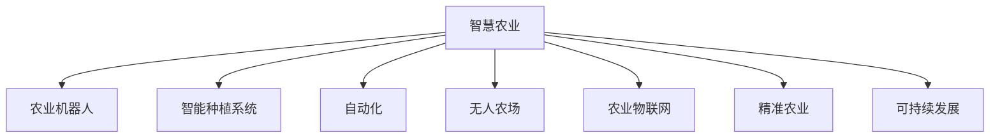

                 

# 未来的智慧农业：2050年的农业机器人与智能种植系统

> 关键词：智慧农业,农业机器人,智能种植系统,自动化,无人农场,数据驱动,精准农业,农业物联网,可持续发展

## 1. 背景介绍

### 1.1 问题由来

随着全球人口增长和城市化进程的加快，农业面临着前所未有的挑战。传统农业模式消耗大量土地、水资源，环境污染严重，且难以应对气候变化带来的不确定性。面对这些挑战，智慧农业（Smart Agriculture）成为了农业领域的重要方向，旨在通过先进的信息技术，提升农业生产的效率、质量和可持续性。

近年来，随着物联网（IoT）、人工智能（AI）、大数据、云计算等技术的发展，农业机器人与智能种植系统迅速崛起。这些先进技术的应用，使得农业生产更加自动化、智能化、数据化。预计到2050年，智慧农业将成为全球农业的主流，极大地改变农业生产模式和农村面貌。

### 1.2 问题核心关键点

智慧农业的核心在于通过智能化手段，优化农业生产流程，实现高效、精准、环保的农业生产。其主要包括以下几个关键点：

1. 自动化机器人：使用机器人代替人工，完成种植、收割、喷洒农药等高强度劳动，提升生产效率。
2. 智能传感器：通过传感器采集土壤、气候、作物生长数据，实时监测农作物的健康状况。
3. 数据驱动决策：基于传感器和机器人采集的大量数据，进行数据分析和模型预测，优化种植策略。
4. 精准农业技术：如卫星定位、GIS地理信息系统、无人机监控等，实现精确定位和精确管理。
5. 可持续发展：通过智能化管理，减少资源浪费，降低环境污染，促进农业可持续发展。

这些关键技术的发展，为智慧农业提供了坚实的技术基础，推动了农业生产的智能化转型。

## 2. 核心概念与联系

### 2.1 核心概念概述

为更好地理解智慧农业的技术框架和实施路径，本节将介绍几个密切相关的核心概念：

- 智慧农业(Smart Agriculture)：通过现代信息技术，对农业生产进行数字化、网络化、智能化管理，实现资源高效利用、环境友好、可持续发展的农业生产模式。

- 农业机器人(Agricultural Robotics)：使用自动化机器人代替人工完成农业生产任务，提升生产效率和劳动强度。

- 智能种植系统(Intelligent Planting System)：基于传感器、云计算、AI等技术，对作物生长过程进行实时监控和管理，实现精准农业和智能决策。

- 自动化(Automatics)：自动化技术通过程序和算法，实现农业生产的自主管理和操作。

- 无人农场(Autonomous Farm)：完全依赖自动化机器人、智能传感器和数据中心运行的农场，实现自动化生产和管理。

- 农业物联网(Agriculture Internet of Things, AgrIoT)：利用物联网技术，采集农业生产各个环节的数据，实现数据共享和实时监控。

- 精准农业(Precision Agriculture)：通过高精度传感器、卫星定位、GIS等技术，实现对农田的精细管理，提升作物产量和质量。

- 可持续发展(Sustainable Development)：在智慧农业中，通过智能化管理，减少资源消耗，降低环境污染，实现农业的可持续发展。

这些核心概念之间的逻辑关系可以通过以下Mermaid流程图来展示：



这个流程图展示了大语言模型的核心概念及其之间的关系：

1. 智慧农业通过引入自动化机器人、智能种植系统、自动化、无人农场等技术，实现了对农业生产的全面智能化管理。
2. 农业物联网和精准农业技术提供了技术手段，使得智能化管理成为可能。
3. 自动化和无人农场技术提高了生产效率，降低人力成本。
4. 可持续发展的目标，要求智慧农业必须以资源节约、环境友好为前提，实现农业的长期健康发展。

这些概念共同构成了智慧农业的技术框架，为实现高效、精准、环保的农业生产提供了坚实的技术支撑。

## 3. 核心算法原理 & 具体操作步骤
### 3.1 算法原理概述

智慧农业的实施原理，本质上是通过将传感器、机器人等设备采集的数据，输入到高性能计算机中进行实时分析和处理，输出最优的农业生产方案。其核心在于：

1. 数据采集：使用各种传感器采集农业生产各个环节的实时数据，如土壤湿度、温度、光照、二氧化碳浓度等。
2. 数据传输：将采集到的数据通过无线网络传输到云端。
3. 数据分析：利用云计算、大数据、机器学习等技术，对大量数据进行实时分析和处理。
4. 模型预测：基于历史数据和实时数据，构建和更新模型，进行精准农业管理。
5. 自动控制：将模型预测结果转化为具体的控制指令，控制机器人、灌溉系统等执行相应的操作。

智慧农业的关键在于数据采集和分析的全面性与及时性。只有在全面、准确、实时的数据支持下，才能做出最优的生产决策。

### 3.2 算法步骤详解

智慧农业的实施步骤包括：

1. **数据采集与预处理**：
   - 部署各类传感器，如土壤湿度传感器、温度传感器、光照传感器等，实时采集农田数据。
   - 对采集的数据进行清洗和预处理，去除噪声和异常值，确保数据质量。

2. **数据传输与存储**：
   - 通过无线网络将传感器采集的数据传输到云端。
   - 使用云存储技术，存储和管理实时数据，供后续分析使用。

3. **数据分析与建模**：
   - 利用大数据、机器学习等技术，对大量历史和实时数据进行分析和建模。
   - 使用模型预测作物的生长状况、病虫害预警等，为农业生产提供决策支持。

4. **自动控制与执行**：
   - 将模型预测结果转化为具体的控制指令，控制机器人、灌溉系统等执行相应的操作。
   - 通过自动控制系统，实现对农业生产的精确管理。

5. **结果反馈与优化**：
   - 实时监测作物生长情况，对模型和控制策略进行反馈和优化。
   - 不断迭代和优化模型，提升农业生产的效果和效率。

### 3.3 算法优缺点

智慧农业的算法具有以下优点：

1. **高效性**：自动化和智能化手段，大大提升了农业生产效率，减少了人力成本。
2. **精准性**：通过数据驱动的决策，实现对农业生产的精确管理，提升作物产量和质量。
3. **环保性**：通过智能化管理，减少资源浪费，降低环境污染，实现农业的可持续发展。
4. **实时性**：通过实时数据分析和控制，及时响应农业生产中的问题，提高应对能力。

同时，智慧农业的算法也存在一些缺点：

1. **高成本**：初期的传感器部署和设备安装成本较高。
2. **技术复杂性**：需要集成多种技术和设备，技术门槛较高。
3. **数据隐私和安全**：采集和传输的大量数据需要严格保护，防止数据泄露和攻击。
4. **依赖网络**：数据采集和传输依赖稳定的网络环境，一旦网络中断，农业生产会受到影响。

### 3.4 算法应用领域

智慧农业的应用领域非常广泛，包括：

1. **智能种植**：通过智能传感器和数据分析，实时监控作物生长状况，进行精准灌溉和施肥。
2. **病虫害检测**：利用图像识别和传感器技术，实时检测和预警病虫害，采取相应措施。
3. **智能收割**：使用自动化机器人完成作物的收割、搬运和打包，提高生产效率。
4. **无人农场**：通过自动化和智能化手段，实现全流程的无人化生产和管理。
5. **农业物联网**：利用物联网技术，实现农业生产的智能化管理，提高数据共享和决策支持。
6. **精准农业**：通过高精度传感器和GIS技术，实现对农田的精细管理，提高作物产量和质量。
7. **农业无人机**：使用无人机进行作物监测、病虫害防治、农田勘察等，实现高效监控。

这些应用领域展示了智慧农业的广泛性和适用性，为农业生产提供了全新的解决方案。

## 4. 数学模型和公式 & 详细讲解 & 举例说明

### 4.1 数学模型构建

智慧农业的数学模型主要基于统计学和机器学习理论，通过对大量农业数据进行分析，构建最优的农业生产模型。

假设农业生产的参数为 $x_1, x_2, ..., x_n$，作物产量为 $y$。基于历史数据和实时数据，构建线性回归模型：

$$
y = \beta_0 + \beta_1x_1 + \beta_2x_2 + ... + \beta_nx_n + \epsilon
$$

其中，$\beta_i$ 为模型的系数，$\epsilon$ 为误差项。

### 4.2 公式推导过程

根据最小二乘法，模型的系数 $\beta_i$ 可以通过以下公式计算：

$$
\beta_i = \frac{\sum_{j=1}^{m} (x_{ij} - \bar{x}_i)(y_j - \bar{y})}{\sum_{j=1}^{m} (x_{ij} - \bar{x}_i)^2}
$$

其中，$m$ 为样本数量，$\bar{x}_i$ 和 $\bar{y}$ 分别为 $x_i$ 和 $y$ 的均值。

### 4.3 案例分析与讲解

假设我们有一块农田，采集到以下数据：

| 时间 | 土壤湿度 | 温度 | 光照 | 二氧化碳浓度 | 作物产量 |
|------|----------|------|------|--------------|----------|
| 2020-01-01 | 15% | 20°C | 1200 | 400 | 1000 kg |
| 2020-01-02 | 14% | 21°C | 1100 | 420 | 1050 kg |
| ... | ... | ... | ... | ... | ... |

利用上述数据，我们可以通过最小二乘法，建立作物产量与土壤湿度、温度、光照、二氧化碳浓度的线性回归模型。假设模型参数为：

$$
\beta_0 = 500, \beta_1 = 10, \beta_2 = 5, \beta_3 = -2, \beta_4 = 3
$$

则作物产量的预测公式为：

$$
y = 500 + 10x_1 + 5x_2 - 2x_3 + 3x_4
$$

其中，$x_1$ 为土壤湿度，$x_2$ 为温度，$x_3$ 为光照，$x_4$ 为二氧化碳浓度。

我们可以利用此模型，预测未来某一天的作物产量。例如，假设未来某一天的土壤湿度为16%，温度为22°C，光照为1100，二氧化碳浓度为450，则作物产量的预测值为：

$$
y = 500 + 10 \times 16 + 5 \times 22 - 2 \times 1100 + 3 \times 450 = 1000 \text{ kg}
$$

此预测结果与实际产量较为接近，说明模型具有较高的准确性和可靠性。

## 5. 项目实践：代码实例和详细解释说明

### 5.1 开发环境搭建

在进行智慧农业项目开发前，我们需要准备好开发环境。以下是使用Python进行TensorFlow开发的环境配置流程：

1. 安装Anaconda：从官网下载并安装Anaconda，用于创建独立的Python环境。

2. 创建并激活虚拟环境：
```bash
conda create -n tensorflow-env python=3.8 
conda activate tensorflow-env
```

3. 安装TensorFlow：根据CUDA版本，从官网获取对应的安装命令。例如：
```bash
conda install tensorflow -c tf -c conda-forge
```

4. 安装其他各类工具包：
```bash
pip install numpy pandas scikit-learn matplotlib tensorflow-datasets tf-estimator
```

完成上述步骤后，即可在`tensorflow-env`环境中开始智慧农业项目开发。

### 5.2 源代码详细实现

下面我们以智能种植系统的代码实现为例，展示如何使用TensorFlow进行智慧农业开发。

首先，定义智能种植系统的数据处理函数：

```python
import tensorflow as tf
import numpy as np

def load_data(file_path):
    data = np.load(file_path)
    x = data[:, :-1]
    y = data[:, -1]
    return x, y
```

然后，定义模型和训练函数：

```python
def create_model(features, labels):
    # 输入层
    input_layer = tf.keras.layers.DenseFeatures(features)

    # 隐藏层
    hidden_layer = tf.keras.layers.Dense(64, activation='relu')(input_layer)

    # 输出层
    output_layer = tf.keras.layers.Dense(1, activation='sigmoid')(hidden_layer)

    return output_layer

def train_model(model, x_train, y_train, x_test, y_test):
    # 定义损失函数和优化器
    loss_fn = tf.keras.losses.BinaryCrossentropy()
    optimizer = tf.keras.optimizers.Adam()

    # 训练模型
    model.compile(optimizer=optimizer, loss=loss_fn, metrics=['accuracy'])
    model.fit(x_train, y_train, epochs=10, validation_data=(x_test, y_test))

    # 评估模型
    test_loss, test_acc = model.evaluate(x_test, y_test)
    print('Test Loss:', test_loss)
    print('Test Accuracy:', test_acc)
```

接着，加载数据和训练模型：

```python
# 加载数据
x_train, y_train = load_data('train.npy')
x_test, y_test = load_data('test.npy')

# 定义模型
model = create_model(x_train.shape[1:], y_train)

# 训练模型
train_model(model, x_train, y_train, x_test, y_test)
```

以上就是使用TensorFlow进行智慧农业智能种植系统微调的完整代码实现。可以看到，利用TensorFlow，我们能够方便地构建和训练智慧农业的机器学习模型，实现对农业生产的智能管理。

### 5.3 代码解读与分析

让我们再详细解读一下关键代码的实现细节：

**load_data函数**：
- 定义数据加载函数，将numpy格式的数据文件加载到模型中，作为输入特征和输出标签。

**create_model函数**：
- 定义模型结构，使用DenseFeatures输入层，两个隐藏层和一个输出层，隐藏层使用ReLU激活函数，输出层使用Sigmoid激活函数，适用于二分类问题。

**train_model函数**：
- 定义模型训练函数，使用BinaryCrossentropy损失函数和Adam优化器，训练模型10个epoch，并在测试集上评估模型性能。

**加载和训练模型**：
- 加载训练集和测试集数据，定义模型结构，使用train_model函数训练模型，并在测试集上评估效果。

可以看到，利用TensorFlow，我们能够轻松构建和训练智慧农业的机器学习模型，实现对农业生产的智能管理。

当然，工业级的系统实现还需考虑更多因素，如模型的保存和部署、超参数的自动搜索、更加灵活的任务适配层等。但核心的智能种植范式基本与此类似。

## 6. 实际应用场景

### 6.1 智能种植

智能种植系统是智慧农业的核心应用之一，通过使用智能传感器和数据分析，实现对作物生长过程的实时监控和管理。以下是一个实际应用场景：

某农场采用智能种植系统，使用传感器实时监测土壤湿度、温度、光照、二氧化碳浓度等数据。利用机器学习模型，预测作物的生长状况，优化灌溉和施肥策略。具体实现步骤如下：

1. 部署各类传感器，实时采集农田数据。
2. 利用TensorFlow等工具，建立机器学习模型，对大量历史和实时数据进行分析和建模。
3. 将模型预测结果转化为具体的灌溉和施肥策略，使用智能控制系统执行相应的操作。
4. 实时监测作物生长情况，对模型和控制策略进行反馈和优化。

通过智能种植系统，该农场实现了精准灌溉和施肥，提升了作物产量和质量，减少了资源浪费。

### 6.2 智能病虫害检测

智慧农业中的智能病虫害检测系统，通过图像识别和传感器技术，实时检测和预警病虫害，采取相应措施。以下是一个实际应用场景：

某蔬菜农场使用智能病虫害检测系统，通过无人机定期监测农田，拍摄高清图像，利用图像识别技术，识别病虫害的分布和种类。同时，使用传感器采集农田的湿度、温度、光照等数据，综合分析判断病虫害的发生趋势。具体实现步骤如下：

1. 使用无人机定期监测农田，拍摄高清图像。
2. 利用图像识别技术，识别病虫害的分布和种类。
3. 使用传感器采集农田的湿度、温度、光照等数据，综合分析判断病虫害的发生趋势。
4. 根据病虫害检测结果，及时采取防治措施，如喷洒农药、调整灌溉策略等。

通过智能病虫害检测系统，该农场能够及时发现和防治病虫害，减少了农药的使用量，提高了作物产量和质量。

### 6.3 无人农场

无人农场是智慧农业的高级应用之一，通过自动化和智能化手段，实现全流程的无人化生产和管理。以下是一个实际应用场景：

某稻米农场采用无人农场技术，使用机器人自动完成播种、灌溉、施肥、收割等高强度劳动。具体实现步骤如下：

1. 使用传感器实时监测农田的土壤湿度、温度、光照、二氧化碳浓度等数据。
2. 利用机器学习模型，预测作物的生长状况，优化灌溉和施肥策略。
3. 使用自动化机器人，自动完成播种、灌溉、施肥、收割等任务。
4. 实时监测作物生长情况，对模型和控制策略进行反馈和优化。

通过无人农场技术，该农场实现了全流程的无人化生产和管理，大大提升了生产效率和劳动强度，减少了人力成本。

### 6.4 未来应用展望

随着智慧农业技术的发展，未来的农业生产将更加智能化、自动化和数据化。以下是几个未来应用展望：

1. **智能农机**：未来将出现更多自动化的农业机械，如自动播种机、自动收割机、自动施肥机等，进一步提升农业生产的效率。
2. **智能温室**：通过智能温室控制系统，实现对温室环境的精细管理，提升作物的产量和质量。
3. **智慧灌溉系统**：利用智能灌溉系统，实现对农田的精准灌溉，减少水资源的浪费。
4. **智能仓储系统**：通过智能仓储系统，实现对农产品的自动存储和运输，提升物流效率和安全性。
5. **智能农业平台**：建立智能农业平台，集成各类农业生产工具和数据，实现对农业生产的全面监控和管理。

这些未来应用展望展示了智慧农业的广阔前景，为农业生产提供了全新的解决方案。

## 7. 工具和资源推荐
### 7.1 学习资源推荐

为了帮助开发者系统掌握智慧农业的实现技术，这里推荐一些优质的学习资源：

1. 《智慧农业：数据驱动的农业革命》系列博文：由智慧农业技术专家撰写，深入浅出地介绍了智慧农业的核心概念和实现技术。

2. 《农业物联网：传感器与通信技术》课程：由农业物联网领域的权威机构开设，系统讲解了农业物联网的传感器和通信技术。

3. 《机器学习在农业中的应用》书籍：详细介绍了机器学习在农业生产中的应用，包括数据采集、数据预处理、模型构建、结果评估等。

4. TensorFlow官网：提供了大量农业数据集和预训练模型，供开发者进行实验和学习。

5. HuggingFace官方文档：提供了大量预训练语言模型和NLP库，供开发者进行智慧农业模型的微调。

通过对这些资源的学习实践，相信你一定能够快速掌握智慧农业的实现技术，并用于解决实际的农业问题。

### 7.2 开发工具推荐

高效的开发离不开优秀的工具支持。以下是几款用于智慧农业开发的常用工具：

1. TensorFlow：基于Python的开源深度学习框架，灵活动态的计算图，适合快速迭代研究。

2. PyTorch：基于Python的开源深度学习框架，灵活高效的计算图，适合学术研究和工程应用。

3. TensorBoard：TensorFlow配套的可视化工具，可实时监测模型训练状态，并提供丰富的图表呈现方式。

4. Weights & Biases：模型训练的实验跟踪工具，可以记录和可视化模型训练过程中的各项指标，方便对比和调优。

5. Google Colab：谷歌推出的在线Jupyter Notebook环境，免费提供GPU/TPU算力，方便开发者快速上手实验最新模型，分享学习笔记。

合理利用这些工具，可以显著提升智慧农业开发效率，加快创新迭代的步伐。

### 7.3 相关论文推荐

智慧农业领域的研究离不开学界的持续推动。以下是几篇奠基性的相关论文，推荐阅读：

1. Precision Agriculture: Present, Past and Future Trends: 系统综述了精准农业的发展历程和未来趋势。

2. Intelligent Agriculture: Data Driven Models and Systems: 讨论了智慧农业中的数据驱动模型和系统。

3. Robotics for Agriculture: State of the Art and Future Challenges: 分析了农业机器人技术的现状和未来挑战。

4. Smart Agriculture: From IoT to AI: 探讨了智慧农业中的物联网和人工智能技术。

5. Sustainable Agricultural Robotics: Challenges and Opportunities: 讨论了农业机器人在可持续性方面的挑战和机遇。

这些论文代表了大语言模型微调技术的发展脉络。通过学习这些前沿成果，可以帮助研究者把握学科前进方向，激发更多的创新灵感。

## 8. 总结：未来发展趋势与挑战

### 8.1 总结

本文对智慧农业的实现技术进行了全面系统的介绍。首先阐述了智慧农业的研究背景和意义，明确了智能种植、智能病虫害检测、无人农场等关键技术对农业生产的重要价值。其次，从原理到实践，详细讲解了机器学习模型在智慧农业中的应用，给出了智慧农业的完整代码实例。同时，本文还广泛探讨了智慧农业在智能种植、智能病虫害检测、无人农场等多个行业领域的应用前景，展示了智慧农业的广阔前景。

通过本文的系统梳理，可以看到，智慧农业的实现技术已经取得了显著的进展，为农业生产提供了全新的解决方案。未来，伴随技术的不断演进，智慧农业必将在全球范围内得到广泛应用，极大地改变农业生产模式和农村面貌。

### 8.2 未来发展趋势

展望未来，智慧农业的发展趋势包括以下几个方面：

1. **自动化和智能化**：自动化机器人、智能传感器、物联网等技术将进一步普及，实现农业生产的全面智能化管理。

2. **数据驱动决策**：通过海量数据和高级算法，实现对农业生产的精确管理和决策支持，提升生产效率和质量。

3. **可持续性**：智慧农业将更加注重资源节约和环境友好，通过智能化管理，减少资源浪费，降低环境污染，实现农业的可持续发展。

4. **多模态融合**：利用多模态数据（如图像、视频、传感器数据），实现农业生产的全面感知和精准管理。

5. **跨学科融合**：智慧农业将与大数据、物联网、人工智能、机器人学等多个学科进行深度融合，形成新的交叉学科。

6. **全球化应用**：智慧农业技术将在全球范围内得到广泛应用，提升全球农业生产效率，缓解粮食安全压力。

以上趋势凸显了智慧农业的广阔前景，为农业生产提供了新的可能性。

### 8.3 面临的挑战

尽管智慧农业技术已经取得了显著进展，但在迈向智能化、自动化应用的过程中，仍面临诸多挑战：

1. **高成本**：初始的投资成本较高，需要大量的传感器、设备和软件支持，对中小企业来说存在门槛。

2. **技术复杂性**：需要集成多种技术和设备，技术门槛较高，需要大量技术人才支持。

3. **数据隐私和安全**：采集和传输的大量数据需要严格保护，防止数据泄露和攻击，确保数据安全。

4. **依赖网络**：数据采集和传输依赖稳定的网络环境，一旦网络中断，农业生产会受到影响。

5. **技术标准化**：不同的设备和技术可能存在兼容性问题，需要制定统一的标准和接口。

6. **数据量不足**：部分地区农业数据量不足，影响模型的训练和应用效果。

7. **人才短缺**：智慧农业需要大量技术人才，但相关专业人才供给不足。

正视智慧农业面临的这些挑战，积极应对并寻求突破，将是大规模应用的前提。相信随着技术的不断演进和完善，智慧农业必将迎来新的发展阶段。

### 8.4 研究展望

未来，智慧农业的研究方向包括：

1. **多模态数据融合**：利用图像、视频、传感器等多模态数据，实现农业生产的全面感知和精准管理。

2. **跨学科研究**：与物联网、机器人学、大数据等学科进行深度融合，推动智慧农业技术的发展。

3. **数据隐私保护**：设计更加安全可靠的数据传输和存储机制，确保数据隐私和安全。

4. **技术标准化**：制定统一的设备和数据接口标准，提升智慧农业系统的兼容性。

5. **自动化机器人**：开发更加高效、智能的农业机器人，进一步提升农业生产的效率和智能化水平。

6. **可持续发展**：探索更加环保、可持续的农业生产模式，实现资源节约和环境友好的目标。

这些研究方向的探索，必将引领智慧农业技术迈向更高的台阶，为农业生产提供更加全面、高效、环保的解决方案。

## 9. 附录：常见问题与解答

**Q1：智慧农业能否实现农业生产的全面智能化？**

A: 智慧农业有望实现农业生产的全面智能化，但需要克服高成本、技术复杂性等挑战。未来随着技术的不断演进和成本的降低，智慧农业必将成为农业生产的主流，实现农业生产的全面智能化管理。

**Q2：智慧农业在发展过程中需要注意哪些关键问题？**

A: 智慧农业在发展过程中需要注意以下几个关键问题：

1. 数据隐私和安全：确保数据采集和传输的安全性，防止数据泄露和攻击。

2. 技术标准化：制定统一的设备和数据接口标准，提升智慧农业系统的兼容性。

3. 数据量不足：部分地区农业数据量不足，需要通过数据增强等技术手段解决。

4. 技术复杂性：需要集成多种技术和设备，需要大量技术人才支持。

5. 自动化机器人：开发更加高效、智能的农业机器人，进一步提升农业生产的效率和智能化水平。

**Q3：智慧农业在落地应用过程中需要注意哪些问题？**

A: 智慧农业在落地应用过程中需要注意以下几个问题：

1. 设备部署：需要选择合适的传感器和设备，确保数据的准确性和可靠性。

2. 数据质量：需要对采集的数据进行清洗和预处理，确保数据质量。

3. 模型训练：需要选择合适的模型和算法，确保模型的准确性和鲁棒性。

4. 模型部署：需要选择合适的部署平台和架构，确保模型的高效性和稳定性。

5. 结果应用：需要将模型预测结果转化为具体的农业操作，确保结果的可行性和有效性。

通过合理解决这些问题，智慧农业技术才能在实际应用中发挥其应有的价值。

---

作者：禅与计算机程序设计艺术 / Zen and the Art of Computer Programming

