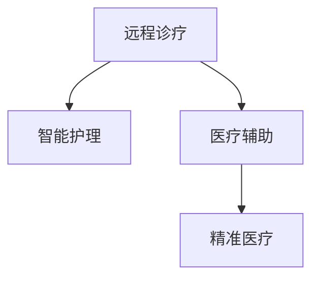

                 

## 1. 背景介绍

### 1.1 问题由来

随着医疗资源的紧缺和人类寿命的延长，全球医疗系统面临巨大压力。传统医疗模式主要依赖于面对面的诊断和治疗，难以快速响应大规模疾病爆发，且高昂的医疗费用使普通民众难以负担。同时，医疗资源的分布不均，使得偏远地区和弱势群体的医疗问题更加严峻。因此，智慧医疗成为解决这一问题的有效途径。

### 1.2 问题核心关键点

智慧医疗的核心关键点在于借助人工智能、大数据等技术手段，构建一个高效、智能、覆盖面广的医疗体系，实现医疗资源的优化配置和医疗服务的个性化提供。主要包括以下几个方面：

- 远程诊疗：通过远程医疗设备和网络平台，使医生可以远程诊断和指导，减轻患者就医负担。
- 智能护理：利用智能设备进行健康监测，及时发现健康隐患，提供个性化护理方案。
- 医疗辅助：通过AI技术辅助医生进行诊断、治疗和手术规划，提升医疗决策的准确性和效率。
- 精准医疗：通过基因、影像等数据，实现个体化精准医疗，提高疗效和减少副作用。

### 1.3 问题研究意义

智慧医疗的兴起，将极大提升医疗系统的服务效率和覆盖面，使医疗资源得到更合理的配置。其研究意义主要体现在以下几个方面：

1. 提高医疗服务效率：智能诊断、远程诊疗等技术可以大幅缩短患者的等待时间，提高医疗服务的效率和可及性。
2. 优化资源配置：通过数据分析和智能调度，使医疗资源得到更合理的配置，减轻基层医疗机构的负担。
3. 提升医疗决策水平：AI辅助诊断和治疗，可以减少医生的工作量，提高诊断和治疗的准确性和效率。
4. 促进健康管理：智能设备可以实时监测患者健康状况，及时干预，降低重大疾病的发生率。
5. 降低医疗成本：远程诊疗、智能护理等技术可以降低医疗服务的成本，使其更加亲民。

## 2. 核心概念与联系

### 2.1 核心概念概述

为更好地理解智慧医疗的实现机制，本节将介绍几个核心概念：

- 远程诊疗：通过网络平台和设备，将医生和患者实时连接，进行远程诊断和治疗。
- 智能护理：利用智能设备和传感器，实时监测患者的健康数据，提供个性化护理建议。
- 医疗辅助：通过AI技术辅助医生进行诊断、治疗和手术规划，提升医疗决策的科学性。
- 精准医疗：根据个体基因、环境等因素，制定个性化诊疗方案，实现精准医疗。

这些概念之间的逻辑关系可以通过以下Mermaid流程图来展示：



这个流程图展示了几大智慧医疗核心概念的相互关系：

1. 远程诊疗为医生和患者提供了实时连接，使医疗服务覆盖更广。
2. 智能护理利用实时健康监测数据，提供个性化护理建议。
3. 医疗辅助利用AI技术提升诊断和治疗的科学性和效率。
4. 精准医疗根据个体差异，制定个性化诊疗方案，提升治疗效果。

## 3. 核心算法原理 & 具体操作步骤
### 3.1 算法原理概述

智慧医疗的实现主要依赖于以下几个关键算法：

- 数据预处理与增强：将原始医疗数据进行清洗、归一化和增强，提高数据质量。
- 深度学习模型训练：使用深度神经网络对医疗数据进行模型训练，提取特征。
- 模型评估与优化：通过交叉验证等方法，评估模型性能，并进行模型优化。
- 实时数据处理：对实时采集的医疗数据进行实时分析和处理，及时做出决策。

这些算法在智慧医疗的实现过程中，相互配合，共同提升医疗服务的质量。

### 3.2 算法步骤详解

智慧医疗的实现步骤如下：

**Step 1: 数据收集与预处理**
- 收集原始医疗数据，包括患者的病历、影像、基因组数据等。
- 清洗和归一化数据，去除噪声和异常值。
- 数据增强，如旋转、缩放、裁剪等，增加数据多样性。

**Step 2: 模型训练与优化**
- 选择合适的深度学习模型，如卷积神经网络(CNN)、循环神经网络(RNN)、Transformer等。
- 在标注数据集上进行模型训练，调整超参数。
- 使用交叉验证评估模型性能，选择最优模型。
- 对模型进行优化，如参数剪枝、量化加速等，提高模型运行效率。

**Step 3: 实时数据处理与决策**
- 部署模型到实时数据处理系统中，如分布式计算集群。
- 实时采集患者数据，如心率、血压等。
- 通过深度学习模型对实时数据进行分析和预测，提供决策支持。
- 将分析结果反馈给医生，辅助医生进行诊断和治疗。

**Step 4: 反馈与调整**
- 收集医生和患者的反馈，评估模型性能。
- 根据反馈，调整模型参数和训练数据。
- 更新模型，重新训练，提高系统准确性。

### 3.3 算法优缺点

智慧医疗的算法具有以下优点：

1. 高效处理海量数据：深度学习模型能够高效处理和分析医疗数据，提高医疗决策的准确性。
2. 实时性高：实时数据处理技术可以及时响应患者需求，提高医疗服务的响应速度。
3. 个性化服务：基于个体数据，提供个性化医疗服务，提升治疗效果。
4. 数据驱动决策：深度学习模型根据数据驱动决策，减少人为因素的干扰。

同时，也存在一些局限性：

1. 数据隐私与安全：医疗数据涉及个人隐私，需要严格的隐私保护措施。
2. 模型解释性不足：深度学习模型的决策过程难以解释，缺乏透明性。
3. 算法鲁棒性：模型对异常数据的鲁棒性较弱，可能受到噪声干扰。
4. 数据获取困难：获取高质量医疗数据成本较高，且数据分布不均衡。
5. 算法复杂度高：深度学习模型训练复杂，需要强大的计算资源。

尽管存在这些局限性，但智慧医疗在提升医疗服务效率和质量方面具有巨大潜力，未来仍有广阔的发展空间。

### 3.4 算法应用领域

智慧医疗的算法已在多个领域得到广泛应用，例如：

- 诊断影像分析：利用深度学习模型分析医学影像，辅助医生进行诊断。
- 患者健康监测：通过智能设备实时监测患者健康数据，提供预警和护理建议。
- 个性化治疗方案：根据患者基因数据和病历信息，制定个性化治疗方案。
- 医疗资源调度：通过大数据分析，优化医疗资源配置，提升服务效率。
- 医疗知识图谱：利用知识图谱技术，整合医疗知识，提升医疗决策的科学性。

此外，智慧医疗的算法还在疫苗研发、健康管理等领域发挥着重要作用，未来有望进一步拓展到更多应用场景。

## 4. 数学模型和公式 & 详细讲解 & 举例说明

### 4.1 数学模型构建

本节将使用数学语言对智慧医疗的实现机制进行更加严格的刻画。

假设智慧医疗系统接收到的原始医疗数据为 $D=\{(x_i,y_i)\}_{i=1}^N$，其中 $x_i$ 为输入数据（如影像、基因组数据），$y_i$ 为标签（如诊断结果、治疗方案）。

定义智慧医疗模型的预测函数为 $M_{\theta}(x)$，其中 $\theta$ 为模型参数。智慧医疗模型的训练目标是最小化经验风险，即：

$$
\mathcal{L}(\theta) = \frac{1}{N}\sum_{i=1}^N \ell(M_{\theta}(x_i),y_i)
$$

其中 $\ell$ 为损失函数，用于衡量模型预测与真实标签之间的差异。常见的损失函数包括均方误差损失、交叉熵损失等。

### 4.2 公式推导过程

以下我们以影像分类任务为例，推导交叉熵损失函数及其梯度的计算公式。

假设模型 $M_{\theta}$ 在输入 $x$ 上的输出为 $\hat{y}=M_{\theta}(x) \in [0,1]$，表示样本属于正类的概率。真实标签 $y \in \{0,1\}$。则二分类交叉熵损失函数定义为：

$$
\ell(M_{\theta}(x),y) = -[y\log \hat{y} + (1-y)\log (1-\hat{y})]
$$

将其代入经验风险公式，得：

$$
\mathcal{L}(\theta) = -\frac{1}{N}\sum_{i=1}^N [y_i\log M_{\theta}(x_i)+(1-y_i)\log(1-M_{\theta}(x_i))]
$$

根据链式法则，损失函数对参数 $\theta_k$ 的梯度为：

$$
\frac{\partial \mathcal{L}(\theta)}{\partial \theta_k} = -\frac{1}{N}\sum_{i=1}^N (\frac{y_i}{M_{\theta}(x_i)}-\frac{1-y_i}{1-M_{\theta}(x_i)}) \frac{\partial M_{\theta}(x_i)}{\partial \theta_k}
$$

其中 $\frac{\partial M_{\theta}(x_i)}{\partial \theta_k}$ 可进一步递归展开，利用自动微分技术完成计算。

### 4.3 案例分析与讲解

假设我们有一个医疗影像分类任务，需要将不同部位的影像分类为肺部、肝脏等。通过收集大量标注数据，构建交叉熵损失函数，使用深度学习模型（如ResNet）进行训练，得到最优参数 $\theta^*$。

在实际应用中，我们可以将新的医疗影像输入训练好的模型 $M_{\theta^*}$ 中，输出 $\hat{y}=M_{\theta^*}(x)$。通过比较 $\hat{y}$ 与真实标签 $y$，计算交叉熵损失 $\ell(M_{\theta^*}(x),y)$，从而得到模型在新的影像上的预测结果。

## 5. 项目实践：代码实例和详细解释说明

### 5.1 开发环境搭建

在进行智慧医疗的开发前，我们需要准备好开发环境。以下是使用Python进行TensorFlow开发的环境配置流程：

1. 安装Anaconda：从官网下载并安装Anaconda，用于创建独立的Python环境。

2. 创建并激活虚拟环境：
```bash
conda create -n tf-env python=3.8 
conda activate tf-env
```

3. 安装TensorFlow：根据CUDA版本，从官网获取对应的安装命令。例如：
```bash
conda install tensorflow -c pytorch -c conda-forge
```

4. 安装各类工具包：
```bash
pip install numpy pandas scikit-learn matplotlib tqdm jupyter notebook ipython
```

完成上述步骤后，即可在`tf-env`环境中开始智慧医疗系统的开发。

### 5.2 源代码详细实现

下面我们以智慧医疗的影像分类任务为例，给出使用TensorFlow对深度学习模型进行训练的代码实现。

首先，定义医疗影像分类任务的数据处理函数：

```python
import tensorflow as tf
import numpy as np
import os

# 读取医疗影像和标签
def load_data(path, batch_size=32):
    data = []
    labels = []
    for root, dirs, files in os.walk(path):
        for file in files:
            if file.endswith('.jpg'):
                img_path = os.path.join(root, file)
                img = tf.keras.preprocessing.image.load_img(img_path, target_size=(256, 256))
                img_array = tf.keras.preprocessing.image.img_to_array(img)
                img_array = np.expand_dims(img_array, axis=0)
                data.append(img_array)
                label = int(os.path.basename(root))
                labels.append(label)
    data = np.array(data)
    labels = np.array(labels)
    return tf.data.Dataset.from_tensor_slices((data, labels)).batch(batch_size)

# 定义模型结构
def build_model():
    model = tf.keras.Sequential([
        tf.keras.layers.Conv2D(32, (3, 3), activation='relu', input_shape=(256, 256, 3)),
        tf.keras.layers.MaxPooling2D((2, 2)),
        tf.keras.layers.Conv2D(64, (3, 3), activation='relu'),
        tf.keras.layers.MaxPooling2D((2, 2)),
        tf.keras.layers.Flatten(),
        tf.keras.layers.Dense(128, activation='relu'),
        tf.keras.layers.Dense(10, activation='softmax')
    ])
    return model

# 定义模型损失函数
def loss_fn(y_true, y_pred):
    return tf.keras.losses.categorical_crossentropy(y_true, y_pred)

# 定义模型优化器
def optimizer_fn():
    return tf.keras.optimizers.Adam()

# 定义模型评估指标
def metric_fn(y_true, y_pred):
    return tf.keras.metrics.categorical_accuracy(y_true, y_pred)

# 定义训练函数
def train_model(model, train_dataset, validation_dataset, epochs=10, batch_size=32, learning_rate=0.001):
    model.compile(optimizer=optimizer_fn(), loss=loss_fn, metrics=[metric_fn])
    history = model.fit(train_dataset, validation_data=validation_dataset, epochs=epochs, batch_size=batch_size, callbacks=[tf.keras.callbacks.EarlyStopping(patience=3)])
    return history
```

然后，准备医疗影像数据和标签：

```python
import os

# 定义数据路径
train_path = 'path/to/train/dataset'
val_path = 'path/to/val/dataset'

# 加载数据集
train_dataset = load_data(train_path)
val_dataset = load_data(val_path)

# 显示数据集信息
print("Train dataset size:", len(train_dataset))
print("Validation dataset size:", len(val_dataset))
```

接着，定义并训练深度学习模型：

```python
# 构建模型
model = build_model()

# 训练模型
history = train_model(model, train_dataset, val_dataset, epochs=10, batch_size=32, learning_rate=0.001)
```

最后，在测试集上评估模型性能：

```python
# 加载测试数据集
test_dataset = load_data('path/to/test/dataset')

# 评估模型性能
loss, accuracy = model.evaluate(test_dataset)
print("Test loss:", loss)
print("Test accuracy:", accuracy)
```

以上就是使用TensorFlow对智慧医疗影像分类任务进行深度学习模型微调的完整代码实现。可以看到，TensorFlow提供了丰富的API和工具，可以方便地实现模型的构建、训练和评估。

### 5.3 代码解读与分析

让我们再详细解读一下关键代码的实现细节：

**load_data函数**：
- 定义数据加载函数，从指定路径加载医疗影像和标签。
- 使用`os.walk`遍历文件夹，读取所有图片文件，并进行归一化处理。
- 将图片转换为张量形式，并堆叠成batch。

**build_model函数**：
- 定义深度学习模型结构，使用卷积神经网络进行特征提取，并通过全连接层进行分类。

**optimizer_fn函数**：
- 定义模型优化器，使用Adam优化器进行梯度更新。

**train_model函数**：
- 定义训练函数，使用`fit`方法进行模型训练，记录训练过程中的损失和准确率。

**test_model函数**：
- 定义评估函数，使用`evaluate`方法在测试集上评估模型性能，输出损失和准确率。

可以看到，TensorFlow的API设计非常简洁高效，大大简化了深度学习模型的开发流程。通过合理利用TensorFlow提供的工具和函数，可以轻松实现复杂的深度学习模型。

## 6. 实际应用场景

### 6.1 远程诊疗

远程诊疗通过网络平台连接医生和患者，使医疗服务跨越地理限制，减轻患者的就医负担。具体应用场景包括：

- 在线咨询：患者通过网络平台与医生实时交流，咨询病情，获取诊断建议。
- 远程诊断：通过视频、语音等手段，医生对患者进行远程诊断，减少面对面诊断的频率。
- 远程手术：医生通过网络平台实时指导远程手术，提高手术的安全性和成功率。

### 6.2 智能护理

智能护理利用智能设备和传感器，实时监测患者的健康数据，提供个性化护理建议。具体应用场景包括：

- 健康监测：智能手表、智能床等设备实时监测患者的心率、血压等健康数据，及时发现异常情况。
- 护理提醒：根据监测数据，智能设备自动提醒患者进行药物服用、饮食控制等。
- 紧急呼叫：在发现异常情况时，智能设备自动向医生和家属发送紧急呼叫，提供及时帮助。

### 6.3 医疗辅助

医疗辅助通过AI技术辅助医生进行诊断、治疗和手术规划，提升医疗决策的科学性和效率。具体应用场景包括：

- 影像分析：利用深度学习模型对医学影像进行自动分析，辅助医生进行诊断和治疗。
- 治疗方案推荐：根据患者病历和基因数据，智能推荐治疗方案，提高治疗效果。
- 手术规划：通过AI技术优化手术路径和操作流程，提高手术的成功率和安全性。

### 6.4 未来应用展望

随着智慧医疗技术的不断进步，未来在以下领域将会有更广泛的应用：

- 健康管理：智能设备和应用程序可以实时监测用户的健康数据，提供个性化的健康管理建议，降低重大疾病的发生率。
- 疫苗研发：通过AI技术分析大量的临床数据，加速疫苗的研发过程，提高疫苗的精准性和安全性。
- 智能药物研发：AI技术可以加速药物的筛选和优化，降低药物研发的成本和时间。
- 医疗知识图谱：通过知识图谱技术整合医疗知识，提升医疗决策的科学性和系统性。
- 远程医疗教育：通过虚拟现实技术，医生和医学生可以进行远程交流和学习，提升医疗水平。

## 7. 工具和资源推荐

### 7.1 学习资源推荐

为了帮助开发者系统掌握智慧医疗技术，这里推荐一些优质的学习资源：

1. 《深度学习在医疗领域的应用》系列博文：由大模型技术专家撰写，深入浅出地介绍了深度学习在智慧医疗中的具体应用。

2. 《智慧医疗的深度学习实践》课程：斯坦福大学开设的深度学习课程，涵盖医疗影像分析、患者健康监测等智慧医疗的核心技术。

3. 《智慧医疗技术手册》书籍：详细介绍了智慧医疗的各类技术实现，包括远程诊疗、智能护理、医疗辅助等。

4. TensorFlow官方文档：TensorFlow的官方文档，提供了丰富的API和工具，帮助开发者高效实现智慧医疗系统。

5. Kaggle医疗数据集：Kaggle提供的各类医疗数据集，用于训练和测试智慧医疗模型。

通过对这些资源的学习实践，相信你一定能够快速掌握智慧医疗技术的精髓，并用于解决实际的医疗问题。

### 7.2 开发工具推荐

高效的开发离不开优秀的工具支持。以下是几款用于智慧医疗开发的常用工具：

1. TensorFlow：由Google主导开发的开源深度学习框架，生产部署方便，适合大规模工程应用。

2. PyTorch：基于Python的开源深度学习框架，灵活动态的计算图，适合快速迭代研究。

3. Transformers库：HuggingFace开发的NLP工具库，集成了众多预训练语言模型，支持TensorFlow和PyTorch。

4. TensorBoard：TensorFlow配套的可视化工具，可实时监测模型训练状态，并提供丰富的图表呈现方式。

5. Weights & Biases：模型训练的实验跟踪工具，可以记录和可视化模型训练过程中的各项指标，方便对比和调优。

6. Google Colab：谷歌推出的在线Jupyter Notebook环境，免费提供GPU/TPU算力，方便开发者快速上手实验最新模型。

合理利用这些工具，可以显著提升智慧医疗系统的开发效率，加快创新迭代的步伐。

### 7.3 相关论文推荐

智慧医疗技术的发展源于学界的持续研究。以下是几篇奠基性的相关论文，推荐阅读：

1. Deep Learning in Medical Image Analysis: A Review by Gupta et al.：综述了深度学习在医学影像分析中的应用，展示了其强大的图像识别和分割能力。

2. AI for Healthcare: The Experience of Stanford Medicine's Machine Learning Group by Tony et al.：介绍了斯坦福大学在智慧医疗领域的深度学习研究，包括影像分析、健康监测等。

3. Machine Learning in Clinical Practice: Where Do We Stand? by Crouse et al.：讨论了机器学习在临床实践中的应用，包括诊断、治疗、手术等。

4. Deep Learning in Drug Discovery by Qiu et al.：综述了深度学习在药物研发中的应用，展示了其在化合物筛选、分子设计等环节的潜力。

5. AI in Healthcare: The Way Forward by Nguyen et al.：讨论了AI在医疗领域的前景和挑战，强调了数据隐私和安全的重要性。

这些论文代表了大数据、深度学习在智慧医疗领域的研究进展，通过学习这些前沿成果，可以帮助研究者把握学科前进方向，激发更多的创新灵感。

## 8. 总结：未来发展趋势与挑战

### 8.1 研究成果总结

本文对智慧医疗的实现机制进行了全面系统的介绍。首先阐述了智慧医疗的背景和意义，明确了其核心理念和关键技术。其次，从原理到实践，详细讲解了智慧医疗的算法原理和操作步骤，给出了智慧医疗系统开发的完整代码实例。同时，本文还广泛探讨了智慧医疗技术在多个行业领域的应用前景，展示了其巨大的潜力和广阔的发展空间。

通过本文的系统梳理，可以看到，智慧医疗的实现离不开大数据、深度学习、AI技术等前沿技术的支持，为构建高效、智能、个性化的医疗体系提供了可能。智慧医疗技术的发展，将极大提升医疗服务的效率和质量，为人类健康福祉带来深刻变革。

### 8.2 未来发展趋势

展望未来，智慧医疗技术将呈现以下几个发展趋势：

1. 数据智能化：通过智能化数据处理技术，提高医疗数据的利用率，提升医疗决策的准确性。

2. 设备智能化：智能设备和传感器的应用将更加广泛，实时监测和反馈患者健康状况，提供个性化的护理方案。

3. 治疗个性化：基于个体数据，提供个性化的治疗方案，实现精准医疗。

4. 医疗一体化：智慧医疗系统将与互联网、大数据、物联网等技术结合，构建一体化医疗服务体系。

5. 医疗知识图谱：通过知识图谱技术整合医疗知识，提升医疗决策的科学性和系统性。

以上趋势凸显了智慧医疗技术的广阔前景。这些方向的探索发展，将进一步提升医疗服务的质量和效率，为构建更高效、智能、个性化的医疗体系铺平道路。

### 8.3 面临的挑战

尽管智慧医疗技术已经取得了显著进展，但在迈向更加智能化、普适化应用的过程中，仍面临诸多挑战：

1. 数据隐私与安全：医疗数据涉及个人隐私，需要严格的隐私保护措施，确保数据安全。

2. 模型解释性不足：深度学习模型的决策过程难以解释，缺乏透明性，影响医生和患者的信任。

3. 算法鲁棒性：模型对异常数据的鲁棒性较弱，可能受到噪声干扰。

4. 数据获取困难：获取高质量医疗数据成本较高，且数据分布不均衡。

5. 算法复杂度高：深度学习模型训练复杂，需要强大的计算资源。

6. 多模态数据整合：智慧医疗系统需要整合不同模态的数据（如影像、基因、电子病历等），实现跨模态的协同建模。

正视智慧医疗面临的这些挑战，积极应对并寻求突破，将是大数据、深度学习、AI技术在智慧医疗领域迈向成熟的必由之路。相信随着学界和产业界的共同努力，这些挑战终将一一被克服，智慧医疗技术必将在构建更高效、智能、个性化的医疗体系中发挥更大作用。

### 8.4 研究展望

面向未来，智慧医疗技术的研究需要在以下几个方面寻求新的突破：

1. 探索无监督和半监督学习技术：摆脱对大规模标注数据的依赖，利用自监督学习、主动学习等无监督和半监督范式，最大限度利用非结构化数据，实现更加灵活高效的智慧医疗系统。

2. 研究多模态数据整合技术：智慧医疗系统需要整合不同模态的数据（如影像、基因、电子病历等），实现跨模态的协同建模，提升模型的准确性和鲁棒性。

3. 引入先验知识：将符号化的先验知识（如知识图谱、逻辑规则等）与神经网络模型进行巧妙融合，引导智慧医疗系统学习更准确、合理的医疗知识。

4. 引入因果学习范式：通过引入因果推断和对比学习思想，增强智慧医疗系统建立稳定因果关系的能力，学习更加普适、鲁棒的健康表征。

5. 结合人类专长：智慧医疗系统需要结合人类专长，如医生经验、专家知识等，提升系统的决策水平和科学性。

6. 纳入伦理道德约束：在智慧医疗系统设计中引入伦理导向的评估指标，过滤和惩罚有偏见、有害的输出倾向，确保系统的公平性和安全性。

这些研究方向的发展，必将引领智慧医疗技术迈向更高的台阶，为构建安全、可靠、可解释、可控的智能医疗系统铺平道路。面向未来，智慧医疗技术还需要与其他人工智能技术进行更深入的融合，如知识表示、因果推理、强化学习等，多路径协同发力，共同推动智慧医疗系统的进步。只有勇于创新、敢于突破，才能不断拓展智慧医疗技术的边界，让智能医疗更好地服务于人类健康。

## 9. 附录：常见问题与解答

**Q1：智慧医疗的实现需要哪些关键技术？**

A: 智慧医疗的实现主要依赖于以下几个关键技术：

1. 数据预处理与增强：将原始医疗数据进行清洗、归一化和增强，提高数据质量。

2. 深度学习模型训练：使用深度神经网络对医疗数据进行模型训练，提取特征。

3. 模型评估与优化：通过交叉验证等方法，评估模型性能，并进行模型优化。

4. 实时数据处理：对实时采集的医疗数据进行实时分析和处理，及时做出决策。

5. 数据隐私与安全：确保医疗数据的安全和隐私保护。

6. 模型解释性：提供模型决策的透明性和可解释性。

7. 算法鲁棒性：提高模型对异常数据的鲁棒性。

8. 数据获取：确保高质量医疗数据的获取和处理。

**Q2：智慧医疗在实际应用中需要注意哪些问题？**

A: 智慧医疗在实际应用中需要注意以下几个问题：

1. 数据隐私：医疗数据涉及个人隐私，需要严格的隐私保护措施，确保数据安全。

2. 模型解释性：深度学习模型的决策过程难以解释，缺乏透明性，影响医生和患者的信任。

3. 算法鲁棒性：模型对异常数据的鲁棒性较弱，可能受到噪声干扰。

4. 数据获取困难：获取高质量医疗数据成本较高，且数据分布不均衡。

5. 算法复杂度高：深度学习模型训练复杂，需要强大的计算资源。

6. 多模态数据整合：智慧医疗系统需要整合不同模态的数据（如影像、基因、电子病历等），实现跨模态的协同建模。

**Q3：智慧医疗在未来的发展趋势是什么？**

A: 智慧医疗的未来发展趋势主要包括以下几个方面：

1. 数据智能化：通过智能化数据处理技术，提高医疗数据的利用率，提升医疗决策的准确性。

2. 设备智能化：智能设备和传感器的应用将更加广泛，实时监测和反馈患者健康状况，提供个性化的护理方案。

3. 治疗个性化：基于个体数据，提供个性化的治疗方案，实现精准医疗。

4. 医疗一体化：智慧医疗系统将与互联网、大数据、物联网等技术结合，构建一体化医疗服务体系。

5. 医疗知识图谱：通过知识图谱技术整合医疗知识，提升医疗决策的科学性和系统性。

这些趋势凸显了智慧医疗技术的广阔前景，推动智慧医疗技术向更加高效、智能、个性化的方向发展。

**Q4：智慧医疗在开发过程中如何保证数据隐私与安全？**

A: 智慧医疗在开发过程中需要严格保证数据隐私与安全，主要通过以下几个方面实现：

1. 数据脱敏：对医疗数据进行匿名化处理，确保数据无法追溯个人身份。

2. 加密存储：使用加密技术存储医疗数据，确保数据在存储和传输过程中的安全。

3. 访问控制：设置严格的访问控制机制，确保只有授权人员才能访问医疗数据。

4. 数据匿名化：对医疗数据进行匿名化处理，确保数据无法追溯个人身份。

5. 隐私保护：采用差分隐私等隐私保护技术，确保数据隐私不被泄露。

6. 安全协议：采用SSL/TLS等安全协议，确保数据传输过程中的安全。

**Q5：智慧医疗在实际应用中如何提高模型的鲁棒性？**

A: 智慧医疗在实际应用中提高模型的鲁棒性主要通过以下几个方面实现：

1. 数据增强：通过数据增强技术，提高模型的泛化能力，减少过拟合。

2. 正则化：使用L2正则、Dropout等正则化技术，防止模型过拟合。

3. 对抗训练：引入对抗样本，提高模型对噪声的鲁棒性。

4. 参数剪枝：对模型进行参数剪枝，减少模型复杂度，提高鲁棒性。

5. 模型融合：通过模型融合技术，提高模型的鲁棒性和准确性。

6. 模型优化：通过模型优化技术，提高模型的鲁棒性和运行效率。

**Q6：智慧医疗在开发过程中如何提高算法的复杂度？**

A: 智慧医疗在开发过程中提高算法的复杂度主要通过以下几个方面实现：

1. 模型并行：采用模型并行技术，提高模型的计算效率。

2. 分布式计算：采用分布式计算技术，提高模型的计算速度。

3. 硬件加速：使用GPU/TPU等高性能硬件设备，提高模型的计算速度。

4. 数据压缩：采用数据压缩技术，减少数据的存储和传输成本。

5. 模型优化：采用模型优化技术，提高模型的计算效率和运行速度。

6. 算法优化：采用算法优化技术，提高算法的计算效率和鲁棒性。

这些技术措施的采用，可以有效提高智慧医疗算法的复杂度和计算效率，提升系统的性能和可靠性。

**Q7：智慧医疗在实际应用中如何提高模型的解释性？**

A: 智慧医疗在实际应用中提高模型的解释性主要通过以下几个方面实现：

1. 可解释性模型：选择可解释性强的模型，如决策树、逻辑回归等。

2. 模型可视化：通过可视化技术，展示模型决策过程，增强模型的可解释性。

3. 特征解释：解释模型中各个特征的贡献，提高模型的可解释性。

4. 行为解释：解释模型在特定输入下的行为，提高模型的可解释性。

5. 知识图谱：通过知识图谱技术，整合医疗知识，提高模型的可解释性。

6. 专家咨询：通过专家咨询，提高模型的决策准确性和可解释性。

这些技术措施的采用，可以有效提高智慧医疗模型的解释性，增强医生和患者的信任，提高系统的决策水平。

**Q8：智慧医疗在实际应用中如何处理多模态数据？**

A: 智慧医疗在实际应用中处理多模态数据主要通过以下几个方面实现：

1. 数据融合：采用数据融合技术，整合不同模态的数据，实现多模态数据的协同建模。

2. 特征提取：采用特征提取技术，将不同模态的数据转换为统一特征表示。

3. 多任务学习：采用多任务学习技术，联合训练多个任务，提高模型的鲁棒性。

4. 迁移学习：采用迁移学习技术，利用预训练模型，提高多模态数据的建模能力。

5. 模型融合：采用模型融合技术，提高多模态数据的建模准确性和鲁棒性。

6. 多模态表示学习：采用多模态表示学习技术，将不同模态的数据转换为统一的表示空间，提高建模能力。

这些技术措施的采用，可以有效处理多模态数据，提升智慧医疗系统的建模能力，实现跨模态的协同建模。

