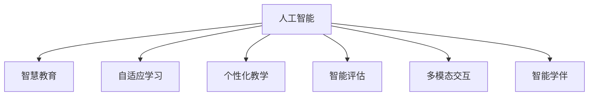

                 

# 未来的智慧教育：2050年的AI导师与智能学伴

> 关键词：人工智能,智慧教育,自适应学习,个性化教学,智能评估,自监督学习,多模态交互,智能学伴

## 1. 背景介绍

在过去的几十年里，信息技术尤其是人工智能的迅猛发展，极大地改变了教育领域的教学方式和学习形态。从早期的电子化教育、在线课程到如今智慧教育、混合学习、AI导师和智能学伴，人工智能技术已经成为推动教育进步的重要力量。展望未来，2050年的教育将进一步融合人工智能和数字技术，形成更为高效、灵活、个性化的智慧教育新形态。

### 1.1 教育数字化浪潮
随着互联网的普及和智能终端设备的普及，教育数字化逐渐成为教育发展的重要趋势。从纸质教材到数字化教材，从传统课堂教学到线上线下结合的混合学习，再到全场景、全时段的智慧教育，教育数字化正在重塑学习方式。

### 1.2 人工智能技术的引入
人工智能技术的发展，特别是深度学习、自然语言处理、计算机视觉等技术的成熟，使得教育数字化进程中的AI应用成为可能。AI导师、智能学伴、自适应学习系统等AI教育技术，正在逐步改变教学和学习的面貌。

### 1.3 未来的智慧教育展望
未来，基于人工智能的智慧教育将更加智能化、个性化和普及化。AI导师和智能学伴将成为每个学生不可或缺的伙伴，自适应学习系统将帮助学生高效掌握知识，智能评估工具将实时监控学生学习效果，个性化推荐系统将提供符合学生兴趣和需求的学习资源。智慧教育将让每一个学生都能享受到高品质的学习体验。

## 2. 核心概念与联系

### 2.1 核心概念概述

为了更好地理解2050年智慧教育中AI导师与智能学伴的原理与架构，本节将介绍几个关键概念：

- **人工智能（AI）**：利用计算机技术模拟、延伸和扩展人的智能，实现对语音、图像、文本等数据的处理和理解。
- **智慧教育**：基于信息技术和AI技术，构建智能化的教育环境，实现个性化教学、高效评估和学习资源的智能推荐。
- **自适应学习**：根据学生的学习状态和反馈，动态调整教学内容和策略，提供个性化的学习路径和资源。
- **个性化教学**：根据学生的兴趣、能力和学习习惯，定制个性化的教学方案，满足不同学生的需求。
- **智能评估**：利用AI技术进行学生学习效果的评估和反馈，提高评估的准确性和客观性。
- **多模态交互**：利用语音、图像、文本等多种模态的交互，增强学习体验的沉浸感和互动性。
- **智能学伴**：基于AI技术的虚拟学习助手，提供实时互动和个性化支持，帮助学生克服学习难题。

这些概念之间的逻辑关系可以通过以下Mermaid流程图来展示：



这个流程图展示了一些关键概念之间的关系：

1. 人工智能是智慧教育的基础，提供了实现自适应学习和个性化教学的技术支持。
2. 自适应学习是智慧教育的核心，通过动态调整教学内容和策略，满足学生的个性化需求。
3. 个性化教学是智慧教育的目标，通过定制化教学方案，提高学习效果。
4. 智能评估是智慧教育的重要环节，确保学习效果能够得到客观、准确的反馈。
5. 多模态交互是智慧教育的手段，通过丰富多样的交互方式，提升学习体验。
6. 智能学伴是智慧教育的辅助，通过AI虚拟助手，提供个性化的支持。

## 3. 核心算法原理 & 具体操作步骤
### 3.1 算法原理概述

2050年的智慧教育中，AI导师和智能学伴将广泛采用基于监督学习的微调方法，结合自监督学习、多模态交互等技术，实现教学和学习的智能化。其中，监督学习用于个性化推荐、智能评估等任务，自监督学习用于预训练语言模型、数据增强等，多模态交互则通过融合语音、图像、文本等多种模态的数据，提升学习的沉浸感和互动性。

### 3.2 算法步骤详解

#### 3.2.1 监督学习微调
基于监督学习的微调方法，通常包括以下几个步骤：

1. **数据准备**：收集学生的学习数据，如学习时间、答题记录、学习轨迹等，作为训练数据。
2. **模型选择**：选择合适的预训练模型，如BERT、GPT等，作为微调的基础模型。
3. **任务适配**：设计适合当前学习任务的目标函数和损失函数，如分类、回归、序列生成等。
4. **模型训练**：使用训练数据对模型进行微调，更新模型的参数，以适应特定的学习任务。
5. **模型评估**：在验证集或测试集上评估模型性能，如准确率、召回率、F1-score等指标。
6. **模型部署**：将微调后的模型部署到教育平台中，供学生使用。

#### 3.2.2 自监督学习预训练
自监督学习预训练主要分为以下几个步骤：

1. **数据准备**：收集大规模无标签数据，如教育文献、在线讨论、公开数据集等。
2. **模型选择**：选择适合的自监督学习任务，如掩码语言模型、下一句预测、图像分类等。
3. **模型训练**：使用无标签数据训练模型，通过自监督学习获得泛化的语言和视觉表示。
4. **模型微调**：将预训练模型应用于特定的学习任务，进行微调，以获得更好的性能。

#### 3.2.3 多模态交互融合
多模态交互融合主要通过以下几个步骤实现：

1. **数据采集**：收集学生的语音、图像、文本等多种模态的数据，如朗读录音、笔记、作业等。
2. **特征提取**：对采集到的数据进行特征提取，如将语音转换为文本、图像转换为向量等。
3. **模型融合**：将不同模态的特征进行融合，形成多模态输入，供AI导师和智能学伴使用。
4. **模型交互**：通过多模态模型与学生的互动，如自然语言问答、图像识别等，实现智能教学和评估。

### 3.3 算法优缺点

#### 3.3.1 监督学习微调

**优点**：

1. **高效性**：能够快速适应特定任务，在少量标注数据的情况下取得较好性能。
2. **灵活性**：适用于各种学习任务，如分类、回归、生成等。
3. **易用性**：通过简单的任务适配层设计，实现对预训练模型的快速微调。

**缺点**：

1. **依赖标注数据**：需要大量的标注数据，才能获得良好的效果。
2. **过拟合风险**：当标注数据较少时，容易出现过拟合现象。
3. **模型复杂性**：需要构建适合特定任务的目标函数和损失函数。

#### 3.3.2 自监督学习预训练

**优点**：

1. **无需标注数据**：利用大规模无标签数据进行预训练，减少对标注数据的依赖。
2. **泛化能力强**：通过自监督学习，能够学习到更加泛化的语言和视觉表示。
3. **灵活性高**：可以应用于多种自监督学习任务，如掩码语言模型、下一句预测等。

**缺点**：

1. **训练时间长**：自监督学习通常需要大量计算资源和时间。
2. **模型复杂性**：设计自监督学习任务需要一定的专业知识和经验。
3. **效果受数据影响**：预训练数据的质量和多样性直接影响模型的性能。

#### 3.3.3 多模态交互融合

**优点**：

1. **丰富数据来源**：通过多模态数据融合，可以获取更多维度的学习信息。
2. **提升沉浸感**：通过多种模态的交互，提升学习的沉浸感和互动性。
3. **提高评估准确性**：通过语音、图像等多种模态的融合，提高评估的准确性。

**缺点**：

1. **技术复杂性**：多模态数据的融合和处理需要较高的技术要求。
2. **数据采集成本高**：多模态数据的采集和处理需要较高的成本。
3. **系统复杂性**：多模态交互系统的构建和管理复杂度较高。

### 3.4 算法应用领域

基于上述算法原理，AI导师和智能学伴可以在以下几个领域得到广泛应用：

1. **个性化推荐系统**：通过学习学生的学习行为和偏好，推荐个性化的学习资源，如课程、教材、习题等。
2. **智能评估系统**：利用AI技术进行学习效果的评估和反馈，提供客观、及时的评估报告。
3. **自适应学习系统**：根据学生的学习状态和反馈，动态调整教学内容和策略，提供个性化的学习路径和资源。
4. **智能学伴系统**：通过自然语言问答、图像识别等技术，提供实时的互动和支持，帮助学生克服学习难题。
5. **虚拟实验室**：结合虚拟现实和AI技术，提供虚拟实验环境，提升学生的实践能力。

## 4. 数学模型和公式 & 详细讲解  
### 4.1 数学模型构建

在2050年的智慧教育中，AI导师和智能学伴将广泛应用以下数学模型和公式：

**监督学习模型**：

$$
\mathcal{L}(\theta) = \frac{1}{N} \sum_{i=1}^N \ell(M_{\theta}(x_i),y_i)
$$

其中，$\mathcal{L}$ 为损失函数，$\theta$ 为模型参数，$x_i$ 为输入数据，$y_i$ 为标签，$\ell$ 为损失函数，如交叉熵、均方误差等。

**自监督学习模型**：

$$
\mathcal{L}_{self}(\theta) = \mathbb{E}_{(x,y) \sim \mathcal{D}} [\ell(M_{\theta}(x),y)]
$$

其中，$\mathcal{L}_{self}$ 为自监督学习损失函数，$\mathcal{D}$ 为预训练数据集，$\ell$ 为自监督学习任务特定的损失函数，如掩码语言模型、下一句预测等。

**多模态交互模型**：

$$
\mathcal{L}_{inter}(\theta) = \frac{1}{N} \sum_{i=1}^N \ell(M_{\theta}(x_{i,\text{all}}),y_i)
$$

其中，$x_{i,\text{all}}$ 为多模态数据集，包括语音、图像、文本等多种模态的数据，$\ell$ 为多模态模型的损失函数。

### 4.2 公式推导过程

#### 4.2.1 监督学习公式推导
监督学习的损失函数公式如下：

$$
\mathcal{L}(\theta) = \frac{1}{N} \sum_{i=1}^N \ell(M_{\theta}(x_i),y_i)
$$

其中，$M_{\theta}(x_i)$ 为模型在输入 $x_i$ 上的输出，$\ell$ 为损失函数，如交叉熵、均方误差等。通过梯度下降等优化算法，最小化损失函数 $\mathcal{L}$，更新模型参数 $\theta$。

#### 4.2.2 自监督学习公式推导
自监督学习的损失函数公式如下：

$$
\mathcal{L}_{self}(\theta) = \mathbb{E}_{(x,y) \sim \mathcal{D}} [\ell(M_{\theta}(x),y)]
$$

其中，$M_{\theta}(x)$ 为模型在输入 $x$ 上的输出，$\ell$ 为自监督学习任务特定的损失函数，如掩码语言模型、下一句预测等。通过优化算法最小化损失函数 $\mathcal{L}_{self}$，更新模型参数 $\theta$。

#### 4.2.3 多模态交互公式推导
多模态交互的损失函数公式如下：

$$
\mathcal{L}_{inter}(\theta) = \frac{1}{N} \sum_{i=1}^N \ell(M_{\theta}(x_{i,\text{all}}),y_i)
$$

其中，$M_{\theta}(x_{i,\text{all}})$ 为多模态模型在输入 $x_{i,\text{all}}$ 上的输出，$\ell$ 为多模态模型的损失函数，如分类、回归、生成等。通过优化算法最小化损失函数 $\mathcal{L}_{inter}$，更新模型参数 $\theta$。

### 4.3 案例分析与讲解

**案例一：自适应学习系统**

自适应学习系统通过监督学习和自监督学习相结合的方式，实现个性化推荐。以阅读理解任务为例：

1. **监督学习**：收集学生阅读理解的答题记录和反馈，利用监督学习微调模型，预测学生的阅读理解能力。
2. **自监督学习**：利用大规模无标签文本数据进行预训练，获得泛化的语言表示。
3. **多模态交互**：结合学生的语音朗读和文本笔记，进行多模态交互，提升学习效果。

通过自适应学习系统，学生能够获得个性化的阅读理解资源和路径，提高学习效率和效果。

**案例二：智能评估系统**

智能评估系统通过监督学习进行学习效果的评估。以数学考试评估为例：

1. **监督学习**：收集学生的答题记录和考试分数，利用监督学习微调模型，预测学生的数学能力。
2. **多模态交互**：结合学生的语音朗读、图像答案等，进行多模态评估，提高评估的准确性。
3. **实时反馈**：通过智能评估系统，及时提供学习效果的反馈，帮助学生改进学习策略。

通过智能评估系统，学生能够获得客观、及时的评估报告，提升学习效果和信心。

## 5. 项目实践：代码实例和详细解释说明
### 5.1 开发环境搭建

在进行项目实践前，我们需要准备好开发环境。以下是使用Python进行PyTorch开发的环境配置流程：

1. 安装Anaconda：从官网下载并安装Anaconda，用于创建独立的Python环境。

2. 创建并激活虚拟环境：
```bash
conda create -n pytorch-env python=3.8 
conda activate pytorch-env
```

3. 安装PyTorch：根据CUDA版本，从官网获取对应的安装命令。例如：
```bash
conda install pytorch torchvision torchaudio cudatoolkit=11.1 -c pytorch -c conda-forge
```

4. 安装TensorFlow：
```bash
conda install tensorflow
```

5. 安装Transformers库：
```bash
pip install transformers
```

6. 安装各类工具包：
```bash
pip install numpy pandas scikit-learn matplotlib tqdm jupyter notebook ipython
```

完成上述步骤后，即可在`pytorch-env`环境中开始项目实践。

### 5.2 源代码详细实现

这里我们以阅读理解任务为例，给出使用Transformers库对BERT模型进行自适应学习的PyTorch代码实现。

首先，定义阅读理解任务的数据处理函数：

```python
from transformers import BertTokenizer
from torch.utils.data import Dataset
import torch

class ReadingComprehensionDataset(Dataset):
    def __init__(self, texts, answers, tokenizer, max_len=128):
        self.texts = texts
        self.answers = answers
        self.tokenizer = tokenizer
        self.max_len = max_len
        
    def __len__(self):
        return len(self.texts)
    
    def __getitem__(self, item):
        text = self.texts[item]
        answer = self.answers[item]
        
        encoding = self.tokenizer(text, return_tensors='pt', max_length=self.max_len, padding='max_length', truncation=True)
        input_ids = encoding['input_ids'][0]
        attention_mask = encoding['attention_mask'][0]
        
        # 对token-wise的标签进行编码
        encoded_answer = [tokenizer.convert_tokens_to_ids(answer)]
        encoded_answer.extend([tokenizer.convert_tokens_to_ids('[PAD]')] * (self.max_len - len(encoded_answer)))
        labels = torch.tensor(encoded_answer, dtype=torch.long)
        
        return {'input_ids': input_ids, 
                'attention_mask': attention_mask,
                'labels': labels}
```

然后，定义模型和优化器：

```python
from transformers import BertForQuestionAnswering, AdamW

model = BertForQuestionAnswering.from_pretrained('bert-base-cased')

optimizer = AdamW(model.parameters(), lr=2e-5)
```

接着，定义训练和评估函数：

```python
from torch.utils.data import DataLoader
from tqdm import tqdm
from sklearn.metrics import classification_report

device = torch.device('cuda') if torch.cuda.is_available() else torch.device('cpu')
model.to(device)

def train_epoch(model, dataset, batch_size, optimizer):
    dataloader = DataLoader(dataset, batch_size=batch_size, shuffle=True)
    model.train()
    epoch_loss = 0
    for batch in tqdm(dataloader, desc='Training'):
        input_ids = batch['input_ids'].to(device)
        attention_mask = batch['attention_mask'].to(device)
        labels = batch['labels'].to(device)
        model.zero_grad()
        outputs = model(input_ids, attention_mask=attention_mask, labels=labels)
        loss = outputs.loss
        epoch_loss += loss.item()
        loss.backward()
        optimizer.step()
    return epoch_loss / len(dataloader)

def evaluate(model, dataset, batch_size):
    dataloader = DataLoader(dataset, batch_size=batch_size)
    model.eval()
    preds, labels = [], []
    with torch.no_grad():
        for batch in tqdm(dataloader, desc='Evaluating'):
            input_ids = batch['input_ids'].to(device)
            attention_mask = batch['attention_mask'].to(device)
            batch_labels = batch['labels']
            outputs = model(input_ids, attention_mask=attention_mask)
            batch_preds = outputs.logits.argmax(dim=2).to('cpu').tolist()
            batch_labels = batch_labels.to('cpu').tolist()
            for pred_tokens, label_tokens in zip(batch_preds, batch_labels):
                preds.append(pred_tokens[:len(label_tokens)])
                labels.append(label_tokens)
                
    print(classification_report(labels, preds))
```

最后，启动训练流程并在测试集上评估：

```python
epochs = 5
batch_size = 16

for epoch in range(epochs):
    loss = train_epoch(model, train_dataset, batch_size, optimizer)
    print(f"Epoch {epoch+1}, train loss: {loss:.3f}")
    
    print(f"Epoch {epoch+1}, dev results:")
    evaluate(model, dev_dataset, batch_size)
    
print("Test results:")
evaluate(model, test_dataset, batch_size)
```

以上就是使用PyTorch对BERT进行阅读理解任务自适应学习的完整代码实现。可以看到，得益于Transformers库的强大封装，我们可以用相对简洁的代码完成BERT模型的加载和自适应学习。

### 5.3 代码解读与分析

让我们再详细解读一下关键代码的实现细节：

**ReadingComprehensionDataset类**：
- `__init__`方法：初始化文本、答案、分词器等关键组件。
- `__len__`方法：返回数据集的样本数量。
- `__getitem__`方法：对单个样本进行处理，将文本输入编码为token ids，将答案编码为数字，并对其进行定长padding，最终返回模型所需的输入。

**损失函数**：
- 使用标准的多分类交叉熵损失函数，计算模型预测输出与真实标签之间的差异。

**训练和评估函数**：
- 使用PyTorch的DataLoader对数据集进行批次化加载，供模型训练和推理使用。
- 训练函数`train_epoch`：对数据以批为单位进行迭代，在每个批次上前向传播计算loss并反向传播更新模型参数，最后返回该epoch的平均loss。
- 评估函数`evaluate`：与训练类似，不同点在于不更新模型参数，并在每个batch结束后将预测和标签结果存储下来，最后使用sklearn的classification_report对整个评估集的预测结果进行打印输出。

**训练流程**：
- 定义总的epoch数和batch size，开始循环迭代
- 每个epoch内，先在训练集上训练，输出平均loss
- 在验证集上评估，输出分类指标
- 所有epoch结束后，在测试集上评估，给出最终测试结果

可以看到，PyTorch配合Transformers库使得BERT自适应学习的代码实现变得简洁高效。开发者可以将更多精力放在数据处理、模型改进等高层逻辑上，而不必过多关注底层的实现细节。

当然，工业级的系统实现还需考虑更多因素，如模型的保存和部署、超参数的自动搜索、更灵活的任务适配层等。但核心的自适应学习范式基本与此类似。

## 6. 实际应用场景
### 6.1 智能学伴系统

智能学伴系统是基于AI技术的虚拟学习助手，通过自然语言问答、图像识别等技术，提供实时的互动和支持，帮助学生克服学习难题。在实际应用中，智能学伴系统可以部署在各种教育平台和移动应用中，实时响应用户的提问，提供答案和解释。

智能学伴系统的应用场景包括：

1. **在线教育平台**：在MOOC、在线课程等平台中集成智能学伴，提供实时问答和辅助教学。
2. **虚拟实验室**：在虚拟实验环境中集成智能学伴，帮助学生理解实验原理和操作步骤。
3. **移动应用**：在教育类移动应用中集成智能学伴，提供个性化学习辅导和问题解答。

通过智能学伴系统，学生可以随时随地获得AI导师的帮助，提升学习效果和体验。

### 6.2 自适应学习系统

自适应学习系统通过监督学习和自监督学习相结合的方式，实现个性化推荐和评估。该系统可以根据学生的学习行为和反馈，动态调整教学内容和策略，提供个性化的学习路径和资源。

自适应学习系统的应用场景包括：

1. **在线教育平台**：在MOOC、在线课程等平台中集成自适应学习系统，提供个性化的学习推荐和评估。
2. **智能辅导系统**：在智能辅导系统中集成自适应学习系统，根据学生的学习状态和反馈，动态调整教学内容。
3. **学习管理系统(LMS)**：在学习管理系统中集成自适应学习系统，帮助教师了解学生的学习状态，提供个性化辅导。

通过自适应学习系统，学生可以实时获得学习反馈和个性化推荐，提升学习效果和体验。

### 6.3 智能评估系统

智能评估系统通过监督学习进行学习效果的评估和反馈，提供客观、及时的评估报告，帮助学生改进学习策略。

智能评估系统的应用场景包括：

1. **在线教育平台**：在MOOC、在线课程等平台中集成智能评估系统，提供自动化的学习效果评估。
2. **考试系统**：在考试系统中集成智能评估系统，提供自动化的试卷批改和分析。
3. **学习管理系统(LMS)**：在学习管理系统中集成智能评估系统，帮助教师了解学生的学习效果，提供个性化辅导。

通过智能评估系统，学生可以及时获得学习效果的反馈，了解自己的学习情况，提升学习效果和信心。

## 7. 工具和资源推荐
### 7.1 学习资源推荐

为了帮助开发者系统掌握智慧教育中AI导师与智能学伴的理论基础和实践技巧，这里推荐一些优质的学习资源：

1. 《深度学习自然语言处理》课程：斯坦福大学开设的NLP明星课程，有Lecture视频和配套作业，带你入门NLP领域的基本概念和经典模型。

2. 《Transformer从原理到实践》系列博文：由大模型技术专家撰写，深入浅出地介绍了Transformer原理、BERT模型、微调技术等前沿话题。

3. 《Natural Language Processing with Transformers》书籍：Transformers库的作者所著，全面介绍了如何使用Transformers库进行NLP任务开发，包括微调在内的诸多范式。

4. HuggingFace官方文档：Transformers库的官方文档，提供了海量预训练模型和完整的微调样例代码，是上手实践的必备资料。

5. Weights & Biases：模型训练的实验跟踪工具，可以记录和可视化模型训练过程中的各项指标，方便对比和调优。与主流深度学习框架无缝集成。

6. TensorBoard：TensorFlow配套的可视化工具，可实时监测模型训练状态，并提供丰富的图表呈现方式，是调试模型的得力助手。

通过对这些资源的学习实践，相信你一定能够快速掌握智慧教育中AI导师与智能学伴的精髓，并用于解决实际的NLP问题。

### 7.2 开发工具推荐

高效的开发离不开优秀的工具支持。以下是几款用于智慧教育中AI导师与智能学伴开发的常用工具：

1. PyTorch：基于Python的开源深度学习框架，灵活动态的计算图，适合快速迭代研究。大部分预训练语言模型都有PyTorch版本的实现。

2. TensorFlow：由Google主导开发的开源深度学习框架，生产部署方便，适合大规模工程应用。同样有丰富的预训练语言模型资源。

3. Transformers库：HuggingFace开发的NLP工具库，集成了众多SOTA语言模型，支持PyTorch和TensorFlow，是进行智慧教育中AI导师与智能学伴开发的利器。

4. Weights & Biases：模型训练的实验跟踪工具，可以记录和可视化模型训练过程中的各项指标，方便对比和调优。与主流深度学习框架无缝集成。

5. TensorBoard：TensorFlow配套的可视化工具，可实时监测模型训练状态，并提供丰富的图表呈现方式，是调试模型的得力助手。

6. Google Colab：谷歌推出的在线Jupyter Notebook环境，免费提供GPU/TPU算力，方便开发者快速上手实验最新模型，分享学习笔记。

合理利用这些工具，可以显著提升智慧教育中AI导师与智能学伴的开发效率，加快创新迭代的步伐。

### 7.3 相关论文推荐

智慧教育中AI导师与智能学伴的发展源于学界的持续研究。以下是几篇奠基性的相关论文，推荐阅读：

1. Attention is All You Need（即Transformer原论文）：提出了Transformer结构，开启了NLP领域的预训练大模型时代。

2. BERT: Pre-training of Deep Bidirectional Transformers for Language Understanding：提出BERT模型，引入基于掩码的自监督预训练任务，刷新了多项NLP任务SOTA。

3. Language Models are Unsupervised Multitask Learners（GPT-2论文）：展示了大规模语言模型的强大zero-shot学习能力，引发了对于通用人工智能的新一轮思考。

4. Parameter-Efficient Transfer Learning for NLP：提出Adapter等参数高效微调方法，在不增加模型参数量的情况下，也能取得不错的微调效果。

5. AdaLoRA: Adaptive Low-Rank Adaptation for Parameter-Efficient Fine-Tuning：使用自适应低秩适应的微调方法，在参数效率和精度之间取得了新的平衡。

这些论文代表了大语言模型微调技术的发展脉络。通过学习这些前沿成果，可以帮助研究者把握学科前进方向，激发更多的创新灵感。

## 8. 总结：未来发展趋势与挑战
### 8.1 总结

本文对2050年智慧教育中AI导师与智能学伴的理论和实践进行了全面系统的介绍。首先阐述了智慧教育的发展背景和未来趋势，明确了AI导师与智能学伴在智慧教育中的重要地位。其次，从原理到实践，详细讲解了监督学习、自监督学习、多模态交互等核心算法的实现过程和操作步骤，给出了智慧教育中AI导师与智能学伴的完整代码实现。同时，本文还广泛探讨了AI导师与智能学伴在在线教育、智能评估、自适应学习等诸多领域的应用前景，展示了其在智慧教育中的广阔应用前景。此外，本文精选了智慧教育中AI导师与智能学伴的学习资源，力求为开发者提供全方位的技术指引。

通过本文的系统梳理，可以看到，2050年的智慧教育将通过AI导师与智能学伴，实现教学和学习的智能化、个性化和普及化，为每一个学生提供高质量的教育资源和服务。AI导师与智能学伴将成为未来智慧教育的重要组成部分，推动教育公平和教育质量的提升。

### 8.2 未来发展趋势

展望未来，智慧教育中AI导师与智能学伴将呈现以下几个发展趋势：

1. **技术融合深化**：未来的AI导师与智能学伴将更多地与其他AI技术融合，如自然语言处理、计算机视觉、推荐系统等，实现更加全面、精准的智能教学和评估。

2. **多模态数据融合**：未来的AI导师与智能学伴将更加重视多模态数据的融合，利用语音、图像、文本等多种模态的信息，提升学习体验和效果。

3. **个性化推荐系统优化**：未来的个性化推荐系统将更加智能化和个性化，能够根据学生的学习状态和偏好，提供更精准的学习资源和路径。

4. **自适应学习系统优化**：未来的自适应学习系统将更加自适应和灵活，能够根据学生的学习情况和反馈，动态调整教学内容和策略。

5. **智能评估系统优化**：未来的智能评估系统将更加客观和及时，能够实时提供学习效果的反馈和建议，帮助学生改进学习策略。

6. **智能学伴系统优化**：未来的智能学伴系统将更加智能和友好，能够提供更丰富的互动和支持，帮助学生克服学习难题。

以上趋势凸显了智慧教育中AI导师与智能学伴的广阔前景。这些方向的探索发展，必将进一步提升教学和学习的智能化水平，推动智慧教育走向更加高效、个性化和普及化的方向。

### 8.3 面临的挑战

尽管智慧教育中AI导师与智能学伴技术已经取得了显著进展，但在迈向更加智能化、普及化应用的过程中，它仍面临诸多挑战：

1. **数据隐私和安全**：AI导师与智能学伴系统需要大量的学生数据进行训练和评估，如何保护学生隐私和数据安全，将是未来重要的挑战。

2. **公平性和偏见**：AI导师与智能学伴系统可能存在算法偏见和歧视，如何确保系统的公平性和无偏见，将是一个重要课题。

3. **系统复杂性**：多模态数据融合、个性化推荐系统等复杂系统的构建和管理，需要较高的技术要求，如何简化系统复杂性，降低开发成本，将是一个挑战。

4. **用户接受度**：AI导师与智能学伴系统的广泛应用，需要用户能够理解和接受，如何提升系统的易用性和用户体验，将是一个挑战。

5. **硬件资源**：多模态交互和实时计算需要较高的硬件资源，如何优化系统资源配置，提升计算效率，将是一个挑战。

6. **教育伦理**：AI导师与智能学伴系统的广泛应用，涉及到教育伦理和公平性问题，如何确保系统的公平性和伦理性，将是一个重要课题。

这些挑战需要学界和产业界共同努力，积极探索和解决，才能真正实现智慧教育中AI导师与智能学伴的普及化和普惠化。

### 8.4 研究展望

面向未来，智慧教育中AI导师与智能学伴的研究需要在以下几个方面寻求新的突破：

1. **隐私保护技术**：开发更加高效、安全的隐私保护技术，保护学生数据的隐私和安全。

2. **公平性算法**：研究无偏、公平的算法，确保系统的公平性和无偏见。

3. **用户友好设计**：优化系统设计和交互界面，提升用户体验和接受度。

4. **高效计算方法**：开发高效的多模态交互和计算方法，提升系统的计算效率和资源利用率。

5. **伦理道德约束**：建立系统的伦理道德约束机制，确保系统的公平性和伦理性。

这些研究方向的探索，必将引领智慧教育中AI导师与智能学伴技术迈向更高的台阶，为构建安全、可靠、公平、高效的教育系统铺平道路。面向未来，智慧教育中AI导师与智能学伴需要与其他AI技术进行更深入的融合，如知识表示、因果推理、强化学习等，多路径协同发力，共同推动智慧教育的发展。

## 9. 附录：常见问题与解答

**Q1：智慧教育中AI导师与智能学伴是否适用于所有学习场景？**

A: AI导师与智能学伴在大多数学习场景中都能发挥重要作用，特别是对于个性化推荐、自适应学习等场景。但对于一些需要深度互动、实时反馈的场景，如实验操作、实践训练等，可能还需要结合实际需求进行优化。

**Q2：AI导师与智能学伴是否需要大规模数据进行训练？**

A: 智慧教育中AI导师与智能学伴需要大量的学习数据进行训练，特别是对于个性化推荐、自适应学习等场景。对于大规模无标签数据的需求，可以通过自监督学习等技术进行优化。但数据的规模和质量对于系统的性能和效果仍然至关重要。

**Q3：AI导师与智能学伴的部署成本如何？**

A: AI导师与智能学伴的部署成本较高，需要高性能的计算资源和丰富的数据支持。但随着AI技术的不断进步和硬件成本的下降，部署成本将逐渐降低。同时，智慧教育平台可以通过云服务等方式降低部署成本，实现AI技术的普及化应用。

**Q4：如何提升AI导师与智能学伴的系统性能？**

A: 提升AI导师与智能学伴的系统性能，可以从以下几个方面入手：

1. **优化算法**：研究更高效的算法和模型，提升系统的计算效率和精度。
2. **数据处理**：优化数据采集和处理方式，提高数据的质量和多样性。
3. **模型压缩**：采用模型压缩、稀疏化存储等方法，减少模型的存储空间和计算资源。
4. **多模态融合**：优化多模态数据的融合方式，提高系统的综合表现。
5. **硬件优化**：采用硬件加速技术，如GPU、TPU等，提升系统的计算效率和资源利用率。

这些方法的综合应用，可以显著提升AI导师与智能学伴的系统性能，满足实际应用的需求。

**Q5：AI导师与智能学伴的未来发展方向是什么？**

A: AI导师与智能学伴的未来发展方向包括：

1. **自适应学习系统的优化**：进一步提升自适应学习系统的智能化和个性化，实现更精准的教学内容和策略。
2. **智能评估系统的优化**：提升智能评估系统的客观性和及时性，提供更丰富的反馈和建议。
3. **智能学伴系统的优化**：提升智能学伴系统的智能性和友好性，增强与学生的互动和支持。
4. **多模态数据的融合**：进一步优化多模态数据的融合方式，提升系统的综合表现。
5. **公平性和偏见**：研究无偏、公平的算法和机制，确保系统的公平性和无偏见。
6. **隐私保护技术**：开发更高效、安全的隐私保护技术，保护学生数据的隐私和安全。

这些方向的探索发展，将进一步推动智慧教育中AI导师与智能学伴技术的普及和应用，为构建高效、公平、安全的智慧教育系统奠定基础。

---

作者：禅与计算机程序设计艺术 / Zen and the Art of Computer Programming

