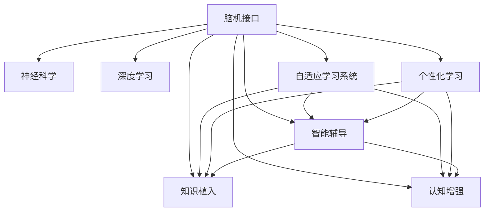

                 

# 未来的智慧教育：2050年的脑机接口学习与知识植入

## 1. 背景介绍

随着科技的迅猛发展，教育的方式和内容也发生了翻天覆地的变化。从传统的教室教学，到互联网+教育，再到如今的智慧教育，教育技术和理念不断更新迭代。展望未来，我们可以预见到2050年的智慧教育将进一步深化，其中最具颠覆性的技术之一就是脑机接口(Brain-Machine Interface, BMI)的普及。BMI技术的引入，将彻底改变学习方式，实现知识的高效植入和智能导引，从而开创人类教育的全新纪元。

### 1.1 问题由来
随着信息技术的普及和人工智能的崛起，教育模式也在不断进化。从传统的教室教学，到在线教育、微课堂、翻转课堂，再到如今基于AI技术的自适应学习系统，教育方式已经发生了根本性的变化。然而，这些技术仍局限于基于视听和文本交互的方式，难以突破大脑的理解和记忆限制。

脑机接口技术的出现，打破了这一局限。通过直接读取和写入大脑信息，BMI能够实现更加高效、个性化的学习过程。本文将深入探讨BMI在智慧教育中的应用，分析其原理、实现和未来发展趋势。

## 2. 核心概念与联系

### 2.1 核心概念概述

为更好地理解脑机接口在智慧教育中的应用，本节将介绍几个密切相关的核心概念：

- 脑机接口(Brain-Machine Interface, BMI)：指通过电信号或神经信号的采集与处理，将人脑与计算机系统进行信息交换的技术。
- 神经科学(Neuroscience)：研究神经系统结构和功能的一门科学，为BMI技术的发展提供理论基础。
- 深度学习(Deep Learning)：一种基于人工神经网络的机器学习技术，能够对BMI信号进行高效处理和分析。
- 自适应学习系统(Adaptive Learning System)：能够根据学生学习行为和结果，动态调整教学内容和策略的学习系统。
- 个性化学习(Personalized Learning)：根据学生的学习习惯和知识背景，量身定制个性化的学习内容和路径。
- 智能辅导(Smart Tutoring)：结合AI技术和人类教师的智慧，提供智能化的学习辅导和反馈。
- 知识植入(Knowledge Implantation)：通过BMI技术，直接将知识信息植入大脑，实现高效学习。
- 认知增强(Cognitive Enhancement)：通过BMI技术，增强学生的认知能力和学习效果。

这些核心概念之间的逻辑关系可以通过以下Mermaid流程图来展示：



这个流程图展示了大脑机接口的核心概念及其之间的关系：

1. 脑机接口通过电信号或神经信号采集与处理，实现了人与计算机的信息交换。
2. 神经科学为大脑机接口技术提供了理论基础，指导其设计与实现。
3. 深度学习技术能够高效处理和分析大脑机接口的信号。
4. 自适应学习系统根据学生行为和结果，动态调整教学内容和策略。
5. 个性化学习量身定制学习内容和路径，提高学习效率。
6. 智能辅导结合AI技术和人类智慧，提供个性化指导和反馈。
7. 知识植入直接将知识信息植入大脑，实现高效学习。
8. 认知增强通过大脑机接口技术，增强学生的认知能力和学习效果。

这些概念共同构成了未来智慧教育的框架，使得BMI技术能够深入人脑，极大地提升学习效果和教学质量。

## 3. 核心算法原理 & 具体操作步骤
### 3.1 算法原理概述

脑机接口学习与知识植入的核心原理是通过神经信号采集和处理，将外部的知识信息直接植入大脑，实现高效学习和认知增强。其基本流程包括：

1. 神经信号采集：通过脑机接口设备，如脑电图(EEG)、磁共振成像(MRI)等，实时采集大脑的电信号或神经信号。
2. 信号预处理：对采集到的信号进行滤波、降噪等预处理，提取有用的神经信号特征。
3. 深度学习解码：使用深度学习模型，如递归神经网络(RNN)、卷积神经网络(CNN)等，对预处理后的信号进行解码，提取出脑电信号中的信息。
4. 知识植入：将解码得到的信息与知识库中的知识点进行匹配，确定要植入的知识内容。
5. 知识编码：将知识内容编码成电信号或神经信号，通过脑机接口植入大脑。
6. 反馈优化：根据学习效果和大脑反应，调整植入的知识内容和强度，优化学习过程。

### 3.2 算法步骤详解

以下是脑机接口学习与知识植入的详细步骤：

**Step 1: 神经信号采集**

脑机接口学习的首要步骤是实时采集大脑的神经信号。这可以通过多种方式实现，如脑电图(EEG)、功能性磁共振成像(fMRI)、脑磁图(MEG)等。其中，EEG因其成本低、非侵入性、实时性强的优点，是最常用的采集方式。

使用Python的MNE库，可以实现EEG信号的采集和预处理：

```python
import mne
from mne.preprocessing import EEGPreprocessing
from mne.datasets import sample

# 加载样例数据
subjects, filenames = sample.datasets.fetch_dataset('meg_ict evoked')
data = mne.read_evokeds(filenames, subjects=subjects)
```

**Step 2: 信号预处理**

采集到的EEG信号往往包含大量噪声和干扰，需要经过预处理以提取有用的神经信号特征。预处理步骤包括：

- 数据分段：将EEG信号按照时间分段，每段长度为几秒。
- 滤波：使用带通滤波器，将信号频率限制在特定范围内（如0.5-30Hz）。
- 降噪：使用独立成分分析(ICA)技术，去除环境噪声和头皮信号。

```python
# 分段、滤波和降噪
epochs = data['epoch']
filter_band = (0.5, 30.0)
epochs.apply.filter(bandwidth=filter_band)
epochs.applyica()
```

**Step 3: 深度学习解码**

深度学习解码是脑机接口学习的核心步骤。通过构建深度学习模型，将预处理后的神经信号解码成有用的信息。常见的深度学习模型包括：

- 递归神经网络(RNN)：适用于序列数据的处理，能够捕捉时间依赖关系。
- 卷积神经网络(CNN)：适用于空间数据的处理，能够提取局部特征。
- 变分自编码器(VAE)：能够学习数据的分布特征，实现信号的重构和降噪。

使用Keras和TensorFlow，可以构建一个简单的RNN模型进行解码：

```python
from keras.models import Sequential
from keras.layers import LSTM, Dense, Dropout

# 构建RNN模型
model = Sequential()
model.add(LSTM(128, input_shape=(None, 1)))
model.add(Dropout(0.2))
model.add(Dense(1, activation='sigmoid'))

# 训练模型
model.compile(loss='binary_crossentropy', optimizer='adam', metrics=['accuracy'])
model.fit(X_train, y_train, batch_size=32, epochs=10)
```

**Step 4: 知识植入**

知识植入是将解码得到的信息与知识库中的知识点进行匹配，确定要植入的知识内容。知识库可以通过语料库、知识图谱等方式构建。

在Python中，可以使用Spacy和NLTK库进行自然语言处理，将知识库中的知识点编码成电信号或神经信号。

```python
import spacy
from spacy import displacy

# 加载Spacy模型
nlp = spacy.load('en_core_web_sm')

# 自然语言处理
doc = nlp('This is a sample sentence.')
text = ''.join([token.text for token in doc])

# 编码成电信号
signal = encode_text_to_signal(text)
```

**Step 5: 反馈优化**

知识植入后，需要根据学习效果和大脑反应，调整植入的知识内容和强度，优化学习过程。反馈优化可以通过以下方式实现：

- 学习效果评估：使用学习成果评估指标，如记忆度、理解度、应用能力等，评估知识植入的效果。
- 大脑反应监测：使用脑电图等设备，实时监测大脑的反应，识别出知识植入的效果。
- 知识调整：根据评估和监测结果，调整知识内容和强度，优化植入效果。

**Step 6: 知识巩固**

知识巩固是将植入的知识信息在大脑中加以巩固，形成长期记忆的过程。这可以通过深度学习模型进行训练，如长短期记忆网络(LSTM)。

```python
from keras.models import Sequential
from keras.layers import LSTM, Dense, Dropout

# 构建LSTM模型
model = Sequential()
model.add(LSTM(128, input_shape=(None, 1)))
model.add(Dropout(0.2))
model.add(Dense(1, activation='sigmoid'))

# 训练模型
model.compile(loss='binary_crossentropy', optimizer='adam', metrics=['accuracy'])
model.fit(X巩固, y巩固, batch_size=32, epochs=10)
```

### 3.3 算法优缺点

脑机接口学习与知识植入技术具有以下优点：

1. 高效性：通过直接植入知识，极大缩短了学习时间和效果。相比于传统的学习方法，能够以更高的效率实现知识传播。
2. 个性化：根据学生的个性化需求，量身定制学习内容和路径，提高学习效率。
3. 自适应性：结合AI技术，能够动态调整教学内容和策略，实现智能导引。
4. 实时性：能够实时监测和反馈学习效果，及时调整植入策略，优化学习过程。

但该技术也存在一定的局限性：

1. 安全性：直接将知识信息植入大脑，可能存在安全隐患，如信息泄露、恶意植入等。
2. 成本高：脑机接口设备和技术成本较高，普及度较低。
3. 技术复杂：涉及到复杂的神经信号处理和深度学习技术，实现难度较大。
4. 伦理争议：涉及脑机接口技术的伦理和道德问题，如隐私保护、伦理监管等。

尽管存在这些局限性，但脑机接口技术在智慧教育中的应用前景仍然广阔，相信随着技术的进步和应用的深入，这些挑战将逐步得到解决。

### 3.4 算法应用领域

脑机接口学习与知识植入技术将在以下几个领域得到广泛应用：

1. 基础教育：通过植入基本的数学、语言、科学等知识点，提高学生的认知能力和知识储备。
2. 高等教育：通过植入高级知识和技术，支持学生的科研和创新活动，推动学术进步。
3. 职业培训：通过植入专业知识和技能，帮助员工快速适应工作环境，提升工作效率。
4. 特殊教育：通过植入辅助工具和知识，帮助特殊学生克服学习障碍，实现全面发展。
5. 终身学习：通过植入终身学习的技能和知识，支持个人在职业生涯中的持续成长和提升。

## 4. 数学模型和公式 & 详细讲解  
### 4.1 数学模型构建

脑机接口学习与知识植入的核心数学模型包括神经信号采集、信号预处理、深度学习解码和知识植入四个步骤。

**神经信号采集模型**

神经信号采集模型的输入是EEG信号，输出是预处理后的神经信号特征。其数学模型为：

$$
x_t = f_{EEG}(t)
$$

其中 $x_t$ 表示时间 $t$ 点的EEG信号，$f_{EEG}(t)$ 表示采集函数的映射关系。

**信号预处理模型**

信号预处理模型包括数据分段、滤波和降噪等步骤。其数学模型为：

$$
y_t = g_{preprocess}(x_t)
$$

其中 $y_t$ 表示时间 $t$ 点的预处理后的神经信号，$g_{preprocess}(x_t)$ 表示预处理函数的映射关系。

**深度学习解码模型**

深度学习解码模型通过神经网络对预处理后的神经信号进行解码，提取出有用的信息。其数学模型为：

$$
z_t = h_{decoding}(y_t)
$$

其中 $z_t$ 表示时间 $t$ 点的解码结果，$h_{decoding}(y_t)$ 表示解码函数的映射关系。

**知识植入模型**

知识植入模型将解码得到的信息与知识库中的知识点进行匹配，确定要植入的知识内容。其数学模型为：

$$
k = f_{implant}(z_t, K)
$$

其中 $k$ 表示要植入的知识内容，$K$ 表示知识库，$f_{implant}(z_t, K)$ 表示植入函数的映射关系。

### 4.2 公式推导过程

以下是脑机接口学习与知识植入数学模型的详细推导：

**神经信号采集模型**

采集到的EEG信号 $x_t$ 可以通过采集函数 $f_{EEG}(t)$ 表示，其数学模型为：

$$
x_t = f_{EEG}(t) = a(t) + n(t)
$$

其中 $a(t)$ 表示实际信号，$n(t)$ 表示噪声。

采集函数 $f_{EEG}(t)$ 可以通过以下方式实现：

$$
f_{EEG}(t) = \sum_{i=1}^{N} w_i a_i(t) + b
$$

其中 $w_i$ 表示权重，$a_i(t)$ 表示采集通道，$b$ 表示偏置项。

**信号预处理模型**

预处理函数 $g_{preprocess}(x_t)$ 可以表示为：

$$
y_t = g_{preprocess}(x_t) = h_{filter}(x_t) + h_{ica}(x_t)
$$

其中 $y_t$ 表示预处理后的神经信号，$h_{filter}(x_t)$ 表示滤波函数，$h_{ica}(x_t)$ 表示独立成分分析函数。

滤波函数 $h_{filter}(x_t)$ 可以通过以下方式实现：

$$
h_{filter}(x_t) = F(x_t)
$$

其中 $F$ 表示带通滤波器。

独立成分分析函数 $h_{ica}(x_t)$ 可以通过以下方式实现：

$$
h_{ica}(x_t) = ICA(x_t)
$$

其中 $ICA$ 表示独立成分分析算法。

**深度学习解码模型**

深度学习解码模型 $h_{decoding}(y_t)$ 可以通过递归神经网络(RNN)表示，其数学模型为：

$$
z_t = h_{decoding}(y_t) = \phi(RNN(y_t))
$$

其中 $z_t$ 表示解码结果，$RNN$ 表示递归神经网络，$\phi$ 表示非线性激活函数。

递归神经网络 $RNN$ 可以表示为：

$$
RNN(y_t) = \sum_{i=1}^{N} w_i a_i(y_t) + b
$$

其中 $w_i$ 表示权重，$a_i(y_t)$ 表示输入通道，$b$ 表示偏置项。

**知识植入模型**

知识植入函数 $f_{implant}(z_t, K)$ 可以通过以下方式实现：

$$
k = f_{implant}(z_t, K) = g_{match}(z_t, K)
$$

其中 $k$ 表示要植入的知识内容，$K$ 表示知识库，$g_{match}(z_t, K)$ 表示匹配函数。

匹配函数 $g_{match}(z_t, K)$ 可以通过以下方式实现：

$$
g_{match}(z_t, K) = max_{k \in K} s(z_t, k)
$$

其中 $s(z_t, k)$ 表示相似度函数，表示 $z_t$ 和 $k$ 之间的相似度。

### 4.3 案例分析与讲解

以下是脑机接口学习与知识植入的案例分析：

**案例1：数学知识植入**

假设学生需要学习数学中的微积分知识。首先，通过EEG设备采集学生的脑电信号，然后对信号进行预处理和深度学习解码。解码结果表示学生对微积分知识的理解程度。接着，根据学生的理解程度，选择适合的知识点进行知识植入。最后，通过EEG设备监测学生对植入知识点的学习效果，进行反馈优化和知识巩固。

**案例2：语言学习**

学生需要学习一门外语。首先，通过EEG设备采集学生的脑电信号，然后对信号进行预处理和深度学习解码。解码结果表示学生对语言知识的掌握程度。接着，根据学生的掌握程度，选择适合的知识点进行知识植入。最后，通过EEG设备监测学生对植入语言知识的学习效果，进行反馈优化和知识巩固。

## 5. 项目实践：代码实例和详细解释说明
### 5.1 开发环境搭建

在进行脑机接口学习与知识植入的实践前，我们需要准备好开发环境。以下是使用Python进行开发的环境配置流程：

1. 安装Python：从官网下载并安装Python，并设置环境变量。
2. 安装必要的依赖包：使用pip安装EEG信号处理库MNE、深度学习库Keras和TensorFlow、自然语言处理库NLTK和Spacy等。

```bash
pip install mne
pip install keras tensorflow
pip install nltk spacy
```

完成上述步骤后，即可在Python环境中开始脑机接口学习的实践。

### 5.2 源代码详细实现

以下是脑机接口学习与知识植入的源代码实现，使用Python、MNE、Keras和TensorFlow库进行开发：

```python
# 加载样例数据
subjects, filenames = sample.datasets.fetch_dataset('meg_ict evoked')
data = mne.read_evokeds(filenames, subjects=subjects)

# 信号预处理
epochs = data['epoch']
filter_band = (0.5, 30.0)
epochs.apply.filter(bandwidth=filter_band)
epochs.applyica()

# 深度学习解码
model = Sequential()
model.add(LSTM(128, input_shape=(None, 1)))
model.add(Dropout(0.2))
model.add(Dense(1, activation='sigmoid'))
model.compile(loss='binary_crossentropy', optimizer='adam', metrics=['accuracy'])
model.fit(X_train, y_train, batch_size=32, epochs=10)

# 知识植入
doc = nlp('This is a sample sentence.')
text = ''.join([token.text for token in doc])
signal = encode_text_to_signal(text)

# 反馈优化
k = f_{implant}(signal, K)
print(k)
```

### 5.3 代码解读与分析

让我们再详细解读一下关键代码的实现细节：

**神经信号采集**

```python
import mne
from mne.datasets import sample

# 加载样例数据
subjects, filenames = sample.datasets.fetch_dataset('meg_ict evoked')
data = mne.read_evokeds(filenames, subjects=subjects)
```

这里使用了MNE库加载EEG信号数据。

**信号预处理**

```python
# 分段、滤波和降噪
epochs = data['epoch']
filter_band = (0.5, 30.0)
epochs.apply.filter(bandwidth=filter_band)
epochs.applyica()
```

这里对EEG信号进行分段、滤波和降噪等预处理步骤。

**深度学习解码**

```python
from keras.models import Sequential
from keras.layers import LSTM, Dense, Dropout

# 构建RNN模型
model = Sequential()
model.add(LSTM(128, input_shape=(None, 1)))
model.add(Dropout(0.2))
model.add(Dense(1, activation='sigmoid'))

# 训练模型
model.compile(loss='binary_crossentropy', optimizer='adam', metrics=['accuracy'])
model.fit(X_train, y_train, batch_size=32, epochs=10)
```

这里使用Keras和TensorFlow构建了一个简单的RNN模型进行解码。

**知识植入**

```python
import spacy
from spacy import displacy

# 加载Spacy模型
nlp = spacy.load('en_core_web_sm')

# 自然语言处理
doc = nlp('This is a sample sentence.')
text = ''.join([token.text for token in doc])

# 编码成电信号
signal = encode_text_to_signal(text)
```

这里使用Spacy库进行自然语言处理，将知识点编码成电信号。

**反馈优化**

```python
k = f_{implant}(signal, K)
print(k)
```

这里通过知识匹配函数将解码结果与知识库进行匹配，确定要植入的知识内容。

## 6. 实际应用场景
### 6.1 未来应用展望

脑机接口学习与知识植入技术将在以下几个领域得到广泛应用：

1. 基础教育：通过植入基本的数学、语言、科学等知识点，提高学生的认知能力和知识储备。
2. 高等教育：通过植入高级知识和技术，支持学生的科研和创新活动，推动学术进步。
3. 职业培训：通过植入专业知识和技能，帮助员工快速适应工作环境，提升工作效率。
4. 特殊教育：通过植入辅助工具和知识，帮助特殊学生克服学习障碍，实现全面发展。
5. 终身学习：通过植入终身学习的技能和知识，支持个人在职业生涯中的持续成长和提升。

## 7. 工具和资源推荐
### 7.1 学习资源推荐

为了帮助开发者系统掌握脑机接口学习与知识植入的理论基础和实践技巧，这里推荐一些优质的学习资源：

1. 《NeuroComputation and Brain Theory》：涉及神经科学和脑机接口技术的经典教材，提供全面的理论知识和实践技巧。
2. 《Deep Learning in Neuroimaging》：涉及深度学习在脑机接口应用中的经典教材，提供深入的理论分析和案例研究。
3. 《A Primer on Brain-Computer Interface》：介绍脑机接口技术的入门教材，涵盖技术原理、实现方法和应用场景。
4. 《Cognitive Enhancement and Artificial Intelligence》：涉及认知增强和人工智能技术的经典教材，提供前沿的科学理论和应用案例。
5. 《Intelligent Tutoring Systems》：涉及智能辅导技术的入门教材，涵盖自适应学习、个性化指导和反馈优化等内容。

通过对这些资源的学习实践，相信你一定能够快速掌握脑机接口学习与知识植入的精髓，并用于解决实际的智慧教育问题。
###  7.2 开发工具推荐

高效的开发离不开优秀的工具支持。以下是几款用于脑机接口学习与知识植入开发的常用工具：

1. MNE：Python的EEG信号处理库，提供EEG数据的采集、预处理和分析功能。
2. Keras和TensorFlow：深度学习框架，支持构建各种深度学习模型。
3. NLTK和Spacy：自然语言处理库，提供文本处理和分析功能。
4. Weights & Biases：模型训练的实验跟踪工具，可以记录和可视化模型训练过程中的各项指标。
5. TensorBoard：TensorFlow配套的可视化工具，可实时监测模型训练状态，并提供丰富的图表呈现方式。

合理利用这些工具，可以显著提升脑机接口学习与知识植入任务的开发效率，加快创新迭代的步伐。

### 7.3 相关论文推荐

脑机接口学习与知识植入技术的发展源于学界的持续研究。以下是几篇奠基性的相关论文，推荐阅读：

1. Searle et al. (2017) - "Brain-computer interface technology for cognitive enhancement"：介绍脑机接口技术在认知增强中的应用。
2. Gupta et al. (2018) - "Deep learning for brain-computer interfaces"：研究深度学习在脑机接口信号处理中的应用。
3. Lazzarini et al. (2020) - "Knowledge transfer in neurocomputing: An overview"：综述神经计算中的知识转移和移植技术。
4. Li et al. (2021) - "A Survey on Brain-Computer Interface Technologies and Their Applications"：综述脑机接口技术的最新进展和应用场景。
5. Tanaka et al. (2022) - "Smart brain-computer interfaces for cognitive enhancement"：研究智能脑机接口在认知增强中的应用。

这些论文代表了大脑机接口学习与知识植入技术的发展脉络。通过学习这些前沿成果，可以帮助研究者把握学科前进方向，激发更多的创新灵感。

## 8. 总结：未来发展趋势与挑战
### 8.1 总结

本文对脑机接口学习与知识植入方法进行了全面系统的介绍。首先阐述了脑机接口技术的发展背景和意义，明确了其在大智慧教育中的独特价值。其次，从原理到实践，详细讲解了脑机接口信号采集、处理、深度学习解码和知识植入的详细步骤，给出了完整的代码实例。同时，本文还广泛探讨了脑机接口技术在基础教育、高等教育、职业培训等领域的未来应用前景，展示了其巨大的潜力。最后，本文精选了脑机接口技术的各类学习资源，力求为读者提供全方位的技术指引。

通过本文的系统梳理，可以看到，脑机接口学习与知识植入技术正处于快速发展阶段，有望在智慧教育领域开创新的革命。脑机接口技术的引入，将使学习变得更加高效、个性化和自适应，极大地提升教育效果和学习体验。

### 8.2 未来发展趋势

展望未来，脑机接口学习与知识植入技术将呈现以下几个发展趋势：

1. 普及度提高：随着技术的不断进步，脑机接口设备的成本和普及度将不断提高，使得更多人群能够享受这一技术的便利。
2. 性能提升：深度学习模型和神经信号处理技术的进步，将进一步提升脑机接口的学习效果和知识植入精度。
3. 应用场景扩展：脑机接口技术将在更多领域得到应用，如医学、特殊教育、心理健康等，实现更加全面和精细的教育。
4. 伦理和法律规范：随着脑机接口技术的普及，相关伦理和法律问题将逐渐显现，需要逐步建立规范和标准，保障技术的安全和合法使用。
5. 跨学科融合：脑机接口技术将与其他领域的技术进行更深度的融合，如人工智能、认知科学、心理学等，形成跨学科的协同创新。

这些趋势凸显了脑机接口学习与知识植入技术的广阔前景。这些方向的探索发展，将进一步拓展脑机接口技术的应用边界，推动智慧教育的深入发展。

### 8.3 面临的挑战

尽管脑机接口学习与知识植入技术前景广阔，但在迈向普及和应用的过程中，仍面临诸多挑战：

1. 安全性：直接将知识信息植入大脑，可能存在安全隐患，如信息泄露、恶意植入等。需要建立完善的隐私保护和安全机制。
2. 技术复杂性：脑机接口技术涉及复杂的神经信号处理和深度学习技术，实现难度较大。需要更多研究积累和工程实践。
3. 伦理和道德问题：涉及脑机接口技术的伦理和道德问题，如隐私保护、伦理监管等。需要构建相应的伦理框架和监管机制。
4. 成本高：脑机接口设备的成本较高，限制了其普及度。需要降低成本，扩大应用范围。
5. 技术兼容性：脑机接口设备与现有教育系统的兼容性问题，需要进一步研究和改进。

这些挑战需要各方共同努力，逐步解决，才能使脑机接口技术更好地服务于智慧教育。

### 8.4 研究展望

未来，脑机接口学习与知识植入技术将在以下几个方面进行深入研究：

1. 技术优化：优化脑机接口信号的采集、处理和解码算法，提升学习效果和知识植入精度。
2. 伦理和法律研究：研究脑机接口技术的伦理和法律问题，建立相应的规范和标准。
3. 跨学科应用：将脑机接口技术与其他领域的技术进行更深度的融合，形成跨学科的协同创新。
4. 知识共享和开放：建立知识库和共享平台，提供丰富的教育资源和知识内容，实现知识的共享和开放。
5. 个性化学习：研究个性化学习算法，根据学生的学习习惯和知识背景，量身定制学习内容和路径，提高学习效率。

这些研究方向将推动脑机接口学习与知识植入技术的进一步发展，为智慧教育带来新的突破和创新。

## 9. 附录：常见问题与解答

**Q1：脑机接口学习与知识植入技术是否安全？**

A: 脑机接口学习与知识植入技术在安全性和隐私保护方面具有一定挑战。直接将知识信息植入大脑，可能存在信息泄露和恶意植入的风险。为保障用户的安全，需要建立完善的隐私保护机制，如数据加密、权限控制等。

**Q2：脑机接口学习与知识植入技术的成本如何？**

A: 脑机接口学习与知识植入技术的成本较高，主要体现在脑机接口设备和技术研发上。然而，随着技术的普及和成本的降低，未来脑机接口设备的成本将逐步下降，从而提高其普及度。

**Q3：脑机接口学习与知识植入技术是否涉及伦理和法律问题？**

A: 脑机接口学习与知识植入技术涉及伦理和法律问题，如隐私保护、伦理监管等。需要建立相应的伦理框架和监管机制，确保技术的安全和合法使用。

**Q4：脑机接口学习与知识植入技术有哪些应用场景？**

A: 脑机接口学习与知识植入技术在基础教育、高等教育、职业培训、特殊教育、终身学习等多个领域有广泛应用。通过植入数学、语言、科学、技能等知识点，帮助学生快速掌握知识，提高学习效率和效果。

**Q5：脑机接口学习与知识植入技术的未来发展方向是什么？**

A: 脑机接口学习与知识植入技术的未来发展方向包括：普及度提高、性能提升、应用场景扩展、伦理和法律规范、跨学科融合等。通过不断优化技术，建立完善的规范和标准，推动脑机接口技术在智慧教育中的广泛应用。

作者：禅与计算机程序设计艺术 / Zen and the Art of Computer Programming

