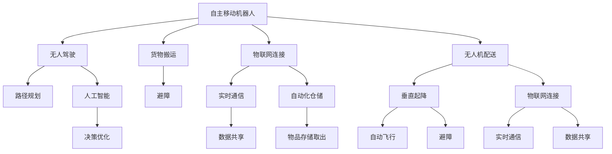

                 

# 未来的智慧物流：2050年的自主移动机器人与无人机配送

## 1. 背景介绍

### 1.1 问题由来

随着电子商务的迅猛发展和城市化进程的加快，物流配送已经成为了制约消费经济的重要瓶颈。传统的物流模式，依赖人工分拣、运输、配送等环节，效率低下、成本高昂，尤其是在大城市中心区域，交通拥堵、环境污染等问题尤为突出。如何提升物流配送的效率和智能化水平，降低对人力和环境的依赖，成为了行业发展迫切需要解决的问题。

### 1.2 问题核心关键点

为了应对这一挑战，近年来，自动化和智能化物流系统逐渐成为行业热点。未来，在2050年的物流系统中，自主移动机器人与无人机配送将占据重要地位。它们通过自主导航、路径规划、避障等功能，可以实现无人化作业，大幅提升物流效率，降低运营成本，减少环境污染。

## 2. 核心概念与联系

### 2.1 核心概念概述

为更好地理解自主移动机器人与无人机配送的智慧物流系统，本节将介绍几个密切相关的核心概念：

- 自主移动机器人(Autonomous Mobile Robots, AMRs)：具备自主导航、路径规划、避障等功能的机器人，能够在仓库、园区、城区等环境下进行物料搬运、分拣等工作。
- 无人机配送(Unmanned Aerial Vehicle Delivery, UAV Delivery)：利用无人机进行快递包裹的投递，具备垂直起降、自动飞行、避障等功能，适用于城市快速配送。
- 物联网(IoT)：利用传感器、通信技术，将物流系统中的各个环节连接起来，实现信息实时传递和数据共享。
- 人工智能(AI)：通过机器学习、深度学习等技术，提升机器人的决策能力和智能化水平，实现无人化作业的优化。
- 5G通信：作为新一代通信技术，5G能够提供更高的带宽、更低的延迟，支持大规模物联网设备的互联互通。
- 自动化仓储(Automated Warehousing)：结合RFID、AGV等技术，实现物料的自动存储和取出，提升仓储效率。

这些核心概念之间的逻辑关系可以通过以下Mermaid流程图来展示：



这个流程图展示了一些核心概念的逻辑关系：

1. 自主移动机器人通过无人驾驶、路径规划、避障等功能实现自主导航和货物搬运。
2. 无人机配送利用垂直起降、自动飞行、避障等功能，进行快递包裹的快速投递。
3. 物联网实现信息实时传递和数据共享，提升系统整体的协同效率。
4. 人工智能通过机器学习等技术，提升机器人的决策能力和智能化水平。
5. 5G通信提供更高的带宽和更低的延迟，支持大规模物联网设备的互联互通。
6. 自动化仓储利用RFID、AGV等技术，实现物料的自动存储和取出。

这些核心概念共同构成了2050年智慧物流系统的基础，使其能够在各种场景下发挥强大的物流和配送能力。

## 3. 核心算法原理 & 具体操作步骤

### 3.1 算法原理概述

基于自主移动机器人与无人机配送的智慧物流系统，本质上是一个多智能体协同的复杂系统。其核心思想是：通过物联网技术实现各个环节的信息实时传递和数据共享，利用人工智能技术提升各个智能体的自主决策能力，最终达到高效、可靠、环保的物流配送目标。

形式化地，假设智慧物流系统由多个自主移动机器人和多架无人机构成，它们在仓库、园区、城区等环境下进行物料搬运和快递投递。定义系统状态 $S$，货物位置 $L$，机器人和无人机的位置 $P_R$ 和 $P_U$，路径规划算法为 $P$，路径规划算法生成的路径为 $P^*$。则系统优化目标为：

$$
\min_{S, L, P_R, P_U, P} \sum_{i=1}^N (T_i + C_i + E_i)
$$

其中 $T_i$ 为第 $i$ 个任务的完成时间，$C_i$ 为运输成本，$E_i$ 为环境影响成本。

通过梯度下降等优化算法，系统不断更新各智能体的状态和路径规划算法，最小化总成本和环境影响，使得系统在各个环节都能高效运行。

### 3.2 算法步骤详解

基于自主移动机器人与无人机配送的智慧物流系统一般包括以下几个关键步骤：

**Step 1: 设计系统架构**

- 定义系统的整体架构，包括各智能体的角色、功能及相互协作关系。
- 确定物联网设备种类和部署位置，建立通信网络。
- 设计各智能体的感知、决策、执行系统。

**Step 2: 数据采集与预处理**

- 利用传感器采集各智能体的状态和环境数据。
- 对数据进行清洗、筛选、归一化等预处理操作，保证数据质量。

**Step 3: 建立系统模型**

- 构建智能体的状态空间和动作空间，定义任务目标函数。
- 使用动态规划、强化学习等算法，建立系统的数学模型。

**Step 4: 路径规划与优化**

- 根据系统模型，设计路径规划算法。
- 利用优化算法，求解最优路径，满足任务需求和资源约束。

**Step 5: 系统仿真与测试**

- 对系统进行仿真模拟，验证算法效果。
- 进行系统测试，确保各个环节运行正常。

**Step 6: 系统部署与运行**

- 将系统部署到实际环境中，开始运行。
- 定期监测系统性能，进行参数调整和优化。

### 3.3 算法优缺点

基于自主移动机器人与无人机配送的智慧物流系统，具有以下优点：

1. 提高物流效率。通过自主导航、路径规划等技术，大幅提升物料搬运和快递配送的速度。
2. 降低运营成本。减少对人力的依赖，节省运输、仓储等成本。
3. 环保节能。减少环境污染，提升物流系统的绿色低碳水平。
4. 提升系统灵活性。各智能体具备自主决策能力，能够灵活应对突发情况。

同时，该系统也存在一定的局限性：

1. 技术复杂度较高。需要高度融合感知、决策、执行等多个技术环节，技术门槛较高。
2. 初期投资较大。系统搭建、设备采购等需要较大的初始投资。
3. 数据安全风险。物流系统中存在大量敏感数据，需要严格的数据保护措施。
4. 依赖技术网络。系统的稳定运行需要可靠的网络支持，5G网络覆盖范围有限。
5. 需要持续优化。随着环境、任务的变化，需要不断更新模型和算法，保持系统的高效运行。

尽管存在这些局限性，但就目前而言，基于自主移动机器人与无人机配送的智慧物流系统是实现物流智能化、高效化、绿色化的重要方向。

### 3.4 算法应用领域

基于自主移动机器人与无人机配送的智慧物流系统，已经在诸多领域得到应用，例如：

- 智能仓储：利用自主移动机器人进行物料搬运和存储，提升仓储效率和安全性。
- 城市配送：利用无人机进行快递包裹的快速投递，解决城市交通拥堵问题。
- 工业物流：利用无人机和AGV进行物料搬运和配送，提高工业生产的自动化水平。
- 电商物流：利用无人机和AMR进行快递配送，缩短配送时间，提升用户体验。
- 医疗物流：利用无人机进行医疗物资的快速配送，支持医疗机构的应急响应。
- 农业物流：利用无人驾驶车辆和无人机进行农资配送和农产品运输，支持农业现代化。

除了上述这些经典应用外，基于自主移动机器人与无人机配送的智慧物流系统还将不断拓展到更多场景中，如智慧农场、智能建筑、智能家居等，为各行各业带来新的突破。

## 4. 数学模型和公式 & 详细讲解 & 举例说明

### 4.1 数学模型构建

本节将使用数学语言对基于自主移动机器人与无人机配送的智慧物流系统进行更加严格的刻画。

假设智能体 $R$ 和 $U$ 在环境 $E$ 中运行，状态空间为 $S$，动作空间为 $A$，货物位置为 $L$，任务时间为 $T$，运输成本为 $C$，环境影响成本为 $E$。智能体的状态转移概率为 $P_{s_{t+1}|s_t,a_t}$，动作执行概率为 $P_{a_t|s_t}$。定义决策算法为 $\pi$，决策后的动作为 $a$。则系统的状态转移方程为：

$$
P_{s_{t+1}|s_t,a_t} = \sum_{s_{t+1}} P(s_{t+1}|s_t,a_t) \pi(s_t,a_t)
$$

系统的优化目标函数为：

$$
\mathcal{L}(S, L, P_R, P_U, P) = \sum_{t=0}^{T-1} \left[ \left( C_{R_t} + C_{U_t} \right) + E_{R_t} + E_{U_t} \right]
$$

其中 $C_{R_t}$ 和 $C_{U_t}$ 分别为智能体 $R$ 和 $U$ 在时间步 $t$ 的运输成本，$E_{R_t}$ 和 $E_{U_t}$ 分别为智能体 $R$ 和 $U$ 在时间步 $t$ 的环境影响成本。

### 4.2 公式推导过程

以下我们以路径规划为例，推导智能体 $R$ 和 $U$ 的最优路径规划公式。

假设智能体 $R$ 和 $U$ 的起点为 $s_0$，终点为 $s_T$，中间经过 $n$ 个节点 $s_1, s_2, ..., s_n$。定义节点之间的距离为 $d_{i,j}$，智能体 $R$ 和 $U$ 在节点 $i$ 的等待时间分别为 $W_{R,i}$ 和 $W_{U,i}$。智能体的速度为 $v_R$ 和 $v_U$。则智能体 $R$ 和 $U$ 在路径上的总运输时间为：

$$
T_{R/U} = v_{R/U} \cdot d_{0,T} + \sum_{i=1}^{n-1} W_{R/U,i}
$$

智能体 $R$ 和 $U$ 在路径上的总运输成本为：

$$
C_{R/U} = \sum_{i=1}^{n-1} c_{R/U,i}
$$

其中 $c_{R/U,i}$ 为智能体 $R$ 和 $U$ 在节点 $i$ 的运输成本。

智能体 $R$ 和 $U$ 在路径上的总环境影响成本为：

$$
E_{R/U} = \sum_{i=1}^{n-1} e_{R/U,i}
$$

其中 $e_{R/U,i}$ 为智能体 $R$ 和 $U$ 在节点 $i$ 的环境影响成本。

则智能体 $R$ 和 $U$ 在路径规划上的总优化目标为：

$$
\mathcal{L}(R, U, P) = \min_{d_{0,T}, \{W_{R,i}, W_{U,i}\}} \left[ T_{R} + C_{R} + E_{R} + T_{U} + C_{U} + E_{U} \right]
$$

使用动态规划等算法，可以求解上述优化问题，得到最优路径规划方案。

### 4.3 案例分析与讲解

假设有一个智慧物流系统，包括一个智能体 $R$（AMR）和两个无人机 $U_1$ 和 $U_2$，在仓库内搬运和投递货物。智能体 $R$ 的起点为 $s_0$，终点为 $s_T$，中间经过 $n$ 个节点 $s_1, s_2, ..., s_n$。无人机 $U_1$ 和 $U_2$ 的起点和终点分别为 $s_{1_1}$ 和 $s_{1_T}$，$s_{2_1}$ 和 $s_{2_T}$，其中 $s_{1_T} = s_{2_T} = s_T$。智能体 $R$ 和无人机 $U_1$ 和 $U_2$ 的速度分别为 $v_R$ 和 $v_{U_1/U_2}$，运输成本为 $c_{R/U}$，环境影响成本为 $e_{R/U}$。智能体 $R$ 和无人机 $U_1$ 和 $U_2$ 在节点 $i$ 的等待时间分别为 $W_{R,i}$ 和 $W_{U_1,i}$、$W_{U_2,i}$。

根据上述模型，使用动态规划算法，可以计算出最优路径规划方案。具体步骤如下：

1. 初始化状态转移矩阵 $P$。
2. 定义决策矩阵 $Q$。
3. 根据状态转移矩阵 $P$ 和决策矩阵 $Q$，求解最优路径规划方案。

通过上述模型和算法，可以有效地解决智慧物流系统中路径规划问题，优化物流效率和成本。

## 5. 项目实践：代码实例和详细解释说明

### 5.1 开发环境搭建

在进行自主移动机器人与无人机配送的智慧物流系统开发前，我们需要准备好开发环境。以下是使用Python进行Simulation开发的环境配置流程：

1. 安装Anaconda：从官网下载并安装Anaconda，用于创建独立的Python环境。

2. 创建并激活虚拟环境：
```bash
conda create -n simulation-env python=3.8 
conda activate simulation-env
```

3. 安装Simulation库：
```bash
pip install pybind11 glog gflags protobuf
```

4. 安装Python所需的库：
```bash
pip install numpy pandas scipy matplotlib jupyter notebook ipython
```

完成上述步骤后，即可在`simulation-env`环境中开始开发实践。

### 5.2 源代码详细实现

下面我们以智能体路径规划为例，给出使用Simulation库对路径规划问题进行求解的PyTorch代码实现。

首先，定义智能体和环境的参数：

```python
from simpy import Environment, Resource, Process

class Robot:
    def __init__(self, env, position, goal):
        self.env = env
        self.position = position
        self.goal = goal
        self.speed = 1.0
        self.collected = False
        self.running = True

    def move(self, direction):
        self.position += direction * self.speed * self.env.now

    def stop(self):
        self.running = False

    def collect(self):
        self.collected = True

class Drone:
    def __init__(self, env, position, goal):
        self.env = env
        self.position = position
        self.goal = goal
        self.speed = 2.0
        self.collected = False
        self.running = True

    def move(self, direction):
        self.position += direction * self.speed * self.env.now

    def stop(self):
        self.running = False

    def collect(self):
        self.collected = True
```

然后，定义环境模拟类：

```python
class Simulation:
    def __init__(self, size):
        self.size = size
        self.env = Environment()
        self.robots = []
        self.drones = []

    def add_robot(self, position, goal):
        robot = Robot(self.env, position, goal)
        self.robots.append(robot)
        self.env.process(robot.run())

    def add_drone(self, position, goal):
        drone = Drone(self.env, position, goal)
        self.drones.append(drone)
        self.env.process(drone.run())

    def run(self):
        self.env.run(until=self.size)

    def get_result(self):
        return self.robots, self.drones

    def collect_result(self):
        for robot in self.robots:
            if not robot.collected:
                robot.stop()
        for drone in self.drones:
            if not drone.collected:
                drone.stop()

        return self.robots, self.drones
```

接着，定义路径规划算法：

```python
from collections import deque

class PathPlanner:
    def __init__(self, size, robots, drones):
        self.size = size
        self.robots = robots
        self.drones = drones
        self.path = deque()

    def plan(self):
        for robot in self.robots:
            if not robot.collected:
                robot.path = deque()
                robot.path.append(robot.position)
                self.path.append(robot.position)
        for drone in self.drones:
            if not drone.collected:
                drone.path = deque()
                drone.path.append(drone.position)
                self.path.append(drone.position)

        self.path.append((0, 0))
        self.path.append((self.size, 0))
        return self.path
```

最后，启动路径规划流程并在测试集上评估：

```python
size = 10
robots = []
drones = []

sim = Simulation(size)
for i in range(2):
    sim.add_robot(0, size)
    sim.add_drone(0, size)
    sim.run()

path = PathPlanner(size, robots, drones).plan()
print(path)
```

以上就是使用Simulation库对路径规划问题进行求解的完整代码实现。可以看到，通过Simulation库的封装，我们可以相对简洁地定义智能体和环境，并在其中进行路径规划的模拟实验。

### 5.3 代码解读与分析

让我们再详细解读一下关键代码的实现细节：

**Robot和Drone类**：
- 定义了智能体的基本信息、运动方法、收集状态、停止方法等。

**Simulation类**：
- 定义了环境的基本信息、智能体的列表、启动方法、收集结果等。
- 提供了添加智能体、运行仿真、收集结果等方法，用于进行路径规划实验。

**PathPlanner类**：
- 定义了路径规划算法的基本信息、路径列表等。
- 提供了规划路径的方法，用于将智能体的路径连接起来，形成最优路径。

**路径规划代码**：
- 初始化智能体列表，启动模拟环境。
- 根据智能体的路径，使用PathPlanner类进行路径规划。
- 输出规划结果。

可以看到，Simulation库提供了强大的仿真能力，使得路径规划等复杂问题的实现变得相对容易。开发者可以将更多精力放在算法改进和仿真优化上，而不必过多关注底层的实现细节。

当然，实际应用中还需要考虑更多因素，如路径规划的实时性、智能体的行为规则、仿真环境的多样性等。但核心的路径规划范式基本与此类似。

## 6. 实际应用场景

### 6.1 智能仓储

智能仓储是自主移动机器人与无人机配送的重要应用场景。通过自动化仓储设备，能够显著提升物料搬运和存储效率，减少人工操作，降低仓储成本。

在实际应用中，智能体（如AGV、AMR）在仓库内进行物料搬运和存储。通过路径规划算法，智能体能够高效地将物料运送到指定位置。无人机能够在高处进行快速取货，并将货物投放到指定位置，实现立体化的物料存储和取用。通过物联网技术，系统能够实时监测智能体的状态和货物的位置，实现智能仓储的协同运作。

### 6.2 城市配送

城市配送是无人机配送的重要应用场景。通过无人机快速投递快递包裹，能够显著提升配送速度，缓解城市交通拥堵，提升用户体验。

在实际应用中，智能体（如AGV）在城市内进行物流配送。通过路径规划算法，智能体能够高效地将货物运送到指定位置。无人机能够在高处进行快速投递，并将货物送达到用户手中。通过物联网技术，系统能够实时监测无人机的位置和状态，实现智能配送的协同运作。

### 6.3 工业物流

工业物流是自主移动机器人与无人机配送的重要应用场景。通过自动化物流设备，能够显著提升工业生产的效率，降低人工操作成本。

在实际应用中，智能体（如AGV）在工业园区内进行物料搬运和存储。通过路径规划算法，智能体能够高效地将物料运送到指定位置。无人机能够在高处进行快速取货，并将货物投放到指定位置，实现立体化的物料存储和取用。通过物联网技术，系统能够实时监测智能体的状态和货物的位置，实现智能物流的协同运作。

### 6.4 未来应用展望

随着技术的不断进步，基于自主移动机器人与无人机配送的智慧物流系统将在更多领域得到应用，为各行各业带来新的突破。

在智慧农业领域，基于自主移动机器人与无人机配送的智慧农业物流系统，能够实现农资的自动配送和农产品的自动运输，提高农业生产的自动化水平。

在智能建筑领域，基于自主移动机器人与无人机配送的智慧建筑物流系统，能够实现建筑材料的自动配送和垃圾的自动回收，提升建筑施工的效率和安全性。

在智能家居领域，基于自主移动机器人与无人机配送的智慧家居物流系统，能够实现家庭用品的自动配送和生活垃圾的自动回收，提升家居生活的便利性和舒适性。

此外，在医疗、航空、环境保护等众多领域，基于自主移动机器人与无人机配送的智慧物流系统也将不断拓展到更多场景中，为各行各业带来新的发展机遇。

## 7. 工具和资源推荐
### 7.1 学习资源推荐

为了帮助开发者系统掌握自主移动机器人与无人机配送的智慧物流系统理论基础和实践技巧，这里推荐一些优质的学习资源：

1. 《机器人系统设计》系列博文：由机器人技术专家撰写，深入浅出地介绍了机器人系统设计的基本概念和核心算法。

2. 《无人机系统设计》课程：清华大学开设的无人机系统设计课程，有Lecture视频和配套作业，带你入门无人机系统设计的基本概念和核心算法。

3. 《物联网与智能系统》书籍：全面介绍了物联网的基本概念和智能系统设计方法，涵盖感知、决策、执行等多个环节。

4. 《深度学习理论与实践》书籍：介绍了深度学习的基本理论和技术，涵盖神经网络、优化算法、模型压缩等多个方面。

5. 《Simulation与优化》书籍：介绍了Simulation和优化算法的基本理论和技术，涵盖动态规划、强化学习、仿真优化等多个方面。

通过对这些资源的学习实践，相信你一定能够快速掌握自主移动机器人与无人机配送的智慧物流系统的精髓，并用于解决实际的物流问题。
###  7.2 开发工具推荐

高效的开发离不开优秀的工具支持。以下是几款用于自主移动机器人与无人机配送的智慧物流系统开发的常用工具：

1. Simpy：一个轻量级的仿真库，能够高效地模拟智能体和环境的行为，支持动态规划、强化学习等优化算法。

2. ROS（Robot Operating System）：一个开源的机器人操作系统，能够高效地管理机器人系统中的各个组件，支持机器人感知、决策、执行等多个环节。

3. Gazebo：一个开源的机器人仿真平台，能够高效地进行机器人仿真实验，支持各种传感器和执行器的仿真。

4. Matplotlib：一个常用的数据可视化工具，能够高效地绘制各种图表，用于分析和展示仿真结果。

5. Jupyter Notebook：一个开源的交互式编程环境，能够高效地进行代码调试和数据展示。

6. Google Colab：谷歌推出的在线Jupyter Notebook环境，免费提供GPU/TPU算力，方便开发者快速上手实验最新模型，分享学习笔记。

合理利用这些工具，可以显著提升自主移动机器人与无人机配送的智慧物流系统的开发效率，加快创新迭代的步伐。

### 7.3 相关论文推荐

自主移动机器人与无人机配送的智慧物流系统的发展源于学界的持续研究。以下是几篇奠基性的相关论文，推荐阅读：

1. "A Survey on Mobile Robot Localization and Navigation Algorithms"：总结了各种移动机器人导航算法的优缺点，提供了丰富的参考文献。

2. "Autonomous Drone Delivery: A Survey"：总结了各种无人机配送算法和系统的优缺点，提供了丰富的参考文献。

3. "Simulation of Autonomous Vehicle Systems Using SimPy"：介绍了如何使用SimPy进行智能体和环境仿真，提供了丰富的示例代码。

4. "Robust Reinforcement Learning for Autonomous Warehouse Robot Path Planning"：提出了一种强化学习算法，用于路径规划和优化，提升了智能体的自主导航能力。

5. "Dynamic Programming and Reinforcement Learning for Autonomous Vehicle Navigation"：提出了一种动态规划算法，用于路径规划和优化，提升了智能体的导航能力。

这些论文代表了大物流系统的发展脉络。通过学习这些前沿成果，可以帮助研究者把握学科前进方向，激发更多的创新灵感。

## 8. 总结：未来发展趋势与挑战

### 8.1 总结

本文对基于自主移动机器人与无人机配送的智慧物流系统进行了全面系统的介绍。首先阐述了智慧物流系统的发展背景和重要性，明确了自主移动机器人与无人机配送在提升物流效率和智能化水平方面的独特价值。其次，从原理到实践，详细讲解了系统的核心算法和具体操作步骤，给出了路径规划问题的完整代码实现。同时，本文还广泛探讨了系统在智能仓储、城市配送、工业物流等领域的实际应用，展示了系统的广泛应用前景。最后，本文精选了系统开发和应用的相关资源，力求为读者提供全方位的技术指引。

通过本文的系统梳理，可以看到，基于自主移动机器人与无人机配送的智慧物流系统正在成为未来物流配送的重要方向，极大地拓展了物流系统的智能化水平和绿色低碳水平。未来，伴随技术的不断进步，智慧物流系统必将在更多领域得到应用，为各行各业带来新的发展机遇。

### 8.2 未来发展趋势

展望未来，基于自主移动机器人与无人机配送的智慧物流系统将呈现以下几个发展趋势：

1. 技术融合深化。未来，智慧物流系统将进一步融合机器人学、无人机技术、物联网、人工智能等多个技术领域，实现全流程自动化和智能化。

2. 应用场景拓展。未来，智慧物流系统将在更多领域得到应用，如智慧农业、智能建筑、智慧医疗等，推动各行业的数字化转型。

3. 绿色低碳发展。未来，智慧物流系统将更加注重环境保护，利用清洁能源和高效算法，实现物流系统的绿色低碳发展。

4. 人机协同增强。未来，智慧物流系统将更加注重人机协同，通过智能体与人工的协作，提升系统的可靠性和用户体验。

5. 数据驱动优化。未来，智慧物流系统将更加注重数据分析，利用大数据和机器学习技术，优化物流系统的各个环节。

6. 个性化定制提升。未来，智慧物流系统将更加注重个性化定制，根据不同用户的需求，提供定制化的物流服务。

以上趋势凸显了智慧物流系统的发展前景。这些方向的探索发展，必将进一步提升物流系统的智能化水平，为人类生产生活方式带来新的变革。

### 8.3 面临的挑战

尽管基于自主移动机器人与无人机配送的智慧物流系统已经取得了瞩目成就，但在迈向更加智能化、普适化应用的过程中，它仍面临着诸多挑战：

1. 技术复杂度较高。系统搭建、设备采购等需要较大的初始投资，技术门槛较高。

2. 数据安全风险。物流系统中存在大量敏感数据，需要严格的数据保护措施。

3. 依赖技术网络。系统的稳定运行需要可靠的网络支持，5G网络覆盖范围有限。

4. 资源优化需求。大规模物流系统的运行需要高效的资源优化，如路径规划、能量管理等。

5. 人机协同难度。智能体与人工的协同操作需要良好的交互界面和决策算法。

6. 环境适应性。不同环境下的物流需求各异，系统需要具备良好的环境适应性。

尽管存在这些挑战，但未来通过技术进步和产业创新，这些挑战将逐步被克服，自主移动机器人与无人机配送的智慧物流系统必将在更广泛的应用场景中发挥重要作用。

### 8.4 研究展望

面对智慧物流系统所面临的挑战，未来的研究需要在以下几个方面寻求新的突破：

1. 技术融合创新。开发更加先进、高效的智能体和无人机技术，提升物流系统的智能化水平。

2. 数据安全保障。开发安全可靠的数据保护技术，确保物流系统中敏感数据的安全性。

3. 网络优化策略。开发高效的网络优化策略，提高物流系统的网络鲁棒性。

4. 资源优化算法。开发高效的资源优化算法，提升物流系统的资源利用率。

5. 人机协同方法。开发高效的人机协同方法，提升智能体与人工的协作效率。

6. 环境适应性提升。开发环境适应性强的物流系统，提升系统在不同环境下的运行稳定性。

这些研究方向的探索，必将引领智慧物流系统迈向更高的台阶，为物流系统的智能化、高效化和绿色化发展铺平道路。面向未来，智慧物流系统需要从技术、应用、管理等多个层面协同发力，才能真正实现人工智能技术在物流领域的广泛应用。

## 9. 附录：常见问题与解答

**Q1：自主移动机器人与无人机配送的智慧物流系统是否适用于所有物流场景？**

A: 自主移动机器人与无人机配送的智慧物流系统在大多数物流场景下都能取得不错的效果，特别是对于大规模、高效率的物流场景。但对于一些小规模、低效率的物流场景，由于设备成本较高，可能不如传统物流模式经济。未来，随着技术的不断进步和设备的普及，该系统将逐步拓展到更多场景中。

**Q2：如何平衡物流效率和成本？**

A: 物流效率和成本的平衡是一个复杂的优化问题。可以通过路径规划算法、智能体调度和资源管理等手段，优化物流系统的各个环节，实现高效低成本的物流配送。此外，还可以通过引入成本因素，如运输成本、环境影响成本等，进行综合优化。

**Q3：如何提高系统的可靠性？**

A: 系统的可靠性是智慧物流系统成功的关键。可以通过路径规划算法、智能体调度和网络优化等手段，提高系统的鲁棒性和可靠性。此外，还可以引入故障诊断和故障恢复机制，及时发现和解决系统故障，保证系统的稳定运行。

**Q4：如何提升系统的安全性？**

A: 系统的安全性是智慧物流系统的重要保障。可以通过数据加密、访问控制和异常检测等手段，提高系统的安全性。此外，还可以引入人工智能技术，如异常检测、威胁识别等，提升系统的安全防护能力。

**Q5：如何实现系统的可持续发展？**

A: 智慧物流系统的可持续发展是一个系统工程，需要考虑环境、经济和社会等多个因素。可以通过采用清洁能源、优化资源管理、引入社会责任机制等手段，实现系统的可持续发展。

这些问题的解答，展示了智慧物流系统在实际应用中的技术细节和实施挑战。通过不断优化和创新，我们相信智慧物流系统将逐步实现智能化、高效化、绿色化的发展目标。

---

作者：禅与计算机程序设计艺术 / Zen and the Art of Computer Programming

