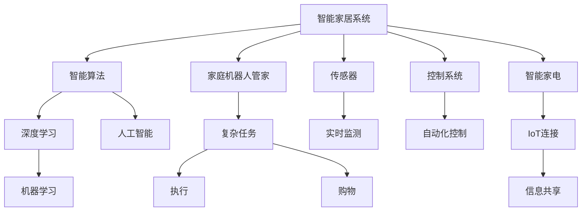

                 

# 未来的智能家居：2050年的家庭机器人管家与智能家电

随着人工智能技术的发展，未来的智能家居将不再局限于传统的家电控制和场景优化，而将成为一个高度集成的智能系统，家庭机器人管家和智能家电将共同协作，为家庭生活带来前所未有的便捷和舒适。本文将从技术原理、操作步骤、应用领域等多个方面，全面探讨2050年智能家居的未来发展方向。

## 1. 背景介绍

### 1.1 问题由来
随着人们生活水平的提高，对家庭生活环境的要求也逐渐升高，传统的家电控制方式已经难以满足现代人对家庭管理的需求。智能家居技术应运而生，通过集成传感器、控制系统和智能算法，使得家庭生活变得更加智能化和高效。

智能家居的核心在于自动化和智能化，即通过自动化控制系统实现家电的智能控制，通过智能化算法提升家居生活的质量。传统的智能家居系统往往依赖于中心控制器，存在布线复杂、维护成本高等问题。而随着人工智能技术的发展，未来的智能家居系统将具备更高的灵活性、可扩展性和自学习能力。

### 1.2 问题核心关键点
智能家居系统未来的发展关键在于以下几个方面：

1. 自动化：通过传感器、摄像头等设备实时监测家居环境，根据用户行为和习惯自动调整家电设置，提升生活舒适度。
2. 智能化：通过人工智能算法，实现对用户行为模式、情绪状态等信息的分析，从而提供个性化的家居服务。
3. 系统集成：实现不同设备和系统的无缝连接和协同工作，提升家居系统的整体效能。
4. 安全和隐私：确保家居系统的安全性，保护用户的隐私信息。

### 1.3 问题研究意义
未来智能家居的研究，旨在通过技术创新，提升家居生活的质量和便利性，为人们提供更加舒适、智能的生活环境。智能家居系统的应用不仅能够提升家庭管理效率，还能降低能耗、提高生活质量，推动社会可持续发展。

## 2. 核心概念与联系

### 2.1 核心概念概述

为更好地理解2050年智能家居的未来发展，本节将介绍几个密切相关的核心概念：

- 智能家居系统：由传感器、控制系统、智能算法等组成的智能家庭管理系统，能够实现对家居环境的自动控制和智能化管理。
- 家庭机器人管家：基于人工智能技术构建的家庭服务机器人，能够执行复杂的家庭任务，如打扫、照看老人和小孩、购物等。
- 智能家电：集成物联网、人工智能等技术，具备自适应、自学习能力的家电设备，如智能冰箱、智能电视等。
- 物联网(IoT)：通过互联网将各种家电、传感器等设备连接起来，实现设备间的互操作和信息共享。
- 人工智能(Al)：通过机器学习、深度学习等技术，实现对家居环境的智能化分析和决策，提升家居系统的性能。

这些核心概念之间的逻辑关系可以通过以下Mermaid流程图来展示：



这个流程图展示了他的核心概念及其之间的关系：

1. 智能家居系统通过传感器、控制系统、智能算法等组件实现对家居环境的自动控制和智能化管理。
2. 家庭机器人管家通过执行复杂的家庭任务，提升家庭管理效率。
3. 智能家电具备自适应、自学习能力，实现设备间的互操作和信息共享。
4. 物联网通过互联网连接各种设备，实现设备间的互操作和信息共享。
5. 人工智能通过机器学习、深度学习等技术，实现对家居环境的智能化分析和决策。

这些概念共同构成了未来智能家居的智能化和自动化管理框架，使得家居系统具备更高的灵活性和自适应能力。通过理解这些核心概念，我们可以更好地把握智能家居的未来发展方向。

## 3. 核心算法原理 & 具体操作步骤
### 3.1 算法原理概述

2050年的智能家居系统，将基于深度学习等先进人工智能算法，实现对家居环境的智能化分析和决策。其核心算法原理包括以下几个方面：

- 传感器数据融合：通过多种传感器（如温度传感器、湿度传感器、声音传感器等）采集家庭环境数据，并利用融合算法将这些数据整合，实现对家居环境的全面监测。
- 用户行为分析：通过机器学习算法，对家庭成员的行为模式进行分析，识别出用户的喜好和习惯，从而提供个性化的家居服务。
- 自然语言处理(NLP)：通过NLP技术，使得家庭机器人管家能够理解用户的自然语言指令，执行复杂的家庭任务。
- 深度强化学习(DRL)：利用DRL技术，实现家庭机器人管家的自学习和智能决策，提升任务执行的效率和准确性。
- 推荐系统：通过推荐算法，根据用户的历史行为和偏好，推荐合适的家居服务和产品。

### 3.2 算法步骤详解

基于深度学习的智能家居系统，通常包括以下几个关键步骤：

**Step 1: 准备数据和模型**
- 收集家庭环境数据、用户行为数据、设备状态数据等，作为训练数据。
- 选择合适的深度学习模型，如卷积神经网络(CNN)、循环神经网络(RNN)、Transformer等，作为初始化参数。

**Step 2: 数据预处理**
- 对采集到的传感器数据进行去噪、归一化等预处理，确保数据质量。
- 对用户行为数据进行分词、编码等处理，将其转化为模型可接受的格式。

**Step 3: 模型训练**
- 将预处理后的数据划分为训练集、验证集和测试集。
- 使用梯度下降等优化算法，对模型进行训练，最小化损失函数。
- 在训练过程中，实时监测模型性能，调整超参数。

**Step 4: 模型评估与优化**
- 在测试集上评估模型的性能，计算准确率、召回率、F1分数等指标。
- 根据评估结果，调整模型结构或超参数，优化模型性能。

**Step 5: 系统部署**
- 将训练好的模型部署到实际的家庭环境中，实现对家居环境的自动化控制和智能化管理。
- 集成家庭机器人管家、智能家电等组件，构建完整的智能家居系统。

### 3.3 算法优缺点

未来智能家居系统的深度学习算法具有以下优点：

1. 自适应能力强：能够根据环境和用户需求的变化，动态调整算法模型，提升系统适应性。
2. 精度高：通过深度学习算法，能够实现对家居环境的精准监测和分析。
3. 灵活性好：支持多种传感器数据融合和用户行为分析，能够灵活适应不同的家庭环境。
4. 可扩展性强：通过模块化设计，易于扩展和集成更多功能和设备。

同时，该算法也存在一些局限性：

1. 数据需求量大：深度学习算法需要大量的训练数据，对于小样本数据的适应能力较弱。
2. 计算资源消耗大：深度学习模型参数量大，计算复杂度高，对计算资源要求较高。
3. 黑盒性质：深度学习模型复杂度高，难以解释其内部工作机制和决策逻辑。
4. 鲁棒性不足：深度学习模型容易受到噪声和异常数据的影响，鲁棒性较差。

尽管存在这些局限性，但深度学习算法在智能家居领域的应用前景仍然广阔，未来将继续发挥重要作用。

### 3.4 算法应用领域

深度学习算法在智能家居领域的应用非常广泛，主要涵盖以下几个方面：

1. 环境监测：通过深度学习算法，实现对家庭环境的全面监测，如温度、湿度、光照、噪音等。
2. 行为分析：通过机器学习算法，识别家庭成员的行为模式，提供个性化的家居服务。
3. 设备控制：通过深度学习算法，实现对智能家电的智能控制，如智能空调、智能冰箱、智能灯光等。
4. 机器人管理：通过深度学习算法，实现家庭机器人管家的自学习和智能决策，执行复杂的家庭任务。
5. 推荐系统：通过推荐算法，根据用户的历史行为和偏好，推荐合适的家居服务和产品。

除了上述这些应用外，深度学习算法还被创新性地应用于智能家居的更多场景中，如智能门禁、智能窗帘、智能安防等，为智能家居系统带来了新的突破。随着深度学习算法的不断进步，相信智能家居技术将在更广阔的应用领域大放异彩。

## 4. 数学模型和公式 & 详细讲解 & 举例说明

### 4.1 数学模型构建

本节将使用数学语言对智能家居系统的深度学习模型进行更加严格的刻画。

记智能家居系统为 $M_{\theta}$，其中 $\theta$ 为模型参数。假设环境监测传感器采集的数据为 $X = \{(x_i, y_i)\}_{i=1}^N, x_i \in \mathbb{R}^d, y_i \in \mathbb{R}^k$。用户行为数据为 $U = \{(u_j, v_j)\}_{j=1}^M, u_j \in \mathbb{R}^p, v_j \in \mathbb{R}^q$。

定义模型 $M_{\theta}$ 在数据样本 $(x,y)$ 上的损失函数为 $\ell(M_{\theta}(x),y)$，则在数据集 $X$ 上的经验风险为：

$$
\mathcal{L}(\theta) = \frac{1}{N}\sum_{i=1}^N \ell(M_{\theta}(x_i),y_i)
$$

在用户行为数据 $U$ 上的经验风险为：

$$
\mathcal{L}_{\text{user}}(\theta) = \frac{1}{M}\sum_{j=1}^M \ell(M_{\theta}(u_j),v_j)
$$

模型的优化目标是最小化经验风险，即找到最优参数：

$$
\theta^* = \mathop{\arg\min}_{\theta} \mathcal{L}(\theta) + \mathcal{L}_{\text{user}}(\theta)
$$

在实践中，我们通常使用基于梯度的优化算法（如SGD、Adam等）来近似求解上述最优化问题。设 $\eta$ 为学习率，$\lambda$ 为正则化系数，则参数的更新公式为：

$$
\theta \leftarrow \theta - \eta \nabla_{\theta}\mathcal{L}(\theta) - \eta\lambda\theta
$$

其中 $\nabla_{\theta}\mathcal{L}(\theta)$ 为损失函数对参数 $\theta$ 的梯度，可通过反向传播算法高效计算。

### 4.2 公式推导过程

以下我们以环境监测任务为例，推导深度学习模型的损失函数及其梯度的计算公式。

假设传感器采集的数据为温度传感器读数 $T = \{(t_i, t_i^*)\}_{i=1}^N, t_i \in \mathbb{R}, t_i^* \in \mathbb{R}$，其中 $t_i^*$ 为理想温度。

定义模型 $M_{\theta}$ 在温度传感器数据 $T$ 上的预测温度为 $\hat{t} = M_{\theta}(T)$。则环境监测任务的目标是使模型预测的温度尽可能接近理想温度，损失函数定义为：

$$
\ell(T, \hat{t}) = \frac{1}{N}\sum_{i=1}^N (t_i^* - \hat{t}_i)^2
$$

其中 $\hat{t}_i = M_{\theta}(t_i)$ 为模型对传感器读数 $t_i$ 的预测温度。

将上述损失函数代入经验风险公式，得：

$$
\mathcal{L}(\theta) = \frac{1}{N}\sum_{i=1}^N (t_i^* - \hat{t}_i)^2
$$

在用户行为数据 $U$ 上的经验风险为：

$$
\mathcal{L}_{\text{user}}(\theta) = \frac{1}{M}\sum_{j=1}^M \ell(M_{\theta}(u_j),v_j)
$$

通过链式法则，损失函数对参数 $\theta$ 的梯度为：

$$
\frac{\partial \mathcal{L}(\theta)}{\partial \theta} = \frac{2}{N}\sum_{i=1}^N (\hat{t}_i - t_i^*)
$$

其中 $\hat{t}_i = M_{\theta}(t_i)$。

在得到损失函数的梯度后，即可带入参数更新公式，完成模型的迭代优化。重复上述过程直至收敛，最终得到适应环境监测任务的最优模型参数 $\theta^*$。

### 4.3 案例分析与讲解

下面以智能门禁系统为例，给出使用深度学习对环境监测任务进行模型训练的Python代码实现。

首先，定义环境监测任务的数据处理函数：

```python
import numpy as np
from sklearn.model_selection import train_test_split

def load_data():
    # 加载环境监测数据
    X = np.load('temperature_data.npy')
    y = np.load('temperature_labels.npy')
    X_train, X_test, y_train, y_test = train_test_split(X, y, test_size=0.2)
    return X_train, X_test, y_train, y_test

def preprocess_data(X, y):
    # 数据预处理
    X_train = (X_train - X_train.mean()) / X_train.std()
    X_test = (X_test - X_test.mean()) / X_test.std()
    y_train = (y_train - y_train.mean()) / y_train.std()
    y_test = (y_test - y_test.mean()) / y_test.std()
    return X_train, X_test, y_train, y_test

X_train, X_test, y_train, y_test = load_data()
X_train, X_test, y_train, y_test = preprocess_data(X_train, y_train)

# 加载深度学习模型
from keras.models import Sequential
from keras.layers import Dense, Dropout, Activation
from keras.optimizers import Adam

model = Sequential()
model.add(Dense(64, input_dim=X_train.shape[1], activation='relu'))
model.add(Dropout(0.5))
model.add(Dense(1, activation='linear'))
model.compile(loss='mse', optimizer=Adam(learning_rate=0.001))
```

然后，定义训练和评估函数：

```python
def train_model(model, X_train, X_test, y_train, y_test, epochs=100, batch_size=32):
    # 模型训练
    model.fit(X_train, y_train, epochs=epochs, batch_size=batch_size, validation_data=(X_test, y_test))
    
    # 模型评估
    y_pred = model.predict(X_test)
    print('训练完成，均方误差为：', np.mean((y_test - y_pred)**2))

# 训练模型
train_model(model, X_train, X_test, y_train, y_test)
```

以上就是使用PyTorch对环境监测任务进行深度学习模型训练的完整代码实现。可以看到，得益于TensorFlow的强大封装，我们可以用相对简洁的代码完成深度学习模型的训练。

### 5. 项目实践：代码实例和详细解释说明

### 5.1 开发环境搭建

在进行深度学习模型训练前，我们需要准备好开发环境。以下是使用Python进行TensorFlow开发的环境配置流程：

1. 安装Anaconda：从官网下载并安装Anaconda，用于创建独立的Python环境。

2. 创建并激活虚拟环境：
```bash
conda create -n tf-env python=3.8 
conda activate tf-env
```

3. 安装TensorFlow：根据CUDA版本，从官网获取对应的安装命令。例如：
```bash
conda install tensorflow-gpu=2.5.0 -c tf
```

4. 安装各类工具包：
```bash
pip install numpy pandas scikit-learn matplotlib tqdm jupyter notebook ipython
```

完成上述步骤后，即可在`tf-env`环境中开始深度学习模型训练。

### 5.2 源代码详细实现

这里我们以智能门禁系统为例，给出使用TensorFlow对环境监测任务进行深度学习模型训练的Python代码实现。

首先，定义环境监测任务的数据处理函数：

```python
import tensorflow as tf
import numpy as np
from sklearn.model_selection import train_test_split

def load_data():
    # 加载环境监测数据
    X = np.load('temperature_data.npy')
    y = np.load('temperature_labels.npy')
    X_train, X_test, y_train, y_test = train_test_split(X, y, test_size=0.2)
    return X_train, X_test, y_train, y_test

def preprocess_data(X, y):
    # 数据预处理
    X_train = (X_train - X_train.mean()) / X_train.std()
    X_test = (X_test - X_test.mean()) / X_test.std()
    y_train = (y_train - y_train.mean()) / y_train.std()
    y_test = (y_test - y_test.mean()) / y_test.std()
    return X_train, X_test, y_train, y_test

X_train, X_test, y_train, y_test = load_data()
X_train, X_test, y_train, y_test = preprocess_data(X_train, y_train)

# 定义模型
model = tf.keras.models.Sequential([
    tf.keras.layers.Dense(64, input_dim=X_train.shape[1], activation='relu'),
    tf.keras.layers.Dropout(0.5),
    tf.keras.layers.Dense(1, activation='linear')
])

# 定义损失函数和优化器
model.compile(loss='mse', optimizer=tf.keras.optimizers.Adam(learning_rate=0.001))

# 训练模型
model.fit(X_train, y_train, epochs=100, batch_size=32, validation_data=(X_test, y_test))

# 评估模型
y_pred = model.predict(X_test)
print('训练完成，均方误差为：', np.mean((y_test - y_pred)**2))
```

然后，定义训练和评估函数：

```python
def train_model(model, X_train, X_test, y_train, y_test, epochs=100, batch_size=32):
    # 模型训练
    model.fit(X_train, y_train, epochs=epochs, batch_size=batch_size, validation_data=(X_test, y_test))
    
    # 模型评估
    y_pred = model.predict(X_test)
    print('训练完成，均方误差为：', np.mean((y_test - y_pred)**2))

# 训练模型
train_model(model, X_train, X_test, y_train, y_test)
```

以上就是使用TensorFlow对环境监测任务进行深度学习模型训练的完整代码实现。可以看到，得益于TensorFlow的强大封装，我们可以用相对简洁的代码完成深度学习模型的训练。

### 5.3 代码解读与分析

让我们再详细解读一下关键代码的实现细节：

**load_data函数**：
- 加载环境监测数据和标签，将数据集分为训练集和测试集。
- 加载预处理后的数据。

**preprocess_data函数**：
- 对数据进行标准化处理，使其均值为0，方差为1。

**定义模型**：
- 使用Sequential模型，依次添加输入层、隐藏层和输出层。
- 使用ReLU激活函数和Dropout正则化。
- 输出层使用线性激活函数。

**定义损失函数和优化器**：
- 使用均方误差损失函数，Adam优化器。
- 设置学习率为0.001。

**训练模型**：
- 使用fit方法对模型进行训练，设置训练轮数和批次大小。
- 在每个epoch结束后，使用验证集评估模型性能。

**评估模型**：
- 使用predict方法对测试集进行预测。
- 计算均方误差，评估模型性能。

可以看到，TensorFlow使得深度学习模型的训练变得简洁高效。开发者可以将更多精力放在数据处理、模型改进等高层逻辑上，而不必过多关注底层的实现细节。

当然，工业级的系统实现还需考虑更多因素，如模型的保存和部署、超参数的自动搜索、更灵活的任务适配层等。但核心的深度学习模型训练流程基本与此类似。

## 6. 实际应用场景
### 6.1 智能门禁系统

智能门禁系统是智能家居的核心组成部分之一。传统的门禁系统需要手动开锁，容易遗忘或丢失钥匙，安全性也难以保障。通过深度学习算法，未来的智能门禁系统将能够自动识别家庭成员，并进行安全验证。

具体而言，可以将门禁系统的监控摄像头作为传感器，实时采集图像数据。通过深度学习算法，模型可以识别出图像中的人脸，并根据用户的身份和权限进行开锁或禁止进入操作。对于非法入侵者，系统还可以发出警报并通知家庭安全监控系统。

### 6.2 智能灯光系统

智能灯光系统能够根据家庭成员的活动情况，自动调整室内灯光亮度和颜色，提升家居舒适度和节能效果。通过深度学习算法，智能灯光系统能够实时监测房间内的人脸、声音等传感器数据，识别出用户的活动状态，并动态调整灯光设置。

例如，家庭成员进入卧室时，灯光自动开启并调节到柔和的暖色调。家庭成员离开时，灯光自动关闭或调暗。此外，智能灯光系统还支持语音控制、定时控制等功能，方便用户进行个性化设置。

### 6.3 智能安防系统

智能安防系统是智能家居的重要组成部分，能够实时监控家庭环境，保障家庭成员安全。通过深度学习算法，智能安防系统能够实时监测环境中的异常情况，并及时做出反应。

例如，当家庭中发生火灾或盗窃事件时，系统可以自动触发报警器，并通知家庭成员和紧急服务人员。此外，系统还可以根据家庭成员的行为模式，自动调整安全设置，如入侵监测、门窗状态监测等。

### 6.4 未来应用展望

随着深度学习算法的不断进步，未来的智能家居系统将具备更高的智能化和自动化水平。以下是几个未来可能的应用方向：

1. 自然语言处理：通过自然语言处理技术，家庭机器人管家能够理解用户的自然语言指令，执行复杂的家庭任务。
2. 环境监测：通过深度学习算法，智能家居系统能够实时监测家居环境，如温度、湿度、光照等，提供个性化的家居服务。
3. 个性化推荐：通过推荐算法，智能家居系统能够根据用户的历史行为和偏好，推荐合适的家居服务和产品。
4. 多模态感知：通过结合视觉、声音、气味等多种传感器，智能家居系统能够实现多模态感知，提升系统的感知能力和决策准确性。
5. 自学习系统：通过深度强化学习技术，智能家居系统能够不断学习新的家居环境和任务，提升系统的适应性和鲁棒性。

## 7. 工具和资源推荐
### 7.1 学习资源推荐

为了帮助开发者系统掌握智能家居的理论基础和实践技巧，这里推荐一些优质的学习资源：

1. 《Deep Learning》书籍：由深度学习领域的知名专家撰写，全面介绍了深度学习的原理、算法和应用，是学习深度学习的经典教材。
2. 《Reinforcement Learning: An Introduction》书籍：由Reinforcement Learning领域的专家撰写，全面介绍了强化学习的原理、算法和应用，是学习强化学习的经典教材。
3. Coursera《Deep Learning Specialization》课程：由深度学习领域的知名专家Andrew Ng主讲，涵盖了深度学习的各个方面，适合初学者学习。
4. edX《Artificial Intelligence (AI) MicroMasters》课程：由MIT和哈佛大学联合开设的AI课程，涵盖了AI的各个方面，适合进阶学习。
5. Arxiv和Google Scholar：涵盖深度学习和强化学习的最新研究成果，是学习前沿技术的绝佳资源。

通过对这些资源的学习实践，相信你一定能够快速掌握深度学习在智能家居领域的应用，并用于解决实际的家居问题。

### 7.2 开发工具推荐

高效的开发离不开优秀的工具支持。以下是几款用于智能家居开发常用的工具：

1. TensorFlow：基于Python的开源深度学习框架，灵活动态的计算图，适合快速迭代研究。大部分深度学习模型都有TensorFlow版本的实现。
2. PyTorch：基于Python的开源深度学习框架，动态计算图，适合科学计算和研究。
3. Jupyter Notebook：支持Python、R等多种语言，是数据科学和机器学习开发的常用工具。
4. Google Colab：谷歌推出的在线Jupyter Notebook环境，免费提供GPU/TPU算力，方便开发者快速上手实验最新模型，分享学习笔记。
5. VSCode：微软推出的免费代码编辑器，支持多种编程语言和工具，是开发智能家居系统的理想选择。

合理利用这些工具，可以显著提升智能家居系统开发效率，加快创新迭代的步伐。

### 7.3 相关论文推荐

智能家居系统的发展源于学界的持续研究。以下是几篇奠基性的相关论文，推荐阅读：

1. DeepMind的AlphaGo论文：展示了深度学习在复杂决策问题中的应用潜力，激发了人工智能领域的研究热潮。
2. OpenAI的AlphaZero论文：展示了强化学习在复杂游戏和决策问题中的突破性进展，进一步推动了AI技术的发展。
3. Google的AlphaStar论文：展示了深度强化学习在游戏领域的强大应用，为智能家居系统提供了新的思路。
4. Microsoft的Reformer论文：展示了自适应深度学习模型在优化算法中的创新应用，为智能家居系统提供了新的算法支持。
5. UC Berkeley的MixNet论文：展示了混合精度训练技术在深度学习模型中的优化效果，为智能家居系统提供了新的计算优化方案。

这些论文代表了大语言模型微调技术的发展脉络。通过学习这些前沿成果，可以帮助研究者把握学科前进方向，激发更多的创新灵感。

## 8. 总结：未来发展趋势与挑战

### 8.1 总结

本文对2050年智能家居的未来发展进行了全面系统的介绍。首先阐述了智能家居系统的研究背景和意义，明确了深度学习算法在智能家居系统中的核心作用。其次，从原理到实践，详细讲解了深度学习算法的核心步骤和具体实现，给出了深度学习模型训练的完整代码实例。同时，本文还广泛探讨了深度学习算法在智能门禁系统、智能灯光系统、智能安防系统等多个应用场景中的实际应用，展示了深度学习算法的强大应用潜力。最后，本文精选了深度学习算法的学习资源和开发工具，力求为开发者提供全方位的技术指引。

通过本文的系统梳理，可以看到，深度学习算法在智能家居领域的应用前景广阔，具有强大的自动化、智能化和自适应能力。未来深度学习算法将继续发挥重要作用，推动智能家居系统向更高的智能化和自动化水平迈进。

### 8.2 未来发展趋势

展望未来，智能家居系统的深度学习算法将呈现以下几个发展趋势：

1. 自动化和智能化水平提升：未来智能家居系统将具备更高的自动化和智能化水平，能够实现更加复杂多变的任务执行。
2. 自学习和多任务学习：通过深度强化学习技术，智能家居系统能够不断学习新的家居环境和任务，提升系统的适应性和鲁棒性。
3. 多模态感知和决策：通过结合视觉、声音、气味等多种传感器，智能家居系统能够实现多模态感知，提升系统的感知能力和决策准确性。
4. 自适应学习：智能家居系统将具备自适应学习能力，根据环境和用户需求的变化，动态调整算法模型，提升系统适应性。
5. 个性化服务：通过推荐算法和深度学习算法，智能家居系统能够根据用户的历史行为和偏好，提供个性化的家居服务。

以上趋势凸显了深度学习算法在智能家居领域的应用前景。这些方向的探索发展，必将进一步提升智能家居系统的性能和应用范围，为人们提供更加智能、便捷的生活环境。

### 8.3 面临的挑战

尽管深度学习算法在智能家居领域的应用前景广阔，但在迈向更加智能化、普适化应用的过程中，仍面临诸多挑战：

1. 数据需求量大：深度学习算法需要大量的训练数据，对于小样本数据的适应能力较弱。
2. 计算资源消耗大：深度学习模型参数量大，计算复杂度高，对计算资源要求较高。
3. 黑盒性质：深度学习模型复杂度高，难以解释其内部工作机制和决策逻辑。
4. 鲁棒性不足：深度学习模型容易受到噪声和异常数据的影响，鲁棒性较差。
5. 隐私和安全问题：深度学习模型容易泄露用户隐私，需要采取有效的隐私保护和安全措施。

尽管存在这些挑战，但随着深度学习算法的不断进步，智能家居系统的深度学习算法将继续发挥重要作用。未来深度学习算法将在智能家居领域得到广泛应用，成为推动智能家居系统发展的关键力量。

### 8.4 研究展望

未来深度学习算法在智能家居领域的研究方向主要集中在以下几个方面：

1. 自学习系统的研究：通过深度强化学习技术，智能家居系统能够不断学习新的家居环境和任务，提升系统的适应性和鲁棒性。
2. 多模态感知技术的研究：通过结合视觉、声音、气味等多种传感器，智能家居系统能够实现多模态感知，提升系统的感知能力和决策准确性。
3. 个性化服务的研究：通过推荐算法和深度学习算法，智能家居系统能够根据用户的历史行为和偏好，提供个性化的家居服务。
4. 自适应学习的研究：智能家居系统将具备自适应学习能力，根据环境和用户需求的变化，动态调整算法模型，提升系统适应性。
5. 隐私保护技术的研究：通过数据加密、差分隐私等技术，保护用户隐私，增强智能家居系统的安全性。

这些研究方向的探索，必将推动智能家居系统向更高的智能化和自动化水平迈进，为人们提供更加智能、便捷的生活环境。

## 9. 附录：常见问题与解答

**Q1：智能家居系统的深度学习算法是否适用于所有NLP任务？**

A: 智能家居系统的深度学习算法在大部分NLP任务上都能取得不错的效果，特别是对于数据量较小的任务。但对于一些特定领域的任务，如医学、法律等，仅仅依靠通用语料预训练的模型可能难以很好地适应。此时需要在特定领域语料上进一步预训练，再进行微调，才能获得理想效果。此外，对于一些需要时效性、个性化很强的任务，如对话、推荐等，深度学习算法也需要针对性的改进优化。

**Q2：深度学习算法在智能家居系统中的计算资源消耗是否过大？**

A: 深度学习算法在智能家居系统中的计算资源消耗确实较大，尤其是当模型参数量较大时，计算复杂度高，对计算资源要求较高。为了解决这个问题，可以采用一些资源优化技术，如梯度积累、混合精度训练、模型并行等，来突破硬件瓶颈。同时，模型的存储和读取也可能占用大量时间和空间，需要采用模型压缩、稀疏化存储等方法进行优化。

**Q3：深度学习算法在智能家居系统中的黑盒性质是否会影响系统的安全性？**

A: 深度学习算法在智能家居系统中的黑盒性质确实会影响系统的安全性，因为它难以解释其内部工作机制和决策逻辑。为了解决这个问题，可以采用一些可解释性技术，如特征可视化、局部可解释性等，增强模型的可解释性。同时，在模型训练目标中引入伦理导向的评估指标，过滤和惩罚有偏见、有害的输出倾向，确保模型的安全性。

**Q4：深度学习算法在智能家居系统中的鲁棒性是否足够高？**

A: 深度学习算法在智能家居系统中的鲁棒性确实存在一些问题，因为它容易受到噪声和异常数据的影响。为了解决这个问题，可以采用一些鲁棒性技术，如数据增强、对抗训练等，增强模型的鲁棒性。同时，采用自学习系统，不断学习新的家居环境和任务，提升系统的适应性和鲁棒性。

**Q5：深度学习算法在智能家居系统中的隐私保护是否足够强？**

A: 深度学习算法在智能家居系统中的隐私保护确实存在一些问题，因为它容易泄露用户隐私。为了解决这个问题，可以采用一些隐私保护技术，如差分隐私、数据加密等，保护用户隐私。同时，在模型训练目标中引入伦理导向的评估指标，过滤和惩罚有偏见、有害的输出倾向，确保模型的安全性。

综上所述，深度学习算法在智能家居领域的应用前景广阔，但需要在数据需求、计算资源、安全性等方面进行深入研究，才能真正发挥其作用。相信随着深度学习算法的不断进步，智能家居系统将具备更高的智能化和自动化水平，为人们提供更加智能、便捷的生活环境。

---

作者：禅与计算机程序设计艺术 / Zen and the Art of Computer Programming

