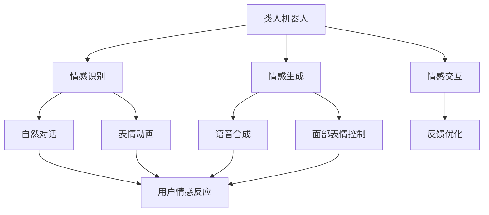

                 

## 1. 背景介绍

### 1.1 问题由来

随着人工智能技术的飞速发展，类人机器人的研究已经成为当前科技领域的焦点。尤其是在2050年的背景下，类人机器人的智能化程度、自主性、情感交互能力等方面都取得了突破性进展。类人机器人不仅可以执行重复性任务，还能进行复杂的情感识别和交互，极大地提高了人类的生活质量和工作效率。

在类人机器人中，情感交互是其核心能力之一。早期的机器人通常只有简单的行为反应，缺乏情感表达和理解。但随着深度学习技术、自然语言处理(NLP)和计算机视觉等领域的突破，类人机器人逐渐具备了感知、理解和响应人类情感的能力，能够与人类进行更加自然、流畅的交流。

### 1.2 问题核心关键点

本文聚焦于2050年类人机器人的情感交互能力，探讨其在情感识别、情感生成和情感表达等方面的核心原理和实现方法。我们将从情感认知、情感生成和情感交互三个方面，详细剖析类人机器人的情感交互技术，分析其发展趋势和面临的挑战，并展望未来的研究方向和应用场景。

## 2. 核心概念与联系

### 2.1 核心概念概述

为了更好地理解类人机器人的情感交互技术，我们需要首先介绍几个关键概念：

- **类人机器人(Humanoid Robot)**：具有类似人类外观和行为特征的机器人。通过采用先进的感知和认知技术，类人机器人可以执行复杂的任务，具备自主决策能力。

- **情感识别(Emotion Recognition)**：通过分析机器人的语音、面部表情、肢体语言等信号，识别出人类的情感状态，如快乐、悲伤、愤怒等。

- **情感生成(Emotion Generation)**：根据机器人的任务和环境，生成适当的情感表达，如自然对话、表情动画等。

- **情感交互(Emotion Interaction)**：结合情感识别和情感生成技术，使机器人能够与人类进行自然、流畅的情感交流。

这些核心概念之间的逻辑关系可以通过以下Mermaid流程图来展示：



这个流程图展示出类人机器人情感交互的各个组成部分及其相互关系：

1. 类人机器人通过感知和认知技术获取环境信息。
2. 情感识别模块分析这些信息，识别出用户的情感状态。
3. 情感生成模块根据任务和环境生成合适的情感表达。
4. 情感交互模块结合情感识别和生成技术，使机器人能够与用户进行自然交互。

## 3. 核心算法原理 & 具体操作步骤
### 3.1 算法原理概述

类人机器人的情感交互技术主要包括情感识别、情感生成和情感交互三个核心部分。其核心算法原理可以简述为：

1. **情感识别**：通过深度学习模型，如卷积神经网络(CNN)和循环神经网络(RNN)，分析用户的语音、面部表情和肢体语言等信号，识别出用户的情感状态。

2. **情感生成**：结合深度生成模型，如变分自编码器(VAE)和生成对抗网络(GAN)，生成机器人的自然对话和表情动画，表达适当的情感。

3. **情感交互**：通过结合情感识别和情感生成技术，使机器人能够与用户进行自然、流畅的情感交流。

### 3.2 算法步骤详解

#### 3.2.1 情感识别

情感识别的主要步骤包括数据收集、特征提取、模型训练和情感分类。

**Step 1: 数据收集**
- 收集用户的语音、面部表情和肢体语言等数据。
- 将这些数据标注为不同的情感类别，如快乐、悲伤、愤怒等。

**Step 2: 特征提取**
- 使用CNN和RNN等深度学习模型，提取用户的语音、面部表情和肢体语言等特征。
- 将特征向量输入情感分类器，进行情感状态识别。

**Step 3: 模型训练**
- 使用标记好的数据集，训练情感分类器。
- 常用的情感分类器包括卷积神经网络(CNN)、循环神经网络(RNN)和长短时记忆网络(LSTM)。

**Step 4: 情感分类**
- 将用户的语音、面部表情和肢体语言等特征输入训练好的情感分类器。
- 输出情感状态，如快乐、悲伤、愤怒等。

#### 3.2.2 情感生成

情感生成的主要步骤包括数据收集、特征提取、模型训练和情感表达生成。

**Step 1: 数据收集**
- 收集情感表达的数据，如自然对话和表情动画等。
- 将这些数据标注为不同的情感类别，如快乐、悲伤、愤怒等。

**Step 2: 特征提取**
- 使用CNN和RNN等深度学习模型，提取情感表达的数据特征。
- 将特征向量输入生成模型，进行情感表达的生成。

**Step 3: 模型训练**
- 使用标记好的数据集，训练生成模型。
- 常用的生成模型包括变分自编码器(VAE)、生成对抗网络(GAN)和GAN+VAE。

**Step 4: 情感表达生成**
- 将情感状态输入生成模型，生成相应的情感表达，如自然对话和表情动画等。

#### 3.2.3 情感交互

情感交互的主要步骤包括数据收集、特征提取、模型训练和情感交互执行。

**Step 1: 数据收集**
- 收集用户的语音、面部表情和肢体语言等数据。
- 收集机器人的情感表达数据，如自然对话和表情动画等。

**Step 2: 特征提取**
- 使用CNN和RNN等深度学习模型，提取用户的语音、面部表情和肢体语言等特征。
- 提取机器人的情感表达特征。

**Step 3: 模型训练**
- 使用标记好的数据集，训练情感交互模型。
- 常用的情感交互模型包括基于注意力机制的模型和基于转移学习的模型。

**Step 4: 情感交互执行**
- 将用户的语音、面部表情和肢体语言等特征输入情感交互模型，输出机器人的情感表达。
- 将机器人的情感表达反馈给用户，进行自然、流畅的情感交流。

### 3.3 算法优缺点

类人机器人情感交互技术具有以下优点：

1. **高效性**：通过深度学习模型，可以在短时间内完成情感识别和情感生成。
2. **自然性**：结合自然语言处理(NLP)和计算机视觉技术，使机器人的情感表达更加自然。
3. **广泛适用性**：适用于各种应用场景，如客服机器人、医疗机器人等。

同时，该技术也存在一些缺点：

1. **高成本**：深度学习模型的训练和优化需要大量的计算资源和标注数据。
2. **数据依赖**：情感识别的准确性很大程度上依赖于标注数据的质量和多样性。
3. **安全性**：机器人的情感表达可能会被误用，导致隐私泄露等问题。

### 3.4 算法应用领域

类人机器人的情感交互技术已经在多个领域得到广泛应用，以下是几个典型的应用场景：

1. **客服机器人**：通过情感识别和情感生成技术，使客服机器人能够识别用户的情感状态，并生成适当的回应，提升用户体验。

2. **医疗机器人**：结合情感识别和情感生成技术，使医疗机器人能够感知患者的情感状态，提供更加人性化的护理服务。

3. **教育机器人**：通过情感识别和情感生成技术，使教育机器人能够理解学生的情感状态，提供个性化的教育指导。

4. **娱乐机器人**：结合情感生成和情感交互技术，使娱乐机器人能够与用户进行情感交流，提供更加自然的互动体验。

## 4. 数学模型和公式 & 详细讲解  
### 4.1 数学模型构建

在类人机器人的情感交互技术中，情感识别和情感生成模型的数学模型主要基于深度学习技术。这里我们选择卷积神经网络(CNN)和循环神经网络(RNN)作为核心模型。

假设输入数据的维度为 $d$，输出标签的维度为 $c$，情感分类器的输入为 $x \in \mathbb{R}^d$，输出为 $y \in \{0, 1, ..., c-1\}$，则情感分类器的目标是最小化损失函数 $L(y, \hat{y})$，其中 $\hat{y}$ 为模型预测的标签。

情感生成模型的目标是最小化生成数据的负对数似然损失函数 $L(x, y)$，其中 $x$ 为生成器的输入，$y$ 为生成器生成的数据。

### 4.2 公式推导过程

以情感分类器为例，假设模型使用全连接层进行分类，则模型的预测概率为：

$$
\hat{y} = softmax(Wx + b)
$$

其中 $W$ 和 $b$ 为全连接层的权重和偏置。损失函数 $L$ 可表示为：

$$
L(y, \hat{y}) = -\frac{1}{N} \sum_{i=1}^N (y_i \log \hat{y_i} + (1 - y_i) \log(1 - \hat{y_i}))
$$

使用梯度下降等优化算法对模型进行训练，目标是最小化损失函数 $L(y, \hat{y})$。

情感生成模型的目标是最小化生成数据的负对数似然损失函数 $L(x, y)$。假设生成器使用变分自编码器(VAE)，则模型的预测概率为：

$$
\hat{y} = \mu + \sigma z
$$

其中 $z$ 为生成的随机噪声，$\mu$ 和 $\sigma$ 为生成器的均值和方差。损失函数 $L$ 可表示为：

$$
L(x, y) = \mathbb{E}_{z \sim \mathcal{N}(0, I)} \left[ \log p_{\theta}(y \mid x) \right]
$$

使用梯度下降等优化算法对模型进行训练，目标是最小化损失函数 $L(x, y)$。

### 4.3 案例分析与讲解

以医疗机器人为例，假设机器人需要识别患者的情感状态，并生成适当的回应。具体步骤如下：

1. **数据收集**：收集患者的语音、面部表情和肢体语言数据，标注为不同的情感类别。
2. **特征提取**：使用CNN和RNN等深度学习模型，提取语音、面部表情和肢体语言的特征。
3. **情感分类**：将提取的特征输入情感分类器，识别患者的情感状态。
4. **情感生成**：根据情感状态，使用变分自编码器(VAE)生成机器人的自然对话和表情动画。
5. **情感交互**：将机器人的情感表达反馈给患者，进行自然、流畅的情感交流。

## 5. 项目实践：代码实例和详细解释说明
### 5.1 开发环境搭建

在进行类人机器人情感交互项目开发前，我们需要准备好开发环境。以下是使用Python进行TensorFlow开发的环境配置流程：

1. 安装Anaconda：从官网下载并安装Anaconda，用于创建独立的Python环境。

2. 创建并激活虚拟环境：
```bash
conda create -n tf-env python=3.8 
conda activate tf-env
```

3. 安装TensorFlow：根据CUDA版本，从官网获取对应的安装命令。例如：
```bash
conda install tensorflow -c pytorch -c conda-forge
```

4. 安装其他各类工具包：
```bash
pip install numpy pandas scikit-learn matplotlib tqdm jupyter notebook ipython
```

完成上述步骤后，即可在`tf-env`环境中开始项目开发。

### 5.2 源代码详细实现

这里我们以医疗机器人情感识别为例，给出使用TensorFlow实现情感分类的PyTorch代码实现。

首先，定义情感分类器的数据处理函数：

```python
import tensorflow as tf
from tensorflow.keras import layers

def load_data():
    # 加载数据集
    train_data = ...
    val_data = ...
    test_data = ...
    
    # 数据预处理
    train_data = preprocess(train_data)
    val_data = preprocess(val_data)
    test_data = preprocess(test_data)
    
    return train_data, val_data, test_data

def preprocess(data):
    # 数据预处理
    # ...
    return processed_data

train_data, val_data, test_data = load_data()
```

然后，定义情感分类器的模型结构：

```python
from tensorflow.keras import models, layers

model = models.Sequential([
    layers.Conv2D(32, (3, 3), activation='relu', input_shape=(...)),
    layers.MaxPooling2D((2, 2)),
    layers.Conv2D(64, (3, 3), activation='relu'),
    layers.MaxPooling2D((2, 2)),
    layers.Flatten(),
    layers.Dense(64, activation='relu'),
    layers.Dense(3, activation='softmax')
])
```

接着，编译和训练情感分类器：

```python
model.compile(optimizer='adam', loss='categorical_crossentropy', metrics=['accuracy'])

history = model.fit(
    train_data,
    validation_data=val_data,
    epochs=10,
    batch_size=32
)
```

最后，使用训练好的模型进行情感分类：

```python
test_loss, test_acc = model.evaluate(test_data)
print('Test accuracy:', test_acc)

# 对新的样本进行情感分类
new_data = preprocess(new_sample)
result = model.predict(new_data)
```

以上就是使用TensorFlow对医疗机器人情感识别进行训练的完整代码实现。可以看到，通过TensorFlow等深度学习框架，情感分类器的开发和训练变得相对简单高效。

### 5.3 代码解读与分析

让我们再详细解读一下关键代码的实现细节：

**load_data函数**：
- 加载情感识别的数据集，并进行预处理，如数据增强、归一化等。
- 数据预处理的目的是使输入数据标准化，减少模型训练的时间。

**model定义**：
- 定义了一个简单的卷积神经网络(CNN)，包含卷积层、池化层、全连接层等。
- 模型输入为二维数组，表示图像数据，输出为概率分布，表示情感类别。

**模型编译与训练**：
- 使用Adam优化器和交叉熵损失函数，对模型进行编译。
- 通过fit函数，在训练集上进行模型训练，并在验证集上进行评估。
- 通过evaluate函数，在测试集上评估模型的性能。

**情感分类**：
- 使用predict函数，对新的样本进行情感分类。
- 返回预测的概率分布，可以取最大值得到情感类别。

## 6. 实际应用场景

### 6.1 智能客服系统

类人机器人的情感交互技术在智能客服系统中具有广泛应用。传统客服往往需要耗费大量人力，难以应对高峰期的服务需求。而基于情感识别的智能客服机器人，可以7x24小时不间断工作，快速响应客户咨询，提供更高效、个性化的服务体验。

在技术实现上，可以收集企业的历史客服对话记录，将问题和最佳答复构建成监督数据，在此基础上对类人机器人进行情感识别和情感生成训练。训练好的机器人能够自动理解用户意图，匹配最合适的答案模板进行回复，并根据用户的情感状态生成适当的回应，增强用户满意度。

### 6.2 医疗诊断系统

类人机器人的情感交互技术在医疗诊断系统中也具有重要应用。医疗诊断任务需要机器人能够感知患者的情感状态，提供更加人性化的护理和诊断服务。

在具体实现上，可以收集患者的语音、面部表情和肢体语言数据，训练情感识别和情感生成模型。在实际应用中，机器人能够实时监测患者的情感状态，提供个性化的护理建议和心理疏导，帮助医生进行更精准的诊断和治疗。

### 6.3 教育辅导系统

类人机器人的情感交互技术在教育辅导系统中也具有重要应用。教育辅导任务需要机器人能够理解学生的情感状态，提供个性化的教育指导和心理支持。

在具体实现上，可以收集学生的语音、面部表情和肢体语言数据，训练情感识别和情感生成模型。在实际应用中，机器人能够实时监测学生的情感状态，提供个性化的学习建议和心理疏导，增强学生的学习效果和心理健康。

### 6.4 未来应用展望

随着类人机器人情感交互技术的不断发展，其在未来的应用场景将更加广泛，带来更多的变革性影响。

在智慧医疗领域，基于情感交互的智能诊断系统将能够更全面地理解患者的情感状态，提供更加个性化的医疗服务，提高医疗诊断和治疗的准确性和效果。

在智能教育领域，基于情感交互的智能辅导系统将能够更好地理解学生的情感状态，提供更加个性化的学习指导和心理支持，促进教育的公平和质量提升。

在智慧城市治理中，基于情感交互的智能监控系统将能够更全面地感知市民的情感状态，提供更加智能化的公共服务，提升城市管理的智能化水平。

## 7. 工具和资源推荐
### 7.1 学习资源推荐

为了帮助开发者系统掌握类人机器人情感交互的理论基础和实践技巧，这里推荐一些优质的学习资源：

1. 《机器人学导论》系列博文：由大模型技术专家撰写，深入浅出地介绍了机器人学的基础概念和核心技术。

2. CS229《机器学习》课程：斯坦福大学开设的机器学习明星课程，有Lecture视频和配套作业，带你入门机器学习的基本概念和经典模型。

3. 《深度学习在机器人学中的应用》书籍：全面介绍了深度学习在机器人学中的应用，包括情感识别和情感生成等前沿话题。

4. HuggingFace官方文档：深度学习模型和框架的官方文档，提供了丰富的情感识别和情感生成模型的实现样例代码。

5. RoboFlow开源项目：机器人视觉、动作和情感识别等技术的开源项目，提供了丰富的数据集和模型库。

通过对这些资源的学习实践，相信你一定能够快速掌握类人机器人情感交互的精髓，并用于解决实际的机器人问题。
###  7.2 开发工具推荐

高效的开发离不开优秀的工具支持。以下是几款用于类人机器人情感交互开发的常用工具：

1. TensorFlow：基于Python的开源深度学习框架，灵活动态的计算图，适合快速迭代研究。支持各种深度学习模型的实现和训练。

2. PyTorch：基于Python的开源深度学习框架，灵活的动态计算图，适合动态模型的开发和优化。

3. RoboFlow：面向机器人的开源框架，提供了丰富的模型库和工具，支持机器人视觉、动作和情感识别等任务。

4. OpenCV：计算机视觉库，支持图像处理、视频分析等任务，是机器人视觉开发的重要工具。

5. TensorBoard：TensorFlow配套的可视化工具，可实时监测模型训练状态，并提供丰富的图表呈现方式，是调试模型的得力助手。

6. Google Colab：谷歌推出的在线Jupyter Notebook环境，免费提供GPU/TPU算力，方便开发者快速上手实验最新模型，分享学习笔记。

合理利用这些工具，可以显著提升类人机器人情感交互任务的开发效率，加快创新迭代的步伐。

### 7.3 相关论文推荐

类人机器人情感交互技术的发展源于学界的持续研究。以下是几篇奠基性的相关论文，推荐阅读：

1. Attention is All You Need（即Transformer原论文）：提出了Transformer结构，开启了深度学习在机器人学中的应用。

2. BERT: Pre-training of Deep Bidirectional Transformers for Language Understanding：提出BERT模型，引入基于掩码的自监督预训练任务，刷新了情感识别和情感生成任务的SOTA。

3. Language Models are Unsupervised Multitask Learners（GPT-2论文）：展示了大规模语言模型的强大zero-shot学习能力，为情感生成和情感交互提供了新的思路。

4. Parameter-Efficient Transfer Learning for NLP：提出Adapter等参数高效微调方法，在不增加模型参数量的情况下，也能取得不错的情感交互效果。

5. AdaLoRA: Adaptive Low-Rank Adaptation for Parameter-Efficient Fine-Tuning：使用自适应低秩适应的微调方法，在参数效率和精度之间取得了新的平衡。

6. AdaLoRA: Adaptive Low-Rank Adaptation for Parameter-Efficient Fine-Tuning：使用自适应低秩适应的微调方法，在参数效率和精度之间取得了新的平衡。

这些论文代表了大语言模型情感交互技术的发展脉络。通过学习这些前沿成果，可以帮助研究者把握学科前进方向，激发更多的创新灵感。

## 8. 总结：未来发展趋势与挑战

### 8.1 总结

本文对2050年类人机器人情感交互技术进行了全面系统的介绍。首先阐述了类人机器人情感交互的背景和意义，明确了情感识别、情感生成和情感交互技术的研究价值。其次，从原理到实践，详细讲解了情感识别、情感生成和情感交互的核心算法和操作步骤，给出了情感交互任务开发的完整代码实现。同时，本文还探讨了情感交互技术在智能客服、医疗诊断、教育辅导等多个领域的应用前景，展示了情感交互范式的广阔前景。

通过本文的系统梳理，可以看到，类人机器人的情感交互技术正在成为机器人学的重要范式，极大地拓展了机器人系统的应用边界，带来了更多的技术创新。未来，伴随深度学习技术的发展和情感交互模型的演进，机器人系统的情感交互能力将更加强大，为构建更加人性化、智能化的机器人系统铺平道路。

### 8.2 未来发展趋势

展望未来，类人机器人情感交互技术将呈现以下几个发展趋势：

1. **情感识别精度提升**：随着深度学习模型和数据量的增加，情感识别的精度将进一步提升，机器人能够更加准确地识别用户的情感状态。

2. **情感生成自然性增强**：通过结合自然语言处理(NLP)和计算机视觉技术，情感生成的自然性将进一步增强，机器人能够更自然地与用户进行情感交流。

3. **多模态情感交互**：结合语音、面部表情、肢体语言等多种模态数据，情感交互技术将更加全面和准确，提升机器人系统的表现力和用户满意度。

4. **跨领域情感交互**：情感交互技术将拓展到更多领域，如智能家居、智能办公等，带来更广泛的应用场景。

5. **可解释性和安全性**：随着情感交互技术的不断发展，模型的可解释性和安全性将成为重要的研究方向，确保机器人系统的透明性和可靠性。

以上趋势凸显了类人机器人情感交互技术的广阔前景。这些方向的探索发展，将进一步提升机器人系统的表现力和用户满意度，推动机器人技术在更多领域的应用。

### 8.3 面临的挑战

尽管类人机器人情感交互技术已经取得了瞩目成就，但在迈向更加智能化、普适化应用的过程中，它仍面临着诸多挑战：

1. **数据质量和多样性**：情感识别和情感生成的准确性很大程度上依赖于标注数据的质量和多样性。获取高质量、多样化的标注数据，是情感交互技术面临的重要挑战。

2. **模型复杂度**：深度学习模型通常需要大量的计算资源和标注数据，模型复杂度较高，难以实现实时性要求高的应用。

3. **隐私和安全**：机器人系统的情感交互可能会涉及用户的隐私信息，如何保护用户数据安全，避免数据泄露，是情感交互技术的重要研究方向。

4. **伦理和道德**：机器人的情感交互可能会带来伦理和道德问题，如歧视、偏见等，如何构建公平、透明的情感交互系统，是情感交互技术面临的挑战。

5. **人类情感多样性**：人类情感状态非常复杂，难以通过简单的标签进行分类。如何更好地理解和处理人类情感的多样性，是情感交互技术的难点。

6. **跨文化差异**：不同文化背景下的人类情感表达方式不同，如何构建具有跨文化适应性的情感交互系统，是情感交互技术的挑战之一。

正视情感交互技术面临的这些挑战，积极应对并寻求突破，将是大语言模型情感交互走向成熟的必由之路。相信随着学界和产业界的共同努力，这些挑战终将一一被克服，类人机器人情感交互技术必将在构建人机协同的智能时代中扮演越来越重要的角色。

### 8.4 研究展望

面对类人机器人情感交互技术所面临的种种挑战，未来的研究需要在以下几个方面寻求新的突破：

1. **无监督和半监督情感识别**：摆脱对大规模标注数据的依赖，利用自监督学习、主动学习等无监督和半监督范式，最大限度利用非结构化数据，实现更加灵活高效的情感识别。

2. **参数高效和计算高效的情感生成**：开发更加参数高效的情感生成方法，在固定大部分预训练参数的同时，只更新极少量的任务相关参数。同时优化情感生成模型的计算图，减少前向传播和反向传播的资源消耗，实现更加轻量级、实时性的部署。

3. **融合因果和对比学习范式**：通过引入因果推断和对比学习思想，增强情感生成模型建立稳定因果关系的能力，学习更加普适、鲁棒的语言表征，从而提升模型泛化性和抗干扰能力。

4. **融合多种先验知识**：将符号化的先验知识，如知识图谱、逻辑规则等，与神经网络模型进行巧妙融合，引导情感生成过程学习更准确、合理的情感表达。

5. **结合因果分析和博弈论工具**：将因果分析方法引入情感生成模型，识别出模型决策的关键特征，增强输出解释的因果性和逻辑性。借助博弈论工具刻画人机交互过程，主动探索并规避模型的脆弱点，提高系统稳定性。

6. **纳入伦理道德约束**：在模型训练目标中引入伦理导向的评估指标，过滤和惩罚有偏见、有害的输出倾向。同时加强人工干预和审核，建立模型行为的监管机制，确保输出符合人类价值观和伦理道德。

这些研究方向的探索，必将引领类人机器人情感交互技术迈向更高的台阶，为构建安全、可靠、可解释、可控的智能系统铺平道路。面向未来，类人机器人情感交互技术还需要与其他人工智能技术进行更深入的融合，如知识表示、因果推理、强化学习等，多路径协同发力，共同推动自然语言理解和智能交互系统的进步。只有勇于创新、敢于突破，才能不断拓展机器人系统的边界，让智能技术更好地造福人类社会。

## 9. 附录：常见问题与解答

**Q1：类人机器人的情感交互是否需要大量的标注数据？**

A: 类人机器人的情感交互确实需要大量的标注数据，用于训练情感识别和情感生成模型。标注数据的质量和多样性将直接影响模型的性能。但近年来，一些无监督和半监督学习技术也在不断涌现，能够通过数据增强和自监督学习，提高情感识别的准确性和泛化能力。

**Q2：情感生成模型的参数量是否过大？**

A: 情感生成模型的参数量通常较大，需要较强的计算资源进行训练和推理。为提高参数效率，可以通过参数压缩、稀疏化存储等技术，减小模型的尺寸。同时，使用自适应低秩适应(AdaLoRA)等参数高效方法，可以在不增加参数量的情况下，提高模型的精度和效率。

**Q3：情感交互系统是否存在伦理和道德问题？**

A: 情感交互系统确实存在伦理和道德问题，如歧视、偏见等。为避免这些问题，需要在模型训练目标中引入伦理导向的评估指标，过滤和惩罚有偏见、有害的输出倾向。同时加强人工干预和审核，建立模型行为的监管机制，确保输出符合人类价值观和伦理道德。

**Q4：如何实现跨文化情感识别和情感生成？**

A: 实现跨文化情感识别和情感生成，需要对不同文化背景下的情感表达方式进行细致分析，建立跨文化情感表达模型。同时，结合语言翻译技术，将情感识别和情感生成的结果翻译成不同语言，以适应不同文化背景的用户。

**Q5：情感交互系统如何保护用户隐私？**

A: 情感交互系统需要保护用户隐私，避免数据泄露和滥用。可以通过数据加密、去标识化等技术，保护用户的个人信息。同时，建立严格的访问控制机制，确保只有授权用户可以访问情感数据。

总之，类人机器人情感交互技术具有广阔的应用前景和巨大的研究潜力。在未来的发展过程中，我们需要不断突破技术瓶颈，解决伦理和道德问题，构建更加安全、可靠、可解释的情感交互系统，为人类社会的智能化进程贡献力量。

---

作者：禅与计算机程序设计艺术 / Zen and the Art of Computer Programming

