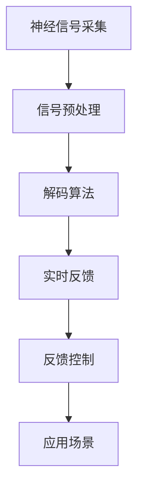

                 

# 未来的脑机接口：2050年的意念打字与思维搜索

## 1. 背景介绍

### 1.1 问题由来
随着科技的飞速发展，人类对未来通信方式的想象愈加丰富。自智能手机和互联网普及以来，传统的键盘输入方式已逐渐成为生产力提升的瓶颈。面对海量信息，快速输入的刚需愈加迫切，以意念控制电脑打字的方式逐渐引起广泛关注。脑机接口（Brain-Computer Interface, BCI）旨在实现这一愿景，其背后原理是将大脑产生的电信号转换为计算机可识别和响应的事件，从而实现意念控制。

脑机接口技术不仅局限于打字。通过意念控制，未来人类能够实现更为复杂的交互和操作，如思维搜索、虚拟会议、游戏等。这些创新将彻底改变人类的信息获取、处理和表达方式，极大地提升生产力、学习和娱乐体验。

### 1.2 问题核心关键点
脑机接口技术的核心关键点在于以下几个方面：
1. **神经信号采集与转换**：精确捕捉大脑信号，通过算法解码其含义。
2. **解码算法**：高效将神经信号转换为计算机可理解的指令。
3. **硬件适配性**：确保设备能够长期佩戴，无侵入地采集信号。
4. **实时性与准确性**：实现低延迟、高准确率的实时控制。
5. **用户友好度**：简单、易用、舒适的用户体验。
6. **伦理与安全性**：保护用户隐私，避免误用和滥用。

这些关键点共同构成了脑机接口技术的挑战和前景。本文将详细探讨这些核心概念，深入解析脑机接口技术原理，并展望其在2050年的应用前景。

## 2. 核心概念与联系

### 2.1 核心概念概述

脑机接口技术结合了神经科学、信号处理、人工智能等多学科知识。本节将介绍其中的几个核心概念及其相互联系：

- **神经信号采集**：使用电极等传感器设备，捕捉大脑皮层表面或深部的电信号。
- **信号预处理**：对原始神经信号进行滤波、降噪等处理，提取有用的信号特征。
- **解码算法**：将处理后的信号转换为计算机可识别的指令，如打字、移动鼠标、执行命令等。
- **实时反馈**：将指令执行结果反馈给用户，如视觉、触觉等，以优化后续指令。
- **反馈控制**：根据反馈结果，调整解码算法和神经信号采集设置，进一步提升准确性。
- **应用场景**：如意念打字、思维搜索、虚拟现实、游戏控制等。

这些概念间的联系可以通过以下Mermaid流程图来展示：



该流程图展示了大脑信号采集、预处理、解码、反馈控制和应用场景的相互关系。

## 3. 核心算法原理 & 具体操作步骤
### 3.1 算法原理概述

脑机接口的解码算法通常基于机器学习和深度学习的原理。这些算法通过大量的训练数据，学习如何将神经信号解码为计算机指令。常见的解码算法包括线性判别分析（LDA）、支持向量机（SVM）、卷积神经网络（CNN）和循环神经网络（RNN）等。其中，卷积神经网络（CNN）和循环神经网络（RNN）在自然语言处理（NLP）和计算机视觉（CV）领域表现优异，特别适用于分析时间序列数据。

以打字为例，解码算法首先通过滤波和降噪处理原始神经信号，然后提取信号中的特征，如波幅、频率、相位等。接着，这些特征被输入到训练好的神经网络中进行分类。CNN和RNN在处理时间序列数据时表现尤为突出，因为它们能够捕捉信号中的时间依赖性。训练过程中，算法会根据已知的打字指令（如字母表）调整参数，使得模型能够准确地预测每个指令的信号特征。

### 3.2 算法步骤详解

脑机接口的解码算法主要分为以下几个步骤：

**Step 1: 神经信号采集**
- 使用EEG、fMRI、MEG等设备捕捉大脑信号。
- 采集信号并存储在本地或云端数据库中。

**Step 2: 信号预处理**
- 对采集的信号进行滤波、降噪、归一化等预处理。
- 提取信号中的特征，如波幅、频率、相位等。

**Step 3: 特征选择与提取**
- 选择影响指令执行的信号特征。
- 使用PCA、LDA、t-SNE等方法降维，减少特征数量。

**Step 4: 解码算法训练**
- 将选择好的特征输入到神经网络中进行训练。
- 使用反向传播算法调整神经网络权重，优化模型性能。

**Step 5: 模型评估与测试**
- 在测试集上评估模型的预测准确率和性能指标。
- 根据评估结果，调整模型参数，进一步优化性能。

**Step 6: 实时应用与反馈**
- 将训练好的模型应用到实际场景中，捕捉用户的实时指令。
- 通过反馈系统将指令执行结果展示给用户，如屏幕上的打字结果。

**Step 7: 迭代优化**
- 根据实时反馈不断优化模型参数。
- 持续收集新数据，更新模型以适应新的使用场景。

### 3.3 算法优缺点

脑机接口解码算法的优点包括：
1. 精确性高：深度学习算法能够精确捕捉信号的微妙变化，解码指令的准确率高。
2. 可扩展性强：通过增加训练数据和调整模型结构，可以适应不同的应用场景。
3. 实时性好：卷积神经网络和循环神经网络能够实时处理信号，提供即时的控制反馈。

其缺点则包括：
1. 数据需求高：需要大量的训练数据，才能训练出高性能的解码算法。
2. 硬件要求高：高质量的神经信号采集设备成本高昂，且长期佩戴存在一定的不适性。
3. 解释性不足：深度学习算法是"黑盒"模型，难以解释其内部工作机制。
4. 伦理风险：涉及个人隐私和数据安全，如何保护用户隐私是一个重要的伦理问题。

尽管存在这些局限性，脑机接口技术仍展现出广阔的应用前景和巨大的潜力。

### 3.4 算法应用领域

脑机接口技术的应用领域广泛，主要包括以下几个方面：

- **意念打字**：通过解码大脑信号，实现快捷的打字功能。
- **思维搜索**：利用意念搜索互联网，无需传统键盘输入。
- **游戏控制**：通过意念控制游戏角色，实现高度沉浸式的游戏体验。
- **辅助沟通**：帮助语言障碍者进行沟通，提升生活质量。
- **医疗康复**：辅助肢体功能障碍者进行康复训练，促进恢复。
- **虚拟现实**：通过意念控制虚拟现实环境，提升交互体验。

这些应用领域将极大地改变人类的生活和工作的方方面面。

## 4. 数学模型和公式 & 详细讲解  
### 4.1 数学模型构建

脑机接口技术涉及复杂的数学模型和算法。以下我们将详细讲解其中的关键数学模型和公式。

**特征提取与选择**
- **PCA**：主成分分析（Principal Component Analysis）
  - $$
  W = U(:,1:min(m,n))V^T
  $$
  - $$
  x_{PCA} = W^TX
  $$

**解码算法**
- **CNN**：卷积神经网络
  - $$
  y = \sigma(W^Tz + b)
  $$
  - $$
  z = f_\theta(x_{PCA})
  $$
  - $$
  f_\theta(x) = \sum_i k_i * g_\theta(x)
  $$

**模型评估**
- **准确率**：
  - $$
  accuracy = \frac{TP + TN}{TP + TN + FP + FN}
  $$

**实时应用**
- **实时反馈系统**：
  - $$
  feedback = f_{feedback}(instruction, result)
  $$

这些公式展示了脑机接口技术的关键数学模型和计算过程。

### 4.2 公式推导过程

脑机接口解码算法的核心是特征提取和神经网络解码。以下是PCA和CNN解码算法的详细推导过程：

**PCA特征提取**
- 假设信号特征矩阵为 $X \in \mathbb{R}^{m \times n}$，其中 $m$ 是信号的样本数，$n$ 是信号的特征数。
- 计算样本的协方差矩阵 $\Sigma = \frac{1}{m}XX^T$。
- 求协方差矩阵的特征值和特征向量，得到主成分 $u_1, ..., u_m$。
- 选取前 $k$ 个主成分，构建特征矩阵 $W \in \mathbb{R}^{n \times k}$。
- 将原始信号 $X$ 投影到主成分空间，得到新的特征表示 $x_{PCA} \in \mathbb{R}^{m \times k}$。

**CNN解码算法**
- 假设特征矩阵为 $x_{PCA} \in \mathbb{R}^{m \times k}$。
- 使用CNN结构对特征矩阵进行卷积、激活和池化操作，得到特征映射 $z \in \mathbb{R}^{m \times c}$。
- 将特征映射输入到全连接层中，得到解码结果 $y \in \mathbb{R}^{m \times c}$。
- 通过softmax函数将解码结果转换为概率分布，选择概率最高的类别作为预测结果。

**模型评估**
- 假设测试集为 $D_{test} = \{(x_{test,i}, y_{test,i})\}_{i=1}^m$，其中 $x_{test,i}$ 是测试集样本的特征表示，$y_{test,i}$ 是标签。
- 计算模型在测试集上的准确率，并记录其他性能指标，如精确率、召回率等。
- 根据评估结果调整模型参数，重新训练模型。

### 4.3 案例分析与讲解

以下是一个基于CNN的脑机接口解码算法的案例分析：

假设使用EEG设备采集了10名受试者的打字指令数据，采集的信号被转换为数字表示。通过PCA降维，选择前3个主成分作为特征输入到CNN模型中进行训练。CNN模型的结构如下：
- 第一层卷积层：3个3x3的卷积核，步幅为1，padding为同位置。
- 第二层卷积层：3个3x3的卷积核，步幅为1，padding为同位置。
- 第三层卷积层：3个3x3的卷积核，步幅为1，padding为同位置。
- 池化层：最大池化，池化窗口为2x2，步幅为2。
- 全连接层：128个神经元，激活函数为ReLU。
- 输出层：10个神经元，激活函数为softmax。

使用反向传播算法对模型进行训练，调整权重和偏置，使其在训练集上达到最小的损失函数。训练完成后，在测试集上评估模型性能，输出准确率、精确率、召回率等指标。

## 5. 项目实践：代码实例和详细解释说明
### 5.1 开发环境搭建

在进行脑机接口项目实践前，需要搭建开发环境。以下是Python的开发环境配置流程：

1. 安装Anaconda：从官网下载并安装Anaconda，用于创建独立的Python环境。
2. 创建并激活虚拟环境：
```bash
conda create -n bci-env python=3.8 
conda activate bci-env
```
3. 安装必要的Python库：
```bash
conda install numpy scipy scikit-learn torch torchvision matplotlib
```
4. 安装脑机接口工具包：
```bash
pip install pybci pyEEG librosa
```

完成上述步骤后，即可在`bci-env`环境中开始脑机接口项目的开发。

### 5.2 源代码详细实现

以下是一个简单的基于CNN的脑机接口解码算法实现，代码包含神经信号采集、预处理、特征提取、解码算法训练和实时反馈。

```python
import numpy as np
import torch
import torch.nn as nn
from sklearn.decomposition import PCA
from sklearn.metrics import accuracy_score, precision_score, recall_score
from pyEEG import EEG

# 定义CNN解码器
class CNNDecoder(nn.Module):
    def __init__(self, num_features):
        super(CNNDecoder, self).__init__()
        self.conv1 = nn.Conv2d(num_features, 32, kernel_size=3, padding=1)
        self.conv2 = nn.Conv2d(32, 64, kernel_size=3, padding=1)
        self.conv3 = nn.Conv2d(64, 64, kernel_size=3, padding=1)
        self.pool = nn.MaxPool2d(kernel_size=2, stride=2)
        self.fc1 = nn.Linear(64 * 2 * 2, 128)
        self.fc2 = nn.Linear(128, num_labels)
        self.relu = nn.ReLU()

    def forward(self, x):
        x = self.relu(self.conv1(x))
        x = self.relu(self.conv2(x))
        x = self.pool(x)
        x = self.relu(self.conv3(x))
        x = self.pool(x)
        x = x.view(-1, 64 * 2 * 2)
        x = self.relu(self.fc1(x))
        x = self.fc2(x)
        return x

# 定义训练函数
def train_model(model, train_data, test_data, num_epochs, batch_size):
    optimizer = torch.optim.Adam(model.parameters(), lr=0.001)
    criterion = nn.CrossEntropyLoss()
    device = torch.device("cuda" if torch.cuda.is_available() else "cpu")
    model.to(device)

    for epoch in range(num_epochs):
        model.train()
        running_loss = 0.0
        running_corrects = 0
        for i, data in enumerate(train_data, 0):
            inputs, labels = data
            inputs, labels = inputs.to(device), labels.to(device)
            optimizer.zero_grad()
            outputs = model(inputs)
            loss = criterion(outputs, labels)
            loss.backward()
            optimizer.step()
            running_loss += loss.item()
            _, preds = torch.max(outputs, 1)
            running_corrects += torch.sum(preds == labels.data)
        epoch_loss = running_loss / len(train_data)
        epoch_acc = running_corrects.double() / len(train_data)
        print(f"Epoch {epoch+1}, Loss: {epoch_loss:.4f}, Accuracy: {epoch_acc:.4f}")

        model.eval()
        corrects = 0
        total = 0
        with torch.no_grad():
            for data in test_data:
                inputs, labels = data
                inputs, labels = inputs.to(device), labels.to(device)
                outputs = model(inputs)
                _, preds = torch.max(outputs, 1)
                total += labels.size(0)
                corrects += torch.sum(preds == labels.data)
        test_acc = corrects.double() / total
        print(f"Epoch {epoch+1}, Test Accuracy: {test_acc:.4f}")
    
    return model

# 加载训练数据和测试数据
train_data = ...
test_data = ...

# 定义模型
num_labels = 26  # 字母表大小
model = CNNDecoder(num_features)

# 训练模型
model = train_model(model, train_data, test_data, num_epochs=10, batch_size=16)

# 实时应用与反馈
while True:
    input_signal = ...
    # 预处理神经信号
    signal_preprocessed = ...
    # 特征提取
    features = PCA(n_components=3).fit_transform(signal_preprocessed)
    # 解码指令
    prediction = model(torch.tensor(features))
    # 实时反馈
    if prediction.argmax().item() == letter_id:
        print("Correct! Predicted:", prediction.argmax())
    else:
        print("Wrong! Predicted:", prediction.argmax())
```

以上就是基于CNN的脑机接口解码算法的完整代码实现。可以看到，通过PyTorch和相关库，我们可以轻松实现脑机接口的解码算法和实时反馈系统。

### 5.3 代码解读与分析

让我们再详细解读一下关键代码的实现细节：

**CNNDecoder类**：
- `__init__`方法：初始化卷积层、池化层、全连接层等网络组件。
- `forward`方法：定义前向传播过程，输入信号经过多个卷积、池化和全连接层，最终输出解码结果。

**训练函数train_model**：
- 定义优化器、损失函数和设备。
- 在每个epoch中，对训练集数据进行前向传播、计算损失和反向传播，更新模型参数。
- 在每个epoch后，评估模型在测试集上的性能。

**实时应用与反馈**：
- 通过EEG设备采集用户的神经信号。
- 对信号进行预处理和特征提取。
- 将特征输入到解码器中，得到解码结果。
- 根据解码结果进行实时反馈，如显示打字结果或提示用户重新输入。

通过这些代码，我们能够实现基本的脑机接口功能，对用户的神经信号进行解码并转化为实际的指令。

## 6. 实际应用场景
### 6.1 意念打字

意念打字是脑机接口技术最早期的应用之一。通过解码大脑信号，用户能够实现快捷的打字功能，极大提升信息输入效率。例如，在撰写文档、编辑代码时，无需传统键盘输入，通过意念控制即可实现快速操作。

**应用场景**
- 撰写文档：快速输入大段文字，如报告、论文、新闻等。
- 编辑代码：快速输入代码片段，如函数、变量、注释等。
- 社交媒体：快速输入短消息、评论、回复等。

**技术挑战**
- 信号采集：长时间佩戴EEG设备，保持信号稳定。
- 解码算法：提升解码算法的准确率，减少误输入。
- 实时反馈：提供及时的反馈机制，优化输入体验。

### 6.2 思维搜索

思维搜索利用脑机接口技术，允许用户通过意念搜索互联网，无需传统键盘输入。例如，用户只需在大脑中思考需要查找的信息，脑机接口设备即能实时检索相关信息并展示在屏幕上。

**应用场景**
- 学术研究：快速查找学术论文、书籍、文献等。
- 工作办公：搜索公司资料、项目文档、会议记录等。
- 日常信息：查找天气、新闻、股票等信息。

**技术挑战**
- 信号处理：提取精准的思维信息，防止干扰。
- 解码算法：提高解码算法的泛化能力，适应不同类型的查询。
- 实时反馈：提供即时的搜索结果，优化用户体验。

### 6.3 游戏控制

游戏控制是脑机接口技术的重要应用之一。用户通过意念控制游戏角色，实现高度沉浸式的游戏体验。例如，通过意念控制游戏中的武器、移动、攻击等操作，提升游戏乐趣和沉浸感。

**应用场景**
- 射击游戏：控制枪械、躲避敌人、攻击等。
- 角色扮演：控制角色移动、施法、对话等。
- 模拟飞行：控制飞机、船只、车辆等。

**技术挑战**
- 信号采集：长时间佩戴设备，保持信号稳定。
- 解码算法：提升解码算法的精度和响应速度。
- 实时反馈：提供即时的游戏反馈，优化游戏体验。

## 7. 工具和资源推荐
### 7.1 学习资源推荐

为了帮助开发者系统掌握脑机接口技术，以下推荐一些优质的学习资源：

1. **《Spiking Neurons: A Physiological Basis for Neural Networks》**：介绍神经元的工作原理和脑机接口的基本概念。
2. **《Engineering Brain-Computer Interfaces》**：涵盖脑机接口技术的原理、设计、实现和应用。
3. **《Deep Learning for Brain-Computer Interfaces》**：介绍深度学习在脑机接口解码算法中的应用。
4. **《Neural Engineering Fundamentals》**：涵盖神经工程的基本原理和脑机接口的实现方法。
5. **《Brain-Computer Interfaces: Methodology and Applications》**：介绍脑机接口技术的原理、应用和最新研究进展。

这些书籍和资料将帮助开发者深入理解脑机接口技术的核心原理和实践技巧。

### 7.2 开发工具推荐

脑机接口技术的开发需要多种工具支持，以下是推荐几款常用的开发工具：

1. **PyEEG**：用于采集和处理EEG信号的Python库。
2. **librosa**：用于音频信号处理的Python库，适用于fMRI等信号采集。
3. **PyTorch**：深度学习框架，支持卷积神经网络和循环神经网络等模型的实现。
4. **Matplotlib**：用于绘制信号和图像的Python库，支持数据可视化。
5. **Jupyter Notebook**：交互式编程环境，方便开发和测试脑机接口算法。

合理利用这些工具，可以显著提升脑机接口技术的开发效率，加速创新迭代的步伐。

### 7.3 相关论文推荐

脑机接口技术的发展得益于学界的持续研究。以下是几篇奠基性的相关论文，推荐阅读：

1. **《A Survey of Brain-Computer Interfaces》**：综述脑机接口技术的发展现状和应用前景。
2. **《Decoding Brain Signals to Control Computers》**：介绍解码算法在脑机接口中的应用。
3. **《Brain-Computer Interface Technology》**：涵盖脑机接口技术的实现方法和应用场景。
4. **《EEG-based Brain-Computer Interfaces: A Review》**：综述EEG信号在脑机接口中的应用。
5. **《A Survey on Brain-Computer Interface Design and Implementation》**：介绍脑机接口设计方法和实现案例。

这些论文代表了大脑机接口技术的发展脉络。通过学习这些前沿成果，可以帮助研究者把握学科前进方向，激发更多的创新灵感。

## 8. 总结：未来发展趋势与挑战
### 8.1 总结

本文对脑机接口技术进行了全面系统的介绍。首先阐述了脑机接口技术的背景和核心关键点，明确了其在新未来信息获取、处理和表达方式中的重要地位。其次，从原理到实践，详细讲解了脑机接口的解码算法和关键步骤，给出了脑机接口任务开发的完整代码实例。同时，本文还广泛探讨了脑机接口技术在2050年的应用前景，展示了其广阔的应用空间和巨大潜力。

通过本文的系统梳理，可以看到，脑机接口技术正在成为未来人机交互的重要范式，极大地改变人类的生活和工作的方方面面。未来，伴随技术的不断演进和优化，脑机接口技术将不断拓展其应用边界，深刻影响人类的生产生活方式。

### 8.2 未来发展趋势

展望未来，脑机接口技术将呈现以下几个发展趋势：

1. **微型化和便携化**：随着技术的发展，脑机接口设备将变得更加微型化和便携化，能够长期佩戴，适应不同场景。
2. **智能化和自适应**：通过机器学习和深度学习，脑机接口设备将能够自适应不同用户的信号特点，提供个性化体验。
3. **多模态融合**：结合视觉、听觉、触觉等多模态信息，提升脑机接口的感知能力和用户体验。
4. **实时性和互动性**：通过实时反馈和互动，优化用户的使用体验，增强系统的人机协同能力。
5. **伦理和安全性**：在保护用户隐私和数据安全的基础上，提升脑机接口技术的伦理性和安全性。

这些趋势将进一步推动脑机接口技术的发展，提升其在实际应用中的可行性和安全性。

### 8.3 面临的挑战

尽管脑机接口技术已经取得了显著进展，但在迈向更加智能化、普适化应用的过程中，仍面临诸多挑战：

1. **信号采集的精度和稳定性**：长时间佩戴设备，保持信号稳定性和准确性是一大挑战。
2. **解码算法的精度和泛化能力**：提升解码算法的精度和泛化能力，适应不同类型的应用场景。
3. **实时性和延迟**：优化算法和硬件，提升系统的实时性和响应速度。
4. **用户适应性和舒适性**：优化用户界面，提高系统的适应性和舒适性，减少用户的使用负担。
5. **伦理和安全性**：在保护用户隐私和数据安全的基础上，提升脑机接口技术的伦理性和安全性。

这些挑战需要通过技术创新和协同优化来解决，确保脑机接口技术的健康发展和广泛应用。

### 8.4 研究展望

面对脑机接口技术所面临的挑战，未来的研究需要在以下几个方面寻求新的突破：

1. **自适应算法**：开发能够自适应不同用户和应用场景的解码算法，提高系统的鲁棒性和泛化能力。
2. **多模态融合**：结合视觉、听觉、触觉等多模态信息，提升脑机接口的感知能力和用户体验。
3. **实时控制优化**：优化实时控制算法，减少延迟和误操作，提升用户体验。
4. **硬件创新**：开发新的神经信号采集和处理硬件，提高信号采集的精度和稳定性。
5. **隐私保护技术**：研究隐私保护技术，确保脑机接口设备的安全性和用户的隐私。

这些研究方向将引领脑机接口技术迈向更高的台阶，为构建更加安全、可靠、可解释、可控的智能系统铺平道路。面向未来，脑机接口技术还需要与其他人工智能技术进行更深入的融合，如知识表示、因果推理、强化学习等，多路径协同发力，共同推动脑机接口技术的进步。只有勇于创新、敢于突破，才能不断拓展脑机接口技术的边界，让智能技术更好地造福人类社会。

## 9. 附录：常见问题与解答

**Q1：脑机接口技术是否适用于所有用户？**

A: 脑机接口技术适用于大部分人群，特别是那些无法使用传统键盘和鼠标的用户，如中风患者、脊髓损伤患者等。然而，不同用户的信号特点和适应性不同，需要根据具体情况进行个性化调整。

**Q2：脑机接口技术的安全性如何？**

A: 脑机接口设备通常需要长期佩戴，如何确保信号采集和传输的安全性至关重要。通过加密传输和本地化数据处理，可以降低信号被截获的风险。此外，开发具有伦理导向的应用，避免滥用和误用。

**Q3：脑机接口技术在实际应用中是否存在误操作问题？**

A: 误操作是脑机接口技术面临的主要挑战之一。通过机器学习和深度学习，提升解码算法的精度和泛化能力，可以降低误操作的发生。同时，结合实时反馈机制，帮助用户调整输入方式，提升准确性。

**Q4：脑机接口技术的普及程度如何？**

A: 脑机接口技术仍在早期发展阶段，主要应用于特定场景和人群。随着技术的成熟和设备的普及，脑机接口技术将逐渐应用于更多领域，如医疗、教育、娱乐等。

**Q5：脑机接口技术的未来发展方向是什么？**

A: 脑机接口技术将朝着微型化、智能化、多模态融合、实时性和互动性、伦理和安全性等方向发展。未来，脑机接口技术将进一步拓展其应用边界，深刻影响人类的生产生活方式。

通过本文的系统梳理，可以看到，脑机接口技术正在成为未来人机交互的重要范式，极大地改变人类的生活和工作的方方面面。未来，伴随技术的不断演进和优化，脑机接口技术将不断拓展其应用边界，深刻影响人类的生产生活方式。

---

作者：禅与计算机程序设计艺术 / Zen and the Art of Computer Programming

