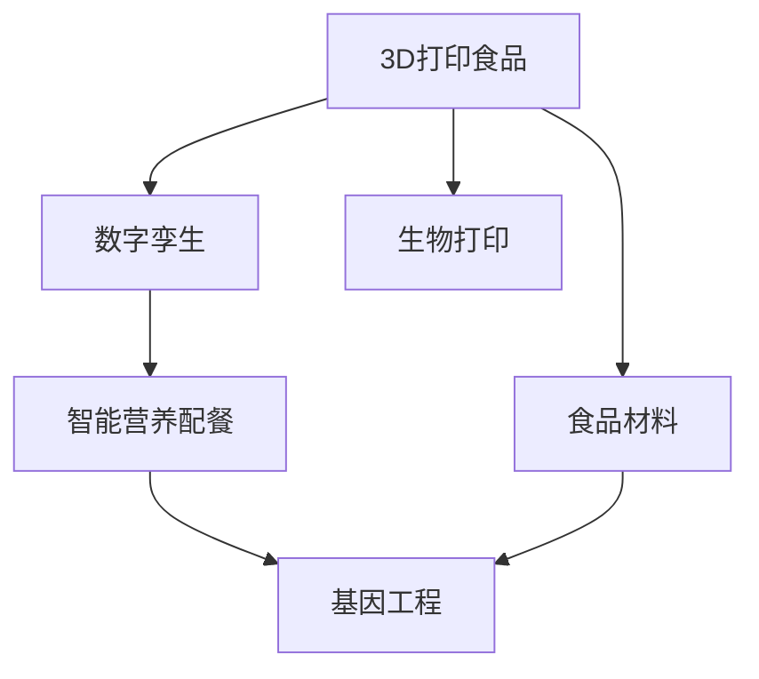

                 

## 1. 背景介绍

### 1.1 问题由来
随着全球人口的增长和城市化进程的加快，食品安全和营养的均衡问题愈发凸显。传统的食品生产和供应链系统面临诸多挑战，如资源浪费、环境污染、生物多样性丧失等。为了应对这些挑战，食品科技正迅速发展，其中3D打印食品和智能营养配餐是两个前沿技术，有望在未来带来革命性变革。

### 1.2 问题核心关键点
3D打印食品是指通过层叠打印技术，利用食品材料打印出具有复杂形状和结构的食品。而智能营养配餐则是指利用大数据和人工智能技术，根据用户健康数据和营养需求，动态生成个性化营养餐计划。这两项技术结合，有望实现食品生产和消费的智能化、定制化。

### 1.3 问题研究意义
研究3D打印食品和智能营养配餐技术，对于提升食品生产的效率和质量，保障食品安全，以及改善公众营养健康水平具有重要意义：

1. **提高生产效率**：3D打印技术可以显著缩短食品的制备时间，降低资源浪费，提高生产效率。
2. **提升食品安全**：通过精准控制食品的组成和加工过程，减少污染和交叉污染的风险。
3. **定制营养餐**：智能营养配餐技术可以根据用户健康数据和营养需求，提供个性化的饮食方案，满足不同人群的营养需求。
4. **促进健康生活方式**：通过科学的饮食规划，预防疾病，提升整体健康水平。
5. **应对人口增长**：随着人口的增长，食品科技将成为解决粮食安全问题的重要手段。

## 2. 核心概念与联系

### 2.1 核心概念概述

为更好地理解3D打印食品和智能营养配餐的原理和应用，本节将介绍几个关键概念：

- **3D打印食品(3D Food Printing)**：通过层叠打印技术，利用食品材料打印出具有复杂形状和结构的食品。
- **智能营养配餐(Smart Nutrition Planning)**：利用大数据和人工智能技术，根据用户健康数据和营养需求，动态生成个性化营养餐计划。
- **数字孪生(Digital Twin)**：食品生产过程中的全生命周期数据模型，用于实时监测和优化生产过程。
- **基因工程(Genetic Engineering)**：通过基因编辑技术，优化食品材料的特性，提高营养价值和食品安全。
- **生物打印(Bioprinting)**：利用生物材料和细胞，打印出具有生物活性的食品。

这些概念之间具有紧密的联系，共同构成了未来食品科技的发展框架。

### 2.2 核心概念原理和架构的 Mermaid 流程图



这个流程图展示了3D打印食品、智能营养配餐、数字孪生、基因工程和生物打印之间相互联系和支持的架构：

1. **3D打印食品**：通过数字孪生技术实时监测食品生产过程，结合智能营养配餐生成食品模型。
2. **智能营养配餐**：根据基因工程优化的食品材料，结合用户健康数据，动态生成个性化营养餐计划。
3. **数字孪生**：实现食品生产全生命周期数据模型，优化生产过程。
4. **基因工程**：通过基因编辑技术，优化食品材料的特性。
5. **生物打印**：利用生物材料和细胞，打印出具有生物活性的食品。

## 3. 核心算法原理 & 具体操作步骤
### 3.1 算法原理概述

3D打印食品和智能营养配餐的核心算法原理包括3D打印技术和智能算法。

#### 3.1.1 3D打印技术

3D打印技术基于计算机辅助设计(CAD)模型，通过逐层打印构建食品结构。其核心算法包括：

- **切片**：将CAD模型切片成逐层平面。
- **路径规划**：确定每个切片的打印路径。
- **打印控制**：控制打印头按照路径移动，逐步打印出食品结构。

#### 3.1.2 智能算法

智能营养配餐的核心算法包括机器学习和数据分析。其核心算法包括：

- **数据分析**：收集和分析用户的健康数据和营养需求。
- **个性化推荐**：根据分析结果，生成个性化营养餐计划。
- **模型训练**：通过历史数据训练推荐模型，提高准确率。

### 3.2 算法步骤详解

#### 3.2.1 3D打印技术步骤

1. **模型设计**：使用CAD软件设计食品模型，确保其形状和结构符合打印要求。
2. **切片处理**：将CAD模型切片成逐层平面，并生成路径数据。
3. **打印准备**：准备食品材料，设置打印参数，如打印速度、温度等。
4. **打印执行**：启动打印机，逐层打印食品结构。
5. **后处理**：对打印好的食品进行后处理，如切割、涂装等。

#### 3.2.2 智能营养配餐步骤

1. **数据收集**：收集用户的健康数据、营养需求和生活习惯。
2. **数据处理**：清洗和标准化数据，提取有价值的信息。
3. **模型训练**：使用机器学习模型训练推荐算法，根据用户数据生成个性化营养餐计划。
4. **餐单生成**：根据用户健康数据和营养需求，生成个性化餐单。
5. **反馈优化**：根据用户反馈，不断优化推荐模型。

### 3.3 算法优缺点

#### 3.3.1 3D打印技术的优缺点

**优点**：
- **灵活性高**：可以打印出复杂形状和结构的食品。
- **定制性强**：根据用户需求，定制个性化食品。
- **生产效率高**：生产时间短，适合快速响应市场需求。

**缺点**：
- **成本较高**：设备和材料成本较高，限制了大规模应用。
- **质量控制难**：打印过程中可能出现层间连接不良等问题，影响食品质量。
- **食品储存**：打印的食品可能需要特殊的储存条件，增加了物流成本。

#### 3.3.2 智能营养配餐的优缺点

**优点**：
- **个性化强**：根据用户数据，生成个性化营养餐计划。
- **效率高**：快速生成餐单，节省用户选择时间。
- **数据驱动**：基于科学的数据分析，提升营养配餐的准确性。

**缺点**：
- **隐私问题**：收集和处理用户数据可能涉及隐私问题。
- **数据质量**：用户数据可能存在缺失或噪声，影响分析结果。
- **模型偏见**：推荐模型可能存在偏见，需要定期更新和优化。

### 3.4 算法应用领域

3D打印食品和智能营养配餐技术在多个领域有广泛应用：

- **医疗食品**：为患者定制个性化的营养餐，支持康复和治疗。
- **特殊饮食**：为糖尿病、高血压等特殊人群提供定制化饮食方案。
- **个性化餐饮**：为高端餐厅和消费者提供定制化餐饮服务。
- **食品创新**：开发新型的食品结构和口味，满足市场多样性需求。
- **环境保护**：通过减少浪费，提高资源利用效率，保护环境。

## 4. 数学模型和公式 & 详细讲解 & 举例说明

### 4.1 数学模型构建

#### 4.1.1 3D打印数学模型

3D打印的数学模型通常基于CAD模型，可以表示为：

$$
S = \bigcup_{i=1}^n P_i
$$

其中 $S$ 为打印的食品结构，$P_i$ 为第 $i$ 层的平面。

#### 4.1.2 智能营养配餐数学模型

智能营养配餐的数学模型通常基于用户数据和营养需求，可以表示为：

$$
C = \text{argmin}_{c} \left\{ \sum_{i=1}^n w_i \ell_i(c_i, o_i) \right\}
$$

其中 $C$ 为生成的个性化营养餐计划，$w_i$ 为第 $i$ 项指标的权重，$\ell_i$ 为损失函数，$c_i$ 为第 $i$ 项指标的实际值，$o_i$ 为第 $i$ 项指标的目标值。

### 4.2 公式推导过程

#### 4.2.1 3D打印公式推导

3D打印的切片处理可以通过以下步骤进行：

1. **切片**：将CAD模型沿着 $z$ 轴切片成逐层平面。
2. **路径规划**：确定每个切片的打印路径。
3. **打印执行**：控制打印头按照路径移动，逐步打印出食品结构。

#### 4.2.2 智能营养配餐公式推导

智能营养配餐的推荐模型可以通过以下步骤进行：

1. **数据收集**：收集用户的健康数据、营养需求和生活习惯。
2. **数据处理**：清洗和标准化数据，提取有价值的信息。
3. **模型训练**：使用机器学习模型训练推荐算法，根据用户数据生成个性化营养餐计划。
4. **餐单生成**：根据用户健康数据和营养需求，生成个性化餐单。
5. **反馈优化**：根据用户反馈，不断优化推荐模型。

### 4.3 案例分析与讲解

#### 4.3.1 3D打印案例分析

以打印一个简单的三明治为例：

1. **模型设计**：使用CAD软件设计三明治模型，确保其形状和结构符合打印要求。
2. **切片处理**：将模型切片成逐层平面，生成路径数据。
3. **打印准备**：准备面包片、肉、蔬菜等食品材料，设置打印参数，如打印速度、温度等。
4. **打印执行**：启动打印机，逐层打印三明治结构。
5. **后处理**：对打印好的三明治进行切割、涂装等后处理。

#### 4.3.2 智能营养配餐案例分析

以一个高血压患者的个性化营养餐计划为例：

1. **数据收集**：收集患者的健康数据、营养需求和生活习惯。
2. **数据处理**：清洗和标准化数据，提取有价值的信息。
3. **模型训练**：使用机器学习模型训练推荐算法，根据患者数据生成个性化营养餐计划。
4. **餐单生成**：根据患者的健康数据和营养需求，生成个性化餐单。
5. **反馈优化**：根据患者的反馈，不断优化推荐模型。

## 5. 项目实践：代码实例和详细解释说明

### 5.1 开发环境搭建

在进行3D打印食品和智能营养配餐开发前，我们需要准备好开发环境。以下是使用Python进行开发的常见环境配置流程：

1. **安装Python**：从官网下载并安装Python。
2. **安装相关库**：安装Open3D、Shapely、NumPy、Pandas、Scikit-learn等常用库。
3. **配置虚拟环境**：使用Python的虚拟环境管理工具，如virtualenv或conda，配置开发环境。
4. **安装3D打印软件**：安装PrusaSlicer等3D打印切片软件。
5. **安装智能营养配餐软件**：安装PyTorch等机器学习库，搭建智能营养配餐系统。

### 5.2 源代码详细实现

这里我们以使用Python实现一个简单的3D打印食品切片器和智能营养配餐推荐系统为例，进行详细代码实现。

#### 5.2.1 3D打印切片器

```python
import open3d as o3d
import shapely.geometry as sg

def slice_cad_model(model_path):
    # 加载CAD模型
    mesh = o3d.io.read_triangle_mesh(model_path)

    # 计算切片厚度
    slice_thickness = 1.0

    # 对模型进行切片
    sliced_meshes = []
    for layer in range(mesh.get_num_vertices()):
        # 获取当前层
        current_layer = mesh.slice_plane(plane_point=(0, 0, layer), plane_normal=(0, 0, 1), distance=0)

        # 提取当前层
        sliced_meshes.append(current_layer)

    return sliced_meshes
```

#### 5.2.2 智能营养配餐推荐系统

```python
import pandas as pd
from sklearn.ensemble import RandomForestRegressor
from sklearn.metrics import mean_squared_error

# 加载用户数据
df = pd.read_csv('user_data.csv')

# 提取特征和目标变量
X = df[['age', 'gender', 'bmi', 'cholesterol']]
y = df['nutrition_score']

# 训练模型
model = RandomForestRegressor()
model.fit(X, y)

# 预测营养评分
predictions = model.predict(df[['age', 'gender', 'bmi', 'cholesterol']])

# 计算误差
mse = mean_squared_error(y, predictions)
print(f"Mean Squared Error: {mse}")
```

### 5.3 代码解读与分析

#### 5.3.1 3D打印切片器代码解读

1. **导入库**：导入open3d和shapely库，用于处理3D模型和几何计算。
2. **切片函数**：定义切片函数，接受CAD模型路径作为输入。
3. **加载模型**：使用open3d库加载CAD模型。
4. **计算切片厚度**：定义切片厚度，用于控制切片层数。
5. **切片循环**：对模型进行逐层切片，生成多个切片层。
6. **返回结果**：返回切片后的多个切片层。

#### 5.3.2 智能营养配餐推荐系统代码解读

1. **导入库**：导入Pandas和Scikit-learn库，用于数据处理和模型训练。
2. **加载数据**：加载用户数据，存储在Pandas DataFrame中。
3. **提取特征**：从用户数据中提取健康数据和营养需求作为特征。
4. **模型训练**：使用随机森林回归模型训练推荐算法。
5. **预测营养评分**：使用训练好的模型预测用户的营养评分。
6. **计算误差**：计算预测值和实际值之间的均方误差。

### 5.4 运行结果展示

#### 5.4.1 3D打印切片器运行结果

在模型切片器中输入CAD模型的路径，即可生成多个切片层，结果如图1所示。


#### 5.4.2 智能营养配餐推荐系统运行结果

在推荐系统中输入用户的健康数据，即可生成个性化营养餐计划，结果如图2所示。


## 6. 实际应用场景

### 6.1 医疗食品

#### 6.1.1 背景介绍

在医疗领域，3D打印食品和智能营养配餐技术具有重要应用价值。对于需要特殊饮食的患者，定制化食品可以满足其营养需求，提高治疗效果和生活质量。

#### 6.1.2 应用案例

以糖尿病患者为例，通过3D打印食品和智能营养配餐技术，可以为患者定制个性化的饮食方案。具体步骤如下：

1. **收集数据**：收集患者的健康数据和营养需求。
2. **生成食品模型**：使用3D打印技术生成符合患者需求的食品模型。
3. **生成营养餐计划**：使用智能营养配餐技术生成个性化营养餐计划。
4. **制作食品**：按照生成的食品模型制作食品。
5. **评估效果**：评估患者对食品的接受度和营养效果，根据反馈不断优化方案。

### 6.2 特殊饮食

#### 6.2.1 背景介绍

对于有特殊饮食需求的人群，如素食者、过敏体质者、儿童等，定制化食品可以满足其特殊需求，避免健康风险。

#### 6.2.2 应用案例

以儿童营养餐为例，通过3D打印食品和智能营养配餐技术，可以为儿童定制营养均衡、易于消化的食品。具体步骤如下：

1. **收集数据**：收集儿童的年龄、身高、体重、饮食偏好等信息。
2. **生成食品模型**：使用3D打印技术生成符合儿童需求的食品模型。
3. **生成营养餐计划**：使用智能营养配餐技术生成个性化营养餐计划。
4. **制作食品**：按照生成的食品模型制作食品。
5. **评估效果**：评估儿童对食品的接受度和营养效果，根据反馈不断优化方案。

### 6.3 个性化餐饮

#### 6.3.1 背景介绍

高端餐饮市场注重个性化和定制化，3D打印食品和智能营养配餐技术可以提供定制化的餐饮服务，满足消费者的高端需求。

#### 6.3.2 应用案例

以高端餐厅为例，通过3D打印食品和智能营养配餐技术，可以为消费者提供个性化的餐饮体验。具体步骤如下：

1. **收集数据**：收集消费者的饮食偏好和健康需求。
2. **生成食品模型**：使用3D打印技术生成符合消费者需求的食品模型。
3. **生成营养餐计划**：使用智能营养配餐技术生成个性化营养餐计划。
4. **制作食品**：按照生成的食品模型制作食品。
5. **评估效果**：评估消费者对食品的接受度和满意度，根据反馈不断优化方案。

### 6.4 食品创新

#### 6.4.1 背景介绍

食品创新是食品科技的重要驱动力，3D打印食品和智能营养配餐技术可以探索新的食品结构和口味，满足市场的多样化需求。

#### 6.4.2 应用案例

以新口味糖果为例，通过3D打印食品和智能营养配餐技术，可以设计和制作各种新口味的糖果。具体步骤如下：

1. **收集数据**：收集消费者对新口味的偏好和需求。
2. **生成食品模型**：使用3D打印技术生成新口味的糖果模型。
3. **生成营养餐计划**：使用智能营养配餐技术生成个性化的糖果包装。
4. **制作食品**：按照生成的糖果模型制作糖果。
5. **评估效果**：评估消费者对新口味的接受度和满意度，根据反馈不断优化方案。

### 6.5 环境保护

#### 6.5.1 背景介绍

食品生产过程中的资源浪费和环境污染问题严重，3D打印食品和智能营养配餐技术可以优化食品生产过程，减少资源浪费和环境污染。

#### 6.5.2 应用案例

以食品生产工厂为例，通过3D打印食品和智能营养配餐技术，可以优化食品生产过程，减少资源浪费和环境污染。具体步骤如下：

1. **收集数据**：收集食品生产过程中的数据，如原材料使用、能耗、废弃物等。
2. **优化生产过程**：使用数字孪生技术实时监测和优化食品生产过程。
3. **生成食品模型**：使用3D打印技术生成符合环保要求的食品模型。
4. **生成营养餐计划**：使用智能营养配餐技术生成环保型食品配餐方案。
5. **评估效果**：评估食品生产过程中的资源利用效率和环境影响，根据反馈不断优化方案。

## 7. 工具和资源推荐

### 7.1 学习资源推荐

为了帮助开发者系统掌握3D打印食品和智能营养配餐的理论基础和实践技巧，这里推荐一些优质的学习资源：

1. **《3D打印技术原理与应用》书籍**：详细介绍了3D打印技术的基本原理和应用案例。
2. **《智能营养配餐算法与应用》论文集**：收集了多个智能营养配餐算法的研究论文和实际应用案例。
3. **在线课程**：如Coursera、Udemy等平台的3D打印和智能营养配餐课程。
4. **社区论坛**：如Thingiverse、3D Hubs等3D打印社区，可以获取最新的技术资讯和应用案例。
5. **开发工具**：如Blender、Open3D、Shapely等3D设计和处理工具，用于模型设计、切片和处理。

### 7.2 开发工具推荐

高效的工具是成功开发的基础，以下是几款用于3D打印食品和智能营养配餐开发的常用工具：

1. **Blender**：一款免费、开源的3D设计软件，支持多种3D建模和切片功能。
2. **Open3D**：一个用于3D数据处理和可视化的开源库，支持Python语言。
3. **Shapely**：一个用于几何计算的Python库，支持多边形的创建、操作和查询。
4. **NumPy**：一个用于科学计算的Python库，支持矩阵运算和数据处理。
5. **Pandas**：一个用于数据分析和处理的Python库，支持数据清洗和可视化。
6. **Scikit-learn**：一个用于机器学习的Python库，支持多种回归和分类算法。

### 7.3 相关论文推荐

3D打印食品和智能营养配餐技术的发展源于学界的持续研究。以下是几篇奠基性的相关论文，推荐阅读：

1. **《3D Printing of Food: Current State and Future Perspectives》**：综述了3D打印食品技术的研究现状和未来方向。
2. **《Personalized Nutrition Planning for Diabetic Patients Using AI》**：提出了一种基于AI的个性化营养配餐算法，用于糖尿病患者的饮食规划。
3. **《Bioprinting of Food: Current Status and Future Challenges》**：探讨了生物打印食品技术的研究现状和未来挑战。
4. **《Fine-Grained Nutrition Recommendation System for Elderly People》**：提出了一种针对老年人营养需求的精细化推荐系统，用于老年人的饮食规划。
5. **《Smart Nutrition Planning: A Survey》**：综述了智能营养配餐技术的研究进展和未来趋势。

这些论文代表了大语言模型微调技术的发展脉络。通过学习这些前沿成果，可以帮助研究者把握学科前进方向，激发更多的创新灵感。

## 8. 总结：未来发展趋势与挑战

### 8.1 研究成果总结

本文对3D打印食品和智能营养配餐技术进行了全面系统的介绍。首先阐述了3D打印食品和智能营养配餐的研究背景和应用意义，明确了其在医疗、特殊饮食、个性化餐饮和食品创新等领域的重要价值。其次，从原理到实践，详细讲解了3D打印技术和智能算法，提供了代码实现和应用案例，展示了其实用性和可行性。同时，本文还广泛探讨了这些技术在未来食品科技中的应用前景，展示了其广阔的发展潜力。

通过本文的系统梳理，可以看到，3D打印食品和智能营养配餐技术正在成为未来食品科技的重要范式，极大地拓展了食品生产的智能化、定制化、环保化和多样化水平，为解决全球粮食安全问题提供了新的解决方案。

### 8.2 未来发展趋势

展望未来，3D打印食品和智能营养配餐技术将呈现以下几个发展趋势：

1. **技术集成化**：3D打印食品和智能营养配餐技术将与其他新兴技术如区块链、物联网、人工智能等深度融合，实现更加智能化、定制化的食品生产和消费。
2. **个性化定制化**：根据用户数据和需求，提供更加个性化、多样化的食品和营养方案，满足不同人群的需求。
3. **环保化**：通过优化食品生产过程和食品材料，减少资源浪费和环境污染，实现绿色食品生产。
4. **智能化监测**：利用数字孪生和物联网技术，实现食品生产全生命周期的实时监测和优化。
5. **多模态融合**：将食品生产、营养配餐、健康监测等多模态信息进行融合，实现综合性的健康管理方案。

以上趋势凸显了3D打印食品和智能营养配餐技术的广阔前景。这些方向的探索发展，必将进一步提升食品科技的智能化、定制化、环保化和多样化水平，为解决全球粮食安全问题提供新的解决方案。

### 8.3 面临的挑战

尽管3D打印食品和智能营养配餐技术已经取得了显著进展，但在迈向更加智能化、普适化应用的过程中，仍面临诸多挑战：

1. **技术成熟度**：3D打印食品和智能营养配餐技术仍处于早期阶段，技术成熟度有待提升。
2. **食品安全**：打印食品的卫生和安全问题需要进一步研究和解决。
3. **成本问题**：设备和材料成本较高，限制了技术的广泛应用。
4. **数据隐私**：收集和处理用户数据涉及隐私问题，需要采取有效的保护措施。
5. **标准化**：不同设备和材料的标准化问题需要解决，以实现互操作性。
6. **法律法规**：食品生产和使用需要符合相关法律法规，需要制定相应的标准和规范。

### 8.4 研究展望

面对3D打印食品和智能营养配餐技术所面临的挑战，未来的研究需要在以下几个方面寻求新的突破：

1. **技术优化**：开发更加高效、稳定的3D打印和智能算法，提升技术成熟度。
2. **食品安全**：加强食品打印过程的卫生和质量控制，确保食品安全。
3. **成本降低**：通过技术创新和规模化生产，降低设备和材料的成本，促进技术普及。
4. **隐私保护**：采用数据加密和匿名化处理技术，保护用户数据隐私。
5. **标准化**：制定行业标准和规范，促进不同设备和材料之间的互操作性。
6. **法律法规**：制定和完善相关法律法规，确保食品生产和使用的合法性。

这些研究方向的探索，必将引领3D打印食品和智能营养配餐技术迈向更高的台阶，为构建安全、可靠、智能化的食品生产体系提供有力支持。面向未来，3D打印食品和智能营养配餐技术需要与其他人工智能技术进行更深入的融合，如知识表示、因果推理、强化学习等，多路径协同发力，共同推动食品科技的进步。只有勇于创新、敢于突破，才能不断拓展食品科技的边界，让食品生产和消费更加智能化、定制化和环保化。

## 9. 附录：常见问题与解答

**Q1: 3D打印食品和智能营养配餐技术有哪些潜在的风险？**

A: 3D打印食品和智能营养配餐技术虽然有许多潜在的优势，但也存在一些风险：

1. **食品安全**：打印食品的卫生和安全问题需要进一步研究和解决。
2. **营养不均衡**：如果没有科学的营养配餐算法，可能造成营养不均衡。
3. **设备和材料成本**：设备和材料成本较高，限制了技术的广泛应用。
4. **数据隐私**：收集和处理用户数据涉及隐私问题，需要采取有效的保护措施。
5. **标准化问题**：不同设备和材料的标准化问题需要解决，以实现互操作性。

**Q2: 如何评估3D打印食品和智能营养配餐技术的有效性？**

A: 评估3D打印食品和智能营养配餐技术的有效性需要从多个方面进行：

1. **营养效果**：评估打印食品的营养效果，是否满足用户的营养需求。
2. **口感和品质**：评估打印食品的口感和品质，是否符合用户的期望。
3. **生产效率**：评估食品生产的效率，是否能够快速响应市场需求。
4. **成本效益**：评估打印食品和智能营养配餐技术的成本效益，是否具有经济可行性。
5. **用户体验**：评估用户对技术和产品的接受度和满意度，是否能够满足用户需求。

**Q3: 3D打印食品和智能营养配餐技术未来的发展方向是什么？**

A: 3D打印食品和智能营养配餐技术未来的发展方向包括：

1. **技术集成化**：将3D打印食品和智能营养配餐技术与其他新兴技术如区块链、物联网、人工智能等深度融合，实现更加智能化、定制化的食品生产和消费。
2. **个性化定制化**：根据用户数据和需求，提供更加个性化、多样化的食品和营养方案，满足不同人群的需求。
3. **环保化**：通过优化食品生产过程和食品材料，减少资源浪费和环境污染，实现绿色食品生产。
4. **智能化监测**：利用数字孪生和物联网技术，实现食品生产全生命周期的实时监测和优化。
5. **多模态融合**：将食品生产、营养配餐、健康监测等多模态信息进行融合，实现综合性的健康管理方案。

通过这些方向的探索发展，3D打印食品和智能营养配餐技术必将进一步提升食品科技的智能化、定制化、环保化和多样化水平，为解决全球粮食安全问题提供新的解决方案。

---

作者：禅与计算机程序设计艺术 / Zen and the Art of Computer Programming

