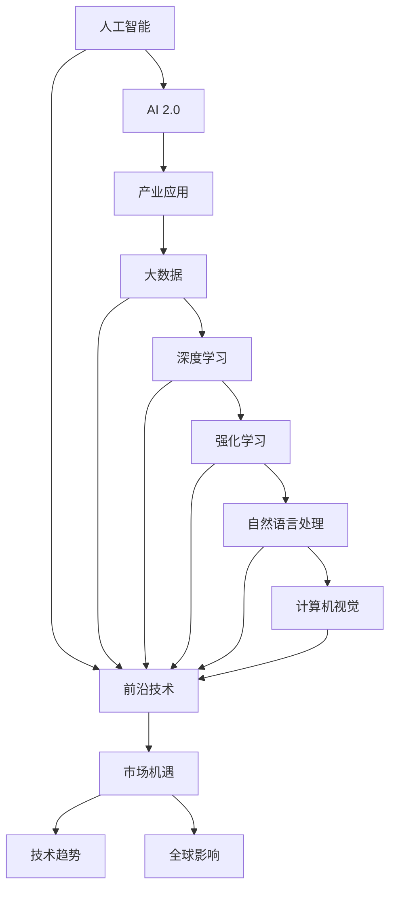
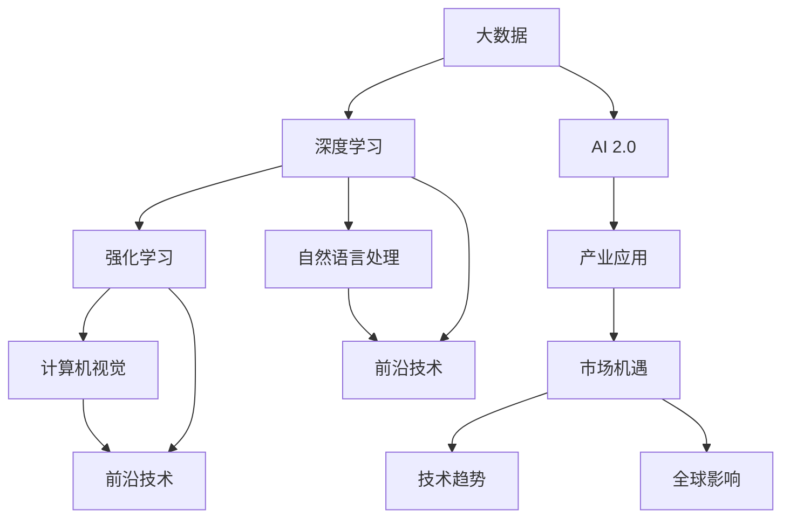
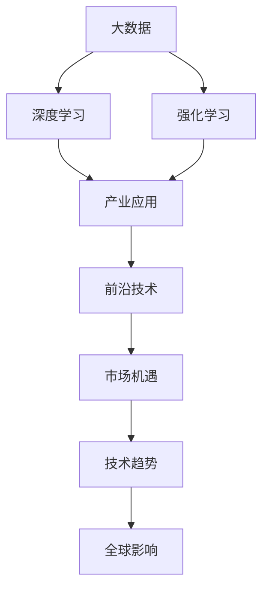
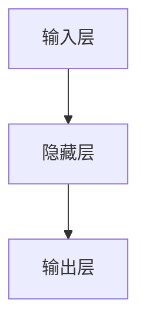

                 

# 李开复：AI 2.0 时代的产业

> 关键词：人工智能, AI 2.0, 产业应用, 前沿技术, 创新驱动, 技术趋势, 市场机遇, 全球影响

## 1. 背景介绍

### 1.1 问题由来
随着人工智能(AI)技术的迅速发展，AI 2.0时代正在悄然来临。AI 2.0强调以数据为驱动，通过大数据、深度学习和强化学习等前沿技术，实现更高效、更智能的自动化和智能化。AI 2.0的核心理念是“智能计算+人类智慧”，即在处理大量数据的同时，注入人类的经验和直觉，从而实现更精准的决策和更智能的交互。

AI 2.0的发展，已经从早期的研究与应用，逐步进入深度应用与产业化阶段。AI 2.0正在推动各行各业的数字化转型和智能化升级，为全球经济带来了前所未有的机遇与挑战。从自动驾驶、医疗诊断、金融风险管理到智慧城市建设，AI 2.0的应用场景日益广泛，对产业结构、商业模式和社会治理产生了深远影响。

### 1.2 问题核心关键点
AI 2.0的核心在于如何将前沿技术应用到产业中，创造实际价值。本文将从以下几个关键点探讨AI 2.0产业化的核心问题：

- **技术前沿**：AI 2.0的前沿技术包括大数据、深度学习、强化学习、自然语言处理、计算机视觉等。这些技术的突破，为AI 2.0产业应用提供了强有力的技术支持。
- **产业应用**：AI 2.0技术如何具体应用到各行各业中，创造新的价值和业务机会。
- **市场机遇**：AI 2.0技术带来的市场变化和商业机会，如新市场、新企业、新业态等。
- **技术趋势**：AI 2.0技术的发展趋势，如跨领域融合、多模态学习、知识图谱等。
- **全球影响**：AI 2.0技术对全球经济、社会、治理等方面的深远影响。

## 2. 核心概念与联系

### 2.1 核心概念概述

AI 2.0时代，核心概念包括：

- **人工智能(AI)**：通过机器学习、深度学习等技术，使机器具备类人智能。
- **AI 2.0**：强调以数据为驱动，结合人类的经验和直觉，实现更高效、更智能的自动化和智能化。
- **产业应用**：AI 2.0技术在各个行业的具体应用场景。
- **前沿技术**：包括大数据、深度学习、强化学习、自然语言处理、计算机视觉等。
- **市场机遇**：AI 2.0技术带来的市场变化和商业机会。
- **技术趋势**：AI 2.0技术的发展趋势，如跨领域融合、多模态学习、知识图谱等。
- **全球影响**：AI 2.0技术对全球经济、社会、治理等方面的深远影响。

这些核心概念之间的关系如下图所示：



### 2.2 核心概念原理和架构的 Mermaid 流程图



这些核心概念构成了AI 2.0时代产业化的基础框架，通过技术和产业的深度融合，推动AI 2.0在各个领域的应用和发展。

## 3. 核心算法原理 & 具体操作步骤

### 3.1 算法原理概述

AI 2.0的核心算法包括大数据、深度学习、强化学习等前沿技术。这些技术的结合，使得AI 2.0能够在处理海量数据的同时，实现复杂任务的智能自动化。

- **大数据**：通过收集和分析海量数据，发现数据中的模式和趋势，为AI 2.0提供数据基础。
- **深度学习**：通过多层神经网络模型，从数据中学习复杂的特征表示，实现高效的智能推理和决策。
- **强化学习**：通过试错学习，优化决策策略，实现智能系统的自我优化和适应。

AI 2.0的算法原理如下图所示：



### 3.2 算法步骤详解

AI 2.0的应用流程包括以下几个关键步骤：

1. **数据收集与预处理**：收集与AI应用相关的数据，进行清洗、标注、划分等预处理工作。
2. **模型训练与优化**：使用大数据、深度学习、强化学习等技术，训练和优化AI模型，提升模型的智能水平。
3. **模型评估与验证**：通过实验和测试，评估模型性能，进行必要的调整和优化。
4. **模型部署与应用**：将训练好的模型部署到实际应用场景中，进行自动化决策和智能交互。
5. **持续学习与改进**：通过在线学习、反馈机制等，持续优化模型，提升AI应用的智能水平。

### 3.3 算法优缺点

AI 2.0的算法具有以下优点：

- **高效性**：大数据和深度学习技术使得AI 2.0能够高效处理和分析海量数据，实现自动化决策和智能推理。
- **适应性强**：强化学习技术使得AI 2.0能够根据环境变化进行自我优化和适应，提高系统的稳定性和鲁棒性。
- **应用广泛**：AI 2.0技术可以应用于各种领域，如医疗、金融、制造、交通等，具有广泛的适用性。

同时，AI 2.0算法也存在一些缺点：

- **数据依赖**：AI 2.0技术需要大量高质量的数据支持，数据质量差或数据量不足会影响模型效果。
- **复杂性高**：大数据、深度学习、强化学习等技术复杂度高，需要高水平的技术团队进行开发和维护。
- **伦理风险**：AI 2.0技术在应用过程中可能存在伦理和法律风险，如隐私保护、公平性问题等。

### 3.4 算法应用领域

AI 2.0技术在各个领域的应用场景如下：

- **医疗健康**：通过深度学习和大数据分析，实现疾病诊断、智能诊疗、个性化医疗等。
- **金融服务**：通过强化学习和数据分析，实现风险管理、智能投顾、量化交易等。
- **智能制造**：通过大数据分析和机器学习，实现生产优化、质量控制、智能维护等。
- **自动驾驶**：通过计算机视觉和深度学习，实现自动驾驶、智能交通、车辆监控等。
- **智慧城市**：通过大数据分析和人工智能，实现城市管理、智慧交通、公共安全等。

## 4. 数学模型和公式 & 详细讲解 & 举例说明

### 4.1 数学模型构建

AI 2.0的数学模型包括深度神经网络、强化学习模型等。以深度神经网络为例，其基本模型结构如下图所示：



其中，输入层接收数据特征，隐藏层进行特征提取和处理，输出层生成模型预测结果。

### 4.2 公式推导过程

以深度神经网络的反向传播算法为例，其公式推导如下：

$$
\frac{\partial L}{\partial w_j} = \frac{\partial L}{\partial z_j} \cdot \frac{\partial z_j}{\partial w_j}
$$

其中，$L$ 为损失函数，$w_j$ 为权重，$z_j$ 为隐藏层输出。反向传播算法通过链式法则，计算每个权重的梯度，用于更新模型参数。

### 4.3 案例分析与讲解

以智能医疗为例，通过深度学习和大数据分析，可以构建智能诊疗系统。系统接收患者的症状、病史等数据，经过深度学习模型的分析和预测，生成诊疗建议和风险评估报告。

在模型训练阶段，可以使用大规模医疗数据进行训练，构建多层的深度神经网络。通过反向传播算法，优化模型参数，提升模型的智能水平。在模型应用阶段，将新患者的症状数据输入模型，生成诊断报告和治疗方案，辅助医生进行决策。

## 5. 项目实践：代码实例和详细解释说明

### 5.1 开发环境搭建

开发环境包括Python、TensorFlow、Keras等。具体步骤如下：

1. 安装Python和相关依赖包。
2. 安装TensorFlow和Keras，配置GPU/TPU等算力资源。
3. 搭建深度学习模型，进行模型训练和验证。

### 5.2 源代码详细实现

以智能医疗为例，代码实现步骤如下：

1. 数据准备：收集和预处理医疗数据。
2. 模型定义：使用Keras构建深度神经网络模型。
3. 模型训练：使用TensorFlow训练模型，调整超参数。
4. 模型评估：在测试数据集上评估模型性能。
5. 模型部署：将训练好的模型部署到实际应用场景中。

### 5.3 代码解读与分析

深度学习模型代码实现如下：

```python
import tensorflow as tf
from tensorflow.keras import layers, models

# 构建深度神经网络模型
model = models.Sequential([
    layers.Dense(128, activation='relu', input_shape=(10,)),
    layers.Dense(10, activation='softmax')
])

# 编译模型
model.compile(optimizer='adam',
              loss='categorical_crossentropy',
              metrics=['accuracy'])

# 训练模型
history = model.fit(train_data, train_labels, epochs=10, validation_data=(test_data, test_labels))

# 评估模型
test_loss, test_acc = model.evaluate(test_data, test_labels)
print('Test accuracy:', test_acc)
```

代码中，首先定义了一个包含两个全连接层的深度神经网络模型。然后使用Adam优化器和交叉熵损失函数编译模型，并使用训练数据和标签进行训练。最后评估模型在测试数据集上的性能，输出测试准确率。

## 6. 实际应用场景

### 6.1 智能客服系统

AI 2.0技术在智能客服系统中的应用，通过深度学习和自然语言处理，实现自动化客户服务。具体步骤如下：

1. 数据收集：收集历史客服对话数据，进行清洗和标注。
2. 模型训练：使用对话数据训练深度神经网络模型，构建问答系统。
3. 模型应用：将训练好的模型部署到客服系统中，实现智能对话。
4. 持续优化：根据用户反馈，持续优化模型，提升客服体验。

### 6.2 金融风险管理

AI 2.0技术在金融风险管理中的应用，通过深度学习和强化学习，实现风险预测和风险管理。具体步骤如下：

1. 数据收集：收集历史交易数据，进行清洗和标注。
2. 模型训练：使用交易数据训练深度神经网络和强化学习模型，构建风险预测系统。
3. 模型应用：将训练好的模型部署到交易系统中，实现风险评估和预警。
4. 持续优化：根据市场变化，持续优化模型，提升风险管理水平。

### 6.3 智慧城市建设

AI 2.0技术在智慧城市建设中的应用，通过大数据分析和人工智能，实现城市管理智能化。具体步骤如下：

1. 数据收集：收集城市各项数据，进行清洗和标注。
2. 模型训练：使用城市数据训练深度学习模型，构建城市管理平台。
3. 模型应用：将训练好的模型部署到城市管理系统中，实现智能交通、公共安全等应用。
4. 持续优化：根据城市变化，持续优化模型，提升城市管理水平。

### 6.4 未来应用展望

AI 2.0技术的应用前景非常广阔，未来的发展方向包括：

1. **跨领域融合**：AI 2.0技术将与物联网、云计算、区块链等技术融合，实现更全面、更智能的自动化和智能化。
2. **多模态学习**：AI 2.0技术将融合视觉、语音、文本等多种模态数据，实现更全面、更精确的智能推理和决策。
3. **知识图谱**：AI 2.0技术将构建大规模知识图谱，实现更系统、更全面的知识管理。
4. **自动化决策**：AI 2.0技术将实现更高效、更智能的自动化决策和智能交互。
5. **伦理和法律**：AI 2.0技术将注重伦理和法律问题，确保数据安全和公平性。

## 7. 工具和资源推荐

### 7.1 学习资源推荐

1. 《深度学习》（Goodfellow等人著）：经典深度学习教材，涵盖深度学习的基础理论和算法。
2. 《人工智能：一种现代方法》（Russell和Norvig著）：AI领域经典教材，涵盖AI的基础理论、算法和应用。
3. 《TensorFlow实战》（李沐著）：TensorFlow实战指南，涵盖TensorFlow的基本应用和实践技巧。
4. 《自然语言处理综论》（Jurafsky和Martin著）：自然语言处理经典教材，涵盖自然语言处理的基础理论、算法和应用。
5. 《机器学习实战》（Peter Harrington著）：机器学习实战指南，涵盖机器学习的基本理论和算法。

### 7.2 开发工具推荐

1. Python：Python是AI 2.0开发的主流编程语言，具有丰富的库和工具支持。
2. TensorFlow：开源深度学习框架，支持GPU/TPU等高性能计算。
3. PyTorch：开源深度学习框架，支持动态图和静态图。
4. Keras：高层次深度学习API，易于使用和快速开发。
5. Jupyter Notebook：交互式编程环境，支持数据可视化和模型调试。

### 7.3 相关论文推荐

1. "Large-Scale Deep Neural Networks for Image Recognition"（Hinton等人，2009）：提出大规模深度神经网络，用于图像识别。
2. "Deep Residual Learning for Image Recognition"（He等人，2016）：提出残差网络，解决深度神经网络训练困难的问题。
3. "Attention is All You Need"（Vaswani等人，2017）：提出Transformer模型，实现高效的多模态智能推理。
4. "Learning to predict and optimize via graph neural networks"（Gin等人，2018）：提出图神经网络，用于复杂系统的优化和预测。
5. "Human-Computer Interaction through Natural Language Understanding"（Levesque等人，2011）：提出自然语言理解技术，实现人机交互的智能化。

## 8. 总结：未来发展趋势与挑战

### 8.1 研究成果总结

AI 2.0技术的发展，已经从早期的研究与应用，逐步进入深度应用与产业化阶段。AI 2.0技术在各个领域的应用，推动了产业的数字化转型和智能化升级，为全球经济带来了新的增长点。

### 8.2 未来发展趋势

1. **技术进步**：AI 2.0技术将继续突破，深度学习、强化学习、自然语言处理等前沿技术将不断进步，推动AI 2.0技术的发展。
2. **应用拓展**：AI 2.0技术将广泛应用于医疗、金融、制造、交通等领域，推动各个行业的数字化转型和智能化升级。
3. **跨领域融合**：AI 2.0技术将与物联网、云计算、区块链等技术融合，实现更全面、更智能的自动化和智能化。
4. **多模态学习**：AI 2.0技术将融合视觉、语音、文本等多种模态数据，实现更全面、更精确的智能推理和决策。
5. **知识图谱**：AI 2.0技术将构建大规模知识图谱，实现更系统、更全面的知识管理。
6. **自动化决策**：AI 2.0技术将实现更高效、更智能的自动化决策和智能交互。

### 8.3 面临的挑战

1. **数据依赖**：AI 2.0技术需要大量高质量的数据支持，数据质量差或数据量不足会影响模型效果。
2. **技术复杂性高**：AI 2.0技术复杂度高，需要高水平的技术团队进行开发和维护。
3. **伦理风险**：AI 2.0技术在应用过程中可能存在伦理和法律风险，如隐私保护、公平性问题等。
4. **市场竞争**：AI 2.0技术竞争激烈，企业需要持续创新，才能保持竞争优势。
5. **技术壁垒**：AI 2.0技术存在一定的技术壁垒，企业需要持续投入，才能掌握核心技术。

### 8.4 研究展望

1. **创新驱动**：持续创新，开发新技术和新算法，推动AI 2.0技术的发展。
2. **跨领域融合**：与其他技术进行深度融合，实现更全面、更智能的自动化和智能化。
3. **伦理和法律**：注重伦理和法律问题，确保数据安全和公平性。
4. **市场拓展**：拓展市场应用，推动AI 2.0技术的产业化进程。

## 9. 附录：常见问题与解答

**Q1：AI 2.0技术有哪些应用场景？**

A: AI 2.0技术可以应用于医疗、金融、制造、交通等多个领域。具体应用场景包括智能客服、金融风险管理、智慧城市建设等。

**Q2：AI 2.0技术有哪些优点和缺点？**

A: AI 2.0技术的优点包括高效性、适应性强、应用广泛等。缺点包括数据依赖、技术复杂性高、伦理风险等。

**Q3：AI 2.0技术的发展趋势是什么？**

A: AI 2.0技术的发展趋势包括技术进步、应用拓展、跨领域融合、多模态学习、知识图谱、自动化决策等。

**Q4：AI 2.0技术在应用过程中需要注意哪些问题？**

A: AI 2.0技术在应用过程中需要注意数据质量、技术复杂性、伦理风险、市场竞争、技术壁垒等问题。

**Q5：AI 2.0技术未来的发展方向是什么？**

A: AI 2.0技术未来的发展方向包括创新驱动、跨领域融合、伦理和法律、市场拓展等。

---

作者：禅与计算机程序设计艺术 / Zen and the Art of Computer Programming

