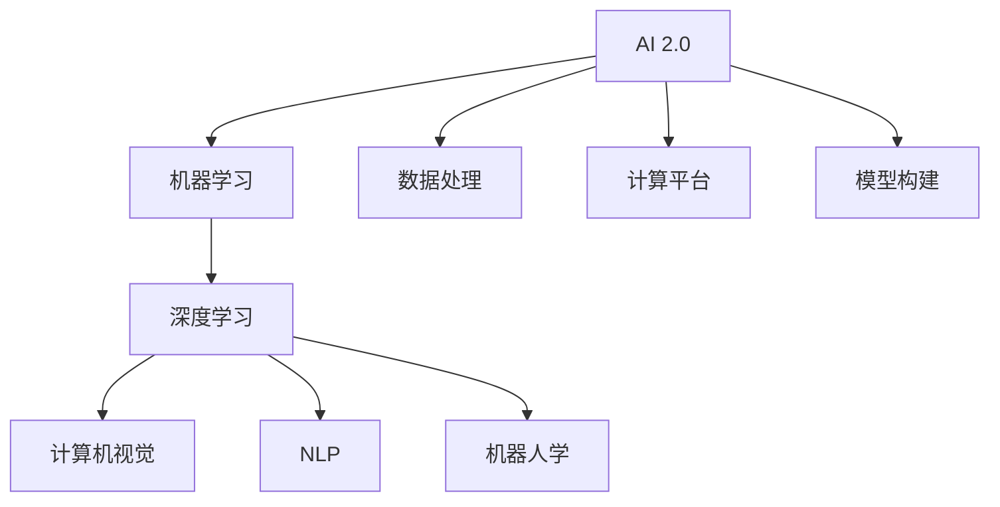
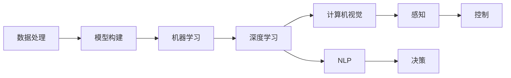

                 

# 李开复：AI 2.0 时代的应用

> 关键词：AI 2.0, 人工智能, 机器学习, 深度学习, 自然语言处理, 计算机视觉, 机器人学, 应用场景, 未来趋势

## 1. 背景介绍

在人工智能（AI）领域，近年来发生了翻天覆地的变化。从2013年的“算法竞赛”式人工智能，到2016年提出的“通用人工智能”，再到2020年提出的“AI 2.0”时代，AI的演进呈现出从狭义到广义、从专有技术到全栈解决方案的趋势。AI 2.0 强调的是大规模、可解释、易操作、跨领域的能力，这不仅仅是指技术上的突破，更代表着一个全新的AI应用时代正在到来。本文将探讨AI 2.0时代的应用场景，以及这一时代对各行各业的深远影响。

## 2. 核心概念与联系

### 2.1 核心概念概述

在讨论AI 2.0时代的应用之前，我们先梳理一下与之紧密相关的几个核心概念：

- **AI 2.0**：这是继算法竞赛、通用人工智能之后，业界提出的一个新概念。AI 2.0 强调的是AI技术在广泛场景中的应用，不仅包括深度学习和机器学习算法，还包括数据处理、计算平台、模型构建等全栈能力。

- **机器学习**：通过算法让机器具有从数据中学习并自主做出决策的能力。机器学习是AI 2.0的重要组成部分，涉及到监督学习、无监督学习和强化学习等多种类型。

- **深度学习**：一种特殊的机器学习方法，通过多层神经网络模拟人脑的神经网络结构，用于图像识别、语音识别、自然语言处理等领域。

- **自然语言处理（NLP）**：处理人类语言的技术，包括文本分类、情感分析、机器翻译、自动摘要等应用。

- **计算机视觉**：使用计算机算法对图像和视频进行分析，包括物体识别、人脸识别、图像分割等任务。

- **机器人学**：研究如何使机器人能够执行复杂任务，涵盖了感知、决策、控制等诸多方面。

这些核心概念构成了AI 2.0时代的技术基础，其相互联系如下图所示：



### 2.2 核心概念原理和架构的 Mermaid 流程图

为了更好地理解这些概念的联系，我们通过以下Mermaid流程图进一步展示：



## 3. 核心算法原理 & 具体操作步骤

### 3.1 算法原理概述

AI 2.0时代的算法原理主要基于数据驱动的机器学习和深度学习。机器学习通过算法让机器从数据中学习，而深度学习则是通过多层神经网络进行复杂的特征提取和模式识别。以下是AI 2.0时代一些核心算法原理的概述：

- **监督学习**：通过有标签的数据训练模型，使其能够对新数据进行分类、回归等任务。监督学习在NLP和计算机视觉中应用广泛。

- **无监督学习**：从无标签的数据中学习模式，用于聚类、降维等任务。无监督学习在推荐系统和异常检测中具有重要应用。

- **强化学习**：通过与环境交互，使机器通过不断尝试和调整策略，以最大化长期奖励。强化学习在游戏和机器人控制中应用较多。

- **深度学习框架**：如TensorFlow、PyTorch等，提供了高效的模型构建和训练功能，使得AI模型开发和部署变得更为便捷。

### 3.2 算法步骤详解

AI 2.0时代的算法步骤通常包括以下几个关键环节：

1. **数据准备**：收集和清洗数据，确保数据的完整性和质量。
2. **模型选择与构建**：根据任务类型选择适合的模型，并进行相应的参数设置和构建。
3. **模型训练与验证**：使用训练集对模型进行训练，并使用验证集进行参数调优和性能评估。
4. **模型部署与优化**：将训练好的模型部署到生产环境，并进行必要的优化和调整，以确保其在高负载情况下的性能。

### 3.3 算法优缺点

AI 2.0时代的算法具有以下优点：

- **泛化能力更强**：深度学习模型通过多层神经网络，可以处理复杂的特征和模式。
- **可解释性提升**：通过引入可视化工具和可解释模型，AI模型的决策过程变得更加透明。
- **跨领域应用广泛**：AI 2.0时代强调全栈能力，涵盖了多种技术领域，如计算机视觉、自然语言处理、机器人学等。

然而，这些算法也存在一些缺点：

- **计算资源需求高**：深度学习模型通常需要大量的计算资源进行训练，这对硬件和软件环境提出了较高要求。
- **模型复杂度高**：深度学习模型结构复杂，难以理解和调试，调试成本较高。
- **数据依赖性强**：深度学习模型对数据的质量和数量依赖较大，数据不足可能导致模型性能下降。

### 3.4 算法应用领域

AI 2.0时代的算法广泛应用于多个领域，包括：

- **自动驾驶**：利用计算机视觉和强化学习，实现车辆的自动导航和决策。
- **医疗诊断**：通过深度学习模型进行医学影像分析和诊断，提高诊断准确性。
- **金融科技**：使用AI算法进行风险评估、欺诈检测、自动化交易等。
- **智能家居**：利用自然语言处理和计算机视觉，实现语音控制、面部识别等智能功能。
- **电子商务**：使用推荐算法和图像识别技术，提高用户购物体验和销售转化率。

## 4. 数学模型和公式 & 详细讲解 & 举例说明

### 4.1 数学模型构建

AI 2.0时代的数学模型构建主要基于深度学习和机器学习。以下是一个简单的神经网络模型的数学表示：

$$
h = g(\mathbf{W}_x \mathbf{x} + \mathbf{b}_x)
$$

$$
y = g(\mathbf{W}_y h + \mathbf{b}_y)
$$

其中，$g$ 为激活函数，$\mathbf{W}_x$ 和 $\mathbf{W}_y$ 分别为输入和输出层的权重矩阵，$\mathbf{x}$ 为输入数据，$\mathbf{b}_x$ 和 $\mathbf{b}_y$ 分别为偏置向量。

### 4.2 公式推导过程

在深度学习中，前向传播和反向传播是模型训练的核心步骤。以下是一个简单的反向传播算法推导：

1. 计算损失函数对输出层的梯度 $\frac{\partial \mathcal{L}}{\partial \mathbf{y}}$。
2. 通过链式法则计算输出层权重矩阵 $\mathbf{W}_y$ 的梯度 $\frac{\partial \mathcal{L}}{\partial \mathbf{W}_y}$。
3. 通过链式法则计算输入层权重矩阵 $\mathbf{W}_x$ 的梯度 $\frac{\partial \mathcal{L}}{\partial \mathbf{W}_x}$。
4. 通过链式法则计算输入数据 $\mathbf{x}$ 的梯度 $\frac{\partial \mathcal{L}}{\partial \mathbf{x}}$。

### 4.3 案例分析与讲解

以一个简单的图像分类任务为例，模型将输入的图像数据 $x$ 分类到 $k$ 个类别中。使用softmax函数作为激活函数，模型输出的概率分布为：

$$
\mathbf{p} = \frac{\exp(\mathbf{W}_y h + \mathbf{b}_y)}{\sum_{i=1}^{k} \exp(\mathbf{W}_y h + \mathbf{b}_y)}
$$

其中，$h$ 为隐含层的输出。模型的损失函数通常采用交叉熵损失函数：

$$
\mathcal{L} = -\frac{1}{N} \sum_{i=1}^{N} \sum_{j=1}^{k} y_{ij} \log p_{ij}
$$

其中，$y_{ij}$ 为样本 $i$ 在第 $j$ 个类别上的真实标签。

## 5. 项目实践：代码实例和详细解释说明

### 5.1 开发环境搭建

在AI 2.0时代，我们通常使用深度学习框架进行模型的构建和训练。以下是一个使用TensorFlow搭建神经网络模型的示例：

```python
import tensorflow as tf
from tensorflow import keras

# 定义神经网络模型
model = keras.Sequential([
    keras.layers.Dense(64, activation='relu', input_shape=(784,)),
    keras.layers.Dense(10, activation='softmax')
])

# 编译模型
model.compile(optimizer='adam', loss='categorical_crossentropy', metrics=['accuracy'])

# 加载数据集
(x_train, y_train), (x_test, y_test) = keras.datasets.mnist.load_data()

# 数据预处理
x_train = x_train.reshape((60000, 784))
x_train = x_train / 255.0
x_test = x_test.reshape((10000, 784))
x_test = x_test / 255.0

# 训练模型
model.fit(x_train, y_train, epochs=10, batch_size=32, validation_data=(x_test, y_test))
```

### 5.2 源代码详细实现

在实际开发中，我们通常会构建更为复杂的多层神经网络模型，并利用深度学习框架提供的高效工具进行训练。以下是一个多层卷积神经网络（CNN）的实现示例：

```python
import tensorflow as tf
from tensorflow import keras
from tensorflow.keras import layers

# 定义卷积神经网络模型
model = keras.Sequential([
    keras.layers.Conv2D(32, (3, 3), activation='relu', input_shape=(28, 28, 1)),
    keras.layers.MaxPooling2D((2, 2)),
    keras.layers.Conv2D(64, (3, 3), activation='relu'),
    keras.layers.MaxPooling2D((2, 2)),
    keras.layers.Conv2D(64, (3, 3), activation='relu'),
    keras.layers.Flatten(),
    keras.layers.Dense(64, activation='relu'),
    keras.layers.Dense(10, activation='softmax')
])

# 编译模型
model.compile(optimizer='adam', loss='categorical_crossentropy', metrics=['accuracy'])

# 加载数据集
(x_train, y_train), (x_test, y_test) = keras.datasets.mnist.load_data()

# 数据预处理
x_train = x_train.reshape((60000, 28, 28, 1))
x_train = x_train / 255.0
x_test = x_test.reshape((10000, 28, 28, 1))
x_test = x_test / 255.0

# 训练模型
model.fit(x_train, y_train, epochs=10, batch_size=32, validation_data=(x_test, y_test))
```

### 5.3 代码解读与分析

在实际开发中，我们通常需要根据具体的任务需求选择合适的模型架构，并进行相应的参数调优。以下是对上述代码的详细解读：

- `Sequential`：构建顺序模型，用于堆叠多个层。
- `Conv2D`：卷积层，用于提取图像特征。
- `MaxPooling2D`：池化层，用于减小特征图尺寸。
- `Flatten`：将多维特征展平，用于输入到全连接层。
- `Dense`：全连接层，用于分类。

## 6. 实际应用场景

### 6.1 自动驾驶

自动驾驶是AI 2.0时代的一个重要应用场景。自动驾驶系统需要处理大量的感知数据，如图像、激光雷达数据等，并利用计算机视觉和深度学习算法进行目标检测、路径规划等任务。以特斯拉的自动驾驶系统为例，其利用摄像头和雷达数据进行环境感知，并使用深度学习算法进行目标检测和路径规划。

### 6.2 医疗诊断

在医疗领域，AI 2.0时代的深度学习算法被广泛应用于医学影像分析和诊断。如IBM的Watson系统，通过深度学习算法分析医学影像，帮助医生进行疾病诊断和预测。

### 6.3 智能家居

智能家居是AI 2.0时代的重要应用方向。通过自然语言处理和计算机视觉技术，智能家居系统能够实现语音控制、人脸识别等智能功能。以亚马逊的Alexa为例，其利用深度学习算法进行语音识别和语义理解，能够响应用户的语音指令。

### 6.4 电子商务

电子商务是AI 2.0时代的另一个重要应用领域。AI算法被广泛应用于推荐系统和图像识别，以提升用户体验和销售转化率。以亚马逊的推荐系统为例，其利用深度学习算法分析用户行为和商品信息，生成个性化的推荐列表。

### 6.5 金融科技

金融科技是AI 2.0时代的另一个重要应用方向。AI算法被广泛应用于风险评估、欺诈检测、自动化交易等任务。以摩根大通的COIN系统为例，其利用深度学习算法进行信用评分和风险评估，提高了贷款审批效率。

## 7. 工具和资源推荐

### 7.1 学习资源推荐

在AI 2.0时代，以下资源可以帮助你系统掌握AI技术：

- 《深度学习》（Ian Goodfellow）：系统介绍深度学习的基本原理和算法。
- 《TensorFlow实战》（Manning Publications）：详细介绍TensorFlow框架的构建和训练方法。
- 《Python机器学习》（Sebastian Raschka）：介绍Python语言在机器学习中的应用。
- 《机器学习实战》（Peter Harrington）：通过具体案例演示机器学习算法。

### 7.2 开发工具推荐

在AI 2.0时代，以下工具可以帮助你更高效地进行AI模型开发：

- TensorFlow：谷歌开发的深度学习框架，提供高效的模型构建和训练功能。
- PyTorch：Facebook开发的深度学习框架，具有动态图的特点，灵活性较高。
- Jupyter Notebook：用于数据处理和模型训练的交互式环境。
- Scikit-learn：Python机器学习库，提供丰富的算法和工具。

### 7.3 相关论文推荐

在AI 2.0时代，以下论文可以帮助你深入了解AI技术的最新进展：

- ImageNet Large Scale Visual Recognition Challenge（ILSVRC）：计算机视觉领域的顶级比赛，展示了最新的图像识别技术。
- Google Brain团队的工作：如BERT、Transformer等自然语言处理算法，展示了NLP技术的最新进展。
- DeepMind在AlphaGo和AlphaZero上的研究成果：展示了强化学习在博弈论领域的最新应用。

## 8. 总结：未来发展趋势与挑战

### 8.1 研究成果总结

AI 2.0时代的AI技术已经取得了显著的进展，主要体现在以下几个方面：

- 深度学习算法在多个领域取得了突破，如图像识别、自然语言处理等。
- AI技术在自动驾驶、医疗诊断、智能家居等领域得到了广泛应用。
- AI技术的多样性增强，涵盖了计算机视觉、自然语言处理、机器人学等多个领域。

### 8.2 未来发展趋势

未来，AI 2.0技术将继续在多个领域取得突破，主要趋势包括：

- 深度学习算法将继续优化，解决模型复杂度高、计算资源需求高等问题。
- AI技术将与其他技术进行更深层次的融合，如与物联网、区块链等技术的结合。
- AI技术将进一步普及，进入更多领域，如农业、教育等。

### 8.3 面临的挑战

尽管AI 2.0技术取得了显著进展，但仍面临诸多挑战：

- 数据质量和获取成本仍是制约AI发展的重要因素。
- AI技术的可解释性和透明性不足，难以应对高风险应用的需求。
- AI技术的伦理和安全问题，如数据隐私、算法偏见等，需要引起重视。

### 8.4 研究展望

未来，AI 2.0技术需要进一步解决以下问题：

- 提高AI算法的可解释性和透明性，增强用户信任。
- 解决数据获取成本高的问题，推动AI技术的普及。
- 加强AI技术的伦理和安全研究，确保技术的健康发展。

## 9. 附录：常见问题与解答

**Q1：AI 2.0与AI 1.0的区别是什么？**

A: AI 2.0与AI 1.0的主要区别在于其应用范围和能力。AI 1.0主要用于算法竞赛，侧重于技术实现和竞赛成绩。而AI 2.0则强调大规模、可解释、易操作、跨领域的能力，涵盖了机器学习、深度学习、计算机视觉、自然语言处理等多个领域。

**Q2：AI 2.0技术需要哪些计算资源？**

A: AI 2.0技术通常需要大量的计算资源进行模型的训练和推理。硬件设备如GPU/TPU是必不可少的，但即便是如此，超大批次的训练和推理也可能遇到资源瓶颈。因此需要采用一些优化技术，如梯度积累、混合精度训练等，以提升计算效率。

**Q3：AI 2.0技术在应用中需要注意哪些问题？**

A: AI 2.0技术在应用中需要注意以下几个问题：
1. 数据隐私和安全：需要确保数据的安全和隐私，避免数据泄露和滥用。
2. 模型公平性：需要避免模型中的偏见和歧视，确保模型的公平性。
3. 可解释性：需要增强模型的可解释性，使用户能够理解模型的决策过程。

---

作者：禅与计算机程序设计艺术 / Zen and the Art of Computer Programming

