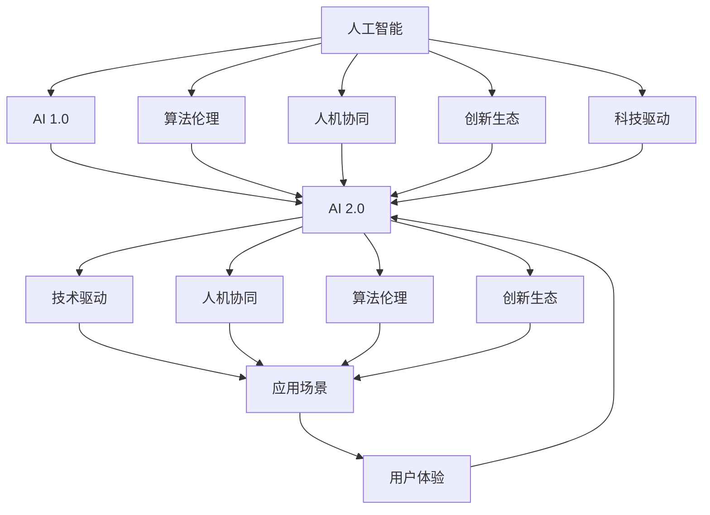

                 

# 李开复：AI 2.0 时代的意义

> 关键词：人工智能,2.0时代,人机协同,算法伦理,创新生态,科技驱动,未来趋势

## 1. 背景介绍

### 1.1 问题由来
随着科技的飞速发展，人工智能（AI）已经从科幻走入现实，深刻影响了各行各业。李开复，这位世界顶级AI专家、科技公司CEO，对AI未来的发展有着独到的见解。他认为，AI 2.0时代的到来，将彻底改变人类与机器的关系，推动人机协同的深入发展，进而引领社会进步和创新。

### 1.2 问题核心关键点
AI 2.0时代，关键在于构建一个开放、协作、以人为核心的创新生态系统，同时强调算法伦理和科技驱动的发展方向。李开复指出，AI的发展要以人为本，注重其社会价值和伦理责任，而不仅仅是技术指标的提升。他强调，未来的AI系统应当具备更强的自主学习、适应性和创造力，能够在不同场景下提供更精准、更人性化、更高效的解决方案。

## 2. 核心概念与联系

### 2.1 核心概念概述

为了深入理解李开复对AI 2.0时代的看法，本文将详细解析几个核心概念及其相互联系：

- **人工智能**：利用计算机模拟人类智能过程的技术，包括感知、学习、推理、决策等能力。
- **AI 2.0**：指在AI 1.0的基础上，通过算法创新、数据驱动和智能协同，实现更加智能、可信、可解释和可控的人工智能系统。
- **人机协同**：指在特定任务中，将人的智慧和机器的能力有机结合，实现优势互补，提升整体系统的性能和用户体验。
- **算法伦理**：研究如何设计算法，以确保其公正、透明、安全、可解释性，同时避免歧视、偏见和滥用。
- **创新生态**：构建一个多元、开放、协作的环境，促进AI技术的不断迭代和创新，同时推动相关产业的发展。
- **科技驱动**：强调技术创新对社会进步的驱动作用，通过AI技术解决人类面临的各种复杂问题。

这些核心概念共同构成了李开复对AI 2.0时代的定义和期望，通过理解这些概念，我们可以更好地把握AI的发展方向和实际应用。

### 2.2 核心概念原理和架构的 Mermaid 流程图



这个流程图展示了人工智能从1.0到2.0的演进过程，以及各个核心概念之间的联系：

1. **从AI 1.0到AI 2.0**：AI 2.0是在AI 1.0的基础上，通过算法创新、数据驱动和智能协同，实现了更加智能、可信、可解释和可控的AI系统。
2. **算法伦理**：AI系统的设计需要考虑伦理问题，如避免歧视、偏见、滥用等。
3. **人机协同**：AI系统应与人类紧密合作，发挥各自优势。
4. **创新生态**：构建一个多元、开放、协作的环境，促进AI技术的不断迭代和创新。
5. **科技驱动**：AI技术的发展应以解决人类面临的复杂问题为导向，推动社会进步。
6. **应用场景**：AI技术应实际应用到各个领域，提升用户体验和生产力。

这些概念相互依存、相互促进，共同推动了AI 2.0时代的到来。

## 3. 核心算法原理 & 具体操作步骤

### 3.1 算法原理概述

AI 2.0时代，算法创新是核心驱动力之一。李开复认为，未来的AI算法应当具备更强的自主学习、适应性和创造力。以下是几个关键的算法原理：

- **深度学习**：利用神经网络模拟人类神经系统的工作方式，通过多层非线性变换学习复杂的特征表示。
- **强化学习**：通过与环境的交互，机器不断调整策略，以最大化预期回报。
- **迁移学习**：将在一个任务上学到的知识迁移到另一个相关任务中，减少新任务的训练成本。
- **无监督学习**：在没有标签数据的情况下，机器自动发现数据中的模式和结构。
- **对抗生成网络**：通过生成对抗网络，生成逼真的数据样本，用于数据增强和模型训练。

这些算法原理共同构成了AI 2.0时代的算法基础，使得AI系统能够处理更加复杂、多变的数据，实现更强的学习和推理能力。

### 3.2 算法步骤详解

基于上述算法原理，AI 2.0的算法开发流程可以大致分为以下几个步骤：

1. **数据收集与预处理**：收集高质量的数据，并进行清洗、标注和预处理，以提高算法的训练效果。
2. **模型设计**：选择合适的算法框架，设计模型的结构和参数。
3. **模型训练与优化**：使用训练数据集对模型进行训练，并采用各种优化算法和正则化技术，提高模型的泛化能力。
4. **模型评估与测试**：在测试数据集上评估模型的性能，调整超参数和模型结构，以优化模型的效果。
5. **部署与应用**：将训练好的模型部署到实际应用场景中，并通过持续反馈和迭代，进一步提升模型性能。

### 3.3 算法优缺点

AI 2.0算法具有以下优点：

- **高效性**：利用深度学习和大规模数据训练，算法能够快速学习复杂模式，提高决策效率。
- **准确性**：通过多层非线性变换，算法能够提取数据的深层特征，提升预测和推理的准确性。
- **可扩展性**：通过迁移学习和无监督学习，算法能够快速适应新任务和新数据。
- **自适应性**：利用强化学习，算法能够在动态环境中调整策略，实现自主学习。

同时，这些算法也存在一些缺点：

- **数据依赖**：高质量的数据是算法的关键，缺乏数据的场景下难以发挥其优势。
- **复杂性**：算法模型的结构和参数设置较为复杂，需要专业知识才能有效调整。
- **资源消耗**：大规模深度学习和强化学习需要大量的计算资源，尤其是GPU和TPU等高性能设备。
- **可解释性不足**：部分算法（如深度学习）缺乏直观的解释，难以理解和调试。

### 3.4 算法应用领域

AI 2.0算法广泛应用于各个领域，以下是几个典型应用：

- **医疗健康**：利用深度学习进行疾病诊断、基因分析、药物研发等，提升医疗服务的精准度和效率。
- **金融科技**：通过强化学习和迁移学习进行风险评估、欺诈检测、个性化推荐等，推动金融科技的发展。
- **智能制造**：采用深度学习和无监督学习进行缺陷检测、工艺优化、质量控制等，提升制造业的智能化水平。
- **自动驾驶**：利用强化学习和对抗生成网络进行路径规划、行为预测、环境感知等，推动自动驾驶技术的发展。
- **智能家居**：采用无监督学习和迁移学习进行环境感知、行为识别、智能推荐等，提升家居生活的便利性和智能化水平。

## 4. 数学模型和公式 & 详细讲解 & 举例说明

### 4.1 数学模型构建

AI 2.0算法通常涉及复杂的数学模型，以下以深度学习中的卷积神经网络（CNN）为例，介绍其数学模型构建过程。

假设输入数据为 $\mathbf{x} \in \mathbb{R}^d$，输出为 $\mathbf{y} \in \mathbb{R}^c$，其中 $d$ 为输入维度，$c$ 为输出类别数。

卷积神经网络的数学模型可以表示为：

$$
\mathbf{y} = f(\mathbf{W} \mathbf{x} + \mathbf{b})
$$

其中，$f$ 为激活函数，$\mathbf{W}$ 为权重矩阵，$\mathbf{b}$ 为偏置向量。

### 4.2 公式推导过程

卷积神经网络的推导过程主要涉及卷积操作、池化操作和全连接操作。

- **卷积操作**：假设卷积核大小为 $k \times k$，输入特征图大小为 $m \times m$，输出特征图大小为 $n \times n$，卷积操作可以表示为：

$$
\mathbf{C} = \mathbf{F} * \mathbf{H}
$$

其中，$\mathbf{C}$ 为输出特征图，$\mathbf{F}$ 为卷积核，$\mathbf{H}$ 为输入特征图。

- **池化操作**：池化操作用于减小特征图的大小，提高计算效率。常见的池化操作有最大池化和平均池化，可以表示为：

$$
\mathbf{P} = \text{MaxPool}(\mathbf{C})
$$

其中，$\mathbf{P}$ 为池化后的特征图。

- **全连接操作**：全连接层将卷积和池化层的特征图作为输入，通过线性变换和激活函数进行分类。可以表示为：

$$
\mathbf{y} = \text{Softmax}(\mathbf{W} \mathbf{C} + \mathbf{b})
$$

其中，$\text{Softmax}$ 为激活函数，$\mathbf{W}$ 和 $\mathbf{b}$ 为权重矩阵和偏置向量。

### 4.3 案例分析与讲解

以图像分类任务为例，利用卷积神经网络进行图像识别。假设输入图像大小为 $32 \times 32 \times 3$，卷积核大小为 $3 \times 3$，输入特征图大小为 $28 \times 28 \times 64$，输出类别数为 $10$。

具体推导过程如下：

1. 输入图像 $\mathbf{x}$ 通过卷积层 $\mathbf{F}$，输出特征图 $\mathbf{C}$。

2. 特征图 $\mathbf{C}$ 经过池化操作，输出特征图 $\mathbf{P}$。

3. 特征图 $\mathbf{P}$ 通过全连接层进行分类，输出结果 $\mathbf{y}$。

通过上述推导过程，可以清晰地理解卷积神经网络的结构和操作过程，掌握其核心算法原理。

## 5. 项目实践：代码实例和详细解释说明

### 5.1 开发环境搭建

要进行AI 2.0算法的开发，需要搭建相应的开发环境。以下是使用PyTorch搭建开发环境的步骤：

1. 安装Anaconda：从官网下载并安装Anaconda，用于创建独立的Python环境。

2. 创建并激活虚拟环境：
```bash
conda create -n pytorch-env python=3.8 
conda activate pytorch-env
```

3. 安装PyTorch：根据CUDA版本，从官网获取对应的安装命令。例如：
```bash
conda install pytorch torchvision torchaudio cudatoolkit=11.1 -c pytorch -c conda-forge
```

4. 安装TensorFlow：
```bash
pip install tensorflow
```

5. 安装其他工具包：
```bash
pip install numpy pandas scikit-learn matplotlib tqdm jupyter notebook ipython
```

完成上述步骤后，即可在`pytorch-env`环境中开始算法开发。

### 5.2 源代码详细实现

以下是使用PyTorch实现卷积神经网络的代码实现：

```python
import torch
import torch.nn as nn
import torch.optim as optim
from torch.utils.data import DataLoader
from torchvision import datasets, transforms

class Net(nn.Module):
    def __init__(self):
        super(Net, self).__init__()
        self.conv1 = nn.Conv2d(3, 64, kernel_size=3, stride=1, padding=1)
        self.pool = nn.MaxPool2d(kernel_size=2, stride=2)
        self.fc1 = nn.Linear(64 * 14 * 14, 120)
        self.fc2 = nn.Linear(120, 84)
        self.fc3 = nn.Linear(84, 10)

    def forward(self, x):
        x = self.pool(torch.relu(self.conv1(x)))
        x = x.view(-1, 64 * 14 * 14)
        x = torch.relu(self.fc1(x))
        x = torch.relu(self.fc2(x))
        x = self.fc3(x)
        return x

net = Net()
criterion = nn.CrossEntropyLoss()
optimizer = optim.SGD(net.parameters(), lr=0.001, momentum=0.9)

train_loader = DataLoader(datasets.CIFAR10(root='./data', train=True, download=True, transform=transforms.ToTensor()), batch_size=100, shuffle=True)
test_loader = DataLoader(datasets.CIFAR10(root='./data', train=False, download=True, transform=transforms.ToTensor()), batch_size=100, shuffle=False)

for epoch in range(10):
    net.train()
    for data, target in train_loader:
        data, target = data.to(device), target.to(device)
        optimizer.zero_grad()
        output = net(data)
        loss = criterion(output, target)
        loss.backward()
        optimizer.step()

    net.eval()
    correct = 0
    total = 0
    with torch.no_grad():
        for data, target in test_loader:
            data, target = data.to(device), target.to(device)
            output = net(data)
            _, predicted = torch.max(output.data, 1)
            total += target.size(0)
            correct += (predicted == target).sum().item()

    print(f'Epoch {epoch+1}, Accuracy: {100 * correct / total:.2f}%')
```

### 5.3 代码解读与分析

让我们再详细解读一下关键代码的实现细节：

**Net类**：
- `__init__`方法：初始化卷积层、池化层、全连接层等组件。
- `forward`方法：定义前向传播的计算过程，通过卷积、池化、线性变换等操作，最终输出结果。

**criterion和optimizer**：
- `criterion`：定义损失函数，如交叉熵损失。
- `optimizer`：定义优化器，如随机梯度下降（SGD）。

**DataLoader**：
- `train_loader`和`test_loader`：用于加载训练集和测试集数据，自动进行批次划分和数据增强。

**训练过程**：
- 在每个epoch中，先进行前向传播计算损失，然后反向传播更新模型参数，最后评估模型在测试集上的准确率。

通过上述代码，可以清晰地理解卷积神经网络的基本结构、训练过程和评估方法。

## 6. 实际应用场景

### 6.1 智能制造

AI 2.0在智能制造领域的应用主要体现在质量控制和工艺优化上。利用深度学习和无监督学习，可以对生产过程中产生的图像、声音、振动等数据进行分析和预测，从而实现对产品质量的实时监控和优化。

以缺陷检测为例，通过卷积神经网络对生产图像进行特征提取和分类，可以自动识别出产品中的缺陷，提高检测效率和准确性。同时，通过迁移学习和多模态融合，可以提升对复杂场景的适应能力，实现更精准的检测效果。

### 6.2 自动驾驶

自动驾驶是AI 2.0在交通领域的典型应用。利用强化学习和对抗生成网络，可以实现路径规划、行为预测、环境感知等关键功能，提升驾驶的安全性和智能化水平。

例如，通过强化学习训练自动驾驶模型，使其在复杂交通环境中自主决策，避免碰撞和事故。利用对抗生成网络，生成逼真的交通场景数据，用于模型训练和仿真测试，提升系统的鲁棒性和泛化能力。

### 6.3 医疗健康

在医疗健康领域，AI 2.0的应用同样广泛。利用深度学习进行疾病诊断、基因分析、药物研发等，可以显著提升医疗服务的精准度和效率。

以图像诊断为例，通过卷积神经网络对医学影像进行分析和分类，可以自动诊断出疾病类型，提供辅助诊断结果。同时，通过迁移学习和多模态融合，可以提升对病灶的识别准确性，减少误诊和漏诊。

### 6.4 未来应用展望

随着AI 2.0技术的不断进步，未来将在更多领域得到应用，推动社会的全面进步。以下是几个未来展望：

- **智慧城市**：利用AI 2.0技术实现智能交通管理、环境监测、应急响应等，提升城市的智能化水平。
- **智能家居**：通过AI 2.0技术实现智能语音识别、智能推荐、智能安防等，提升家居生活的便捷性和安全性。
- **金融科技**：利用AI 2.0技术进行风险评估、欺诈检测、个性化推荐等，推动金融科技的发展。
- **环境保护**：利用AI 2.0技术进行环境监测、污染预测、资源管理等，实现可持续发展的目标。

## 7. 工具和资源推荐

### 7.1 学习资源推荐

为了帮助开发者系统掌握AI 2.0的算法和实践技巧，这里推荐一些优质的学习资源：

1. **《深度学习》书籍**：Ian Goodfellow等著，全面介绍了深度学习的基本原理和应用，是深度学习领域的经典教材。
2. **CS231n《深度学习视觉识别》课程**：斯坦福大学开设的视觉识别课程，涵盖深度学习在计算机视觉领域的应用，包括图像分类、目标检测、人脸识别等。
3. **《动手学深度学习》书籍**：李沐等著，利用JAX和Haiku框架，深入浅出地介绍了深度学习的基本原理和实践技巧。
4. **深度学习框架文档**：如TensorFlow、PyTorch、Keras等，提供了详细的API文档和教程，是深入学习深度学习的必备资源。
5. **arXiv论文库**：收集了大量深度学习领域的最新研究成果，是了解前沿技术和趋势的重要平台。

通过对这些资源的学习实践，相信你一定能够快速掌握AI 2.0的精髓，并用于解决实际的AI问题。

### 7.2 开发工具推荐

高效的开发离不开优秀的工具支持。以下是几款用于AI 2.0算法开发的常用工具：

1. **PyTorch**：基于Python的开源深度学习框架，灵活动态的计算图，适合快速迭代研究。大部分深度学习模型都有PyTorch版本的实现。
2. **TensorFlow**：由Google主导开发的开源深度学习框架，生产部署方便，适合大规模工程应用。
3. **JAX**：谷歌推出的自动微分框架，支持高效的多核并行计算，适合高性能计算任务。
4. **Keras**：高级神经网络API，基于TensorFlow和Theano等后端实现，易于上手，适合快速原型开发。
5. **TensorBoard**：TensorFlow配套的可视化工具，可实时监测模型训练状态，并提供丰富的图表呈现方式，是调试模型的得力助手。

合理利用这些工具，可以显著提升AI 2.0算法的开发效率，加快创新迭代的步伐。

### 7.3 相关论文推荐

AI 2.0的发展源于学界的持续研究。以下是几篇奠基性的相关论文，推荐阅读：

1. **ImageNet分类：深度卷积神经网络**：AlexNet团队的研究论文，首次展示了深度卷积神经网络在图像分类任务上的优越性能。
2. **深度残差学习**：He等著，提出残差网络结构，有效解决了深度网络的梯度消失问题。
3. **循环神经网络：学习对时间序列数据的预测**：Hochreiter等著，提出循环神经网络，用于处理时间序列数据。
4. **自适应矩估计**：Kingma等著，提出自适应矩估计方法，用于加速深度网络的训练。
5. **注意力机制**：Bahdanau等著，提出注意力机制，用于解决序列到序列问题。

这些论文代表了大数据、深度学习和强化学习的发展脉络，通过学习这些前沿成果，可以帮助研究者把握学科前进方向，激发更多的创新灵感。

## 8. 总结：未来发展趋势与挑战

### 8.1 研究成果总结

本文对AI 2.0时代的意义进行了全面系统的介绍。首先阐述了AI 2.0时代的背景和核心概念，明确了其以人为本、以技术创新为导向的发展方向。其次，从算法原理到实际应用，详细讲解了AI 2.0算法的基本流程和典型应用。最后，通过总结学习资源、开发工具和相关论文，提供了全面的学习路径和技术支持。

通过本文的系统梳理，可以看到，AI 2.0时代正在深刻改变人类与机器的关系，推动人机协同的深入发展，为社会的全面进步和创新提供新动力。未来的AI系统将在各个领域发挥更大的作用，助力人类迈向更加智能、安全和可控的未来。

### 8.2 未来发展趋势

展望未来，AI 2.0技术将呈现以下几个发展趋势：

1. **多模态融合**：将图像、声音、文本等多种模态的信息进行融合，提升系统的感知和理解能力。
2. **自适应学习**：通过强化学习等技术，使系统能够根据环境变化自主调整策略，实现更好的适应性。
3. **个性化服务**：利用AI 2.0技术进行个性化推荐、个性化医疗等，提升用户体验和满意度。
4. **自动生成**：利用生成对抗网络等技术，实现图像、文本、音频等数据的自动生成，提升内容的创造力和丰富度。
5. **联邦学习**：通过分布式协同学习，提升系统在大规模数据上的训练效果，同时保护数据隐私。

这些趋势凸显了AI 2.0技术的广阔前景，未来将在更多领域得到应用，推动社会的全面进步。

### 8.3 面临的挑战

尽管AI 2.0技术已经取得了瞩目成就，但在迈向更加智能化、普适化应用的过程中，仍面临诸多挑战：

1. **数据隐私和安全**：AI 2.0系统通常需要处理大量敏感数据，如何保障数据隐私和安全是重要课题。
2. **算法公平性和透明性**：AI 2.0算法可能存在歧视和偏见，如何保证算法的公平性和透明性，确保其公正性，是未来的一个重要研究方向。
3. **系统可解释性**：AI 2.0系统的决策过程难以解释，难以理解和调试，如何提高系统的可解释性，增强用户信任，是重要挑战。
4. **计算资源消耗**：AI 2.0系统通常需要大量计算资源，如何优化算法和模型，降低计算成本，提升系统效率，是关键课题。
5. **模型泛化能力**：AI 2.0模型在特定任务上表现优异，但泛化到新任务和新数据上的效果有限，如何提高模型的泛化能力，是重要研究方向。

这些挑战需要多方努力才能解决，未来需要在技术、伦理、法规等多个层面协同推进，才能实现AI 2.0技术的广泛应用和可持续发展。

### 8.4 研究展望

面向未来，AI 2.0技术的研究应在以下几个方面寻求新的突破：

1. **算法创新**：开发新的算法模型，提升系统的学习能力和推理能力，实现更高效、更精确的AI系统。
2. **多模态融合**：将图像、声音、文本等多种模态的信息进行融合，提升系统的感知和理解能力。
3. **联邦学习**：通过分布式协同学习，提升系统在大规模数据上的训练效果，同时保护数据隐私。
4. **自适应学习**：通过强化学习等技术，使系统能够根据环境变化自主调整策略，实现更好的适应性。
5. **可解释性增强**：开发更易于解释和理解的AI系统，增强用户信任和接受度。

这些研究方向将引领AI 2.0技术的不断进步，为构建安全、可靠、可解释、可控的智能系统铺平道路。只有勇于创新、敢于突破，才能不断拓展AI 2.0技术的边界，让智能技术更好地造福人类社会。

## 9. 附录：常见问题与解答

**Q1：AI 2.0技术对人类社会的影响有哪些？**

A: AI 2.0技术对人类社会的影响是多方面的。其积极影响包括：
- **提升效率和生产力**：AI 2.0技术能够自动化处理大量重复性、低价值的任务，提高生产效率和质量。
- **促进科学发现和创新**：AI 2.0技术可以加速数据分析和模式发现，推动科学研究和技术创新。
- **改善医疗和教育**：AI 2.0技术可以提升医疗诊断和教育个性化水平，改善人们的生活质量。
- **促进社会公平**：AI 2.0技术可以优化资源分配和社会管理，推动社会公平和进步。

然而，AI 2.0技术也存在一些潜在的负面影响：
- **就业结构变化**：AI 2.0技术可能导致某些低技能岗位的消失，需要重新培训和职业转型。
- **数据隐私和安全**：AI 2.0系统通常需要处理大量敏感数据，如何保障数据隐私和安全是重要课题。
- **算法公平性和透明性**：AI 2.0算法可能存在歧视和偏见，如何保证算法的公平性和透明性，确保其公正性，是未来的一个重要研究方向。

**Q2：如何确保AI 2.0算法的公平性和透明性？**

A: 确保AI 2.0算法的公平性和透明性，需要从以下几个方面入手：
- **数据预处理**：确保训练数据的多样性和代表性，避免数据偏见和歧视。
- **算法设计**：在算法设计中引入公平性约束，如对抗样本生成、公平性指标优化等。
- **模型解释**：开发更易于解释和理解的AI系统，增强用户信任和接受度。
- **监管和审核**：引入第三方监管和审核机制，对AI系统的决策过程进行监督，确保其公正性。

通过这些措施，可以逐步提高AI 2.0算法的公平性和透明性，增强其可信赖度和社会接受度。

**Q3：AI 2.0技术在医疗健康领域的应用有哪些？**

A: AI 2.0技术在医疗健康领域的应用包括：
- **疾病诊断**：利用深度学习进行医学影像分析，自动识别病灶和诊断结果。
- **基因分析**：利用深度学习进行基因序列分析，发现基因变异和疾病关联。
- **药物研发**：利用深度学习进行药物筛选和设计，提升新药研发效率。
- **个性化医疗**：利用AI 2.0技术进行患者个体化分析，提供个性化的治疗方案。
- **医疗辅助**：利用AI 2.0技术进行医疗图像处理、电子病历管理等，提升医疗服务的效率和质量。

这些应用展示了AI 2.0技术在医疗健康领域的强大潜力，未来有望进一步提升医疗服务的精准度和效率。

**Q4：AI 2.0技术在智能家居领域的应用有哪些？**

A: AI 2.0技术在智能家居领域的应用包括：
- **智能语音识别**：利用深度学习进行语音识别和理解，实现智能语音交互。
- **智能推荐**：利用AI 2.0技术进行个性化推荐，提升用户的居住体验。
- **智能安防**：利用深度学习进行行为分析和异常检测，提升家居安全水平。
- **环境监测**：利用AI 2.0技术进行环境监测和智能调节，提升居住舒适度。
- **家居自动化**：利用AI 2.0技术进行自动化控制，提升家居的智能化水平。

这些应用展示了AI 2.0技术在智能家居领域的广阔前景，未来有望进一步提升家居生活的便捷性和智能化水平。

**Q5：AI 2.0技术在自动驾驶领域的应用有哪些？**

A: AI 2.0技术在自动驾驶领域的应用包括：
- **路径规划**：利用深度学习和强化学习进行路径规划，实现自主驾驶。
- **行为预测**：利用深度学习进行交通场景理解，预测其他车辆的行驶行为。
- **环境感知**：利用深度学习进行传感器数据融合，实现对复杂环境的感知。
- **安全保障**：利用AI 2.0技术进行碰撞预警、防追尾等安全保障，提升自动驾驶的安全性。
- **自动泊车**：利用AI 2.0技术进行自动泊车、自动跟随等，提升驾驶的便利性和智能化水平。

这些应用展示了AI 2.0技术在自动驾驶领域的强大潜力，未来有望进一步推动自动驾驶技术的发展。

---

作者：禅与计算机程序设计艺术 / Zen and the Art of Computer Programming

