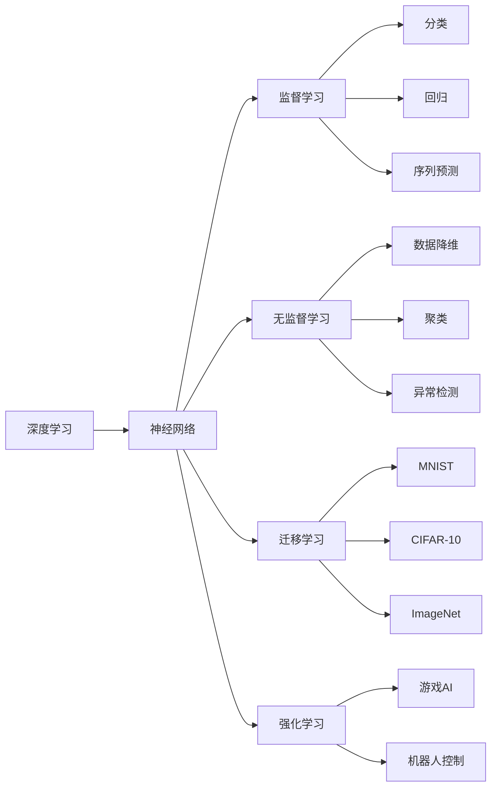

                 

# 李开复：AI 2.0 时代的挑战

在AI 2.0的浪潮中，技术不断演进，未来充满了机遇与挑战。作为一名深度学习领域的专家，我深感我们有责任用先进的知识和技术，推动人工智能技术的可持续发展，并解决随之而来的伦理和社会问题。本文将深入探讨AI 2.0时代的技术挑战，并展望未来发展的趋势和方向。

## 1. 背景介绍

随着人工智能技术的快速发展，AI 2.0时代正向我们走来。AI 2.0与AI 1.0时代相比，主要差异在于其深度学习技术的日趋成熟。在AI 1.0时代，机器学习更多关注于特征工程，在人工智能的各个分支领域中，数据科学家必须手动提取和构造特征，从而训练模型。而AI 2.0时代的核心是深度学习，其利用深度神经网络自动学习和提取特征，极大地简化了模型训练的流程，提高了效率，并推动了AI在诸多领域的广泛应用。

从AI 1.0到AI 2.0的跨越，不仅仅是技术上的突破，更是对人类生活方式的深刻影响。AI 2.0技术不仅在自动驾驶、医疗诊断、金融分析等商业领域大放异彩，还在教育和科研等多个领域展现出广阔的应用前景。然而，随着技术的不断进步，也涌现出一些不容忽视的挑战。

## 2. 核心概念与联系

为了更好地理解AI 2.0时代的挑战，下面我们将详细介绍几个核心概念及其之间的联系：

- **深度学习**：深度学习是AI 2.0时代最重要的技术基础。它使用深层神经网络来自动学习和提取数据特征，并通过反向传播算法进行模型训练，使得模型能够从大规模数据中学习到丰富的特征表示。

- **神经网络**：神经网络是深度学习的主要架构形式，它模拟人类神经元的连接方式，通过多层次的节点和边来构建模型。每个神经元接收多个输入并生成输出，通过不断调整权重参数，使得模型能够逐渐逼近目标函数。

- **监督学习**：监督学习是指通过标记的数据来训练模型，使其能够预测新数据。在AI 2.0时代，监督学习广泛应用于分类、回归、序列预测等任务。

- **无监督学习**：无监督学习则是通过未标记的数据来训练模型，使其能够自动发现数据的内在结构和规律。在AI 2.0时代，无监督学习在数据降维、聚类、异常检测等任务中得到广泛应用。

- **迁移学习**：迁移学习是指在已有任务模型的基础上，通过迁移学习，使得模型能够在新的任务上表现良好。在AI 2.0时代，迁移学习广泛应用于多任务学习和跨领域应用中。

- **强化学习**：强化学习是一种通过试错和反馈来训练模型的方法，在AI 2.0时代，强化学习被广泛应用于游戏AI、机器人控制等任务。

通过以下Mermaid流程图，我们可以更好地理解这些概念之间的联系：



这些概念和模型架构通过连接形成了AI 2.0时代的技术生态系统，彼此之间相互影响和支撑，共同推动着AI技术的进步和发展。

## 3. 核心算法原理 & 具体操作步骤

### 3.1 算法原理概述

AI 2.0时代的技术核心是深度学习，其算法原理主要包括以下几个方面：

- **多层感知机（MLP）**：多层感知机是深度学习的核心组件，由多个全连接层组成。在每个层中，每个神经元接收上一层的所有输出，并生成新的输出。

- **卷积神经网络（CNN）**：卷积神经网络主要用于处理图像和视频等二维数据。其通过卷积操作提取局部特征，再通过池化操作减小特征图的大小，最后通过全连接层生成输出。

- **循环神经网络（RNN）**：循环神经网络主要用于处理序列数据，如文本和时间序列数据。其通过循环结构，使网络可以处理变长输入，并通过门控机制控制信息的流动。

- **深度信念网络（DBN）**：深度信念网络是一种生成式模型，通过受限玻尔兹曼机进行数据建模，能够学习到数据的联合概率分布。

- **生成对抗网络（GAN）**：生成对抗网络由生成器和判别器两部分组成，通过对抗训练，生成器可以生成逼真的数据，而判别器则能够区分生成数据和真实数据。

### 3.2 算法步骤详解

以下是深度学习模型的训练和优化步骤详解：

1. **数据准备**：收集并准备训练数据集和验证数据集，通常包括输入和标签两部分。

2. **模型选择**：选择合适的深度学习模型架构，如MLP、CNN、RNN、DBN等。

3. **参数初始化**：随机初始化模型中的权重和偏置，通常使用均值0、标准差0.01的正态分布进行初始化。

4. **前向传播**：将训练数据输入模型，通过多层神经网络进行前向传播，计算输出。

5. **损失计算**：根据训练数据和模型输出计算损失函数，常用的损失函数包括均方误差（MSE）、交叉熵（Cross-Entropy）等。

6. **反向传播**：通过反向传播算法，计算损失函数对每个参数的梯度。

7. **参数更新**：使用梯度下降算法或优化器（如Adam、SGD）更新模型参数。

8. **验证与调整**：在验证数据集上验证模型性能，调整超参数，如学习率、批大小等。

9. **测试与评估**：在测试数据集上评估模型性能，最终输出模型。

### 3.3 算法优缺点

AI 2.0时代的深度学习算法有以下优缺点：

**优点：**

- **高准确率**：深度学习能够自动学习和提取数据特征，具有较高的准确率。
- **可扩展性强**：深度学习模型可以通过增加网络深度和宽度来提高性能。
- **端到端训练**：深度学习模型能够实现端到端的训练，避免了繁琐的手工特征工程。

**缺点：**

- **模型复杂度高**：深度学习模型通常具有大量参数，训练时间长。
- **数据需求大**：深度学习模型需要大量的训练数据来保证性能，数据收集和标注成本高。
- **过拟合风险高**：深度学习模型容易过拟合，需要采用正则化等方法来防止过拟合。
- **难以解释**：深度学习模型通常是“黑盒”模型，难以解释其决策过程。

### 3.4 算法应用领域

AI 2.0时代的深度学习算法广泛应用于以下几个领域：

- **计算机视觉**：深度学习在图像分类、目标检测、图像生成等方面表现优异，广泛应用于自动驾驶、医学影像分析、安防监控等。

- **自然语言处理**：深度学习在文本分类、情感分析、机器翻译等方面表现突出，广泛应用于智能客服、情感分析、问答系统等。

- **语音识别**：深度学习在语音识别和语音合成中表现优异，广泛应用于智能音箱、语音助手、电话客服等。

- **推荐系统**：深度学习在推荐系统中表现出色，能够根据用户历史行为和偏好，提供个性化的推荐内容。

- **游戏AI**：深度学习在人工智能游戏领域表现出色，能够训练生成智能游戏角色，提升游戏体验。

## 4. 数学模型和公式 & 详细讲解 & 举例说明

### 4.1 数学模型构建

AI 2.0时代的深度学习模型通常使用以下数学模型进行表示：

$$
y = f(x; \theta)
$$

其中 $x$ 为输入数据，$\theta$ 为模型参数，$f$ 为深度学习模型，$y$ 为模型输出。模型的目标是通过最小化损失函数，使得模型输出尽可能接近真实标签。

### 4.2 公式推导过程

以多层感知机（MLP）为例，我们推导其损失函数和梯度计算公式。

假设输入数据为 $x$，输出为 $y$，模型由 $L$ 层全连接层组成，每层神经元数为 $n_l$。第一层输入数据 $x$ 经过 $L$ 层线性变换和激活函数，得到输出 $y$：

$$
y = \sigma_L(\sigma_{L-1}(\sigma_{L-2}(\dots \sigma_1(W_Lx + b_L) + b_{L-1}) + b_{L-2}) + b_1)
$$

其中 $W$ 为权重矩阵，$b$ 为偏置向量，$\sigma$ 为激活函数，如ReLU、Sigmoid等。

假设损失函数为均方误差损失函数：

$$
\mathcal{L} = \frac{1}{N} \sum_{i=1}^N (y_i - x_i)^2
$$

梯度下降算法的更新公式为：

$$
\theta \leftarrow \theta - \eta \nabla_{\theta}\mathcal{L}
$$

其中 $\eta$ 为学习率，$\nabla_{\theta}\mathcal{L}$ 为损失函数对参数 $\theta$ 的梯度，可通过反向传播算法计算得到。

### 4.3 案例分析与讲解

以MNIST手写数字识别为例，展示深度学习模型的训练和测试过程。

1. **数据准备**：收集MNIST数据集，包含60,000张训练图像和10,000张测试图像，每张图像大小为28x28。

2. **模型选择**：选择多层感知机（MLP）模型，包含2个隐藏层，每层神经元数为256。

3. **参数初始化**：随机初始化模型权重和偏置。

4. **前向传播**：将训练图像输入模型，计算输出。

5. **损失计算**：计算输出与标签之间的均方误差。

6. **反向传播**：计算损失函数对每个参数的梯度。

7. **参数更新**：使用梯度下降算法更新模型参数。

8. **验证与调整**：在验证数据集上验证模型性能，调整超参数。

9. **测试与评估**：在测试数据集上评估模型性能，最终输出模型。

## 5. 项目实践：代码实例和详细解释说明

### 5.1 开发环境搭建

为了进行AI 2.0时代的深度学习项目开发，我们需要准备好以下开发环境：

1. 安装Python：从官网下载并安装Python 3.6及以上版本，确保深度学习库能够正常运行。

2. 安装深度学习库：安装TensorFlow、PyTorch、Keras等深度学习库，可以按照官方文档进行安装。

3. 安装可视化工具：安装TensorBoard、Weights & Biases等可视化工具，以便实时监测模型训练状态。

4. 安装分布式训练工具：安装Horovod等分布式训练工具，以支持大规模模型训练。

### 5.2 源代码详细实现

以下是一个基于PyTorch实现的简单深度学习项目代码，用于对MNIST数据集进行分类。

```python
import torch
import torch.nn as nn
import torchvision
import torchvision.transforms as transforms
import torchvision.datasets as dsets

# 定义模型
class MLP(nn.Module):
    def __init__(self, input_size, hidden_size, output_size):
        super(MLP, self).__init__()
        self.fc1 = nn.Linear(input_size, hidden_size)
        self.fc2 = nn.Linear(hidden_size, hidden_size)
        self.fc3 = nn.Linear(hidden_size, output_size)

    def forward(self, x):
        x = nn.functional.relu(self.fc1(x))
        x = nn.functional.relu(self.fc2(x))
        x = self.fc3(x)
        return x

# 定义训练函数
def train(model, train_data, epochs, batch_size, learning_rate):
    model.train()
    criterion = nn.CrossEntropyLoss()
    optimizer = torch.optim.Adam(model.parameters(), lr=learning_rate)
    for epoch in range(epochs):
        running_loss = 0.0
        for i, data in enumerate(train_data, 0):
            inputs, labels = data
            inputs = inputs.view(inputs.size(0), -1)
            optimizer.zero_grad()
            outputs = model(inputs)
            loss = criterion(outputs, labels)
            loss.backward()
            optimizer.step()
            running_loss += loss.item()
            if i % 100 == 99:
                print('[%d, %5d] loss: %.3f' %
                      (epoch + 1, i + 1, running_loss / 100))
                running_loss = 0.0
    print('Finished Training')

# 数据准备
train_dataset = torchvision.datasets.MNIST(root='./data', 
                                         train=True, 
                                         transform=transforms.ToTensor(), 
                                         download=True)
train_loader = torch.utils.data.DataLoader(train_dataset, 
                                         batch_size=batch_size, 
                                         shuffle=True)
```

### 5.3 代码解读与分析

1. **模型定义**：定义一个简单的MLP模型，包含2个隐藏层，每层256个神经元，并使用ReLU作为激活函数。

2. **训练函数**：定义训练函数，通过Adam优化器更新模型参数，并在训练数据集上进行训练。

3. **数据准备**：使用torchvision库下载并准备MNIST数据集，将其转换为Tensor格式。

4. **训练过程**：在训练函数中，通过循环迭代训练数据集，计算模型输出与真实标签之间的交叉熵损失，并使用Adam优化器更新模型参数。

5. **输出结果**：在训练完成后，模型可以对测试数据集进行测试，并输出最终结果。

## 6. 实际应用场景

### 6.1 智能医疗

在智能医疗领域，AI 2.0技术可以广泛应用于疾病诊断、药物研发、基因分析等任务。例如，使用深度学习模型对医学影像进行分类，可以显著提高诊断的准确性和速度。

### 6.2 自动驾驶

在自动驾驶领域，AI 2.0技术可以用于图像识别、语义分割、路径规划等任务。例如，使用卷积神经网络（CNN）进行实时道路检测，实现自动驾驶系统的高效运作。

### 6.3 金融分析

在金融分析领域，AI 2.0技术可以用于股票预测、风险评估、信用评分等任务。例如，使用深度学习模型对历史交易数据进行建模，预测未来股价走势。

### 6.4 智能客服

在智能客服领域，AI 2.0技术可以用于语音识别、自然语言处理、情感分析等任务。例如，使用深度学习模型对客户语音进行识别，实现智能客服系统的自然对话。

## 7. 工具和资源推荐

### 7.1 学习资源推荐

1. **Coursera**：提供大量深度学习相关课程，包括神经网络、卷积神经网络、循环神经网络等。

2. **DeepLearning.AI**：由吴恩达教授创办的深度学习课程，涵盖深度学习基础和高级应用。

3. **Deep Learning Specialization**：由Coursera和DeepMind联合推出的深度学习专业课程，覆盖深度学习理论和实践。

4. **《深度学习》书籍**：由Ian Goodfellow等人著，全面介绍深度学习的基本概念和算法。

5. **《神经网络与深度学习》书籍**：由Michael Nielsen著，详细讲解神经网络和深度学习的原理和应用。

### 7.2 开发工具推荐

1. **TensorFlow**：由Google开发的深度学习框架，支持多种硬件加速，包括CPU、GPU和TPU。

2. **PyTorch**：由Facebook开发的深度学习框架，易于使用且高效，支持动态图和静态图。

3. **Keras**：高层次的深度学习框架，易于上手且性能优秀，支持TensorFlow和Theano后端。

4. **Horovod**：支持大规模分布式深度学习训练的工具，支持多种深度学习框架。

5. **TensorBoard**：用于可视化深度学习模型的训练过程，帮助调试和优化模型。

### 7.3 相关论文推荐

1. **《深度学习》书籍**：Ian Goodfellow等人著，介绍深度学习的基本概念和算法。

2. **《Neural Networks and Deep Learning》书籍**：Michael Nielsen著，讲解神经网络和深度学习的原理和应用。

3. **《Deep Learning Specialization》课程**：Coursera和DeepMind联合推出，涵盖深度学习理论和实践。

## 8. 总结：未来发展趋势与挑战

### 8.1 研究成果总结

AI 2.0时代的深度学习技术已经取得了显著的进展，并且在诸多领域得到了广泛应用。未来，随着技术的不断进步，深度学习技术将继续推动人工智能的发展，带来更多创新和突破。

### 8.2 未来发展趋势

1. **模型规模增大**：深度学习模型将朝着更大规模的方向发展，以获得更丰富的特征表示和更高的准确率。

2. **多模态融合**：未来的深度学习模型将更多地融合图像、语音、文本等多种模态数据，提升系统的综合性能。

3. **弱监督学习**：未来的深度学习模型将更多地应用弱监督学习方法，减少对标注数据的依赖。

4. **自监督学习**：自监督学习方法将进一步发展，通过无标注数据进行自我监督学习，提升模型的泛化能力。

5. **可解释性增强**：未来的深度学习模型将更多地注重可解释性，帮助人们理解模型的决策过程。

### 8.3 面临的挑战

1. **数据需求**：深度学习模型需要大量标注数据，数据收集和标注成本高。

2. **模型复杂度**：深度学习模型结构复杂，训练时间长，难以优化。

3. **鲁棒性**：深度学习模型对输入数据的变化敏感，容易过拟合和泛化性能差。

4. **可解释性**：深度学习模型通常是“黑盒”模型，难以解释其决策过程。

5. **公平性**：深度学习模型可能存在偏见，对特定群体产生不公平的影响。

### 8.4 研究展望

未来，AI 2.0时代的技术将更加注重解决实际问题，提高模型的公平性、可解释性和鲁棒性。同时，新的技术如自监督学习、弱监督学习等将带来更多的创新，推动深度学习技术向更广阔的应用领域发展。

## 9. 附录：常见问题与解答

**Q1: AI 2.0时代的技术发展有何重要意义？**

A: AI 2.0时代的技术发展，不仅推动了人工智能技术本身的进步，还为各行各业带来了深远的影响。深度学习技术的应用，使得机器能够从大规模数据中自动学习和提取特征，大大提高了数据分析和处理的能力。未来，深度学习技术将进一步融合其他技术，如自然语言处理、计算机视觉、语音识别等，实现更高效、更智能的解决方案。

**Q2: AI 2.0时代有哪些常见的技术挑战？**

A: AI 2.0时代的技术挑战主要包括：

1. **数据需求大**：深度学习模型需要大量标注数据，数据收集和标注成本高。

2. **模型复杂度高**：深度学习模型结构复杂，训练时间长，难以优化。

3. **鲁棒性差**：深度学习模型对输入数据的变化敏感，容易过拟合和泛化性能差。

4. **可解释性不足**：深度学习模型通常是“黑盒”模型，难以解释其决策过程。

5. **公平性问题**：深度学习模型可能存在偏见，对特定群体产生不公平的影响。

**Q3: AI 2.0技术在实际应用中需要注意哪些问题？**

A: AI 2.0技术在实际应用中需要注意以下问题：

1. **数据隐私保护**：在数据收集和处理过程中，需要保护用户隐私，防止数据泄露和滥用。

2. **模型鲁棒性**：在应用中，需要确保模型对输入数据的变化具有鲁棒性，避免因输入偏差导致的不良结果。

3. **公平性**：在模型设计中，需要考虑到公平性问题，避免对特定群体产生不公平的影响。

4. **可解释性**：在模型应用中，需要提高模型的可解释性，帮助人们理解模型的决策过程。

5. **安全性**：在模型部署和应用过程中，需要保证模型的安全性，防止恶意攻击和数据篡改。

通过本文的系统梳理，我们深入了解了AI 2.0时代的核心技术及其在实际应用中的挑战和展望。相信随着技术的不断进步和突破，AI 2.0时代将为我们带来更多的机遇和挑战，推动人工智能技术向更加智能化、普适化的方向发展。

