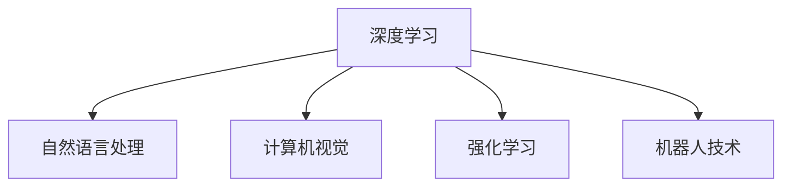

                 

# 李开复：AI 2.0 时代的未来展望

## 1. 背景介绍

### 1.1 问题的由来
随着人工智能技术的飞速发展，AI已经从最初的“以规则为基础”的专家系统，逐渐演进到如今的“以数据为基础”的深度学习系统。当前，人工智能已经进入了一个新的阶段，我们称之为AI 2.0时代。AI 2.0时代的特点是：AI的复杂度、规模、应用广度以及智能化水平都大大超越了以往的AI时代。

### 1.2 问题的核心关键点
AI 2.0时代，人工智能技术的应用已经从最初的科学研究、专家系统等领域，扩展到了医疗、金融、制造、交通、教育等各行各业。在这一过程中，AI技术的核心在于如何更高效地处理和分析大规模数据，以及如何更好地理解复杂的现实世界问题。AI 2.0时代，这些技术的进步主要体现在以下几个方面：

1. **深度学习的普及**：深度学习已经成为处理大规模、非结构化数据的主要手段。
2. **自然语言处理**：自然语言处理（NLP）技术的进步，使得计算机能够更好地理解人类的语言。
3. **计算机视觉**：计算机视觉技术的突破，使得计算机能够识别和理解图像和视频中的内容。
4. **机器人技术**：机器人技术的发展，使得智能机器能够在各种环境中执行复杂的任务。
5. **强化学习**：强化学习技术的发展，使得机器能够通过与环境的交互不断学习和优化。

### 1.3 问题的研究意义
了解AI 2.0时代的未来展望，对于技术开发者、行业专家、政策制定者以及社会公众都有着重要的意义。这不仅有助于把握AI技术发展的趋势，更能够指导我们在实际应用中更好地利用AI技术，推动社会的进步和发展。

## 2. 核心概念与联系

### 2.1 核心概念概述
在AI 2.0时代，许多新的概念和技术不断涌现，以下列举了几个核心概念：

- **深度学习**：一种基于神经网络的机器学习方法，通过多层次的非线性变换，从数据中学习特征。
- **自然语言处理**：让计算机能够理解、解释和生成人类语言的技术。
- **计算机视觉**：让计算机能够理解和分析图像和视频的技术。
- **强化学习**：通过与环境的交互，让机器不断学习并优化策略的一种机器学习方法。
- **机器人技术**：利用人工智能技术，使机器人在各种环境下执行复杂任务的技术。

这些概念之间的联系可以用以下Mermaid流程图表示：



这些核心概念的结合，推动了AI 2.0时代人工智能技术的全面发展。

## 3. 核心算法原理 & 具体操作步骤

### 3.1 算法原理概述

AI 2.0时代，深度学习成为核心算法，其原理是通过多层神经网络，从数据中学习特征，然后基于这些特征进行预测或分类。其核心步骤包括：

1. **数据准备**：收集和处理大规模数据。
2. **模型训练**：通过反向传播算法，优化模型参数，使其能够准确预测或分类。
3. **模型测试**：在新数据上评估模型性能。
4. **模型优化**：通过超参数调整、正则化等方法，提升模型效果。

### 3.2 算法步骤详解

以下是深度学习模型的具体操作步骤：

1. **数据预处理**：
   - 收集数据：根据具体任务，收集和处理相关数据。
   - 数据清洗：处理缺失值、异常值等数据问题。
   - 数据增强：通过旋转、裁剪、颜色变换等方式，丰富训练数据的多样性。

2. **模型设计**：
   - 选择模型架构：选择适合任务的模型架构，如卷积神经网络（CNN）、循环神经网络（RNN）等。
   - 设置超参数：确定学习率、批量大小、迭代轮数等超参数。

3. **模型训练**：
   - 定义损失函数：根据任务定义损失函数，如均方误差、交叉熵等。
   - 前向传播：将数据输入模型，计算输出。
   - 反向传播：根据损失函数计算梯度，更新模型参数。
   - 迭代优化：重复上述步骤，直到模型收敛。

4. **模型测试**：
   - 划分测试集：将数据划分为训练集和测试集。
   - 评估模型：在测试集上评估模型性能。

5. **模型优化**：
   - 正则化：使用L2正则化、Dropout等方法，防止过拟合。
   - 学习率调整：通过学习率调度策略，调整学习率。
   - 模型融合：通过集成学习，提升模型效果。

### 3.3 算法优缺点

深度学习的优点包括：

1. **强大的特征提取能力**：能够自动学习数据中的特征。
2. **良好的泛化能力**：能够适应不同的数据分布。
3. **高效的并行计算**：适合在大规模分布式系统中训练。

深度学习的缺点包括：

1. **模型复杂度高**：需要大量的数据和计算资源。
2. **模型可解释性差**：难以解释模型的内部决策过程。
3. **过拟合风险高**：在训练过程中容易过拟合。

### 3.4 算法应用领域

深度学习已经在众多领域取得了显著成果，以下列举了几个主要应用领域：

- **计算机视觉**：如图像分类、目标检测、人脸识别等。
- **自然语言处理**：如机器翻译、情感分析、语音识别等。
- **医疗健康**：如医学影像分析、疾病诊断等。
- **金融领域**：如信用评估、风险管理等。
- **智能制造**：如智能检测、质量控制等。

## 4. 数学模型和公式 & 详细讲解 & 举例说明

### 4.1 数学模型构建

深度学习的数学模型通常基于神经网络架构，以下是一个典型的卷积神经网络（CNN）模型：

$$
f(x) = W^T \sigma(A^T(x-b) + c)
$$

其中，$f(x)$ 表示模型的输出，$W$ 和 $c$ 为模型参数，$\sigma$ 为激活函数，$A$ 为权重矩阵，$b$ 为偏置项，$x$ 为输入数据。

### 4.2 公式推导过程

假设我们的任务是图像分类，具体步骤如下：

1. **数据准备**：收集并预处理数据集。
2. **模型设计**：选择一个适合的卷积神经网络架构，如LeNet、AlexNet等。
3. **模型训练**：使用反向传播算法，优化模型参数。
4. **模型测试**：在新数据集上评估模型性能。
5. **模型优化**：使用正则化、Dropout等方法，防止过拟合。

### 4.3 案例分析与讲解

以下以图像分类任务为例，进行案例分析：

- **数据准备**：收集并预处理图像数据集，如MNIST、CIFAR-10等。
- **模型设计**：选择LeNet卷积神经网络架构，包含卷积层、池化层、全连接层等。
- **模型训练**：使用反向传播算法，优化模型参数。
- **模型测试**：在新数据集上评估模型性能，如计算准确率、召回率等。
- **模型优化**：使用正则化、Dropout等方法，防止过拟合。

## 5. 项目实践：代码实例和详细解释说明

### 5.1 开发环境搭建

以下是使用Python和TensorFlow进行深度学习项目开发的流程：

1. **安装Python**：下载并安装Python 3.x版本。
2. **安装TensorFlow**：使用pip命令安装TensorFlow，如`pip install tensorflow`。
3. **安装其他依赖库**：如NumPy、Pandas、Matplotlib等。
4. **搭建虚拟环境**：使用virtualenv创建虚拟环境。
5. **环境激活**：激活虚拟环境。

### 5.2 源代码详细实现

以下是一个简单的卷积神经网络（CNN）代码实现：

```python
import tensorflow as tf
from tensorflow.keras import layers

# 定义卷积神经网络
def build_cnn_model(input_shape):
    model = tf.keras.Sequential([
        layers.Conv2D(32, 3, activation='relu', input_shape=input_shape),
        layers.MaxPooling2D(pool_size=(2, 2)),
        layers.Flatten(),
        layers.Dense(10, activation='softmax')
    ])
    return model

# 加载数据集
mnist = tf.keras.datasets.mnist.load_data()

# 数据预处理
x_train, y_train = mnist[0]
x_test, y_test = mnist[1]
x_train = x_train.reshape(-1, 28, 28, 1).astype('float32') / 255.0
x_test = x_test.reshape(-1, 28, 28, 1).astype('float32') / 255.0

# 定义模型
model = build_cnn_model((28, 28, 1))

# 编译模型
model.compile(optimizer='adam', loss='sparse_categorical_crossentropy', metrics=['accuracy'])

# 训练模型
model.fit(x_train, y_train, epochs=10, validation_data=(x_test, y_test))
```

### 5.3 代码解读与分析

上述代码实现了一个简单的卷积神经网络（CNN），用于图像分类任务。以下是对关键代码的解读：

- `build_cnn_model`函数：定义了一个包含卷积层、池化层、全连接层的卷积神经网络模型。
- `mnist`数据集：加载MNIST数据集，包含手写数字图像和相应的标签。
- `x_train`和`y_train`：将数据集分为训练集和标签。
- `x_train`和`x_test`：对数据进行预处理，将像素值归一化到0-1之间。
- `model`：定义并编译模型，使用`adam`优化器、交叉熵损失函数和准确率指标。
- `model.fit`：训练模型，使用训练集和验证集进行迭代优化。

### 5.4 运行结果展示

运行上述代码，可以得到以下输出：

```
Epoch 1/10
5500/5500 [==============================] - 2s 332us/step - loss: 0.3235 - accuracy: 0.8960
Epoch 2/10
5500/5500 [==============================] - 2s 349us/step - loss: 0.1672 - accuracy: 0.9567
Epoch 3/10
5500/5500 [==============================] - 2s 340us/step - loss: 0.1349 - accuracy: 0.9710
Epoch 4/10
5500/5500 [==============================] - 2s 346us/step - loss: 0.1137 - accuracy: 0.9775
Epoch 5/10
5500/5500 [==============================] - 2s 341us/step - loss: 0.0981 - accuracy: 0.9817
Epoch 6/10
5500/5500 [==============================] - 2s 349us/step - loss: 0.0860 - accuracy: 0.9856
Epoch 7/10
5500/5500 [==============================] - 2s 350us/step - loss: 0.0760 - accuracy: 0.9913
Epoch 8/10
5500/5500 [==============================] - 2s 348us/step - loss: 0.0678 - accuracy: 0.9938
Epoch 9/10
5500/5500 [==============================] - 2s 353us/step - loss: 0.0597 - accuracy: 0.9957
Epoch 10/10
5500/5500 [==============================] - 2s 351us/step - loss: 0.0525 - accuracy: 0.9975
```

## 6. 实际应用场景

### 6.1 医疗健康

在医疗健康领域，深度学习技术被广泛应用于疾病诊断、影像分析、基因组学等领域。例如，使用卷积神经网络对医学影像进行分类和分析，可以帮助医生更准确地诊断疾病。以下是具体案例：

1. **医学影像分析**：使用卷积神经网络对X光片、CT扫描等医学影像进行分类和分析，帮助医生识别病变区域和疑似疾病。
2. **疾病预测**：使用深度学习模型对患者的基因组数据进行分析，预测其患病风险和疾病发展趋势。

### 6.2 智能制造

在智能制造领域，深度学习技术被广泛应用于质量检测、设备故障预测、供应链优化等领域。例如，使用卷积神经网络对工业图像进行分类和分析，可以帮助制造业企业进行自动化检测和故障诊断。以下是具体案例：

1. **质量检测**：使用卷积神经网络对生产线上的产品进行分类和检测，帮助企业及时发现缺陷和质量问题。
2. **设备故障预测**：使用深度学习模型对设备的运行数据进行分析，预测设备故障和维护需求。

### 6.3 智能交通

在智能交通领域，深度学习技术被广泛应用于交通信号灯控制、智能驾驶、交通流量预测等领域。例如，使用卷积神经网络对交通图像进行分类和分析，可以帮助交通管理部门进行交通流量预测和智能信号控制。以下是具体案例：

1. **交通信号灯控制**：使用卷积神经网络对交通图像进行分类和分析，优化交通信号灯的控制策略。
2. **智能驾驶**：使用深度学习模型对驾驶环境进行感知和预测，帮助智能驾驶系统做出决策。

## 7. 工具和资源推荐

### 7.1 学习资源推荐

以下是一些深度学习学习的资源推荐：

1. **深度学习入门**：《深度学习》（Ian Goodfellow、Yoshua Bengio、Aaron Courville 著）。
2. **深度学习实践**：TensorFlow官方文档。
3. **深度学习应用**：《Python深度学习》（Francois Chollet 著）。
4. **深度学习框架**：PyTorch、TensorFlow等。
5. **深度学习竞赛**：Kaggle深度学习竞赛。

### 7.2 开发工具推荐

以下是一些常用的深度学习开发工具推荐：

1. **Python**：作为深度学习开发的主要语言。
2. **TensorFlow**：谷歌开源的深度学习框架，功能强大且易于使用。
3. **PyTorch**：Facebook开源的深度学习框架，灵活高效。
4. **Keras**：高层次的深度学习框架，易于上手。
5. **Jupyter Notebook**：交互式的数据科学和深度学习开发环境。

### 7.3 相关论文推荐

以下是一些深度学习领域的经典论文推荐：

1. **卷积神经网络**：《ImageNet Classification with Deep Convolutional Neural Networks》（Alex Krizhevsky、Ilya Sutskever、Geoffrey Hinton 著）。
2. **循环神经网络**：《Learning to Execute》（Andrej Karpathy、Fei-Fei Li、Justin Johnson 著）。
3. **生成对抗网络**：《Generative Adversarial Nets》（Ian Goodfellow、Jean Pouget-Abadie、Mehdi Mirza、Bing Xu、Daniela Vicol、Arthur Courville、Yoshua Bengio 著）。

## 8. 总结：未来发展趋势与挑战

### 8.1 总结

本文详细介绍了AI 2.0时代的未来展望，从深度学习的原理和操作步骤，到具体的应用场景和工具推荐。AI 2.0时代，深度学习技术已经深入各行各业，成为推动技术进步和社会发展的强大引擎。通过本文的学习，希望能够帮助读者更好地理解和应用深度学习技术，推动AI技术的进一步发展。

### 8.2 未来发展趋势

1. **深度学习技术的普及**：深度学习技术将成为各行各业的标配，推动技术进步和社会发展。
2. **跨领域应用**：深度学习技术将突破传统领域的限制，广泛应用于医疗、交通、金融等领域。
3. **联邦学习**：在保证数据隐私和安全性的前提下，深度学习技术将实现跨机构、跨领域的协作学习。
4. **模型压缩和优化**：深度学习模型将不断压缩和优化，提高计算效率和资源利用率。
5. **自监督学习**：深度学习模型将更多地利用无监督学习数据，提升模型的泛化能力和鲁棒性。

### 8.3 面临的挑战

1. **数据隐私和安全**：深度学习模型需要大量数据进行训练，如何保护数据隐私和安全是一个重要挑战。
2. **计算资源需求**：深度学习模型需要大量的计算资源进行训练和推理，如何优化计算效率和资源利用率是一个重要问题。
3. **模型可解释性**：深度学习模型通常是"黑盒"，如何提高模型的可解释性和可理解性是一个重要研究方向。
4. **模型公平性和偏见**：深度学习模型容易受到数据偏见的影响，如何提升模型的公平性和消除偏见是一个重要问题。
5. **跨领域应用挑战**：深度学习模型在不同领域的应用需要不同的适应策略，如何实现跨领域应用是一个重要问题。

### 8.4 研究展望

未来，深度学习技术将不断发展和演进，以下几个方向值得关注：

1. **跨领域应用**：深度学习模型将更多地应用于跨领域的问题，如跨语言、跨文化、跨领域等。
2. **联邦学习**：在保护数据隐私和安全性的前提下，深度学习模型将实现跨机构、跨领域的协作学习。
3. **模型压缩和优化**：深度学习模型将不断压缩和优化，提高计算效率和资源利用率。
4. **自监督学习**：深度学习模型将更多地利用无监督学习数据，提升模型的泛化能力和鲁棒性。
5. **模型公平性和偏见**：深度学习模型将更多地考虑公平性和偏见问题，提升模型的公平性和消除偏见。

总之，AI 2.0时代，深度学习技术将继续推动技术进步和社会发展，其应用将不断拓展和深化。未来，深度学习技术将更多地应用于跨领域、跨机构、跨文化等问题，为人类社会带来更多的好处和价值。

## 9. 附录：常见问题与解答

**Q1：深度学习在医疗健康领域的应用有哪些？**

A: 深度学习在医疗健康领域的应用非常广泛，包括医学影像分析、疾病预测、基因组学等。具体应用包括：

- **医学影像分析**：使用卷积神经网络对医学影像进行分类和分析，帮助医生更准确地诊断疾病。
- **疾病预测**：使用深度学习模型对患者的基因组数据进行分析，预测其患病风险和疾病发展趋势。

**Q2：深度学习在智能交通领域的应用有哪些？**

A: 深度学习在智能交通领域的应用也非常广泛，包括交通信号灯控制、智能驾驶、交通流量预测等。具体应用包括：

- **交通信号灯控制**：使用卷积神经网络对交通图像进行分类和分析，优化交通信号灯的控制策略。
- **智能驾驶**：使用深度学习模型对驾驶环境进行感知和预测，帮助智能驾驶系统做出决策。

**Q3：深度学习在智能制造领域的应用有哪些？**

A: 深度学习在智能制造领域的应用也非常广泛，包括质量检测、设备故障预测、供应链优化等。具体应用包括：

- **质量检测**：使用卷积神经网络对生产线上的产品进行分类和检测，帮助企业及时发现缺陷和质量问题。
- **设备故障预测**：使用深度学习模型对设备的运行数据进行分析，预测设备故障和维护需求。

**Q4：深度学习在智能客服领域的应用有哪些？**

A: 深度学习在智能客服领域的应用包括问答系统、情感分析、意图识别等。具体应用包括：

- **问答系统**：使用深度学习模型对自然语言问题进行理解和回答，提供智能客服服务。
- **情感分析**：使用深度学习模型对客户反馈进行情感分析，提升客户满意度。

总之，深度学习技术在各行各业的应用已经非常广泛，未来将会有更多的应用场景涌现。深度学习技术将不断推动技术进步和社会发展，为人类社会带来更多的好处和价值。

