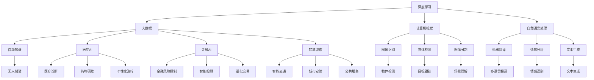
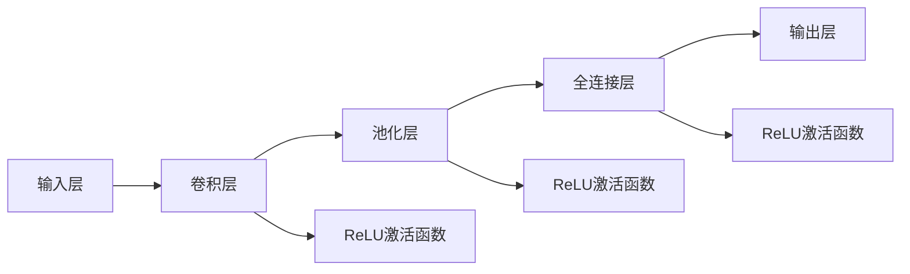
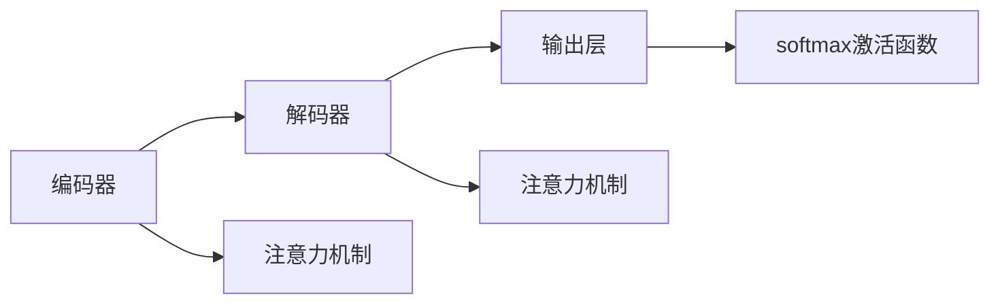

                 

# 李开复：AI 2.0 时代的机遇

> 关键词：人工智能, AI 2.0, 深度学习, 机器学习, 大数据, 自动驾驶, 医疗, 金融, 智慧城市, 创业

## 1. 背景介绍

### 1.1 问题由来

自1956年达特茅斯会议首次提出人工智能(Artificial Intelligence, AI)概念以来，AI技术经历了一个多世纪的发展。从专家系统的兴起、机器学习算法的演进、深度学习的突破，再到当前AI 2.0时代的全面爆发，AI技术已经从实验室走向了工业界，正在以前所未有的速度改变着世界。

AI 2.0时代，即人工智能的第二波革命，以深度学习和大数据为核心的技术在各个领域的应用达到了前所未有的广度和深度。这一波AI浪潮不仅改变了科技公司的业务模式，也在各个垂直行业产生了深远影响。从自动驾驶、医疗诊断到金融风控，AI正在全方位渗透到各行各业，推动着产业的数字化转型。

面对这一波AI浪潮，如何抓住机遇，成为每个企业和个人都必须思考的问题。AI 2.0时代的到来，为各行各业带来了前所未有的挑战和机遇，谁能把握住这一波AI革命的机遇，就能在未来的市场竞争中占据有利地位。

### 1.2 问题核心关键点

AI 2.0时代的核心关键点包括：

- **深度学习与大数据**：深度学习模型和大量数据是当前AI 2.0时代的核心驱动力。
- **跨领域应用**：AI 2.0技术已经深入到各个垂直行业，如自动驾驶、医疗、金融、智慧城市等。
- **人机协同**：AI与人的协同合作，通过自然语言处理(NLP)、计算机视觉(CV)、增强现实(AR)等技术，提升人类的工作效率和体验。
- **伦理与安全**：AI技术的广泛应用带来了伦理和安全的挑战，如数据隐私、算法偏见、自动化导致的失业问题等。
- **创业机会**：AI 2.0时代涌现了大量创业机会，尤其是在数据标注、算法开发、AI平台建设等细分领域。

这些核心关键点共同构成了AI 2.0时代的产业和技术格局，深刻影响着未来十年的技术走向和商业竞争。

## 2. 核心概念与联系

### 2.1 核心概念概述

要全面理解AI 2.0时代的发展趋势和应用前景，需要先了解一些核心概念和它们之间的联系：

- **深度学习**：一种基于神经网络的机器学习方法，通过多层非线性变换，能够从大量数据中学习复杂的特征表示。
- **大数据**：数据规模庞大，结构复杂，需采用分布式计算和算法来处理和分析。
- **计算机视觉**：利用计算机算法处理图像和视频数据，实现图像识别、物体检测、图像分割等任务。
- **自然语言处理**：通过计算机算法处理和理解人类语言，实现机器翻译、情感分析、文本生成等任务。
- **自动驾驶**：结合计算机视觉和深度学习技术，实现无人驾驶汽车，提升交通安全和效率。
- **医疗AI**：利用AI技术辅助医疗诊断、药物研发和个性化治疗，提升医疗服务质量和效率。
- **金融AI**：应用机器学习和深度学习技术，实现金融风险控制、智能投顾和量化交易等，提升金融服务的智能化水平。
- **智慧城市**：结合物联网、云计算和大数据技术，构建智慧城市，提升城市管理和居民生活体验。

这些核心概念构成了AI 2.0时代的技术基础，通过算法和技术的创新，实现了在各个垂直行业的广泛应用。

### 2.2 核心概念原理和架构的 Mermaid 流程图(Mermaid 流程节点中不要有括号、逗号等特殊字符)



## 3. 核心算法原理 & 具体操作步骤

### 3.1 算法原理概述

AI 2.0时代，深度学习和大数据技术是核心驱动力。深度学习模型通过多层非线性变换，可以从数据中学习复杂的特征表示，用于图像识别、自然语言处理等任务。大数据技术提供了大规模、多源、异构的数据集，为深度学习模型的训练提供了坚实的保障。

AI 2.0时代的应用场景广泛，包括自动驾驶、医疗、金融、智慧城市等。这些应用场景都需要大量的标注数据、高效的计算资源和算法优化。深度学习模型在大数据集上的训练，可以显著提升模型的泛化能力和性能。

### 3.2 算法步骤详解

AI 2.0时代的算法开发通常包括以下几个步骤：

1. **数据收集与预处理**：收集大量的标注数据，进行清洗、归一化等预处理操作。
2. **模型设计与训练**：选择合适的深度学习模型和算法，在标注数据集上进行训练。
3. **模型评估与优化**：在验证集上评估模型性能，根据评估结果调整模型参数和算法策略。
4. **部署与集成**：将训练好的模型部署到实际应用中，与其他系统进行集成，实现完整的业务流程。

### 3.3 算法优缺点

AI 2.0时代的算法开发具有以下优点：

- **高精度**：深度学习模型在图像识别、自然语言处理等任务上，已经超越了传统算法，达到了高精度水平。
- **自动化**：大数据和深度学习算法的自动化特性，能够快速生成模型结果，节省了大量的人力成本。
- **可扩展性**：AI 2.0算法具有良好的可扩展性，能够处理大规模、多源数据。

同时，也存在一些缺点：

- **资源消耗高**：深度学习模型和大数据算法对计算资源的需求较高，需要高性能的GPU和TPU。
- **模型复杂度高**：深度学习模型通常具有较高的复杂度，训练和推理速度较慢。
- **可解释性差**：深度学习模型的内部结构复杂，难以进行解释和调试。

### 3.4 算法应用领域

AI 2.0时代的算法应用已经渗透到了各个垂直行业，具体包括：

- **自动驾驶**：利用计算机视觉和深度学习技术，实现无人驾驶汽车，提升交通安全和效率。
- **医疗**：利用AI技术辅助医疗诊断、药物研发和个性化治疗，提升医疗服务质量和效率。
- **金融**：应用机器学习和深度学习技术，实现金融风险控制、智能投顾和量化交易等，提升金融服务的智能化水平。
- **智慧城市**：结合物联网、云计算和大数据技术，构建智慧城市，提升城市管理和居民生活体验。
- **工业制造**：利用AI技术优化生产流程、预测设备故障、提升质量控制，提升制造业的智能化水平。
- **零售电商**：应用机器学习和深度学习技术，实现客户行为分析、推荐系统和库存管理，提升零售电商的效率和用户体验。
- **教育**：利用AI技术实现个性化教育、智能辅导和教育资源推荐，提升教育质量和可及性。

## 4. 数学模型和公式 & 详细讲解 & 举例说明

### 4.1 数学模型构建

AI 2.0时代的算法开发通常使用以下数学模型：

- **卷积神经网络(CNN)**：用于图像识别和计算机视觉任务，通过卷积操作提取局部特征，实现空间信息的全局聚合。
- **递归神经网络(RNN)**：用于自然语言处理任务，通过递归结构处理序列数据，实现时间信息的传递和聚合。
- **长短期记忆网络(LSTM)**：一种特殊的RNN，通过门控机制解决传统RNN的梯度消失问题，适用于长期依赖关系的序列数据。
- **生成对抗网络(GAN)**：通过生成器和判别器之间的对抗训练，生成逼真的图像和文本数据，用于数据增强和生成模型。

### 4.2 公式推导过程

以卷积神经网络为例，介绍其数学模型的构建和推导过程。

卷积神经网络由卷积层、池化层和全连接层构成，其基本结构如图：



卷积层通过卷积操作提取输入数据的局部特征，公式如下：

$$
Y^{[l]} = W^{[l]} * X^{[l-1]} + b^{[l]}
$$

其中 $Y^{[l]}$ 表示第 $l$ 层的输出，$W^{[l]}$ 表示第 $l$ 层的卷积核，$X^{[l-1]}$ 表示第 $l-1$ 层的输出，$b^{[l]}$ 表示第 $l$ 层的偏置项。

池化层通过下采样操作减少数据维度，公式如下：

$$
Y^{[l]} = max(0, X^{[l-1]} * K)
$$

其中 $K$ 表示池化核，$Y^{[l]}$ 表示第 $l$ 层的输出。

全连接层通过线性变换和激活函数，实现高维特征的映射，公式如下：

$$
Y^{[l]} = W^{[l]} * X^{[l-1]} + b^{[l]}
$$

其中 $W^{[l]}$ 表示第 $l$ 层的权重，$X^{[l-1]}$ 表示第 $l-1$ 层的输出，$b^{[l]}$ 表示第 $l$ 层的偏置项。

### 4.3 案例分析与讲解

以自然语言处理中的机器翻译任务为例，介绍基于深度学习模型的翻译算法。

机器翻译任务通常使用序列到序列(Sequence-to-Sequence, Seq2Seq)模型，其核心包含两个部分：编码器和解码器。编码器将源语言序列映射为高维特征向量，解码器通过解码器生成目标语言序列。

Seq2Seq模型的具体架构如图：



编码器通常使用LSTM或GRU等RNN网络，将输入序列映射为高维特征向量，表示源语言的全局语义信息。解码器使用LSTM或GRU等RNN网络，通过注意力机制选择重要的源语言信息，逐步生成目标语言序列。

解码器的输出通过softmax函数映射为目标语言的概率分布，具体公式如下：

$$
P(y|x) = \frac{\exp(\sum_{i=1}^{T}\log(p(y_i|x,x_{<t})))}{\sum_{y\in Y}\exp(\sum_{i=1}^{T}\log(p(y_i|x,x_{<t})))}
$$

其中 $P(y|x)$ 表示目标语言序列的概率分布，$y$ 表示目标语言序列，$x$ 表示源语言序列，$x_{<t}$ 表示源语言序列的前 $t$ 个词。

## 5. 项目实践：代码实例和详细解释说明

### 5.1 开发环境搭建

在进行AI 2.0项目的开发前，需要准备相应的开发环境。以下是使用Python进行PyTorch开发的环境配置流程：

1. 安装Anaconda：从官网下载并安装Anaconda，用于创建独立的Python环境。

2. 创建并激活虚拟环境：
```bash
conda create -n pytorch-env python=3.8 
conda activate pytorch-env
```

3. 安装PyTorch：根据CUDA版本，从官网获取对应的安装命令。例如：
```bash
conda install pytorch torchvision torchaudio cudatoolkit=11.1 -c pytorch -c conda-forge
```

4. 安装TensorFlow：
```bash
conda install tensorflow
```

5. 安装TensorBoard：
```bash
conda install tensorboard
```

6. 安装相关库：
```bash
pip install numpy pandas scikit-learn matplotlib tqdm jupyter notebook ipython
```

完成上述步骤后，即可在`pytorch-env`环境中开始AI 2.0项目的开发。

### 5.2 源代码详细实现

这里我们以基于CNN的图像分类任务为例，给出使用PyTorch进行模型开发的PyTorch代码实现。

首先，定义CNN模型：

```python
import torch
import torch.nn as nn
import torch.optim as optim

class CNNModel(nn.Module):
    def __init__(self):
        super(CNNModel, self).__init__()
        self.conv1 = nn.Conv2d(3, 32, 3, 1)
        self.pool = nn.MaxPool2d(2, 2)
        self.conv2 = nn.Conv2d(32, 64, 3, 1)
        self.fc1 = nn.Linear(64 * 16 * 16, 128)
        self.fc2 = nn.Linear(128, 10)

    def forward(self, x):
        x = self.pool(F.relu(self.conv1(x)))
        x = self.pool(F.relu(self.conv2(x)))
        x = x.view(-1, 64 * 16 * 16)
        x = F.relu(self.fc1(x))
        x = self.fc2(x)
        return x
```

然后，定义训练和评估函数：

```python
from torch.utils.data import DataLoader
from torchvision import datasets, transforms

def train_model(model, device, train_loader, optimizer, criterion, epoch):
    model.train()
    for i, (images, labels) in enumerate(train_loader):
        images, labels = images.to(device), labels.to(device)
        optimizer.zero_grad()
        outputs = model(images)
        loss = criterion(outputs, labels)
        loss.backward()
        optimizer.step()
        if (i+1) % 100 == 0:
            print(f'Epoch [{epoch+1}/{epochs}], Step [{i+1}/{len(train_loader)}], Loss: {loss.item():.4f}')

def evaluate_model(model, device, test_loader, criterion):
    model.eval()
    total_loss = 0
    correct = 0
    with torch.no_grad():
        for images, labels in test_loader:
            images, labels = images.to(device), labels.to(device)
            outputs = model(images)
            loss = criterion(outputs, labels)
            total_loss += loss.item() * images.size(0)
            _, predicted = torch.max(outputs.data, 1)
            correct += (predicted == labels).sum().item()
    print(f'Test Loss: {total_loss/len(test_loader):.4f}, Test Accuracy: {100 * correct/len(test_loader):.2f}%')
```

最后，启动训练流程并在测试集上评估：

```python
from torchvision import datasets, transforms

transform = transforms.Compose([
    transforms.ToTensor(),
    transforms.Normalize((0.5, 0.5, 0.5), (0.5, 0.5, 0.5))
])

train_dataset = datasets.CIFAR10(root='data', train=True, download=True, transform=transform)
test_dataset = datasets.CIFAR10(root='data', train=False, download=True, transform=transform)

train_loader = DataLoader(train_dataset, batch_size=64, shuffle=True)
test_loader = DataLoader(test_dataset, batch_size=64, shuffle=False)

device = torch.device('cuda' if torch.cuda.is_available() else 'cpu')
model = CNNModel().to(device)

criterion = nn.CrossEntropyLoss()
optimizer = optim.SGD(model.parameters(), lr=0.001, momentum=0.9)

epochs = 10
train_model(model, device, train_loader, optimizer, criterion, epochs)
evaluate_model(model, device, test_loader, criterion)
```

以上就是使用PyTorch对CNN模型进行图像分类任务开发的完整代码实现。可以看到，利用PyTorch提供的高级API，可以快速构建和训练CNN模型。

### 5.3 代码解读与分析

让我们再详细解读一下关键代码的实现细节：

**CNNModel类**：
- `__init__`方法：初始化模型的卷积层、池化层、全连接层等关键组件。
- `forward`方法：定义模型的前向传播过程，从输入到输出的完整计算流程。

**train_model函数**：
- 定义模型为训练状态。
- 对每个批次的数据进行前向传播计算loss，并反向传播更新模型参数。
- 每100步打印一次loss值，以便于调试和监控训练进度。

**evaluate_model函数**：
- 定义模型为评估状态。
- 对测试集数据进行前向传播计算loss，并记录总loss和正确预测数量。
- 最后输出测试集的平均loss和准确率。

**训练流程**：
- 定义总训练轮数，启动训练函数进行模型训练。
- 在训练集上进行前向传播计算loss，并反向传播更新模型参数。
- 在测试集上进行评估，输出最终结果。

可以看到，PyTorch提供的高级API和数据处理工具，使得CNN模型的开发和训练变得简单易懂。开发者可以将更多精力放在模型设计和算法优化上，而不必过多关注底层细节。

## 6. 实际应用场景

### 6.1 智能客服系统

基于AI 2.0技术的智能客服系统，已经广泛应用于电信、金融、电商等多个领域。传统客服模式需要大量人力支持，且响应速度和质量难以保证。通过使用AI 2.0技术，可以实现24/7不间断服务，快速响应客户咨询，提升客户满意度。

智能客服系统通常使用自然语言处理技术，将用户输入的文本进行分析和理解，通过预训练的语言模型和微调技术，生成最佳的回复。通过对话数据的标注和微调，模型能够逐渐学习到各个行业特定的客服场景，并提供精准的回复。

### 6.2 金融舆情监测

金融机构需要实时监测市场舆情，以快速应对负面信息传播，规避金融风险。传统的舆情监测方式成本高、效率低，且难以处理海量网络信息。AI 2.0技术可以通过自然语言处理和机器学习技术，实现舆情的实时监测和情感分析，帮助机构及时发现和处理舆情风险。

金融舆情监测系统通常使用情感分析技术，对新闻、评论、社交媒体等文本数据进行情感标注和分析。通过预训练的情感分析模型和微调技术，模型能够自动识别舆情的情感倾向，并在发现负面信息时及时预警。

### 6.3 医疗AI

AI 2.0技术在医疗领域的应用前景广阔，可以辅助医疗诊断、药物研发和个性化治疗。通过深度学习和自然语言处理技术，AI 2.0模型可以读取医疗记录、病理报告、医学文献等大量文本数据，实现病历分析、诊断建议和个性化治疗方案的生成。

医疗AI系统通常使用自然语言处理技术，将病历数据转化为结构化的知识图谱。通过预训练的语言模型和微调技术，模型能够从病历数据中提取出关键信息，并进行分析和推理，生成诊断建议和治疗方案。

### 6.4 未来应用展望

随着AI 2.0技术的不断演进，其在各个垂直行业的应用前景将更加广阔。

- **自动驾驶**：AI 2.0技术可以实现自动驾驶汽车，提升交通安全和效率。通过深度学习和计算机视觉技术，模型能够识别道路标志、行人、车辆等交通元素，实现自动驾驶。
- **智慧城市**：AI 2.0技术可以实现智慧城市的建设，提升城市管理和居民生活体验。通过物联网、云计算和大数据技术，模型能够实现智能交通、智能安防、智能服务等功能。
- **零售电商**：AI 2.0技术可以实现零售电商的智能化，提升用户体验和运营效率。通过深度学习和推荐系统技术，模型能够分析用户行为，生成个性化推荐，优化库存管理。
- **教育**：AI 2.0技术可以实现教育的智能化，提升教育质量和可及性。通过深度学习和自然语言处理技术，模型能够实现智能辅导、个性化教育、教育资源推荐等功能。

## 7. 工具和资源推荐

### 7.1 学习资源推荐

为了帮助开发者系统掌握AI 2.0技术的理论基础和实践技巧，这里推荐一些优质的学习资源：

1. 《深度学习》课程：由吴恩达开设的深度学习课程，系统介绍了深度学习的基本概念和经典模型。

2. 《自然语言处理》课程：由斯坦福大学开设的自然语言处理课程，介绍了自然语言处理的基本概念和常用技术。

3. 《TensorFlow实战》书籍：由Google官方出版的TensorFlow实战书籍，详细介绍了TensorFlow的基本用法和实践技巧。

4. 《Python深度学习》书籍：由Francois Chollet著，介绍了深度学习在Python中的实现和应用。

5. 《动手学深度学习》书籍：由李沐等人编写，结合代码实践，详细介绍了深度学习的基本理论和算法。

通过学习这些资源，相信你一定能够快速掌握AI 2.0技术的精髓，并用于解决实际的NLP问题。

### 7.2 开发工具推荐

高效的开发离不开优秀的工具支持。以下是几款用于AI 2.0项目开发的常用工具：

1. PyTorch：基于Python的开源深度学习框架，提供了丰富的高级API和优化器，支持深度学习和自然语言处理等任务。

2. TensorFlow：由Google主导开发的开源深度学习框架，支持大规模分布式计算，适合高性能计算任务。

3. TensorBoard：TensorFlow配套的可视化工具，可以实时监测模型训练状态，并提供丰富的图表呈现方式。

4. Weights & Biases：模型训练的实验跟踪工具，可以记录和可视化模型训练过程中的各项指标，方便对比和调优。

5. HuggingFace Transformers库：提供了大量的预训练模型和微调样例代码，支持自然语言处理等任务。

6. Jupyter Notebook：支持Python和R等语言的环境，方便进行代码调试和协作开发。

合理利用这些工具，可以显著提升AI 2.0项目的开发效率，加快创新迭代的步伐。

### 7.3 相关论文推荐

AI 2.0技术的发展源于学界的持续研究。以下是几篇奠基性的相关论文，推荐阅读：

1. "ImageNet Classification with Deep Convolutional Neural Networks"：介绍深度卷积神经网络在图像分类任务中的应用，开创了计算机视觉的深度学习时代。

2. "Learning Phrases and Sentences using RNN Encoder-Decoder for Statistical Machine Translation"：介绍基于递归神经网络(即RNN)的序列到序列模型在机器翻译任务中的应用，奠定了NLP的深度学习基础。

3. "Deep Residual Learning for Image Recognition"：介绍残差网络在图像分类任务中的应用，提升了深度网络的训练效果和泛化能力。

4. "Attention is All You Need"：介绍Transformer模型在机器翻译任务中的应用，开创了NLP的Transformer时代。

5. "BERT: Pre-training of Deep Bidirectional Transformers for Language Understanding"：介绍BERT模型在自然语言处理任务中的应用，开创了预训练大模型的时代。

这些论文代表了大规模深度学习技术的发展脉络，通过学习这些前沿成果，可以帮助研究者把握学科前进方向，激发更多的创新灵感。

## 8. 总结：未来发展趋势与挑战

### 8.1 总结

AI 2.0时代的到来，使得深度学习和自然语言处理技术在各个垂直行业得到了广泛应用。从自动驾驶、医疗、金融到智慧城市、零售电商，AI 2.0技术正在全方位渗透到各行各业，推动着产业的数字化转型。

AI 2.0技术在各个领域的应用前景广阔，但同时也面临着诸多挑战。如何在数据、算法、工程、业务等多个维度进行全面优化，才能真正实现AI 2.0技术的落地应用，这是每个开发者和研究者必须思考的问题。

### 8.2 未来发展趋势

未来，AI 2.0技术的发展趋势将包括以下几个方面：

1. **模型规模更大**：随着算力成本的下降和数据规模的扩张，AI 2.0模型的参数量将继续增加，学习到的知识将更加丰富和全面。
2. **算法更加高效**：未来AI 2.0算法将更加高效，能够在更少的计算资源下实现更好的效果。
3. **跨领域应用更广**：AI 2.0技术将在更多领域得到应用，如自动驾驶、智慧城市、医疗健康等。
4. **人机协同更加智能**：AI 2.0技术与人类交互的智能化水平将显著提升，实现更加智能化的协同合作。
5. **伦理和安全更加重要**：AI 2.0技术的发展将更加注重伦理和安全性，确保其应用不会对社会产生负面影响。

### 8.3 面临的挑战

尽管AI 2.0技术已经取得了显著进展，但在应用过程中仍面临诸多挑战：

1. **数据质量和多样性**：AI 2.0模型的训练依赖大量标注数据，数据质量和多样性将直接影响模型的性能。
2. **计算资源和存储**：AI 2.0模型的规模巨大，对计算资源和存储空间的需求较高。
3. **算法复杂性和可解释性**：AI 2.0算法的内部结构复杂，难以进行解释和调试。
4. **伦理和安全问题**：AI 2.0技术的应用可能带来伦理和安全问题，如数据隐私、算法偏见、自动化导致的失业等。
5. **标准化和互操作性**：AI 2.0技术在各个行业的应用需要标准化和互操作性，以便于不同系统之间的协作和集成。

### 8.4 研究展望

未来，AI 2.0技术需要在以下几个方面进行深入研究：

1. **大数据处理技术**：探索更高效的大数据处理技术，降低对计算资源的需求。
2. **深度学习优化算法**：研究更加高效、可解释的深度学习算法，提升模型的性能和可解释性。
3. **多模态数据融合**：研究如何将不同模态的数据进行融合，提升AI 2.0技术的应用效果。
4. **人机协同机制**：探索更加智能的人机协同机制，提升用户交互体验和系统智能化水平。
5. **伦理和安全保障**：研究AI 2.0技术的伦理和安全保障机制，确保其应用不会对社会产生负面影响。

## 9. 附录：常见问题与解答

**Q1：AI 2.0技术是否只适用于大规模企业？**

A: AI 2.0技术的应用并不仅限于大规模企业，中小企业也可以利用AI 2.0技术实现数字化转型。AI 2.0技术提供了丰富的开源资源和工具，如TensorFlow、PyTorch等，使得开发者可以较为轻松地进行项目开发和模型训练。

**Q2：AI 2.0技术是否需要大量的标注数据？**

A: AI 2.0技术的训练确实需要大量的标注数据，但可以通过数据增强、迁移学习等技术进行优化。如果标注数据不足，可以通过数据合成、迁移学习等方法进行补充。

**Q3：AI 2.0技术是否需要高性能的硬件设备？**

A: AI 2.0技术的训练和推理确实需要高性能的硬件设备，如GPU、TPU等。对于大规模模型和任务，可能需要专门的超算资源。

**Q4：AI 2.0技术是否容易维护和部署？**

A: AI 2.0技术的维护和部署需要一定的技术积累，如模型压缩、推理优化、系统集成等。但对于有经验的技术人员，这些工作是可以实现的。

**Q5：AI 2.0技术是否会取代人类？**

A: AI 2.0技术虽然能够自动化执行许多任务，但不会完全取代人类。人类在创新、决策、情感等方面仍具有优势。AI 2.0技术应该被看作是人类的辅助工具，提升人类的工作效率和生活质量。

总之，AI 2.0技术的发展前景广阔，但其应用也面临着诸多挑战。只有不断优化算法、优化资源、优化模型，才能真正实现AI 2.0技术的落地应用，为人类社会的数字化转型带来深远影响。

---

作者：禅与计算机程序设计艺术 / Zen and the Art of Computer Programming

